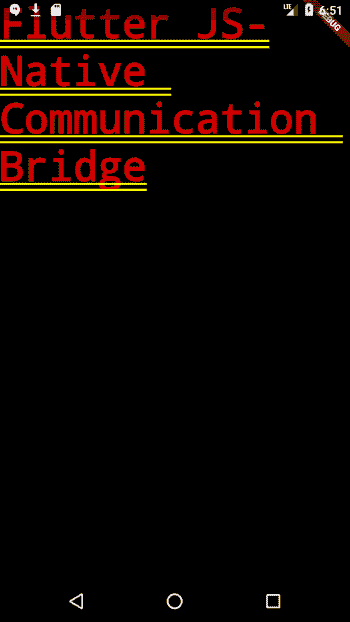
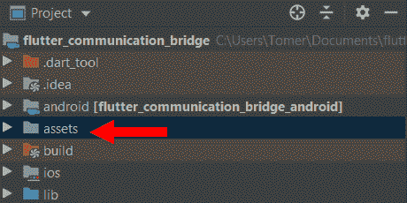
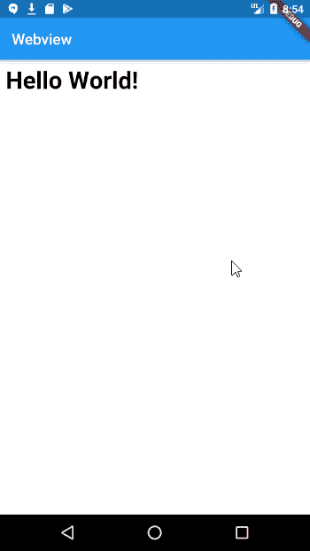
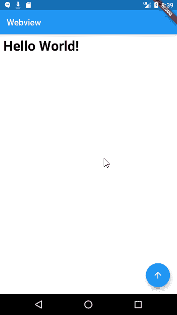
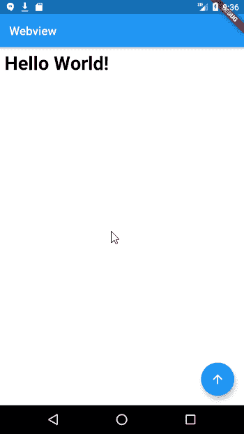

# 如何用 WebView 和 JavaScript 在 Flutter 中搭建原生通信桥

> 原文：<https://www.freecodecamp.org/news/how-to-build-a-native-communication-bridge-in-flutter-with-webview-and-javascript/>

作为我解释如何在 Android 和 iOS 中创建沟通桥梁的文章的后续，我认为对 Flutter 做同样的事情可能是个好主意。

虽然看起来这是一件简单的事情，但是您很快就会意识到要让这个功能正常工作还需要一些工作。

首先，重要的是要意识到(在写这篇文章的时候)Flutter 没有**而不是**内置对嵌入式 WebViews 的支持。

与 Kotlin 或 Swift 中的本地应用程序不同，您只能实例化 WebView 组件，而不能将 WebView 组件添加到现成的 Flutter 应用程序中。

在本文中，我们将介绍如何在 Flutter 应用程序中配置 Webview，以及如何在 Flutter 和 WebView 之间进行通信。

## 如何在 Flutter 应用程序中配置 WebView

在创建一个新的 Flutter 项目后，我们需要使用 [webview_flutter 包](https://pub.dev/packages/webview_flutter)来使用 webview。我们将把依赖项添加到我们的`pubspec.yaml`文件中:

```
dependencies:  
       flutter:    
           sdk: flutter
       webview_flutter: ^1.0.7
```

然后，我们需要在终端中运行`pub get`:

```
flutter pub get
```

接下来，我们将包导入到我们的`main.dart`文件中:

```
import 'package:webview_flutter/webview_flutter.dart';
```

如果您还没有从起始项目中清理代码，现在是这样做的好时机。

在你删除所有的评论，浮动的操作按钮和所有相关的东西后，你会剩下这个(我添加了一个文本部件只是为了展示):

```
import 'dart:convert';

import 'package:flutter/material.dart';
import 'package:webview_flutter/webview_flutter.dart';

void main() {
  runApp(MyApp());
}

class MyApp extends StatelessWidget {
  @override
  Widget build(BuildContext context) {
    return MaterialApp(
      title: 'Communication Bridge',
      theme: ThemeData(
        primarySwatch: Colors.blue,
        visualDensity: VisualDensity.adaptivePlatformDensity,
      ),
      home: MyHomePage(title: 'Native - JS Communication Bridge'),
    );
  }
}

class MyHomePage extends StatefulWidget {
  MyHomePage({Key key, this.title}) : super(key: key);

  final String title;

  @override
  _MyHomePageState createState() => _MyHomePageState();
}

class _MyHomePageState extends State<MyHomePage> {

  WebViewController _controller;

  @override
  Widget build(BuildContext context) {
    return Text(
      "Flutter JS-Native Communication Bridge"
    );
  }
}
```

这会给你这个结果:



### 创建本地 HTML 资源

因为我们将使用一个内嵌 JavaScript 代码的本地 HTML 文件，所以我们需要在我们的项目中创建它。

Flutter 应用程序中的所有本地资产都需要在一个`assets`目录中。

通过右键单击左侧面板并选择 New → Directory，在主项目层次结构中创建一个`assets`目录:



The file hierarchy after creating the asses directory

然后，继续在资产目录中创建`index.html` ，并添加以下代码:

```
<html>

    <head>
        <title>My Local HTML File</title>
    </head>

    <body>
        <h1 id="title">Hello World!</h1>
        <script type="text/javascript">
            function fromFlutter(newTitle) {
                document.getElementById("title").innerHTML = newTitle;
                sendBack();
             }

             function sendBack() {
                messageHandler.postMessage("Hello from JS");
             }
        </script>
    </body>
</html>
```

`index.html`

您会注意到，我们在 html 的 JavaScript 部分编写了两个方法:

1.  是我们将从 Flutter 调用的方法，用一个字符串表示页面的新标题
2.  `sendBack`是我们将调用的与 Flutter 通信的方法。在其中，我们发送一个字符串消息。

我们稍后将讨论 sendBack 的内容，但在此之前，我们必须在应用程序中设置 WebView。

✋:不要忘记在`assets`部分的`pubspec.yaml`后面加上`index.html`(使用正确的缩进):

```
dependencies:
  flutter:
    sdk: flutter
  webview_flutter: ^1.0.7
  cupertino_icons: ^1.0.0

dev_dependencies:
  flutter_test:
    sdk: flutter

flutter:
  uses-material-design: true

  assets:
    - assets/index.html
```

Part of our `pubspec.yaml` file

### 设置网络视图

因为我们已经将包导入到我们的`main.dart`文件中，我们需要用 WebView 小部件替换文本小部件:

```
class _MyHomePageState extends State<MyHomePage> {

  WebViewController _controller;

  @override
  Widget build(BuildContext context) {
    return Scaffold(
      appBar: AppBar(title: Text('Webview')),
      body: WebView(
        initialUrl: 'about:blank',
        onWebViewCreated: (WebViewController webviewController) {
          _controller = webviewController;
          _loadHtmlFromAssets();
        },
      ),
    );
  }

  _loadHtmlFromAssets() async {
    String file = await rootBundle.loadString('assets/index.html');
    _controller.loadUrl(Uri.dataFromString(
        file,
        mimeType: 'text/html',
        encoding: Encoding.getByName('utf-8')).toString());
  }

}
```

我们用一个 Scaffold 小部件包装了 WebView(我们将在本文后面详细讨论)，但是让我们把注意力集中在上面看到的 WebView 小部件的不同字段上:

*   `initialUrl`是我们可以定义 WebView 指向哪个 URL 的地方。这里我们决定不指向任何东西，因为我们要加载我们的本地 HTML 文件
*   `onWebViewCreated`是 WebView 创建后我们从包中得到的回调。因为我们想保存从这个回调中获得的控制器实例，所以我们创建了一个私有成员来存储它，`_controller`

您还会注意到，我们创建了一个名为`_loadHtmlFromAssets`的方法，顾名思义，它会将我们的本地 HTML 文件加载到 WebView 中。

在这个方法中，我们使用我们的私有 WebViewController 实例`_controller`，以及它的公开方法`loadUrl` 来加载我们的本地 HTML 文件。由于该方法中的逻辑，其执行是异步的。

如果我们运行我们的应用程序，我们将得到以下结果:



## 如何从 Flutter 沟通到 WebView

现在让我们添加一些功能来调用我们在本地 HTML 文件中定义的`fromFlutter` 方法。

为此，我们将添加一个浮动动作按钮(或 FAB)到我们的布局中，并连接它的`onPressed`方法来调用`fromFlutter` 方法。

这也是使用 Scaffold 小部件的原因——因此我们可以轻松地添加 FAB:

```
@override
  Widget build(BuildContext context) {
    return Scaffold(
      appBar: AppBar(title: Text('Webview')),
      body: WebView(
        initialUrl: 'about:blank',
        javascriptMode: JavascriptMode.unrestricted,
        onWebViewCreated: (WebViewController webviewController) {
          _controller = webviewController;
          _loadHtmlFromAssets();
        },
      ),
      floatingActionButton: FloatingActionButton(
        child: const Icon(Icons.arrow_upward),
        onPressed: () {
          _controller.evaluateJavascript('fromFlutter("From Flutter")');
        },
      ),
    );
  }
```

为了从 Flutter 调用我们加载的 HTML，我们使用了`evaluateJavascript` 方法。为了能够使用它，我们必须向 WebView 添加另一个名为`javascriptMode`的属性。

在上面的代码中，我们将其设置为无限制。如果我们不设置它，我们将无法在 Flutter 和 WebView 之间进行通信:



## 如何从 WebView 向 Flutter 反馈信息

还记得我说过我们会讨论我们的`sendBack`方法的内容吗？让我们现在就开始吧:

```
function sendBack() {
  messageHandler.postMessage("Hello from JS");
}
```

在`sendBack`方法中，我们使用了一个名为`messageHandler`、**、**的对象和它的附属方法`postMessage`。

就像在本地应用程序中创建一个通信桥一样，一旦建立了通信桥，就向 JavaScript 层中的全局`Window`对象添加了一个用于通信的对象。

只要在从 JavaScript 调用本地应用程序时引用该对象，就可以随意命名该对象。

您可能会问，这个对象是如何添加到我们的应用程序中的 JavaScript 层的？通过向我们的 WebView 小部件添加`JavascriptChannels` 属性:

```
class _MyHomePageState extends State<MyHomePage> {

  WebViewController _controller;
  final GlobalKey<ScaffoldState> _scaffoldKey = new GlobalKey<ScaffoldState>();

  @override
  Widget build(BuildContext context) {
    return Scaffold(
      key: _scaffoldKey,
      appBar: AppBar(title: Text('Webview')),
      body: WebView(
        initialUrl: 'about:blank',
        javascriptMode: JavascriptMode.unrestricted,
        javascriptChannels: Set.from([
          JavascriptChannel(
              name: 'messageHandler',
              onMessageReceived: (JavascriptMessage message) {
               _scaffoldKey.currentState.showSnackBar(
                  SnackBar(
                      content: Text(message)
                  )
                 );
              })
        ]),
        onWebViewCreated: (WebViewController webviewController) {
          _controller = webviewController;
          _loadHtmlFromAssets();
        },
      ),
      floatingActionButton: FloatingActionButton(
        child: const Icon(Icons.arrow_upward),
        onPressed: () {
          _controller.evaluateJavascript('fromFlutter("From Flutter")');
        },
      ),
    );

  }
```

我们已经定义了一个带有名称的`JavascriptChannel`和一个`onMessageReceived`处理程序。我们给这个通道起的名字`messageHandler`，是我们用来从加载到本地层的本地 HTML 文件进行通信的名字。



Great success

对于眼尖的人来说，你可能已经注意到了一个新的私有变量被添加进去了，`_scaffoldKey`。这是因为我们需要向 Scaffold 小部件添加一个键，这样我们就可以显示 snackbar。

您可以在下面获得本文中描述的应用程序的源代码:

[TomerPacific/MediumArticlesA repository that contains code associated with various Medium articles I have written - TomerPacific/MediumArticlesTomerPacificGitHub](https://github.com/TomerPacific/MediumArticles/tree/master/flutter_communication_bridge)

需要注意的最后两点:

1.  [webview _ flutter 包](https://github.com/flutter/flutter/issues/30358)中的预警方法被破坏
2.  要在 iOS 中使用该软件包，您必须将以下密钥添加到您的`info.plist`文件中:`<key>io.flutter.embedded_views_preview</key><string>yes</string>`

如果您想了解更多关于 Flutter 和 WebViews 的信息，以下是一些有用的资源:

*   [WebViews 在 Flutter 中的威力](https://medium.com/flutter/the-power-of-webviews-in-flutter-a56234b57df2)
*   [WebView_Flutter 包](https://pub.dev/packages/webview_flutter)