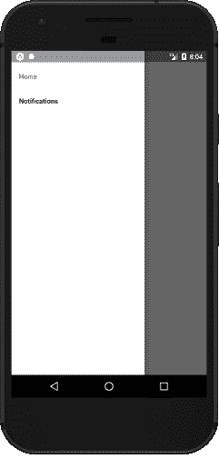
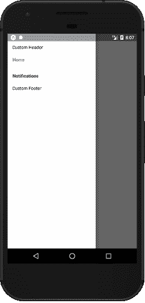
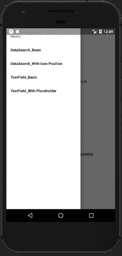
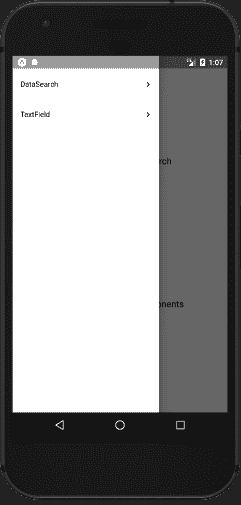
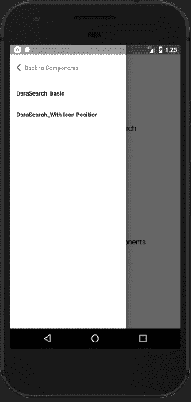
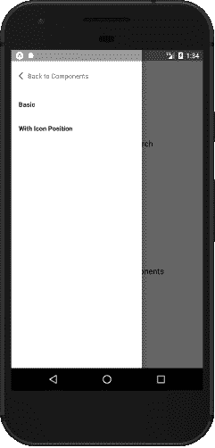
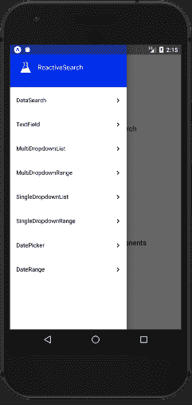

# 如何用 React Native 构建嵌套的抽屉菜单

> 原文：<https://www.freecodecamp.org/news/how-to-build-a-nested-drawer-menu-with-react-native-a1c2fdcab6c9/>

作者:Dhruvdutt Jadhav

# 如何用 React Native 构建嵌套的抽屉菜单

屏幕空间在手机上是一种珍贵的商品。**抽屉菜单**(或“汉堡菜单”)是最受欢迎的导航模式之一，在提供直观导航的同时帮助你保存它。在这篇文章中，我将揭开如何使用 [React Native](https://facebook.github.io/react-native/) 和 [React Navigation](https://reactnavigation.org/) 构建嵌套(多层次)抽屉菜单的神秘面纱。？

Nested Drawers in React Native

在 [**手机**](https://expo.io/@dhruvdutt/native-kitchensink) 上试试现场试玩？或者在 w [eb 上。](https://expo.io/appetize-simulator?url=https://expo.io/@dhruvdutt/native-kitchensink&appetizeCode=pc_0dybu6gxac)？ *️*

### *在 React Native ⚛️导航*

导航是绝大多数生产应用的支柱。导航的外观和感觉对于推动移动应用的使用和参与非常重要。

然而，如果你是 React 本地开发人员，对于构建导航菜单并没有明确的看法。React Native [推荐](https://facebook.github.io/react-native/docs/navigation.html)一堆导航库。根据您的需求，每种方法都有其优势，但是没有一个明确的赢家适合所有的用例。

目前没有一个导航库支持开箱即用的嵌套抽屉。但是其中一个提供丰富 API 来构建定制解决方案的库是[React Navigation](https://reactnavigation.org/)——一个基于 JavaScript 的导航。它得到了 React 本地社区的大力支持和维护。这是我们将在本教程中使用的。

### *用例？️*

我必须构建一个 playground 应用程序来展示 React Native 的 UI 组件库。它由八个不同的组件组成，每个组件支持各种道具，以及 50 多个不同的选项。

*如果没有一个根据所选组件确定选项范围的多层抽屉，就不可能一次显示抽屉内的所有选项。我找不到现成的解决方案，所以我需要建立一个自定义的解决方案。*

### *基地设置？*

*对于基本设置，我假设您已经有了一个 React 本地项目设置，带有 [CRNA](https://facebook.github.io/react-native/docs/getting-started.html) 、 [Expo Kit](https://docs.expo.io/versions/latest/) 或 [React 本地 CLI](https://facebook.github.io/react-native/docs/getting-started.html) 。确保你的 [react-navigation](https://www.npmjs.com/package/react-navigation) 库已经安装了 yarn 或者 npm。我们将从使用导航 API 开始。*

> 如果您不熟悉 React 导航 API，请在继续之前查看[入门指南](https://reactnavigation.org/docs/getting-started.html)。

我们将从一个类似于 React Navigation 的 DrawerNavigator [官方指南](https://reactnavigation.org/docs/drawer-based-navigation.html)中记录的例子开始。我们将创建一个简单的抽屉，它有两个抽屉项目:Home 和 Notifications。

Base Setup

### *自定义抽屉内容*

通过将导航器配置作为第二个参数传递，React Navigation 使所有导航器能够进行大量的定制。我们将使用它来呈现除股票抽屉项目之外的一些定制内容。

*``**DrawerNavigator**(RouteConfigs, DrawerNavigatorConfig)``*

*我们将把一个名为`[contentComponent](https://reactnavigation.org/docs/drawer-navigator.html#drawernavigatorconfig)`的道具传递给 config，这将允许我们为抽屉呈现自定义内容。我们将用它来显示页眉和页脚以及来自`react-navigation`的流行的`[DrawerItems](https://reactnavigation.org/docs/drawer-navigator.html#providing-a-custom-contentcomponent)`。*

DrawerNavigator: Content Component

通过控制抽屉内呈现的内容，这有可能开启许多事情。

### *创建屏幕映射*

我们需要为每个想要展示的组件构建一个嵌套的抽屉。所以让我们首先用 DrawerNavigator 的[配置](https://reactnavigation.org/docs/drawer-navigator.html#drawernavigatorconfig)注册所有的屏幕。我们为组件创建了一个单独的屏幕映射文件。您完全可以有自己的约定，或者直接定义类似于主屏幕组件的对象。

*屏幕映射由具有屏幕属性的简单对象组成。这个`screenMapping`物体看起来像这样:*

*注册所有组件后，抽屉看起来会像这样:*

Registering all components along with child options

这将呈现所有组件及其选项。我们有两个主要组件:[数据搜索](https://opensource.appbase.io/reactive-manual/native/components/datasearch.html)和[文本字段](https://opensource.appbase.io/reactive-manual/native/components/textfield.html)。每个都有选项，如“带图标位置”、“带占位符”等。我们的任务是将这些分离成一个只有组件的列表(DataSearch，TextField)。

### *分组外抽屉*

*我在映射中遵循的模式是使用分隔符`_`将来自一个组件的选项组合在一起。例如，我使用的导航键是“数据搜索 _ 基本”和“数据搜索 _ 带图标位置”。这正是将帮助我们组合像 DataSearch 这样的单个组件的选项。我们将对所有需要展示在外层抽屉中的组件进行独特评估。*

我们将创建一个 util 函数来评估要呈现的外部抽屉列表项。

*该函数将返回一个对象，该对象包含主要组件的唯一组件，如(DataSearch，TextField ),我们将借助于`contentComponent`自定义组件在屏幕上呈现这些组件。我们还将维护一个*布尔值*，以确定在特定时刻抽屉上呈现的内容。*

*`renderMainDrawerComponent`只是一个迭代组件对象的键的函数。它呈现了在 react-native 的简单的`Text`和`View`之上构建的自定义外部抽屉项目。查看完整代码[这里](https://github.com/appbaseio-apps/native-kitchensink/blob/master/src/components/OuterDrawerItem.js)。*

*这会将抽屉渲染成这样:*

Showing only the outer component drawer items

### *渲染子抽屉？*

*现在，我们需要根据点击的组件显示选项。您可能已经注意到，在 utils 中，我们还根据分隔符模式提取组件组的开始和结束索引。*

*例如，数据搜索屏幕从索引 1 开始(索引 0 是主屏幕)，到索引 3 结束。TextField 从 3 开始，到 5 结束。我们将使用这些索引，根据所选组件及其索引，神奇地将传递给`DrawerItems`的`items`切片。*

*现在，在点击数据搜索之后，抽屉会变成这样:*

Child components for a selected component

我们还添加了一个可爱的返回按钮，它基本上切换一个布尔值来呈现主抽屉项目。你可以点击查看完整代码[。](https://github.com/appbaseio-apps/native-kitchensink/blob/master/src/drawers/MainDrawer.js)

现在，剩下要做的唯一一件事就是通过删除多余的组件名称来使抽屉项目看起来更整洁。同样，丰富的 React 导航 API 在这里派上了用场。

*我们可以用`[navigationOptions](https://reactnavigation.org/docs/stack-navigator.html#navigationoptions-used-by-stacknavigator)`传递各种属性。我们这里要用的一个特别的例子是带有屏幕映射的`[title](https://reactnavigation.org/docs/stack-navigator.html#title)`道具。这将让我们删除第一个分隔符之前的部分。因此，“数据搜索 _ 基本”将只显示为“基本”。*

Child drawer items

*就这些。我们可以根据分隔符模式添加任意多的项目。我们构建的 playground 应用程序由八个主要组件和超过 53 个选项组成。*

> *这里是[链接](https://expo.io/@dhruvdutt/native-kitchensink)到最终的应用程序和[代码库](https://github.com/appbaseio-apps/native-kitchensink)。*

### *总结？*

*   ***基地设置**:从[文档](https://reactnavigation.org/docs/drawer-based-navigation.html)中提取导航 hello world。*
*   ***自定义抽屉内容**:用`[contentComponent](https://reactnavigation.org/docs/drawer-navigator.html#providing-a-custom-contentcomponent)`渲染抽屉项目。*
*   ***屏幕映射** : [定义](https://github.com/appbaseio-apps/native-kitchensink/blob/master/src/screenMapping.js)，[登记](https://github.com/appbaseio-apps/native-kitchensink/blob/master/App.js#L14-L15)所有抽屉组件。*
*   ***组外层抽屉** : [读取](https://github.com/appbaseio-apps/native-kitchensink/blob/master/src/utils.js#L1-L20)分隔符样式到[组](https://github.com/appbaseio-apps/native-kitchensink/blob/master/src/drawers/MainDrawer.js#L67-L68)抽屉中的物品。*
*   ***渲染子抽屉** : [切片](https://github.com/appbaseio-apps/native-kitchensink/blob/master/src/drawers/MainDrawer.js#L81)，渲染子抽屉项目。*

### *结论？*

我们学会了用 React Native 构建一个多层次的抽屉菜单。我们使用 React 导航 API 来呈现抽屉内的定制内容组件，并使用分隔符模式进行屏幕映射。使用此模式为抽屉构建任何级别的嵌套或条件呈现。

### *反应搜索？*

*为本地和 Web 平台提供 UI 组件，构建完美的搜索体验。你可以通过玩[游乐场应用](https://expo.io/@dhruvdutt/native-kitchensink)本身或者[创建自己的组件](https://opensource.appbase.io/reactive-manual/native/advanced/reactivecomponent.html)来检查它提供的所有组件。*

*[**appbaseio/React search**](https://github.com/appbaseio/reactivesearch)*
*[*React search-一个 React 和 React 的原生 UI 组件库，用于构建数据驱动的应用*github.com](https://github.com/appbaseio/reactivesearch)*