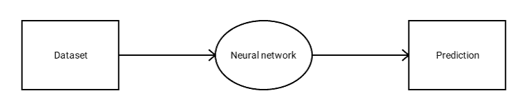
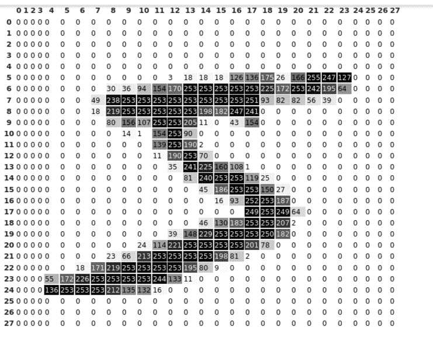
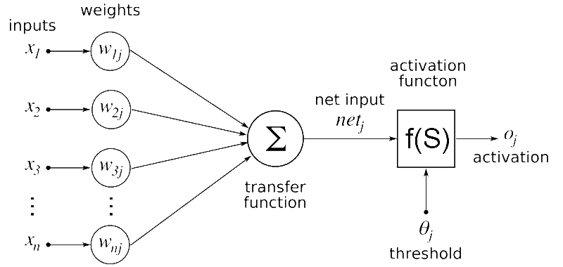
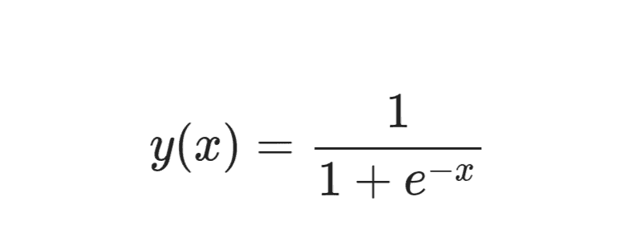
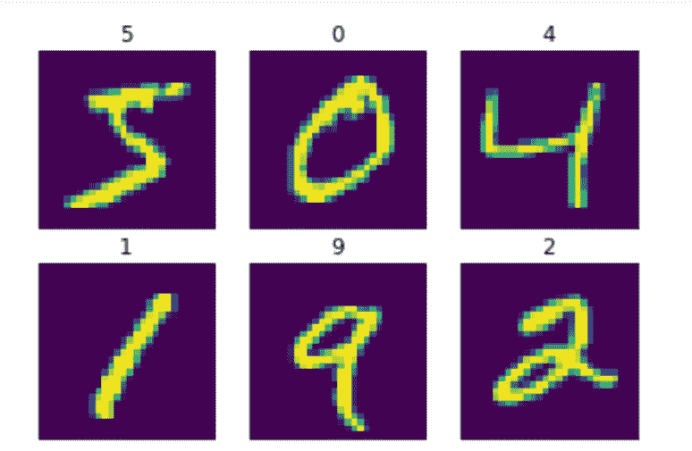
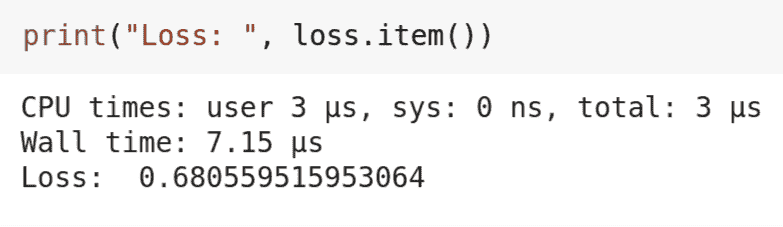

# 如何用 PyTorch 从零开始构建神经网络

> 原文：<https://www.freecodecamp.org/news/how-to-build-a-neural-network-with-pytorch/>

在本文中，我们将深入神经网络，学习如何从头开始构建一个神经网络。

在深度学习中，最让我兴奋的一件事是修补代码，从零开始构建一些东西。然而，这并不是一件容易的事情，教别人如何做就更难了。

我一直在努力完成 Fast.ai 课程，这篇博客极大地受到了我的经历的启发。

不再拖延，让我们开始揭开神经网络神秘面纱的美妙旅程。

## 神经网络是如何工作的？

让我们从理解神经网络的高级工作开始。

神经网络接收数据集并输出预测。就这么简单。



How a neural network works

我给你举个例子。

假设你的一个朋友(他不是一个超级足球迷)指着一张著名足球运动员的旧照片——比如说莱昂内尔·梅西——问你关于他的事情。

你马上就能认出那个足球运动员。原因是你之前看过他一千遍的照片。所以即使照片是旧的或者是在昏暗的光线下拍摄的，你也能认出他。

但是，如果我给你看一张著名棒球运动员的照片(而你以前从未看过一场棒球比赛)，会发生什么呢？您将无法识别该玩家。那样的话，即使画面清晰明亮，你也不会知道是谁。

这与用于神经网络的原理相同。如果我们的目标是建立一个识别猫和狗的神经网络，我们只需向神经网络展示一堆狗和猫的图片。

更具体地说，我们展示狗的神经网络图片，然后告诉它这些是狗。然后给它看猫的照片，识别那些是猫。

一旦我们用猫和狗的图像训练我们的神经网络，它就可以很容易地分类一个图像包含一只猫还是一只狗。简而言之，它能识别猫和狗。

但如果你给我们的神经网络看一张马或鹰的照片，它永远不会识别出是马还是鹰。这是因为它以前从未见过马或鹰的照片，因为我们从未给它看过那些动物。

如果你希望提高神经网络的能力，那么你所要做的就是向它展示你希望神经网络分类的所有动物的图片。截至目前，它只知道猫和狗，其他一无所知。

我们用于训练的数据集很大程度上取决于我们手头的问题。如果你想对一条推文的情绪是积极的还是消极的进行分类，那么你可能会想要一个包含大量推文的数据集，这些推文对应的标签要么是积极的，要么是消极的。

现在，您已经对数据集以及神经网络如何从这些数据中学习有了一个高层次的概述，让我们更深入地了解神经网络是如何工作的。

## 理解神经网络

我们将建立一个神经网络来分类图像中的数字 3 和 7。

但在我们建立神经网络之前，我们需要更深入地了解它们是如何工作的。

我们传递给神经网络的每一张图像都只是一串数字。也就是说，我们的每个图像的大小为 28×28，这意味着它有 28 行和 28 列，就像一个矩阵。

我们将每个数字视为一个完整的图像，但对于神经网络来说，它只是一串从 0 到 255 的数字。

以下是数字五的像素表示:



Pixel values along with shades

正如你在上面看到的，我们有 28 行 28 列(索引从 0 开始，到 27 结束)，就像一个矩阵。神经网络只能看到这些 28×28 的矩阵。

为了显示更多的细节，我只显示了阴影和像素值。如果仔细观察图像，您会发现接近 255 的像素值较暗，而接近 0 的像素值较亮。

在 PyTorch 中，我们不使用矩阵这个术语。相反，我们使用术语张量。PyTorch 中的每个数字都表示为一个张量。所以，从现在开始，我们将使用术语张量代替矩阵。

## 可视化神经网络

神经网络可以有任意数量的神经元和层。

这是神经网络的样子:



Artificial neural network

不要被图中的希腊字母弄糊涂了。我来给你分析一下:

以基于包含患者姓名、体温、血压、心脏状况、月薪和年龄的数据集来预测患者是否会存活为例。

在我们的数据集中，只有体温、血压、心脏状况和年龄对预测患者能否存活有重要意义。因此，我们将为这些值分配较高的权重值，以显示较高的重要性。

但是像病人的名字和月薪这样的特征对病人的存活率几乎没有影响。因此，我们为这些特征分配较小的权重值，以显示较低的重要性。

在上图中，x1，x2，x3...xn 是我们的数据集中的特征，在图像数据的情况下可以是像素值，或者是像上述例子中的血压或心脏状况这样的特征。

特征值乘以相应的权重值，称为 w1j、w2j、w3j...wnj。相乘后的值相加并传递到下一层。

最佳权重值是在神经网络的训练期间学习的。权重值以最大化正确预测数量的方式不断更新。

在我们的例子中，激活函数只不过是 sigmoid 函数。我们传递给 sigmoid 的任何值都被转换为 0 到 1 之间的值。我们只是将 sigmoid 函数放在神经网络预测的顶部，以获得 0 和 1 之间的值。

一旦我们开始建立我们的神经网络模型，你就会明白乙状结肠层的重要性。

有很多其他的激活函数甚至比 sigmoid 更容易学习。

这是 sigmoid 函数的方程式:



Sigmoid function

图中的圆形节点称为神经元。在神经网络的每一层，权重与输入数据相乘。

我们可以通过增加层数来增加神经网络的深度。我们可以通过增加一层中神经元的数量来提高该层的容量。

## 了解我们的数据集

为了训练我们的神经网络，我们首先需要的是数据集。

由于我们的神经网络的目标是分类一幅图像是否包含数字 3 或 7，所以我们需要用 3 和 7 的图像来训练我们的神经网络。所以，让我们建立我们的数据集。

幸运的是，我们不必从头开始创建数据集。我们的数据集已经存在于 PyTorch 中。我们所要做的只是下载它，并对它进行一些基本的操作。

我们需要从 PyTorch 的 torchvision 库下载一个名为[**【MNIST】**](http://yann.lecun.com/exdb/mnist/)**(修改后的国家标准与技术研究院)的数据集。**

**现在让我们更深入地挖掘我们的数据集。**

### **什么是 MNIST 数据集？**

**MNIST 数据集包含从 0 到 9 的手写数字及其相应的标签，如下所示:**

**

MNIST data set** 

**所以，我们所做的只是简单地将数字的图像和它们相应的标签输入神经网络，告诉神经网络这是一个 3 或 7。**

## **如何准备我们的数据集**

**下载的 MNIST 数据集具有图像和它们相应的标签。**

**我们只需编写代码来索引标签为 3 或 7 的图像。因此，我们得到了一个由 3 和 7 组成的数据集。**

**首先，让我们导入所有必需的库。**

```
`import torch
from torchvision import datasets
import matplotlib.pyplot as plt`
```

**Import the libraries **

**如前所述，我们导入 PyTorch 库来构建神经网络，导入 torchvision 库来下载 MNIST 数据集。Matplotlib 库用于显示数据集中的图像。**

**现在，让我们准备我们的数据集。**

```
`mnist = datasets.MNIST('./data', download=True)

threes = mnist.data[(mnist.targets == 3)]/255.0
sevens = mnist.data[(mnist.targets == 7)]/255.0

len(threes), len(sevens)`
```

**Preparing the data set**

**正如我们在上面学到的，PyTorch 中的所有东西都表示为张量。所以我们的数据集也是张量的形式。**

**我们下载第一行的数据集。我们只索引出目标值等于 3 或 7 的图像，并通过除以 255 来归一化它们，并分别存储它们。**

**我们可以通过运行最后一行中的代码来检查我们的索引是否正确完成，该代码给出了 3 和 7 张量中的图像数量。**

**现在让我们检查一下我们是否正确地准备了数据集。**

```
`def show_image(img):
  plt.imshow(img)
  plt.xticks([])
  plt.yticks([])
  plt.show()

show_image(threes[3])
show_image(sevens[8])`
```

**Check the indexed images**

**使用 Matplotlib 库，我们创建一个函数来显示图像。**

**让我们通过打印张量的形状来做一个快速的检查。**

```
`print(threes.shape, sevens.shape)`
```

**Check the size of the tensors**

**如果一切顺利，你将分别得到大小为([6131，28，28])和([6265，28，28])的三和七。这意味着我们有 6131 个 28×28 大小的三人组图像和 6265 个 28×28 大小的七人组图像。**

**我们已经用三和七的图像创建了两个张量。现在我们需要将它们组合成一个单一的数据集，输入到我们的神经网络中。**

```
`combined_data = torch.cat([threes, sevens])
combined_data.shape`
```

**Concatenate the tensors**

**我们将使用 PyTorch 连接这两个张量，并检查组合数据集的形状。**

**现在我们将数据集中的图像展平。**

```
`flat_imgs = combined_data.view((-1, 28*28))
flat_imgs.shape`
```

**Flatten the images**

**我们将以这样的方式展平图像，使得每个 28×28 大小的图像成为具有 784 列的单行(28×28=784)。因此，形状被转换为([12396，784])。**

**我们需要创建与组合数据集中的图像相对应的标签。**

```
`target = torch.tensor([1]*len(threes)+[2]*len(sevens))
target.shape`
```

**Create ground truth labels**

**我们为包含 3 的图像指定标签 1，为包含 7 的图像指定标签 0。**

## **如何训练你的神经网络**

**要训练你的神经网络，请遵循以下步骤。**

### **步骤 1:构建模型**

**下面你可以看到显示神经网络如何工作的最简单的等式:**

****y = Wx + b****

**这里的‘y’指的是我们的预测，也就是三个或者七个。“w”指的是我们的权重值，“x”指的是我们的输入图像，“b”是偏差(它与权重一起有助于进行预测)。**

**简而言之，我们将每个像素值与权重值相乘，并将它们添加到偏移值。**

**权重和偏差值决定了进行预测时每个像素值的重要性。**

**我们将三级和七级分类，因此我们只有两个类别可以预测。**

**所以，如果图像是 3，我们可以预测 1，如果图像是 7，我们可以预测 0。我们从那一步得到的预测可能是任何实数，但是我们需要让我们的模型(神经网络)预测一个介于 0 和 1 之间的值。**

**这允许我们创建 0.5 的阈值。也就是说，如果预测值小于 0.5，那么它就是 7。否则就是三。**

**我们使用一个 sigmoid 函数来获得一个介于 0 和 1 之间的值。**

**我们将使用前面显示的相同等式为 sigmoid 创建一个函数。然后我们将神经网络的值传入乙状结肠。**

**我们将创建一个单层神经网络。**

**我们不能创建大量的循环来将每个权重值与图像中的每个像素相乘，因为这非常昂贵。所以我们可以用一个魔术，用矩阵乘法，把整个乘法一气呵成。**

```
`def sigmoid(x): return 1/(1+torch.exp(-x))

def simple_nn(data, weights, bias): return sigmoid((data@weights) + bias)`
```

**Defining the neural network**

### **步骤 2:定义损失**

**现在，我们需要一个损失函数来计算我们的预测值与地面真实值相差多少。**

**举个例子，如果预测值是 0.3 但是地面真实值是 1，那么我们的损失就很大。因此，我们的模型将试图通过更新权重和偏差来减少这种损失，以便我们的预测变得接近地面真相。**

**我们将使用均方差来检查损失值。均方误差求预测值和地面真实值之差的平方的平均值。**

```
`def error(pred, target): return ((pred-target)**2).mean()`
```

**Defining the loss**

### **步骤 3:初始化权重值**

**我们只是随机初始化权重和偏差。稍后，我们将看到如何更新这些值以获得最佳预测。**

```
`w = torch.randn((flat_imgs.shape[1], 1), requires_grad=True)
b = torch.randn((1, 1), requires_grad=True)`
```

**Initialize the parameters**

**权重值的形状应采用以下形式:**

**(前一层的神经元数量，下一层的神经元数量)**

**我们使用一种称为梯度下降的方法来更新我们的权重和偏差，以做出最大数量的正确预测。**

**我们的目标是优化或减少我们的损失，所以最好的方法是计算梯度。**

**我们需要对每一个权重和偏差对损失函数求导。然后我们必须从我们的权重和偏差中减去这个值。**

**这样，我们的权重和偏差值以这样的方式更新，使得我们的模型做出良好的预测。**

**为优化函数而更新参数并不是一件新鲜事——您可以使用梯度优化任何任意函数。**

**我们将一个特殊参数(称为 requires_grad)设置为 true，以计算权重和偏差的梯度。**

### **步骤 4:更新权重**

**如果我们的预测与事实不符，那就意味着我们做了错误的预测。这意味着我们的重量不正确。所以我们需要更新我们的权重，直到我们得到好的预测。**

**为此，我们将上述所有步骤放在一个 For 循环中，并允许它迭代任意次。**

**在每次迭代中，计算损失，并更新权重和偏差，以在下一次迭代中获得更好的预测。**

**因此，通过找到适合我们手头任务的最佳权重值，我们的模型在每次迭代后都会变得更好。**

**每个任务需要一组不同的权重值，所以我们不能指望我们为动物分类而训练的神经网络在乐器分类上表现良好。**

**这是我们模型训练的样子:**

```
`for i in range(2000):
  pred = simple_nn(flat_imgs, w, b)
  loss = error(pred, target.unsqueeze(1))
  loss.backward()

  w.data -= 0.001*w.grad.data
  b.data -= 0.001*b.grad.data

  w.grad.zero_()
  b.grad.zero_()

print("Loss: ", loss.item())`
```

**Training the model**

**我们将计算预测值，并通过调用我们之前创建的函数将其存储在“pred”变量中。然后我们计算均方误差损失。**

**然后，我们将计算权重和偏差的所有梯度，并使用这些梯度更新值。**

**我们将梯度乘以 0.001，这叫做学习率。这个值决定了我们的模型将学习的速率，如果太低，那么模型将学习得很慢，或者换句话说，损失将慢慢减少。**

**如果学习率太高，我们的模型将不会稳定，在大范围的损失值之间跳跃。这意味着它将无法收敛。**

**我们做上述步骤 2000 次，每次我们的模型都试图通过更新权重和偏差值来减少损失。**

**我们应该在每个循环或时期结束时将梯度清零，这样就不会在内存中积累不需要的梯度，从而影响我们模型的学习。**

**由于我们的模型非常小，所以训练 2000 个纪元或迭代并不需要太多时间。经过 2000 个纪元后，我们的神经网络给出了 0.6805 的损失值，这对于这样一个小模型来说是不错的。**

**

Final result** 

## **结论**

**我们刚刚创建的模型还有很大的改进空间。**

**这只是一个简单的模型，您可以通过增加层数、每层神经元的数量或增加纪元的数量来进行实验。**

**简而言之，机器学习就是运用数学的一大堆魔法。永远学习基础概念——它们可能很无聊，但最终你会明白那些无聊的数学概念创造了这些尖端技术，如 [deepfakes](https://en.wikipedia.org/wiki/Deepfake) 。**

**你可以在 [GitHub](https://github.com/bipinKrishnan/ML_from_scratch/blob/master/neural_network_pytorch.ipynb) 上获得完整的代码，或者在 [Google colab](https://colab.research.google.com/github/bipinKrishnan/ML_from_scratch/blob/master/neural_network_pytorch.ipynb) 上玩代码。**