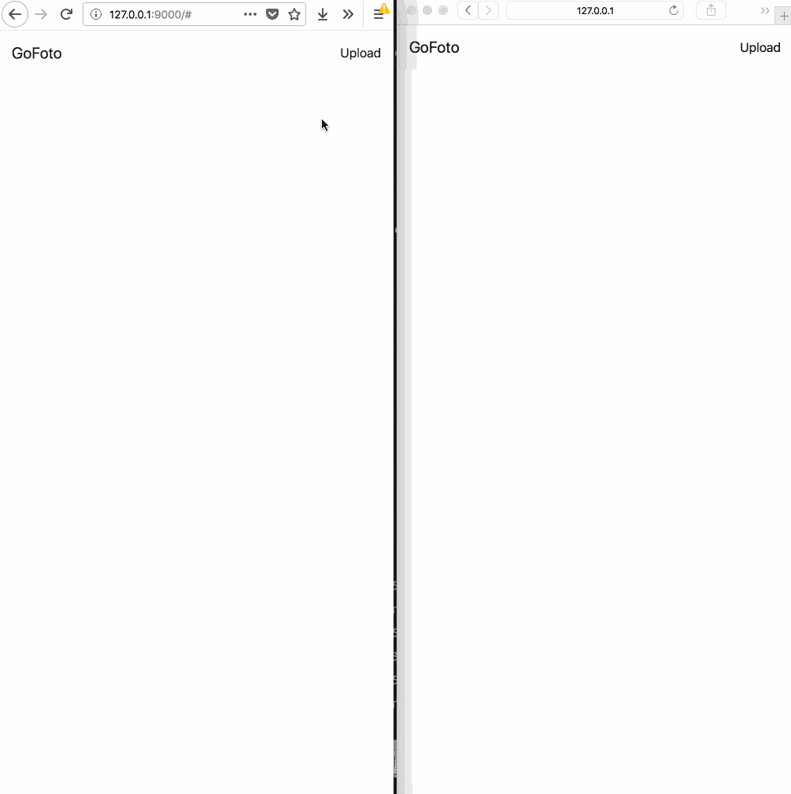
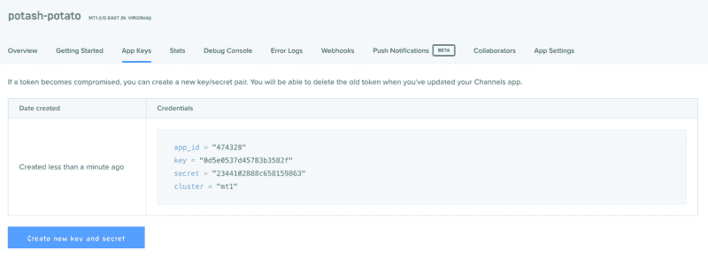
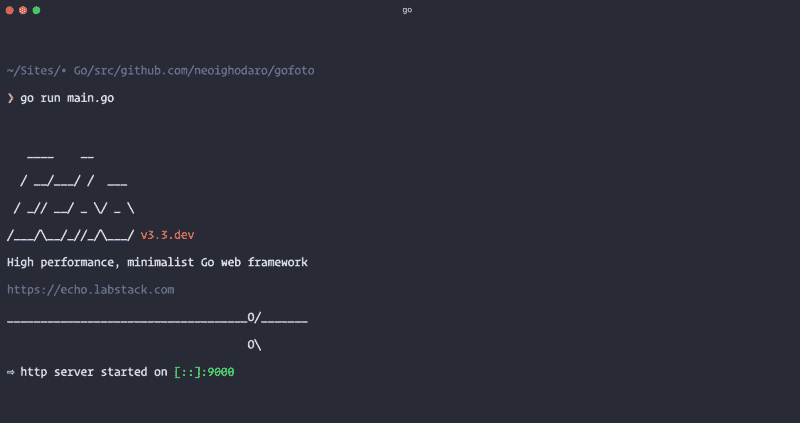

# 如何使用 Go 和 Vue.js 构建照片源

> 原文：<https://www.freecodecamp.org/news/how-to-build-a-photo-feed-with-go-and-vue-js-9d7f7f39c1b4/>

作者:尼奥·伊戈达罗

许多社交媒体应用程序允许用户上传照片，并在时间轴上显示出来，让他们的关注者看到。

在过去，你必须手动刷新你的订阅源才能看到上传到时间线上的新照片。然而，借助现代网络技术，您可以实时看到更新，而不必手动刷新页面。

在本文中，我们将考虑如何使用 Pusher Channels、GO 和 little Vue.js 构建实时照片馈送。 [Pusher Channels](https://pusher.com) 帮助您“使用我们托管的发布/订阅消息 API，在您的 web &移动应用中轻松构建可扩展的应用内通知、聊天、实时图表、地理跟踪等”

这是我们将构建的预览:



### 先决条件

在我们开始构建应用程序之前，请确保您已经:

*   [Go](https://golang.org/) 编程语言的基础知识。
*   基础 JavaScript (Vue.js)知识。
*   Go(版本> = 0.10.x)安装在您的计算机上。查看安装界面。
*   计算机上安装的 SQLite(版本> = 3.x)。查看一个安装界面。

让我们开始吧。

### 获得推广渠道应用

第一步将是获得一个推广渠道的应用。我们需要应用程序凭证来使我们的实时特性工作。

去 Pusher 网站创建一个帐户。创建帐户后，您应该创建一个新的应用程序。遵循应用程序创建向导，然后您应该获得您的应用程序凭证，我们将在本文后面使用它。



现在我们已经有了应用程序，让我们进入下一步

### 创建我们的 Go 应用程序

我们要做的下一件事是创建 Go 应用程序。在您的终端中，`cd`到您的`$GOPATH`并在那里创建一个新目录。

```
$ cd $GOPATH/src$ mkdir gofoto$ cd gofoto
```

？建议您将项目的源代码放在 s `rc` 子目录中(例如＄`GOPATH/src/your_project` 或＄`GOPATH/src/github.com/your_github_username/your_project.`)

接下来，我们将创建一些目录来组织我们的应用程序:

```
$ mkdir database$ mkdir public$ mkdir public/uploads
```

这将创建一个`database`和`public`目录，并在公共目录中创建一个`uploads`目录。我们将把数据库文件存储在`database`目录中。我们将把我们的公共文件(HTML 和图片)保存在`public`和`uploads`目录中。

在已创建的`public`目录中创建一个新的`index.html`文件。

现在让我们为本文创建第一个(也是唯一一个)Go 文件。我们将把所有的源代码放在一个文件中，这样一切都会变得简单。在项目根目录下创建一个`main.go`文件。

在文件中粘贴以下内容:

```
package main
```

```
import (    "database/sql"    "io"    "net/http"    "os"
```

```
 "github.com/labstack/echo"    "github.com/labstack/echo/middleware"
```

```
 _ "github.com/mattn/go-sqlite3"    pusher "github.com/pusher/pusher-http-go")
```

这将导入一些我们将需要在我们的照片饲料工作的包。我们需要`database/sql`来运行 SQL 查询。`io`和`os`包用于文件上传过程，`net/http`包用于我们的 HTTP 状态代码。

我们有一些其他的外部包我们进口。

`labstack/echo`包是我们将要使用的 [Echo 框架](https://github.com/labstack/echo)。我们还有用于 SQLite 的`mattn/go-sqlite3`包。最后，我们导入了`pusher/pusher-http-go`包，我们将使用它来触发推送通道的事件。

### 导入外部 Go 包

在我们继续之前，让我们使用我们的终端来获取这些包。运行以下命令来拉入包:

```
$ go get github.com/labstack/echo$ go get github.com/labstack/echo/middleware$ go get github.com/mattn/go-sqlite3$ go get github.com/pusher/pusher-http-go
```

请注意，当完成软件包安装时，上面的命令不会返回任何确认输出。如果你想确认软件包确实被安装了，你可以检查一下`$GOPATH/src/github.com`目录。

现在我们已经引入了我们的包，让我们创建`main`函数。这是我们应用程序的入口点。在此功能中，我们将设置应用程序数据库、中间件和路由。

打开`main,go`文件并粘贴以下代码:

```
func main() {    db := initialiseDatabase("database/database.sqlite")
```

```
 migrateDatabase(db)
```

```
 e := echo.New()
```

```
 e.Use(middleware.Logger())    e.Use(middleware.Recover())
```

```
 e.File("/", "public/index.html")    e.GET("/photos", getPhotos(db))    e.POST("/photos", uploadPhoto(db))    e.Static("/uploads", "public/uploads")
```

```
 e.Logger.Fatal(e.Start(":9000"))}
```

在上面的代码中，我们使用数据库文件的文件路径实例化了我们的数据库。如果 SQLite 文件尚不存在，这将创建它。然后我们运行迁移数据库的`migrateDatabase`函数。

接下来，我们实例化 Echo，然后注册一些中间件。

[日志记录中间件](https://echo.labstack.com/middleware/logger)有助于记录关于 HTTP 请求的信息。[恢复中间件](https://echo.labstack.com/middleware/recover)“从链中任何地方的混乱中恢复，打印堆栈跟踪，并将控制处理给集中式[httperrhandler](https://echo.labstack.com/guide/customization#http-error-handler)

然后，我们设置一些路由来处理我们的请求。第一个处理程序是`File`处理程序。我们用它来服务于`index.html`文件。这将是从前端到应用程序的入口点。

我们还有接受`POST`和`GET`请求的`/photos`路由。我们需要这些路由充当用于上传和显示照片的 API 端点。

最后的处理程序是`Static`。我们用它来返回存储在`/uploads`目录中的静态文件。

我们最后使用`e.Start`来启动运行在端口 9000 上的 Go web 服务器。端口不是一成不变的，您可以选择任何您喜欢的可用和未使用的端口。

在这一点上，我们还没有创建我们在`main`函数中引用的大部分函数，所以让我们现在就这样做。

### 创建我们的数据库管理功能

在`main`函数中，我们引用了一个`initialiseDatabase`和`migrateDatabase`函数。让我们现在创建它们。在`main.go`文件中，将以下函数粘贴在`main`函数上方:

```
func initialiseDatabase(filepath string) *sql.DB {    db, err := sql.Open("sqlite3", filepath)
```

```
 if err != nil || db == nil {        panic("Error connecting to database")    }
```

```
 return db}
```

```
func migrateDatabase(db *sql.DB) {    sql := `        CREATE TABLE IF NOT EXISTS photos(                id INTEGER NOT NULL PRIMARY KEY AUTOINCREMENT,                src VARCHAR NOT NULL        );    `
```

```
 _, err := db.Exec(sql)
```

```
 if err != nil {        panic(err)    }}
```

在`initialiseDatabase`函数中，我们使用数据库文件创建一个 SQLite 数据库实例，并返回该实例。在`migrateDatabase`函数中，我们使用前面函数中返回的数据库实例来执行迁移 SQL。

让我们为照片和照片集创建数据结构。

### 创建我们的数据结构

我们要做的下一件事是为我们的对象类型创建数据结构。我们将创建一个`Photo`结构和一个`PhotoCollection`结构。`Photo`结构将定义如何表示一张典型的照片，而`PhotoCollection`将定义如何表示一组照片。

打开`main.go`文件，将以下代码粘贴到`initialiseDatabase`函数上方:

```
type Photo struct {    ID  int64  `json:"id"`    Src string `json:"src"`}
```

```
type PhotoCollection struct {    Photos []Photo `json:"items"`}
```

### 创建我们的路由处理函数

接下来，让我们为我们的路线创建函数。打开`main.go`文件，将以下文件粘贴到其中:

```
func getPhotos(db *sql.DB) echo.HandlerFunc {    return func(c echo.Context) error {        rows, err := db.Query("SELECT * FROM photos")
```

```
 if err != nil {            panic(err)        }
```

```
 defer rows.Close()
```

```
 result := PhotoCollection{}
```

```
 for rows.Next() {            photo := Photo{}
```

```
 err2 := rows.Scan(&photo.ID, &photo.Src)
```

```
 if err2 != nil {                panic(err2)            }
```

```
 result.Photos = append(result.Photos, photo)        }
```

```
 return c.JSON(http.StatusOK, result)    }}
```

```
func uploadPhoto(db *sql.DB) echo.HandlerFunc {    return func(c echo.Context) error {        file, err := c.FormFile("file")
```

```
 if err != nil {            return err        }
```

```
 src, err := file.Open()
```

```
 if err != nil {            return err        }
```

```
 defer src.Close()
```

```
 filePath := "./public/uploads/" + file.Filename
```

```
 fileSrc := "http://127.0.0.1:9000/uploads/" + file.Filename
```

```
 dst, err := os.Create(filePath)
```

```
 if err != nil {            panic(err)        }
```

```
 defer dst.Close()
```

```
 if _, err = io.Copy(dst, src); err != nil {            panic(err)        }
```

```
 stmt, err := db.Prepare("INSERT INTO photos (src) VALUES(?)")
```

```
 if err != nil {            panic(err)        }
```

```
 defer stmt.Close()
```

```
 result, err := stmt.Exec(fileSrc)
```

```
 if err != nil {            panic(err)        }
```

```
 insertedId, err := result.LastInsertId()
```

```
 if err != nil {            panic(err)        }
```

```
 photo := Photo{            Src: fileSrc,            ID:  insertedId,        }
```

```
 return c.JSON(http.StatusOK, photo)    }}
```

在`getPhotos`方法中，我们只是运行查询从数据库中获取所有照片，并将它们作为 JSON 响应返回给客户端。

在`uploadPhoto`方法中，我们首先获取要上传的文件，然后将它们上传到服务器，然后我们运行查询，用新上传的照片在`photos`表中插入一条新记录。我们还从该函数返回一个 JSON 响应。

### 向我们的 Go 应用程序添加实时支持

我们要做的下一件事是当一张新照片上传到服务器时触发一个事件。为此，我们将使用 [Pusher Go HTTP 库](https://github.com/pusher/pusher-http-go)。

在`main.go`文件中，将以下内容粘贴到`Photo`和`PhotoCollection`的类型定义上方:

```
var client = pusher.Client{    AppId:   "PUSHER_APP_ID",    Key:     "PUSHER_APP_KEY",    Secret:  "PUSHER_APP_SECRET",    Cluster: "PUSHER_APP_CLUSTER",    Secure:  true,}
```

这将创建一个新的 Pusher 客户端实例。然后，我们可以使用这个实例来触发对我们想要的不同通道的通知。记得用之前创建 Pusher 应用程序时提供的密钥替换`PUSHER_APP_*`密钥。

接下来，转到`main.go`文件中的`uploadPhoto`函数，在函数底部的`return`语句之前，粘贴以下代码:

```
client.Trigger("photo-stream", "new-photo", photo)
```

这是在新照片上传到我们的应用程序时触发新事件的代码。

这就是我们 Go 应用程序的全部内容。此时，您可以构建您的应用程序，并使用`go build`命令将其编译成二进制文件。然而，对于本教程，我们将只是暂时运行二进制文件:

```
$ go run main.go
```



### 构建我们的前端

接下来我们要做的是构建我们的前端。我们将使用 [Vue.js 框架](https://vuejs.org/)和 [Axios 库](https://github.com/axios/axios)来发送请求。

打开`index.html`文件，在其中粘贴以下代码:

```
<!doctype html><html lang="en"><head>    <meta charset="utf-8">    <meta name="viewport" content="width=device-width, initial-scale=1, shrink-to-fit=no">    <link rel="stylesheet" href="https://stackpath.bootstrapcdn.com/bootstrap/4.1.1/css/bootstrap.min.css">    <title>Photo Feed</title>    <style type="text/css">        #photoFile { display: none; }        #app img { max-width: 100%; }        .image-row { margin: 20px 0; }        .image-row .thumbnail { padding: 2px; border: 1px solid #d9d9d9; }    </style></head><body>    <div id="app">        <nav class="navbar navbar-expand-lg navbar-light bg-light">            <a class="navbar-brand" href="#">GoFoto</a>            <div>                <ul class="navbar-nav mr-auto">                    <li class="nav-item active">                        <a class="nav-link" v-on:click="filePicker" href="#">Upload</a>                        <input type="file" id="photoFile" ref="myFiles" @change="upload" name="file" />                    </li>                </ul>            </div>        </nav>        <div class="container">            <div class="row justify-content-md-center" id="loading" v-if="loading">                <div class="col-xs-12">                    Loading photos...                </div>            </div>            <div class="row justify-content-md-center image-row" v-for="photo in photos">                <div class="col col-lg-4 col-md-6 col-xs-12">                                    </div>            </div>        &lt;/div>    </div>    <script src="//js.pusher.com/4.0/pusher.min.js"></script>    <script src="https://unpkg.com/axios/dist/axios.min.js"></script>    <script src="https://cdn.jsdelivr.net/npm/vue@2.5.16/dist/vue.js"></script></body></html>
```

在上面的 HTML 文件中，我们已经定义了图片流的设计。我们使用 Bootstrap 4，并且在上面的 HTML 中包含了 CSS。

我们还使用 Axios 库、Pusher 库和 Vue 框架。我们在 HTML 文档的底部包含了脚本的链接。

接下来，让我们添加 Vue.js 代码。在 HTML 文件中，在结束的`body`标记之前添加以下代码:

```
<script type="text/javascript">    new Vue({        el: '#app',        data: {            photos: [],            loading: true,        },        mounted() {            const pusher = new Pusher('PUSHER_APP_KEY', {                cluster: 'PUSHER_APP_CLUSTER',                encrypted: true            });
```

```
 let channel = pusher.subscribe('photo-stream')
```

```
 channel.bind('new-photo', data => this.photos.unshift(data));
```

```
 axios.get('/photos').then(res => {                this.loading = false                this.photos = res.data.items ? res.data.items : []            })        },        methods: {            filePicker: function () {                let elem = document.getElementById('photoFile');
```

```
 if (elem && document.createEvent) {                    let evt = document.createEvent("MouseEvents");                    evt.initEvent("click", true, false);                    elem.dispatchEvent(evt);                }            },            upload: function () {                let data = new FormData();
```

```
 data.append('file', this.$refs.myFiles.files[0]);                axios.post('/photos', data).then(res => console.log(res))            }        }    });</script>
```

上面我们创建了一个 Vue 实例并存储了属性`photos`和`loading`。`photos`属性存储照片列表，`loading`只保存一个布尔值，表明照片是否正在加载。

在`mounted`方法中，我们创建了 Pusher 库的一个实例。然后我们在`photo-stream`频道收听`new-photo`事件。当事件被触发时，我们将事件中的新照片添加到`photos`列表中。我们还向`/photos`发送 GET 请求，从 API 中获取所有照片。将`PUSHER_APP_*`键更换为推杆仪表板上的键。

在`methods`属性中，我们添加了一些方法。当按下 UI 上的“上传”按钮时，触发`filePicker`。它触发一个文件选择器，允许用户上传照片。`upload`方法获取上传的文件，并将带有该文件的 POST 请求发送给 API 进行处理。

前端就这些了。您可以保存该文件，然后转到您的 web 浏览器。请访问 http://127.0.0.1:9000 查看您的应用程序的运行情况。

这是它将再次呈现的样子:


### 结论

在本文中，我们已经演示了如何在 Go 应用程序中使用推送通道来为应用程序提供实时特性。

从上面的代码示例可以看出，使用推送通道非常容易。查看[文档](https://pusher.com/docs)了解使用推送通道向用户提供实时功能的其他方式。

这个应用程序的源代码可以在 [GitHub](https://github.com/neoighodaro/realtime-photofeed-pusher-go) 上找到。

本文首发于[推手](https://pusher.com/tutorials/photo-feed-go-vuejs)。