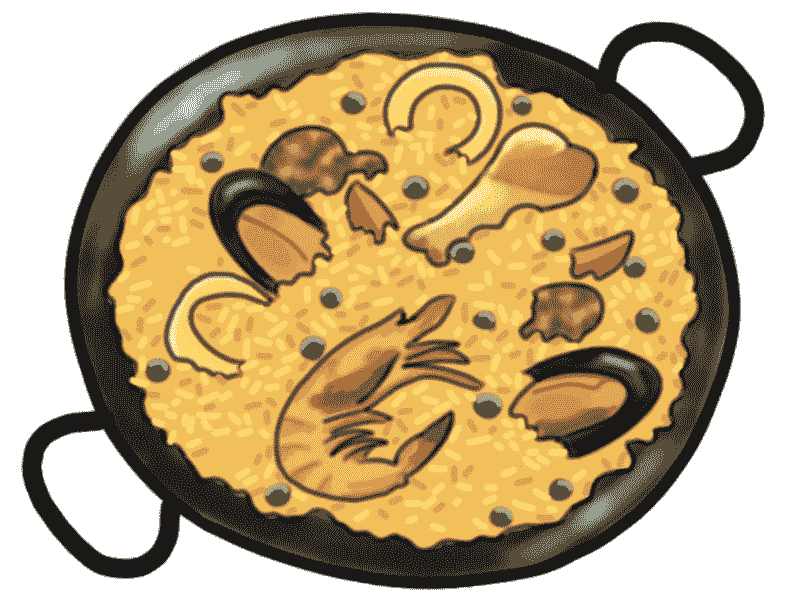
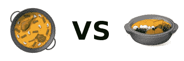
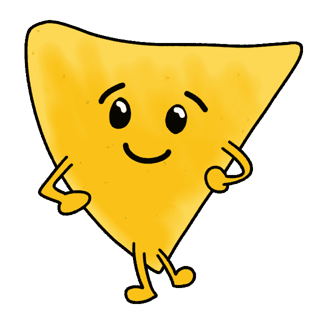
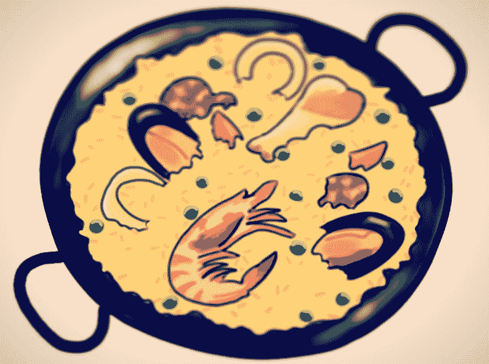
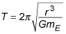

# 如何编写卫星算法并从头开始做海鲜饭

> 原文：<https://www.freecodecamp.org/news/how-to-build-a-program-or-make-dinner-from-scratch-9eb1263ecdbc/>

如果我告诉你，在这篇文章结束时，你将能够利用卫星的平均高度来计算它们绕地球的轨道周期，并且……你已经不在状态了，不是吗？

好吧，这样如何:我要教你怎么做肉菜饭！



True fact: people are far more likely to accept complexity if it comes with the promise of food.

**和**你将学习如何编写一个函数来做我上面提到的事情，就像我为这次[自由代码营挑战赛](https://www.freecodecamp.org/learn/javascript-algorithms-and-data-structures/intermediate-algorithm-scripting/map-the-debris)所做的一样。

我保证这是一个最重要的道德教训，会让你受益终生。或者，至少，喂你一晚上。让我们开始吧。

### 我对海鲜饭唯一了解的就是它是一个表情符号



Unless you’re reading this on a Samsung phone, in which case you’re looking at a Korean hotpot.

生活在当今世界上，我最喜欢的一件事是，对某件事几乎一无所知是非常好的。一百年前，你可能一辈子都不知道肉菜饭，除了知道它是一个表情符号。*但是今天呢？你可以简单的[查一下](https://en.wikipedia.org/wiki/Paella)。

那是个玩笑。

正如生活中的所有事情一样，当我们不确定时，我们会求助于互联网。在这种情况下，维基百科上关于*肉菜饭*的条目是:

> “西班牙海鲜饭……是一道瓦伦西亚饭。西班牙海鲜饭有着古老的渊源，但它的现代形式起源于 19 世纪中期西班牙东海岸靠近巴伦西亚城的阿尔布费拉泻湖附近。许多非西班牙人认为西班牙海鲜饭是西班牙的国菜，但大多数西班牙人认为它是巴伦西亚的一道地方菜。反过来，巴伦西亚人把肉菜饭视为他们的身份象征之一。

> 肉菜饭的种类包括巴伦西亚肉菜饭、素食/纯素肉菜饭(西班牙语:西班牙肉菜饭)、海鲜肉菜饭(西班牙语:马里斯科肉菜饭)和混合肉菜饭(西班牙语:混合肉菜饭)等等。”——[维基百科](https://en.wikipedia.org/wiki/Paella)

此时，你可能充满了疑问。我需要和一个巴伦西亚人谈谈吗？我应该上西班牙历史的在线课程吗？我应该尝试做什么类型的肉菜饭？现代厨师对海鲜饭类型的普遍看法是什么？

如果你开始回答所有这些问题，有一件事是肯定的:你永远不会真正做西班牙海鲜饭。你会花上几个小时在搜索引擎中输入问题，几年后你醒来时会发现你是巴伦西亚烹饪的大师。

### “最重要的问题”法

当我在公共场合大声自言自语的时候(不是每个人都这样吗？)我称之为“MIQ”(与“尼克”押韵)。我还想象 MIQ 是一个相当脆，相当可爱，拟人化的玉米片。不知道为什么。



MIQ 摆动着他脆脆的三角形身体，给我指了指正确的方向。正确的方向总是以最重要的问题的形式出现，你需要在解决问题的任何阶段问自己。第一个最重要的问题总是这样:

我想达到的目标范围是什么？

你想做肉菜饭。

下一个 MIQ 变成了:为了开始做肉菜饭，我到底需要了解多少？

你以前听过这个建议:任何大问题都可以分解成多个，但更容易管理的小问题。在这个微小问题的小星座中，为了让**在大部分情况下**得到一个完整的解决方案，你只需要解决**一个**。

就做西班牙海鲜饭而言，我们需要一份食谱。这是一个搜索引擎可以为我们解决的小问题:

> **简单的海鲜饭菜谱**

> 在一个中等大小的碗中，混合 2 汤匙橄榄油、辣椒粉、牛至、盐和胡椒。加入鸡块搅拌均匀。盖上盖子，冷藏。

> 在一个大煎锅或肉菜饭锅中用中火加热 2 汤匙橄榄油。加入大蒜、红辣椒片和大米搅拌。烹饪，搅拌，用油包裹米饭，大约 3 分钟。加入藏红花丝、月桂叶、欧芹、鸡汤和柠檬皮搅拌。烧开，盖上盖子，关小火。炖 20 分钟。

> 同时，在另一个煎锅中用中火加热 2 汤匙橄榄油。拌入腌制好的鸡肉和洋葱；煮 5 分钟。拌入甜椒和香肠；煮 5 分钟。拌入虾仁；翻炒虾，直到两面都变成粉红色。

> 将米饭混合物铺在托盘上。上面放上肉和海鲜混合物。([allrecipes.com](http://allrecipes.com/recipe/84137/easy-paella/)

然后*瞧*！信不信由你，我们已经到了**的大部分路程**了。

拥有一套易于理解的分步说明真的是大部分工作。剩下的就是走过场，收集材料，然后做肉菜饭。从这一点开始，您的 Miq 可能会变得越来越少，它们相对于整个问题的重要性可能会慢慢降低。(哪里买辣椒粉？我怎么知道香肠什么时候熟？我如何把手机的定时器设置为 20 分钟？我如何停止思考这种美味的气味？哪个 Instagram 滤镜最能捕捉到当下这道海鲜饭的狂喜？)



The answer to that last one is “Nashville”.

### 我仍然不知道如何计算卫星的轨道周期

好吧。让我们检查一下这个问题:

> 返回一个新的数组，将元素的平均高度转换成它们的轨道周期。

> 该数组将包含{name: 'name '，avgAlt: avgAlt}格式的对象。

> 你可以在维基百科上读到轨道周期。

> 这些值应该四舍五入到最接近的整数。绕轨道运行的物体是地球。

> 地球半径为 6367.4447 公里，地球引力质量(GM)值为 398600.4418 km3s-2。

> `orbitalPeriod([{name : "sputnik", avgAlt : 35873.5553}])`应返回`[{name: "sputnik", orbitalPeriod: 86400}].`

事实证明，为了计算卫星的轨道周期，我们还需要一个配方。太神奇了，这些天你能在网上找到的东西。

承蒙[dummies.com](http://www.dummies.com/education/science/physics/how-to-calculate-the-period-and-orbiting-radius-of-a-geosynchronous-satellite/)(没错！#noshame)，这是我们的食谱:



It’s kind of cute, in a way.

这看起来可能很复杂。但是正如我们已经看到的，我们只需要回答下一个 MIQ:为了开始使用这个公式，我实际上需要知道多少？

在这种情况下的挑战，不太多。我们已经给定了`earthRadius`，而`avgAlt`是我们参数对象的一部分。它们一起形成了半径， *r* 。通过几个搜索查询和一些对你的初级数学课的心理时间旅行，我们可以用一点点英语描述这个公式:

***T* ，轨道周期，等于 2 乘以π，依次乘以半径的平方根， *r* 的立方，除以引力质量， *GM* 。**

JavaScript 有一个`Math.PI`属性，还有`Math.sqrt()`函数和`Math.pow()`函数。利用这些结合简单的计算，我们可以用一行赋给一个变量来表示这个方程:

```
var orbitalPeriod = 2 * Math.PI * (Math.sqrt(Math.pow((earthRadius + avgAlt), 3) / GM));
```

从内到外:

1.  添加`earthRadius`和`avgAlt`
2.  对步骤 1 的结果进行立方运算
3.  将步骤 2 的结果除以 GM
4.  取第 3 步结果的平方根
5.  将 2 乘以 Pi 乘以步骤 4 的结果
6.  将返回值赋给`orbitalPeriod`

信不信由你，我们已经大有进展了。

这个挑战的下一个 MIQ 是接受 arguments 对象，提取我们需要的信息，并以要求的格式返回等式的结果。有多种方法可以做到这一点，但我喜欢一个简单的循环:

```
function orbitalPeriod(arr) {
   var resultArr = [];
   for (var teapot = 0; teapot < arguments[0].length; teapot++) {
     var GM = 398600.4418;
     var earthRadius = 6367.4447;
     var avgAlt = arguments[0][teapot]['avgAlt'];
     var name = arguments[0][teapot]['name'];
     var orbitalPeriod = 2 * Math.PI * (Math.sqrt(Math.pow((earthRadius + avgAlt), 3) / GM));
     var result = {
       name: name,
       orbitalPeriod: Math.round(orbitalPeriod)
     }
     resultArr.push(result);
   }
   return resultArr; 
}
```

如果你需要复习遍历数组，看看我的关于迭代的文章[，包括早餐数组](https://victoria.dev/verbose/iterating-over-objects-and-arrays-frequent-errors/)！(阅读 5 分钟)

别看现在，你刚刚获得了计算卫星轨道周期的能力。如果你愿意，你甚至可以一边做肉菜饭一边做。说真的。把它写进你的简历。

### TL；博士:最重要的道德教训

无论是烹饪、编码还是其他任何事情，问题可能一开始看起来令人困惑、不可克服或者非常无聊。如果你面临这样的挑战，请记住:配上一口大小的 MIQ 薯片，它们更容易消化。


感谢阅读！

如果你喜欢这篇文章，我很想知道！你可以在我的博客上找到这篇文章和其他解释食物编码概念的文章。