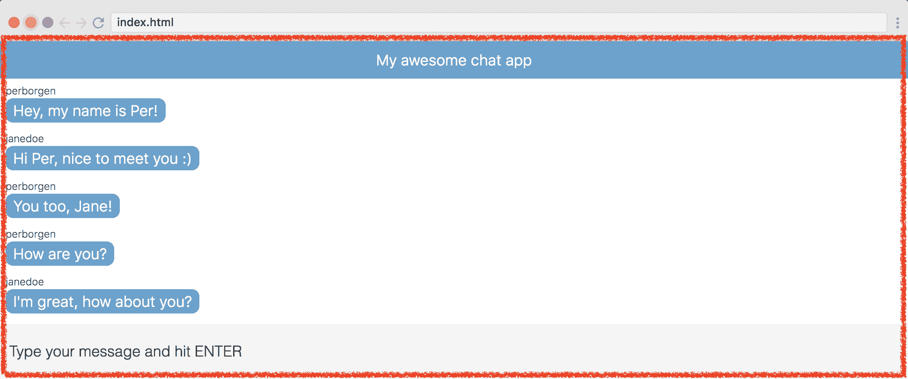
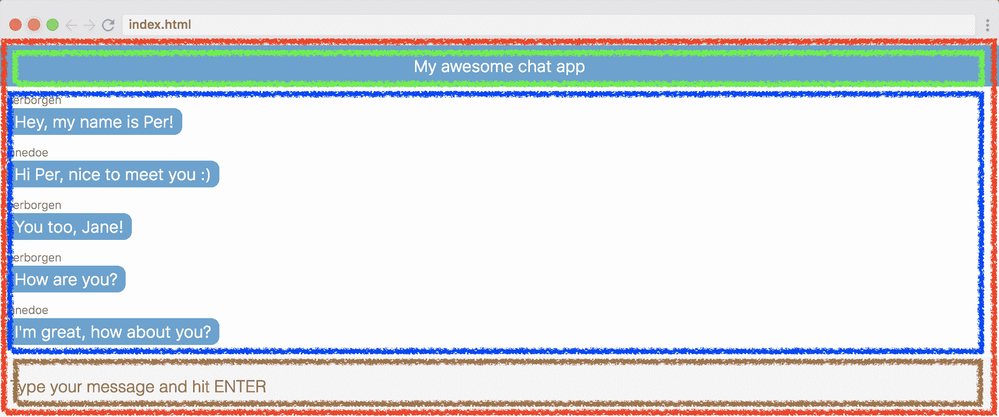
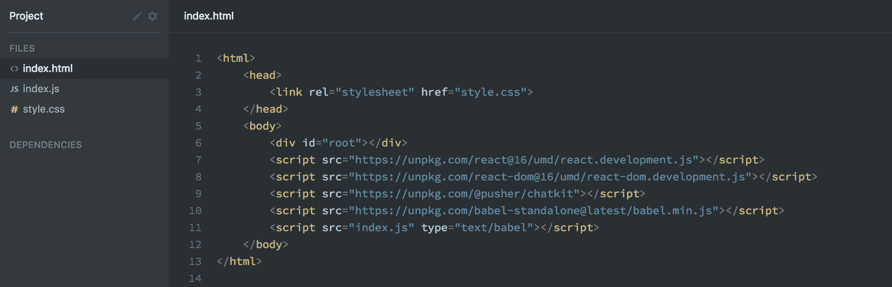
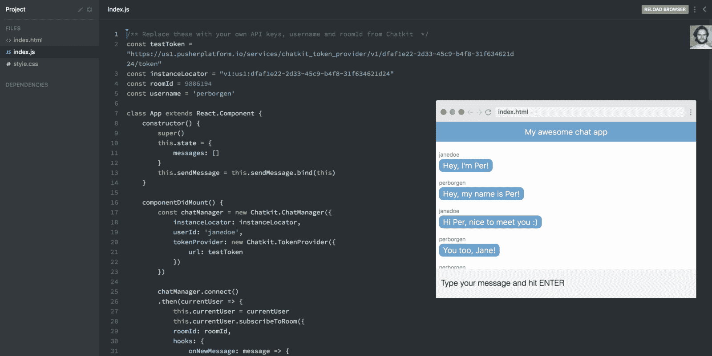
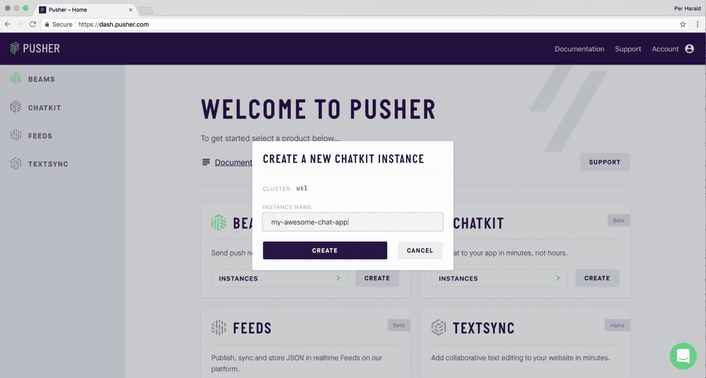
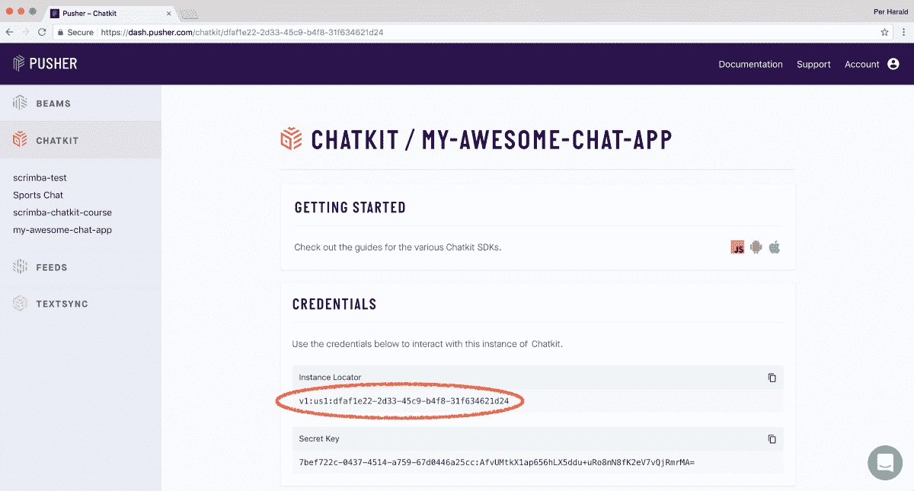
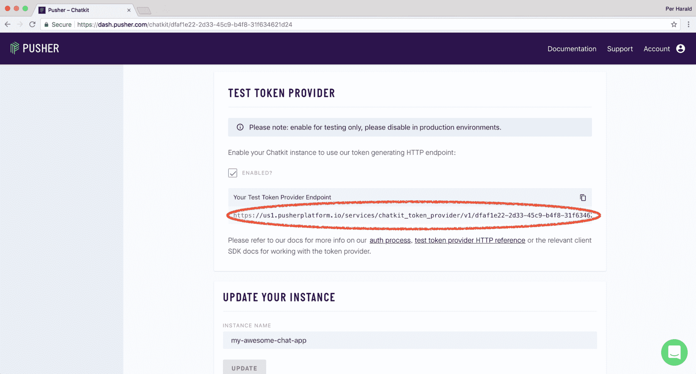
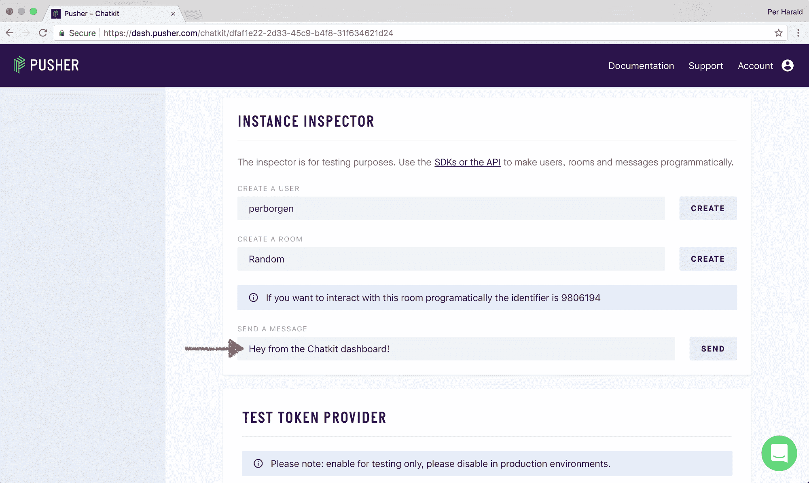
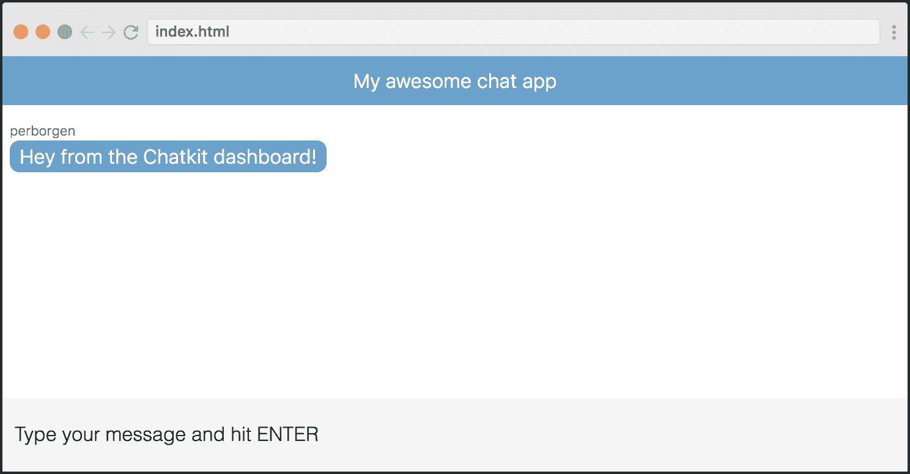
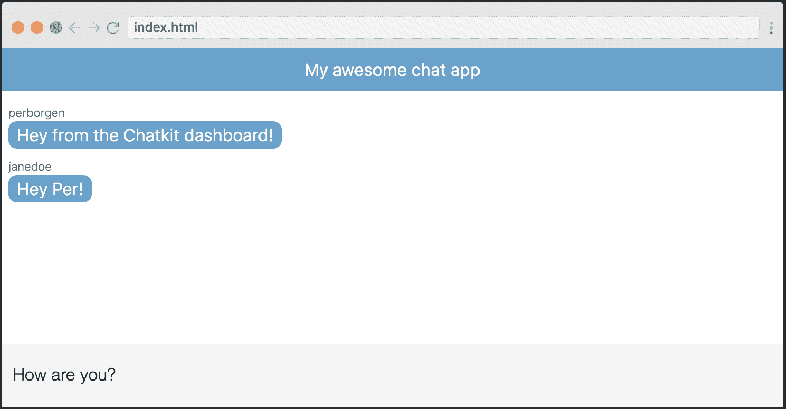

# 10 分钟学会搭建 React 聊天应用——React JS 教程

> 原文：<https://www.freecodecamp.org/news/how-to-build-a-react-js-chat-app-in-10-minutes-c9233794642b/>


[Click here to get to the full course](https://scrimba.com/g/greactchatkit?utm_source=freecodecamp.org&utm_medium=referral&utm_campaign=greactchatkit_10_minute_article) this article is based on.

在本文中，我将向您展示使用 React.js 创建聊天应用程序的最简单方法。它将完全不用服务器端代码来完成，因为我们将让 [Chatkit API](https://pusher.com/chatkit) 处理后端。

我假设您了解基本的 JavaScript，并且之前已经接触过一点 React.js。除此之外，没有任何先决条件。

注意:我还在这里创建了一个关于如何创建 React.js 聊天应用的免费完整课程:

如果你按照这个教程学习，你最终会拥有你自己的聊天应用程序，如果你愿意的话，你可以在它的基础上进一步发展。

我们开始吧！

### 步骤 1:将用户界面分解成组件

React 是围绕组件构建的，因此在创建应用程序时，首先要做的是将其 UI 分解成组件。

让我们从围绕整个应用程序画一个矩形开始。这是您的根组件，也是所有其他组件的共同祖先。姑且称之为`App`:



一旦定义了根组件，您需要问自己以下问题:

该组件有哪些直接子组件？

在我们的例子中，给它三个子组件是有意义的，我们称之为:

*   `Title`
*   `MessagesList`
*   `SendMessageForm`

让我们为每一个画一个矩形:



这让我们对应用背后的不同组件和架构有了一个很好的概述。

我们可以继续问自己，这些组件又有哪些孩子。因此，我们可以将 UI 分解成更多的组件，例如将每条消息转化成它们自己的组件。然而，为了简单起见，我们就此打住。

### 步骤 2:设置代码库

现在我们需要设置我们的存储库。我们将尽可能使用最简单的结构:一个* index.html *文件，它链接到一个 JavaScript 文件和一个样式表。我们还引进了 Chatkit SDK 和 Babel，用于改造我们的 JSX:



这里有一个 Scrimba 操场，上面有教程的最终代码。我建议你在一个新的标签页中打开它，当你感到困惑的时候就可以随意摆弄它。



或者，您可以下载 Scrimba 项目的. zip 文件，并运行一个简单的[服务器，让它在本地启动并运行。](https://gist.github.com/willurd/5720255)

### 步骤 3:创建根组件

有了存储库，我们就可以开始编写一些 React 代码了，我们将在* index.js *文件中完成。

先说主要成分，`App`。这将是我们唯一的“智能”组件，因为它将处理数据和与 API 的连接。下面是它的基本设置(在我们添加任何逻辑之前):

```
 class App extends React.Component {

      render() {
        return (
          <div className="app">
            <Title />
            <MessageList />
            <SendMessageForm />
         </div>
        )
      }
    } 
```

正如您所看到的，它简单地呈现了三个子组件:`<Title>`、`<MessageList>`和`<SendMessageForm>`组件。

不过我们会让它变得复杂一点，因为聊天消息需要存储在这个`App`组件的*状态*中。这将使我们能够通过`this.state.messages`访问消息，从而将它们传递给其他组件。

我们将从使用虚拟数据开始，这样我们可以理解应用程序的数据流。然后，我们将在稍后用来自 [Chatkit](https://pusher.com/chatkit) API 的真实数据替换它。

让我们创建一个`DUMMY_DATA`变量:

```
 const DUMMY_DATA = [
      {
        senderId: "perborgen",
        text: "who'll win?"
      },
      {
        senderId: "janedoe",
        text: "who'll win?"
      }
    ] 
```

然后我们将这个数据添加到`App`的状态中，并将其作为道具传递给`MessageList`组件。

```
 class App extends React.Component {

      constructor() {
        super()
        this.state = {
           messages: DUMMY_DATA
        }
      }

      render() {
        return (
          <div className="app">
            <MessageList messages={this.state.messages}/>
            <SendMessageForm />
         </div>
        )
      }
    } 
```

这里，我们正在初始化`constructor`中的状态，并且我们还将`this.state.messages`向下传递给`MessageList`。

注意，我们在构造函数中调用了`super()`。如果您想创建一个有状态的组件，您必须这样做。

### 步骤 4:呈现虚拟消息

让我们看看如何在`MessageList`组件中呈现这些消息。它看起来是这样的:

```
 class MessageList extends React.Component {
      render() {
        return (
          <ul className="message-list">                 
            {this.props.messages.map(message => {
              return (
               <li key={message.id}>
                 <div>
                   {message.senderId}
                 </div>
                 <div>
                   {message.text}
                 </div>
               </li>
             )
           })}
         </ul>
        )
      }
    } 
```

这就是所谓的傻逼成分。它需要一个道具`messages`，其中包含一个对象数组。然后我们简单地从对象中渲染出`text`和`senderId`属性。

随着我们的虚拟数据流入该组件，它将呈现以下内容:


现在我们有了应用程序的基本结构，我们也能够呈现消息。干得好！

现在让我们用来自聊天室的真实消息替换我们的虚拟数据！

### 步骤 5:从 Chatkit 获取 API-keys

为了获取 fetch 消息，我们需要连接 Chatkit API。为此，我们需要获得 API 密钥。

在这一点上，我想鼓励你遵循我的步骤，这样你就可以启动并运行你自己的聊天应用程序。你可以使用我的 Scrimba 操场来测试你自己的 API 键。

首先在这里创建一个免费[账户。一旦你这样做了，你会看到你的仪表板。这是创建新的 Chatkit 实例的地方。创建一个并给它起一个您想要的名字:](https://pusher.com/chatkit#sign-up)



然后，您将被导航到新创建的实例。这里您需要复制四个值:

*   实例定位器
*   测试令牌提供者
*   房间 id
*   用户名

我们将从**实例定位器**开始:



**您可以使用实例定位器右侧的图标进行复制。**

如果您向下滚动一点，您会发现**测试令牌提供者**:



下一步是创建一个**用户*** *和一个**房间**，这是在同一页面上完成的。请注意，您必须首先创建一个用户*，然后您将能够创建一个房间，这再次允许您访问房间标识符。*

**

*现在你已经找到了你的四个标识符。干得好！*

*然而，在我们回到代码库之前，我希望您也从 Chatkit 仪表板手动发送一条消息，因为这将在下一章中对我们有所帮助。*

*下面是如何做到这一点:*

**

*这是为了让我们实际上有一个消息在下一步中呈现出来。*

### *步骤 6:呈现真实的聊天消息*

*现在让我们回到我们的 *index.js* 文件，将这四个标识符作为变量存储在文件的顶部。*

*以下是我的，但我鼓励你创建自己的:*

```
 *`const instanceLocator = "v1:us1:dfaf1e22-2d33-45c9-b4f8-31f634621d24"

    const testToken = "https://us1.pusherplatform.io/services/chatkit_token_provider/v1/dfaf1e22-2d33-45c9-b4f8-31f634621d24/token"

    const username = "perborgen"

    const roomId = 9796712`* 
```

*有了这些，我们终于准备好连接 Chatkit 了。这将发生在`App`组件中，更具体地说是在`componentDidMount`方法中。这是将 React.js 组件连接到 API 时应该使用的方法。*

*首先我们将创建一个`chatManager`:*

```
 *`componentDidMount() {
      const chatManager = new Chatkit.ChatManager({
        instanceLocator: instanceLocator,
        userId: userId,
        tokenProvider: new Chatkit.TokenProvider({
          url: testToken
        })
     })`* 
```

*…然后我们将执行`chatManager.connect()`来连接 API:*

```
 *`chatManager.connect().then(currentUser => {
          currentUser.subscribeToRoom({
          roomId: roomId,
          hooks: {
            onNewMessage: message => {
              this.setState({
                messages: [...this.state.messages, message]
              })
            }
          }
        })
      })
    }`* 
```

*这使我们可以访问`currentUser`对象，它是与 API 交互的接口。*

*注意:因为我们稍后需要使用`currentUser`，所以我们通过执行`this.currentUser = ``currentUser`将它存储在实例中。*

*然后，我们调用`currentUser.subscribeToRoom()`并传递给它我们的`roomId`和一个`onNewMessage`钩子。*

*每次有新消息广播到聊天室，就会触发`onNewMessage`挂钩。所以每次发生这种情况时，我们只需在`this.state.messages`的末尾添加新消息。*

*这导致应用程序从 API 获取数据，然后将其呈现在页面上。*

**

*这太棒了，因为我们现在已经有了客户机-服务器连接的框架。*

*Woohoo!*

### *步骤 7:处理用户输入*

*接下来我们需要创建的是`SendMessageForm`组件。这将是一个所谓的*受控组件*，意味着该组件通过其状态控制输入字段中呈现的内容。*

*看一下`render()`方法，特别注意我突出显示的几行:*

```
 *`class SendMessageForm extends React.Component {
      render() {
        return (
          <form
            className="send-message-form">
            <input
              onChange={this.handleChange}
              value={this.state.message}
              placeholder="Type your message and hit ENTER"
              type="text" />
          </form>
        )
      }
    }`* 
```

*我们正在做两件事:*

1.  *用`onChange`事件监听器监听用户输入，这样我们就可以
    触发`handleChange`方法*
2.  *使用`this.state.message`显式设置输入字段的`value`*

*这两个步骤之间的联系可以在`handleChange`方法中找到。它只是将状态更新为用户在输入字段中键入的内容:*

```
 *`handleChange(e) {
      this.setState({
        message: e.target.value
      })
    }`* 
```

*这触发了重新渲染，由于输入字段是使用`value={this.state.message}`从状态中显式设置的，输入字段将被更新。*

*因此，尽管当用户在输入字段中输入内容时，应用程序感觉是即时的，但是在 React 更新 UI 之前，数据实际上是经过状态的。*

*为了总结这个特性，我们需要给组件一个`constructor`。在其中，我们将初始化状态并在`handleChange`方法中绑定`this`:*

```
 *`constructor() {
        super()
        this.state = {
           message: ''
        }
        this.handleChange = this.handleChange.bind(this)
    }`* 
```

*我们需要绑定`handleChange`方法，这样我们就可以访问其中的`this`关键字。这就是 JavaScript 的工作方式:默认情况下，`this`关键字在函数体内是未定义的。*

### *步骤 8:发送消息*

*我们的`SendMessageForm`组件差不多完成了，但是我们还需要处理表单提交。我们需要获取信息并发送出去！*

*为此，我们将在`<form>`中用`onSubmit`事件监听器连接一个`handleSubmit`事件处理程序。*

```
 *`render() {
        return (
          <form
            onSubmit={this.handleSubmit}
            className="send-message-form">
            <input
              onChange={this.handleChange}
              value={this.state.message}
              placeholder="Type your message and hit ENTER"
              type="text" />
        </form>
        )
      }`* 
```

*因为我们将输入字段的值存储在`this.state.message`中，所以实际上很容易将正确的数据与提交一起传递。我们会简单地做:*

```
 *`handleSubmit(e) {
      e.preventDefault()
      this.props.sendMessage(this.state.message)
      this.setState({
        message: ''
      })
    }`* 
```

*在这里，我们调用了`sendMessage` prop，并将`this.state.message`作为参数传入。你可能对此有点困惑，因为我们还没有创建`sendMessage`方法。然而，我们将在下一节中这样做，因为该方法存在于`App`组件中。所以不用担心！*

*其次，我们通过将`this.state.message`设置为空字符串来清除输入字段。*

*这是整个`SendMessageForm`组件。注意，我们还将`this`绑定到了`handleSubmit`方法:*

```
 *`class SendMessageForm extends React.Component {
      constructor() {
        super()
        this.state = {
          message: ''
        }
        this.handleChange = this.handleChange.bind(this)
        this.handleSubmit = this.handleSubmit.bind(this)
      }

      handleChange(e) {
        this.setState({
          message: e.target.value
        })
      }

      handleSubmit(e) {
        e.preventDefault()
        this.props.sendMessage(this.state.message)
        this.setState({
          message: ''
        })
      }

      render() {
        return (
          <form
            onSubmit={this.handleSubmit}
            className="send-message-form">
            <input
              onChange={this.handleChange}
              value={this.state.message}
              placeholder="Type your message and hit ENTER"
              type="text" />
          </form>
        )
      }
    }`* 
```

### *步骤 9:向 Chatkit 发送消息*

*我们现在准备好了，请将消息发送到 Chatkit。这是在`App`组件中完成的，我们将创建一个名为`this.sendMessage`的方法:*

```
 *`sendMessage(text) {
      this.currentUser.sendMessage({
        text: text,
        roomId: roomId
      })
    }`* 
```

*它接受一个参数(文本)并简单地调用`this.currentUser.sendMessage()`。*

*最后一步是将其作为道具传递给`<SendMessageForm>`组件:*

```
 *`/* App component */

    render() {
      return (
        <div className="app">
          <Title />
          <MessageList messages={this.state.messages} />
          <SendMessageForm sendMessage={this.sendMessage} />
      )
    }`* 
```

*这样，我们传递了处理程序，以便在提交表单时`SendMessageForm`可以调用它。*

### *步骤 10:创建标题组件*

*最后，让我们创建标题组件。它只是一个简单的函数组件，意思是一个返回 JSX 表达式的函数。*

```
 *`function Title() {
      return <p class="title">My awesome chat app</p>
    }`* 
```

*使用功能组件是一个很好的实践，因为它们比类组件有更多的约束，这使得它们不容易出错。*

### *结果呢*

*有了它，你就有了自己的聊天应用程序，可以用来和朋友聊天！*

**

*如果你一直坚持到最后，给自己一点鼓励。*

*如果你想学习如何在这个例子的基础上更进一步，请点击这里查看我的免费课程，学习如何用 React 创建一个聊天应用。*

*感谢阅读和快乐编码:)*