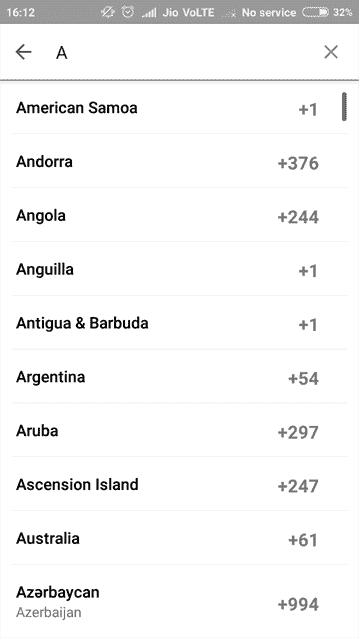

# 如何建立一个具有实时搜索能力的 React 本地平面表

> 原文：<https://www.freecodecamp.org/news/how-to-build-a-react-native-flatlist-with-realtime-searching-ability-81ad100f6699/>

作者:维克兰特·内吉

# 如何建立一个具有实时搜索能力的 React 本地平面表


React Native Searchable Flatlist

如果你曾经使用过或者开发过一个移动应用，那么你一定遇到过某种列表——无论是联系人、产品、国家还是其他东西的长列表。

对于最终用户来说，它们可能看起来非常简单。但是对于开发人员来说，当涉及到高性能的长列表时，显示长数据列表一直是一个棘手的问题。在用 React Native 构建的应用中尤其如此。

### 背景

在 React Native 的最初几天，我们有着美好的过去。它有许多非常吸引人的特性，是有效显示变化数据的垂直列表的默认选择。

然而，随着时间的推移，许多问题和错误出现了，React 原生团队意识到是时候重新发明轮子了。

#### Enter FlatList

2017 年 3 月，脸书推出了`[FlatList](https://facebook.github.io/react-native/docs/flatlist)`组件，这是一种实现简单、高性能列表的更简单、更高性能的方法。不仅如此——它的 API 比最初的`ListView`更容易理解。下面是一个简单的平面列表:

```
<FlatList   data={[{title: ‘Title Text’, key: ‘item1’}, …]}   renderItem={({item}) => <ListItem title={item.title} />} />
```

除了`FlatList`之外，您还可以使用 [`SectionList`](https://facebook.github.io/react-native/docs/sectionlist) 来渲染分段列表。

#### 下一步是什么

正如我前面提到的，ListView 主要用于显示纵向变化数据的长列表。但是长长的数据列表就像没有把手的锤子一样有用。？

几乎在任何时候，当你遇到一长串数据时，你都可以搜索这些数据，这样你就不会迷路了。



Whatsapp country list with search

### React 本机可搜索平面列表

我决定建造一些东西来解决这个问题。你可以在这里找到完整的项目报告。

如果你不熟悉 FlatList，我建议你先浏览一下 FlatList 的基础知识。这篇文章是斯潘塞·卡利写的，最适合那些刚刚接触母语的初学者。

现在，没有任何进一步的麻烦，让我们开始制作我们的可搜索平面列表！

首先，让我们设置一些初始状态，我们将在项目的后面使用:

```
this.state = {
  loading: false,      
  data: [],      
  error: null,    
};
```

我们还需要一个数组变量:

```
this.arrayholder = [];
```

显然一个空列表并不好玩。所以让我们用一些随机的用户列表来增加趣味。

我们将使用 user [randomuser.me](https://randomuser.me/) 这是一个免费的、[开源的用于生成随机用户数据的 API。这就像 Lorem Ipsum，但对人来说。](https://github.com/RandomAPI/Randomuser.me-Node)

让我们创建一个为我们获取一些用户数据的函数。

```
makeRemoteRequest = () => {    
  const url = `https://randomuser.me/api/?&results=20`;
  this.setState({ loading: true });

  fetch(url)      
    .then(res => res.json())      
    .then(res => {        
      this.setState({          
        data: res.results,          
        error: res.error || null,          
        loading: false,        
      });        

     this.arrayholder = res.results;      
   })      
   .catch(error => {        
     this.setState({ error, loading: false });      
   });  
};
```

在上面的代码片段中，我们使用`[fetch](https://facebook.github.io/react-native/docs/network)` API 发出一个远程 API 请求。当请求完成时，我们将接收保存到`data`状态和`arrayholder`的用户数据。

现在，为了让用户搜索列表，我们需要在`FlatList`的顶部添加一个搜索栏。`FlatList`有一个可以添加任何自定义组件到它的头的属性，这很有用，因为我们将在那里添加一个搜索组件。

```
renderHeader = () => {    
  return (      
    <SearchBar        
      placeholder="Type Here..."        
      lightTheme        
      round        
      onChangeText={text => this.searchFilterFunction(text)}
      autoCorrect={false}             
    />    
  );  
};
```

在上面的函数中，我们使用`react-native-elements` `SearchBar`组件作为输出头组件。

默认情况下，当我们在`SearchBar`中输入时，没有逻辑会过滤列表。为此，我们需要编写一个函数，在`SearchBar`中的文本改变时过滤结果。

```
searchFilterFunction = text => {    
  const newData = this.arrayholder.filter(item => {      
    const itemData = `${item.name.title.toUpperCase()}   
    ${item.name.first.toUpperCase()} ${item.name.last.toUpperCase()}`;

     const textData = text.toUpperCase();

     return itemData.indexOf(textData) > -1;    
  });

  this.setState({ data: newData });  
};
```

上述功能将在`arrayholder`上运行过滤功能。我们将根据用户的名字过滤用户，所以我们将名字存储在`itemData`变量中，并将其转换为大写。

这个函数将接收用户输入的文本作为参数，我们将把它转换成大写后存储在另一个变量 textData 中。

之后，我们将使用`indexOf`来比较这两个文本，如果在`itemData`中找到文本，则返回 true。如果返回 true，那么`filter`将保留该数据，否则忽略它。因此，只要用户在搜索栏中键入任何文本，就会返回新的数据。这个新数据然后被设置为`data`状态，最终将被用作`FlatList`的数据源。

现在是渲染平面列表的时候了。

```
<List containerStyle={{ borderTopWidth: 0, borderBottomWidth: 0 }}>
  <FlatList          
    data={this.state.data}          
    renderItem={({ item }) => ( 
      <ListItem              
        roundAvatar              
        title={`${item.name.first} ${item.name.last}`}  
        subtitle={item.email}                           
        avatar={{ uri: item.picture.thumbnail }}   
        containerStyle={{ borderBottomWidth: 0 }} 
       />          
     )}          
     keyExtractor={item => item.email}  
     ItemSeparatorComponent={this.renderSeparator} 
     ListHeaderComponent={this.renderHeader}                             
  />            
</List>
```

这就是我们需要做的一切。万岁！！


React native searchable FlatList

#### 结束语

为了简洁起见，我跳过了一些对本教程不太重要的代码。你可以在 GitHub 上找到完整的工作 [repo](https://github.com/vikrantnegi/react-native-searchable-flatlist) 。

此外，我相信还有其他方法可以达到同样的效果——所以如果你找到了其他方法，请随意分享。

你也可以在 [Twitter](https://twitter.com/vikrant_negi) 和 [GitHub](https://github.com/vikrantnegi/) 上关注我。并查看我以前在[媒体](https://medium.com/@vikrantnegi)发表的文章。

其他有用的文章:

*   [反应原生位置追踪](https://medium.com/quick-code/react-native-location-tracking-14ab2c9e2db8)
*   [用动态工具提示反应原生图表](https://medium.freecodecamp.org/how-to-build-react-native-charts-with-dynamic-tooltips-64aefc550c95)
*   [用动态工具提示反应原生图表](https://medium.freecodecamp.org/how-to-build-react-native-charts-with-dynamic-tooltips-64aefc550c95)