# 如何用 ARKit 和 Pusher 搭建实时增强现实测量 App

> 原文：<https://www.freecodecamp.org/news/how-to-build-a-real-time-augmented-reality-measuring-app-with-arkit-and-pusher-41da426dedf9/>

埃斯特万·埃雷拉

# 如何用 ARKit 和 Pusher 搭建实时增强现实测量 App

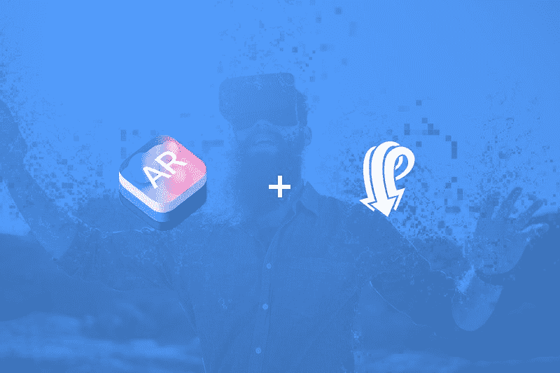

增强现实(AR)就是要改变我们对现实世界的感知。

关于我们的环境和周围物体的信息可以被叠加，以增强你当前对现实的感知。该信息可以实时呈现给用户，就像实况事件中的新闻馈送一样。

但是信息的流动也可以反过来。我们可以发送从与增强现实体验的交互中产生的信息。在这两种情况下，Pusher 都可以帮助您实时发送和接收数据。

在本教程中，我们将构建一个 ARKit 应用程序来进行简单的测量。测量时，应用程序将创建一个宽度等于测量尺寸的 3D 框:

它还会将测量值实时发送给推进器:

有一点需要注意。测量是基于 ARKit 的平面探测能力。它们在某些情况下并不完美，例如在光线较暗或表面不完全平坦的情况下。结果不会一直完全准确。它们很接近，但也可能不同。

对于本教程，您需要:

*   采用 A9 或更高版本处理器的设备(iPhone 6s 或更高版本、iPhone SE、任何 iPad Pro 或 2017 款 iPad)
*   [iOS 11 beta 5](https://9to5mac.com/2017/06/26/how-to-install-ios-11-public-beta-on-your-eligible-iphone-ipad-or-ipod-touch/)
*   [Xcode 9 beta 5](https://developer.apple.com/download/) (或更高级)
*   一个免费的[推手](https://pusher.com/)账户

作为参考，你可以在 [Git](https://github.com/eh3rrera/ARKitAnimation) Hub 上找到这个项目的源代码。

让我们开始吧。

### 设置 Xcode 项目

打开 Xcode，创建一个新的**单视图应用**:

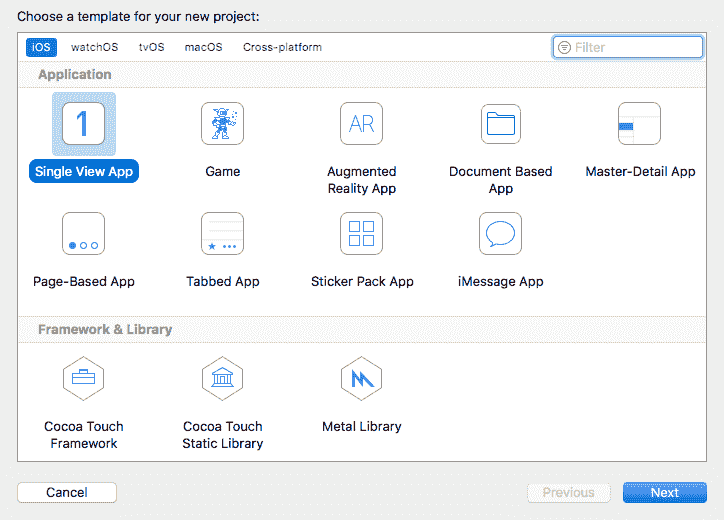

我们选择此选项是因为我们将手动设置 AR 视图以及其他控件。

输入项目信息，选择 **Swift** 作为语言:

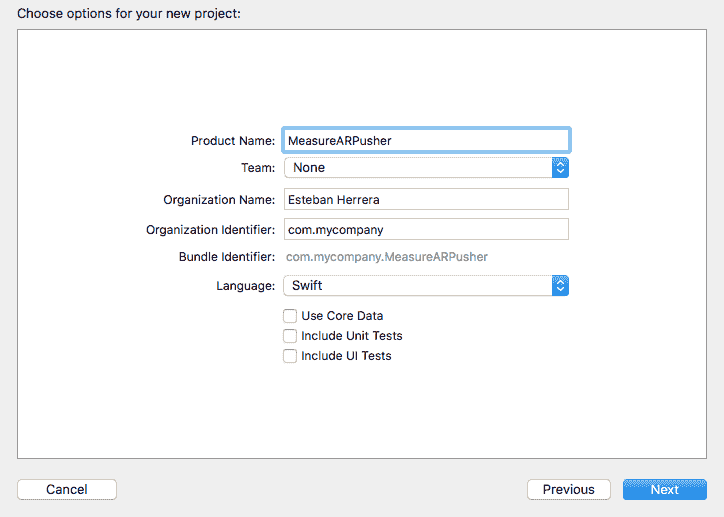

创建项目并关闭它。我们将使用 [CocoaPods](https://cocoapods.org/) 来安装项目的依赖项。打开一个终端窗口，转到项目的根目录。如果您没有安装 CocoaPods，请执行:

```
sudo gem install cocoapods
```

安装后，使用以下命令创建文件`Podfile`:

```
pod init
```

编辑此文件，将平台设置为 iOS 11，并添加项目依赖项:

```
# Uncomment the next line to define a global platform for your project
```

```
platform :ios, '11.0'
```

```
target 'MeasureARPusher' do
```

```
# Comment the next line if you're not using Swift # and don't want to use dynamic frameworks
```

```
use_frameworks!
```

```
# Pods for MeasureARPusher
```

```
pod 'PusherSwift', :git => 'https://github.com/pusher/pusher-websocket-swift.git', :branch => 'swift-3.2'
```

```
end
```

在撰写本文时， [Pusher 针对 Xcode 9 和 Swift 3.2/4 的 Swift 库](https://github.com/pusher/pusher-websocket-swift)仍在[开发中](https://github.com/pusher/pusher-websocket-swift/pull/145)。当前版本抛出了一些错误，所以我们必须从分支`swift-3.2`中拉出 Swift 3.2 的版本。

编辑完`Podfile`后，执行以下命令来安装依赖项:

```
pod install
```

现在打开 Xcode 工作空间，而不是项目文件:

```
open MeasureARPusher.xcworkspace
```

我们需要将 Swift 的版本从 4.0(默认)更改为 Swift 3.2，这样 Pusher 就可以正确编译了。在项目导航器中，选择**窗格**。在**目标**部分选择**推杆 Swift** 。在**构建设置**选项卡中，寻找选项 **Swift 语言版本**。改成 Swift 3.2:

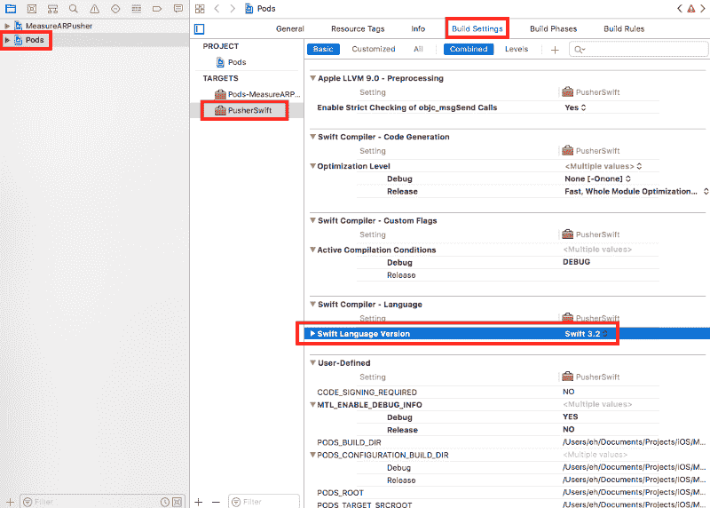

如果此时构建项目，操作应该会成功。

选择**信息属性列表**。添加一行**类型的隐私—相机使用说明** ( `NSCameraUsageDescription`)并给出说明。这是这样的 ARKit 可以访问摄像头:

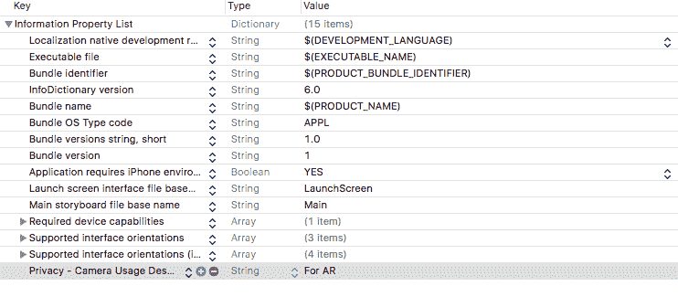

最后，配置一个团队，以便您可以在您的设备上运行应用程序:

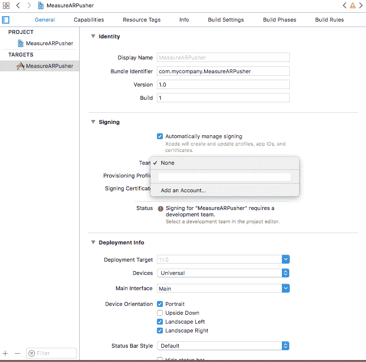

现在让我们从构建用户界面开始。

### 构建用户界面

转到`Main.storyboard`并将 *ARKit SceneKit 视图*拖到视图中:

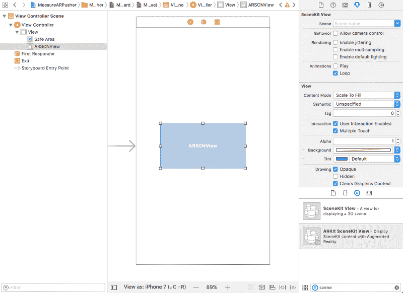

接下来，向该视图的所有边添加约束，使其充满整个屏幕。您可以通过按下`ctrl`键，同时向每一侧拖动一条线，并选择超级视图的前导、顶部、尾部和底部，值为`0`:

添加一个按钮。在**属性检查器**中将其类型改为**添加联系人**。给它一个白色**色调**，并添加一个垂直和一个水平约束，使它在屏幕中间居中:

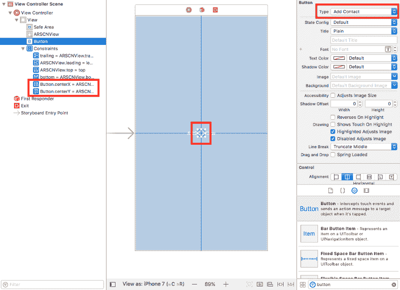

让我们添加一个开关来控制应用程序何时处于测量模式。在属性检查器中将其初始状态设定为“关闭”。添加一个值为`-20`的底部和尾部约束，将控件放在屏幕的右下角。如果您愿意，您可以将它放在屏幕的底部中间或其他位置:

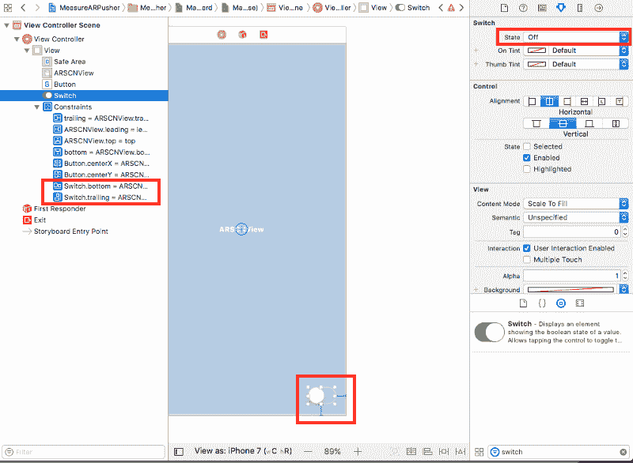

现在添加一个文本视图。在属性检查器*中禁用其**可编辑**和**可选**行为。*改变其背景颜色。我选择了 50%不透明度的白色。

添加值为 90 的高度约束。添加值为 0 的前导、顶部和尾部约束，使其固定在屏幕顶部:

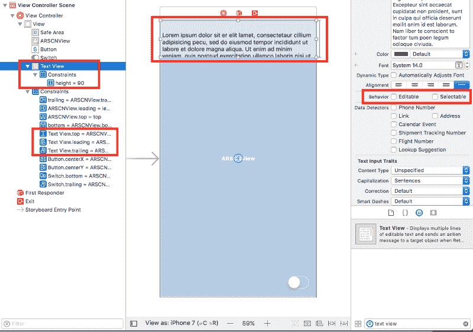

在`ViewController.swift`中，导入 SceneKit 和 ARKit 库:

```
import SceneKit
```

```
import ARKit
```

然后，创建两个`IBOutlets`，一个到场景视图，另一个到文本视图:

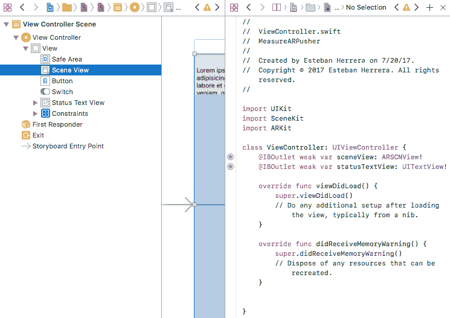

最后，`changeValue`事件的开关控制上的一个动作:


现在我们准备开始编写应用程序。

### 构建测量应用程序

让我们从让`ViewController.swift`实现`ARSCNViewDelegate`并定义我们将需要的变量开始:

```
class ViewController: UIViewController, ARSCNViewDelegate {
```

```
 ...
```

```
 var box: Box!
```

```
 var status: String!
```

```
 var startPosition: SCNVector3!
```

```
 var distance: Float!
```

```
 var trackingState: ARCamera.TrackingState!
```

```
 enum Mode {
```

```
 case waitingForMeasuring
```

```
 case measuring
```

```
 }
```

```
 ...
```

```
}
```

其中:

*   `box`代表测量时将要绘制的 3D 框。我们稍后会复习这门课。现在，创建它来消除错误。
*   `status`是一个文本，告诉我们应用程序是否准备好进行测量(应用程序是否检测到飞机)。
*   `startPosition`代表测量的开始位置。
*   `distance`是从起点到当前位置的计算距离(测量本身)。
*   `trackingState`保存摄像机的当前跟踪状态。
*   `Mode`是一个枚举，表示应用程序的可能状态。

让我们添加另一个属性来跟踪应用程序的状态，并根据设置的值做一些事情:

```
var mode: Mode = .waitingForMeasuring {
```

```
 didSet {
```

```
 switch mode {
```

```
 case .waitingForMeasuring:
```

```
 status = "NOT READY"
```

```
 case .measuring:
```

```
 box.update(          minExtents: SCNVector3Zero, maxExtents: SCNVector3Zero)
```

```
 box.isHidden = false
```

```
 startPosition = nil
```

```
 distance = 0.0
```

```
 setStatusText()
```

```
 }
```

```
 }
```

```
}
```

如果`waitingForMeasuring`被设置，我们将假设应用程序没有准备好。放心吧，如果是，状态马上就变了。如果模式设置为测量，我们将重置盒子的大小。我们稍后将回顾方法更新。我们将显示盒子是否被隐藏，重置`startPosition`和`distancevariables`，并调用显示这些变量的值的方法。

这是方法`setStatusText()`的定义:

```
func setStatusText() {
```

```
 var text = "Status: \(status!)\n"
```

```
 text += "Tracking: \(getTrackigDescription())\n"
```

```
 text += "Distance: \(String(format:"%.2f cm", distance! * 100.0))"
```

```
 statusTextView.text = text
```

```
}
```

```
func getTrackigDescription() -> String {
```

```
 var description = ""
```

```
 if let t = trackingState {
```

```
 switch(t) {
```

```
 case .notAvailable:
```

```
 description = "TRACKING UNAVAILABLE"
```

```
 case .normal:
```

```
 description = "TRACKING NORMAL"
```

```
 case .limited(let reason):
```

```
 switch reason {
```

```
 case .excessiveMotion:
```

```
 description =               "TRACKING LIMITED - Too much camera movement"
```

```
 case .insufficientFeatures:
```

```
 description =               "TRACKING LIMITED - Not enough surface detail"
```

```
 case .initializing:
```

```
 description = "INITIALIZING"
```

```
 }
```

```
 }
```

```
 }
```

```
 return description
```

```
}
```

该方法将文本视图的文本设置为就绪或未就绪的测量状态*。*显示借助`getTrackingDescription()`方法描述 AR 摄像机的跟踪状态。和以厘米为单位的(最后)计算距离。请注意，我们必须将该值乘以`100.0`。

接下来，我们有方法`viewDidLoad()`，其中我们设置初始值:

```
override func viewDidLoad() {
```

```
 super.viewDidLoad()
```

```
 // Set the view's delegate
```

```
 sceneView.delegate = self
```

```
 // Set a padding in the text view
```

```
 statusTextView.textContainerInset =       UIEdgeInsetsMake(20.0, 10.0, 10.0, 0.0)
```

```
 // Instantiate the box and add it to the scene
```

```
 box = Box()
```

```
 box.isHidden = true;
```

```
 sceneView.scene.rootNode.addChildNode(box)
```

```
 // Set the initial mode
```

```
 mode = .waitingForMeasuring
```

```
 // Set the initial distance
```

```
 distance = 0.0
```

```
 // Display the initial status
```

```
 setStatusText()
```

```
}
```

在方法`viewWillAppear`中，使用[平面检测](https://developer.apple.com/documentation/arkit/arworldtrackingsessionconfiguration.planedetection)创建并运行一个[会话](https://developer.apple.com/documentation/arkit/arsession)。这很重要，因为平面上的点将是我们用来测量事物的元素:

```
override func viewWillAppear(_ animated: Bool) {
```

```
 super.viewWillAppear(animated)
```

```
 // Create a session configuration with plane detection
```

```
 let configuration = ARWorldTrackingConfiguration()
```

```
 configuration.planeDetection = .horizontal
```

```
 // Run the view's session
```

```
 sceneView.session.run(configuration)
```

```
}
```

此外，覆盖方法`viewWillDisappear`以在必要时暂停会话:

```
override func viewWillDisappear(_ animated: Bool) {
```

```
 super.viewWillDisappear(animated)
```

```
 // Pause the view's session
```

```
 sceneView.session.pause()
```

```
}
```

使用以下方法了解摄像机的跟踪状态何时改变。保存对该状态的引用:

```
func session(_ session: ARSession, cameraDidChangeTrackingState camera: ARCamera) {
```

```
 trackingState = camera.trackingState
```

```
}
```

这些方法是协议 [ARSCNViewDelegate](https://developer.apple.com/documentation/arkit/arscnviewdelegate) 附带的回调的一部分。

现在，有趣的部分来了。

该方法:

```
(void)renderer:(id <SCNSceneRenderer>)renderer updateAtTime:(NSTimeInterval)time
```

每帧调用一次，就像每秒调用`60`次。所以我们将调用另一个方法，使用点击测试来检测一个我们可以与之交互的平面。当这种情况发生时，我们会将状态从“未就绪”更改为“就绪”。

实现如下所示:

```
func renderer(_ renderer: SCNSceneRenderer, updateAtTime time: TimeInterval) {
```

```
 // Call the method asynchronously to perform
```

```
 //  this heavy task without slowing down the UI
```

```
 DispatchQueue.main.async {
```

```
 self.measure()
```

```
 }
```

```
}
```

```
func measure() {
```

```
 let screenCenter : CGPoint = CGPoint(      x: self.sceneView.bounds.midX, y: self.sceneView.bounds.midY)
```

```
 let planeTestResults = sceneView.hitTest(      screenCenter, types: [.existingPlaneUsingExtent])
```

```
 if let result = planeTestResults.first {
```

```
 status = "READY"
```

```
 } else {
```

```
 status = "NOT READY"
```

```
 }
```

```
 ...
```

```
}
```

参考点将始终位于屏幕的中心。这就是为什么我们把按钮和加号放在一起。我们将得到屏幕中心坐标来对现有飞机进行撞击测试。如果有结果，就意味着我们可以开始测量了。

在搜索中，我们可以找到四种类型的对象:

*   [特征点](https://developer.apple.com/documentation/arkit/arhittestresult.resulttype/2875708-featurepoint)
    被 ARKit 自动识别为连续表面一部分的点，但没有相应的锚点。
*   [estimatedHorizontalPlane](https://developer.apple.com/documentation/arkit/arhittestresult.resulttype/2887460-estimatedhorizontalplane)
    通过搜索检测到的真实世界平面，没有对应的锚点。方向垂直于重力。
*   [existingPlane](https://developer.apple.com/documentation/arkit/arhittestresult.resulttype/2875738-existingplane)
    场景中已经有一个飞机锚点，没有考虑飞机的大小。
*   考虑到飞机的有限尺寸，场景中已经有一个飞机锚。

最简单的选择是使用特征点。它们代表在相机图像中检测到的显著特征。它们比飞机更快被发现，而且数量更多。

但是，这将给我们带来非常不稳定的结果。特征点是 ARKit 用来执行世界跟踪的场景分析的中间结果。所以建议先针对现有的平面锚做一个命中测试。

如果有点击，并且模式是测量，我们需要将状态更改为*测量。*并从结果的变换矩阵中提取位置作为三个元素(x，y，z)的向量:

```
func measure() {
```

```
 ...
```

```
 if let result = planeTestResults.first {
```

```
 status = "READY"
```

```
 if mode == .measuring {
```

```
 status = "MEASURING"
```

```
 let worldPosition = SCNVector3Make(        result.worldTransform.columns.3.x,              result.worldTransform.columns.3.y,        result.worldTransform.columns.3.z      )
```

```
 ...
```

```
 }
```

```
 } ...
```

```
}
```

如果`startPosition`是`nil`(第一个度量)，我们使用`worldPosition`来设置它的值和盒子位置:

```
func measure() {
```

```
 ...
```

```
 if let result = planeTestResults.first {
```

```
 status = "READY"
```

```
 if mode == .measuring {
```

```
 ...
```

```
 let worldPosition = SCNVector3Make(        result.worldTransform.columns.3.x,         result.worldTransform.columns.3.y,         result.worldTransform.columns.3.z      )
```

```
 if startPosition == nil {
```

```
 startPosition = worldPosition
```

```
 box.position = worldPosition
```

```
 }
```

```
 ...
```

```
 }
```

```
 } ...
```

```
}
```

我们可以使用[勾股定理](https://math.stackexchange.com/questions/42640/calculate-distance-in-3d-space)计算 3D 空间中`startPosition`和`worldPosition`(实际位置)之间的距离，并相应地调整盒子的大小:

```
func measure() {
```

```
 ...
```

```
 if let result = planeTestResults.first {
```

```
 status = "READY"
```

```
 if mode == .measuring {
```

```
 ...
```

```
 distance = calculateDistance(          from: startPosition!, to: worldPosition      )
```

```
 box.resizeTo(extent: distance)
```

```
 ...
```

```
 }
```

```
 } ...
```

```
}
```

```
func calculateDistance(from: SCNVector3, to: SCNVector3) -> Float {
```

```
 let x = from.x - to.x
```

```
 let y = from.y - to.y
```

```
 let z = from.z - to.z
```

```
 return sqrtf( (x * x) + (y * y) + (z * z))
```

```
}
```

但是数学还没有完成。我们不会一直测量直线。要在所有方向上进行测量并让 3D 框跟随，我们需要考虑 Y 轴上的旋转。

我们可以这样使用 [atan2](https://en.wikipedia.org/wiki/Atan2) 得到两个向量之间的角度(以弧度为单位):

```
func measure() {
```

```
 ...
```

```
 if let result = planeTestResults.first {
```

```
 status = "READY"
```

```
 if mode == .measuring {
```

```
 ...
```

```
 let angleInRadians = calculateAngleInRadians(          from: startPosition!, to: worldPosition      )
```

```
 box.rotation = SCNVector4(x: 0, y: 1, z: 0,           w: -(angleInRadians + Float.pi)      )
```

```
 }
```

```
 } ...
```

```
}
```

```
...
```

```
func calculateAngleInRadians(from: SCNVector3, to: SCNVector3) -> Float {
```

```
 let x = from.x - to.x
```

```
 let z = from.z - to.z
```

```
 return atan2(z, x)
```

```
}
```

然而，`atan2`函数返回一个从 0°到+/-180°的角度。因为我们处理的是弧度，所以我们必须加上圆周率的值进行归一化(圆周率等于 180)。

另外，请注意，3D 框的旋转属性采用四个元素的向量。前三个组件是轴(我们需要在 Y 轴上旋转)。第四个是以弧度表示的旋转。

我们不要忘记开关控制的作用。它只是根据状态改变模式:

```
@IBAction func switchChanged(_ sender: UISwitch) {
```

```
 if sender.isOn {
```

```
 mode = .measuring
```

```
 } else {
```

```
 mode = .waitingForMeasuring
```

```
 }
```

```
}
```

对于 3D 框，如果您还没有，创建从 [SCNNode](https://developer.apple.com/documentation/scenekit/scnnode) 扩展的类:

```
import SceneKit
```

```
class Box: SCNNode {
```

```
}
```

让我们在类外定义两个静态函数，帮助我们增加和减少两个向量:

```
class Box: SCNNode {
```

```
}
```

```
func + (left: SCNVector3, right: SCNVector3) -> SCNVector3 {
```

```
 return SCNVector3Make(      left.x + right.x, left.y + right.y, left.z + right.z  )
```

```
}
```

```
func - (left: SCNVector3, right: SCNVector3) -> SCNVector3 {
```

```
 return SCNVector3Make(      left.x - right.x, left.y - right.y, left.z - right.z  )
```

```
}
```

添加所需的构造函数:

```
class Box: SCNNode {
```

```
 override init() {
```

```
 super.init()
```

```
 }
```

```
 required init?(coder aDecoder: NSCoder) {
```

```
 fatalError("init(coder:) has not been implemented")
```

```
 }
```

```
}
```

让我们添加一个惰性变量，这样它在第一次被使用之前都会被初始化。它将在类型为 [SCNNode](https://developer.apple.com/documentation/scenekit/scnnode) 的节点中保存对 3D 框( [SCNBox](https://developer.apple.com/documentation/scenekit/scnbox) )的引用:

```
class Box: SCNNode {
```

```
 lazy var box: SCNNode = makeBox()
```

```
 ...
```

```
 func makeBox() -> SCNNode {
```

```
 let box = SCNBox(        width: 0.01, height: 0.01, length: 0.01, chamferRadius: 0    )
```

```
 return convertToNode(geometry: box)
```

```
 }
```

```
 func convertToNode(geometry: SCNGeometry) -> SCNNode {
```

```
 for material in geometry.materials {
```

```
 material.lightingModel = .constant
```

```
 material.diffuse.contents = UIColor.white
```

```
 material.isDoubleSided = false
```

```
 }
```

```
 let node = SCNNode(geometry: geometry)
```

```
 self.addChildNode(node)
```

```
 return node
```

```
 }
```

```
}
```

理论上，我们可以使用从[几何](https://developer.apple.com/documentation/scenekit/scngeometry)中得到的任何原始形状。但是实际上，SCNBox 更容易使用，因为我们可以通过设置它的宽度、高度和长度属性来定义它的 X、Y 和 Z 轴维度。在这种情况下，我们使用较小的值，因此显示的盒子大小合适。

另外，请注意，我们给盒子分配了统一的白色。您可以使用纹理或以其他方式配置材质，使其看起来更加完美。

在`resizeTo`方法中，我们获取节点边界框的元素，并将 X 轴设置为所提供的距离:

```
func resizeTo(extent: Float) {
```

```
 var (min, max) = boundingBox
```

```
 max.x = extent
```

```
 update(minExtents: min, maxExtents: max)
```

```
}
```

`update`方法使用`min`和修改后的`max`元素来更新框的宽度和节点的位置:

```
func update(minExtents: SCNVector3, maxExtents: SCNVector3) {
```

```
 guard let scnBox = box.geometry as? SCNBox else {
```

```
 fatalError("Geometry is not SCNBox")
```

```
 }
```

```
 // Normalize the bounds so that min is always < max
```

```
 let absMin = SCNVector3(      x: min(minExtents.x, maxExtents.x),       y: min(minExtents.y, maxExtents.y),       z: min(minExtents.z, maxExtents.z)  )
```

```
 let absMax = SCNVector3(      x: max(minExtents.x, maxExtents.x),       y: max(minExtents.y, maxExtents.y),       z: max(minExtents.z, maxExtents.z)  )
```

```
 // Set the new bounding box
```

```
 boundingBox = (absMin, absMax)
```

```
 // Calculate the size vector
```

```
 let size = absMax - absMin
```

```
 // Take the absolute distance
```

```
 let absDistance = CGFloat(abs(size.x))
```

```
 // The new width of the box is the absolute distance
```

```
 scnBox.width = absDistance
```

```
 // Give it a offset of half the new size so they box remains fixed
```

```
 let offset = size.x * 0.5
```

```
 // Create a new vector with the min position   // of the new bounding box
```

```
 let vector = SCNVector3(x: absMin.x, y: absMin.y, z: absMin.z)
```

```
 // And set the new position of the node with the offset
```

```
 box.position = vector + SCNVector3(x: offset, y: 0, z: 0)
```

```
}
```

此时，您将拥有一个可工作的 AR 测量应用程序。但是让我们添加 Pusher 库来实时发布这些度量。

### 用推动器发送测量数据

如果您还没有，请在 [Pusher](https://pusher.com/) 创建一个免费账户。转到您的仪表板，创建一个应用程序。选择一个名称、离您最近的集群和 *iOS* 作为您的前端技术:

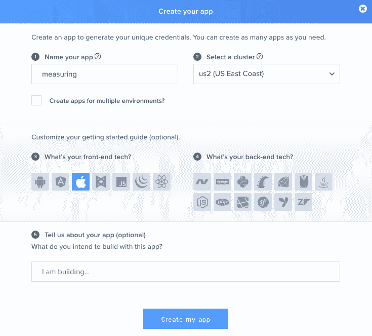

这将为您提供一些开始使用的示例代码:

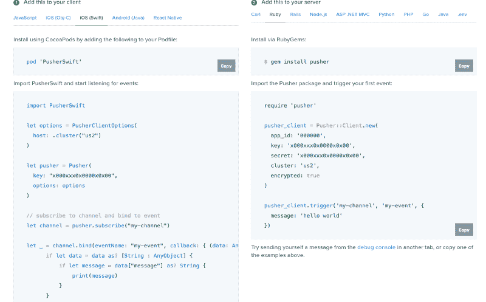

保存您的密钥、机密和集群值，因为我们稍后会用到它们。

最后，进入 **App 设置**选项卡，勾选**启用客户端事件**选项，点击**更新**:

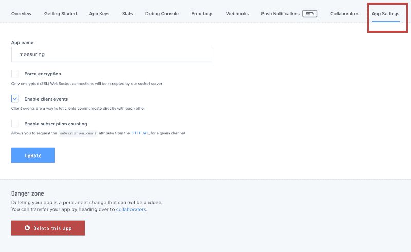

我们要做的是发布一个客户端[事件](https://pusher.com/docs/client_api_guide/client_events)来实时发送计算出的度量。

事件是 Pusher 中打包消息的主要方式。使用 Pusher 时，并非所有这些事件都需要到 web 服务器进行验证或持久化。

在某些情况下，就像在这个应用程序中，事件可以直接从客户端发送到推送器，并从那里发送到连接到通道的所有其他客户端。然而，有些事情我们需要考虑到:

*   必须为应用程序启用客户端事件(就像我们所做的那样)。
*   用户必须订阅触发事件的频道。
*   客户端事件只能在[私有](https://pusher.com/docs/private_channels)和[在线](https://pusher.com/docs/presence)通道上触发，因为它们需要认证
*   客户端事件必须以`client-`为前缀。
*   每个客户端(连接)每秒发布的消息不要超过 [10 条](https://pusher.com/docs/client_api_guide/client_events#rate_limit)。任何超过此速率限制触发的事件都将被拒绝。

在`ViewController`中，让我们导入 Pusher 库并实例化对象。我们将为通道定义一个变量，并定义另一个变量来控制触发事件的速率:

```
...
```

```
import PusherSwift
```

```
class ViewController: UIViewController, ARSCNViewDelegate {
```

```
 ...
```

```
 let pusher = Pusher(
```

```
 key: "<YOUR_PUSHER_APP_KEY>",
```

```
 options: PusherClientOptions(
```

```
 authMethod: .inline(secret: "<YOUR_PUSHER_APP_SECRET&gt;"),
```

```
 host: .cluster("YOUR_PUSHER_APP_CLUSTER")
```

```
 )
```

```
 )
```

```
 var channel: PusherChannel!
```

```
 var sendingTime : TimeInterval = 0
```

```
 ...
```

```
}
```

我们必须为客户端事件使用私有的认证通道。Pusher Swift 库通过`authMethod`选项提供以下认证方法:

*   `endpoint(authEndpoint:String)`
    客户端将向您指定的端点发出 POST 请求。
*   `authRequestBuilder(authRequestBuilder:AuthRequestBuilderProtocol)`
    你指定一个符合[AuthRequestBuilderProtocol](https://github.com/pusher/pusher-websocket-swift/blob/master/Source/AuthRequestBuilderProtocol.swift)的对象。
*   `inline(secret:String)`
    您的应用程序的秘密，这样就不需要向您的验证端点发出验证请求。相反，订阅可以直接在库中进行身份验证，并用于开发。
*   `authorizer(authorizer:Authorizer)`
    您指定一个符合[授权者](https://github.com/pusher/pusher-websocket-swift/blob/master/Source/Authorizer.swift)协议的对象，以提供适当的授权信息。
*   `noMethod`
    如果不需要设置认证方式，这是默认值。

您可以在这个页面上了解如何创建一个[认证端点。为简单起见，我们使用不需要服务器进行认证的`inline`选项。](https://pusher.com/docs/authenticating_users#implementing_endpoints)

在方法`viewDidLoad`中，订阅一个私人频道。记住使用`private-`前缀并连接到推动器:

```
override func viewDidLoad() {
```

```
 ...
```

```
 // subscribe to channel and connect
```

```
 channel = pusher.subscribe("private-channel")
```

```
 pusher.connect()
```

```
}
```

让我们向类中添加一个函数来发送客户端事件。记得使用`client-`前缀:

```
func sendPusherEvent() {
```

```
 channel.trigger(eventName: "client-new-measurement",       data: String(format: "%.2f cm", distance * 100.0)  )
```

```
}
```

记住方法`renderer`和`measure`功能每帧执行一次。理想情况下，这是每秒 60 次。为了限制发送到 Pusher 的客户端事件的数量，我们将使用`renderer`方法的`TimeInterval`参数。这告诉我们场景更新的时间。

修改方法`measure`,将参数作为实参传递:

```
func renderer(_ renderer: SCNSceneRenderer, updateAtTime time: TimeInterval) {
```

```
 // Call the method asynchronously to perform
```

```
 //  this heavy task without slowing down the UI
```

```
 DispatchQueue.main.async {
```

```
 self.measure(time: time)
```

```
 }
```

```
}
```

```
func measure(time: TimeInterval) {
```

```
 ...
```

```
}
```

现在，在设置盒子旋转后，添加下面的`if`块:

```
func measure(time: TimeInterval) {
```

```
 ...
```

```
 if let result = planeTestResults.first {
```

```
 status = "READY"
```

```
 if mode == .measuring {
```

```
 ...
```

```
 box.rotation = SCNVector4(x: 0, y: 1, z: 0,           w: -(angleInRadians + Float.pi)      )
```

```
 // Only send the Pusher event after the specified interval
```

```
 if time > sendingTime {
```

```
 sendPusherEvent();
```

```
 sendingTime = time + TimeInterval(0.2)
```

```
 }
```

```
 }
```

```
 } ...
```

```
}
```

在第一次运行时，时间将大于`sendingTime.`，但是随后，我们将`0.2`秒(或 200 毫秒)加到时间上来设置`sendingTime`的新值。这样，我们可以确保 Pusher 事件每秒最多执行 5 次。

不过由于这个时差，最后一个措施大概不会发了。所以我们可以在用户完成测量时调用`sendPusherEvent`方法:

```
@IBAction func switchChanged(_ sender: UISwitch) {
```

```
 if sender.isOn {
```

```
 mode = .measuring
```

```
 } else {
```

```
 mode = .waitingForMeasuring
```

```
 sendPusherEvent()
```

```
 }
```

```
}
```

当然，我们可以将最后一项措施发送给 Pusher 以避免此问题。但是只发送一个值有什么意思呢？

### 测试应用程序

启动应用程序:

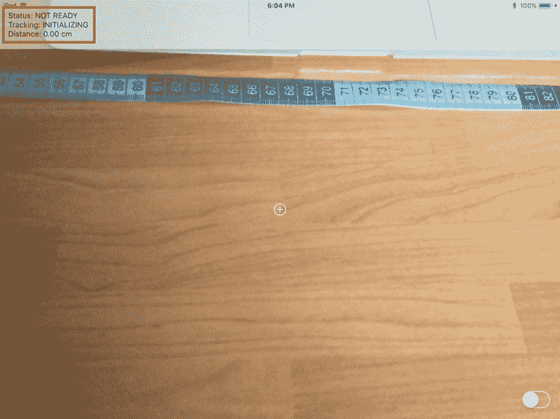

可能需要几秒钟来初始化并找到一架飞机，以便状态可以更改为*就绪*，在您的设备周围缓慢移动，并观察相机的跟踪状态，以稍微加快该过程。

一旦*就绪*，您将能够进行测量，并在您的设备上实时查看测量结果:

在你的推动器[仪表板](https://dashboard.pusher.com)的调试控制台上:

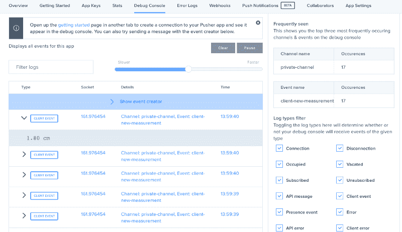

### 结论

在本教程中，您学习了如何使用 ARKit 创建一个基本的测量应用程序，以及如何使用 Pusher 从一个 *iOS* 应用程序发送客户端事件。

追踪真实世界的特征是增强现实体验的重要部分。然而，有时结果并不准确，因为环境可能难以测量。在 [ARKit 文档](https://developer.apple.com/documentation/arkit/understanding_augmented_reality)中，你可以找到一些改善 AR 体验的小技巧。

请记住，您可以在这个 GitHub 库的[上找到完整的项目。](https://github.com/eh3rrera/MeasureARKitPusher)