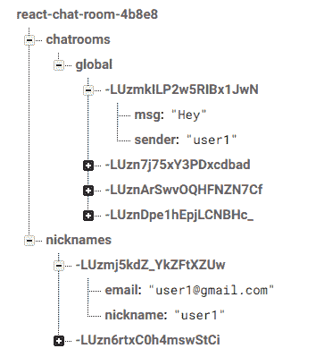

# 如何用 Firebase 和 React (Hooks)建立一个实时聊天室

> 原文：<https://www.freecodecamp.org/news/how-to-build-a-real-time-chatroom-with-firebase-and-react-hooks-eb892fa72f1e/>

阿斯温·帕布

如果你是前端开发，我打赌你知道什么是[](https://reactjs.org)**。它已经成为最受欢迎的**前端框架**，而且似乎没有放缓的趋势。 [**Firebase**](https://firebase.google.com/) 是由Google 创建的**后端服务**，它使开发者能够快速迭代他们的应用程序，而不用担心认证、数据库、存储等日常工作。**

****

**Firebase 有两个数据库选项，都有令人敬畏的 [**实时能力**](https://firebase.google.com/docs/firestore/query-data/listen) 。例如，您可以使用以下 JavaScript 代码片段订阅 firebase cloud firestore 中存储的文档的更改。**

```
`db.collection("cities").doc("SF")    .onSnapshot(function(doc) {        console.log("Current data: ", doc.data());    });`
```

**提供给`onSnapshot()`函数的回调在每次文档改变时触发。您的应用程序的本地写入将通过一个名为延迟补偿的功能立即启动。**

**[**react 挂钩**](https://reactjs.org/docs/hooks-intro.html) 是一个即将推出的 React 特性，让你不用写类就可以使用状态和其他 React 特性。他们目前在 react v16.7.0-alpha 中。构建这个应用程序是用 react 挂钩探索 react 未来的一个很好的方式。**

**最终产品将是一个像全球聊天室应用程序的 IRC，我们首先要求用户输入昵称。简单。**

### **脚手架**

**使用官方的[**create-react-app**](https://www.npmjs.com/package/create-react-app)CLI 工具，通过以下终端命令，可以轻松创建一个新的 react app(react 挂钩需要 react 和 react-dom v16.7.0-alpha)。**

```
`npm i -g create-react-appcreate-react-app react-firebase-chatroomcd react-firebase-chatroomnpm i -S react@16.7.0-alpha.2 react-dom@16.7.0-alpha.2`
```

**firebase 的设置也非常简单。从 [**firebase 控制台**](https://console.firebase.google.com/) **创建一个新项目。**在测试模式下设置 firebase 实时数据库。用[**firebase-tools**](https://www.npmjs.com/package/firebase-tools?activeTab=versions)**命令初始化本地项目。选择实时数据库和托管作为启用的功能。选择`build`作为公共目录。其他选项可以保持不变。****

```
**`npm i -g firebase-toolsfirebase-tools initnpm i -S firebase`**
```

****在初始化存储库之前，您可能需要登录。****

****数据库结构将如下所示。****

****

Database structure**** 

### ****使用良好的旧的基于类的组件构建应用****

****React 钩子仍然是一个实验性的特性，API 将来可能会改变。因此，让我们先来看看如何用基于类的组件构建应用程序。我只使用了`App`组件，因为应用程序逻辑足够简单。****

****如果`joined`变量是`false`，用户将被提示加入昵称和电子邮件。在`constructor`中它最初被设置为假。****

```
**`constructor() {    super();    this.state = {      joined: false,      nickname: "",      email: "",      msg: "",      messages: {},    };    this.chatRoom = db.ref().child('chatrooms').child('global');    this.handleNewMessages = snap => {      console.log(snap.val());      if (snap.val()) this.setState({ messages: snap.val() });    };  }`**
```

```
 **`componentDidMount() {    this.chatRoom.on('value', this.handleNewMessages);  }`**
```

```
 **`componentWillUnmount() {    this.chatRoom.off('value', this.handleNewMessages);  }`**
```

****所有的消息最初都是在`componentDidMount`生命周期方法中从 firebase 获取的。db ref 上的`on`方法将一个[事件类型](https://firebase.google.com/docs/reference/js/firebase.database.Reference#on)和一个回调作为参数。每次用户发送新消息并更新数据库时，`handleNewMessages`函数都会接收到更新数据的快照，并用新消息更新状态。我们可以使用 db ref 上的`off`方法取消订阅`componentWillUnmount`生命周期方法中的数据库更新。****

****可以通过将消息附加到数据库上的聊天室 ref 来发送消息。ref 的`push`方法为新条目生成一个惟一的 id，并将其附加到现有数据中。****

```
**`this.chatRoom.push({  sender: this.state.nickname,  msg: this.state.msg,});`**
```

****通过在`messages`对象上循环来呈现消息。****

```
**`{Object.keys(this.state.messages).map(message => {  if(this.state.messages[message]["sender"] === this.state.nickname)    // render the user's messages        else    // render messages from other users})}`**
```

****最终的`App`组件看起来像这样。****

****在这里找到[](https://gist.github.com/aswinmprabhu/665c555577f78b4865bb782bb26df3bb)****的要旨。********

### ****迁移到反应钩子****

****最简单的挂钩是`useState`挂钩。它获取初始状态，并返回状态变量和一个允许您更新它的函数。该功能替代了`this.setState`。例如，昵称状态逻辑可以修改如下。****

```
**`const [nickname, setNickname] = useState("");const handleNameChange = e => setNickname(e.target.value);...// during render<input placeholder="Nickname" value={nickname} onChange={handleNameChange} />`**
```

****下一个挑战是在生命周期方法中为逻辑找到一个位置。这就是`useEffect`钩子的用处。这是我们执行有副作用的逻辑的地方。它可以被认为是所有生命周期方法的组合。`useEffect`也可以选择返回一个用于清理的函数(比如取消订阅一个事件)。****

```
**`useEffect(() => {  const handleNewMessages = snap => {    if (snap.val()) setMessages(snap.val());  }  chatRoom.on('value', handleNewMessages);  return () => {    chatRoom.off('value', handleNewMessages);  };});`**
```

****订阅和取消订阅是分成不同生命周期方法的相关逻辑片段。现在它们被放在一个钩子上。针对不同的副作用使用不同的`useEffect`钩子可以实现问题的分离。****

****默认情况下，`useEffect`在第一次渲染*后运行，在每次更新后运行*。****

****使用钩子的一个主要优点是有状态逻辑可以在组件之间重用。例如，假设您想要在多个组件中重用电子邮件输入处理和验证逻辑。如下所示，自定义挂钩可以实现这一点。自定义钩子是一个可以调用其他钩子的函数，以“use”开头。从“使用”开始不是一个规则，而是一个非常重要的约定。****

```
**`function useEmail(defaultEmail) {  const [email, setEmail] = useState(defaultEmail);  const [isValidEmail, setValidEmail] = useState(defaultEmail);`**
```

```
 **`function validateEmail(email) {    const re = /^(([^<>()\[\]\\.,;:\s@"]+(\.[^<>()\[\]\\.,;:\s@"]+)*)|(".+"))@((\[[0-9]{1,3}\.[0-9]{1,3}\.[0-9]{1,3}\.[0-9]{1,3}\])|(([a-zA-Z\-0-9]+\.)+[a-zA-Z]{2,}))$/;    return re.test(String(email).toLowerCase());  }`**
```

```
**`function handleEmailChange(e) {    if (validateEmail(e.target.value)) {      setValidEmail(true);    }    setEmail(e.target.value);  }  return {    email,    handleEmailChange,    isValidEmail  };}`**
```

****在您的组件中，您可以使用如下所示的自定义挂钩。****

```
**`// in your componentsconst { email, handleEmailChange, isValidEmail } = useEmail("")...<input value={email} value={email} onChange={handleEmailChange} />// show error message based on isValidEmail`**
```

****定制钩子也使得独立于使用钩子的组件对一部分逻辑进行单元测试变得更加容易。****

****最终的`App`组件如下所示。****

****在这里找到[T1](https://gist.github.com/aswinmprabhu/601e74d26e88e882038764cc2e0b3df6)的要旨。****

#### ****钩子上还有更多可以读的****

1.  ****[**挂钩背后的动机**](https://reactjs.org/docs/hooks-intro.html#motivation)****
2.  ****[**金钩法则**](https://reactjs.org/docs/hooks-rules.html)****
3.  ****[**钩子 API 引用**](https://reactjs.org/docs/hooks-reference.html)****
4.  ****丹·阿布拉莫夫 的《理解钩子》****

****找到 **[最少造型裸露的最终 app](https://react-chat-room-4b8e8.firebaseapp.com/)** 。****

****感谢阅读和快乐的黑客！****

****在 [**Twitter**](https://twitter.com/aswinmprabhu) 和 [**GitHub**](https://github.com/aswinmprabhu) **上找我。******