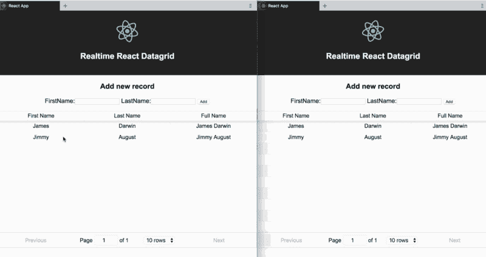
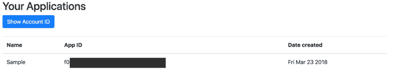

# 如何在 React 中构建实时可编辑的数据网格

> 原文：<https://www.freecodecamp.org/news/how-to-build-a-real-time-editable-datagrid-in-react-c13a37b646ec/>

彼得·姆巴努戈

# 如何在 React 中构建实时可编辑的数据网格



数据网格使您能够显示和编辑数据。在大多数数据驱动的应用程序中，这是一个至关重要的特性。

您过去可能已经在 React 应用程序中实现了这一点。也许你使用过像 [react-bootstrap-table](https://react-bootstrap-table.github.io/react-bootstrap-table2/) 、 [react-grid](https://github.com/eddyson-de/react-grid) 或 [react-table](https://react-table.js.org/) 这样的库。有了这些，您可以向 React 应用程序添加数据网格。但是，如果您希望实时完成更改，并在所有连接的设备及其浏览器之间同步更新，该怎么办呢？

在本文中，我将向您展示如何使用 [react-table](https://react-table.js.org/) 和 [Hamoni Sync](https://www.hamoni.tech/) 在 React 中构建实时数据网格。

react-table 是一个轻量级的快速库，用于在 react 中呈现表格，它支持分页和许多其他功能。

Hamoni Sync 是一个实时状态同步服务，使您能够实时同步您的应用程序状态。我将向您展示如何用人们的名字和姓氏构建数据网格。

如果您想继续学习，您应该对 React 有所了解，并安装以下工具:

1.  [节点 j](https://dev.to/nodejs.org)
2.  [NPM](http://npmjs.com/)&npx。如果您安装了 npm 版本 5.2.0 或更高版本，它会将 npx 与 npm 一起安装。
3.  [创建-反应-应用](https://github.com/facebook/create-react-app)

### 创建 React 应用

首先，我们将使用 create-react-app 创建一个新的 React 项目。

打开命令行，运行`npx create-react-app realtime-react-datatable`。这将通过创建一个包含构建 React 应用程序所需文件的新目录`realtime-react-datatable`来引导 React 应用程序。

创建了 React 应用程序后，我们需要安装 react-table 和 Hamoni Sync。仍然在命令行上，运行`cd realtime-react-datatable`切换到应用程序的目录。在命令行中运行`npm i react-table hamoni-sync`来安装这两个包。

### 呈现数据网格

为了呈现数据网格，我们将使用 react-table 组件。打开文件`src/App.js`，用下面的代码更新它:

```
import React, { Component } from "react";import logo from "./logo.svg";import "./App.css";// Import React Tableimport ReactTable from "react-table";import "react-table/react-table.css";// Import Hamoni Syncimport Hamoni from "hamoni-sync";
```

```
class App extends Component {  constructor() {    super();    this.state = {      data: [],      firstName: "",      lastName: ""    };  }
```

```
 handleChange = event => {    if (event.target.name === "firstName")      this.setState({ firstName: event.target.value });    if (event.target.name === "lastName")      this.setState({ lastName: event.target.value });  };
```

```
 handleSubmit = event => {    event.preventDefault();  };
```

```
 renderEditable = cellInfo => {    return (      <div        style={{ backgroundColor: "#fafafa" }}        contentEditable        suppressContentEditableWarning        onBlur={e => {          const data = [...this.state.data];          data[cellInfo.index][cellInfo.column.id] = e.target.innerHTML;          this.setState({ data });        }}        dangerouslySetInnerHTML={{          __html: this.state.data[cellInfo.index][cellInfo.column.id]        }}      />    );  };
```

```
 render() {    const { data } = this.state;
```

```
 return (      <div className="App">        <header className="App-header">                    <h1 className="App-title">Welcome to React</h1>        </header>        <p className="App-intro">          <form onSubmit={this.handleSubmit}>            <h3>Add new record</h3>            <label>              FirstName:              <input                type="text"                name="firstName"                value={this.state.firstName}                onChange={this.handleChange}              />            </label>{" "}            <label>              LastName:              <input                type="text"                name="lastName"                value={this.state.lastName}                onChange={this.handleChange}              />            </label> 
```

```
 <input type="submit" value="Add" />          </form>        </p>        <div>          <ReactTable            data={data}            columns={[              {                Header: "First Name",                accessor: "firstName",                Cell: this.renderEditable              },              {                Header: "Last Name",                accessor: "lastName",                Cell: this.renderEditable              },              {                Header: "Full Name",                id: "full",                accessor: d => (                  <div                    dangerouslySetInnerHTML={{                      __html: d.firstName + " " + d.lastName                    }}                  />                )              }            ]}            defaultPageSize={10}            className="-striped -highlight"          />        </div>      </div>    );  }}
```

```
export default App;
```

上面的代码呈现了一个表单和一个可编辑的 react-table 组件。`<ReactTable` / >呈现组件 `wit`h`data, c`columns`, and defaultPa`geSize props`. Th`e data props 保存要显示的数据`, and c`columns props for the column definition`. The ac`cesser proper`ty in c`columns props 表示保存要为该 co 显示的值的属性`lumn. Cell: this.renderEd`fitable proper`ty in c`columns props 告诉 react-table 该列是可编辑的。other funct `ions (handle` Sub `mit & handle` Change)允许从页面上的表单获取新的数据条目。

### Add Hamoni Sync

将使用 Hamoni Sync 实时检索和更新数据网格的数据。我们已经在`App.js`的第 18 行导入了 Hamoni 库；

```
import Hamoni from "hamoni-sync";
```

我们需要初始化它并连接到 Hamoni 服务器。为此，我们需要一个帐户和应用程序 ID。按照以下步骤在 Hamoni 中创建一个应用程序。

1.  注册并登录 Hamoni [仪表盘](https://dashboard.hamoni.tech/)
2.  在文本字段中输入您首选的应用程序名称，然后单击创建按钮。这将创建应用程序，并将其显示在应用程序列表部分。
3.  单击“显示帐户 ID”按钮查看您的帐户 ID。



将以下代码添加到`App.js`以初始化并连接到 Hamoni 同步服务器。

```
componentDidMount() {    let hamoni = new Hamoni("ACCOUNT_ID", "APP_ID");
```

```
 hamoni      .connect()      .then(() =>; {
```

```
 })      .catch(console.log);  }
```

上面的代码将客户端设备或浏览器连接到 Hamoni 同步服务器。从仪表板复制您的帐户和应用程序 ID，并用字符串占位符分别替换它们。

将以下内容添加到`then()`块中的函数中，当它成功连接到服务器时执行:

```
hamoni    .get("datagrid")    .then(listPrimitive => {      this.listPrimitive = listPrimitive;
```

```
 this.setState({        data: [...listPrimitive.getAll()]      });
```

```
 listPrimitive.onItemAdded(item => {        this.setState({ data: [...this.state.data, item.value] });      });
```

```
 listPrimitive.onItemUpdated(item => {        let data = [        ...this.state.data.slice(0, item.index),        item.value,        ...this.state.data.slice(item.index + 1)        ];
```

```
 this.setState({ data: data });      });
```

```
 listPrimitive.onSync(data => {        this.setState({ data: data });      });    })    .catch(console.log);
```

上面的代码调用`hamoni.get("datagrid")`来获取数据，用`datagrid`作为 Hamoni Sync 上应用程序状态的名称。Hamoni Sync 允许您存储三种状态，称为同步原语。它们是:

1.  **值原语**:这种状态保存简单的信息，用字符串、布尔或数字等数据类型表示。它最适合于未读消息计数、切换等情况。
2.  **对象原语**:对象状态表示可以被建模为 JavaScript 对象的状态。一个示例用途可以是存储游戏的分数。
3.  **List 原语**:保存状态对象的列表。状态对象是 JavaScript 对象。您可以根据项目在列表中的索引来更新项目。

如果状态可用，它解析并返回一个带有状态原语对象的承诺。这个对象为我们提供了实时更新状态和获取状态更新的方法。

在第 36 行，我们使用了`getAll()`方法来获取数据并为 React 组件设置状态。此外，方法`onItemAdded()`和`onItemUpdated()`用于在添加或更新项目时获取更新。`onSync()`方法在设备或浏览器失去连接的情况下很有用，当它重新连接时，它试图从服务器获取最新状态，并更新本地状态(如果有的话)。

### 添加和更新项目

从上一节中，我们能够获得 datagrid 的数据，并在添加或更新项目时更新状态。让我们添加代码，以便在编辑完一列后添加新项和更新一项。将以下代码添加到`handleSubmit`方法中:

```
handleSubmit = event => {    this.listPrimitive.push({        firstName: this.state.firstName,        lastName: this.state.lastName    });    this.setState({ firstName: "", lastName: "" });    event.preventDefault();};
```

这段代码从表单中获取名字和姓氏，并通过调用`push()`方法将其添加到 Hamoni Sync 上的列表状态原语中。这将触发`onItemAdded()`方法。

为了在数据网格中编辑时更新项目，我们将更新传递给第 84 行的`onBlur` props 的函数，如下所示:

```
onBlur={e => {    let row = this.state.data[cellInfo.index];    row[cellInfo.column.id] = e.target.innerHTML;    this.listPrimitive.update(cellInfo.index, row);}}
```

这段代码更新从`cellInfo`对象中检索到的索引处的项目。要在 Hamoni Sync 中更新一个列表状态原语，可以用项目的索引和要更新的值调用`update()`方法。经过最后一次修改后，`renderEditable`方法现在应该是这样的:

```
renderEditable = cellInfo => {    return (      <div        style={{ backgroundColor: "#fafafa" }}        contentEditable        suppressContentEditableWarning        onBlur={e => {          let row = this.state.data[cellInfo.index];          row[cellInfo.column.id] = e.target.innerHTML;          this.listPrimitive.update(cellInfo.index, row);        }}        dangerouslySetInnerHTML={{          __html: this.state.data[cellInfo.index][cellInfo.column.id]        }}      />    );  };
```

此时，除了将在数据网格上呈现的初始数据之外，我们几乎拥有了运行应用程序所需的所有内容。

我们需要创建状态，并在 Hamoni Sync 上给它一些数据。在工作目录的根目录下添加一个新文件 **seed.js** ，并向其中添加以下代码:

```
const Hamoni = require("hamoni-sync");
```

```
let hamoni = new Hamoni("AccountID", "APP_ID");
```

```
hamoni  .connect()  .then(response => {    hamoni      .createList("datagrid", [        { firstName: "James", lastName: "Darwin" },        { firstName: "Jimmy", lastName: "August" }      ])      .then(() => console.log("create success"))      .catch(console.log);  })  .catch(console.log);
```

这将在 Hamoni Sync 上创建一个列表原语状态，名称为`datagrid`。用您的帐户和应用程序 ID 替换`AccountID`和`APP_ID`字符串。打开命令行，运行`node seed.js`。这应该成功并打印出`create success`的消息。

现在，我们可以启动 React 应用程序，并查看我们的应用程序的运行情况！在命令行中运行命令`npm start`，它会在你的默认浏览器中打开应用程序。


万岁！我们有一个带分页的实时可编辑数据网格！

### 结论

我们在 React 中使用 [react-table](https://react-table.js.org/) 和 [Hamoni Sync](https://www.hamoni.tech/) 构建了一个实时数据网格。react-table 为数据网格提供动力，Hamoni Sync 处理数据网格的状态。这一切都是通过几行代码和较少的工作设计实时状态逻辑实现的。你可以得到我们在 [GitHub](https://github.com/pmbanugo/realtime-react-datatable) 上完成的应用。可以跟踪哪个单元格正在被编辑，或者锁定其他用户当前正在编辑的单元格。我会把它留给你作为周末的消遣。

如果有任何不清楚的地方，或者在尝试添加锁定或突出显示正在编辑的单元格时遇到问题，请随时发表评论。

快乐编码？