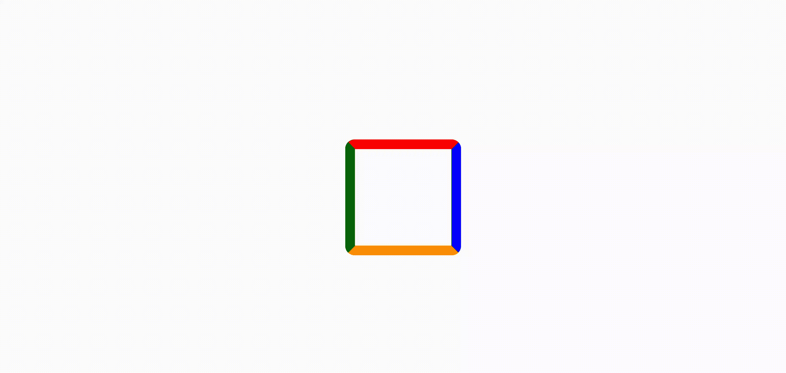
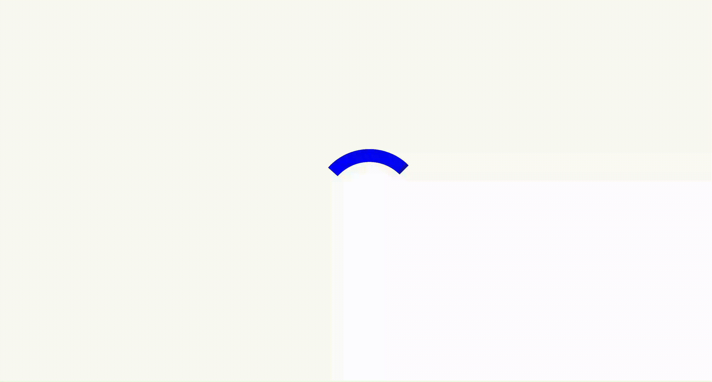
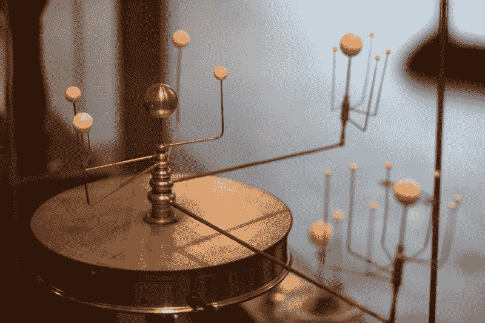

# 如何只用 HTML 和 CSS 构建一个受 Reddit 启发的加载微调器

> 原文：<https://www.freecodecamp.org/news/how-to-build-a-reddit-inspired-loading-spinner-with-only-html-and-css-5b2fca3fdca/>

丹尼尔·米勒

# 如何只用 HTML 和 CSS 构建一个受 Reddit 启发的加载微调器


Loading spinner inspired by the Reddit mobile app.

[Reddit 的](https://www.reddit.com/)移动应用有一个相当惊人的加载旋转器，让人想起围绕行星或恒星旋转的轨道物体。大多数开发人员会使用 JavaScript 或 SVG 来完成这样的任务，但是多亏了`[**animation-iteration-count**](https://developer.mozilla.org/en-US/docs/Web/CSS/animation-iteration-count)**: infinite;**` 和一些其他技巧，这甚至都不是必需的。今天我将向你展示如何用 HTML 和 CSS 编写一个受 Reddit 启发的旋转器！

下面是最终结果:

[https://codepen.io/bronzebygold/embed/preview/YBEjKo?height=300&slug-hash=YBEjKo&default-tabs=css,result&host=https://codepen.io](https://codepen.io/bronzebygold/embed/preview/YBEjKo?height=300&slug-hash=YBEjKo&default-tabs=css,result&host=https://codepen.io)

### 基本设置

让我们从编写一些 HTML DOM 元素开始，我们可以将中心圆和每个旋转轨道固定在这些元素上。

```
<div class="center"></div>
<div class="inner-spin">

  ...

</div>
<div class="outer-spin">

  ...

</div>
```

`**inner-spin**`和`**outer-spin**`元素将是所有需要动画的父节点，最终我们将对这些父节点应用 CSS [关键帧](https://developer.mozilla.org/en-US/docs/Web/CSS/@keyframes)变换。

在上面的代码示例中，省略号(`**…**`)代表弧线和轨道“月亮”内环和外环都包含两个弧和两个月亮，但由于稍后将变得清楚的原因，每个弧实际上由两个 CSS 形状组成，因此我们总共需要八个弧和四个月亮。完整的 HTML 如下所示:

```
<div class="center"></div>
<div class="inner-spin">

  <div class="inner-arc inner-arc_start-a"></div>
  <div class="inner-arc inner-arc_end-a"></div>
  <div class="inner-arc inner-arc_start-b"></div>
  <div class="inner-arc inner-arc_end-b"></div>

  <div class="inner-moon-a"></div>
  <div class="inner-moon-b"></div>

</div>
<div class="outer-spin">

  <div class="outer-arc outer-arc_start-a"></div>
  <div class="outer-arc outer-arc_end-a"></div>
  <div class="outer-arc outer-arc_start-b"></div>
  <div class="outer-arc outer-arc_end-b"></div>

  <div class="outer-moon-a"></div>
  <div class="outer-moon-b"></div>

</div>
```

### CSS 形状

简单地创建一个正方形`****<div>****`并将`****border-radius****`设置为 50%,就可以在 CSS 中绘制圆和弧。

边框的每一边可以采用不同的颜色，或者可以设置为`****transparent****`。属性设置形状的填充，如果有的话。



很容易画出 90 度、180 度和 270 度的弧线，只需将边框的一边或多边设置为透明即可。然而，如果你仔细观察页面顶部的旋转器，你会注意到每个轨道的“尾巴”在它自己和它后面的月亮之间留有一个间隙。这意味着，尽管弧长接近 180 度，但它们还不到 180 度。

在 CSS 中绘制不规则长度的圆需要一点技巧。为此，我们需要绘制两个相邻的 90 度弧段，并稍微旋转一个，使它们重叠，留下一个大约 160 度的明显弧段。



现在回头看看 HTML，您可能会猜到为什么我们为每个弧设置了两个节点(一个`**arc_start**`和`**arc_end**`)。这些将用于表示代表每个轨道尾部的单个重叠弧的每个部分。

### 设置 CSS

首先，我们将设置一个 [CSS 变量](https://developer.mozilla.org/en-US/docs/Web/CSS/Using_CSS_variables)来表示微调器的颜色，并设置另一个变量来表示-50%，-50% translate，我们将在整个 CSS 中使用它来使形状围绕它们的中心居中(与它们的左上角相对，这是默认的)。

```
html {
  --spinner: #1EAAF0;
  --center: translate(-50%, -50%);
}
```

现在我们可以继续绘制中心圆了。

```
.center {
   position: absolute;
   width: 30px;
   height: 30px;
   background: var(--spinner);
   border-radius: 50%;
   top: 50%;
   left: 50%;
   transform: var(--center); 
}
```

每个轨道的子节点都包含在名为`**inner-spin**`和`**outer-spin**`的父节点中。现在，我们将使用它们在窗口中居中微调。

```
.outer-spin, .inner-spin {
  position: absolute;
  top: 50%;
  left: 50%;
}
```

### 画轨道

加载微调器基本上是一系列同心圆，所以让我们首先集中绘制一个圆弧。

因为每个弧由两个重叠的部分组成，让我们开始画两个相邻的弧。

```
.inner-arc {
  width: 62px;
  height: 62px;
}
.inner-arc_start-a {
  border-color: transparent transparent transparent green;
  /* NOTE: the order here very much matters! */
  transform: var(--center) rotate(0deg); 
}
.inner-arc_end-a {
  border-color: red transparent transparent transparent;
  transform: var(--center) rotate(0deg);
}
```

第一次变换将`****<div>****`放在窗口的中心。旋转设置为零度，以显示圆弧的默认状态。


Since arcs are formed from the four borders of a square <div>, the arcs do not line up with cartesian quadrants be default.

请注意，圆弧没有与单位圆上的 x 交叉点对齐。为了纠正这种情况，并使圆弧更容易处理，我们将圆弧旋转了 45 度。然后，我们稍微过度旋转其中一个弧，以创建一个大约 160 度的总弧长。

```
.inner-arc_start-a {
  border-color: transparent transparent transparent green;
  transform: var(--center) rotate(65deg); 
}
.inner-arc_end-a {
  border-color: red transparent transparent transparent;
  transform: var(--center) rotate(45deg);
}
```


Overlapping 160 degree arc rotated to align with (1, 0) on the unit circle.

接下来，我们可以通过沿 x 轴移动其中一个轨道卫星来定位它。不幸的是，与 SVGs 等矢量图形不同，CSS 边框不是接受笔画样式的无宽度矢量。这意味着不会自动测量到线中心点的距离。定位对象时，我们必须考虑边框的宽度。

这就产生了几个“[幻数](https://en.wikipedia.org/wiki/Magic_number_(programming))，如果我们想设置更多的 CSS 变量并使用`[calc()](https://developer.mozilla.org/en-US/docs/Web/CSS/calc)` [函数](https://developer.mozilla.org/en-US/docs/Web/CSS/calc)的话，我们可能会最小化这些幻数。这似乎有点复杂，所以我现在只按像素值来定位圆圈。

```
.inner-moon-a {
   position: absolute;
   top:50%;
   left:50%;
   width: 12px;
   height: 12px;
   background: red;
   border-radius: 50%;
   transform: var(--center) translate(33px, 0); 
}
```


First moon aligned with its tail.

接下来我们再画两条弧线，但是这次我们使用`scale(-1, -1)`变换。这将沿 x 轴和 y 轴翻转弧线，基本上与轨迹成镜像。

```
.inner-arc_start-b {
  border-color: transparent transparent transparent var(--spinner); 
  transform: var(--center) rotate(65deg) scale(-1, -1);
}
.inner-arc_end-b {
  border-color: var(--spinner) transparent transparent transparent;
  transform: var(--center) rotate(45deg) scale(-1, -1);
```


最后，对于外轨道，我们简单地从内轨道开始重复 CSS，但是设置更大的`****<div>****`高度和宽度！(想象一下这个 CSS 有了 [SASS mixins](https://scotch.io/tutorials/how-to-use-sass-mixins) 会有多短！)

```
.outer-arc {
  width: 100px;
  height: 100px;
}
```

### 添加动画

最后一步是添加动画。首先，我们需要添加一个单独的关键帧元素来设置动画行为的类型和受动画影响的 CSS 元素，在本例中是通过一个`**transform**`属性进行旋转。

```
@keyframes spin { 100% {transform: rotate(360deg); } }
```

标识符“`****spin****`”将关键帧连接回动画属性，我们将在每个父元素`****<div>****`中添加这些属性。animation 属性设置动画的时间信息，这意味着每个轨道将以不同的速度运行。

```
.outer-spin {
  animation: spin 4s linear infinite;
}
.inner-spin {
  animation: spin 3s linear infinite;
}
```



([Image source.](https://commons.wikimedia.org/wiki/File:Planetarium_in_Putnam_Gallery_2,_2009-11-24.jpg))

### 就是这样！

本教程的代码可以在 CodePen.io 上找到[。如果你对我的代码有什么建议、观察或酷叉，请评论或发推特给我](https://codepen.io/bronzebygold/pen/bOyMQy) [@PleathrStarfish](https://twitter.com/PleathrStarfish) ！