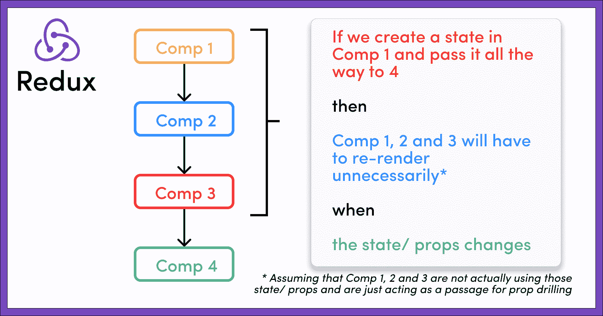
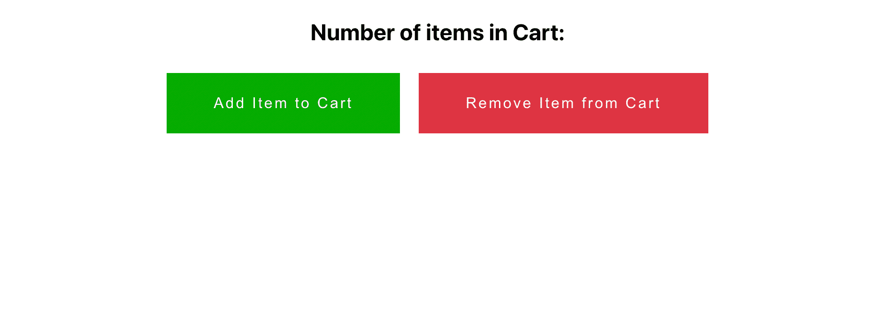
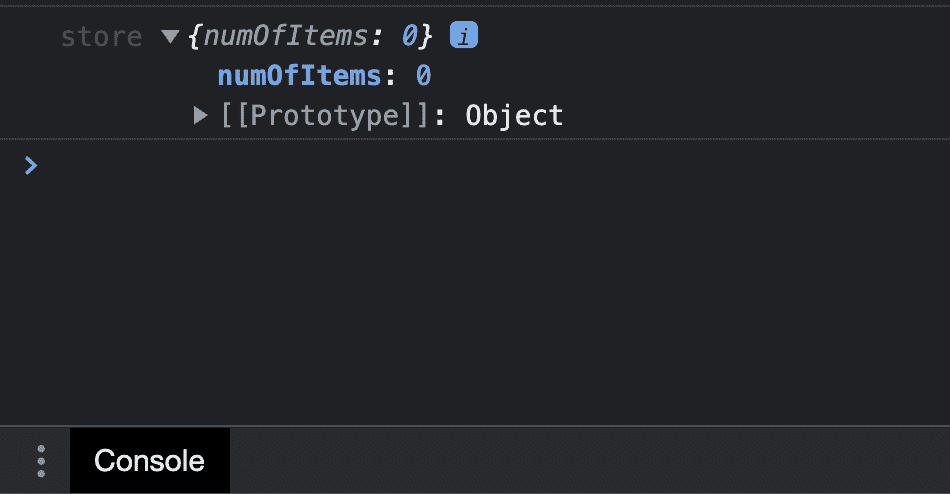
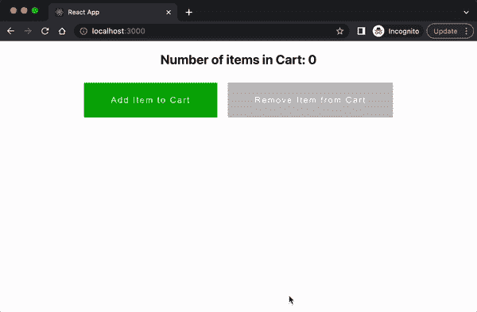

# 如何构建基于 Redux 的 React 应用程序

> 原文：<https://www.freecodecamp.org/news/how-to-build-a-redux-powered-react-app/>

## 我们正在解决的问题

在许多情况下，当我们想要创建一个小的应用程序时，我们可能会有一些组件声明并使用它们自己的状态。在少数情况下，组件可能希望与其直接子组件共享状态。

我们可以通过在一个组件中局部声明状态来处理这些情况——如果需要的话，可能以道具的形式将状态传递给它的子组件(也称为道具钻取)。

但是如果您的应用程序变大了，您可能需要将状态传递给一个子级，这个子级可能是层次结构中的下一级。您可能还需要在兄弟组件之间使用公共状态。

当然，在兄弟组件之间共享状态的情况下，我们可以在它们的父组件中声明状态，然后通过 prop drilling 将状态传递给它们的子组件。但是这并不总是可行的，并且有它自己的缺点，我们稍后会看到。

只需考虑下图:


这是典型 React 应用程序中组件文件结构的示意图。

假设我们需要在孩子 5 和孩子 6 之间共享一个共同的状态。在这种情况下，我们可以很好地在它们的父节点(即子节点 2)中声明一个状态，并将该状态传递给两个子节点(5 和 6)。

目前一切正常。但是如果我们需要孩子 3 也有同样的状态呢？在这种情况下，我们需要在孩子 5、6 和 3 的公共父/祖父中声明状态，即应用程序组件。

同样，如果我们想在树中相距很远的孩子 4、11 和 10 之间共享一个状态，该怎么办呢？我们将再次需要在 App 组件中创建状态，然后执行多级 prop drilling，将状态从 App 传递到这些组件。

和久而久之，我们的应用程序变得越来越大，这将开始使我们的应用程序组件或任何其他类似的公共父组件与不必要的状态声明混杂在一起。这些声明不被这些组件直接使用，而是被它们的一些下级组件使用。

## 多步支柱钻孔的缺点

多级支柱钻探主要有两个缺点。它们是:

*   组件不必要的膨胀:如上所述，随着我们的应用程序变大，一些常见的父组件可能会因为不必要的状态声明而膨胀。这些组件可能不会直接使用这些声明，但是它们可能会被它们的一些远亲使用。其他一些组件也可能变得臃肿，它们只是作为子组件的适当传递者。这也会对代码的可读性产生负面影响。
*   **不必要的重新渲染:**不必要的重新渲染对于客户端应用来说是一个大忌。不必要的重新渲染会使应用程序变得缓慢、滞后、反应迟钝，并给用户带来糟糕的体验。在 React 中，重新渲染是由状态或属性变化以及其他原因引起的。因此，如果一个组件实际上并没有使用一个状态，而只是作为道具从父组件到子组件的通道，那么当状态/道具改变时，它也可能被不必要地重新渲染。看下面的图片可以更好地理解它



## 这个问题的解决方案

这也是我们使用 Redux 或 MobX 这样的状态管理 app，以更统一、更高效的方式处理上述状态管理场景的原因。

在像 Redux 这样的状态管理解决方案中，我们可以创建一个全局状态，并将其放在一个存储中。无论哪个组件需要该存储中的任何状态，都可以通过订阅该存储轻松获得。这样我们就可以摆脱以上两个缺点。

*   **整理组件:**从“实际”使用它的组件按需获取状态，可以通过删除所有不必要的 prop drilling，在很大程度上整理我们的许多组件。
*   **不再有不必要的重新渲染:**因为我们没有仅仅充当道具传递器的组件，所以我们也避免了那些组件的不必要的重新渲染。当状态改变时，只有使用一部分全局状态的组件才重新呈现，这是所期望的行为。

## 你将在这里学到什么

在本教程中，您将学习如何设置自己的 Redux-powered React 应用程序。我们将创建一个 react 应用程序，并设置 redux 来全局管理状态，以便任何组件都可以访问状态的任何部分(因此命名为 redux powered react app)。可以尝试的 redux 的其他选择有 MobX、Zustand 等，但是对于本文，我们将使用 redux。

我们将介绍如何创建商店并将其连接到应用程序。我们还将看到如何编写动作并在用户交互时分派它们。然后，我们将看到如何制作 reducers 和更新商店，从 App 的其他子组件读取商店，等等。

我还将提供所有重要的代码片段，以便您在阅读和编写代码时能够快速启动应用程序。

为了让您在开始时有所了解，这是我们将在结束时构建的内容:


我们将创建一个基本的应用程序，我们可以添加和删除购物车中的项目。我们将管理 Redux 存储中的状态变化，并在 UI 中显示信息。

## 开始之前

在继续学习本教程之前，您应该熟悉 Redux 存储、操作和 reducers。

如果你不是，可以翻翻我上一篇写在 Redux 上的文章(如果你还没有):**[Redux 是什么？为初学者讲解的存储、动作和减速器](https://www.freecodecamp.org/news/what-is-redux-store-actions-reducers-explained/)。**

这将有助于你理解当前的文章。在之前的教程中，我试图解释 Redux 的基本原理/概念。我介绍了什么是商店，什么是行动，以及减速器如何工作。我还讨论了 Redux 的可预测性，并给出了一个例子。


## 初始代码设置

让我们准备好项目所需的一切。只要遵循这些步骤，您很快就可以开始运行了。

### 1.使用 create-react-app 命令创建 React 应用程序

```
npx create-react-app react-app-with-redux 
```

### 2.转到新创建的文件夹

只需键入以下命令即可导航到新文件夹:

```
cd react-app-with-redux 
```

### 3.安装 Redux 和 react-redux 库

可以像这样安装 Redux 和 react-redux:

```
npm install redux react-redux 
```

### 4.运行应用程序

您可以使用以下命令运行您的新应用程序:

```
npm start 
```

## 如何构建主 App

### 5.如何创建减速器

要创建一个 reducer，首先在`src`中创建一个名为`actionTypes`的文件夹。然后在里面创建一个名为`actionTypes.js`的文件。这个文件将包含应用程序将要处理的所有**动作**。

在`actionTypes.js`中增加以下几行:

```
export const ADD_ITEM = "ADD_ITEM";
export const DELETE_ITEM = "DELETE_ITEM"; 
```

由于我们的应用程序将具有添加和删除项目的功能，我们需要上述两种操作类型。

接下来在`src`中创建一个名为`reducers`的文件夹，并在其中创建一个名为`cartReducer.js`的新文件。该文件将包含与**推车**组件相关的所有减速器逻辑。

**注意**:我们将在步骤 8 中创建视图/用户界面，所以请坚持。

在`cartReducer.js`中增加以下几行:

```
import { ADD_ITEM, DELETE_ITEM } from "../actionTypes/actionTypes";

const initialState = {
  numOfItems: 0,
};

export default const cartReducer = (state = initialState, action) => {
  switch (action.type) {
    case ADD_ITEM:
      return {
        ...state,
        numOfItems: state.numOfItems + 1,
      };

    case DELETE_ITEM:
      return {
        ...state,
        numOfItems: state.numOfItems - 1,
      };
    default:
      return state;
  }
}; 
```

正如我们在我之前的教程中讨论的[，我们为应用程序创建了一个**初始状态**，并将其分配给`cartReducer`函数中的默认参数`state`。](https://www.freecodecamp.org/news/what-is-redux-store-actions-reducers-explained/)

该功能开启调度的类型的动作**。然后，根据与动作类型匹配的大小写，对状态进行必要的更改，并返回更新状态的新实例。**

如果没有一个动作类型匹配，那么状态将原样返回。

最后，我们为`cakeReducer`函数创建了一个**默认导出**，以便在商店创建过程中使用它。

### 6.如何创建商店并将其提供给应用程序

在`src`中创建一个名为`store.js`的文件，并使用以下命令创建存储:

```
const store = createStore() 
```

在`store.js`中增加以下几行:

```
import { createStore } from "redux";
import { cartReducer } from "./reducers/cartReducer";

const store = createStore(cartReducer);

export default store; 
```

现在是时候将这个`store`提供给`App`组件了。为此，我们将使用从`react-redux`库中获得的`<Provider>`标签。

我们使用以下语法将整个`App`组件包装在`<Provider>`标签中:

```
// rest of the code ...

<Provider store={store}>
        <div>App Component</div>
        // child components of App/ other logic
</Provider>

// rest of the code ... 
```

通过将`App`组件包装在`<Provider>`标签中，`App`的所有子组件都可以访问`store`。你可以看看我之前写的关于[什么是 Redux 的文章？为初学者讲解的存储、动作、减速器](https://www.freecodecamp.org/news/what-is-redux-store-actions-reducers-explained/)了解更多。

继续`App.js`，将以下几行添加到文件中:

```
import "./App.css";
import { Provider } from "react-redux";
import store from "./store";

function App() {
  return (
    <Provider store={store}>
      <div>App Component</div>
    </Provider>
  );
}

export default App; 
```

### 7.创建行动

现在在`src`中创建一个名为`actions`的文件夹，并在其中创建一个名为`cartAction.js`的文件。在这里，我们将添加一些用户交互中需要**分派**的所有动作。

在`cartAction.js`中添加以下几行:

```
import { ADD_ITEM, DELETE_ITEM } from "../actionTypes/actionTypes";

const addItem = () => {
  return {
    type: ADD_ITEM,
  };
};

const deleteItem = () => {
  return {
    type: DELETE_ITEM,
  };
};

export { addItem, deleteItem }; 
```

在上面的代码中，我们创建了两个动作创建器(返回`action`对象的纯 JS 函数)，分别叫做`addItem()`和`deleteItem()`。两个动作创建者都返回带有特定`type`的`action`对象。

**注意**:每个`action`对象必须有一个唯一的`type`值。与此同时，通过动作对象传递的任何附加数据都是可选的，并且将取决于用于更新`state`的逻辑

### 8.如何创建视图/用户界面

既然我们已经创建了所有必需的实体，比如 store、actions 和 Reducers，那么是时候创建 UI 元素了。

在`src`中创建一个`component`文件夹，并在其中创建一个`Cart.js`文件。在`Cart.js`中添加以下几行:

```
import React from "react";

const Cart = () => {
  return (
    <div className="cart">
      <h2>Number of items in Cart:</h2>
      <button className="green">Add Item to Cart</button>
      <button className="red">Remove Item from Cart</button>
    </div>
  );
};

export default Cart; 
```

将此`Cart`组件添加到`App.js`文件中:

```
import "./App.css";
import { Provider } from "react-redux";
import store from "./store";
import Cart from "./component/Cart";

function App() {
  return (
    <Provider store={store}>
      <Cart />
    </Provider>
  );
}

export default App; 
```

为了让它看起来更像样，我在`App.css`中添加了一些基本的样式，如下所示:

```
button {
  margin: 10px;
  font-size: 16px;
  letter-spacing: 2px;
  font-weight: 400;
  color: #fff;
  padding: 23px 50px;
  text-align: center;
  display: inline-block;
  text-decoration: none;
  border: 0px;
  cursor: pointer;
}
.green {
  background-color: rgb(6, 172, 0);
}
.red {
  background-color: rgb(221, 52, 66);
}
.red:disabled {
  background-color: rgb(193, 191, 191);
  cursor: not-allowed;
}
.cart {
  text-align: center;
} 
```

这是目前为止用户界面的外观:



### 9.如何使用`useSelector`钩子读取和访问存储

`useSelector`是由 **react-redux** 库提供的一个钩子，帮助我们读取`store`及其内容。

从`react-redux`导入挂钩，并使用以下语法读取带有`useSelector`挂钩的存储:

```
import { useSelector } from "react-redux";
// rest of the code
const state = useSelector((state) => state);

// rest of the code 
```

添加了`useSelector`挂钩后，您的`Cart.js`文件将如下所示:

```
import React from "react";
import { useSelector } from "react-redux";

const Cart = () => {
  const state = useSelector((state) => state);
  console.log("store", state);
  return (
    <div className="cart">
      <h2>Number of items in Cart:</h2>
      <button className="green">Add Item to Cart</button>
      <button className="red">Remove Item from Cart</button>
    </div>
  );
};

export default Cart; 
```

控制台记录状态将为我们提供在步骤 5 中在 reducer 文件中设置的初始状态。



### 10.如何用`useDispatch`钩子调度一个点击按钮的动作

react-redux 库给了我们另一个钩子，叫做`useDispatch`钩子。它帮助我们分派动作或动作创建者，然后返回动作。语法如下:

```
const dispatch = useDispatch();

dispatch(actionObject or calling the action creator); 
```

因此，在我们的`Cart.js`中添加一个调度程序将最终使文件看起来像这样:

```
import React from "react";
import { useSelector, useDispatch } from "react-redux";
import { addItem, deleteItem } from "../actions/cartAction";

const Cart = () => {
  const state = useSelector((state) => state);
  const dispatch = useDispatch();
  return (
    <div className="cart">
      <h2>Number of items in Cart: {state.numOfItems}</h2>
      <button
        onClick={() => {
          dispatch(addItem());
        }}
      >
        Add Item to Cart
      </button>
      <button
        disabled={state.numOfItems > 0 ? false : true}
        onClick={() => {
          dispatch(deleteItem());
        }}
      >
        Remove Item to Cart
      </button>
    </div>
  );
};

export default Cart; 
```

注意如何点击**添加商品到购物车**按钮，我们`dispatch`在第 7 步中创建的动作创建者`addItem()`。

类似地，在点击**从购物车中移除商品**按钮时，我们用`deleteItem()`分派动作创建者。

`state`变量存储应用程序的状态，基本上是一个带有键`numOfItems`的对象。所以`state.numOfItems`给出了商店中当前的商品数量值。

我们在视图的第`<h2>Number of items in Cart: {state.numOfItems}</h2>`行显示这些信息。

更深入地说，当用户单击 Add Item to Cart 按钮时，它会调度`addItem()` action creator。这又返回了一个类型为`type: ADD_ITEM`的`action`对象。

正如我在之前的教程中提到的，当一个动作被分派时，所有的 reducers 都被激活。

目前，在本例中，我们只有一个减速器—`cartReducer`。因此它变得活跃并监听被分派的`action`。

如步骤 5 所示，reducer 将状态和动作作为输入，打开`action type`，**返回更新状态**的新实例。

在这个例子中，当带有`type: ADD_ITEM`的动作与第一个开关匹配时，它首先使用扩展操作符`...state`复制整个状态。然后它进行必要的更新——在添加项目的情况下是`numOfItems: state.numOfItems + 1`(即将`numOfItems`加 1)。

类似地，使用相同的逻辑，在点击从购物车中移除商品按钮时，类型为`type: DELETE_ITEM`的动作被分派，该动作将`numOfItems`减 1。

这是工作应用程序的演示:



注意我们是如何根据 Redux store 中的值`numOfItems`来控制从购物车中移除商品按钮的行为的。由于负的商品数量没有意义，我们禁用了从购物车中移除商品按钮。

这样，我们就能够防止用户减少购物车中已经是 0 的商品数量。

这是一个基本的例子，向您展示了我们如何基于应用程序的内部状态来控制各种 DOM 元素的行为。

这就对了。我们刚刚完成了第一个基于 Redux 的 React 应用程序的设置。现在，您可以根据您的需求创建各种其他组件，并在它们之间共享一个通用的全局状态。

## GitHub 回购

这是该项目的 GitHub repo，如果你愿意，可以查看完整的源代码: [GitHub repo](https://github.com/sohamderoy/blog-setup-react-app-with-redux/tree/master)

## 摘要

在本文中，我们学习了如何快速启动基于 Redux 的 React 应用程序。

一路走来，我们学会了如何:

*   创建行动、行动创建者、缩减者和商店
*   使用`<Provider>`向应用程序提供商店
*   使用`useSelector`钩子从组件中读取/访问存储，并在 UI 中显示状态信息
*   使用`useDispatch`钩子调度用户事件上的动作，比如按钮点击
*   基于应用程序的状态，用逻辑控制 DOM 元素的行为
*   我们了解了低效的状态管理和多级支柱钻探的缺点

## 额外资源

这里有一些额外的资源，你可以看看，以了解更多关于 Redux

*   [Redux 是什么？为初学者解释的存储、动作和减速器](https://www.freecodecamp.org/news/what-is-redux-store-actions-reducers-explained/)
*   [官方冗余文件](https://redux.js.org/introduction/getting-started)

## 包扎

感谢阅读！我真的希望你喜欢阅读关于如何启动 Redux-powered React 应用程序的文章，并且觉得这篇教程很有用。

请考虑与你的朋友分享，因为我真的很感激。在 LinkedIn 和 Twitter 上关注我，关注更多精彩内容！安静点。🖖

### 社会联系

*   [LinkedIn](https://www.linkedin.com/feed/)
*   [网站](https://www.sohamderoy.dev/)
*   [我的其他博客](https://blogs.sohamderoy.dev)
*   [推特](https://twitter.com/_sohamderoy)