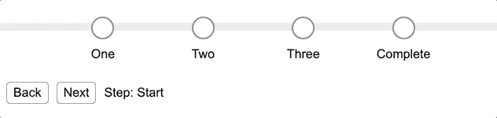

# 如何用 HTML、CSS 和 JavaScript 构建一个响应迅速的动态进度条

> 原文：<https://www.freecodecamp.org/news/how-to-build-a-responsive-and-dynamic-progress-bar/>

几年前，我写了一篇关于构建响应式进度条的简短文章。从那时起，我的技术有所发展，所以现在是时候更新了。

最大的变化是不再需要伪元素(前、后)。现在，CSS 更加简单，DOM 更容易阅读，并且更加动态。

让我们再试一次。

我们的目标是构建一个简单有效的响应式进度条，它具有以下功能:

*   完成有四个步骤。
*   每一步都有一个`default`、`active`和`complete`状态。
*   可以一步一步地进行，直到完成。

点击此处查看 CodePen 的真实示例。

## HTML

为了减少冗余和增加可重用性，我们跟踪 Vue 组件中的所有状态。在 DOM 中，这会动态生成任意数量的必需步骤。

**注意** : *原生 JavaScript (ECMAScript)或任何其他框架都可以完成这一点。使用 Vue 是为了演示的目的。*

进度条使用基本标记。有:

*   包含基于当前步骤的计算类的容器:`progressClasses`
*   一个静态背景音轨:`progress__bg`
*   遍历每个步骤并基于当前步骤应用`stepClasses`的循环。

每一步都有:

*   一个包含复选图标的`progress__indicator`，如果步骤完成，该图标将可见。
*   一个包含该步骤标签文本的`progress__label`。

```
<div
  id="app"
  :class="progressClasses"
>
  <div class="progress__bg"></div>

  <template v-for="(step, index) in steps">
    <div :class="stepClasses(index)">
      <div class="progress__indicator">
        <i class="fa fa-check"></i>
      </div>
      <div class="progress__label">
        {{step.label}}
      </div>
    </div>
  </template>

  <div class="progress__actions">
    <div
      class="btn"
      v-on:click="nextStep(false)"
    >
      Back
    </div>
    <div
      class="btn"
      v-on:click="nextStep"
    >
      Next
    </div>
    <div>
      Step:
      {{currentStep ? currentStep.label : "Start"}}
    </div>
  </div>
</div> 
```

为简单起见，控制行进方向的`progress__actions`嵌套在进度条本身中。

## CSS (SCSS)

这是我们干重活的地方。这里定义的类将由 JS 基于当前步骤动态应用。

首先，让我们选择一些颜色:

```
$gray:  #E5E5E5;
$gray2: #808080;
$blue:  #2183DD;
$green: #009900;
$white: #FFFFFF;
```

现在定义`.progress`类:将进度条的内容保存在一起的容器。

```
.progress {
  position: absolute;
  top: 15vh;
  width: 0%;
  height: 10px;
  background-color: $blue;
  transition: width .2s;
}
```

我们的进度条需要一个`.progress__bg`,进度步骤将像一条轨道一样运行。这将是灰色的，在前进到下一步时被彩色条覆盖。

```
.progress__bg {
  position: absolute;
  width: 100vw;
  height: 10px;
  background-color: $gray;
  z-index: -1;
}
```

每个`.progress__step`包含一个圆形步骤，该步骤将随着进度条的前进而高亮显示并填充。

```
.progress__step {
  position: absolute;
  top: -8px;
  left: 0;
  display: flex;
  flex-direction: column;
  align-items: center;
  text-align: center;

  @for $i from 1 through 5 {
    &.progress__step--#{$i} {
      left: calc(#{$i * 20}vw - 9px);
    }
  }
}
```

它还包含圆形`.progress__indicator`和标签文本`.progress__label`。它们的默认样式是在`.progress__step`之外定义的。

```
.progress__indicator {
  width: 25px;
  height: 25px;
  border: 2px solid $gray2;
  border-radius: 50%;
  background-color: $white;
  margin-bottom: 10px;

  .fa {
    display: none;
    font-size: 16px;
    color: $white;
  }
}

.progress__label {
  position: absolute;
  top: 40px;
}
```

现在让我们继续嵌套在`.progress__step`中，并定义处于**活动**状态的步骤。

```
&.progress__step--active {
  color: $blue;
  font-weight: 600;
}
```

接下来，定义处于**完成**状态的步骤。**注**:当处于完成状态时，`.progress__indicator`和`.progress__label`的默认样式被覆盖。

```
&.progress__step--complete {
  .progress__indicator {
    background-color: $green;
    border-color: $blue;
    color: $white;
    display: flex;
    align-items: center;
    justify-content: center;
  }

  .progress__indicator .fa {
    display: block;
  }

  .progress__label {
    font-weight: 600;
    color: $green;
  }
}
```

## JavaScript

如前所述，这将根据您如何实现步骤逻辑、实现它的更大环境、您使用什么框架和模式等等而有所不同。

此示例使用一个 Vue 组件来演示:

*   基于当前状态计算进度条的类。
*   基于当前状态计算每个步骤的类。

```
var app = new Vue({
  el: '#app',

  data: {
    currentStep: null,
    steps: [
      {"label": "one"},
      {"label": "two"},
      {"label": "three"},
      {"label": "complete"}
    ]
  },

  methods: {
    nextStep(next=true) {
      const steps = this.steps
      const currentStep = this.currentStep
      const currentIndex = steps.indexOf(currentStep)

      // handle back
      if (!next) {
        if (currentStep && currentStep.label === 'complete') {
          return this.currentStep = steps[steps.length - 1]           
        }

        if (steps[currentIndex - 1]) {
          return this.currentStep = steps[currentIndex - 1] 
        }

        return this.currentStep = { "label": "start" }   
      }

      // handle next
      if (this.currentStep && this.currentStep.label === 'complete') {
        return this.currentStep = { "label": "start" }
      }

      if (steps[currentIndex + 1]) {
        return this.currentStep = steps[currentIndex + 1]
      }

      this.currentStep = { "label": "complete" }   
    },

    stepClasses(index) {
      let result = `progress__step progress__step--${index + 1} `
      if (this.currentStep && this.currentStep.label === 'complete' ||
          index < this.steps.indexOf(this.currentStep)) {
        return result += 'progress__step--complete'
      }
      if (index === this.steps.indexOf(this.currentStep)) {
        return result += 'progress__step--active'
      }
      return result
    }
  },

  computed: {
     progressClasses() {
      let result = 'progress '
      if (this.currentStep && this.currentStep.label === 'complete') {
        return result += 'progress--complete'
      }
      return result += `progress--${this.steps.indexOf(this.currentStep) + 1}`
    }
  }
})
```

## 结论

最终你会得到这个:



查看 CodePen 中的一个真实例子。

如果你觉得我的文章有用，请考虑成为我的 Patreon 的成员

或者你只是想给我买咖啡(我爱咖啡):