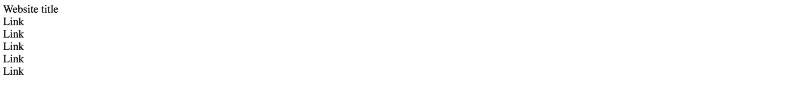
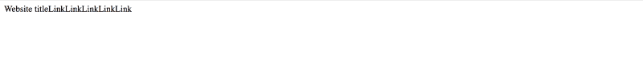
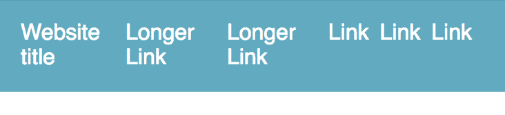
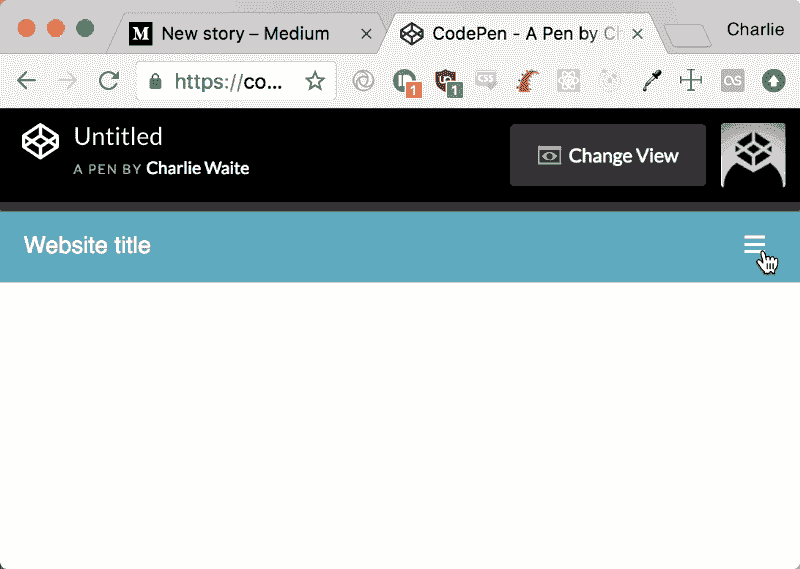

# 如何使用 Flexbox 构建带有切换菜单的响应式导航条

> 原文：<https://www.freecodecamp.org/news/how-to-build-a-responsive-navbar-with-a-toggle-menu-using-flexbox-3438e1d08783/>

查理·韦特

# 如何使用 Flexbox 构建具有切换菜单的响应导航条


Photo by [Harry Quan](https://unsplash.com/@mango_quan?utm_source=medium&utm_medium=referral) on [Unsplash](https://unsplash.com?utm_source=medium&utm_medium=referral)

在最近的一个项目中，我的团队不得不删除 Bootstrap 的所有痕迹。这意味着极其有用的响应式导航条必须从头开始创建。相对来说，我是 CSS 的新手，并且一直依赖于 Bootstrap navbars 的简单性，所以我自愿承担这项任务。以下是我在整个过程中学到的和做的。

在本文中，我将假设您具有 HTML、CSS 和 JavaScript 的基础知识——您知道如何将样式表链接到 HTML 或在`<sty` le >标签中应用样式——并且您知道如何将 JavaScript 文件导入到页面中。

*我已经有防御性的精英批评我的做事方式，尤其是切换菜单是`position: absolute`——如果你有更好的方式，请在下面回复，我们可以为成千上万的读者做得更好！*

### 入门指南

首先，我从布局的一些基本 HTML 开始:

```
<div class="Navbar">
  <div class="Navbar__Link Navbar__Link-brand">
    Website title
  </div>
  <div class="Navbar__Link">
    Link
  </div>
  <div class="Navbar__Link">
    Link
  </div>
  <div class="Navbar__Link">
    Link
  </div>
  <div class="Navbar__Link">
    Link
  </div>
  <div class="Navbar__Link">
    Link
  </div>
</div>
```

您可以为这些类使用任何命名约定。



现在，这还不能给我们太多信息。这只是一份简单的物品清单。但是仅仅用一行 CSS，我们就看到了 Flexbox 的强大。

```
.Navbar {
  display: flex;
}
```



Navbar divs now aligned horizontally

一行代码，我们已经有了水平排列在页面顶部的导航项。

现在让我们添加两个`nav`元素到我们的 HTML 中，这样我们就可以在导航栏的左边和右边有一些项目:

```
<div class="Navbar">
  <nav class="Navbar__Items">
    <div class="Navbar__Link Navbar__Link-brand">
      Website title
    </div>
    <div class="Navbar__Link">
      Link
    </div>
    <div class="Navbar__Link">
      Link
    </div>
    <div class="Navbar__Link">
      Link
    </div>
  </nav>
  <nav class="Navbar__Items Navbar__Items--right">
    <div class="Navbar__Link">
      Link
    </div>
    <div class="Navbar__Link">
      Link
    </div>
  </nav>
</div>
```

以及我们的`Navbar`类的一些基本样式，它包装了所有其他元素:

```
.Navbar {
  background-color: #46ACC2;
  display: flex;
  padding: 16px;
  font-family: sans-serif;
  color: white;
}
```

当然，你可以选择自己的配色方案、字体和填充。

现在我们的导航条看起来像这样:


哎呀，现在看起来好一点了，但是我们不能让我们的导航项目垂直显示。在你读下去之前，试着猜猜我们下一步要做什么…

现在我们`.Navbar`班的`display:flex`已经不再负责这些项目了。它现在负责他们的`<n` av >集装箱。我们希望两者水平对齐。

所以我们也改变了`.Navbar__Items`类:

```
.Navbar__Items {
  display:flex;
}
```

现在，让我们添加一些填充到我们的链接，使这只是有点漂亮:

```
.Navbar__Link {
  padding-right: 8px;
}
```

现在我们的导航条看起来像这样:


我们快到了。但是我们也希望第二个`<n` av >向右对齐。你可能已经注意到了——我给 s `econd` < `nav> tag .Navbar__`项目添加了一个额外的类——对。

让我们简单地给这个类添加一个`margin-left:auto`:

```
.Navbar__Items--right {
  margin-left:auto;
}
```


After adding the margin-left to the second nav


On mobile

如你所见，现在好多了。我们已经有了一个反应灵敏的导航条。但是…

如果每个导航项目都有更长的文本会怎样？如果有更多的项目呢？



Example of link names being longer

如你所见，这不是我们想要的。我们要么想让所有的导航项目保持一致，要么想让它们隐藏在用户可以切换的菜单中。

我们将使用后者，因为它要干净得多，而且我们不必担心用户在阅读每个导航项目上的文本时会感到吃力。

### `flex-direction`

对于显示为 flex 的项目，我们希望项目伸缩的方向也有一个规则。这默认为 row，它沿 x 轴整齐地对齐所有项目。

在我们的例子中，我们希望在页面顶部有一个小的垂直菜单。当屏幕宽度为 768px 或更低时，让我们尝试将`.Navbar`和`.Navbar__Items`上的`flex-direction`都更改为 column——这将沿 y 轴对齐所有菜单项。

让我们把第二部`<n` av >中的`margin-left`去掉:

```
@media only screen and (max-width: 768px) {
  .Navbar__Items,
  .Navbar {
    flex-direction: column;
  }
  .Navbar__Items--right {
    margin-left: 0;
  }
}
```


Navbar at 768px screen width or below

但是现在，导航项总是可见的，这占据了大量的屏幕空间。

在我们的媒体查询中，让我们为`.Navbar__Items`添加第二个规则，这样它们就不可见了:

```
@media only screen and (max-width: 768px) {
  .Navbar__Items,
  .Navbar {
    flex-direction: column;
  }
  .Navbar__Items {
    display:none;
  }
  .Navbar__Items--right {
    margin-left:0;
  }
}
```


What navbar now looks like on mobile

### 切换按钮

对于切换按钮，我将使用由 [Font Awesome](https://fontawesome.com/) 提供的图标。如果你决定照着做，只需按照他们网站上的说明将图标整合到你的项目中。您可以使用任何您想要的图标集，或者如果您愿意，您可以使用纯文本。

现在让我们将这个图标添加到我们的 HTML 中:

```
<div class="Navbar">
   <div class="Navbar__Link Navbar__Link-brand">
      Website title
    </div>
    <div class="Navbar__Link Navbar__Link-toggle">
      <i class="fas fa-bars"></i>
    </div>
  <nav class="Navbar__Items">
    <div class="Navbar__Link">
      Longer Link
    </div>
    <div class="Navbar__Link">
      Longer Link
    </div>
    <div class="Navbar__Link">
      Link
    </div>
  </nav>
  <nav class="Navbar__Items Navbar__Items--right">
    <div class="Navbar__Link">
      Link
    </div>
    <div class="Navbar__Link">
      Link
    </div>
  </nav>
</div>
```

我用粗体字标出了新增加的内容。你会注意到这个开关不在任何`nav`标签内，而是位于网站标题之外。有道理。


Menu icon added

当然，这不是我们想要的。更糟糕的是，它在桌面分辨率上也是可见的。


让我们解决这个问题。让我们像对桌面上的菜单图标那样对手机上的`.Navbar__Items`进行操作:

```
.Navbar__Link-toggle {
  display: none;
}
```

现在，让我们为媒体查询中的同一个类添加一些规则:

```
.Navbar__Link-toggle {
  align-self: flex-end;
  display: initial;
  position: absolute;
  cursor: pointer;
}
```


What the navbar now looks like on mobile with the toggle menu

现在，我们差不多完成了。我们有我们想要的样子。但是我们需要给菜单图标添加切换功能。

在您的 JavaScript 中，添加:

```
function classToggle() {
  const navs = document.querySelectorAll('.Navbar__Items')

  navs.forEach(nav => nav.classList.toggle('Navbar__ToggleShow'));
}

document.querySelector('.Navbar__Link-toggle')
  .addEventListener('click', classToggle);
```

最后，将带有规则`display:flex`的`Navbar__ToggleShow`添加到您的媒体查询中。

现在我们有了一个带有切换菜单的全响应导航条。有了 Flexbox，就真的这么简单！



### 最终代码

#### HTML:

```
<div class="Navbar">
   <div class="Navbar__Link Navbar__Link-brand">
      Website title
    </div>
    <div class="Navbar__Link Navbar__Link-toggle">
      <i class="fas fa-bars"></i>
    </div>
  <nav class="Navbar__Items">
    <div class="Navbar__Link">
      Longer Link
    </div>
    <div class="Navbar__Link">
      Longer Link
    </div>
    <div class="Navbar__Link">
      Link
    </div>
  </nav>
  <nav class="Navbar__Items Navbar__Items--right">
    <div class="Navbar__Link">
      Link
    </div>
    <div class="Navbar__Link">
      Link
    </div>
  </nav>
</div>
```

#### CSS:

```
.Navbar {
  background-color: #46ACC2;
  display: flex;
  padding: 16px;
  font-family: sans-serif;
  color: white;
}

.Navbar__Link {
  padding-right: 8px;
}

.Navbar__Items {
  display: flex;
}

.Navbar__Items--right {
  margin-left:auto;
}

.Navbar__Link-toggle {
  display: none;
}

@media only screen and (max-width: 768px) {
  .Navbar__Items,
  .Navbar {
    flex-direction: column;
  }

.Navbar__Items {
    display:none;
  }

.Navbar__Items--right {
    margin-left:0;
  }

.Navbar__ToggleShow {
    display: flex;
  }

.Navbar__Link-toggle {
    align-self: flex-end;
    display: initial;
    position: absolute;
    cursor: pointer;
   } 
}
```

#### JS:

```
function classToggle() {
  const navs = document.querySelectorAll('.Navbar__Items')

  navs.forEach(nav => nav.classList.toggle('Navbar__ToggleShow'));
}

document.querySelector('.Navbar__Link-toggle')
  .addEventListener('click', classToggle);
```

阅读更多关于 Flexbox 的信息，请访问:

[**flexbox 的基本概念**](https://developer.mozilla.org/en-US/docs/Web/CSS/CSS_Flexible_Box_Layout/Basic_Concepts_of_Flexbox)
[*flexbox 模块，通常被称为 flexbox，被设计为一维布局模型，又被设计为…*](https://developer.mozilla.org/en-US/docs/Web/CSS/CSS_Flexible_Box_Layout/Basic_Concepts_of_Flexbox)

我在那里学到了 Flexbox 的基础知识:

[**我刚刚推出了一个免费的全长 Flexbox 课程，你可以在那里交互式地构建项目**
*在我与 freeCodeCamp 于 12 月推出的 CSS Grid 课程取得成功之后(迄今已有超过 14，000 名学生！)我…*](https://www.freecodecamp.org/news/i-just-launched-a-free-full-length-flexbox-course-where-you-can-build-projects-interactively-1860e3d3c4af/)

在 [Twitter](https://twitter.com/CharlieCW90) 或 [GitHub](https://github.com/charliearlie) 上关注我。