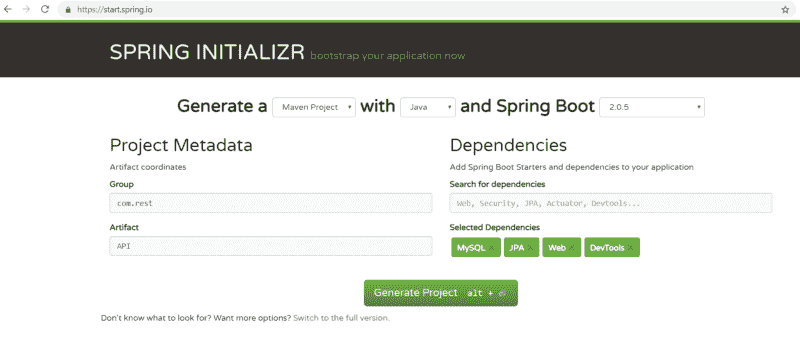
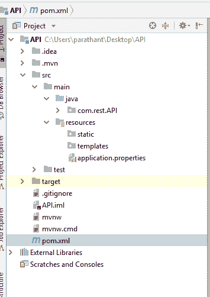
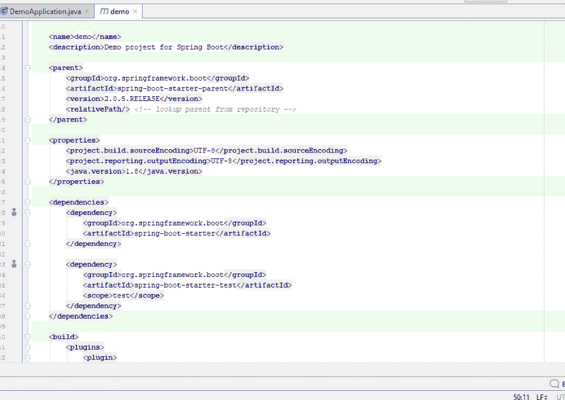

# 如何使用 MySQL 和 JPA 与 Spring Boot 一起构建一个 Rest API

> 原文：<https://www.freecodecamp.org/news/how-to-build-a-rest-api-with-spring-boot-using-mysql-and-jpa-f931e348734b/>

大家好！在过去的一年里，我一直在学习全栈 web 开发的 JavaScript。为了改变，我开始掌握 Java——强大的面向对象语言。

在这种情况下，我找到了一个非常干净优雅的框架，叫做 Spring Boot 来构建后端。

以前，在 JavaScript 开发中，我使用:

1.  mongose——Mongo DB 的 ORM(对象关系映射)
2.  sequelize——MySQL 的 ORM

对于 Java 相关的开发，有很多 ORM，比如 **Hibernate，JPA** (Java 持久性 API) & **Java 面向对象查询。**

我选择用 JPA 来构建，这是 Java 应用程序中的传统用法。

这非常有趣，花了大约一周的时间完成，因为我必须学习 Spring Boot(有很多注释“ **@** ”和其他很酷的东西要学)、JPA 和 Hibernate。

所有这些魔术大多是由 Spring Boot 使用的**注解**(“**@**”符号)完成的。

#### 创建 Spring Boot Maven 项目

让我们使用这个[链接](https://start.spring.io/)创建一个 Spring Boot Maven 项目应用程序。

" **Maven** "是一个项目管理工具，用来管理依赖管理。就像 JS 开发环境中的节点包管理器( **NPM** )。



我们在 NodeJS 中有 **package.json 用于依赖管理，在 Spring Boot** 中有 **pom.xml 用于依赖管理。**

在小组中，写下你想要的名字。通常，组织的域名是从右向左书写的。

例如，我们的域名是[www.javaAPI.com](http://www.javaAPI.com)，因此群组名称可以是 **com.javaAPI.www**

然后在工件中输入您想要的文件夹的名称。

在右侧，添加以下依赖项:

1.  WEB——使用 Spring 的依赖项(Spring Boot 用来开发 WEB 应用程序的旧框架)
2.  JPA — Java 持久性 API
3.  关系型数据库

然后点击“生成项目”。你会发现一个 rar 文件——解压它。然后在您喜欢的 IDE 中打开该文件夹。



点击 **com.rest.API** ，你会发现一个 ApiApplication.java 的**文件如下:**

```
package com.rest.API;
import org.springframework.boot.SpringApplication;
import org.springframework.boot.autoconfigure.SpringBootApplication;
@SpringBootApplication
public class ApiApplication {
public static void main(String[] args) {
      SpringApplication.run(ApiApplication.class, args);
   }
}
```

这段代码足以启动您的服务器。正常情况下，spring boot 运行在 **localhost:8080** 上。

按如下方式键入您的终端:

> **mvn 弹簧启动:运行**

在端口 8080 的 web 浏览器中查看您的本地主机。它看起来是空白的，因为我们还没有做任何事情。

#### 让我们来看看这些文件和它们的标签

如果你看一下 pom.xml 文件，你可能会注意到你在 Spring Initialize 中创建应用程序时放入的依赖项，比如 MySQL、JPA 和 Web，将会在一个 **< dependen** cy >标签中。



启动者和测试者的依赖关系是创建服务于服务器的 Spring Boot 应用程序的核心。

现在，让我们转移到 APIApplication.java，这是主要文件。

```
package com.rest.API;
import org.springframework.boot.SpringApplication;
import org.springframework.boot.autoconfigure.SpringBootApplication;
@SpringBootApplication
public class ApiApplication {
public static void main(String[] args) {
      SpringApplication.run(ApiApplication.class, args);
   }
}
```

这里包的名字在代码的第一行。使用这个包名，您可以导入另一个包文件中的任何类、方法或实例。

之后从“org.springframework.boot”包中导入两个模块。

1.  spring 应用
2.  spring boot 应用

由于 Spring boot 是 Spring 最新的应用程序开发框架，它需要 Spring 应用程序的包及其特定的包。

之后使用 **@SpringBootApplication** 注释。该注释由 Spring 中使用的注释组成:

1.  **@Component** —告诉编译器下面的类是编译整个应用程序时应该包含的组件。
2.  **@ComponentScan** —它扫描我们将在下面的 Java 类中使用的包。
3.  **@ enable auto configuration**—启用 Spring Boot 的自动配置机制，以导入重要模块供 Spring Boot 运行。

这些是用于启动在服务器上运行的 Spring Boot 应用程序的注释。

这是我写的一篇关于注释 T2 在 Java 中的用法的文章。

### 让我们为数据创建模型

让我们创建一个模型类来保存、检索、更新和删除一本书的细节。

为此，我必须创建一个名为 **model** 的新包，并在其中创建一个**Book.java**类来存放我的代码。

```
package com.rest.API.model;
import javax.persistence.*;
import javax.validation.constraints.NotBlank;
@Entity
@Table(name = "books")
public class Book {
    @Id
    @GeneratedValue
    private Long id;
@NotBlank
    private String book_name;
@NotBlank
    private String author_name;
@NotBlank
    private String isbn;
public Book(){
        super();
    }
public Book(Long id, String book_name, String author_name, String isbn) {
        super();
        this.id = id;
        this.book_name = book_name;
        this.author_name = author_name;
        this.isbn=isbn;
    }
public Long getId() {
        return id;
    }
public void setId(Long id) {
        this.id = id;
    }
public String getBook_name() {
        return book_name;
    }
public void setBook_name(String book_name) {
        this.book_name = book_name;
    }
public String getAuthor_name() {
        return author_name;
    }
public void setAuthor_name(String author_name) {
        this.author_name = author_name;
    }
public String getIsbn() {
        return isbn;
    }
public void setIsbn(String isbn) {
        this.isbn = isbn;
    }
}
```

这里我使用 JPA (Java Persistence API ),它是将数据连续存储到数据库中的类和方法的集合。

**@Entity** —用于表示该类将成为数据库中的一个实体。

**@Table** —它接受一些值，比如您将要命名的表的名称

**@Id** —表示 Id 是该表的主键/标识键

**@NotBlank —** 用来表示这些属性不应该为空。

除此之外，还有一个空的构造函数，它有一个满足 JPA 习惯的超级方法。Getter 和 setter 方法通常在 POJO 类中(**普通的旧 Java 对象**)。

### 创建存储库

接下来，我们将创建一个**存储库**包来处理 Java 中的数据库管理。

在**库**包中创建一个名为**BookRepository.java**的接口。

```
package com.rest.API.repository;
import com.rest.API.model.Book;
import org.springframework.data.jpa.repository.JpaRepository;
import org.springframework.stereotype.Repository;
@Repository
public interface BookRepository extends JpaRepository<Book, Long> {
}
```

我已经导入了 **JpaRepository** 包，通过连接我最近编码的图书模型来执行 **CRUD** 操作，从而在**图书库**接口中使用该库。

这些存储库中已经有内置的方法来执行 CRUD 操作。

例如:

```
.findAll() - to get All datas
.save()    - to save the got Data
.delete()  - to delete the data
```

在<>标签中，我们取了将要使用的模型名和主键的数据类型。

**@Repository** :用于指示持久层中 DAO ( **数据访问对象**)组件的注释。

它告诉编译器，接口将使用存储库来执行数据库活动。

#### 创建控制器和异常处理

创建一个名为**控制器、**和**T3 的新包，里面创建一个包含端点的【BookController.java】文件**。****

```
package com.rest.API.controller;

import com.rest.API.exception.BookNotFoundException;
import com.rest.API.model.Book;
import com.rest.API.repository.BookRepository;
import org.springframework.beans.factory.annotation.Autowired;
import org.springframework.web.bind.annotation.*;
import org.springframework.http.ResponseEntity;
import javax.validation.Valid;
import java.util.List;

@RestController
public class BookController {

@Autowired
    BookRepository bookRepository;

// Get All Notes
    @GetMapping("/books")
    public List<Book> getAllNotes() {
        return bookRepository.findAll();
    }

// Create a new Note
    @PostMapping("/books")
    public Book createNote(@Valid @RequestBody Book book) {
        return bookRepository.save(book);
    }

// Get a Single Note
    @GetMapping("/books/{id}")
    public Book getNoteById(@PathVariable(value = "id") Long bookId) throws BookNotFoundException {
        return bookRepository.findById(bookId)
                .orElseThrow(() -> new BookNotFoundException(bookId));
    }

// Update a Note
    @PutMapping("/books/{id}")
    public Book updateNote(@PathVariable(value = "id") Long bookId,
                           @Valid @RequestBody Book bookDetails) throws BookNotFoundException {

Book book = bookRepository.findById(bookId)
                .orElseThrow(() -> new BookNotFoundException(bookId));

book.setBook_name(bookDetails.getBook_name());
        book.setAuthor_name(bookDetails.getAuthor_name());
        book.setIsbn(bookDetails.getIsbn());

Book updatedBook = bookRepository.save(book);

return updatedBook;
    }

// Delete a Note
    @DeleteMapping("/books/{id}")
    public ResponseEntity<?> deleteBook(@PathVariable(value = "id") Long bookId) throws BookNotFoundException {
        Book book = bookRepository.findById(bookId)
                .orElseThrow(() -> new BookNotFoundException(bookId));

bookRepository.delete(book);

return ResponseEntity.ok().build();
    }
}
```

第一个导入的包是针对 Book Not Found 异常的(我们马上要为此创建一个文件)。

**我们在这里使用的注释说明:**

1.  **RestController:** 该注释用于将注释类中的每个方法表示为域对象。

那么什么是领域对象…？

它只是简单地说域对象==业务对象。

它们通常由实体和值对象表示，这些对象与我们从数据库获取数据的端点相关。

2.**自动连接**:这个注释用于自动连接 bean 类。

为此，您需要了解什么是 bean 类..？

基本上，Java Bean 类是一个简单的类，其中封装了许多对象。

这是我写的一篇关于 [Java Bean 类](https://medium.com/@parathantl/java-bean-class-804c6431a57f)的文章。

以下是端点执行 CRUD 操作的映射注释。

3. **GetMapping:** 这是一个**接口**，它包含执行 Get 方法的端点的路径。这个 GetMapping 接口使用 RequestMapping 接口，它可以有“path，value，params，headers”方法来执行早期 Spring 版本中的 Get 方法。

现在通过使用 **GetMapping 来简化它。**

4. **PostMapping** :这是一个**接口**，它包含执行 Post 方法的端点的路径。

5. **PutMapping:** 这是一个**接口**，它包含执行 Put 方法来更新的端点的路径。

6. **DeleteMapping:** 这是一个**接口**，它包含执行删除方法的端点的路径。

在最后几行中，您可能注意到了关键字“ **ResponseEntity** ”。

什么是**那个** …？？

这是一个 Java 类，它继承了 **HttpEntity** 类来操作 HTTP 响应。无论连接的请求是“ **OK** 还是有任何问题，从 **HttpEntity** 类抛出一个**异常**。

**orelsthrow():**这是在 Java8 的**可选类中找到的一个方法，它被引入来处理异常。可选类提供了各种实用方法来检查对象是否存在，这有助于处理 NullPointerException。**

**orelsthrow**是一个方法，如果存在则返回值，否则调用异常。

#### 如果没有这样的 book_id，则创建 NotFoundException

As orElseThrow 方法引发 NotFound 异常。下面是异常处理部分。在异常包中创建一个**BookNotFoundException.java**文件。

```
package com.rest.API.exception;
public class BookNotFoundException extends Exception {
private long book_id;
public BookNotFoundException(long book_id) {
        super(String.format("Book is not found with id : '%s'", book_id));
        }
}
```

创建的类扩展了 Exception 的超类。在构造函数中，我传递 book_id 并打印异常。

所以，就这样了…

我们已经完成了 REST API 部分。现在您可以构建应用程序(在第 1 部分中解释过)并使用 Postman 做一些测试。

#### 连接 MySql 数据库

在您的**资源**文件夹的 **application.properties** 中，添加以下内容:

```
## Spring DATASOURCE (DataSourceAutoConfiguration & DataSourceProperties)
spring.datasource.url = jdbc:mysql://localhost:3306/library
spring.datasource.username = root //normally put your MySQL username 
spring.datasource.password = YOUR_MYSQL_PASSWORD
## Hibernate Properties
# The SQL dialect makes Hibernate generate better SQL for the chosen database
spring.jpa.properties.hibernate.dialect = org.hibernate.dialect.MySQL5InnoDBDialect
# Hibernate ddl auto (create, create-drop, validate, update)
spring.jpa.hibernate.ddl-auto = update
```

就是这样。

我们已经在 Spring Boot 构建了一个基本的 REST API。恭喜你。

如果有任何错误或需要纠正的地方，请在评论区告诉我。

通过推特与我联系。

编码快乐！