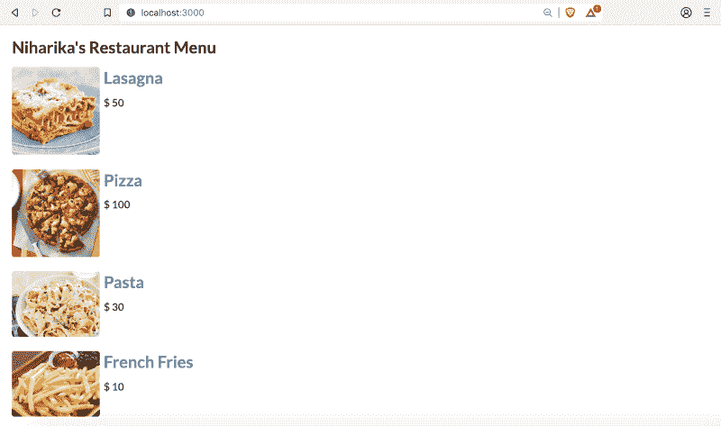
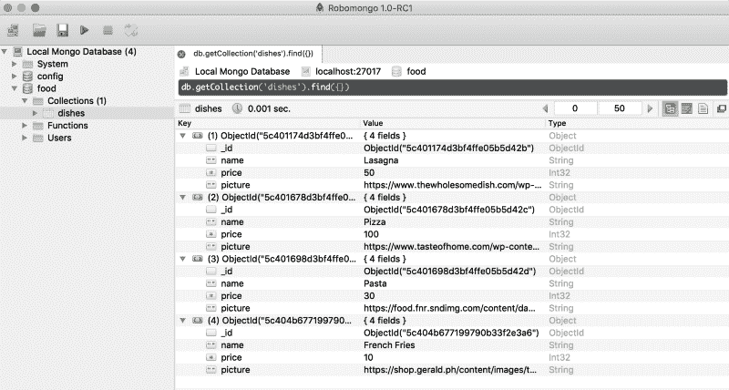
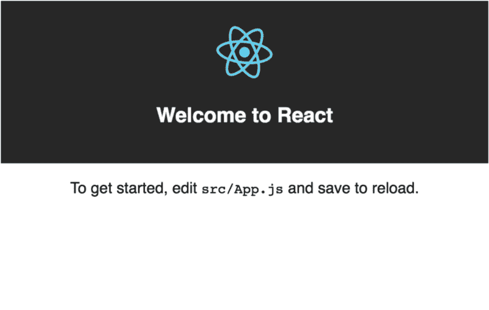
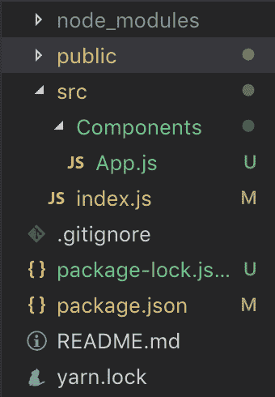
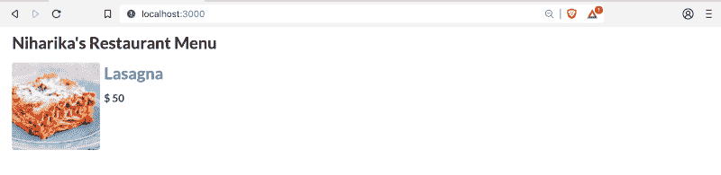

# 如何在 5 分钟内构建一个带身份验证的 RESTful API 全部从命令行完成(第 2 部分)

> 原文：<https://www.freecodecamp.org/news/how-to-build-a-restful-api-with-authentication-in-5-minutes-all-from-your-command-line-part-2-dcf29d5de0bb/>

作者:尼哈里卡·辛格

# 如何在 5 分钟内构建一个带身份验证的 RESTful API 全部从命令行完成(第 2 部分)

我根据大众的需求创建了这个教程。本教程是这篇文章的第二部分。因此，在继续这一部分之前，请确保您已经完成了[第 1 部分](https://medium.freecodecamp.org/build-restful-api-with-authentication-under-5-minutes-using-loopback-by-expressjs-no-programming-31231b8472ca)，这样我们就在同一页上了！

在本教程中，我们将使用非常著名的 ReactJS 库，围绕我们的“餐厅菜单”应用程序的前端旋转，并将使用 MongoDB 作为数据库。我们将保持简单，向我们在[第 1 部分](https://medium.freecodecamp.org/build-restful-api-with-authentication-under-5-minutes-using-loopback-by-expressjs-no-programming-31231b8472ca)中创建的 API 发出 GET 请求，并在浏览器上显示食物项目。

最终的 web 应用程序将如下所示:



你兴奋吗？嗯，我是！


Source: [https://giphy.com/](https://giphy.com/gifs/doctor-who-emoji-whomoji-XA0jsAWaxrgOI)

### 首先…设置开发环境

*我假设您已经按照[第 1 部分的描述设置了开发环境。](https://medium.freecodecamp.org/build-restful-api-with-authentication-under-5-minutes-using-loopback-by-expressjs-no-programming-31231b8472ca)此外，本文假定您对 React 术语和 ES2015 语法有基本的了解。*

1.  **安装 React**

```
$ npm install -g create-react-app
```

如果你被困在某个地方，这里的是一个非常好的入门教程。

**2。安装一个文本编辑器**

在[第 1 部分](https://medium.freecodecamp.org/build-restful-api-with-authentication-under-5-minutes-using-loopback-by-expressjs-no-programming-31231b8472ca)中，我们没有写任何代码，所以“真正”不需要使用文本编辑器。在这一部分，我们将编写大量代码。所以，你可以使用你最喜欢的文本编辑器或我最喜欢的文本编辑器。

[**下载 Visual Studio 代码——Mac、Linux、Windows**](https://code.visualstudio.com/download)
[*Visual Studio 代码是免费的，可以在你喜欢的平台——Linux、macOS、Windows 上获得。下载 Visual Studio…*code.visualstudio.com](https://code.visualstudio.com/download)

**3\. Robomongo**

这是可选的。如果您希望 MongoDB 数据库有一个图形界面，那么 Robomongo 是一个必不可少的工具。我个人很喜欢。

[**Robo 3T——原 Robomongo——原生 MongoDB 管理工具(Admin UI)**](https://robomongo.org/)
[*Robo 3T(原 Robo mongo)工具已被 MongoDB 客户端工作室的创建者 3T 软件实验室收购…*robomongo.org](https://robomongo.org/)

#### 环回服务器文件中的一个小调整:

默认情况下，loopback API explorer 在端口 3000 上提供服务，巧合的是，React 默认情况下也在端口 3000 上提供服务。这两个端口**必须**不同。所以，我将环回 API explorer 转移到端口 8080。

因此，打开`config.json`并进行以下更改:

```
{
```

```
 "restApiRoot": "/api",
```

```
 "host": "0.0.0.0",
```

```
 "port": 8080,
```

```
 "remoting": {
```

```
 "context": false,
```

```
 "rest": {
```

```
 "handleErrors": false,
```

```
 "normalizeHttpPath": false,
```

```
 "xml": false
```

```
 },
```

```
 "json": {
```

```
 "strict": false,
```

```
 "limit": "100kb"
```

```
 },
```

```
 "urlencoded": {
```

```
 "extended": true,
```

```
 "limit": "100kb"
```

```
 },
```

```
 "cors": false
```

```
 }
```

```
}
```

这将确保 React 和 Loopback API 浏览器不会冲突。

### 第一步:用一些菜肴填充你的数据库

当我们发出 GET 请求时，我们输入数据库的数据会显示在 React web 应用程序中。

有不同的方法来填充数据。最合适的方法是使用 API Explorer。

因此，将您的 web 浏览器指向[http://localhost:8080/explorer](http://localhost:8080/explorer)并发出 POST 请求。这一次，我改变了模型模式并添加了“图片”,这样我们就有了一个好看的应用程序。

这是我的模式的样子:

```
{  "name": "string",  "price": 0,  "picture": "string"}
```

我在这里做了 4 个条目:

```
[    {         "name": "Lasagna",         "price": 50,         "picture": "https://www.thewholesomedish.com/wp-content/uploads/2018/07/Best-Lasagna-550.jpg",         "id": "5c401174d3bf4ffe05b5d42b"     },     {         "name": "Pizza",    "price": 100,    "picture": "https://www.tasteofhome.com/wp-content/uploads/2017/10/Chicken-Pizza_exps30800_FM143298B03_11_8bC_RMS-2.jpg",    "id": "5c401678d3bf4ffe05b5d42c"      },      {     "name": "Pasta",     "price": 30,     "picture": "https://food.fnr.sndimg.com/content/dam/images/food/fullset/2011/2/4/1/RX-FNM_030111-Lighten-Up-012_s4x3.jpg.rend.hgtvcom.616.462.suffix/1382539856907.jpeg",     "id": "5c401698d3bf4ffe05b5d42d"   },   {          "name": "French Fries",     "price": 10,     "picture": "https://shop.gerald.ph/content/images/thumbs/0003743_french-fries_340.jpeg",     "id": "5c404b677199790b33f2e3a6"   } ]
```

你可以用任何一道菜做很多道菜！

所以在输入之后，你可以在 Robomongo 上看到这些。



### 步骤 2:创建一个 React 应用程序

让我们使用`create-react-app`来创建我们的 React web 应用程序。

```
$ create-react-app restaurant-app
```

我把我的应用程序命名为`restaurant-app`。

然后，`cd restaurant-app`。

然后通过`npm start`运行 react app。这将在 localhost:3000 上启动 web-app。

您应该看到这个:



### 第三步:删除`src` 文件夹中的所有文件

在 React 样板代码中，删除 src 文件夹中的文件。我们将从头开始编写代码。

### 步骤 4:添加 CSS 库来减少一些设计上的麻烦…

在这个项目中，我使用语义用户界面。你可以随意使用任何你想用的库。

在我们 React 项目的文件夹中，打开`index.html`文件，在`<he` ad >的任意位置添加一个`link`标签。所以我们来添加语义 UI CDN。

```
<link rel="stylesheet" href="https://cdnjs.cloudflare.com/ajax/libs/semantic-ui/2.4.1/semantic.min.css"/>
```

### 步骤 5:创建 Index.js 和 App.js

在`src`文件夹中新建一个名为`index.js`的文件。

在`src`文件夹中创建一个名为`Components`的文件夹。在`Components`中创建一个名为`App.js`的文件。



Directory structure

#### `App.js:`的内容

```
import React from 'react';
```

```
class App extends React.Component {
```

```
 render() {
```

```
 return (          <div> App Component <div>     );  }
```

```
}
```

#### Index.js 的内容:

```
import React from 'react';
```

```
import ReactDOM from 'react-dom';
```

```
import App from './Components/App';
```

```
ReactDOM.render(<App/>, document.querySelector('#root'));
```

现在如果你将浏览器指向 localhost:3000，你应该会看到屏幕上写着 **App 组件**。

### 步骤 6:安装 Axios 进行 API 调用

启动您的终端并安装 Axios。

```
$ npm install --save axios
```

### 步骤 7:进行 API 调用

我们需要对`App.js`进行更改。

```
import React from 'react';
```

```
import axios from 'axios';
```

```
class App extends React.Component {
```

```
 constructor(props){
```

```
 super(props);
```

```
 this.state = {
```

```
 name: [],
```

```
 price: [],
```

```
 picture: []
```

```
 };
```

```
}
```

```
componentDidMount = () => {
```

```
 axios.get('http://localhost:8080/api/dishes').then((res) => {
```

```
 for (var i = 0; i < res.data.length; i++)
```

```
 this.setState({
```

```
 name: [...this.state.name, res.data[i].name],
```

```
 price: [...this.state.price, res.data[i].price],
```

```
 picture: [...this.state.picture, res.data[i].picture]
```

```
 });
```

```
 }).catch ((err) => {
```

```
 console.log(err);
```

```
 });
```

```
}
```

```
Style = {
```

```
 margin: '10px',
```

```
 padding: '10px'
```

```
};
```

```
render() {
```

```
 return (
```

```
 <div className="ui list" style={this.Style}>
```

```
 <h1> Niharika's Restaurant Menu </h1>
```

```
 <div className="item">
```

```
 
```

```
 <div className="content">
```

```
 <h1><a className="header">{this.state.name[0]}</a></h1>
```

```
 <div className="description"> <h3> $ {this.state.price[0]} </h3> .    </div>
```

```
 </div>
```

```
 </div>
```

```
 </div>
```

```
 );
```

```
 }
```

```
}
```

```
export default App;
```

这将只显示第一个条目的名称、价格和图片。为了使事情更简单，我们将创建一个新的组件名`FoodItem`，以减少`App.js`中的代码。



### 步骤 8:创建一个 FoodItem 组件来呈现其他菜肴

在`Components`文件夹中，创建一个名为`FoodItem.js`的文件。

#### FoodItem.js 的内容:

```
import React from 'react';
```

```
const FoodItem = (props) => {
```

```
 return (
```

```
 <div className="item">
```

```
 
```

```
 <div className="content">
```

```
 <h1><a className="header">{props.name}</a></h1>
```

```
 <div className="description"> <h3> $ {props.price} </h3> .           </div>
```

```
 </div>
```

```
 </div>
```

```
 );
```

```
};
```

```
export default FoodItem;
```

这里用到了道具的概念。

修改`App.js`:

```
import React from 'react';
```

```
import axios from 'axios';
```

```
import FoodItem from './FoodItem';
```

```
class App extends React.Component {
```

```
 constructor(props){
```

```
 super(props);
```

```
 this.state = {
```

```
 name: [],
```

```
 price: [],
```

```
 picture: []
```

```
 };
```

```
}
```

```
componentDidMount = () => {
```

```
 axios.get('http://localhost:8080/api/dishes').then((res) => {
```

```
 for (var i = 0; i < res.data.length; i++)
```

```
 this.setState({
```

```
 name: [...this.state.name, res.data[i].name],
```

```
 price: [...this.state.price, res.data[i].price],
```

```
 picture: [...this.state.picture, res.data[i].picture]
```

```
 });
```

```
 }).catch ((err) => {
```

```
 console.log(err);
```

```
 });
```

```
}
```

```
Style = {
```

```
 margin: '10px',
```

```
 padding: '10px'
```

```
};
```

```
render() {
```

```
 return (
```

```
 <div className="ui list" style={this.Style}>
```

```
 <h1> Niharika's Restaurant Menu </h1>
```

```
 <FoodItem
```

```
 picture={this.state.picture[0]}
```

```
 name={this.state.name[0]}
```

```
 price={this.state.price[0]}
```

```
 />
```

```
 <br/>             <FoodItem
```

```
 picture={this.state.picture[1]}
```

```
 name={this.state.name[1]}
```

```
 price={this.state.price[1]}
```

```
 />
```

```
 <br/>
```

```
 <FoodItem
```

```
 picture={this.state.picture[2]}
```

```
 name={this.state.name[2]}
```

```
 price={this.state.price[2]}
```

```
 />
```

```
 <br/>
```

```
 <FoodItem
```

```
 picture={this.state.picture[3]}
```

```
 name={this.state.name[3]}
```

```
 price={this.state.price[3]}
```

```
 />
```

```
 </div>
```

```
 );
```

```
 }
```

```
}
```

```
export default App;
```

最终结果应该是这样的:


#### 包扎

在本教程中，我们只关注 GET 方法。我们甚至可以在这个控制台上发布更多的菜肴，做更多的事情。

这都是为了现在！

我希望你坚持到最后。如果你喜欢，请鼓掌欣赏。非常感谢！❤