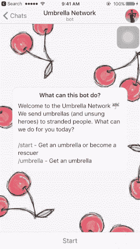
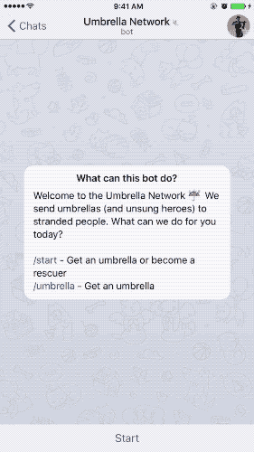
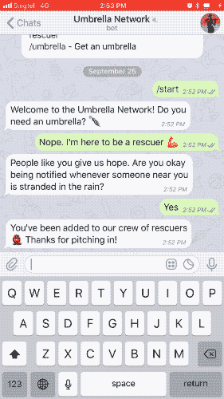
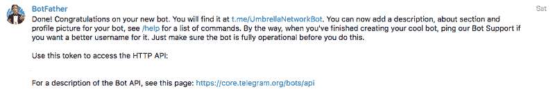
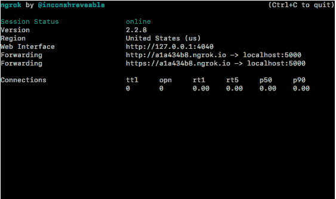

# 我周末做了一个无服务器的电报机器人。以下是我学到的。

> 原文：<https://www.freecodecamp.org/news/how-to-build-a-server-less-telegram-bot-227f842f4706/>

作者:摩西·苏

# 我周末做了一个无服务器的电报机器人。以下是我学到的。


我制作了一个电报聊天机器人，当有人被困在雨中时，它可以向救援人员发出求救信号。是用 Python 写的，用的是 AWS Lambda，Zappa 和 Flask。

可以试试[这里](https://t.me/UmbrellaNetworkBot)。我还没加进去坚持？但是我认为这里的一些内容可能对其他对类似项目感兴趣的人有用。

我通常很难让我的未婚妻讨论技术。已经到了我一说“代码”她就忍不住忍住哈欠的地步。

想象一下这个周末她问我——非常意外——做一个手机应用程序要花多少钱时我有多惊讶。

在迷失了一会儿之后，我发现了以下这些。

### **问题**

我未婚妻的工作地点离两个地铁站很近，但是从地铁站到她住的大楼没有任何隐蔽的通道。下雨时，没有雨伞的人被困在车站。她和她的同事经常低下头去帮助朋友，但被困在那里的人往往比他们预期的要多。

她的同事正在讨论一个应用程序是否可以帮助解决这个问题。嗯，我认为聊天机器人也可以有同样的功能(比如发送雨伞的请求，位置共享，获得回复)。你可以避免说服人们下载另一个应用程序。

因为我一直想尝试 Telegram 的机器人 API，所以我自告奋勇帮助构建了一个原型，这样我们就可以看看这实际上会有多有趣。

### 聊天机器人

我从周六下午开始做这个，周日凌晨 2 点就睡觉了。但是我真的很高兴从对机器人 API 一无所知到能够做出这样的东西。

任何人都可以申请雨伞。机器人会询问这个人在哪里，他/她可能需要多少把伞，以及他们希望什么时候被接走(选项有限，所以我们不会让救援人员负担太多)。



This is what the chatbot does when you request an umbrella

人们可以注册成为救援者。一点点善缘走一段路？



This is how someone becomes a rescuer

每当附近有人被困在雨中，救援人员都会得到通知。我想让救援人员明白，一旦他们按下“是”，他们是否要对请求负责。



This is how a rescuer receives and answers a request

在这个过程中，我学到了一些加快开发速度的技巧。我花了将近六个小时才找到合适的工具和适合我的开发工作流程。构建机器人逻辑花了我很短的时间。

### 我用的

#### 自动气象站λ

您可以在 Lambda 中托管函数，而不是全天候运行服务器，这样服务器只在请求的生命周期内运行。这对原型来说很棒，因为你每个月会收到 100 万个免费请求。

#### 扎帕

[这个](https://github.com/Miserlou/Zappa)自动执行将本地 Python 代码移植到 AWS Lambda 上所需的步骤。它还配置了 Amazon 的 API 网关，这样您就有了一个很好的 HTTPS 端点来托管您的聊天机器人功能。

#### ngrok

[这个](https://ngrok.com/)使得任何本地服务器都可以通过互联网访问。在实际部署到云之前，这是一个很好的原型化 web-hook 的方法。

这些工具帮助我避免了制作聊天机器人的许多麻烦(例如，租用一台服务器，为 HTTPS 配置它，找出如何使服务器不阻塞，因为这是一个聊天机器人)。

今天我将向你展示我是如何使用这些工具开发上述聊天机器人的。希望这能帮助其他有类似经历的人。

### 游戏攻略

本教程假设您正在制作一个聊天机器人，但不知道 Telegram 的 bot API 是如何工作的，但具有 Flask 和 Python 的工作知识。如果有什么对你来说太简单了，请随意跳过！

#### 创建一个电报机器人

拜访[机器人父亲](https://t.me/botfather)。键入`/newbot`并按照他的指示设置一个新的机器人。



And just like this we have a chatbot setup on Telegram!

⚡ **专家提示:**将代币保存在某个地方，我们很快就会用到它！

随意摆弄机器人的简介图片、文字和描述，赋予它你想要的个性。用机器人父亲输入`/help`会给你一个完整的设置列表，你可以调整你的机器人。

#### 用 Flask 设置开发服务器

我和 [pipenv](https://github.com/kennethreitz/pipenv) 一起管理我项目的 Python 依赖项。如果你还在使用 pip 和 virtualenv，我鼓励你们尝试一下。链接上有安装说明。

接下来我们将安装[烧瓶](http://flask.pocoo.org/)。我们还将使用令人敬畏的[请求](http://docs.python-requests.org/en/master/)库。在命令行中键入:

```
pipenv install flaskpipenv install requests
```

安装 flask 后，我们将设置一个基本服务器来测试我们的 bot。将以下文本复制到名为`server.py`的文件中。

⚡ **专业提示:**确保用我们从僵尸工具那里得到的 API 令牌替换`<your-bot-tok` en >。

让我们来分析一下这是怎么回事。Telegram 的 API 就是这样工作的。首先，当有人给你的机器人发送一条信息时，这条信息就会被发送到 Telegram 的服务器上。然后 Telegram 将消息转发给我们指定的 web-hook，作为 POST 请求。

函数`process_update()`和它上面的装饰器说，当任何人向域`[http://127.0.0.1:5000](http://127.0.0.1:5000)/<your-bot-tok` en >发帖时，我们将从中提取 JSON 数据。如果是普通的短信，JSON 里会有 th `e key m`消息。我们对此进行检查，如果是正常消息，我们回复`using process_message(u` pdate)。

如果我们想要回复消息，函数`process_message()`构造电报 API 期望的有效载荷。我们基本上需要在`data["text"]`中指定我们的回复文本，在`data["chat_id"]`中指定我们正在回复的聊天。

最后，我们向`sendMessage`方法的 [Telegram API 端点发送一个带有这个有效负载的 POST 请求。这允许我们以编程方式发送消息。](https://core.telegram.org/bots/api#sendmessage)

**运行服务器的时间。**现在在您的命令提示符下键入:

```
pipenv shell
```

这将激活虚拟环境，并使我们能够访问 Flask。现在我们需要在本地运行服务器。在命令提示符下键入:

```
export FLASK_APP=server.pyflask run
```

我们有一个正在运行的服务器！如果你没有弄乱默认设置，那么它运行在 [http://127.0.0.1:5000](http://127.0.0.1:5000) /上。

阅读烧瓶文档和[快速启动](http://flask.pocoo.org/docs/0.12/quickstart/)中的更多信息。

但这是在本地运行的，Telegram 的 bot API 不能将其 POST 请求发送到本地 URL。因此，我们将使用 **ngrok** 将这个本地服务器暴露给互联网。

#### 使用 ngrok 使本地服务器可以在互联网上访问

从 ngrok 网站上的[链接获取您的操作系统的软件包。一旦您下载并安装了它，转到您将文件解压缩到的目录，并在命令提示符下运行以下命令。](https://ngrok.com/download)

```
./ngrok http 5000
```

您将在命令提示符下看到类似的内容。现在，无论您在 localhost:5000 上运行什么服务器，都可以在以下 URL 上看到。



⚡ **专业提示:**复制 https 网址，我们很快就要用到它。

是时候让 Telegram 知道我们的网络地址了。我们将再次使用 Telegram API 来设置我们的 web 挂钩。

用以下内容创建一个名为`webhook.py`的文件:

⚡ **Pro 提示:**记得更换`<your-bot-tok`en>t1】ttps-URL>！

让我们打印出格式良好的 JSON 数据。我们将 web-hook URL 作为 POST 请求发送到 Telegram API 的`[setWebhook](https://core.telegram.org/bots/api#setwebhook)` [端点](https://core.telegram.org/bots/api#setwebhook)。现在，在命令提示符下运行以下行:

```
pipenv install pprintpython webhook.py
```

您应该会看到`200`和一个带有`'ok': True`的 JSON 块。

#### 测试你的聊天机器人

现在我们已经完成了服务器的设置。打电报给你的机器人，打个招呼！如果一切都设置正确，你会看到它回复`I can hear you!`

在本教程的下一部分，我们将学习如何使用 Zappa 和 AWS Lambda 将这个服务器部署到互联网上。如果这对你有帮助，请鼓掌——我很想知道是否有帮助。谢了？