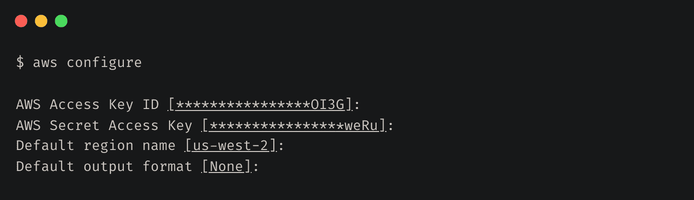
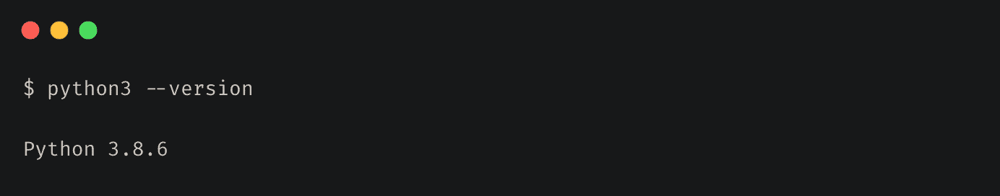
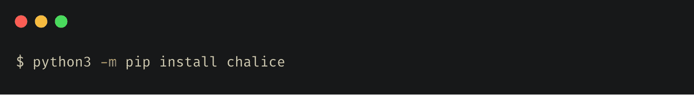
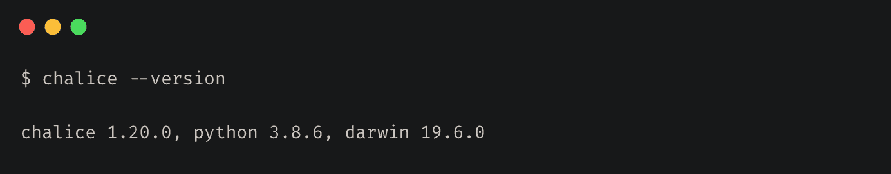
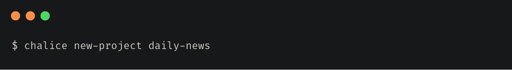
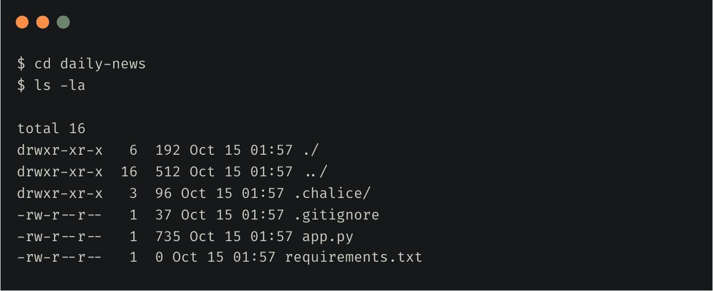

# 如何使用 AWS Chalice 构建无服务器应用程序

> 原文：<https://www.freecodecamp.org/news/how-to-build-a-serverless-application-using-aws-chalice/>

我最近偶然发现了 AWS Chalice，并对它提供的简单性和可用性着迷。

AWS Chalice 是一个无服务器框架，允许您使用 Python 构建无服务器应用程序，并使用 Amazon API Gateway 和 AWS Lambda 将它们部署在 AWS 上。

我决定尝试一下，并在几分钟之内在 AWS 上创建和部署了一个示例 REST API。

在本文中，我将带您了解构建和部署一个无服务器应用程序所需的步骤，该应用程序使用 Chalice 从 Google News 获取最新新闻。

## 先决条件

本教程需要一个 AWS 帐户。如果你还没有，那么[创建一个](https://aws.amazon.com/premiumsupport/knowledge-center/create-and-activate-aws-account/)。我们的应用程序将只使用自由层资源，因此成本应该不是问题。

您还需要配置安全性，并为您的访问创建用户和角色。

## 如何配置 AWS 凭据

Chalice 在幕后使用 AWS 命令行界面(CLI)来部署项目。如果你以前没有使用过 AWS 的 CLI 来使用 AWS 资源，你可以按照这里的指南[来安装它。](https://docs.aws.amazon.com/cli/latest/userguide/install-cliv2.html)

安装完成后，您需要[配置](https://docs.aws.amazon.com/cli/latest/userguide/cli-configure-quickstart.html)您的 AWS CLI 以使用来自您的 AWS 帐户的凭证。

## 如何安装圣杯

接下来，你需要安装圣杯。在本教程中，我们将使用 Python 3，但是您可以使用 AWS Lambda 支持的任何 Python 版本。

### 验证 Python 安装

### 安装圣杯

### 验证圣杯安装

## 如何创建项目

接下来，运行`chalice new-project`命令创建一个新项目。

这将在当前目录下创建一个`daily-news`文件夹。你可以看到 Chalice 在这个文件夹中创建了几个文件。在本文中，我们将只使用`app.py`和`requirements.txt`文件。

让我们来看看`app.py`文件的内容: