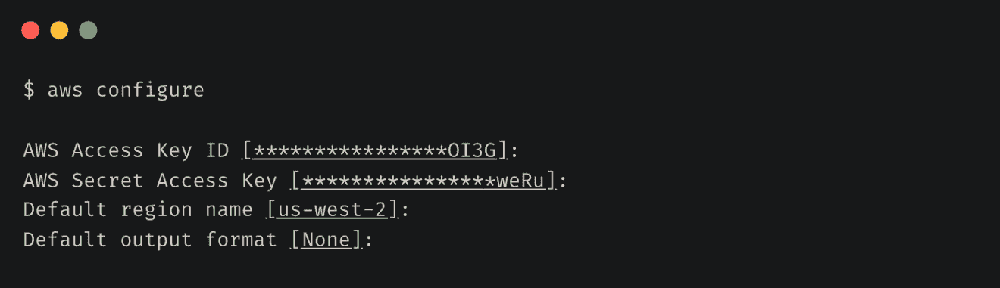
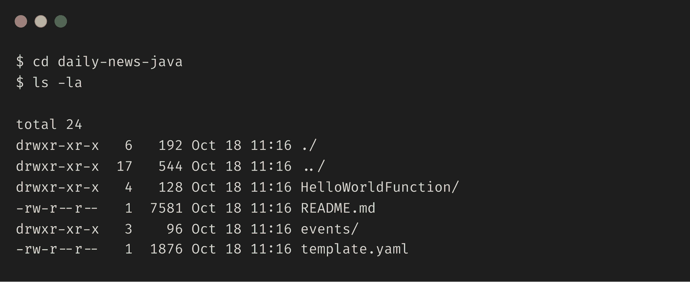

# 如何使用 AWS SAM 构建无服务器应用程序

> 原文：<https://www.freecodecamp.org/news/how-to-build-a-serverless-application-using-aws-sam/>

在我之前的[文章](https://www.freecodecamp.org/news/how-to-build-a-serverless-application-using-aws-chalice/)中，我谈到了 AWS Chalice 如何帮助您快速构建一个基于 Python 的无服务器应用程序，并在几分钟内将其部署到 AWS 上。

虽然 Python 是一个快速而有趣的原型，但在运行大规模生产应用程序时，它可能不是许多人的首选语言。

许多组织使用 Java 作为他们的主要开发语言，许多开发人员也在转向更新的语言，如 Go。

在本文中，我将带您了解构建和部署从 Google News 获取最新新闻的无服务器应用程序所需的步骤。但是这一次，我们将使用 AWS 无服务器应用程序模型(SAM)和 Java 进行开发。

像 Chalice 一样，AWS SAM CLI 提供了一组丰富的工具，使开发人员能够快速构建无服务器应用程序。

## 先决条件

本教程需要一个 AWS 帐户。如果你还没有，那么[创建一个](https://aws.amazon.com/premiumsupport/knowledge-center/create-and-activate-aws-account/)。我们的应用程序将只使用自由层资源，因此成本应该不是问题。

您还需要配置安全性，并为您的访问创建用户和角色。

## 如何配置 AWS 凭据

SAM 在幕后使用 AWS 命令行界面(CLI)来部署项目。如果你以前没有使用过 AWS 的 CLI 来使用 AWS 资源，你可以按照这里的指南[来安装它。](https://docs.aws.amazon.com/cli/latest/userguide/install-cliv2.html)

安装完成后，您需要[配置](https://docs.aws.amazon.com/cli/latest/userguide/cli-configure-quickstart.html)您的 AWS CLI 以使用来自您的 AWS 帐户的凭证。



## 如何安装 SAM

接下来，您需要安装 SAM。我们将在本教程中使用 Java，但是您可以使用 AWS Lambda 支持的任何语言运行时。

### 验证 Java 安装

```
$ java --version

openjdk 11.0.8 2020-07-14
OpenJDK Runtime Environment AdoptOpenJDK (build 11.0.8+10)
OpenJDK 64-Bit Server VM AdoptOpenJDK (build 11.0.8+10, mixed mode)
```

### 安装 SAM CLI

根据您的操作系统，SAM CLI 的安装说明会有所不同。本文介绍了在 MacOS 上安装它的说明。

在 macOS 上安装 SAM CLI 的推荐方法是使用 Homebrew 软件包管理器。

验证您是否安装了自制软件，如下所示:

```
$ brew --version

Homebrew/homebrew-core (git revision fe68a; last commit 2020-10-15)
Homebrew/homebrew-cask (git revision 4a2c25; last commit 2020-10-15)
```

如果没有，您可以使用以下命令安装 Homebrew:

```
$ /bin/bash -c "$(curl -fsSL https://raw.githubusercontent.com/Homebrew/install/master/install.sh)"
```

接下来，使用以下命令安装 SAM:

```
brew tap aws/tap
brew install aws-sam-cli
```

### 验证 SAM 安装

```
$ sam --version

SAM CLI, version 1.6.2
```

## 如何创建项目

接下来，运行`sam-init`命令创建一个新项目。

```
sam init -r java11 -d maven --app-template hello-world -n daily-news-java
```

默认情况下，SAM 会创建一个 Python 项目。因为我们想要创建一个 Java 项目，所以我们需要传递一些额外的参数。

**参数:**

*   `-r java11`:使用 Java 11 运行时
*   使用 maven 作为依赖管理器
*   `--app-template hello-world`:使用 HelloWorld 快速入门模板
*   我们项目的名称

这将在当前目录下创建一个`daily-news-java`文件夹。您可以看到 SAM 在这个文件夹中创建了几个文件。



我们来看看`App.java`文件。