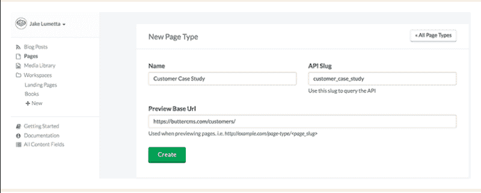
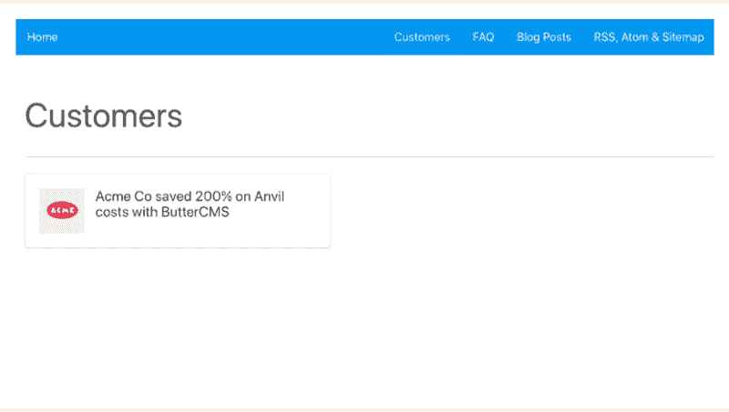
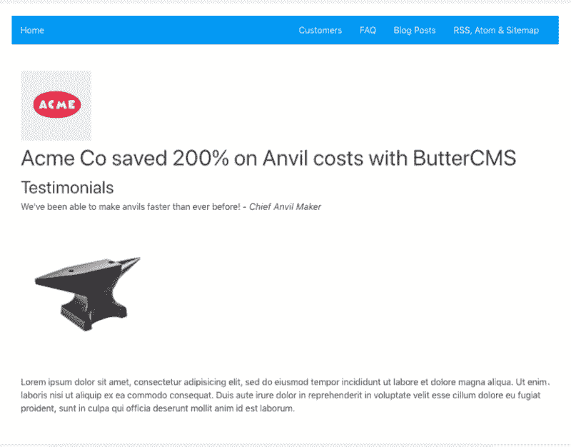
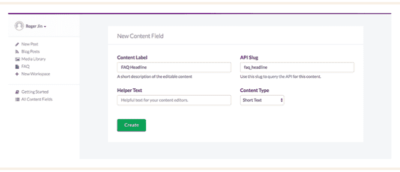
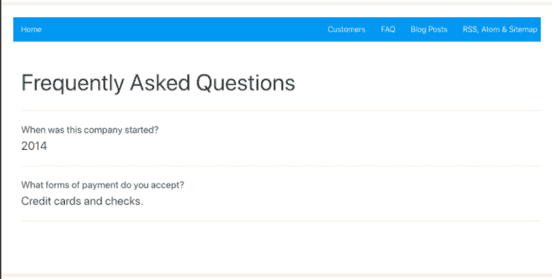
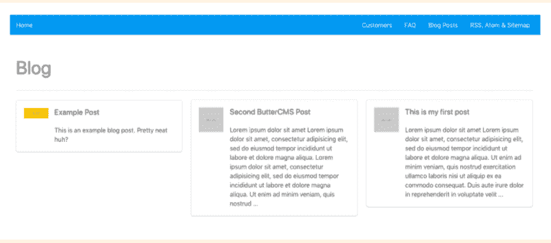
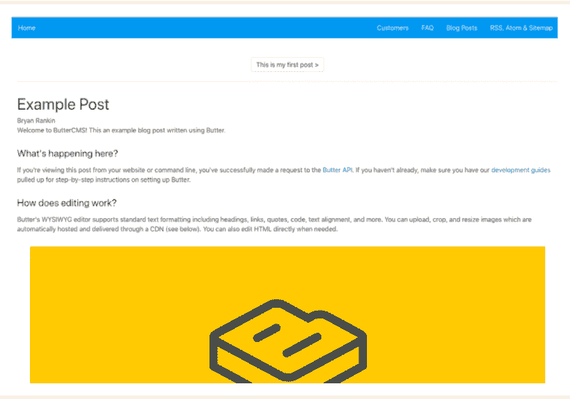

# 如何构建基于 CMS 的无服务器 Vue.js 应用程序

> 原文：<https://www.freecodecamp.org/news/how-to-build-a-serverless-cms-powered-vue-js-application-ee17f5957538/>

杰克·卢梅塔

# 如何构建基于 CMS 的无服务器 Vue.js 应用程序


Photo by [贝莉儿 NG](https://unsplash.com/photos/8Gg2Ne_uTcM?utm_source=unsplash&utm_medium=referral&utm_content=creditCopyText) on [Unsplash](https://unsplash.com/search/photos/construct?utm_source=unsplash&utm_medium=referral&utm_content=creditCopyText)

Vue.js 越来越受到人们的喜爱，人气激增，这是有原因的。作为一个可逐步采用的框架，它是轻量级的、反应式的、基于组件的，允许您创建可插入的组件，并将其添加到任何项目中。

Vue.js 的渐进式框架非常适合无服务器应用架构。开发人员越来越多地转向无服务器架构，因为无服务器允许他们更快地创建和微调产品，而不必承受传统的基于服务器的架构的负担(服务器维护、中断和扩展瓶颈)。

Vue.js 及其标志性的增量可采用性允许您尝试 Vue，而不会将您现有的代码库置于风险之中。

在本文中，您将学习如何使用 ButterCMS 构建一个无服务器的 [Vue.js](https://vuejs.org/v2/guide/) 应用程序。ButterCMS 是一个[无头 CMS 和博客平台](https://buttercms.com/api-first-cms/)，让你使用任何编程语言构建 CMS 驱动的应用程序。本教程将向您展示如何向您的 Vue.js 应用程序添加高性能内容 API。即使对于团队中的非技术人员来说，这些 API 也很容易操作，使您能够享受敏捷的内容管理，而不必启动和维护自己的 CMS 基础架构。

具体来说，我们将涵盖三个用例:营销页面、博客和带有代码示例的知识库。本教程的最终代码可以在 [GitHub](https://github.com/ButterCMS/buttercms-vue-tutorial) 获得。

### 入门指南

首先，安装 ButterCMS JS SDK。我们将使用它来查询内容 API。

`npm install buttercms — save`

安装后，您可以按照下面的教程创建三种类型的内容:营销页面、博客和知识库(例如，FAQ)。

### 添加营销页面

假设您想让团队中的一名非技术人员向您的营销网站添加客户案例研究页面。为此，我们将创建一个案例研究页面作为示例。使用 ButterCMS 上的仪表板，您可以创建一个标题为“客户案例研究”的“页面类型”并定义字段。



一旦你完成了这些，你就可以创建你的第一页了。使用 Butter 的仪表板指定页面的名称和 URL，并填充页面的内容。一旦这些都完成了，ButterCMS 的 API 将以 JSON 格式返回您定义的页面。它应该是这样的:

```
{ “data”: {   “slug”: “acme-co”,   “fields”: {     “facebook_open_graph_title”: “Acme Co loves ButterCMS”,     “seo_title”: “Acme Co Customer Case Study”,     “headline”: “Acme Co saved 200% on Anvil costs with ButterCMS”,     “testimonial”: “<p>We’ve been able to make anvils faster than ever before! — <em>Chief Anvil Maker</em></p>\r\n<p></p>”,     “customer_logo”: “https://cdn.buttercms.com/c8oSTGcwQDC5I58km5WV",    }  }}
```

接下来，打开代码编辑器，在`/src` 目录下创建一个名为`buttercms.js`的文件。

如果没有现有项目，请通过输入以下内容创建一个项目:

```
vue init webpack buttercms-projectcd buttercms-projectnpm inpm i -S buttercmsnpm run dev
```

然后，在`src/buttercms.js`中:

```
import Butter from ‘buttercms’;
```

```
const butter = Butter(‘your_api_token’);
```

现在，在你的应用程序中更新路线。访问`router/index.js`和

```
import Vue from ‘vue’import Router from ‘vue-router’import CustomersHome from ‘@/components/CustomersHome’import CustomerPage from ‘@/components/CustomerPage’
```

```
Vue.use(Router)
```

```
export default new Router({  mode: ‘history’,  routes: [      {        path: ‘/customers/’,        name: ‘customers-home’,        component: CustomersHome      },      {        path: ‘/customers/:slug’,        name: ‘customer-page’,        component: CustomerPage      }    ]  })
```

现在，要设置一个“customers”页面来列出您的所有客户，我们将定义一个`getpages()`方法来获取所有客户页面。在`components/CustomersHome.vue`文件中，我们添加了以下内容:

```
<script>  // import ButterCMS from  import { butter } from ‘@/buttercms’  export default {    name: ‘customers-home’,    data() {      return {      page_title: ‘Customers’,      // Create array to hold the pages from ButterCMS API      pages: []    }  },  methods: {    // Get List of Customer Pages    getPages() {      butter.page.list(‘customer_case_study’)        .then((res) => {          // console.log(res.data.data)          // Check the results in the console         this.pages = res.data.data      })    }  },created() {  // Fire on page creation  this.getPages()    }  }</script>
```

显示结果:

```
<template>  <div id=”customers-home”>    <h1>{{ page_title }}</h1>    <div v-for=”(page,index) in pages” :key=”page.slug + ‘_’ + index”>      <router-link :to=”’/customers/’ + page.slug”>        <div>                    <h2>{{ page.fields.headline }}</h2>        </div>      </router-link>    </div>  </div></template>
```



Example of something close to what you have so far after publishing one case study

现在，我们将设置客户页面来查看单个客户。为此，在`components/CustomerPage.vue`中，我们定义了一个`getPage()`方法来根据特定客户页面的 slug 获取该页面:

```
<script>  import { butter } from ‘@/buttercms’  export default {    name: ‘customer-page’,    data() {      return {      slug: this.$route.params.slug,      page: {        slug: ‘’,        fields: {}      }    }  },  methods: {    getPage() {      butter.page.retrieve(‘customer_case_study’, this.slug)        .then((res) => {        console.log(res.data.data)        this.page = res.data.data      }).catch((res) => {        console.log(res)      })    }  },  created() {    this.getPage()    }  }</script>
```

当您显示结果时，您应该得到:

```
<template>  <div id=”customer-page”>    <figure>          </figure>    <h1>{{ page.fields.headline }}</h1>    <h3>Testimonials</h3>    <div v-html=”page.fields.testimonial”></div>    <div v-html=”page.fields.body”></div>  </div></template>
```



You’ve just created something like this

成功！现在，您可以通过所有客户页面列表或直接通过 URL 导航到您在 Butter dashboard 中创建的客户页面。

### 添加知识库

下面的教程将带您完成为 Vue.js 应用程序创建知识库的过程。为此，我们将使用 ButterCMS 的“内容字段”。内容字段只是可以由您的团队管理的全局内容。这个内容可以跨多个页面，每个内容字段都有一个惟一的 ID，可以被查询，如下所示。

### 设置内容字段

首先，您需要设置一些自定义内容字段。使用仪表板，您可以设置一个工作区来组织内容字段。工作区将允许内容编辑者在不影响开发或 API 的情况下管理内容。


进入工作区后，单击按钮创建新的内容字段。选择“对象”类型，并将字段命名为“常见问题标题”。它将有一个 API slug 的“常见问题 _ 标题”。



保存后，添加另一个字段——但这次选择“集合”类型，并将字段命名为 FAQ Items。它将有一个“faq_items”的 API slug。在下一个屏幕上，为集合中的项目设置两个属性。现在，回到您的工作区，更新您的标题并添加一些 FAQ 项目。

### 集成您的应用

现在您已经创建了动态内容，是时候在您的应用程序中显示动态内容了。为此，您将通过 API 调用获取字段，并在视图中引用它们。首先，设置一个到 FAQ 页面的路径:

我们将在`router/index.js`中添加常见问题路线:

```
import Vue from ‘vue’import Router from ‘vue-router’
```

```
import FAQ from ‘@/components/FAQ’
```

```
Vue.use(Router)
```

```
export default new Router({  mode: ‘history’,  routes: [    {      path: ‘/faq’,      name: ‘faq’,      component: FAQ    }  ]})
```

然后创建`components/FAQ.vue`,调用从 API 获取 FAQ:

```
<script>  import { butter } from ‘@/buttercms’  export default {    name: ‘faq’,    data() {      return {        page_title: ‘FAQ’,        faq_items: []    }  },  methods: {    getFaqs() {      butter.content.retrieve([‘faq_headline’, ‘faq_items’])        .then((res) => {        console.log(res.data.data)        this.page_title = res.data.data.faq_headline        this.faq_items = res.data.data.faq_items      })    }  },  created() {    this.getFaqs()    }  }</script>
```

注意，我们将`page_title`预定义为“FAQ ”,然后用 API 调用更新为“Questions”。

```
<template>  <div id=”faq”>    <h1>{{ page_title }}</h1>    <div v-for=”(faq, index) in faq_items” :key=”index”>      <p>{{ faq.question }}</p>      <p>{{ faq.answer }}</p>    </div>  </div></template>
```

您显示的结果应该如下所示:



现在，您的团队可以从 Butter dashboard 中更新值，您的应用程序中的相应内容将自动更新。

### 博客引擎

最后，我们将着手添加一个博客引擎。您可以使用 Vue.js 快速创建一个基于 CMS 的博客。

#### 显示帖子

我们将从使用`vue-router`创建一个博客路径开始。为了显示帖子，我们在应用程序中创建了一个简单的`/blog`路径来获取博客帖子，以及一个`/blog/:slug`路径来处理单个帖子。

在`router/index.js`中:

```
import Vue from ‘vue’import Router from ‘vue-router’import BlogHome from ‘@/components/BlogHome’import BlogPost from ‘@/components/BlogPost’
```

```
Vue.use(Router)
```

```
export default new Router({  mode: ‘history’,  routes: [    {      path: ‘/blog/’,      name: ‘blog-home’,      component: BlogHome    },    {      path: ‘/blog/:slug’,      name: ‘blog-post’,      component: BlogPost    }  ]})
```

要创建显示您最近文章的博客主页，您需要创建`components/BlogHome.vue`:

```
<script>  import { butter } from ‘@/buttercms’  export default {    name: ‘blog-home’,    data() {      return {        page_title: ‘Blog’,        posts: []      }    },    methods: {      getPosts() {        butter.post.list({          page: 1,          page_size: 10        }).then((res) => {          // console.log(res.data)          this.posts = res.data.data        })      }    },    created() {      this.getPosts()    }  }</script>
```

您需要通过定义模板并调用同一个组件文件中的字段来显示内容:

```
<template>  <div id=”blog-home”>    <h1>{{ page_title }}</h1>
```

```
// Create v-for and apply a key for Vue. Example is using a combination of the slug and index
```

```
 <div v-for=”(post,index) in posts” :key=”post.slug + ‘_’ + index”>      <router-link :to=”’/blog/’ + post.slug”>        <article class=”media”>          <figure>
```

```
// Bind results using a ‘:’ 
```

```
// Use a v-if/else if their is a featured_image 
```

```
                     </figure>          <h2>{{ post.title }}</h2>          <p>{{ post.summary }}</p>        </article>      </router-link>    </div>  </div></template>
```



Your blog homepage will look similar, assuming your fields match the example

接下来，创建`components/BlogPost.vue`，这将是你的博客文章页面，列出一篇文章。

```
<script>  import { butter } from ‘@/buttercms’  export default {    name: ‘blog-post’,    data() {      return {        post: {}      }    },    methods: {      getPost() {        butter.post.retrieve(this.$route.params.slug)          .then((res) => {            // console.log(res.data)            this.post = res.data          }).catch((res) => {            console.log(res)          })      }    },    created() {      this.getPost()    }  }</script>
```

现在您需要定义模板并调用博客文章内容字段:

```
<template>  <div id=”blog-post”>    <h1>{{ post.data.title }}</h1>    <h4>{{ post.data.author.first_name }} {{ post.data.author.last_name }}</h4>    <div v-html=”post.data.body”></div>
```

```
 <router-link v-if=”post.meta.previous_post” :to=”/blog/ + post.meta.previous_post.slug” class=”button”>      {{ post.meta.previous_post.title }}    </router-link>    <router-link v-if=”post.meta.next_post” :to=”/blog/ + post.meta.next_post.slug” class=”button”>      {{ post.meta.next_post.title }}    </router-link>  </div></template>
```



Your result should look something like this

此时，您的应用程序正在提取所有博客帖子，允许您导航到单个帖子。但是你会注意到下一个/上一个按钮不起作用。为什么？当使用带有`params`的路线时，当用户从`/blog/foo`导航到`/blog/bar`时，相同的组件实例将被重用。

由于两条路径都渲染相同的组件，这比销毁旧实例并创建新实例更有效。但这也意味着组件的生命周期钩子不会被调用。

这是有解决办法的。我们需要观察`$route`对象，并在路线改变时调用`getPost()`。为此，您需要更新`components/BlogPost.vue`中的脚本部分:

```
<script>  import { butter } from ‘@/buttercms’  export default {    name: ‘blog-post’,    data() {      return {        post: {}      }    },    methods: {      getPost() {        butter.post.retrieve(this.$route.params.slug)          .then((res) => {            // console.log(res.data)            this.post = res.data          }).catch((res) => {            console.log(res)          })    }  },  watch: {    $route(to, from) {      this.getPost()    }  },  created() {    this.getPost()  }}</script>
```

此时，您的应用程序有了一个可以从 CMS 仪表板轻松更新的工作博客。

您还可以使用 API 通过类别、标签和作者来过滤和突出您博客上的内容。事实上，在管理博客的不同方面，你可以用 API 做很多事情，包括 RSS、Atom 和 Sitemap 标记，以及通过 CSS 的内容样式。

### 包裹

恭喜你。您已经构建了一个具有高性能内容 API 的无服务器 Vue.js 应用程序。您的开发团队可以重新开始编码，团队中的非技术成员现在有了一种简单的方法来管理内容，而不必进入编码的杂草中。您已经创建了一个响应性应用程序，它将无缝地适应您网站的变化。