# 如何使用 Azure 函数和 SendGrid 构建无服务器报表服务器

> 原文：<https://www.freecodecamp.org/news/how-to-build-a-serverless-report-server-with-azure-functions-and-sendgrid-3c063a51f963/>

现在是 2018 年，我刚刚写了一个包含“无服务器服务器”字样的标题。人生没有意义。

尽管这个标题完全矛盾，但在本文中，我们将探索一种非常漂亮的方式来利用 SendGrid 的模板功能，在 [Azure 函数](https://azure.microsoft.com/en-us/services/functions/?WT.mc_id=serverlessreport-medium-buhollan)中使用定时器触发器来发送预定的表格报告。我们这样做是因为这是每个人都希望他们的收件箱。一份报告。里面有数字。最好还有一些缩写。


#### 库存 SKU 报告

首先，让我们为这个项目设计一个看起来足够无聊的应用程序，以保证一份报告。我正好有一样东西。我们可以调整库存水平的网站。“库存”这个词不过是求个报告而已。

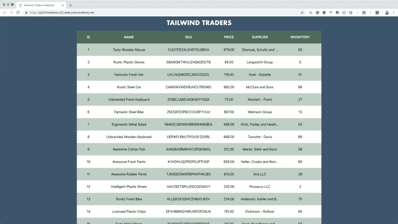

该应用程序允许您调整库存数量(最后一列)。假设某个地方的一名主管要求我们每天晚上通过电子邮件向他们发送一份报告，其中包含过去 24 小时内 SKU 更改的所有内容的列表。因为当然，他们会这样要求。事实上，我可以发誓我在过去的工作中已经在现实生活中建立了这个报告。或者是矩阵出了故障。不管怎样，我们都要这么做。

这是我们将要构建的……

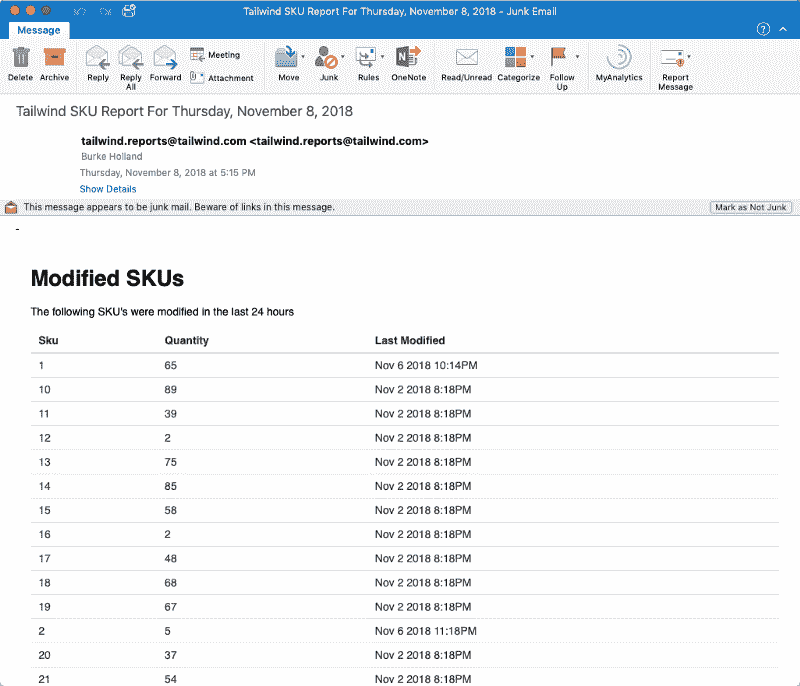

通常，您可以使用某种报表服务器来构建它。类似 SQL Server Reporting Services 或 Business Objects 或其他任何报表服务器。老实说，我不想知道。但是如果您没有报表服务器，这就有点乏味了。

让我们来看一下要实现这一点，您需要做些什么…

1.  在某种计时器上运行作业(cron 作业)
2.  查询数据库
3.  迭代记录并格式化它们以输出到屏幕上
4.  邮件称举报
5.  更新你的简历，联系招聘人员

这是没有人愿意做的事情。但是我认为这个项目会很有趣，我们可以用一些有趣的技术来实现它。从无服务器开始。

#### 无服务器定时器功能

对于像这样的一次性请求，无服务器是一个非常好的用例。在这种情况下，我们可以使用 Azure 函数来创建一个定时器触发函数。

为此，我将对 VS 代码使用 Azure Functions 扩展。事实上，我将把它用于所有事情。为什么？因为我不认识你，但我知道你很有可能用的是 VS 代码。VS 代码很棒，因为它就像一部电影，所有开发人员都一致认为它非常棒。有点像“人类的孩子”的反义词。那部电影很糟糕，你知道的。

确保安装了 Azure Functions 扩展。

[**Azure Functions- Visual Studio market place**](https://marketplace.visualstudio.com/items?itemName=ms-azuretools.vscode-azurefunctions&WT.mc_id=serverlessreport-medium-buhollan)
[*Visual Studio 代码的扩展-Visual Studio 代码的 Azure Functions 扩展。*marketplace.visualstudio.com](https://marketplace.visualstudio.com/items?itemName=ms-azuretools.vscode-azurefunctions&WT.mc_id=serverlessreport-medium-buhollan)

现在，从 VS 代码中创建一个新的函数应用程序。

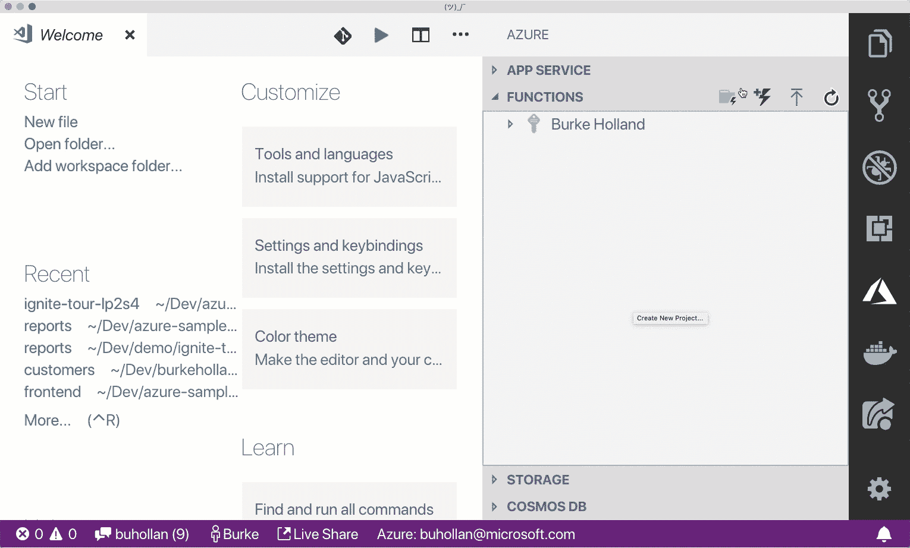

然后创建一个新的定时器触发函数。使用标准 Cron 表达式调度定时器触发函数。你可能从未见过，因为我直到几个月前才见过。而且我在这个行业已经很久了。我老了，威廉神父。

Cron 表达式看起来有点可怕，因为其中有星号。在下面的例子中，我是说当分钟是 0，秒钟是 0，小时能被 24 整除时，启动这个函数。这将是午夜。

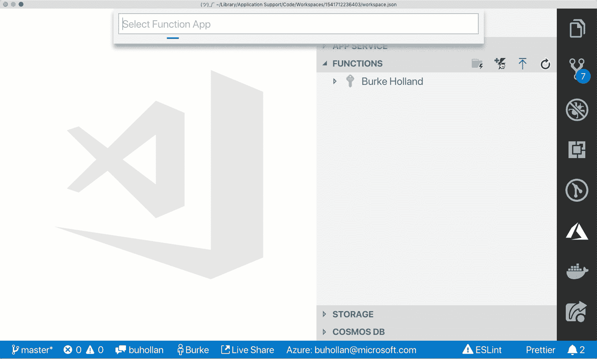

现在我们可以在本地运行它(F5)。我们将在嵌入式终端中看到我们的函数被调用的时间表；接下来的 5 次事件。

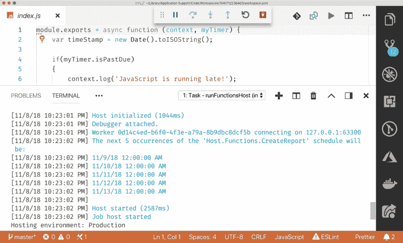

感觉很好，伙计。

好了，现在我们需要得到一些数据。我不打算把您拖入我从这个函数查询 SQL Server 的细节中，因为这不是本文要讨论的内容，但不管怎样，这里有代码。

```
const { Connection, Request } = require('tedious');

const options = {
  weekday: 'long',
  year: 'numeric',
  month: 'long',
  day: 'numeric'
};

const config = {
  userName: process.env.SQL_USERNAME,
  password: process.env.SQL_PASSWORD,
  server: process.env.SQL_SERVER,
  options: {
    encrypt: true,
    database: process.env.SQL_DATABASE
  }
};

module.exports = function(context, myTimer) {
  getChangedSkus()
    .then(data => {
      if (data.length > 0) {
        sendEmail(context, data);
      } else {
        context.done();
      }
    })
    .catch(err => {
      context.log(`ERROR: ${err}`);
    });
};

/**
 * Executes a query against the database for SKU's changed in the last 24 hours
 * @returns {Promise} Promise object contains result of query
 */
function getChangedSkus() {
  return new Promise((resolve, reject) => {
    const connection = new Connection(config);
    const query = `SELECT Sku, Quantity, CONVERT(varchar, Modified, 0) as Modified
                   FROM Inventory
                   WHERE Modified >= dateadd(day, -1, getdate())`;

    connection.on('connect', err => {
      if (err) reject(err);

      let request = new Request(query, err => {
        if (err) {
          reject(err);
        }
      });

      const results = [];
      request.on('row', columns => {
        let result = {};
        columns.forEach(column => {
          result[column.metadata.colName] = column.value;
        });

        results.push(result);
      });

      request.on('doneProc', (rowCount, more) => {
        resolve(results);
      });

      connection.execSql(request);
    });
  });
}
```

我正在连接数据库，做一个简单的查询…等一下…我没说过我**不打算谈论细节吗？你骗了我一分钟，但我知道你在玩什么！**

因此，这拉进数据，我们在一个 JavaScript 对象中得到它，我们可以把它作为 JSON 传递。如果我们这样做，我们将在报告中看到需要发送的数据集。

```
[
  { "Sku": "1", "Quantity": 65, "Modified": "Nov  6 2018 10:14PM" },
  { "Sku": "10", "Quantity": 89, "Modified": "Nov  2 2018  8:18PM" },
  { "Sku": "11", "Quantity": 39, "Modified": "Nov  2 2018  8:18PM" },
  { "Sku": "12", "Quantity": 2, "Modified": "Nov  2 2018  8:18PM" },
  { "Sku": "13", "Quantity": 75, "Modified": "Nov  2 2018  8:18PM" },
  { "Sku": "14", "Quantity": 85, "Modified": "Nov  2 2018  8:18PM" },
  { "Sku": "15", "Quantity": 58, "Modified": "Nov  2 2018  8:18PM" },
  { "Sku": "16", "Quantity": 2, "Modified": "Nov  2 2018  8:18PM" },
  { "Sku": "17", "Quantity": 48, "Modified": "Nov  2 2018  8:18PM" },
  { "Sku": "18", "Quantity": 68, "Modified": "Nov  2 2018  8:18PM" },
  { "Sku": "19", "Quantity": 67, "Modified": "Nov  2 2018  8:18PM" },
  { "Sku": "2", "Quantity": 5, "Modified": "Nov  6 2018 11:18PM" },
  { "Sku": "20", "Quantity": 37, "Modified": "Nov  2 2018  8:18PM" },
  { "Sku": "21", "Quantity": 54, "Modified": "Nov  2 2018  8:18PM" },
  { "Sku": "22", "Quantity": 21, "Modified": "Nov  2 2018  8:18PM" },
  { "Sku": "23", "Quantity": 46, "Modified": "Nov  2 2018  8:18PM" },
  { "Sku": "24", "Quantity": 55, "Modified": "Nov  2 2018  8:18PM" },
  { "Sku": "25", "Quantity": 21, "Modified": "Nov  2 2018  8:18PM" },
  { "Sku": "26", "Quantity": 42, "Modified": "Nov  2 2018  8:18PM" },
  { "Sku": "27", "Quantity": 65, "Modified": "Nov  2 2018  8:18PM" },
  { "Sku": "28", "Quantity": 74, "Modified": "Nov  2 2018  8:18PM" },
  { "Sku": "29", "Quantity": 33, "Modified": "Nov  2 2018  8:18PM" },
  { "Sku": "3", "Quantity": 51, "Modified": "Nov  2 2018  8:18PM" },
  { "Sku": "4", "Quantity": 96, "Modified": "Nov  2 2018  8:18PM" },
  { "Sku": "5", "Quantity": 27, "Modified": "Nov  6 2018 11:18PM" },
  { "Sku": "6", "Quantity": 13, "Modified": "Nov  2 2018  8:18PM" },
  { "Sku": "7", "Quantity": 54, "Modified": "Nov  2 2018  8:18PM" },
  { "Sku": "8", "Quantity": 89, "Modified": "Nov  2 2018  8:18PM" },
  { "Sku": "9", "Quantity": 56, "Modified": "Nov  2 2018  8:18PM" }
]
```

好吧！我们已经有了数据，现在我们只需要把它变漂亮，然后用电子邮件发给我们不喜欢的人。我们要怎么做呢？使用 SendGrid！

#### SendGrid setup

SendGrid 是一个漂亮的服务，有一个非常好的仪表板。你会喜欢的。否则你不会。不管怎样，你必须用它来阅读这篇博文。

如果您还没有免费帐户，可以创建一个。我们今天要做的已经够多了。

一旦你创建了一个报告，SendGrid 将把你放入你的“仪表板”。在这个仪表板上，您需要创建一个新的 API 应用程序并获取密钥。

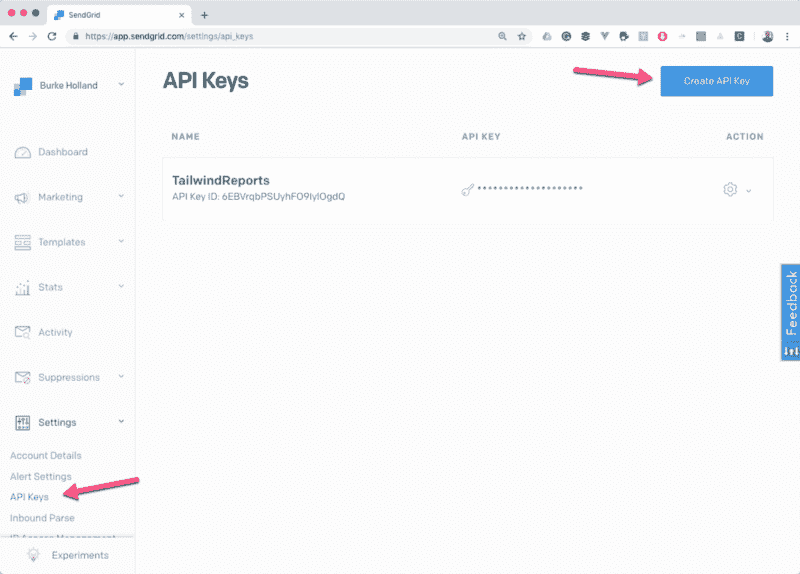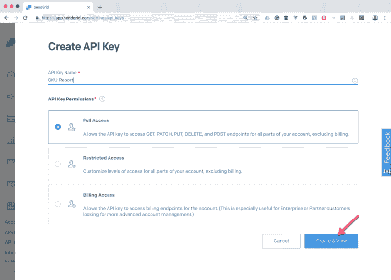

当它给你 API 密匙的时候，确保你拷贝了它。你再也回不去了，你将不得不从头再来。让我们面对现实吧:第一次有点无聊。

将密钥复制到 Azure Functions 项目中。将它放在`local.settings.json`文件中，以便以后可以作为 Node.js 环境变量访问它。

```
{
  "IsEncrypted": false,
  "Values": {
    "AzureWebJobsStorage": "DefaultEndpointsProtocol=https;AccountName=reporttimerstorage;AccountKey=OJVYCHI0GhtIm5XZdsDzGZFraJD/v/rfPwMSu4B72Kf5/O7oCrOQKNAFkQ==",
    "FUNCTIONS_WORKER_RUNTIME": "node",
    "SENDGRID_API_KEY": "SG.rlpDOy3EQNOTChnzpa1COPYg.G4MYlEYhwHk0RyvuGcY_xKEYbhQoFTtPB9A9-5ZaYQ"
  }
}
```

现在我们将在 SendGrid 中创建一个模板。我们将用它来设计我们的报告。SendGrid 有一种叫做“事务模板”的东西。我不知道他们为什么这么叫，但是我们需要一个。

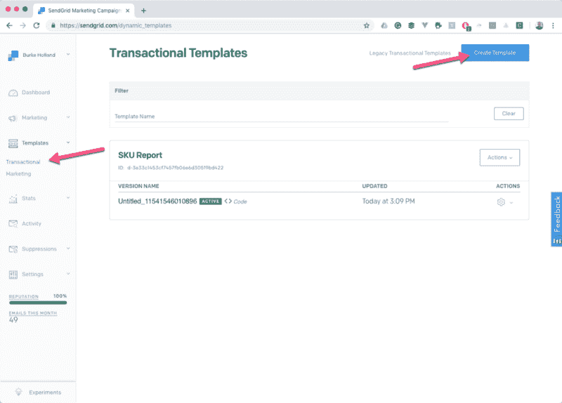

一旦你创建了一个新的，你就得创建一个新的“版本”。我费了好大劲才弄明白这一点。不过，话说回来，我的大脑还是有点小。

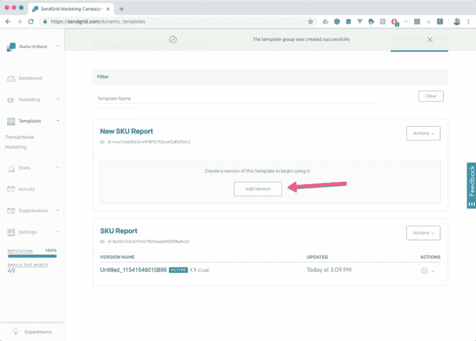

选择使用代码编辑器设计模板。你不需要该死的设计师编辑！

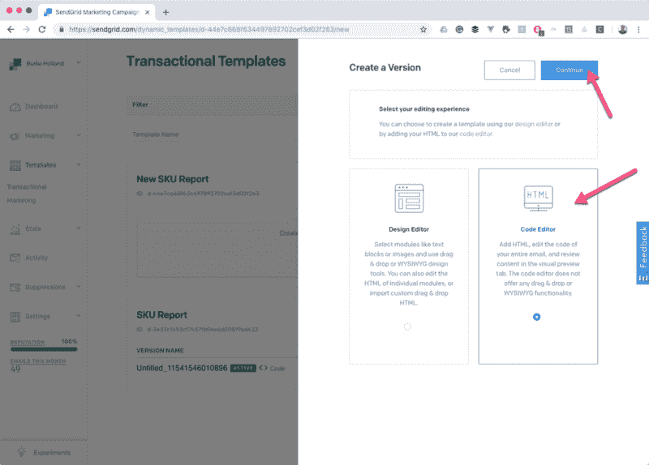

SendGrid 支持 handlebars，这是一个非常简单的模板语法，连我都可以做到。在代码编辑器中，您可以将 JSON 数据粘贴到“测试数据”选项卡中…

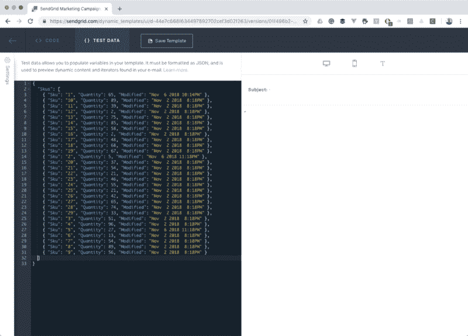

现在使用 JSON 中的键名迭代数据…

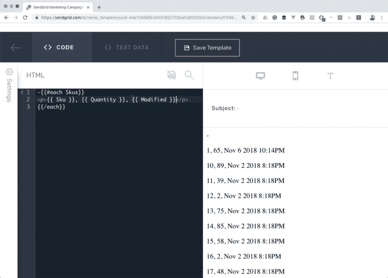

太美了！我哭了。装运它。

好吧。好吧。我们会让老眼球看起来更好。这是我无耻地从华丽的[布尔玛 CSS 框架](https://bulma.io/)中剽窃来的一种风格。

```
<style>
  table {
    border-collapse: collapse;
    border-spacing: 0;
    background-color: white;
    color: #363636;
  }
  .table td,
  .table th {
    border: 1px solid #dbdbdb;
    border-width: 0 0 1px;
    padding: 0.5em 0.75em;
    vertical-align: top;
  }
  .table th {
    color: #363636;
    text-align: left;
  }
  .table thead td,
  .table thead th {
    border-width: 0 0 2px;
    color: #363636;
  }
  .table tbody tr:last-child td,
  .table tbody tr:last-child th {
    border-bottom-width: 0;
  }
  .table.is-bordered td,
  .table.is-bordered th {
    border-width: 1px;
  }
  .table.is-bordered tr:last-child td,
  .table.is-bordered tr:last-child th {
    border-bottom-width: 1px;
  }
  .table.is-fullwidth {
    width: 100%;
  }
  .container {
    margin: 0 auto;
    position: relative;
    max-width: 960px;
    padding-top: 20px;
    font-family: helvetica, sans-serif;
  }
</style>

<div class="container">
  <h1>Modified SKUs</h1>
  <p>The following SKU's were modified in the last 24 hours</p>

  <table class="table is-fullwidth">
    <thead>
      <tr>
        <th>Sku</th>
        <th>Quantity</th>
        <th>Last Modified</th>
      </tr>
    </thead>
    <tbody>
      {{#each Skus}}
      <tr>
        <td>{{Sku}}</td>
        <td>{{Quantity}}</td>
        <td>{{Modified}}</td>
      </tr>
      {{/each}}
    </tbody>
  </table>
</div>
```

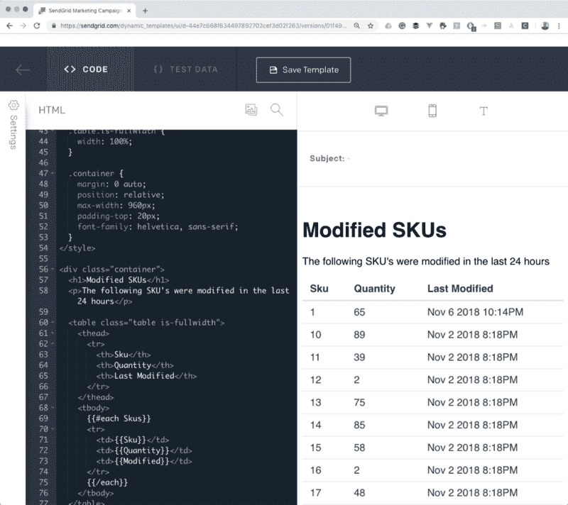

在这一点上，你可以听到印象深刻。

现在你可能已经注意到邮件的主题不见了。我们该怎么填呢？好吧，在又一次尴尬的失败和反省之后，我发现它在左边的“设置”图标后面。您只需在 JSON 中为“Subject”传递一个值。

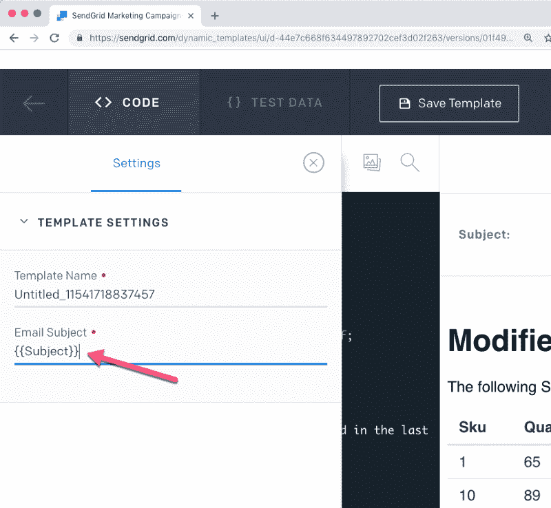

现在我们需要获取模板 ID 并将其添加到我们的 Azure Functions 项目中。保存该模板，并从主模板屏幕中选择 ID。

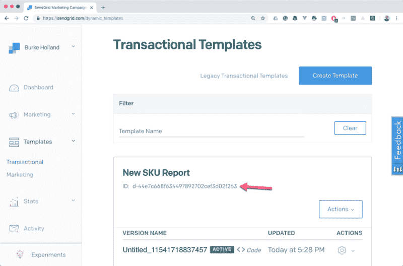

将它放在 SendGrid API 密钥下面的可信的`local.settings.json`文件中。

```
{
  "IsEncrypted": false,
  "Values": {
    "AzureWebJobsStorage": "DefaultEndpointsProtocol=https;AccountName=reporttimerstorage;AccountKey=OJVYCHI0GhtIm5XZdsDzGZFraJD/v/rfPwMSu4B72Kf5/O7oCrOQKNAFkQ==",
    "FUNCTIONS_WORKER_RUNTIME": "node",
    "SENDGRID_API_KEY": "SG.rlpDOy3EQNOTChnzpa1COPYg.G4MYlEYhwHk0RyvuGcY_xKEYbhQoFTtPB9A9-5ZaYQ"
    "SENDGRID_TEMPLATE_ID": "d-3e33c1453cf7457fb06e6d30519bd422"
  }
}
```

现在，我们已经准备好将我们的数据从 Azure 函数传递到 SendGrid，并发出这个令人难以置信的商业艺术品。


#### Azure 函数的 SendGrid 绑定

Azure Functions 为 SendGrid 提供了绑定。如果你通过 Azure 门户创建一个函数，当你选择“SendGrid”模板时，它会为你创建这个绑定。如果你像我一样在本地做，那就要自己加了。

首先，您需要为`CreateReport`函数打开`function.json`文件，并添加 SendGrid 绑定。

```
{
   "type": "sendGrid",
   "name": "message",
   "apiKey": "SENDGRID_API_KEY",
   "to": "youremail@company.com",
   "from": "hahabusiness@businesstime.com",
   "direction": "out"
}
```

SendGrid 绑定是 Azure 函数的扩展。在终端中运行以下命令来安装它。

```
Microsoft.Azure.WebJobs.Extensions.SendGrid -Version 3.0.0
```

当您运行这个命令时，VS 代码会要求您恢复一些依赖关系。您可以单击恢复。不会有什么不好的事情发生…或者会发生吗？！

您需要做的另一件事是调整您的`extensions.csproj`文件以引用最新的 SendGrid 库。这是使用动态模板所必需的。

```
<PackageReference Include="Sendgrid" Version="9.10.0" />
```

当您添加时，VS 代码将提示您再次恢复，是的，这次您肯定需要这样做。VS 代码需要构建这些二进制文件，而恢复可以做到这一点。

好吧！现在，我们准备通过 SendGrid 模板发送电子邮件。下面是实现它的代码。这简单得令人沮丧。我知道在这一切之后，你希望有足够的代码来掐死一只猫(什么？你从来没听过这个比喻吗？)，但这就是全部了。

```
function sendEmail(context, data) {
  context.done(null, {
    message: {
      /* you can override the to/from settings from function.json here if you would like
        to: 'someone@someplace.com',
        from: 'someone@anotherplace.com'
        */
      personalizations: [
        {
          dynamic_template_data: {
            Subject: `Tailwind SKU Report For ${new Date().toLocaleDateString(
              'en-US',
              options
            )}`,
            Skus: data
          }
        }
      ],
      template_id: process.env.SENDGRID_TEMPLATE_ID
    }
  });
}
```

值得注意的是，我将 Subject 作为 JSON 的一部分传入。事实上，您可以在这里覆盖在`function.json`文件中指定的地址。

现在你可以运行你的函数并等待 24 小时来测试它！

不，但是说真的——在不不断修改该死的 Cron 作业的情况下，如何手动测试定时器触发器？

我会告诉你我是怎么做的，然后你可以想出一个更好的方法。

#### 使用 http 触发器测试计时器触发器

我在同一个项目中创建了一个 Http 触发器，并将其命名为“RunCreateReport”。在那个函数中，我只是导入并调用定时器函数。

```
const index = require('../CreateReport/index');

module.exports = function(context, req) {
  // This is a tester function that manually executes the CreateReport timer function
  index(context);
};
```

唯一的缺点是，您必须从“CreateReport”中的`function.json`到“RunCreateReport”`function.json`中重复 SendGrid 绑定设置。但除此之外，这工作得很好。现在你可以运行这个东西，启动一个浏览器，点击 URL，它将立即调用定时器功能。您可以测试，而不必接触那个讨厌的老 Cron 表达式。

#### 哈哈生意

现在去查看你的邮件，享受这份报告的荣耀吧。请注意，您不必拥有一个电子邮件地址就可以从 SendGrid 发送邮件。你可以从任何地址发送。说真的。去试试吧。想想你能用这种力量做什么。

这是我的收件箱的样子。注意，它确实会变成垃圾。可能是因为我没有发件人的电子邮件地址。

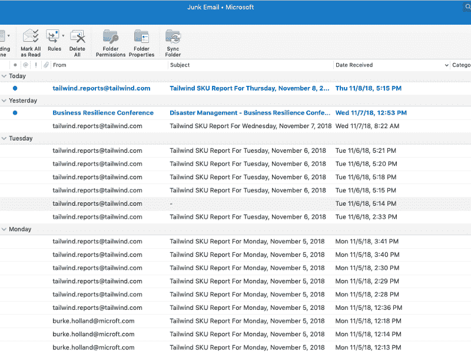

什么？有一个“商业弹性会议”？OMG 这么多生意。我打赌那些人会收到很多报告。

你可以从 Github 获得这个项目。

[**Burke Holland/server less-send grid-report**](https://github.com/burkeholland/serverless-sendgrid-report)
[*通过在 GitHub 上创建账号，为 Burke Holland/server less-send grid-report 开发做贡献。*github.com](https://github.com/burkeholland/serverless-sendgrid-report)

这里有一些其他的 Azure Functions 资源可以让你忙起来。

*   [使用 Azure 功能部署到 Azure](https://code.visualstudio.com/tutorials/functions-extension/getting-started?WT.mc_id=serverlessreport-medium-buhollan)
*   [Azure Functions JavaScript 开发者指南](https://docs.microsoft.com/en-us/azure/azure-functions/functions-reference-node?WT.mc_id=serverlessreport-medium-buhollan)
*   [将 Mongo DB API 迁移到 Azure 函数](https://www.youtube.com/watch?v=89WXgaY-NqY)