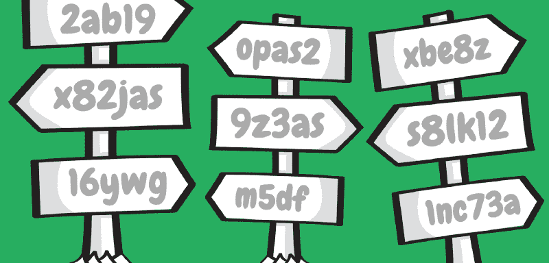
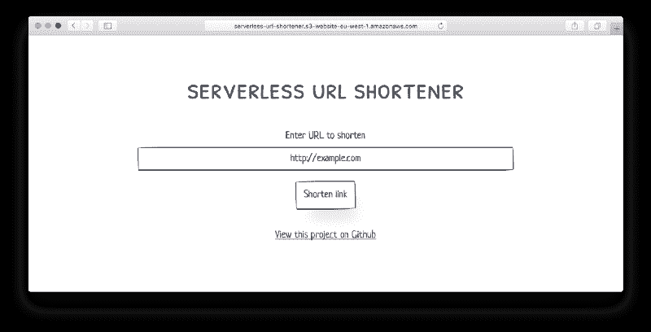

# 如何使用 AWS Lambda 和 S3 构建一个无服务器的 URL 缩短器

> 原文：<https://www.freecodecamp.org/news/how-to-build-a-serverless-url-shortener-using-aws-lambda-and-s3-4fbdf70cbf5c/>

丹尼尔·艾瑞森

# 如何使用 AWS Lambda 和 S3 构建一个无服务器的 URL 缩短器



Using graphics from [SAP Scenes Pack](https://experience.sap.com/designservices/approach/scenes)

在这篇文章中，我们将使用亚马逊网络服务(AWS) Lambda 和 S3 构建一个无服务器的 URL 缩短器。虽然您不需要任何 AWS 方面的经验，但我假设您对 ES6 JavaScript 和 Node.js 有所了解。

具有讽刺意味的是，从我们的网址缩写器生成的网址通常会比它们重定向到的网址长——这是因为我们使用了默认的 S3 网站地址。在这篇文章的最后，我将讨论如何添加一个自定义域来绕过这个限制。

#### [观看演示](http://serverless-url-shortener.s3-website-eu-west-1.amazonaws.com)

#### [参见 Github 上的代码](https://github.com/danielireson/serverless-url-shortener)



开始使用 AWS 相对容易，但肯定会感觉到复杂性。可供选择的服务数量之多令人望而生畏，因为许多服务在功能上是重叠的。缓慢和不直观的 AWS 管理控制台没有帮助，也没有大量文本的在线文档。但是在这篇文章中，我希望证明采用 AWS 服务的最佳方式是使用增量方法，并且您可以通过使用少量的服务开始。

我们将使用[无服务器框架](https://serverless.com)与 AWS 交互，因此不需要登录 AWS 管理控制台。无服务器框架提供了对 AWS 的抽象，并有助于提供项目结构和合理的配置默认值。如果你想在我们开始之前了解更多，你应该读一读他们的[文件](https://serverless.com/framework/docs/)。

### 体系结构

在开始任何开发之前，让我们先来看看我们将用来构建 URL 缩短器的 AWS 服务。

为了托管我们的网站，我们将使用亚马逊 S3 文件存储服务。我们将配置我们的 S3 桶，它可以被认为是一个顶层文件夹，为一个静态网站服务。该网站将由静态内容和客户端脚本组成。没有执行服务器端代码的能力(例如 PHP、Ruby 或 Java)，但是对于我们的用例来说这很好。

我们还将使用 S3 的一个[鲜为人知的特性](http://docs.aws.amazon.com/AmazonS3/latest/dev/how-to-page-redirect.html)，该特性允许您简单地通过向对象的元数据添加一个`Website-Redirect-Location`值来为 S3 桶中的对象设置转发。将它设置为 URL 将通过 HTTP 301 响应和`location`头重定向浏览器。

S3 对象的 URL 由 S3 桶地址和对象名称组成。

```
http://[bucket-name].s3-website-eu-west-1.amazonaws.com/[object-name]
```

以下是用于`eu-west-1`区域的 S3 桶对象的格式示例。

```
http://serverless-url-shortener.s3-website-eu-west-1.amazonaws.com/6GpLcdl
```

上例中 URL 末尾的对象名“6GpLcdl”成为我们缩短的 URL 的简称。使用该功能，我们可以获得本地 URL 重定向和存储功能。我们不需要数据库来存储哪个短代码指向哪个 URL 的细节，因为这些信息将与对象本身一起存储。

我们将创建一个 Lambda 函数，用适当的元数据将这些 S3 对象保存到我们的 S3 桶中。

您也可以在浏览器中使用 AWS SDK 客户端来保存对象。但是最好将这个功能提取到一个单独的服务中。它提供了不必担心暴露安全凭证的优势，并且在将来更具可扩展性。我们将 Lambda 函数映射到 API Gateway 上的一个端点，这样就可以通过 API 调用访问它。

### 入门指南

前往[无服务器框架文档](https://serverless.com/framework/docs/providers/aws/guide/quick-start/)并浏览它们的快速入门指南。作为设置过程的一部分，您必须安装 [AWS CLI](http://docs.aws.amazon.com/cli/latest/userguide/installing.html) 并配置您的 AWS 凭证。

首先在项目的根目录下创建一个`package.json`文件。

```
{  "name": "serverless-url-shortener",  "scripts": {},  "dependencies": {}}
```

我们知道我们将需要使用 [AWS SDK](https://aws.amazon.com/sdk-for-node-js/) ，所以现在通过输入下面的命令从 NPM 安装它。

`npm install aws-sdk --save`

现在在项目根目录下创建一个`config.json`文件。我们将用它来以 JSON 格式存储可定制的用户选项。

添加以下具有适合您的设置的值的键。

*   **BUCKET** -您要为您的 S3 存储桶使用的名称。如果您选择不添加自定义域，这将成为短 URL 的一部分。它必须对你要部署的地区是独特的，所以不要选择太普通的东西。但是不要担心，如果您选择的 bucket 名称已经被使用，您将在部署时通过无服务器 CLI 得到警告。
*   **地区** -您希望部署到的 [AWS 地区](http://docs.aws.amazon.com/general/latest/gr/rande.html#s3_region)。出于性能原因，最好选择离用户最近的地区。如果你只是跟随教程，我将使用`eu-west-1`。
*   **阶段**——要部署到的阶段。通常，您会有一个与生产环境复制相同配置的暂存环境。这允许您以非破坏性的方式测试软件版本。由于这是一个教程，我将部署到`dev`阶段。

完成后，您的`config.json`文件应该类似于下面的内容。

```
{  "BUCKET": "your-bucket-name",  "REGION": "eu-west-1",  "STAGE": "dev",}
```

接下来，在项目根目录下创建另一个文件`serverless.yml`。这将保存我们用 YAML 标记语言格式化的无服务器框架配置。

在这个文件中，我们将从定义我们的环境开始。注意我们如何引用早先存储在`config.json`中的变量。

```
service: serverless-url-shortenerprovider:  name: aws  runtime: nodejs6.10  stage: ${file(config.json):STAGE}  region: ${file(config.json):REGION}  iamRoleStatements:    - Effect: Allow      Action:        - s3:PutObject      Resource: "arn:aws:s3:::${file(config.json):BUCKET}/*"
```

`iamRoleStatements`部分指的是[身份和访问管理](http://docs.aws.amazon.com/IAM/latest/UserGuide/id_roles.html)，用于设置 Lambda 权限。在这里，我们为 S3 存储桶提供 Lambda 写访问权限。

为了保存对象，我们需要执行`s3:PutObject`动作的许可。如果您的项目需要其他权限，可以在此处添加。参考 [S3 文档](http://docs.aws.amazon.com/AmazonS3/latest/dev/using-with-s3-actions.html#using-with-s3-actions-related-to-objects)了解其他可用的操作。

`Resource`值被设置为 S3 桶的[亚马逊资源名称](http://Amazon Resource Name)，用于唯一标识特定的 AWS 资源。该标识符的格式取决于所引用的 AWS 服务，但通常具有以下格式。

```
arn:partition:service:region:account-id:resource
```

在`provider`下面添加我们的`functions`配置。

```
functions:  store:    handler: api.handle    events:      - http:          path: /          method: post          cors: true
```

这里我们定义了 API 配置，并将 Lambda 映射到 API 的基本 URL 上的 HTTP POST 事件。值为`api.handle`的`handler`引用从`api.js`导出的名为`handle`的函数(我们不需要 *js* 文件扩展名，因为在`serverless.yml`中，我们将运行时间设置为`nodejs6.10`)。

Lambda 是基于事件的，所以函数只能基于预定义的触发器来执行。这里我们定义了一个 HTTP 事件，但这也可能是由 DynamoDB 表或 SQS 队列触发的事件。

接下来在`serverless.yml`中，我们使用 [CloudFormation](https://aws.amazon.com/cloudformation) 为我们定义部署时要实例化的 AWS 资源。值得一提的是，您不必以这种方式设置资源，您也可以使用 AWS 管理控制台来创建它们。只要有正确的访问权限，如何创建资源并不重要。但是在`serverless.yml`中定义所需的服务时，您是在定义您的“代码形式的基础设施”,并在这样做的过程中获得许多好处。

> “基础设施即代码是通过源代码定义计算和网络基础设施的方法，然后可以像对待任何软件系统一样对待源代码。这样的代码可以保存在源代码控制中，以允许可审计性和可复制性的构建，服从测试实践和持续交付的完整规程。”

> 马丁·福勒

继续添加`resources`配置。

```
resources:  Resources:    ServerlessRedirectS3Bucket:      Type: AWS::S3::Bucket      Properties:        BucketName: ${file(config.json):BUCKET}        AccessControl: PublicRead        WebsiteConfiguration:          IndexDocument: index.html    ServerlessRedirectS3BucketPolicy:      Type: AWS::S3::BucketPolicy      Properties:        Bucket: ${file(config.json):BUCKET}        PolicyDocument:          Statement:          - Action:            - s3:GetObject            Effect: Allow            Resource:            - arn:aws:s3:::${file(config.json):BUCKET}/*            Principal: "*"
```

我们要求一个 S3 桶资源配置为使用静态网站托管与`index.html`作为根文档。出于很好的理由，S3 存储桶在默认情况下是私有的，因此我们需要创建一个允许公共访问它的 S3 存储桶策略。如果没有此策略，网站访问者将会看到一条未经验证的错误消息。

### 构建 API

我们的 Lambda 函数负责四项任务。

1.  从用户提交的表单中抓取 URL 来缩短。
2.  为 URL 生成唯一的短代码。
3.  将适当的重定向对象保存到 S3。
4.  将对象的路径返回给客户端。

#### 创建处理程序

创建一个名为`api.js`的新文件，并导出一个名为`handle`的箭头函数，该函数有三个参数:`event` *、* `context`和`callback` *。当处理程序被调用时，这些将由 AWS 提供。该文件是一个 Node.js 脚本，为了导出箭头函数，您需要将它附加到`module.exports`。*

```
module.exports.handle = (event, context, callback) => {
```

```
}
```

当向我们的端点发出 HTTP POST 请求时，这个处理程序将被调用。要返回 API 响应，我们需要使用作为第三个箭头函数参数提供的回调函数。这是一个带有两个参数的[错误优先回调](http://fredkschott.com/post/2014/03/understanding-error-first-callbacks-in-node-js/)。如果请求成功完成，`null`应该作为第一个参数传入。作为第二个参数传入的响应对象决定了返回给用户的响应类型。生成响应就像提供一个`statusCode`和`body`一样简单，如下例所示。

```
const response = {  statusCode: 201,  body: JSON.stringify({ "shortUrl": "http://example.com" })}
```

```
callback(null, response)
```

作为处理程序的第二个参数传入的`context`对象包含运行时信息，对于本教程，我们不需要访问这些信息。然而，我们确实需要使用作为第一个参数传入的`event`,因为它包含带有要缩短的 URL 的表单提交。

#### 解析请求

下面是一个 API 网关事件的例子，当用户提交表单时，该事件将被传递给我们的处理程序。由于我们将 URL shortener 构建为单页应用程序，我们将使用 JavaScript 提交表单，因此内容类型将是`application/json`而不是`application/x-www-form-urlencoded`。

```
{     resource:'/',   path:'/',   httpMethod:'POST',   headers: {      Accept:'*/*',      'Accept-Encoding':'gzip, deflate',      'cache-control':'no-cache',      'CloudFront-Forwarded-Proto':'https',      'CloudFront-Is-Desktop-Viewer':'true',      'CloudFront-Is-Mobile-Viewer':'false',      'CloudFront-Is-SmartTV-Viewer':'false',      'CloudFront-Is-Tablet-Viewer':'false',      'CloudFront-Viewer-Country':'GB',      'content-type':'application/json',      Host:'',      'User-Agent':'',      'X-Amz-Cf-Id':'',      'X-Amzn-Trace-Id':'',      'X-Forwarded-For':'',      'X-Forwarded-Port':'443',      'X-Forwarded-Proto':'https'   },   queryStringParameters:null,   pathParameters:{},   stageVariables:null,   requestContext: {        path:'/dev',      accountId:'',      resourceId:'',      stage:'dev',      requestId:'',      identity:{           cognitoIdentityPoolId:null,         accountId:null,         cognitoIdentityId:null,         caller:null,         apiKey:'',         sourceIp:'',         accessKey:null,         cognitoAuthenticationType:null,         cognitoAuthenticationProvider:null,         userArn:null,         userAgent:'',         user:null      },      resourcePath:'/',      httpMethod:'POST',      apiId:''   },   body:'{"url":"http://example.com"}',   isBase64Encoded:false}
```

我们只需要来自事件的表单提交，这可以通过查看请求`body`来获得。请求体存储为一个字符串化的 JavaScript 对象，我们可以使用`JSON.parse()`在处理程序中获取该对象。利用 [JavaScript 短路评估](http://www.jstips.co/en/javascript/short-circuit-evaluation-in-js/)，我们可以为 URL 没有作为表单提交的一部分发送的情况设置一个空字符串的默认值。这允许我们平等地对待 URL 丢失和 URL 为空字符串的情况。

```
module.exports.handle = (event, context, callback) => {  let longUrl = JSON.parse(event.body).url || ''}
```

#### 验证 URL

让我们添加一些基本的验证来检查所提供的 URL 是否合法。有多种方法可以实现这一点。但是出于本教程的目的，我们将保持简单，使用内置的 [Node.js URL 模块](https://nodejs.org/api/url.html)。我们将构建我们的验证，在有效的 URL 上返回解析的承诺，在无效的 URL 上返回拒绝的承诺。JavaScript 中的承诺可以按顺序链接，以便将一个承诺的解析传递给下一个承诺的成功处理程序。我们将使用承诺的这个属性来构造我们的处理程序。让我们使用 promises 编写 validate 函数。

```
const url = require('url')
```

```
function validate (longUrl) {  if (longUrl === '') {    return Promise.reject({      statusCode: 400,      message: 'URL is required'    })  }
```

```
let parsedUrl = url.parse(longUrl)  if (parsedUrl.protocol === null || parsedUrl.host === null) {    return Promise.reject({      statusCode: 400,      message: 'URL is invalid'    })  }
```

```
return Promise.resolve(longUrl)}
```

在我们的`validate`函数中，我们首先检查 URL 没有被设置为空字符串。如果是，我们就退回一个被拒绝的承诺。注意被拒绝的值是一个包含状态代码和消息的对象。稍后我们将使用它来构建适当的 API 响应。在 Node.js `url`模块上调用`parse`会返回一个 URL 对象，其中包含可以从作为字符串参数传递的 URL 中提取的信息。作为我们基本 URL 验证的一部分，我们只是检查是否可以提取协议(例如“http”)和主机(如“example.com”)。如果这些值中的任何一个在返回的 URL 对象上是`null`，我们就认为该 URL 是无效的。如果 URL 有效，我们会将其作为已解析承诺的一部分返回。

#### 返回响应

从请求中获取 URL 后，我们调用`validate`，对于所需的每个额外的处理程序步骤，我们将在前一个承诺的成功处理程序中返回一个新的承诺。最终的成功处理程序负责通过句柄的回调参数返回 API 响应。它将被调用用于拒绝承诺产生的错误 API 响应以及成功的 API 响应。

```
module.exports.handle = (event, context, callback) => {  let longUrl = JSON.parse(event.body).url || ''  validate(longUrl)    .then(function(path) {      let response = buildResponse(200, 'success', path)      return Promise.resolve(response)    })    .catch(function(err) {      let response = buildResponse(err.statusCode, err.message)      return Promise.resolve(response)    })    .then(function(response) {      callback(null, response)    })}
```

```
function buildResponse (statusCode, message, path = false) {  let body = { message }  if (path) body['path'] = path    return {    headers: {      'Access-Control-Allow-Origin': '*'    },    statusCode: statusCode,    body: JSON.stringify(body)  }}
```

#### 生成 URL 短代码

API 需要能够生成唯一的 URL 短代码，在 S3 桶中用文件名表示。因为短代码只是一个文件名，所以它的构成有很大的灵活性。对于我们的短码，我们将使用由大写和小写字符组成的 7 位字母数字字符串，这意味着每个字符有 62 种可能的组合。我们将使用递归来构建短代码，一次选择一个字符，直到选择了七个字符。

```
function generatePath (path = '') {  let characters = 'abcdefghijklmnopqrstuvwxyzABCDEFGHIJKLMNOPQRSTUVWXYZ0123456789'  let position = Math.floor(Math.random() * characters.length)  let character = characters.charAt(position)
```

```
if (path.length === 7) {  return path}
```

```
return generatePath(path + character)}
```

虽然随机生成相同短代码的可能性很小(实际上两个短代码相同的可能性是 0.00000000000000008063365516)，但我们需要检查生成的短代码是否已经在使用，这可以使用 AWS SDK 来完成。S3 服务上有一个`headObject` 方法，它加载一个对象的元数据。我们可以用它来测试一个同名的对象是否已经存在，就像没有找到一个对象一样，代码为 *NotFound* 的承诺被拒绝。这个被拒绝的承诺表明短代码是免费的，可以使用。调用`headObject`比通过`getObject`测试对象是否存在更有效，后者加载整个对象。

```
const AWS = require('aws-sdk')const S3 = new AWS.S3()
```

```
function isPathFree (path) {  return S3.headObject(buildRedirect(path)).promise()    .then(() => Promise.resolve(false))    .catch(function (err) {      if (err.code == 'NotFound') {        return Promise.resolve(true)      } else {        return Promise.reject(err)      }    })}
```

```
function buildRedirect (path, longUrl = false) {  let redirect = {    'Bucket': config.BUCKET,    'Key': path  }
```

```
if (longUrl) {    redirect['WebsiteRedirectLocation'] = longUrl  }
```

```
return redirect}
```

我们可以使用`isPathFree`递归地找到一个唯一的对象路径。

```
function getPath () {  return new Promise(function (resolve, reject) {    let path = generatePath()    isPathFree(path)      .then(function (isFree) {        return isFree ? resolve(path) : resolve(getPath())      })  })}
```

利用链接承诺的能力，如果`isPathFree`返回 false，我们将返回对`getPath`的新调用。

要在找到唯一的短代码后保存对象，我们只需调用 AWS SDK S3 服务上的`putObject`方法。让我们将此封装在一个函数中，如果`putObject`方法调用成功，则该函数解析短代码，如果不成功，则返回一个错误对象来构建 API 响应。

```
function saveRedirect (redirect) {  return S3.putObject(redirect).promise()    .then(() => Promise.resolve(redirect['Key']))    .catch(() => Promise.reject({      statusCode: 500,      message: 'Error saving redirect'  })}
```

利用上面的函数，我们可以添加两个新的 promise success 处理程序来完成我们的 API 端点。我们需要从第一个 promise success 处理程序返回`getPath`,它将解析一个唯一的 URL 短代码。在第二个成功处理程序中返回使用这个惟一的短代码构建的重定向对象`saveRedirect`,会将该对象保存到 S3 桶中。然后，这个对象的路径可以作为 API 响应的一部分返回给客户端。我们的处理程序现在应该完成了。

```
module.exports.handle = (event, context, callback) => {  let longUrl = JSON.parse(event.body).url || ''  validate(longUrl)    .then(function () {      return getPath()    })    .then(function (path) {      let redirect = buildRedirect(path, longUrl)      return saveRedirect(redirect)    })    .then(function (path) {      let response = buildResponse(200, 'success', path)      return Promise.resolve(response)    })    .catch(function (err) {      let response = buildResponse(err.statusCode, err.message)      return Promise.resolve(response)    })    .then(function (response) {      callback(null, response)    })}
```

#### 部署 API

在您的终端中运行`serverless deploy`,将 API 部署到 AWS。这将设置我们的 S3 桶并返回端点的 URL。将端点的 URL 放在手边，因为我们稍后会用到它。

```
Serverless: Packaging service...Serverless: Excluding development dependencies...Serverless: Uploading CloudFormation file to S3...Serverless: Uploading artifacts...Serverless: Uploading service .zip file to S3 (5.44 MB)...Serverless: Validating template...Serverless: Updating Stack...Serverless: Checking Stack update progress.................Serverless: Stack update finished...Service Informationservice: serverless-url-shortenerstage: devregion: eu-west-1stack: serverless-url-shortener-devapi keys:  Noneendpoints:  POST - https://t2fgbcl26h.execute-api.eu-west-1.amazonaws.com/dev/functions:  store: serverless-url-shortener-dev-storeServerless: Removing old service versions...
```

### 创建前端

为了协助前端设计，我们将利用 [PaperCSS](https://github.com/papercss/papercss) 框架。我们还将使用 [jQuery](https://jquery.com/) 来简化 DOM 操作和 AJAX 查询。值得注意的是，对于生产环境，您可能希望引入两个较轻的依赖项，但由于这只是一个教程，我觉得这是可以接受的。

创建一个`static`文件夹，这样我们就有地方存储我们的前端代码了。

#### 下载依赖项

将 [paper.min.css](https://github.com/papercss/papercss/releases/download/v1.3.1/paper.min.css) 和 [jquery-3.2.1.min.js](https://code.jquery.com/jquery-3.2.1.min.js) 的副本保存到我们新创建的`static`文件夹中，它们分别是 PaperCSS 框架和 jquery 库的缩小版。

#### 添加 HTML

在`static`文件夹中创建一个名为`index.html`的新文件，并添加所需的 HTML。我们需要一个带有 URL 输入的表单和一个提交表单的按钮。我们还需要一个地方来存放任何 API 调用的结果，对于成功的 API 调用，这将是缩短的 URL，对于不成功的 API 调用，这将是错误消息。

```
<!DOCTYPE html><html lang="en"><head>  <meta charset="UTF-8">  <meta name=viewport content="width=device-width,initial-scale=1">  <title>Serverless url shortener</title>  <link href="paper.min.css" rel="stylesheet"></head><style>  * {    text-align: center;  }
```

```
 #message {    display: none;  }</style><body>  <div class="row flex-center">    <div class="col-8 col">      <h2>Serverless url shortener</h2>      <form action="">        <div class="form-group">          <label for="url">Enter URL to shorten</label>          <input             class="input-block"             name="url"             type="url"             id="url"              autocomplete="off"             required>        </div>        <div id="message" class="alert alert-primary"></div>        <input           class="paper-btn"           type="submit"           value="Shorten link">      </form>      <p class="padding-top">        <a href="https://git.io/vbS8I">          View this project on Github        </a>      </p>    </div>  </div></body></html>
```

尽管为了简洁起见没有在上面的代码块中显示，但是一定要将表单动作设置为运行`serverless deploy`时显示的 API 端点。如果您不再能够从该部署访问您的终端输出，您可以通过`serverless info`命令找到端点 URL。

#### 提出 API 请求

在编写 JavaScript 向我们的 API 发出请求之前，让我们首先加载 jQuery，方法是在`</bo` dy >之前添加一个脚本标签，并引用我们之前下载的缩小文件。

```
<script src="jquery-3.2.1.min.js"></script>
```

现在，在下面和里面添加另一对脚本标记。让我们创建一个函数，该函数可以使用模板中的消息`div`向用户显示消息，在页面加载时，默认情况下该模板设置为`display:none`。要显示消息，我们可以简单地使用`text()`设置这个`div`中的文本，并使用`show()`切换显示。

```
<script>  function addMessage (text) {    $('#message').text(text).show()  }</script>
```

让我们编写另一个函数来进入同一个脚本标记集，它将使用 jQuery 向我们的 API 发出请求。

```
function shortenLink (apiUrl, longUrl) {  $.ajax(apiUrl, {    type : 'POST',     data: JSON.stringify({url: longUrl})})    .done(function (responseJSON) {      var protocol = window.location.protocol + '//'      var host = window.location.host + '/'      var shortUrl = protocol + host + responseJSON.path      addMessage(shortUrl)    })    .fail(function (data) {      if (data.status === 400) {        addMessage(data.responseJSON.message)      } else {        addMessage('an unexpected error occurred')      }    })}
```

这个函数创建一个 POST 请求，并将请求体设置为一个 JSON 对象，其中包含要缩短的 URL。如果请求成功完成，并且返回了 HTTP 2XX 状态代码，它将从响应中的`path`键获取短代码，并使用之前创建的`addMessage`函数构建一个完全合格的短 URL 呈现给用户。如果请求不成功，则会显示一条错误消息。

最后，我们可以通过添加一个提交处理程序，将它与表单联系起来。我们从表单动作属性中获取 API 端点 URL，并从`url`表单输入中获取要缩短的 URL。

```
$('form').submit(function (event) {  event.preventDefault()  addMessage('...')  shortenLink(event.target.action, event.target.url.value)})
```

#### 部署网站

对于网站部署，我们将使用 AWS CLI `sync`命令将静态文件夹的内容上传到我们的 S3 存储桶。在你的终端中运行`aws s3 sync static s3://[bucket]`，用你在`config.json`中选择的桶名替换`[bucket]`。完成后，你应该可以在浏览器中访问你的 S3 地址，查看 URL 缩短器的运行情况。S3 桶的公共 URL 采用以下形式。

```
http://[bucket].s3-website-[region].amazonaws.com
```

因此，在添加您的桶名和地区后，您的 URL 缩写地址应该类似于下图。

```
http://serverless-url-shortener.s3-website-eu-west-1.amazonaws.com
```

要将自定义域添加到您的 bucket 中，您应该遵循[这篇 AWS 支持文章](http://docs.aws.amazon.com/AmazonS3/latest/dev/website-hosting-custom-domain-walkthrough.html)中的说明之一。对于最简单的选项，您应该将 bucket 名称设置为您的域的`www`子域(例如 www.example.com)。如果您随后在您的 DNS 配置中为`www`子域添加了一个 CNAME 记录，并将其设置为您的 S3 地址，则应该可以通过您的域访问该网站。一定要删除任何现有的`A`记录，记住这不会建立从根域到`www`子域的重定向。AWS 文章中描述了解决这个问题的几种方法。

### 包裹

我希望这个教程对你有用。事实上，AWS 非常灵活，在本文中，我们只介绍了一种使用 Lambda 和 S3 创建 URL 缩短器的方法。但是也有许多其他方法可以完成相同的过程。

如果你觉得这很有趣，你可能会喜欢[我以前的一篇文章](https://hackernoon.com/creating-a-form-forwarding-service-for-aws-lambda-aec07af9f951)，其中我使用 AWS Lambda 创建了一个表单转发服务。

[**介绍 Formplug v1，这是 AWS Lambda**](https://hackernoon.com/introducing-formplug-v1-a-form-forwarding-service-for-aws-lambda-2c125dfe608e)
[*的一种表单转发服务，据估计，一天大约会发送 2690 亿封电子邮件。超过 1000 万封邮件在你阅读的时候寄出……*hackernoon.com](https://hackernoon.com/introducing-formplug-v1-a-form-forwarding-service-for-aws-lambda-2c125dfe608e)