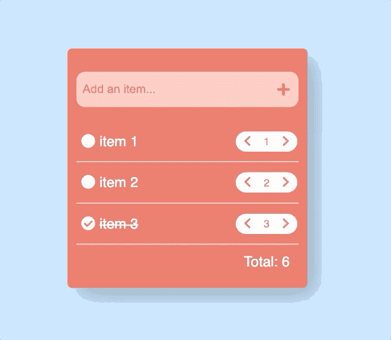

# 如何使用 React 挂钩创建购物清单(带起始代码和视频演练)

> 原文：<https://www.freecodecamp.org/news/how-to-build-a-shopping-list-using-react-hooks-w-starter-code-and-video-walkthrough/>

## 我们正在建造的东西

在这个初学者 React 教程中，我们将构建一个购物应用程序。我们将使用复杂的状态对象，更新部分状态，并使用现有状态计算新状态。

请点击这里查看:



## 你自己试试

如果你想自己先试一试，这里有一些场景(你也可以在下面找到启动代码):

*   用户应该能够通过在输入中键入并单击“+”符号向列表中添加新项目
*   用户应该能够增加/减少特定项目的数量
*   总计应该显示列表中所有项目的总数量

## 视频漫游

[https://www.youtube.com/embed/_N6LQd6Y2UY](https://www.youtube.com/embed/_N6LQd6Y2UY)

## 起始代码

[在 GitHub 上点击这里](https://github.com/chrisblakely01/simple-shopping-list)

## 如何显示项目列表

我们要做的第一件事是显示一个项目列表。如果您使用起始代码，您将看到我添加了一个状态对象:

```
const [items, setItems] = useState([]); 
```

我们要用一个对象数组来初始化它。然后我们将使用 map 函数遍历这个列表并显示条目。

将上面一行替换为以下内容:

```
const [items, setItems] = useState([
	{ itemName: 'item 1', quantity: 1, isSelected: false },
	{ itemName: 'item 2', quantity: 3, isSelected: true },
	{ itemName: 'item 3', quantity: 2, isSelected: false },
]); 
```

您会注意到数组中的每一项都是一个**对象**。这个对象代表每一项(或每一行)并保存我们需要显示的内容:

*   项目的名称
*   数量
*   我们将用来显示“勾号”或“空圆圈”的标志

> 我们把这个列表作为一个数组的原因是因为列表会改变。当我们想改变列表时，我们只需在数组中添加或删除内容，React 就会自动为我们更新 UI。

好了，现在我们只需要给我们的 JSX 添加一个 map 函数，循环这个数组，并在 UI 上显示属性。

将**项目列表栏**替换为以下内容:

```
<div className='item-list'>
	{items.map((item, index) => (
		<div className='item-container'>
			<div className='item-name'>
				{item.isSelected ? (
					<>
						<FontAwesomeIcon icon={faCheckCircle} />
						<span className='completed'>{item.itemName}</span>
					</>
				) : (
					<>
						<FontAwesomeIcon icon={faCircle} />
						<span>{item.itemName}</span>
					</>
				)}
			</div>
			<div className='quantity'>
				<button>
					<FontAwesomeIcon icon={faChevronLeft} />
				</button>
				<span> {item.quantity} </span>
				<button>
					<FontAwesomeIcon icon={faChevronRight} />
				</button>
			</div>
		</div>
	))}
</div> 
```

让我们走一遍。

*   我们已经引入了地图功能。它将遍历**项**数组中的项，并为每个**项**显示一串 JSX。记住，map 函数给了我们当前所在的**对象作为变量**，这样我们就可以访问它的属性。

*   我们使用一个三元组来检查**项。isSelected** 变量。如果变量为真，我们显示一个带删除线的勾号。如果值为 false，我们将显示一个“空圆圈”和项目名称。

*   我们还会显示特定商品的数量。

## 如何在状态中存储用户输入的内容

现在我们已经显示了一些项目，我们将让用户向列表中添加一些项目。如果他们不能添加东西，这就不是一个很好的购物清单！

您将在启动代码中看到，我已经包含了一个输入:

```
<div className='add-item-box'>
	<input className='add-item-input' placeholder='Add an item...' />
	<FontAwesomeIcon icon={faPlus} />
</div> 
```

目前，这并没有多大作用。我们需要控制反应，这样我们就可以轻松地处理用户输入的值。

为此，我们将创建一个新的状态值来保存用户输入的值，并且我们将添加一个 **onChange 事件**来更改这个值。

添加一个新的状态对象，并将其初始化为一个空字符串:

```
const [inputValue, setInputValue] = useState(''); 
```

现在在输入中，添加一个**值**和一个 **onChange** 函数，如下所示:

```
<input value={inputValue} onChange={(event) => setInputValue(event.target.value)} className='add-item-input' placeholder='Add an item...' /> 
```

每当用户输入时，就会调用 **onChange** 事件。React 自动为我们传入了**事件**，因此我们可以从中获得用户输入的值。

然后我们获取这个值并调用 **setInputValue** 来设置用户输入的状态。

然后，我们将输入的值设置为存储在**输入值**状态变量中的任何值。

## 如何向列表中添加新项目

现在，将用户输入的值添加到列表中是有意义的。因为我们知道当前的列表，并且我们知道用户输入的内容(我们将所有内容都放在 state 中！)我们要做的就是把这些东西捣碎在一起。

换句话说，我们将把**输入值**添加到**条目**数组中。

首先创建一个新的函数，当用户单击“+”图标时，该函数将被调用:

```
const handleAddButtonClick = () => {
	const newItem = {
		itemName: inputValue,
		quantity: 1,
		isSelected: false,
	};

	const newItems = [...items, newItem];

	setItems(newItems);
	setInputValue('');
}; 
```

这是什么:

*   创建一个名为 **newItem** 的新对象，该对象将被推送到数组中。我们将**项目名称**设置为**输入值**的任意值，我们将**数量**默认为 **1** ，并将**被选择的**布尔值默认为**假**

*   复制现有数组(我们这样做是为了避免状态突变)，并将我们的 **newItem 对象**添加到末尾

*   将新数组推回状态

*   最后，将 **inputValue** 重置为空字符串，以便用户可以键入和添加更多内容

现在我们已经有了一个函数，我们只需要把它连接到我们的按钮上:

```
<FontAwesomeIcon icon={faPlus} onClick={() => handleAddButtonClick()} /> 
```

如果您运行代码，在输入中输入东西，然后单击“加号”图标，它应该会被添加到列表中。呜呜呜。

## 如何切换项目

现在，我们将看看如何切换一个项目，以表明它已被选中。我们知道数组/列表中的每一项都有一个* *isSelected* 变量，所以我们所要做的就是当一项被点击时更新它。

创建一个新函数，如下所示:

```
const toggleComplete = (index) => {
	const newItems = [...items];

	newItems[index].isSelected = !newItems[index].isSelected;

	setItems(newItems);
}; 
```

这将一个**指数**作为参数。这个索引是由 map 函数给我们的，它指出了*在数组中的位置*。

然后，我们使用这个索引从数组中获取对象，并将 **isSelected** 变量设置为与当前值相反的值。

然后，我们将更新后的项目放入状态。这会导致 React 重新呈现组件，并根据 This 标志为每个项目呈现“选中的圆”或“空的圆”(记得我们之前为此编写了 ternery 逻辑)。

为了让这一切工作，我们只需要在用户点击圆圈时调用 **toggleComplete** :

像这样更新 **itemName** div:

```
<div className='item-name' onClick={() => toggleComplete(index)}>
	// ...other code
</div> 
```

注意，我们传入了从 map 函数中获得的索引。这告诉我们当前在数组中的位置。

运行代码，你应该能够“选择”和项目。成功！

## 如何更新数量

我们将采用类似的方法来更新数量。我们将从增加数量开始。像这样添加一个函数:

```
const handleQuantityIncrease = (index) => {
	const newItems = [...items];

	newItems[index].quantity++;

	setItems(newItems);
}; 
```

您会注意到这类似于 **toggleComplete** 函数:

*   我们使用索引从数组中获取项目/对象
*   我们增加数量
*   我们把一切恢复原状

现在我们只需要更新我们的按钮来调用这个函数:

```
<button>
	<FontAwesomeIcon icon={faChevronRight} onClick={() => handleQuantityIncrease(index)} />
</button> 
```

试试这个，你应该能点击“右人字”，数量应该上升。

处理**减少量**将再次类似。像这样创建一个函数:

```
const handleQuantityDecrease = (index) => {
	const newItems = [...items];

	newItems[index].quantity--;

	setItems(newItems);
}; 
```

我们正在做的事情:

*   我们使用索引从数组中获取项目/对象
*   我们减少数量
*   我们把一切恢复原状

## 如何计算总数量

好的，我们的应用看起来不错。我们需要做的最后一件事是更新底部的总数量。

我们要做的第一件事是创建一个状态值。这将用于保存/显示总数量:

```
const [totalItemCount, setTotalItemCount] = useState(6); 
```

我们将把它默认为 **6** ，因为这是初始列表中数量的总和。

接下来，我们将在我们的 JSX 渲染这个:

```
<div className='total'>Total: {totalItemCount}</div> 
```

到目前为止，一切看起来都一样。那是因为我们还没有写任何更新状态的逻辑。我们将创建一个新函数:

```
const calculateTotal = () => {
	const totalItemCount = items.reduce((total, item) => {
		return total + item.quantity;
	}, 0);

	setTotalItemCount(totalItemCount);
}; 
```

这使用了 **reduce** 函数将我们的 items 数组中的所有数量相加。

最后，我们所要做的就是每当用户增加/减少数量，或者添加一个新项目时调用这个函数。像这样更新各自的函数:

```
 const handleAddButtonClick = () => {
    // ...other code
		calculateTotal();
	};

	const handleQuantityIncrease = (index) => {
    // ...other code
		calculateTotal();
	};

	const handleQuantityDecrease = (index) => {
    // ...other code
		calculateTotal();
	}; 
```

继续试着增加/减少数量。您会注意到总量也发生了变化！

## 想要更多项目创意？

为什么不尝试构建一些 React 项目来进一步促进您的学习呢？

每周我都会发送一个新项目给你，让你尝试一个工作示例、起始代码和提示。[订阅，让它直接进入你的收件箱！](https://subscribe.jschris.com)