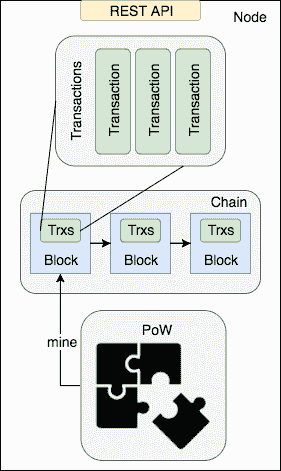
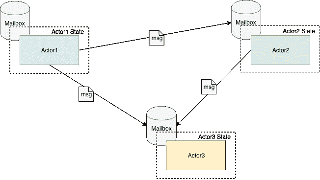
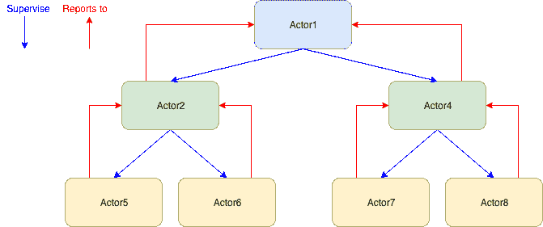

# 如何构建一个简单的基于演员的区块链

> 原文：<https://www.freecodecamp.org/news/how-to-build-a-simple-actor-based-blockchain-aac1e996c177/>

Scalachain 是使用 Scala 编程语言和 actor 模型( [Akka 框架](https://akka.io/))构建的区块链。

在这个故事中，我将展示建立这个简单的区块链原型的开发过程。这意味着项目并不完美，可能会有更好的实现。出于所有这些原因，任何贡献——可能是建议，也可能是 GitHub [库](https://github.com/elleFlorio/scalachain)上的 PR——都是非常受欢迎的！:-)

让我们先简单介绍一下区块链。之后，我们可以定义将要实现的简化模型。

#### **区块链快速介绍**

有很多很好的文章解释了区块链是如何工作的，所以我将做一个高层次的介绍，只是为了给这个项目提供一些背景。

区块链是一个**分布式分类账**:它记录发送方和接收方之间的一些价值交易(如硬币)。区块链与传统数据库的不同之处在于区块链的分散性:它分布在几个通信节点中，这些节点保证了注册事务的有效性。

区块链将事务存储在块中，这些块是由投入计算能力的节点创建的，我们称之为**挖掘的**。每个区块都是通过解决一个很难解决但很容易验证的密码难题而创建的。这样，每一个方块都代表了解决这个难题所需的工作。这就是密码难题被称为**工作证明**的原因:难题的解是证明一个节点花费了一定的工作去解决它并挖掘块。

节点为什么要投入计算能力去挖掘一个区块？因为创建一个新的区块会得到预定数量的硬币奖励。通过这种方式，鼓励节点开采新的区块，为区块链的发展和壮大做出贡献。


Simple blockchain

工作证明的解决方案取决于存储在最后开采的块中的值。这样，每个块都链接到前一个块。这意味着，为了改变被挖掘的块，节点应该再次挖掘被修改的块之上的所有块。因为每个块代表一个工作量，一旦在修改后的块上挖掘出几个块，这个操作就不可行了。这是**分布式** **共识**的基础，所有节点对存储在区块链中的块(即事务)的有效性达成一致。

可能会发生不同的节点同时开采一个区块，从同一个区块链创建不同的“分支”——这在区块链中被称为**分叉**。当一个分支变得比其他分支更长时，这种情况就解决了:最长的链总是获胜，所以获胜的分支成为新的区块链。

#### **区块链模式**

Scalachain 基于区块链模型，该模型是比特币模型的简化。

我们的区块链模型的主要组件是事务、链、工作证明(PoW)算法和节点。事务存储在链的块中，这些块是使用 PoW 挖掘的。该节点是运行区块链的服务器。



Scalachain model

**交易**

交易记录两个实体之间硬币的移动。每笔交易都由发送者、接收者和一定数量的硬币组成。交易将在我们区块链的街区内登记。

**链条**

该链是包含事务列表的块的链表。链中的每个块都有一个索引、验证索引的证据(稍后将详细介绍)、事务列表、前一个块的散列、前一个块的列表和时间戳。每个块都通过其哈希链接到前一个块，这是通过将该块转换为一个`JSON`字符串，然后通过一个`SHA-256`哈希函数对其进行哈希运算来计算的。

**功率**

需要 PoW 算法来挖掘组成区块链的块。这个想法是要解决一个很难解决的密码难题，但是有了证据就很容易验证。Scalachain 中实现的 PoW 算法类似于比特币算法(基于 [Hashcash](https://en.wikipedia.org/wiki/Hashcash) )。它包括寻找具有 N 个前导零的散列，这是从最后一个块的散列和一个数字开始计算的，这是我们算法的证明。

我们可以将其形式化为:

```
NzerosHash = SHA-256(previousNodeHash + proof)
```

N 越高，越难找到证明。在 Scalachain 中 N=4(它最终将是可配置的)。

**节点**

节点是运行我们的区块链的服务器。它提供了一些 REST API 来与它进行交互，并执行一些基本操作，比如发送一个新的事务，获取未决事务的列表，挖掘一个块，以及获取区块链的当前状态。

#### Scala 中的区块链实现

我们将使用 Scala 编程语言实现定义的模型。从高层次来看，我们需要实施区块链的东西有:

*   处理
*   包含事务列表的块链
*   挖掘新块幂算法

这些组件是区块链的重要组成部分。

**交易**

事务是一个非常简单的对象:它有发送者、接收者和值。我们可以将其实现为一个简单的`case class`。

```
case class Transaction(sender: String, recipient: String, value: Long)
```

**链条**

链是我们的区块链的核心:它是包含事务的块的链表。

```
 sealed trait Chain {

  val index: Int
  val hash: String
  val values: List[Transaction]
  val proof: Long
  val timestamp: Long
} 
```

我们首先创建一个代表我们的链块的`sealed trait` 。`Chain` 可以有两种类型:它可以是`EmptyChain` 或`ChainLink`。前者是我们的块零(即 *genesis 块*)，它被实现为一个 singleton(它是一个`case object`)，而后者是一个常规的挖掘块。

```
case class ChainLink(index: Int, proof: Long, values: List[Transaction], previousHash: String = "", tail: Chain = EmptyChain, timestamp: Long = System.currentTimeMillis()) extends Chain {
  val hash = Crypto.sha256Hash(this.toJson.toString)
}

case object EmptyChain extends Chain {
  val index = 0
  val hash = "1"
  val values = Nil
  val proof = 100L
  val timestamp = System.currentTimeMillis()
}
```

让我们更详细地看看我们的链。它提供了一个指数，即区块链的当前高度。有一个列表`Transaction`，验证块的证据，以及块创建的时间戳。哈希值在`EmptyChain`中被设置为缺省值，而在`ChainLink`中，它是通过将对象转换为其`JSON`表示并用一个实用函数对其进行哈希运算来计算的(参见[库](https://github.com/elleFlorio/scalachain)中的`crypto` 包)。`ChainLink`还提供了链中前一个块的散列(块之间的链接)。尾字段是对先前开采的块的引用。这可能不是最有效的解决方案，但它有助于了解区块链在我们的简化实现中如何增长。

我们可以用一些实用程序来改进我们的`Chain`。我们可以给它添加一个*伴随对象*，它定义了一个`apply`方法来创建一个新的链，传递给它一个块列表。伴随对象就像一组“静态方法”——类似于 Java——对类/特征的字段和方法有完全的访问权限。

```
object Chain {
  def apply[T](b: Chain*): Chain = {
    if (b.isEmpty) EmptyChain
    else {
      val link = b.head.asInstanceOf[ChainLink]
      ChainLink(link.index, link.proof, link.values, link.previousHash, apply(b.tail: _*))
    }
  }
}
```

如果块列表是空的，我们简单地用一个`EmptyChain`初始化我们的区块链。否则，我们创建一个新的`ChainLink`,在列表的剩余块上添加 apply 方法的结果作为尾部。以这种方式，按照列表的顺序添加块列表。

如果能够使用简单的加法运算符向我们的链中添加一个新的块就好了，就像我们在`List`中使用的那样。我们可以在`Chain`特征中定义自己的加法运算符`::`。

```
sealed trait Chain {

  val index: Int
  val hash: String
  val values: List[Transaction]
  val proof: Long
  val timestamp: Long

  def ::(link: Chain): Chain = link match {
    case l:ChainLink => ChainLink(l.index, l.proof, l.values, this.hash, this)
    case _ => throw new InvalidParameterException("Cannot add invalid link to chain")
  }
}
```

我们对作为参数传递的块进行模式匹配:如果它是一个有效的`ChainLink`对象，我们将其添加为链的头，将链作为新块的尾，否则我们抛出一个异常。

**功率**

PoW 算法是挖掘新块的基础。我们将其实现为一个简单的算法:

1.  取最后一个块的哈希和一个代表证明的数字。

2.将散列和证明连接成一个字符串。

3.使用`SHA-256`算法散列产生的字符串。

4.检查散列的 4 个前导字符:如果它们是 4 个零，则返回证明。

5.否则重复算法，将证明增加一。

这是比特币区块链中使用的 [HashCash](https://en.wikipedia.org/wiki/Hashcash) 算法的简化。

由于它是递归函数，我们可以将其实现为尾递归函数，以提高资源的利用率。

```
object ProofOfWork {

  def proofOfWork(lastHash: String): Long = {
    @tailrec
    def powHelper(lastHash: String, proof: Long): Long = {
      if (validProof(lastHash, proof))
        proof
      else
        powHelper(lastHash, proof + 1)
    }

    val proof = 0
    powHelper(lastHash, proof)
  }

  def validProof(lastHash: String, proof: Long): Boolean = {
    val guess = (lastHash ++ proof.toString).toJson.toString
    val guessHash = Crypto.sha256Hash(guess)
    (guessHash take 4) == "0000"
  }
}
```

`validProof`函数用于检查我们正在测试的证据是否正确。`powHelper`函数是一个助手函数，它使用尾部递归执行我们的循环，增加每一步的证明。`proofOfWork`函数包装了所有的东西，并由`ProofOfWork`对象公开。

#### 演员模型

actor 模型是为**并发处理**、**可伸缩性**、**容错性**设计的编程模型。该模型定义了组成软件系统的原子元素，即**角色**，以及这些元素之间的交互方式。在这个项目中，我们将使用 Akka 框架在 Scala 中实现的 actor 模型。



Actor Model

**演员**

演员是演员模型的原子单位。它是一个可以发送和接收消息的计算单元。每个演员都有一个内部**私有**状态和一个邮箱。当一个参与者接收并计算一个消息时，它可以以三种方式作出反应:

*   向另一个演员发送消息。
*   改变其内部状态。
*   创造另一个演员。

通信**异步**，邮件从邮箱弹出，串行处理。为了实现消息的并行计算，您需要创建几个参与者。众多演员共同组成了一个**演员体系**。应用程序的行为源于提供不同功能的参与者之间的交互。

**演员独立**

参与者彼此独立，并且不共享他们的内部状态。这一事实有几个重要的后果:

1.演员可以处理消息**而没有副作用**一个接一个。

2.参与者在哪里并不重要——是您的笔记本电脑、服务器还是云中——一旦我们知道了它的地址，我们就可以请求它的服务向它发送消息。

第一点使得并发计算非常容易。我们可以确保一个消息的处理不会干扰另一个消息的处理。为了实现**并发处理**,我们可以部署几个能够处理同类消息的角色。

第二点是关于可扩展性:我们需要更多的计算能力？没问题:我们可以启动一台新机器并部署新的 actor，它们将加入现有的 actor 系统。他们的邮箱地址将被现有的参与者发现，这些参与者将开始与他们通信。

**演员被监督**

正如我们在对演员的描述中所说的，对一个消息的可能反应之一是创造其他演员。当这种情况发生时，父亲就成了孩子的*监督人*。如果一个孩子失败了，主管可以决定采取什么行动，可能是创建一个新的演员，忽略失败，或者把它扔给自己的主管。这样，Actor 系统就变成了一个层次树，每个节点管理其子节点。这就是演员模型提供**容错**的方式。



Actor hierarchy

#### 经纪人，单纯的演员

我们要实现的第一个角色是代理角色:它是我们的区块链的事务管理器。它的职责是添加新的事务，以及检索未决事务。

Broker Actor 对 Broker 类的`companion object`中定义的三种消息做出反应:

```
 object Broker {
  sealed trait BrokerMessage
  case class AddTransaction(transaction: Transaction) extends BrokerMessage
  case object GetTransactions extends BrokerMessage
  case object Clear extends BrokerMessage

  val props: Props = Props(new Broker)
}
```

我们创建一个特征`BrokerMessage`来标识代理参与者的消息。每一个其他的消息将扩展这个特性。`AddTransaction`向待定事务列表中添加新事务。`GetTransaction`检索未决事务，`Clear`清空列表。`props`值用于在创建 actor 时初始化它。

```
class Broker extends Actor with ActorLogging {
  import Broker._

  var pending: List[Transaction] = List()

  override def receive: Receive = {
    case AddTransaction(transaction) => {
      pending = transaction :: pending
      log.info(s"Added $transaction to pending Transaction")
    }
    case GetTransactions => {
      log.info(s"Getting pending transactions")
      sender() ! pending
    }
    case Clear => {
      pending = List()
      log.info("Clear pending transaction List")
    }
  }
}
```

代理`class`包含对不同消息做出反应的业务逻辑。细节我就不赘述了，因为很琐碎。最有趣的事情是我们如何响应挂起事务的请求。我们使用`tell` ( `!`)操作符将它们发送到`GetTransaction`消息的`sender()`。这个操作符的意思是“发送消息，不要等待响应”——也就是“一劳永逸”。

#### 矿工，不同状态的演员

矿工演员是为我们区块链挖掘新街区的人。由于我们不希望在开采另一个区块的同时开采一个新的区块，因此 Miner Actor 将有两种状态:`ready`，当它准备好开采一个新的区块时，和`busy`，当它正在开采一个区块时。

让我们从用 Miner Actor 的消息定义`companion object`开始。模式是相同的，有一个密封的特征——`MinerMessage`——用来定义这个参与者对哪种消息做出反应。

```
object Miner {
  sealed trait MinerMessage
  case class Validate(hash: String, proof: Long) extends MinerMessage
  case class Mine(hash: String) extends MinerMessage
  case object Ready extends MinerMessage

  val props: Props = Props(new Miner)
}
```

`Validate`消息要求验证一个证据，并将散列和证据传递给挖掘器进行检查。因为这个组件是与 PoW 算法交互的组件，所以执行这个检查是它的职责。`Mine`消息要求从指定的散列开始挖掘。最后一条消息`Ready`，触发了一个状态转换。

**同一个演员，不同的状态**

这个 actor 的特点是它根据自己的状态对消息做出反应:`busy`或`ready`。让我们分析一下行为上的区别:

*   **忙碌**:矿工正忙着开采一个区块。如果一个新的采矿请求来了，它应该拒绝它。如果请求准备就绪，采矿机应将其状态更改为就绪状态。
*   **就绪**:矿工空闲。如果一个挖掘请求到来，它应该开始挖掘一个新的块。如果要求它准备好，它应该说:“好的，我准备好了！”
*   **both** :无论是在就绪状态还是忙碌状态，挖掘器都应该随时可以验证证据的正确性。

看看我们如何在代码中实现这个逻辑。我们从定义常见行为开始，即验证一个证据。

我们定义一个函数`validate`来响应`Validate`消息:如果证据有效，我们用成功来响应发送者，否则用失败来响应。`ready`和`busy`状态被定义为对`validate`状态进行“扩展”的函数，因为这是我们在这两种状态中都想要的行为。

```
def validate: Receive = {
    case Validate(hash, proof) => {
      log.info(s"Validating proof $proof")
      if (ProofOfWork.validProof(hash, proof)){
        log.info("proof is valid!")
        sender() ! Success
      }
      else{
        log.info("proof is not valid")
        sender() ! Failure(new InvalidProofException(hash, proof))
      }
    }
  }
```

这里需要强调几件事。

1.使用 Akka 框架提供的`become`函数触发状态转换。它将返回一个`Receive`对象的函数作为参数，就像我们为`validation`、`busy`和`ready`状态定义的对象一样。

2.当挖掘器收到一个挖掘请求时，它用一个包含 PoW 算法执行的`Future`来响应。通过这种方式，我们可以异步工作，让挖掘器可以自由地做其他任务，比如验证任务。

3.这个演员的**主管**控制状态转换。这种选择的原因是矿工不知道系统的状态。它不知道`Future`中的挖掘计算何时完成，也不知道它正在挖掘的块是否已经从另一个节点挖掘过。这将需要停止挖掘当前散列，并开始挖掘新块的散列。

最后一件事是提供一个覆盖`receive`函数的初始状态。

```
override def receive: Receive = {
    case Ready => become(ready)
  }
```

我们开始等待一个`Ready`消息。当它来了，我们开始我们的矿工。

#### 区块链，一个执着的演员

区块链参与者与区块链的商业逻辑互动。它可以向区块链添加新的块，并且可以检索关于区块链的状态的信息。这位演员还有另一个超能力:它可以让 T2 继续存在，并恢复区块链的国家地位。实现 Akka 框架提供的`PersistentActor`特征是可能的。

```
object Blockchain {
  sealed trait BlockchainEvent
  case class AddBlockEvent(transactions: List[Transaction], proof: Long) extends BlockchainEvent

  sealed trait BlockchainCommand
  case class AddBlockCommand(transactions: List[Transaction], proof: Long) extends BlockchainCommand
  case object GetChain extends BlockchainCommand
  case object GetLastHash extends BlockchainCommand
  case object GetLastIndex extends BlockchainCommand

  case class State(chain: Chain)

  def props(chain: Chain, nodeId: String): Props = Props(new Blockchain(chain, nodeId))
}
view raw
```

我们可以看到，这个演员的`companion object`比其他演员有更多的元素。`State`类是我们存储区块链状态的地方，也就是它的`Chain`。其思想是每次创建新块时更新状态。

为此，有两种不同的特质:`BlockchainEvent`和`BlockchainCommand`。前者用于处理将触发持久性逻辑的事件，后者用于向参与者发送直接命令。`AddBlockEvent`消息是将更新我们状态的事件。`AddBlockCommand`、`GetChain`、`GetLastHash`和`LastIndex`命令是用于与底层区块链交互的命令。

通常的`props`函数用 Scalachain 节点的首字母`Chain`和`nodeId`初始化区块链 Actor。

```
class Blockchain(chain: Chain, nodeId: String) extends PersistentActor with ActorLogging{
  import Blockchain._

  var state = State(chain)

  override def persistenceId: String = s"chainer-$nodeId"

  //Code...
}
```

区块链 Actor 扩展了 Akka 框架提供的 trait `PersistentActor`。这样，我们就有了保持和恢复状态所需的现成的所有逻辑。

我们使用创建时作为参数提供的`Chain`来初始化状态。`nodeId`是我们覆盖的`persistenceId`的一部分。持久逻辑将使用它来标识持久状态。因为我们可以在同一台机器上运行多个 Scalachain 节点，所以我们需要这个值来正确地持久化和恢复每个节点的状态。

```
def updateState(event: BlockchainEvent) = event match {
    case AddBlockEvent(transactions, proof) =>
      {
        state = State(ChainLink(state.chain.index + 1, proof, transactions) :: state.chain)
        log.info(s"Added block ${state.chain.index} containing ${transactions.size} transactions")
      }
  }
```

当接收到`AddBlockEvent`时，`updateState`函数执行 Actor 状态的更新。

```
override def receiveRecover: Receive = {
    case SnapshotOffer(metadata, snapshot: State) => {
      log.info(s"Recovering from snapshot ${metadata.sequenceNr} at block ${snapshot.chain.index}")
      state = snapshot
    }
    case RecoveryCompleted => log.info("Recovery completed")
    case evt: AddBlockEvent => updateState(evt)
  }
```

`receiveRecover`函数对持久性逻辑发送的恢复消息做出反应。在创建演员期间，可以使用`SnapshotOffer`消息向其提供持久状态(**快照**)。在这种情况下，当前状态成为快照提供的状态。

`RecoveryCompleted`消息通知我们恢复过程已成功完成。`AddBlockEvent`触发`updateState`函数，传递事件本身。

```
override def receiveCommand: Receive = {
    case SaveSnapshotSuccess(metadata) => log.info(s"Snapshot ${metadata.sequenceNr} saved successfully")
    case SaveSnapshotFailure(metadata, reason) => log.error(s"Error saving snapshot ${metadata.sequenceNr}: ${reason.getMessage}")
    case AddBlockCommand(transactions : List[Transaction], proof: Long) => {
      persist(AddBlockEvent(transactions, proof)) {event =>
        updateState(event)
      }

      // This is a workaround to wait until the state is persisted
      deferAsync(Nil) { _ =>
        saveSnapshot(state)
        sender() ! state.chain.index
      }
    }
    case AddBlockCommand(_, _) => log.error("invalid add block command")
    case GetChain => sender() ! state.chain
    case GetLastHash => sender() ! state.chain.hash
    case GetLastIndex => sender() ! state.chain.index
  }
```

`receiveCommand`函数用于对发送给演员的直接命令做出反应。让我们跳过`GetChain`、`GetLastHash`和`GetLastIndex`命令，因为它们很琐碎。`AddBlockCommand`是有趣的部分:它创建并触发一个`AddBlock`事件，该事件保存在参与者的事件日志中。通过这种方式，在恢复时可以重放事件。

`deferAsync`函数等待，直到事件处理后状态更新。一旦事件被执行，actor 可以保存状态的快照，并用更新后的最后一个`Chain`索引通知消息的发送者。`SaveSnapshotSucces`和`SaveSnapshotFailure`消息帮助我们跟踪可能的故障。

#### 节点，一个演员来统治他们所有人

节点 Actor 是我们 Scalachain 节点的主干。它是所有其他参与者(经纪人、矿工和区块链)的**监管人**，也是通过 REST API 与外界通信的人。

```
object Node {

  sealed trait NodeMessage

  case class AddTransaction(transaction: Transaction) extends NodeMessage

  case class CheckPowSolution(solution: Long) extends NodeMessage

  case class AddBlock(proof: Long) extends NodeMessage

  case object GetTransactions extends NodeMessage

  case object Mine extends NodeMessage

  case object StopMining extends NodeMessage

  case object GetStatus extends NodeMessage

  case object GetLastBlockIndex extends NodeMessage

  case object GetLastBlockHash extends NodeMessage

  def props(nodeId: String): Props = Props(new Node(nodeId))

  def createCoinbaseTransaction(nodeId: String) = Transaction("coinbase", nodeId, 100)
}
```

节点参与者必须处理来自 REST API 的所有高层消息。这就是为什么我们在`companion object`中发现或多或少与我们在儿童演员中实现的信息相同的原因。props 函数接受一个 nodeId 作为参数来创建我们的节点 Actor。这将是用于区块链 Actor 初始化的一个。`createCoinbaseTransaction`只是创建一个事务，将预定义的硬币数量分配给节点本身。这将是成功开采区块链新区块的**奖励**。

```
class Node(nodeId: String) extends Actor with ActorLogging {

  import Node._

  implicit lazy val timeout = Timeout(5.seconds)

  val broker = context.actorOf(Broker.props)
  val miner = context.actorOf(Miner.props)
  val blockchain = context.actorOf(Blockchain.props(EmptyChain, nodeId))

  miner ! Ready

  //Code...
}
```

让我们看看节点 Actor 的初始化。超时值由`ask` ( `?`)操作符使用(稍后将对此进行解释)。我们所有的角色都是在角色`context`中创建的，使用的是我们在每个角色中定义的`props`函数。

区块链 Actor 用节点的`EmptyChain`和`nodeId`初始化。一旦所有东西都创建好了，我们通知矿工演员准备开矿，给它发送一个`Ready`消息。好了，我们现在准备接收一些消息并对其做出反应。

```
override def receive: Receive = {
    case AddTransaction(transaction) => {
      //Code...
    }
    case CheckPowSolution(solution) => {
      //Code...
    }
    case AddBlock(proof) => {
      //Code...
    }
    case Mine => {
      //Code...
    }
    case GetTransactions => broker forward Broker.GetTransactions
    case GetStatus => blockchain forward GetChain
    case GetLastBlockIndex => blockchain forward GetLastIndex
    case GetLastBlockHash => blockchain forward GetLastHash
  }
```

这是我们应该覆盖的常用`receive`函数的概述。后面我会分析最复杂的`case` s 的逻辑，现在我们来看最后四个。在这里，我们将消息转发给区块链参与者，因为它不需要任何处理。使用`forward`操作符，消息的`sender()`将是发起消息的那个，而不是节点参与者。通过这种方式，区块链参与者将响应消息的原始发送者(REST API 层)。

```
override def receive: Receive = {
    case AddTransaction(transaction) => {
      val node = sender()
      broker ! Broker.AddTransaction(transaction)
      (blockchain ? GetLastIndex).mapTo[Int] onComplete {
        case Success(index) => node ! (index + 1)
        case Failure(e) => node ! akka.actor.Status.Failure(e)
      }
    }

  //Code...
}
```

`AddTransaction`消息触发逻辑将一个新事务存储在我们的区块链的未决事务列表中。节点参与者用包含事务的块的`index`来响应。

首先，我们将消息的`sender()`的“地址”存储在一个`node`值中，以便以后使用。我们向 Broker Actor 发送添加新交易的消息，然后我们向 Blockchain Actor 发送链的最后一个索引`ask`。`ask`操作符——用`?`表示的操作符——用于向参与者发送消息并等待响应。响应(映射到`Int`值)可以是`Success`或`Failure`。

在第一种情况下，我们向发送者(`node`)发回`index+1`，因为它将是下一个挖掘块的索引。如果失败，我们用一个包含失败原因的`Failure`来响应发送者。记住这个模式:

**询问→等待回应→处理成功/失败**

因为我们会再次看到它。

```
override def receive: Receive = {
    //Code...

    case CheckPowSolution(solution) => {
      val node = sender()
      (blockchain ? GetLastHash).mapTo[String] onComplete {
        case Success(hash: String) => miner.tell(Validate(hash, solution), node)
        case Failure(e) => node ! akka.actor.Status.Failure(e)
      }
    }

  //Code...
}
view raw
```

这一次我们必须检查 PoW 算法的解是否正确。我们向区块链参与者询问最后一个区块的哈希，并告诉挖掘者参与者根据哈希验证解决方案。在`tell`函数中，我们将`Validate`消息和发送者的地址一起传递给挖掘者，这样挖掘者就可以直接响应它。这是另一种方法，就像我们之前看到的`forward`方法。

```
override def receive: Receive = {
    //Code...

    case AddBlock(proof) => {
      val node = sender()
      (self ? CheckPowSolution(proof)) onComplete {
        case Success(_) => {
          (broker ? Broker.GetTransactions).mapTo[List[Transaction]] onComplete {
            case Success(transactions) => blockchain.tell(AddBlockCommand(transactions, proof), node)
            case Failure(e) => node ! akka.actor.Status.Failure(e)
          }
          broker ! Clear
        }
        case Failure(e) => node ! akka.actor.Status.Failure(e)
      }
    }

    //Code...
}
```

其他节点可以挖掘块，因此我们可能会收到一个添加我们没有挖掘的块的请求。证据足以添加新块，因为我们假设所有节点共享相同的未决事务列表。

```
override def receive: Receive = {
    //Code...

    case Mine => {
      val node = sender()
      (blockchain ? GetLastHash).mapTo[String] onComplete {
        case Success(hash) => (miner ? Miner.Mine(hash)).mapTo[Future[Long]] onComplete {
          case Success(solution) => waitForSolution(solution)
          case Failure(e) => log.error(s"Error finding PoW solution: ${e.getMessage}")
        }
        case Failure(e) => node ! akka.actor.Status.Failure(e)
      }
    }

    //Code...
  }

  def waitForSolution(solution: Future[Long]) = Future {
    solution onComplete {
      case Success(proof) => {
        broker ! Broker.AddTransaction(createCoinbaseTransaction(nodeId))
        self ! AddBlock(proof)
        miner ! Ready
      }
      case Failure(e) => log.error(s"Error finding PoW solution: ${e.getMessage}")
    }
  }
```

这是一种简化，在比特币网络中不可能有这样的假设。首先，我们应该检查解决方案是否有效。我们这样做是向节点本身发送消息:`self ? CheckPowSolution(proof)`。如果证明是有效的，我们从 Broker Actor 获得未决交易的列表，然后我们向 Blockchain Actor 添加一个包含交易和已验证证明的新块。最后要做的事情是命令 Broker Actor 清除挂起事务的列表。

最后一条消息是开始开采新区块的请求。我们需要链中最后一个块的散列，所以我们向块链参与者请求它。一旦我们有了散列，我们就可以开始挖掘新的块。

PoW 算法是一个长时间运行的操作，所以 Miner Actor 立即用一个包含计算的`Future`来响应。`waitForSolution`函数等待计算完成，而节点 Actor 继续做它的事情。

当我们有一个解决方案时，我们奖励自己将 **coinbase 事务**添加到未决事务列表中。然后，我们将新块添加到链中，并告诉矿工演员准备好开采另一块。

#### 带有 Akka HTTP 的 REST API

最后一节描述了服务器和 REST API。这是我们应用程序最“外部”的部分，是连接外部世界和 Scalachain 节点的部分。我们将利用 Akka HTTP 库，它是 Akka 框架的一部分。让我们开始看看服务器，我们的应用程序的入口点。

```
object Server extends App with NodeRoutes {

  val address = if (args.length > 0) args(0) else "localhost"
  val port = if (args.length > 1) args(1).toInt else 8080

  implicit val system: ActorSystem = ActorSystem("scalachain")

  implicit val materializer: ActorMaterializer = ActorMaterializer()

  val node: ActorRef = system.actorOf(Node.props("scalaChainNode0"))

  lazy val routes: Route = statusRoutes ~ transactionRoutes ~ mineRoutes

  Http().bindAndHandle(routes, address, port)

  println(s"Server online at http://$address:$port/")

  Await.result(system.whenTerminated, Duration.Inf)

}
```

由于`Server`是我们的入口点，它需要扩展`App`特征。它还扩展了`NodeRoutes`，这是一个包含所有到节点不同端点的 http 路由的特征。

`system`值是我们存储`ActorSystem`的地方。在这个系统中创建的每个演员都能够与系统中的其他人交谈。Akka HTTP 还需要定义另一个值，即`ActorMaterializer`。这与 Akka Streams 模块有关，但由于 Akka HTTP 是建立在它之上的，我们仍然需要在我们的服务器中初始化这个对象(如果你想深入了解与 Streams 的关系，请看这里的)。

节点 Actor 是与节点的 HTTP 路由一起创建的，它们使用`~`操作符链接在一起。现在不要担心路线，我们一会儿就回来。

最后要做的是使用函数`Http().bindHandle`启动我们的服务器，这也将绑定我们作为参数传递给它的路由。`Await.result`功能将等待终止信号来停止服务器。

如果没有触发应用程序业务逻辑的路由，服务器将毫无用处。我们在特征`NodeRoutes`中定义路径，根据它们触发的不同逻辑来区分它们:

*   `statusRoutes`包含向 Scalachain 节点询问其状态的端点。
*   处理与交易相关的一切事务。
*   `mineRoutes`有端点开始挖掘过程

请注意，这种区分是逻辑上的，只是为了保持有序和可读性。这三条路由在服务器中初始化后将被链接成一条。

```
//Imports...
import com.elleflorio.scalachain.utils.JsonSupport._
// Imports...

trait NodeRoutes extends SprayJsonSupport {

  implicit def system: ActorSystem

  def node: ActorRef

  implicit lazy val timeout = Timeout(5.seconds)

  //Code...
}
```

特征`NodeRoutes`扩展了`SprayJsonSupport`来添加`JSON`序列化/反序列化。 [SprayJson](https://github.com/spray/spray-json) 是一个类似 Java 中 Jackson 的 Scala 库，Akka HTTP 免费提供。

为了将我们的对象转换成 JSON 字符串，我们导入了在`utils`包中定义的类`JsonSupport`，它包含了每个对象的自定义读取器/写入器。我就不赘述了，如果你想看实现的话，可以在资源库中找到[类](https://github.com/elleFlorio/scalachain/blob/master/src/main/scala/com/elleflorio/scalachain/utils/JsonSupport.scala)。

我们有几个隐含的值。`ActorSystem`用于定义参与者系统，而`Timeout`由等待参与者响应的`OnSuccess`函数使用。`ActorRef`是通过在服务器实现中覆盖来定义的。

```
//Code...

lazy val statusRoutes: Route = pathPrefix("status") {
    concat(
      pathEnd {
        concat(
          get {
            val statusFuture: Future[Chain] = (node ? GetStatus).mapTo[Chain]
            onSuccess(statusFuture) { status =>
              complete(StatusCodes.OK, status)
            }
          }
        )
      }
    )
  }

//Code...
```

获取区块链状态的端点在 statusRoutes 中定义。我们将 pathPrefix 定义为“status”，因此节点将响应路径` http://

:

```
//Code...

lazy val transactionRoutes: Route = pathPrefix("transactions") {
    concat(
      pathEnd {
        concat(
          get {
            val transactionsRetrieved: Future[List[Transaction]] =
              (node ? GetTransactions).mapTo[List[Transaction]]
            onSuccess(transactionsRetrieved) { transactions =>
              complete(transactions.toList)
            }
          },
          post {
            entity(as[Transaction]) { transaction =>
              val transactionCreated: Future[Int] =
                (node ? AddTransaction(transaction)).mapTo[Int]
              onSuccess(transactionCreated) { done =>
                complete((StatusCodes.Created, done.toString))
              }
            }
          }
        )
      }
    )
  }

//Code...
```

`transactionRoutes`允许与节点的未决事务进行交互。我们定义 HTTP 动作`get`来检索未决事务的列表。这一次，我们还定义了 HTTP 动作`post`,将新事务添加到待定事务列表中。`entity(as[Transaction])`函数用于将`JSON`主体反序列化为`Transaction`对象。

```
//Code...
lazy val mineRoutes: Route = pathPrefix("mine") {
    concat(
      pathEnd {
        concat(
          get {
            node ! Mine
            complete(StatusCodes.OK)
          }
        )
      }
    )
  }

//Code...
```

最后一条路线是`MineRoutes`。这是一个非常简单的命令，仅用于请求 Scalachain 节点开始挖掘一个新的块。我们定义了一个`get`动作，因为我们不需要发送任何东西来开始挖掘过程。它不需要等待响应，因为这可能需要一些时间，所以我们立即用一个`Ok`状态来响应。

与 Scalachain 节点交互的 API 记录在[这里](https://documenter.getpostman.com/view/4636741/RWaHw8yx)。

#### 结论

在最后一部分，我们结束了我们在 Scalachain 的游览。这个区块链的原型离真正的实现还差得很远，但是我们学到了很多有趣的东西:

*   区块链是如何工作的，至少从高层次的角度来看是这样的。
*   如何使用函数式编程(Scala)构建区块链？
*   Actor 模型如何工作，以及它在我们使用 Akka 框架的用例中的应用。
*   如何使用 Akka HTTP 库创建一个运行我们的区块链的服务器，以及与之交互的 API。

代码并不完美，有些东西可以用更好的方式实现。因此，**请随意为项目做贡献！**；-)