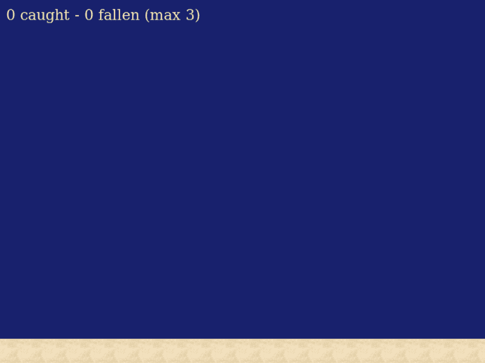
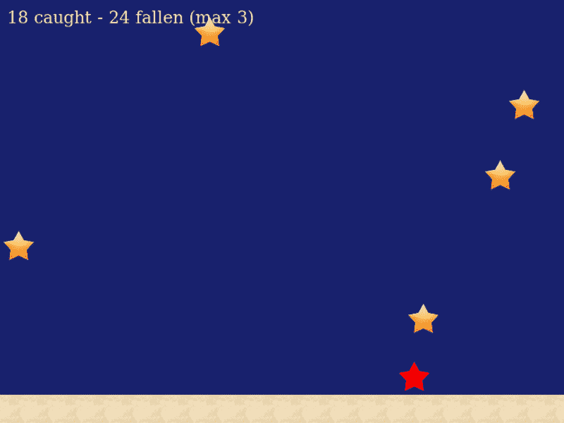

# 如何用 Phaser 3 和 TypeScript 在浏览器中构建一个简单的游戏

> 原文：<https://www.freecodecamp.org/news/how-to-build-a-simple-game-in-the-browser-with-phaser-3-and-typescript-bdc94719135/>

我是一个开发者拥护者，也是一个后端开发者，我的前端开发专业知识相对薄弱。前一阵子我想找点乐子，在浏览器里做个游戏；我选择 Phaser 3 作为框架(这几天看起来相当流行)，选择 TypeScript 作为语言(因为相比动态，我更喜欢静态类型)。原来你需要做一些无聊的事情来让它工作，所以我写了这篇教程来帮助像我一样的其他人更快地开始。

### 准备环境

#### 集成驱动电子设备

选择您的开发环境。如果你愿意，你可以一直使用普通的旧记事本，但是我建议使用更有用的东西。对于我来说，我更喜欢在 Emacs 中开发宠物项目，因此我安装了 [tide](https://github.com/ananthakumaran/tide) 并按照说明进行设置。

#### 结节

如果我们是在 JavaScript 上开发，我们完全可以在没有所有这些准备步骤的情况下开始编码。然而，当我们想要使用 TypeScript 时，我们必须建立基础设施以使未来的开发尽可能快。因此，我们需要安装节点和 npm。

在我写这篇教程的时候，我使用了[节点 10.13.0](https://nodejs.org/en/) 和 [npm 6.4.1](https://www.npmjs.com/) 。请注意，前端世界中的版本更新极快，所以您只需使用最新的稳定版本。我强烈推荐使用 [nvm](https://github.com/creationix/nvm) 而不是手动安装 node 和 npm 这会节省你很多时间和精力。

### 设置项目

#### 项目结构

我们将使用 npm 来构建项目，因此要启动项目，请转到一个空文件夹并运行`npm init`。npm 会问你几个关于项目属性的问题，然后创建一个`package.json`文件。它看起来会像这样:

```
{
  "name": "Starfall",
  "version": "0.1.0",
  "description": "Starfall game (Phaser 3 + TypeScript)",
  "main": "index.js",
  "scripts": {
    "test": "echo \"Error: no test specified\" && exit 1"
  },
  "author": "Mariya Davydova",
  "license": "MIT"
}
```

#### 包装

使用以下命令安装我们需要的软件包:

`npm install -D typescript webpack webpack-cli ts-loader phaser live-server`

`-D`选项(又名`--save-dev`)使 npm 自动将这些包添加到`package.json`中的依赖项列表中:

```
"devDependencies": {
   "live-server": "^1.2.1",
   "phaser": "^3.15.1",
   "ts-loader": "^5.3.0",
   "typescript": "^3.1.6",
   "webpack": "^4.26.0",
   "webpack-cli": "^3.1.2"
 }
```

#### 网络包

Webpack 将运行 TypeScript 编译器，并将生成的 JS 文件和库收集到一个缩小的 JS 中，以便我们可以将它包含在我们的页面中。

在您的`project.json`附近添加`webpack.config.js`:

```
const path = require('path');
module.exports = {
  entry: './src/app.ts',
  module: {
    rules: [
      {
        test: /\.tsx?$/,
        use: 'ts-loader',
        exclude: /node_modules/
      }
    ]
  },
  resolve: {
    extensions: [ '.ts', '.tsx', '.js' ]
  },
  output: {
    filename: 'app.js',
    path: path.resolve(__dirname, 'dist')
  },
  mode: 'development'
};
```

在这里，我们看到 webpack 必须从`src/app.ts`开始获取源代码(我们很快就会添加它)并收集`dist/app.js`文件中的所有内容。

#### 以打字打的文件

我们还需要一个用于 TypeScript 编译器的小配置文件(`tsconfig.json`)，其中我们解释了我们希望源代码被编译到哪个 JS 版本，以及在哪里可以找到这些源代码:

```
{
  "compilerOptions": {
    "target": "es5"
  },
  "include": [
    "src/*"
  ]
}
```

#### 类型脚本定义

TypeScript 是一种静态类型语言。因此，编译需要类型定义。在撰写本教程时，Phaser 3 的定义还没有作为 npm 包提供，所以您可能需要从官方资源库[下载它们](https://github.com/photonstorm/phaser3-docs/blob/master/typescript/phaser.d.ts)，并将文件放在项目的`src`子目录中。

#### 剧本

我们几乎已经完成了项目设置。这时你应该已经创建了`package.json`、`webpack.config.js`、`tsconfig.json`，并添加了`src/phaser.d.ts`。在开始编写代码之前，我们需要做的最后一件事是解释 npm 与项目到底有什么关系。我们更新`package.json`的`scripts`部分如下:

```
"scripts": {
  "build": "webpack",
  "start": "webpack --watch & live-server --port=8085"
}
```

当您执行`npm build`时，`app.js`文件将根据 webpack 配置构建。当你运行`npm start`时，你不必担心构建过程:只要你保存任何源代码，webpack 就会重新构建应用程序，[实时服务器](https://www.npmjs.com/package/live-server)会在你的默认浏览器中重新加载它。app 将托管在 [http://127.0.0.1:8085/](http://127.0.0.1:8085/) 。

### 入门指南

现在我们已经建立了基础设施(这是我个人在开始一个项目时最讨厌的部分)，我们终于可以开始编码了。在这一步中，我们将做一件简单的事情:在浏览器窗口中绘制一个深蓝色的矩形。为此使用一个大的游戏开发框架有点……嗯……矫枉过正。尽管如此，我们在接下来的步骤中仍然需要它。

让我简单解释一下 Phaser 3 的主要概念。游戏是`Phaser.Game`类(或其后代)的一个实例。每个游戏包含一个或多个`Phaser.Scene`后代的实例。每个场景包含几个静态或动态的对象，并代表游戏的一个逻辑部分。例如，我们的琐碎游戏将有三个场景:欢迎屏幕、游戏本身和分数屏幕。

开始编码吧。

首先，为游戏创建一个极简的 HTML 容器。制作一个`index.html` 文件，其中包含以下代码:

```
<!DOCTYPE html>
<html>
  <head>
    <title>Starfall</title>
    <script src="dist/app.js"></script>
  </head>
  <body>
    <div id="game"></div>
  </body>
</html>
```

这里只有两个必要的部分:第一个是一个`script`条目，它表示我们将在这里使用我们构建的文件，第二个是一个`div` 条目，它将是游戏容器。

现在用下面的代码创建一个文件`src/app.ts`:

```
import "phaser";
const config: GameConfig = {
  title: "Starfall",
  width: 800,
  height: 600,
  parent: "game"
  backgroundColor: "#18216D"
};
export class StarfallGame extends Phaser.Game {
  constructor(config: GameConfig) {
    super(config);
  }
}
window.onload = () => {
  var game = new StarfallGame(config);
};
```

这段代码是不言自明的。GameConfig 有很多各种各样的属性，你可以在这里查看。

现在你终于可以运行`npm start`了。如果这一步和前面的步骤都做得正确，您应该会在浏览器中看到如下简单的内容:


Yes, this is a blue screen.

### 让星星坠落

我们已经创建了一个基本的应用程序。现在是时候添加一个将要发生事情的场景了。我们的游戏会很简单:星星会掉到地上，目标是抓住尽可能多的星星。

为了实现这个目标，创建一个新文件`gameScene.ts`，并添加以下代码:

```
import "phaser";
export class GameScene extends Phaser.Scene {
constructor() {
    super({
      key: "GameScene"
    });
  }
init(params): void {
    // TODO
  }
preload(): void {
    // TODO
  }

  create(): void {
    // TODO
  }
update(time): void {
    // TODO
  }
};
```

这里的构造函数包含一个键，在这个键下其他场景可以调用这个场景。

你可以在这里看到四个方法的存根。让我简单解释一下这两者的区别:

*   `init([params])`场景开始时调用；该函数可以接受通过调用`scene.start(key, [params])`从其他场景或游戏传递的参数
*   `preload()`在场景对象创建前被调用，包含加载资产；这些资源被缓存，因此当场景重新启动时，它们不会被重新加载
*   当资产被加载时被调用，通常包含主要游戏对象(背景、玩家、障碍、敌人等)的创建。)
*   被称为“每一个节拍”,包含场景的动态部分——所有移动的、闪烁的等等。

为了确保我们以后不会忘记它，让我们在`game.ts`中快速添加以下几行:

```
import "phaser";
import { GameScene } from "./gameScene";
const config: GameConfig = {
  title: "Starfall",
  width: 800,
  height: 600,
  parent: "game",
  scene: [GameScene],
  physics: {
    default: "arcade",
    arcade: {
      debug: false
    }
  },
  backgroundColor: "#000033"
};
...
```

我们的游戏现在知道了游戏场景。如果游戏配置包含一个场景列表，那么第一个场景会在游戏开始时启动，所有其他的场景都会被创建，但直到被显式调用才会启动。

我们还在这里添加了街机物理。它需要让我们的星星坠落。

现在我们可以在游戏场景的骨骼上添加肉了。

首先，我们声明一些我们需要的属性和对象:

```
export class GameScene extends Phaser.Scene {
  delta: number;
  lastStarTime: number;
  starsCaught: number;
  starsFallen: number;
  sand: Phaser.Physics.Arcade.StaticGroup;
  info: Phaser.GameObjects.Text;
...
```

然后，我们初始化数字:

```
init(/*params: any*/): void {
    this.delta = 1000;
    this.lastStarTime = 0;
    this.starsCaught = 0;
    this.starsFallen = 0;
  }
```

现在，我们加载一些图像:

```
preload(): void {
    this.load.setBaseURL(
      "https://raw.githubusercontent.com/mariyadavydova/" +
      "starfall-phaser3-typescript/master/");
    this.load.image("star", "assets/star.png");
    this.load.image("sand", "assets/sand.jpg");
  }
```

之后，我们就可以准备静态组件了。我们将创建星星落下的地面，以及通知我们当前分数的文本:

```
create(): void {
    this.sand = this.physics.add.staticGroup({
      key: 'sand',
      frameQuantity: 20
    });
    Phaser.Actions.PlaceOnLine(this.sand.getChildren(),
      new Phaser.Geom.Line(20, 580, 820, 580));
    this.sand.refresh();
this.info = this.add.text(10, 10, '',
      { font: '24px Arial Bold', fill: '#FBFBAC' });
  }
```

Phaser 3 中的群组是创建一组您想要一起控制的对象的一种方式。有两种类型的对象:静态和动态。正如你所猜测的，静态物体不会移动(地面，墙壁，各种障碍)，而动态物体会完成这项工作(马里奥，船只，导弹)。

我们创建了一组静态的地面碎片。这些棋子沿着线摆放。请注意，这条线被分成 20 个相等的部分(而不是你所期望的 19 个)，地面瓷砖放置在每个部分的左端，瓷砖中心位于该点(我希望这可以解释这些数字)。我们还必须调用`refresh()`来更新组边界框(否则，将根据默认位置检查碰撞，默认位置是场景的左上角)。

如果您现在在浏览器中签出您的应用程序，您应该会看到类似这样的内容:



Blue screen evolution

我们终于到达了这个场景中最有活力的部分——`update()`函数，星星落下的地方。这个函数大约每 60 毫秒被调用一次。我们希望每秒钟发射一颗新的流星。我们不会为此使用动态组，因为每个星星的生命周期都很短:它会因用户点击或与地面碰撞而被销毁。因此，在`emitStar()`函数中，我们创建了一个新星，并添加了两个事件的处理:`onClick()`和`onCollision()`。

```
update(time: number): void {
    var diff: number = time - this.lastStarTime;
    if (diff > this.delta) {
      this.lastStarTime = time;
      if (this.delta > 500) {
        this.delta -= 20;
      }
      this.emitStar();
    }
    this.info.text =
      this.starsCaught + " caught - " +
      this.starsFallen + " fallen (max 3)";
  }
private onClick(star: Phaser.Physics.Arcade.Image): () => void {
    return function () {
      star.setTint(0x00ff00);
      star.setVelocity(0, 0);
      this.starsCaught += 1;
      this.time.delayedCall(100, function (star) {
        star.destroy();
      }, [star], this);
    }
  }
private onFall(star: Phaser.Physics.Arcade.Image): () => void {
    return function () {
      star.setTint(0xff0000);
      this.starsFallen += 1;
      this.time.delayedCall(100, function (star) {
        star.destroy();
      }, [star], this);
    }
  }
private emitStar(): void {
    var star: Phaser.Physics.Arcade.Image;
    var x = Phaser.Math.Between(25, 775);
    var y = 26;
    star = this.physics.add.image(x, y, "star");
star.setDisplaySize(50, 50);
    star.setVelocity(0, 200);
    star.setInteractive();
star.on('pointerdown', this.onClick(star), this);
    this.physics.add.collider(star, this.sand, 
      this.onFall(star), null, this);
  } 
```

终于，我们有游戏了！它还不具备获胜条件。我们将在教程的最后一部分添加它。



I’m bad at catching stars…

### 把一切都包起来

通常，一个游戏由几个场景组成。即使游戏很简单，你也需要一个开场场景(至少包含“玩！”按钮)和结束按钮(显示游戏的结果，如分数或达到的最高等级)。让我们将这些场景添加到我们的应用程序中。

在我们的例子中，它们会非常相似，因为我不想太关注游戏的图形设计。毕竟，这是一个编程教程。

欢迎场景在`welcomeScene.ts`中会有如下代码。注意，当用户点击这个场景的某个地方时，就会出现一个游戏场景。

```
import "phaser";
export class WelcomeScene extends Phaser.Scene {
  title: Phaser.GameObjects.Text;
  hint: Phaser.GameObjects.Text;
constructor() {
    super({
      key: "WelcomeScene"
    });
  }
create(): void {
    var titleText: string = "Starfall";
    this.title = this.add.text(150, 200, titleText,
      { font: '128px Arial Bold', fill: '#FBFBAC' });
var hintText: string = "Click to start";
    this.hint = this.add.text(300, 350, hintText,
      { font: '24px Arial Bold', fill: '#FBFBAC' });
this.input.on('pointerdown', function (/*pointer*/) {
      this.scene.start("GameScene");
    }, this);
  }
};
```

分数场景看起来几乎是一样的，导致了 click ( `scoreScene.ts`)上的欢迎场景。

```
import "phaser";
export class ScoreScene extends Phaser.Scene {
  score: number;
  result: Phaser.GameObjects.Text;
  hint: Phaser.GameObjects.Text;
constructor() {
    super({
      key: "ScoreScene"
    });
  }
init(params: any): void {
    this.score = params.starsCaught;
  }
create(): void {
    var resultText: string = 'Your score is ' + this.score + '!';
    this.result = this.add.text(200, 250, resultText,
      { font: '48px Arial Bold', fill: '#FBFBAC' });
var hintText: string = "Click to restart";
    this.hint = this.add.text(300, 350, hintText,
      { font: '24px Arial Bold', fill: '#FBFBAC' });
this.input.on('pointerdown', function (/*pointer*/) {
      this.scene.start("WelcomeScene");
    }, this);
  }
};
```

我们现在需要更新我们的主应用程序文件:添加这些场景并使`WelcomeScene`成为列表中的第一个:

```
import "phaser";
import { WelcomeScene } from "./welcomeScene";
import { GameScene } from "./gameScene";
import { ScoreScene } from "./scoreScene";
const config: GameConfig = {
  ...
  scene: [WelcomeScene, GameScene, ScoreScene],
  ...
```

你注意到少了什么吗？对，我们还没有从任何地方调用`ScoreScene`！当玩家错过第三颗星时，我们称之为:

```
private onFall(star: Phaser.Physics.Arcade.Image): () => void {
    return function () {
      star.setTint(0xff0000);
      this.starsFallen += 1;
      this.time.delayedCall(100, function (star) {
        star.destroy();
        if (this.starsFallen > 2) {
          this.scene.start("ScoreScene", 
            { starsCaught: this.starsCaught });
        }
      }, [star], this);
    }
  }
```

最后，我们的 Starfall 游戏看起来像一个真实的游戏——它开始，结束，甚至有一个目标要存档(你能抓住多少颗星星？).

希望这篇教程对你和我写的时候一样有用:)任何反馈都非常感谢！

本教程的源代码可以在[这里](https://github.com/mariyadavydova/starfall-phaser3-typescript)找到。