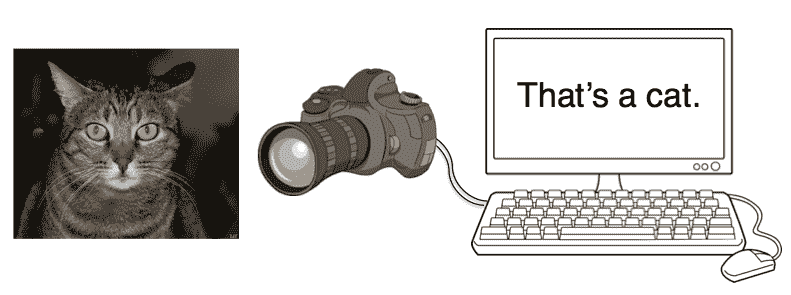
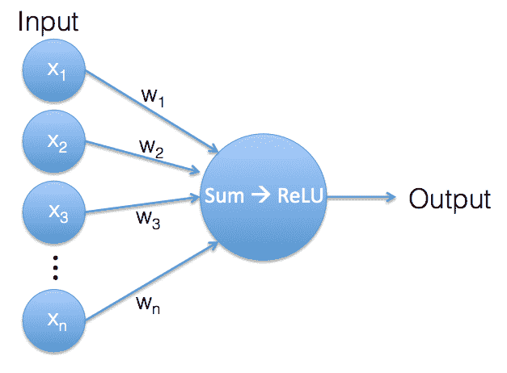
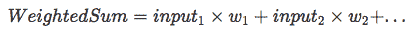
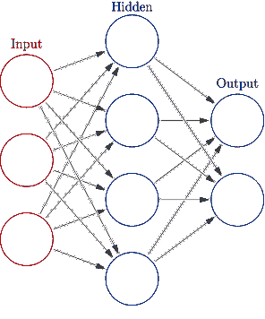
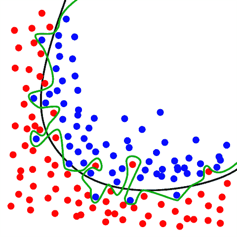
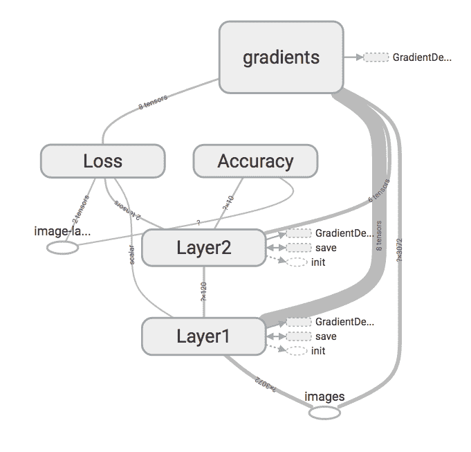

# 如何用 TensorFlow 构建一个简单的图像识别系统(下)

> 原文：<https://www.freecodecamp.org/news/how-to-build-a-simple-image-recognition-system-with-tensorflow-part-2-c83348b33bce/>

沃尔夫冈·拜尔

# 如何用 TensorFlow 构建一个简单的图像识别系统(下)



这是我介绍用 TensorFlow 构建图像识别系统的第二部分。在第一部分的[中，我们构建了一个 softmax 分类器来标记来自 CIFAR-10 数据集的图像。我们实现了大约 25–30%的准确率。由于有 10 个不同但同样可能的类别，随机标记图像，我们预计准确率为 10%。所以我们已经比 random 好很多了，但是还有很大的改进空间。](http://www.wolfib.com/Image-Recognition-Intro-Part-1/)

在这篇文章中，我将描述如何建立一个执行相同任务的神经网络。让我们看看我们可以提高多少预测的准确性！

### 神经网络

神经网络非常松散地基于生物大脑的工作方式。它们由许多人工神经元组成，每个人工神经元处理多个输入信号并返回一个输出信号。然后，输出信号可以用作其他神经元的输入信号。

让我们来看看单个神经元:



An artificial neuron. Its output is the result of the ReLU function of a weighted sum of its inputs.

单个神经元中发生的事情与 softmax 分类器中发生的事情非常相似。同样，我们有一个输入值向量和一个权重向量。权重是神经元的内部参数。输入向量和权重向量包含相同数量的值，因此我们可以使用它们来计算加权和。



到目前为止，我们正在进行与 softmax 分类器完全相同的计算，但现在有了一点小小的变化:只要加权和的结果是正值，神经元的输出就是这个值。但是如果加权和是负值，我们忽略该负值，而神经元产生输出 0。这种操作称为整流线性单元(ReLU)。


Rectified Linear Unit, which is defined by f(x) = max(0, x)

使用 ReLU 的原因是这会产生非线性。神经元的输出现在不再是其输入的严格线性组合。当我们停止关注单个神经元，转而关注整个网络时，我们会看到为什么这是有用的。

人工神经网络中的神经元通常不是随机相互连接的。大多数情况下，它们是分层排列的:



An artificial neural network with 2 layers, a hidden and an output layer. The input is not considered a layer, since it just feeds the data (without transforming it) to the first proper layer.
(Image is part of the [Wikimedia Commons](https://commons.wikimedia.org/wiki/Main_Page) and was taken from [here](https://commons.wikimedia.org/wiki/File:Colored_neural_network.svg))

输入图像的像素值是网络第一层神经元的输入。第 1 层神经元的输出是第 2 层神经元的输入，依此类推。这就是非线性如此重要的原因。如果没有每一层的 ReLU，我们将只有一个加权和序列。并且堆叠加权和可以合并成单个加权和，因此多层不会给我们带来比单层网络更好的改进。引入 ReLU 非线性解决了这个问题，因为每增加一层都会给网络增加一些东西。

网络最终层的输出是我们感兴趣的值，即图像类别的分数。在这种网络结构中，每个神经元都与前一层的所有神经元相连，因此这种网络称为全连接网络。正如我们将在本教程的第 3 部分看到的，情况不一定总是如此。

这就是我关于神经网络理论的简短部分的结尾。让我们开始建造一个吧！

### 代码

这个例子的完整代码是可以在 Github 上获得的[。它需要 TensorFlow 和 CIFAR-10 数据集(见](https://github.com/wolfib/image-classification-CIFAR10-tf)[第 1 部分](http://www.wolfib.com/Image-Recognition-Intro-Part-1/#prerequisites)关于如何安装先决条件)。

如果您已经阅读了我以前的博客文章，您将会看到神经网络分类器的代码与 softmax 分类器的代码非常相似。但是除了去掉定义模型的代码部分之外，我还添加了一些小功能来展示 TensorFlow 可以做的一些事情:

*   正则化:这是一种防止模型过度拟合的非常常见的技术。它通过在优化过程中施加反作用力来工作，旨在保持模型简单。
*   使用 TensorBoard 可视化模型:TensorBoard 包含在 TensorFlow 中，允许您从模型和模型生成的数据中生成图表和图形。这有助于分析您的模型，对于调试尤其有用。
*   检查点:该特性允许您保存模型的当前状态以备后用。训练一个模型可能需要相当长的时间，所以每次你想使用它的时候不要从头开始是很重要的。

这次代码被分成两个文件:一个是定义模型的`two_layer_fc.py`，另一个是运行模型的`run_fc_model.py`(如果您想知道:“fc”代表完全连接)。

### 2 层全连接神经网络

先看模型本身，后面再处理跑步和训练。`two_layer_fc.py`包含以下功能:

*   `inference()`让我们从输入数据到班级分数。
*   `loss()`根据班级分数计算损失值。
*   `training()`执行单一训练步骤。
*   `evaluation()`计算网络的精度。

### 生成班级分数:`inference()`

`inference()`描述通过网络的正向传递。从输入图像开始，如何计算班级分数？

`images`参数是包含实际图像数据的 TensorFlow 占位符。接下来的三个参数描述了网络的形状/大小。`image_pixels`是每个输入图像的像素数量，`classes`是不同输出标签的数量，`hidden_units`是我们网络的第一/隐藏层中的神经元数量。

每个神经元将前一层的所有值作为输入，并生成一个输出值。因此，隐藏层中的每个神经元都有`image_pixels`个输入，并且该层作为一个整体生成`hidden_units`个输出。这些然后被输入到输出层的`classes`神经元，产生`classes`输出值，每类一个分数。

`reg_constant`是正则化常数。TensorFlow 允许我们通过自动处理大部分计算，非常容易地将正则化添加到我们的网络中。当我们到达[损失函数](http://www.wolfib.com/Image-Recognition-Intro-Part-2/#loss_function)的时候，我会讲得更详细一些。

由于我们的神经网络有两个类似的层，我们将为每个层定义一个单独的范围。这允许我们在每个作用域中重用变量名。通过使用`tf.Variable()`，变量`biases`以我们已经知道的方式被定义。

`weights`变量的定义有点复杂。我们使用`tf.get_variable()`，它允许我们添加正则化。`weights`是一个维度为`image_pixels`乘`hidden_units`(输入向量大小 x 输出向量大小)的矩阵。`initializer`参数描述了`weight`变量的初始值。

到目前为止，我们已经将变量初始化为 0，但是这在这里不起作用。想想单层的神经元。它们都接收完全相同的输入值。如果它们都有相同的内部参数，它们将进行相同的计算，并输出相同的值。为了避免这种情况，我们需要随机化它们的初始权重。我们使用通常工作良好的初始化方案，权重被初始化为正态分布值。我们丢弃距离平均值超过 2 个标准偏差的值，并且标准偏差被设置为输入像素数量的平方根的倒数。幸运的是 TensorFlow 为我们处理了所有这些细节，我们只需要指定我们想要使用一个`truncated_normal_initializer`来做我们想要的事情。

`weights`变量的最后一个参数是`regularizer`。在这一点上，我们所要做的就是告诉 TensorFlow 我们想对`weights`变量使用 L2 正则化。我将在这里讨论正规化[。](http://www.wolfib.com/Image-Recognition-Intro-Part-2/#regularization)

为了创建第一层的输出，我们将`images`矩阵和`weights`矩阵相乘，并加上`bias`变量。这与[之前的博客文章](http://www.wolfib.com/Image-Recognition-Intro-Part-1/)中的 softmax 分类器完全相同。然后我们应用`tf.nn.relu()`，ReLU 函数来得到隐藏层的输出。

第 2 层与第 1 层非常相似。输入数量为`hidden_units`，输出数量为`classes`。因此`weights`矩阵的维数是`[hidden_units, classes]`。因为这是我们网络的最后一层，所以不再需要 ReLU。我们通过将输入(`hidden`)和`weights`相乘并加上`bias`得到类分数(`logits`)。

汇总操作`tf.histogram_summary()`允许我们记录`logits`变量的值，以供以后使用 TensorBoard 进行分析。稍后我会报道这个。

总而言之，`inference()`函数作为一个整体接收输入图像并返回类分数。这就是一个训练过的分类器所需要做的，但是为了得到一个训练过的分类器，我们首先需要测量这些类的分数有多好。这是损失函数的工作。

### 计算损失:`loss()`

首先，我们计算`logits`(模型的输出)和`labels`(来自训练数据集的正确标签)之间的交叉熵。这是 softmax 分类器的整个损失函数，但这次我们想使用正则化，所以我们必须在损失中添加另一项。

让我们先退一步，看看我们想要通过使用正则化来实现什么。

### 过度拟合和正则化

当一个统计模型捕获了它被训练的数据中的随机噪声而不是真实的潜在关系时，这被称为过度拟合。



The red and blue circles represent two different classes. The green line represents an overfitted model whereas the black line represents a model with a good fit.
(Image is part of the [Wikimedia Commons](https://commons.wikimedia.org/wiki/Main_Page) and was taken from [here](https://en.wikipedia.org/wiki/File:Overfitting.svg))

在上图中，有两个不同的类别，分别用蓝色和红色圆圈表示。绿线是过度拟合的分类器。它完美地遵循训练数据，但它也严重依赖于训练数据，并且处理看不见的数据的能力可能比代表正则化模型的黑线更差。

所以我们的正则化目标是得到一个简单的模型，没有任何不必要的复杂化。有不同的方法来实现这一点，我们选择的选项被称为 L2 正则化。L2 正则化将网络中所有权重的平方和添加到损失函数中。如果模型使用大的权重，这对应于一个大的惩罚，如果模型使用小的权重，这对应于一个小的惩罚。

这就是为什么我们在定义权重时使用了`regularizer`参数，并为其分配了一个`l2_regularizer`。这告诉 TensorFlow 跟踪该变量的 L2 正则化项(并通过参数`reg_constant`对它们进行加权)。所有正则化项都被添加到一个名为`tf.GraphKeys.REGULARIZATION_LOSSES`的集合中，损失函数将访问该集合。然后，我们将所有正则化损失的总和与之前计算的交叉熵相加，以得出我们模型的总损失。

### 优化变量:`training()`

`global_step`是一个标量变量，它记录已经执行了多少次训练迭代。当在我们的训练循环中重复运行模型时，我们已经知道了这个值。它是循环的迭代变量。我们将这个值直接添加到张量流图的原因是，我们希望能够拍摄模型的快照。并且这些快照应该包括关于已经执行了多少训练步骤的信息。

梯度下降优化器的定义很简单。我们提供学习率，并告诉优化器应该最小化哪个变量。此外，优化器会在每次迭代时自动增加参数`global_step`。

### 测量性能:`evaluation()`

模型准确性的计算与 softmax 的情况相同:我们将模型的预测与真实标签进行比较，并计算预测正确的频率。我们还对精度如何随时间演变感兴趣，因此我们添加了一个汇总操作来跟踪`accuracy`的值。我们将在关于 TensorBoard 的[部分对此进行介绍。](http://www.wolfib.com/Image-Recognition-Intro-Part-2/#tensorboard)

为了总结我们到目前为止所做的工作，我们使用 4 个函数定义了一个 2 层人工神经网络的行为:`inference()`构成网络的正向传递并返回类分数。`loss()`比较预测的和真实的类分数，并生成一个损失值。`training()`执行训练步骤并优化模型的内部参数，`evaluation()`测量我们模型的性能。

### 运行神经网络

现在定义了神经网络，我们来看看`run_fc_model.py`如何运行、训练和评估模型。

在强制导入之后，我们将模型参数定义为外部标志。TensorFlow 有自己的命令行参数模块，它是围绕 [Python 的`argparse`](https://docs.python.org/3/library/argparse.html) 的一个薄薄的包装器。我们在这里使用它是为了方便，但是你也可以直接使用`argparse`来代替。

在前几行中，定义了各种命令行参数。每个标志的参数是标志的名称、默认值和简短描述。执行带有`-h`标志的文件会显示这些描述。

第二个代码块调用实际解析命令行参数的函数。然后所有参数的值被打印到屏幕上。

在这里，我们为每个图像的像素数(32 x 32 x 3)和不同图像类别的数量定义了常数。然后，我们通过创建一个计时器来开始测量运行时间。

我们想记录一些关于训练过程的信息，并使用 TensorBoard 来显示这些信息。TensorBoard 要求每次运行的日志都在一个单独的目录中，所以我们在日志目录的名称中添加了日期和时间信息。

`load_data()`加载 CIFAR-10 数据，并返回包含独立训练和测试数据集的字典。

### 生成张量流图

我们正在定义张量流占位符。当执行实际计算时，这些将被填充训练/测试数据。

`images_placeholder`的尺寸为每张图像的批量 x 像素。“None”批处理大小允许我们使用不同的批处理大小运行图形(用于训练网络的批处理大小可以通过命令行参数设置，但是对于测试，我们将整个测试集作为单个批处理传递)。

`labels_placeholder`是一个包含正确类别标签的整数值向量，批处理中的每个图像一个。

这里我们引用了之前在`two_layer_fc.py`中提到的函数。

*   `inference()`让我们从输入数据到班级分数。
*   `loss()`根据班级分数计算损失值。
*   `training()`执行单一训练步骤。
*   `evaluation()`计算网络的精度。

为 TensorBoard 定义一个汇总操作(此处覆盖[)。](http://www.wolfib.com/Image-Recognition-Intro-Part-2/#tensorboard)

生成一个`saver`对象来保存模型在检查点的状态(这里覆盖了[和](http://www.wolfib.com/Image-Recognition-Intro-Part-2/#saver))。

我们启动 TensorFlow 会话，并立即初始化所有变量。然后，我们创建一个摘要编写器，用于定期将日志信息保存到磁盘。

这些行负责生成成批的输入数据。假设我们有 100 个训练图像，批量为 10 个。在 softmax 的例子中，我们只是为每次迭代选择了 10 个随机图像。这意味着在 10 次迭代之后，每幅图像平均将被拾取一次。).但事实上，有些图像会被多次提取，而有些图像到目前为止还不是任何批次的一部分。只要你经常重复这一点，随机性导致一些图像比其他图像更频繁地成为训练批次的一部分并不可怕。

但这次我们想改进取样过程。我们要做的是首先打乱训练数据集的 100 张图像。混洗数据的前 10 个图像是我们的第一批，接下来的 10 个图像是我们的第二批，依此类推。经过 10 个批次后，我们到达了数据集的末尾，该过程再次开始。我们另一次重组数据，从前到后浏览一遍。这保证了没有图像比任何其他图像更频繁地被拾取，同时仍然确保图像返回的顺序是随机的。

为了实现这一点，`data_helpers()`中的`gen_batch()`函数返回一个 Python `generator`，它在每次求值时返回下一批。发电机如何工作的细节超出了这篇文章的范围(一个很好的解释可以在这里找到)。我们使用 Python 内置的`zip()`函数来生成来自`[(image1, label1), (image2, label2), ...]`的元组列表，然后将其传递给我们的生成器函数。

`next(batches)`返回下一批数据。由于它仍然是以`[(imageA, labelA), (imageB, labelB), ...]`的形式，我们需要[首先解压缩](https://docs.python.org/2/library/functions.html#zip)以将图像与标签分开，然后用一批训练数据填充`feed_dict`，即包含 TensorFlow 占位符的字典。

每 100 次迭代，模型的当前精度被评估并打印到屏幕上。此外，`summary`操作正在运行，其结果被添加到负责将摘要写入磁盘的`summary_writer`中。从那里它们可以被 TensorBoard 读取和显示(见[本节](http://www.wolfib.com/Image-Recognition-Intro-Part-2/#tensorboard))。

该行运行`train_step`操作(之前定义为调用`two_layer_fc.training()`，它包含变量优化的实际指令)。

当训练一个模型需要较长的时间时，有一种简单的方法可以保存进度的快照。这允许您稍后返回并以完全相同的状态恢复模型。您所需要做的就是创建一个`tf.train.Saver`对象(我们之前已经这样做了),然后在每次您想要拍摄快照时调用它的`save()`方法。

恢复模型也一样简单，只需调用保存程序的`restore()`方法。github 存储库中的文件`[restore_model.py](https://github.com/wolfib/image-classification-CIFAR10-tf/blob/master/restore_model.py)`中有一个工作代码示例，展示了如何做到这一点。

训练完成后，在测试集上评估最终模型(请记住，测试集包含模型到目前为止尚未看到的数据，这使我们可以判断模型对新数据的归纳能力有多强)。

### 结果

让我们通过“`python run_fc_model.py`”使用默认参数运行模型。我的输出如下所示:

```
Parameters: batch_size = 400 hidden1 = 120 learning_rate = 0.001 max_steps = 2000 reg_constant = 0.1 train_dir = tf_logs 
```

```
Step 0, training accuracy 0.09 Step 100, training accuracy 0.2675 Step 200, training accuracy 0.3925 Step 300, training accuracy 0.41 Step 400, training accuracy 0.4075 Step 500, training accuracy 0.44 Step 600, training accuracy 0.455 Step 700, training accuracy 0.44 Step 800, training accuracy 0.48 Step 900, training accuracy 0.51 Saved checkpoint Step 1000, training accuracy 0.4425 Step 1100, training accuracy 0.5075 Step 1200, training accuracy 0.4925 Step 1300, training accuracy 0.5025 Step 1400, training accuracy 0.5775 Step 1500, training accuracy 0.515 Step 1600, training accuracy 0.4925 Step 1700, training accuracy 0.56 Step 1800, training accuracy 0.5375 Step 1900, training accuracy 0.51 Saved checkpoint Test accuracy 0.4633 Total time: 97.54s
```

我们可以看到，训练精度从随机猜测的水平开始(10 个类别-> 10%的机会选择正确的类别)。在最初的大约 1000 次迭代中，精度增加到大约 50%,并且在接下来的 1000 次迭代中围绕该值波动。46%的测试准确率并不比训练准确率低多少。这表明我们的模型没有明显过度拟合。softmax 分类器的性能大约为 30%，因此 46%是大约 50%的改进。还不错！

### 用张量板可视化

TensorBoard 允许您可视化张量流图的不同方面，对于调试和改进您的网络非常有用。让我们看看遍布代码库中与 TensorBoard 相关的代码行。

在`two_layer_fc.py`中，我们发现了以下内容:

这三行中的每一行都创建一个汇总操作。通过定义汇总操作，您告诉 TensorFlow 您对从某些张量(在我们的例子中是`logits`、`loss`和`accuracy`)收集汇总信息感兴趣。summary 操作的另一个参数只是您想要附加到 summary 的一个标签。

有不同种类的汇总操作。我们使用`scalar_summary`来记录关于标量(非向量)值的信息，使用`histogram_summary`来收集关于多个值分布的信息(关于各种汇总操作的更多信息可以在 [TensorFlow 文档](https://www.tensorflow.org/api_docs/python/summary/)中找到)。

在`run_fc_model.py`中，以下几行与张量板可视化相关:

TensorFlow 中的操作不会自己运行，您需要直接调用它或者调用依赖于它的另一个操作。因为我们不想每次收集汇总信息时都单独调用每个汇总操作，所以我们使用`tf.merge_all_summaries`来创建一个运行所有汇总的操作。

在 TensorFlow 会话初始化期间，我们将创建一个摘要编写器。摘要编写器负责将摘要数据实际写入磁盘。在它的构造函数中，我们提供了`logdir`，我们希望日志被写入的目录。可选的 graph 参数告诉 TensorBoard 渲染整个 TensorFlow 图形的显示。

每 100 次迭代，我们执行合并的汇总操作，并将结果提供给汇总写入器，汇总写入器将结果写入磁盘。

为了查看结果，我们通过“`tensorboard --logdir=tf_logs`”运行 TensorBoard，并在网络浏览器中打开`localhost:6006`。在“事件”选项卡中，我们可以看到随着时间的推移，网络损耗如何降低，准确度如何提高。


TensorBoard charts displaying the model’s loss and accuracy over a training run.

“图形”选项卡显示了我们定义的张量流图形的可视化。您可以交互式地重新排列它，直到您对它的外观满意为止。我认为下图很好地展示了我们网络的结构。



TensorBoard displays the TensorBoard graph in an interactive visualization.

在“分布”和“直方图”选项卡中，您可以探索我们附加到`logits`的`tf.histogram_summary`操作的结果，但我不会在此进一步详述。更多信息可在官方 TensorFlow 文档的[相关章节中找到。](https://www.tensorflow.org/how_tos/summaries_and_tensorboard/)

### 进一步的改进

也许您认为训练 softmax 分类器比训练神经网络花费的计算时间少得多。虽然这是事实，但即使我们一直训练 softmax 分类器，只要它需要神经网络来训练，它也不会达到相同的性能。训练一个模型的时间越长，获得的额外增益就越小，在某个点之后，性能的提高就微乎其微了。神经网络也达到了这一步。额外的训练时间不会再显著提高准确度。不过，我们还可以做些别的事情:

默认的参数值选择得很好，但是还有一些改进的空间。通过改变隐藏层中神经元的数量或学习速率等参数，我们应该能够进一步提高模型的准确性。通过进一步的优化，这个模型的测试精度肯定可以达到 50%以上。虽然如果这个模型能调至 65%以上我会很惊讶。但有另一种类型的网络架构，这种精度是很容易做到的:卷积神经网络。这是一类没有完全连接的神经网络。相反，他们试图在输入中理解局部特征，这对分析图像非常有用。在查看图像时，将空间信息考虑在内直观上很有意义。在本系列的第 3 部分中，我们将了解卷积神经网络的工作原理，并自己构建一个。

请继续关注卷积神经网络的第 3 部分，非常感谢您的阅读！我很高兴收到您的任何反馈！

你也可以看看我在我的博客上写的其他文章。