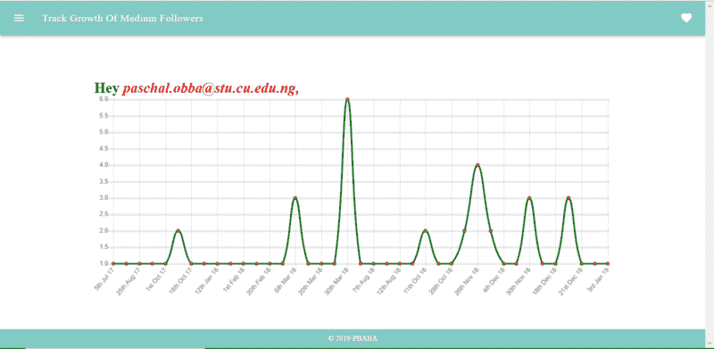

# 如何用 NodeJS、GraphQL 和 Vue 构建一个简单的社交媒体监视器

> 原文：<https://www.freecodecamp.org/news/how-to-build-a-simple-social-media-monitor-with-nodejs-graphql-and-vue-55ffe4124ab5/>

由帕斯卡尔

# 如何用 NodeJS、GraphQL 和 Vue 构建一个简单的社交媒体监视器


Thanks to [undraw!](https://undraw.co/illustrations)

#### 介绍

我们将构建一个简单的监视器，使用 Medium 作为用例，跟踪特定日期跟踪我们的人数。这只是一个简单的原型，可以在任何其他社交媒体或网络平台上实现。

最后，我们应该有这样的东西:



为了实现这一点，我们将使用 *[节点-imap](https://github.com/mscdex/node-imap)* 包。处理电子邮件的两个主要协议是 IMAP(互联网消息访问协议)和 POP(邮局协议)。IMAP 是首选，因为它总是与邮件服务器同步，因此在邮件客户端所做的更改会立即出现在 webmail 收件箱中。

#### 先决条件

*   NodeJS
*   VueJS
*   一个 Gmail 账户

#### 用 node-imap 和 apollo 设置后端

首先，安装必要的软件包。

```
npm i --save node-imap apollo-server mailparser
```

现在您可以定义类型和解析器，然后运行 apollo 服务器。

已经定义了一个以电子邮件和密码字符串类型作为其模式的'**用户**类型，以及一个名为 **'imapMutation'** 的变体，它接收来自用户的电子邮件和密码，然后返回一个带有用户类型的响应。

解析器处理变异，然后您可以处理从客户端发送的参数。

现在您可以运行服务器了。

然后您可以导入 **node-imap** 和 **mailparser** 模块。 **mailparser** 模块将用于以 JSON 的形式接收邮件响应。

```
const Imap = require('imap')const simpleParser = require('mailparser').simpleParser
```

您将创建一个' **connectImap'** 函数来处理我们的 Imap 功能。从 [node-imap](https://github.com/mscdex/node-imap) 文档中，您可以获得模块如何工作的框架，然后将其复制并粘贴到代码中。它基本上与回调和发射器一起工作，所以我们将它包装在一个承诺中。

你应该有这样的东西。

当' **ready** '事件被调用时，我们连接到我们的邮件，然后我们可以搜索邮件。因此，我们将从处理关注者的媒介帐户(***【noreply@medium.com】***)中搜索电子邮件。

我们的' ***准备好了*** '事件应该是这样的。

我们搜索每个主题包含“ ***开始跟随你*** ”子串的电子邮件。然后，我们用逗号或连词“and”来分割数组，以获得追随者的数量，然后处理类似“ ***彼得和另外 3 个人开始追随你*** ”的情况。拆分上面的字符串后，我们将得到一个输出:

```
[  'Peter',  '3 others started following you']
```

这个数组的长度是 **2** ，所以我们有两个追随者。如果主题包含“ ***others*** ”，我们将它后面的数字加上数组的长度，即 **5** ，然后减去 **1** 以去掉“ ***3 others”开始跟随你的*** 字符串。这给我们留下了 **4** 。

然后，当' ***end*** '事件被触发( *imap.once('end')* )时，我们解析承诺。

因为我们必须将数组发送到我们的 apollo 客户机，所以我们需要定义'*'数组的类型。*

*我们的类型定义应该如下所示:*

*我们给' ***用户*** '类型添加了**数据**键，它将保存' ***graphPoints*** '值，其类型是一个带有' ***Graph*** '类型的对象数组。*

*最后，我们处理解析器，解析器将获取用户的电子邮件和密码，然后返回**电子邮件**和数据(*)。**

**如果我们记录用户对象，我们的结构应该是这样的:**

```
**`email: String,data: [ { numberOfFollowers: 1, date: 2017-07-05T07:53:18.000Z },        { numberOfFollowers: 1, date: 2017-07-07T19:34:57.000Z }      ]`**
```

#### **使用垂直图表和 apollo 客户端设置前端**

**现在，我们想从服务器获取数据，并用 [v-charts](https://www.npmjs.com/package/v-charts) 模块绘制图表。**

**但是首先，我们安装我们的依赖项。**

```
**`npm install --save vue-chartjs vue-apollo apollo-client apollo-link-http apollo-cache-persist apollo-cache-inmemory graphql graphql-tag moment`**
```

**我知道你在想什么——这是一个很大的依赖性。如果你在建立一个 Vue 项目时遇到问题，你可以在这里找到如何做。如果我们想设计项目风格并创建额外的路线，我们还应该包括 [vuetify](https://vuetifyjs.com/en/getting-started/quick-start) 和 [vue-router](https://router.vuejs.org/installation.html#direct-download-cdn) 。**

**在我们的' ***src*** 文件夹中，我们可以创建一个' ***config*** 文件夹。结构应该是这样的:**

```
**`|src  |config     -graphql.js     -index.js     -LineChart.js  |pages      -login.vue  |router      -index.js  App.vue  main.js`**
```

**我们必须在***src/config/index . js***文件中设置我们的 graphql 客户端。**

**确保 ***uri*** 和你的阿波罗服务器在同一个端口上，默认情况下阿波罗服务器运行在端口 **4000** 上。然后，我们的 apollo 客户机就用 *httpLink* 和*缓存*设置好了。**

*****src/config/graph QL . js***文件应该是这样的:**

**这个查询将把用户的**电子邮件**和**密码**提交给 imapMutation，然后从 apollo 服务器获取**电子邮件**和**数据** (graphPoints)。**

**然后，我们在***src/config/line chart . js***文件中创建我们的图表组件。我们可以使用从条形图到直方图的图表。本例中使用了折线图。**

**我们可以在 main.js 文件中导入' ***vue-apollo*** '包，并在初始化 app 时包含 **apolloProvider** 。**

**最后，我们将设置 **src/pages/login.vue** 文件，我们应该将它配置为 **src/router/index.js** 文件中默认 home route '/'的组件。**

**因此，我们创建了一个基本表单，它接受用户的电子邮件和密码，然后通过 ***signup()*** 方法将这些数据发送到服务器。 ***plotGraph()*** 方法遍历响应(graphPoints)并将日期推送到标签数组，将关注者数量推送到数据数组。**

**使用' ***选项*** '对象进行样式化后，我们应该有类似于这个项目介绍中显示的截图。**

#### **结论**

**您仍然可以使用您的个人项目做更多的事情，但是本文的目的是展示如何使用 node-imap 包，以及 apollo 如何作为服务器和客户端工作。如果你对这个项目有任何问题，你可以在 Twitter 上留下评论或发送消息。**

**你可以试试这个的现场版本[，或者你可以在 GitHub 上查看一下](https://medium-followers.netlify.com/)[客户端](https://github.com/obbap1/MonitorFollowers_frontend)和[服务器](https://github.com/obbap1/MonitorFollowers_backend)应用程序的存储库。**

**如果你想学习新的技术和框架，你可以在这里学习[如果你学到了什么，请在下面鼓掌。](https://www.microverse.org/)**

***我要感谢[韦斯·瓦格纳](https://www.freecodecamp.org/news/how-to-build-a-simple-social-media-monitor-with-nodejs-graphql-and-vue-55ffe4124ab5/undefined)对撰写这篇文章的反馈。***

**谢谢！**

****