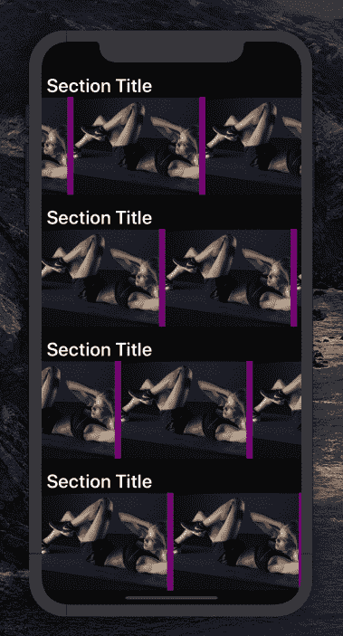
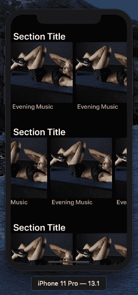
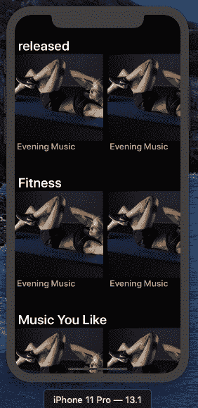
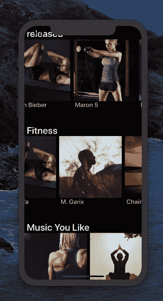
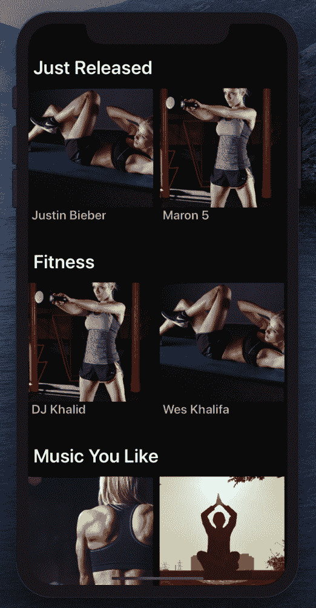
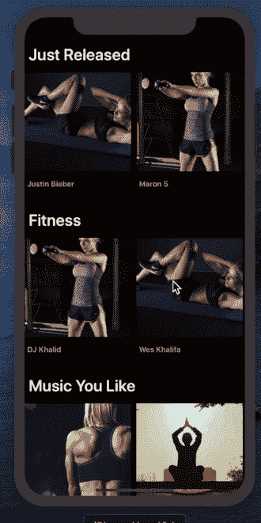
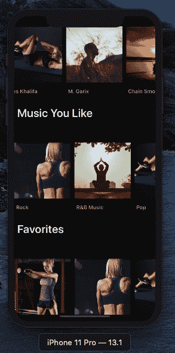

# 如何使用 AutoLayout 以编程方式为 iOS 构建 Spotify 克隆:添加照片和更新 UI

> 原文：<https://www.freecodecamp.org/news/how-to-build-a-spotify-clone-for-ios-with-autolayout-programmatically-part-2/>

这是关于用 autoLayout 以编程方式构建 Spotify UI 克隆的文章的第二部分。如果你错过了第一部分，没关系-请现在就去[查看一下](https://www.freecodecamp.org/news/autolayout-programmatically-spotify-clone-in-swift/)。

在本文中，我们将添加一些嘲讽的图片，并尝试使 UI 看起来与 Spotify 的一样。

这就是我们今天要做的？


这是我们在第一部分停止的地方:


下一步是创建定制的单元格。所以让我们从创建一个名为`SubCustomCell`的开始。

首先，在项目文件夹中创建一个新的 Swift 文件，并将其命名为`SubCustomCell.swift`。该文件将包含代表播放列表的自定义单元格。创建文件后，试着添加下面的代码并初始化单元格，也许用`backgroundColor`，看看当我们用`collectionView`注册单元格时 UI 的变化。

```
import UIKit

class SubCustomCell: UICollectionViewCell {
        override init(frame: CGRect) {
        super.init(frame: frame)
        backgroundColor = .red
    }

    required init?(coder aDecoder: NSCoder) {
        fatalError("init(coder:) has not been implemented")
    }
}
```

然后我们将`SubCustomCell`注册到`init`块中的`CustomCell.swift`内。如下图用``SubCustomCell`替换`UICollectionViewCell.self`。`

```
 collectionView.register(SubCustomCell.self, forCellWithReuseIdentifier: cellId)
```

我们还需要对`cellForItemAt`方法进行修改，使其符合`SubCustomCell`，如下所示。

```
 func collectionView(_ collectionView: UICollectionView, cellForItemAt indexPath: IndexPath) -> UICollectionViewCell {
        let cell = collectionView.dequeueReusableCell(withReuseIdentifier: cellId, for: indexPath) as! SubCustomCell
        // cell.backgroundColor = .yellow

        return cell
    }
```

您应该会看到`backgroundColor`变成了`red`。


Swift CustomCell

到目前为止，一切都应该简单明了。

现在我们要用一些模拟图片填充单元格，并在每个单元格内创建一个`ImageView`。我已经从[【pexels.com】](https://www.pexels.com/)下载了一些随机图片，但是你可以随意使用任何你喜欢的图片(包括这些)。你可以在 Github 的[项目文件中找到它们。](https://github.com/hayanisaid/autoLayout-programmatically-in-swift)

让我们在`SubCustomCell.swift`中创建`UIImageView`，并进行一些约束。

```
 let ImageView : UIImageView = {
       let iv = UIImageView()
        iv.backgroundColor = .yellow
        return iv

    }() 
```

并使用`addSubView`将其添加到`init`块中的`view`。

```
 override init(frame: CGRect) {
        super.init(frame: frame)
        addSubview(ImageView)

    }
```

现在让我们用下面的约束让`ImageView`占据单元格内的所有空间。

```
 ImageView.translatesAutoresizingMaskIntoConstraints = false
            ImageView.topAnchor.constraint(equalTo: topAnchor).isActive = true
            ImageView.leftAnchor.constraint(equalTo: leftAnchor).isActive = true
            ImageView.rightAnchor.constraint(equalTo: rightAnchor).isActive = true
            ImageView.bottomAnchor.constraint(equalTo: bottomAnchor).isActive = true
```

*   `LeftAnchor`代表单元格的左锚点
*   `rightAnchor`代表单元格的右锚点
*   `bottomAnchor`代表单元格的底部锚点
*   `topAnchor`代表单元格的顶部锚点

通过使`ImageView`的顶部定位点等于单元格的顶部定位点(对`ImageView`的左、右和底部定位点做同样的事情)，它使`ImageView`占据了`SubCustomCell`(单元格)的所有空间。

注意:首先你需要使用`translatesAutoresizingMaskIntoConstraints`来将约束应用到元素上。另外，不要忘记调用`isActive`属性并将其分配给`true`——如果不这样做，约束将不起作用，什么也不会改变。

`ImageView`应该有一个图像，所以让我们添加一个。

```
 let ImageView : UIImageView = {
       let iv = UIImageView()
        iv.backgroundColor = .yellow
        // we have >image1< file inside the project 
        iv.image = UIImage(named: "image1")
        iv.contentMode = .scaleAspectFill
        iv.clipsToBounds = true

        return iv

    }()
```

如果您构建并运行该应用程序，您应该会看到我们添加到`SubCustomCell`中的结果和图片。



酷吗？。现在我们应该在`SubCustomCell`中添加一个元素来结束。我们需要一个标题来表示播放列表的标题:`UILabel`。

标题应该是这样的:

```
 let TitleLabel : UILabel = {
        let lb = UILabel()
        lb.textColor = UIColor.lightGray
        lb.font = UIFont.systemFont(ofSize: 16)
        lb.font = UIFont.boldSystemFont(ofSize: 20)
        lb.text = "Evening Music"

        return lb
    }()
```

我只是在那里放了一些随机的文本——你可以放任何你喜欢的东西。下一步是将元素添加到视图中，并给它一些约束。标题会放在`ImageView`的底部。

### 添加到视图:

```
addSubview(TitleLabel) 
```

### 对`ImageView`和`TitleLabel`应用约束

```
 ImageView.translatesAutoresizingMaskIntoConstraints = false
            ImageView.topAnchor.constraint(equalTo: topAnchor).isActive = true
            ImageView.leftAnchor.constraint(equalTo: leftAnchor).isActive = true
            ImageView.rightAnchor.constraint(equalTo: rightAnchor).isActive = true
            ImageView.heightAnchor.constraint(equalToConstant: 240).isActive = true
            ImageView.bottomAnchor.constraint(equalTo: TitleLabel.topAnchor).isActive = true

            TitleLabel.translatesAutoresizingMaskIntoConstraints = false
            TitleLabel.topAnchor.constraint(equalTo: ImageView.bottomAnchor,constant: 10).isActive = true
            TitleLabel.leftAnchor.constraint(equalTo: leftAnchor, constant: 5).isActive = true
            TitleLabel.rightAnchor.constraint(equalTo: rightAnchor, constant: -5).isActive = true
```

开始了。



我们让图片占了单元格的大部分空间，剩下的被标题占了。如您所见，您可以在每个部分水平滚动，也可以在整个屏幕上垂直滚动。


现在我们将一些模拟数据放入单元格中，让它看起来像真的一样。为此，我创建了一个`JSON`文件，其中包含一些部分和播放列表的随机数据。

首先让我们创建两个结构，`Section`和`Playlist`。我们为每个结构创建一个单独的文件。

`section.swift`

```
import Foundation
struct Section {
    var title : String
    var playlists : NSArray
    init(dictionary:[String : Any]) {
        self.title = dictionary["title"] as? String ?? ""
        self.playlists = dictionary["playlists"] as? NSArray ?? []

}
} 
```

`playlist.swift`

```
//
//  playlist.swift
//  spotifyAutoLayout
//
//  Created by admin on 12/6/19.
//  Copyright © 2019 Said Hayani. All rights reserved.
//

import Foundation
struct PlayList {
    var title: String
    var image : String
    init(dictionary : [String : Any]) {
        self.title = dictionary["title"] as? String ?? ""
        self.image = dictionary["image"] as? String ?? ""
    }

} 
```

然后在`ViewController.swift`中，我们创建一个函数来获取 JSON，并将结果存储在一个数组中。

```
 print("attempt to fetch Json")
        if let path = Bundle.main.path(forResource: "test", ofType: "json") {
            do {
                  let data = try Data(contentsOf: URL(fileURLWithPath: path), options: .mappedIfSafe)
                  let jsonResult = try JSONSerialization.jsonObject(with: data, options: .mutableLeaves)
                if let jsonResult = jsonResult as? [ Any] {
                            // do stuff
                    jsonResult.forEach { (item) in

                        let section = Section(dictionary: item as! [String : Any])
                       // print("FEtching",section.playlists)
                        self.sections.append(section)
                    }

                  self.collectionView.reloadData()
                  }
              } catch {
                   // handle error
              }
        }
    }
```

在`ViewDidLoad`方法中调用`fetchJson`函数。我们还有一个名为`sections`的变量来存储结果:

```
 var sections = [Section]()
```

下一步是将数据从`ViewController`传递到`CustomCell`。为此，我们在`CustomCell`中创建一个变量，它将接收每个部分的数据:

```
 var section : Section?{
        didSet{
            print("section ✅",self.section)
        }
    }
```

我们在`ViewController`方法中使用`cellForItemAt`将数据直接传递给`CustomCell`。

```
override func collectionView(_ collectionView: UICollectionView, cellForItemAt indexPath: IndexPath) -> UICollectionViewCell {
        let cell = collectionView.dequeueReusableCell(withReuseIdentifier: cellId, for: indexPath) as! CustomCell

        cell.section = sections[indexPath.item]

        return cell
    }
```

注意:我们总是调用 **`self`** `.collectionView.reloadData()`每次调用`fetchJson`时，下面的块，内部的`CustomCell`也会被调用。检查控制台，`shift` + command + C:

```
 var section : Section? {
        didSet{
            print("section ✅",self.section)
        }
    }
```

我们更改的第一件事是设置部分标题:

```
 var section : Section? {
        didSet{
            print("section ✅",self.section)
            guard let section = self.section else {return}
            self.titleLabel.text = section.title
        }
    }
```

然后你应该看到屏幕上每个部分都有一个特定的标题？。



现在是将数据传递给`SubCustomCell`的时候了。我们做和上面一样的事情。我们需要传递`playlists`数组，所以我们在`CustomCell`中创建了一个名为`playlists`的变量。

```
 var playlists : [PlayList]() //empty 
```

首先，我们从`JSON`映射到`playlists`。然后我们用`playlists`变量添加每个播放列表。

```
 var section : Section? {
        didSet{
            print("section ✅",self.section)
            guard let section = self.section else {return}
            self.titleLabel.text = section.title
            // append to playlists array
             self.section?.playlists.forEach({ (item) in
                let playlist = PlayList(dictionary: item as! [String : Any])
                self.playlists.append(playlist)

            })
            self.collectionView.reloadData()
        }
    }
```

立正！如果你尝试运行应用程序，它可能会崩溃。这是因为我们忘记设置节数了。因为我们现在从 JSON 接收数据，这个数字应该是基于我们拥有的节数的动态数字。节的数量应该等于`JSON`内的节的数量，所以我们需要将`ViewController`内的`numberOfItemsInSection`修改为如下:

```
 override func collectionView(_ collectionView: UICollectionView, numberOfItemsInSection section: Int) -> Int {
        return sections.count
    }
```

我们在`CustomCell.swift`中用同样的方法做同样的事情——但是这里我们考虑的是`playlists`的编号。

```
func collectionView(_ collectionView: UICollectionView, numberOfItemsInSection section: Int) -> Int {
        return  self.playlists.count
    }
```

我们必须完成的最后一步是在`CustomCell.swift`中的`cellForItemAt`内传递每个单个播放列表`Object`到`SubCustomCell`。

```
 func collectionView(_ collectionView: UICollectionView, cellForItemAt indexPath: IndexPath) -> UICollectionViewCell {
        let cell = collectionView.dequeueReusableCell(withReuseIdentifier: cellId, for: indexPath) as! SubCustomCell
        // here ?
        cell.playlist = playlists[indexPath.item]
        return cell
    }
```

我们将通过`playlist`变量获取`SubCustomCell`中的数据，并最终显示播放列表的标题和图像。

```
var playlist : PlayList? {
           didSet{
               print("Playlist ?",self.playlist)
            guard let playlist = self.playlist else {return}
            // The Image ?
            self.ImageView.image = UIImage(named: playlist.image)
            // the playlist title ?
            self.TitleLabel.text = self.playlist?.title

           }
       }
```

我觉得现在应该一切正常，如下图？



对 UI 的最后一次更新:我们必须给`section`和`playlist`标题添加一些填充和空白，并使播放列表变小一点。

让我们首先为部分标题添加一些填充。要做到这一点，我们只需要在部分单元格`CustomCell`和`setupSubCells`中给`constant`属性一些数值:

```
 collectionView.topAnchor.constraint(equalTo: titleLabel.bottomAnchor,constant: 15).isActive = true
```

如果你看到整个`collectionView`出现在`titleLabel`的底部，我们需要做的就是通过添加`15`来增加更多的空间:



接下来我们来看一下`playlist`的标题。这将在`SubCustomCell`中，我们只需要在 ImageView 的底部增加更多的空间。

```
 ImageView.bottomAnchor.constraint(equalTo: TitleLabel.topAnchor,constant: -15).isActive = true
```

我们已经有了常数。为了让它工作，这个值应该是`-15`



最后，播放列表需要小一点。这很简单:我们只需使`playlist`单元格的高度和宽度等于`section`单元格的高度除以 2，如下所示:

`CustomCell.swift`

```
 func collectionView(_ collectionView: UICollectionView, layout collectionViewLayout: UICollectionViewLayout, sizeForItemAt indexPath: IndexPath) -> CGSize {

        let width = frame.height / 2
        let height = frame.height / 2

        return CGSize(width: width, height: height)

    }
```

也使 ImageView 的高度等于`150`。

```
 //SubCutomCell.swift
  ImageView.heightAnchor.constraint(equalToConstant: 150).isActive = true
```

我们开始吧。。



完美！我想今天到此为止——我不想让这篇文章太长。因此，我们将有另一个部分，我们将添加`TabBar`和描述，以及播放列表的一些图标。

**查看 GitHub 上的** [**完整源代码**](https://github.com/hayanisaid/autoLayout-programmatically-in-swift) **？。**

谢谢你的时间。我希望我没有错过什么。如果我这样做了，请在 Twitter 上提到我，或者如果你对这篇文章有任何问题或补充，大门永远向任何人敞开。谢了？？。

**[订阅](https://webege.us16.list-manage.com/subscribe?u=311846a57d1e1a666287ad128&id=2b386b2ebb)** *到我的邮箱列表待本教程第三部分发布时通知。*

> 顺便说一下，我最近和一个强大的软件工程师团队合作开发了一个移动应用程序。这个组织非常棒，产品交付得非常快，比我合作过的其他公司和自由职业者快得多，我想我可以诚实地向他们推荐其他项目。如果你想联系我，请发邮件给我—[said@devsdata.com](mailto:said@devsdata.com)。