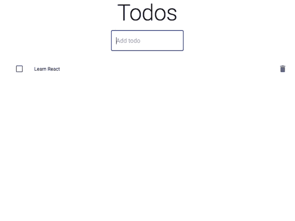
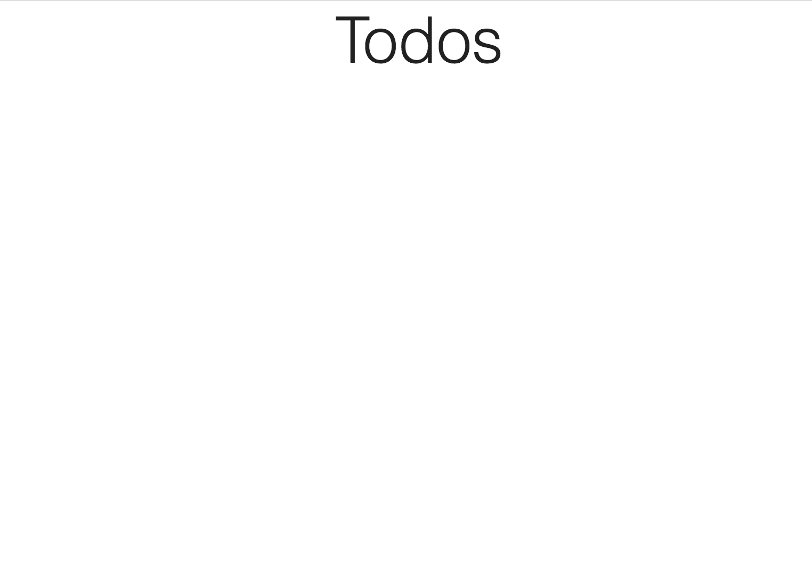
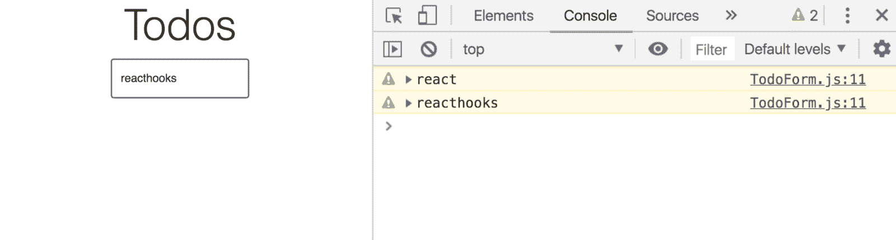
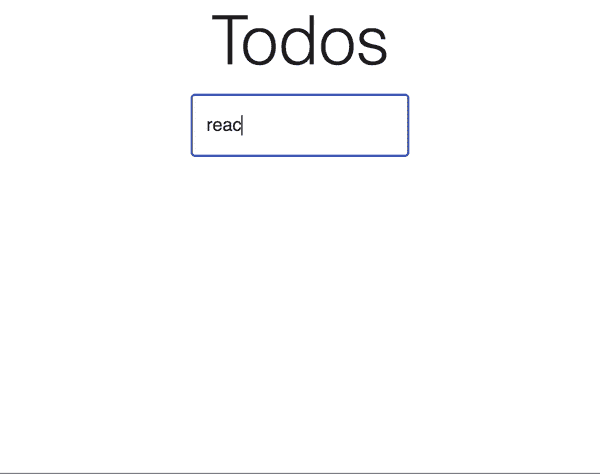
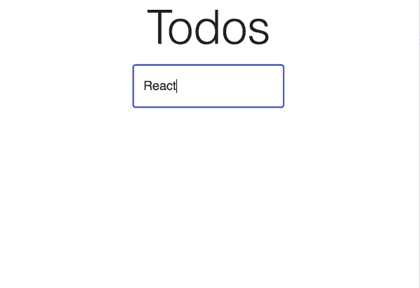

# 如何用 React 挂钩构建待办事项列表

> 原文：<https://www.freecodecamp.org/news/how-to-build-a-todo-list-with-react-hooks-ebaa4e3db3b/>

React v16.7.0-alpha 推出了[钩子](https://reactjs.org/docs/hooks-intro.html)，我很兴奋。

### 什么是钩子？

它们是给你反应特性的函数，比如没有 ES6 类的状态和生命周期挂钩。

一些好处是

*   隔离有状态逻辑，使其更容易测试。
*   共享有状态逻辑，无需渲染道具或高阶组件。
*   基于逻辑而不是生命周期挂钩来分离应用的关注点。
*   避免 ES6 类，因为它们很古怪，*不是真正的类，*甚至会绊倒有经验的 JavaScript 开发人员。

更多细节见 [React 的官方钩子介绍](https://reactjs.org/docs/hooks-intro.html)。

#### 逐渐采用钩子

在撰写本文时，Hooks 还处于 alpha 版本，它们的 API 可能随时会发生变化。

React 16.8.0 是第一个支持钩子的稳定版本，每天都有更多的教程和示例代码。然而，由于没有从 React 中移除类的计划，并且钩子将与现有代码一起工作，React 团队建议避免“大的重写”。相反，他们建议先在非关键组件中练习钩子，然后在接下来的类中使用它们。

### 让我们建立一个待办事项列表



待办事项列表是最常被滥用的例子，这是有原因的——它们是极好的练习。对于任何您想尝试的语言或库，我都推荐这样做。

我们的只会做几件事

*   以漂亮的材料设计方式展示 todos
*   允许通过输入添加待办事项
*   删除待办事项

### 设置

这里有 [GitHub](https://github.com/yazeedb/react-hooks-todo) 和 [CodeSandbox](https://codesandbox.io/s/github/yazeedb/react-hooks-todo) 链接。

```
git clone https://github.com/yazeedb/react-hooks-todo
cd react-hooks-todo
npm install 
```

`master`分支已经完成了项目，所以如果你想继续的话，检查一下`start`分支。

`git checkout start`

并运行该项目。

`npm start`

应用程序应该在`localhost:3000`上运行，这是我们的初始 UI。



它已经用 [material-ui](http://material-ui.com/) 设置好了，让我们的页面看起来更专业。让我们开始添加一些功能吧！

### TodoForm 组件

添加一个新文件，`src/TodoForm.js`。这是开始的代码。

```
import React from 'react';
import TextField from '@material-ui/core/TextField';

const TodoForm = ({ saveTodo }) => {
  return (
    <form>
      <TextField variant="outlined" placeholder="Add todo" margin="normal" />
    </form>
  );
};

export default TodoForm; 
```

根据这个名字，我们知道它的工作是将 todos 添加到我们的状态中。说到这里，**下面是我们的第一个钩子**。

### useState

看看这段代码

```
import { useState } from 'react';

const [value, setValue] = useState(''); 
```

`useState`只是一个取初始状态并返回数组的函数。勇往直前`console.log`吧。

数组的第一个索引是状态的当前值，第二个索引是更新函数。

所以我们用 [ES6 析构赋值](https://developer.mozilla.org/en-US/docs/Web/JavaScript/Reference/Operators/Destructuring_assignment)恰当地将它们命名为`value`和`setValue`。

### 对表单使用状态

我们的表单应该跟踪输入的值，并在提交时调用`saveTodo`。`useState`可以帮帮我们！

更新`TodoForm.js`，新代码以**粗体**显示。

```
import React, { useState } from 'react';
import TextField from '@material-ui/core/TextField';

const TodoForm = ({ saveTodo }) => {
  const [value, setValue] = useState('');

  return (
    <form
      onSubmit={(event) => {
        event.preventDefault();
        saveTodo(value);
      }}
    >
      <TextField
        variant="outlined"
        placeholder="Add todo"
        margin="normal"
        onChange={(event) => {
          setValue(event.target.value);
        }}
        value={value}
      />
    </form>
  );
};

export default TodoForm; 
```

回到`index.js`，导入并使用该组件。

```
// ...

import TodoForm from './TodoForm';

// ...

const App = () => {
  return (
    <div className="App">
      <Typography component="h1" variant="h2">
        Todos
      </Typography>

      <TodoForm saveTodo={console.warn} />
    </div>
  );
}; 
```

现在您的值已登录提交(按回车键)。



### 使用带有 Todos 的状态

我们的 todos 也需要状态。在`index.js`中导入`useState`。我们的初始状态应该是一个空数组。

```
import React, { useState } from 'react';

// ...

const App = () => {
  const [todos, setTodos] = useState([]);

  // ...
}; 
```

### TodoList 组件

创建一个名为`src/TodoList.js`的新文件。

编辑:谢谢[田崎敬浩·哈塔](https://medium.com/@takahirohata)帮我把`onClick`移到正确的位置！

```
import React from 'react';
import List from '@material-ui/core/List';
import ListItem from '@material-ui/core/ListItem';
import ListItemSecondaryAction from '@material-ui/core/ListItemSecondaryAction';
import ListItemText from '@material-ui/core/ListItemText';
import Checkbox from '@material-ui/core/Checkbox';
import IconButton from '@material-ui/core/IconButton';
import DeleteIcon from '@material-ui/icons/Delete';

const TodoList = ({ todos, deleteTodo }) => (
  <List>
    {todos.map((todo, index) => (
      <ListItem key={index.toString()} dense button>
        <Checkbox tabIndex={-1} disableRipple />
        <ListItemText primary={todo} />
        <ListItemSecondaryAction>
          <IconButton
            aria-label="Delete"
            onClick={() => {
              deleteTodo(index);
            }}
          >
            <DeleteIcon />
          </IconButton>
        </ListItemSecondaryAction>
      </ListItem>
    ))}
  </List>
);

export default TodoList; 
```

这需要两个道具

*   `todos`:todos 的数组。我们`map`遍历每一个并创建一个列表项。
*   `deleteTodo`:点击待办事项的`IconButton`触发此功能。它通过了`index`，这将在我们的列表中唯一地标识一个 todo。

将此组件导入到您的`index.js`中。

```
import TodoList from './TodoList';
import './styles.css';

const App = () => {
  //...
}; 
```

并像这样在您的`App`函数中使用它

```
<TodoForm saveTodo={console.warn} />
<TodoList todos={todos} /> 
```

### 添加待办事项

还是在`index.js`里，让我们来编辑一下`TodoForm`的道具`saveTodo`。

```
<TodoForm
  saveTodo={(todoText) => {
    const trimmedText = todoText.trim();

    if (trimmedText.length > 0) {
      setTodos([...todos, trimmedText]);
    }
  }}
/> 
```

只需将现有的 todoss 与我们的新 todo 合并，去掉多余的空白。

我们现在可以添加 todos 了！



### 清除输入

请注意，在添加新的 todo 后，输入没有被清除。那是很差的用户体验！

我们可以在`TodoForm.js`中通过一个小的代码变化来修复它。

```
<form
  onSubmit={(event) => {
    event.preventDefault();

    saveTodo(value);

    setValue('');
  }}
/> 
```

todo 保存后，将表单状态设置为空字符串。

现在看起来不错！



### 删除待办事项

`TodoList`提供每个待办事项的`index`，因为这是找到我们想要删除的待办事项的可靠方法。

`TodoList.js`

```
<IconButton
  aria-label="Delete"
  onClick={() => {
    deleteTodo(index);
  }}
>
  <DeleteIcon />
</IconButton> 
```

我们将在`index.js`中利用这一点。

```
<TodoList
  todos={todos}
  deleteTodo={(todoIndex) => {
    const newTodos = todos.filter((_, index) => index !== todoIndex);

    setTodos(newTodos);
  }}
/> 
```

任何与提供的`index`不匹配的 todos 都使用`setTodos`保存并存储在 state 中。

删除功能完成！


### 抽象到 dos 使用状态

我提到过钩子对于分离状态和组件逻辑非常有用。这是我们的 todo 应用程序中可能出现的情况。

创建一个名为`src/useTodoState.js`的新文件。

```
import { useState } from 'react';

export default (initialValue) => {
  const [todos, setTodos] = useState(initialValue);

  return {
    todos,
    addTodo: (todoText) => {
      setTodos([...todos, todoText]);
    },
    deleteTodo: (todoIndex) => {
      const newTodos = todos.filter((_, index) => index !== todoIndex);

      setTodos(newTodos);
    }
  };
}; 
```

是我们从`index.js`开始的同一个代码，但是分开了！我们的状态管理不再与组件紧密耦合。

现在只需导入它。

```
import React from 'react';
import ReactDOM from 'react-dom';
import Typography from '@material-ui/core/Typography';
import TodoForm from './TodoForm';
import TodoList from './TodoList';
import useTodoState from './useTodoState';
import './styles.css';

const App = () => {
  const { todos, addTodo, deleteTodo } = useTodoState([]);

  return (
    <div className="App">
      <Typography component="h1" variant="h2">
        Todos
      </Typography>

      <TodoForm
        saveTodo={(todoText) => {
          const trimmedText = todoText.trim();

          if (trimmedText.length > 0) {
            addTodo(trimmedText);
          }
        }}
      />

      <TodoList todos={todos} deleteTodo={deleteTodo} />
    </div>
  );
};

const rootElement = document.getElementById('root');
ReactDOM.render(<App />, rootElement); 
```

一切都还正常。


### 从输入使用状态中提取

我们可以对我们的表单做同样的事情！

创建一个新文件，`src/useInputState.js`。

```
import { useState } from 'react';

export default (initialValue) => {
  const [value, setValue] = useState(initialValue);

  return {
    value,
    onChange: (event) => {
      setValue(event.target.value);
    },
    reset: () => setValue('')
  };
}; 
```

而现在`TodoForm.js`应该是这个样子。

```
import React from 'react';
import TextField from '@material-ui/core/TextField';
import useInputState from './useInputState';

const TodoForm = ({ saveTodo }) => {
  const { value, reset, onChange } = useInputState('');

  return (
    <form
      onSubmit={(event) => {
        event.preventDefault();

        saveTodo(value);
        reset();
      }}
    >
      <TextField
        variant="outlined"
        placeholder="Add todo"
        margin="normal"
        onChange={onChange}
        value={value}
      />
    </form>
  );
};

export default TodoForm; 
```

我们都完成了！希望你喜欢，下次再见！