# 如何使用 ReactJS、NextJS 和 Supabase 构建 TodoApp

> 原文：<https://www.freecodecamp.org/news/how-to-build-a-todoapp-using-react-and-supabase/>

大家好，欢迎来到本教程。今天我们将使用 React、Next 和 Supabase 构建一个生产就绪的 Todo 应用程序。

在我们开始之前，您应该熟悉 **React.js** 和 **Next.js** 的基础知识，以便充分利用本指南。

如果你没有并且需要复习，我建议你浏览一下 [ReactJS 文档](https://reactjs.org/docs/getting-started.html)和 [NextJS 文档](https://nextjs.org/docs/getting-started)。

## ******下面是我们要建造的******

我们将构建一个如下所示的 ToDo 应用程序:

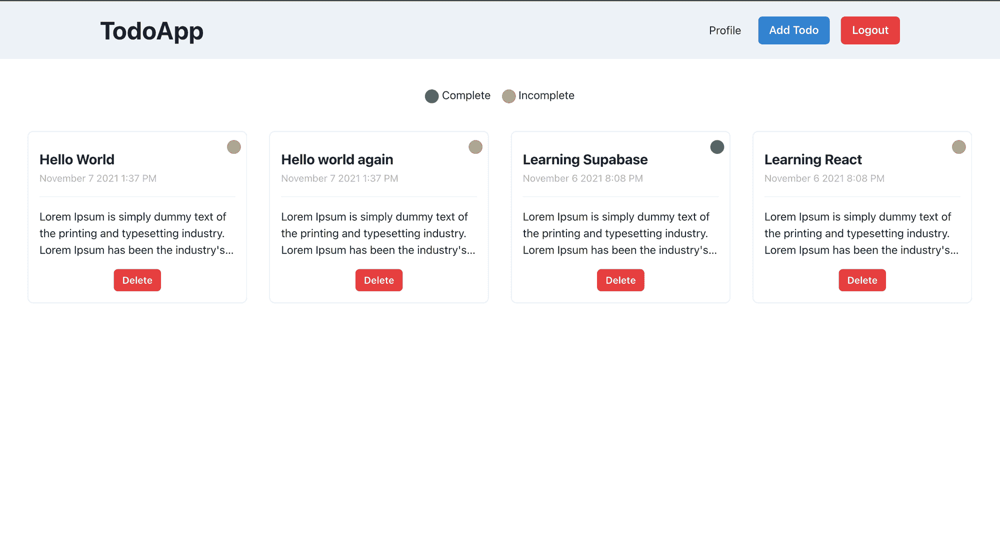

## 这是我们将使用的技术:

1.  [ReactJS](https://reactjs.org/docs/getting-started.html) :用于构建用户界面的 JavaScript 库。它是声明性的和基于组件的。
2.  NextJS :一个基于 React 的框架，让我们可以在服务器端呈现数据。它有助于谷歌抓取应用程序，从而带来搜索引擎优化的好处。
3.  Supabase :提供我们将在应用程序中使用的认证、数据库和存储。
4.  Chakra UI 是一个简单的、模块化的、可访问的组件库，它将为我们提供构建应用程序的构件。
5.  Vercel :将托管我们的应用程序。它的扩展性很好，完全不需要任何配置，而且部署是即时的。

## 为什么要用 Supabase？

根据 Supabase 文档，Supabase 是*“一个开源的 Firebase 替代品”。*

然而，Supabase 并不完全类似于 Firebase。两者的区别在于，Supabase 使用 **Postgres** (一种关系数据库)来存储数据，而 Firebase 使用 **NoSQL** 机制来存储数据。

就个人而言，我通常使用 Postgres 作为我的主要数据库，我发现它的伸缩性很好。

Supabase 提供以下服务:

1.  **认证**
2.  **Postgres 数据库**
3.  **实时休息服务器**
4.  **行级安全性**
5.  **储物桶**

现在让我们了解它是如何工作的:

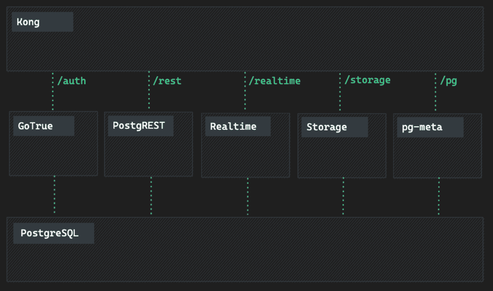

Architectural Diagram from Supabase documentation

好吧，这是怎么回事？

如你所知， **Supabase** 使用 Postgres 作为数据库——但它也有许多其他组件提供不同的服务。

我最喜欢的一个是**实时**。Supabase 使用 Elixir 服务器建立一个 web 套接字连接来监听插入、更新和删除事件。

**PostgRest** 直接将 Postgres 数据库转换成 Rest API。

GoTrue 是一个用于管理用户和发行 SWT 令牌的 API。

Postgres-Meta 是一个用于管理 Postgres 数据库的 Restful API。

**孔**是一个 API 网关。

> **注:**所有这些定义均取自 supabase 文档。要了解更多关于 Supabase 如何工作的信息，你可以访问他们的[文档](https://supabase.io/docs)。

至此，我们已经准备好开始我们的项目了。以下是我们将要介绍的内容:

## **目录**

1.  [如何配置超级数据库表、授权和存储](#how-to-configure-supabase-tables-auth-and-storage)
2.  [如何使用 Supabase 实现签到](#how-to-implement-sign-in-using-supabase)
3.  [如何显示所有待办事项，添加新待办事项，更新和删除待办事项](#how-to-show-all-todos-add-new-todos-and-update-and-delete-todos)
4.  [如何更新个人资料和头像](#how-to-update-profile-details-and-avatars)
5.  [如何将 app 部署到 Vercel 并配置 Supabase 认证](#how-to-deploy-the-app-to-vercel-and-configure-supabase-authentication)

我将把这个教程分成四个独立的部分。在每一节的开始，您会发现一个 Git commit，其中包含了在该节中开发的代码。另外，如果您想查看完整的代码，那么它可以在这个[存储库](https://github.com/Sharvin26/TodoApp-supabase)中找到。

## 如何配置超级数据库表、身份验证和存储

在本节中，我们将实现以下功能:

1.  创建一个 Supabase 项目。
2.  **为用户和策略设置认证。**
3.  **为用户和 todos 配置数据库和策略。**

要创建 Supabase 项目，请访问下面的[链接](https://supabase.io/)。点击“启动你的项目”按钮，通过 GitHub 登录(在撰写本文时，他们只支持 GitHub 作为一个 auth provider)。

一旦您创建了您的帐户，点击新项目，它将要求组织。默认情况下，Supabase 将使用您的用户名为您创建一个组织帐户。我将使用默认的，但你可以为这个项目创建自己的。

一旦选择了组织，Supabase 将询问项目名称、数据库密码和地区。


Supabase Create Project

填写此表格并点击**创建新项目**按钮。

Supabase 将开始设置应用程序。设置可能需要几分钟时间。

在项目 API 键部分，您将看到两种类型的键:

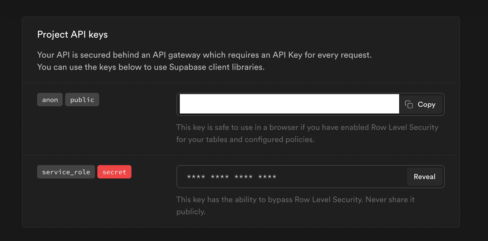

Supabase Project API Keys

anon 是一个公共 API 密钥，可以在客户端使用。

**service_role** 是一个私有 API 密钥，您只能在服务器端使用它。这个键可以绕过行级安全性并改变数据。

### 什么是 Supabase 中的行级安全性？

您可能想知道——什么是行级安全性，为什么它如此重要？

Supabase 有一个客户端库，可以直接从浏览器访问数据，为此，我们使用了 **anon** 键。由于匿名密钥在客户端，任何人都可以通过网络选项卡访问密钥。

但是在某些情况下，我们不希望浏览器使用客户端库直接访问数据。

在这些情况下，我们可以设置行级安全性，它指定可以使用 anon 键访问哪些数据。

要了解更多关于行级安全性的信息，请阅读这个[文档](https://supabase.io/docs/learn/auth-deep-dive/auth-row-level-security)。

返回到应用程序，一旦项目配置完成，您将得到以下消息"**欢迎使用您的新项目**"

### 如何在数据库中创建表

现在让我们创建一个脚本来在数据库中创建表。

从侧边栏转到 SQL 部分，然后单击 New query。


SQL section from Supabase panel

单击“新建查询”并复制粘贴以下代码:

```
create table profiles (
  id uuid references auth.users not null,
  username text unique,
  avatarUrl text,
  website text,
  bio text,
  joinedAt timestamp with time zone default timezone('utc'::text, now()) not null,

  primary key (id),
  unique(username)
);

alter table profiles enable row level security;

create policy "Profiles are viewable by user only."
  on profiles for select
  using ( auth.uid() = id );

create policy "Users can insert their own profile."
  on profiles for insert
  with check ( auth.uid() = id );

create policy "Users can update own profile."
  on profiles for update
  using ( auth.uid() = id );

begin;
  drop publication if exists supabase_realtime;
  create publication supabase_realtime;
commit;
alter publication supabase_realtime add table profiles;

-- Set up Storage!
insert into storage.buckets (id, name)
values ('avatars', 'avatars');

create policy "Avatar images are publicly accessible."
  on storage.objects for select
  using ( bucket_id = 'avatars');

create policy "Anyone can upload an avatar."
  on storage.objects for insert
  with check ( bucket_id = 'avatars' );

create policy "Anyone can update an avatar."
  on storage.objects for update
  with check ( bucket_id = 'avatars' );
```

Profiles Script

让我们一点一点来理解这个**简介**剧本。

首先，我们在 TodoApp 中创建与用户相关的表配置文件。为了理解如何在表中设置 unique，我们将 username 设置为 unique 约束，将 primary key 设置为 id。

之后，我们设置行级安全性并分配策略，以便每个人只能访问他们的数据。

之后，我们为数据库启用实时功能。每当行中有任何变化时，Realtime 都会给出一个事件，我们可以相应地更新 UI。

现在点击右上角的**运行**按钮，您将得到以下消息:

```
Success. No rows returned 
```

现在让我们创建我们的 todos 表。为了生成表格，点击**新查询**按钮并复制粘贴以下脚本:

```
create table todos (
  id bigint generated by default as identity primary key,
  user_id uuid references auth.users not null,
  title text,
  description text,
  "isComplete" boolean default false,
  insertedAt timestamp with time zone default timezone('utc'::text, now()) not null
);

alter table todos enable row level security;

create policy "Individuals can create todos." on todos for
    insert with check (auth.uid() = user_id);

create policy "Individuals can view their own todos. " on todos for
    select using (auth.uid() = user_id);

create policy "Individuals can update their own todos." on todos for
    update using (auth.uid() = user_id);

create policy "Individuals can delete their own todos." on todos for
    delete using (auth.uid() = user_id);
```

Todos Script

现在点击右上角的 **RUN** 按钮，您将得到以下消息:

```
Success. No rows returned 
```

要确认我们的表格已经生成，请从侧栏转到表格编辑器部分。

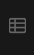

Table Editor section from Supabase panel

在表格编辑器中，您会发现我们的表格已经成功生成。

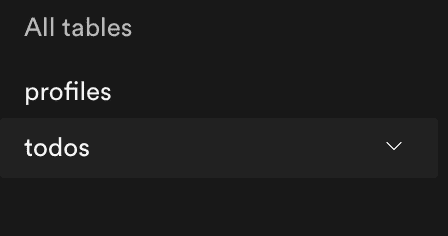

Supabase Table sidebar

正如你在上面的 Todos 脚本中看到的，我们没有启用实时。要启用实时服务器，我们需要转到**数据库>复制**部分。

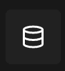

Database section from Supabase panel

在这里，您将看到以下视图:

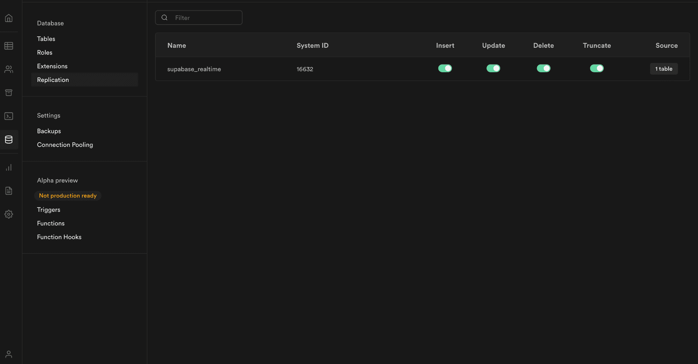

Supabase Database Replication Section

点击 source 下的 **1 table** 按钮，然后切换 todos 开关。它还将为我们的 todos 启用一个实时服务器。

现在假设我们想要禁用 todos **(注意这是不可取的)**的行级安全性，但只是为了在本文的范围内理解如何，我们将禁用它。

转到身份验证部分，并在其中转到策略。

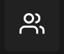

Authentication section from Supabase panel

现在，您将看到绿色框中写有启用 RLS 的 todos 部分。单击此框右上角的禁用 RLS 选项。它将禁用我们的应用程序的行级安全性。

## 如何使用 Supabase 实现登录

如果您需要在将来参考该部分的**代码**时，可以在此**提交**下找到该代码。

[GitHub - Sharvin26/TodoApp-supabase at b253c904f2f39ac80808620cf51c9584bfa90f4dA todoapp built using Supabase, ReactJS, NextJS and Chakra UI - GitHub - Sharvin26/TodoApp-supabase at b253c904f2f39ac80808620cf51c9584bfa90f4dSharvin26GitHub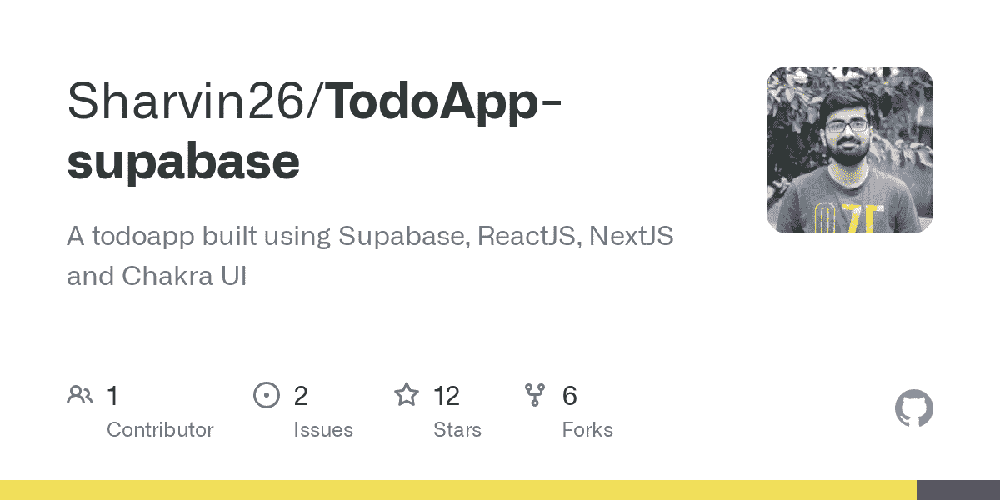](https://github.com/Sharvin26/TodoApp-supabase/tree/b253c904f2f39ac80808620cf51c9584bfa90f4d)

首先，让我们使用以下命令创建我们的应用程序:

```
npx create-next-app todo_app 
```

现在是时候安装我们的依赖项并进行基本配置了。

### 如何安装 Chakra UI

```
npm i @chakra-ui/react @emotion/react@^11 @emotion/styled@^11 framer-motion@^4
```

****注意:**** 如果您使用 zsh，您需要在@后面添加转义符(\)，如下所示:

```
npm i @chakra-ui/react @emotion/react@\^11 @emotion/styled@\^11 framer-motion@\^4 
```

现在让我们通过删除不需要的代码并将 ChakraUI 配置到我们的应用程序中来清理我们的代码。

根据 Chakra 的文档，我们需要在`pages/_app.js`中用`ChakraProvider`包装`<Component />`。转到`_app.js`并复制粘贴以下代码:

```
import { ChakraProvider, extendTheme } from "@chakra-ui/react";
import customTheme from "../lib/theme";

function MyApp({ Component, pageProps }) {
  return (
    <ChakraProvider theme={customTheme}>
      <Component {...pageProps} />
    </ChakraProvider>
  );
}

export default MyApp;
```

_app.js

让我们在根目录下创建一个目录，并将其命名为 **lib** 。在这个目录下，创建一个名为`theme.js`的文件。

将以下代码复制粘贴到该文件中:

```
import { extendTheme } from "@chakra-ui/react"

const config = {
  initialColorMode: "light",
  useSystemColorMode: false,
}

const theme = extendTheme({ config })

export default theme
```

theme.js

现在在 **pages** 目录下，创建一个`_document.js`文件并复制粘贴以下代码:

```
import { ColorModeScript } from "@chakra-ui/react"
import NextDocument, { Html, Head, Main, NextScript } from "next/document"
import theme from "../lib/theme"

export default class Document extends NextDocument {
  render() {
    return (
      <Html lang="en">
        <Head />
        <body>
          {/* 👇 Here's the script */}
          <ColorModeScript initialColorMode={theme.config.initialColorMode} />
          <Main />
          <NextScript />
        </body>
      </Html>
    )
  }
}
```

_document.js

通过创建`_document.js`和`theme.js`，我们已经默认设置我们的颜色为**光**。

从 ChakraUI 版本`1.6.12`开始，它默认设置系统选择的颜色。因此，对于一些为浏览器启用了深色模式的用户来说，应用程序将有一个深色主题。深色模式很好，但是出于开始的目的，我们只希望颜色是浅色的。

转到`index.js`并复制粘贴以下代码:

```
import { Box } from "@chakra-ui/react";
import Head from "next/head";

const Home = () => {
  return (
    <div>
      <Head>
        <title>TodoApp</title>
        <meta
          name="description"
          content="Awesome todoapp to store your awesome todos"
        />
        <link rel="icon" href="/favicon.ico" />
      </Head>
      <main>
        <Box>Hello world</Box>
      </main>
    </div>
  );
};

export default Home;
```

index.js

### 如何安装 Supabase 客户端库

```
npm i @supabase/supabase-js
```

在 **lib** 目录下创建一个名为`client.js`的文件。

在该文件下复制粘贴以下代码:

```
import { createClient } from "@supabase/supabase-js";

const SUPABASE_URL = process.env.NEXT_PUBLIC_SUPABASE_URL;
const SUPBASE_ANON_KEY = process.env.NEXT_PUBLIC_SUPABASE_ANON_KEY;

const client = createClient(SUPABASE_URL, SUPBASE_ANON_KEY);

export { client as supabaseClient };
```

client.js

在这里，我们只是创建一个 **Supabase 客户端**，它将在整个项目中使用。

现在在根目录下创建一个`.env.local`文件，用 Supabase URL 和 anon key 复制粘贴以下部分:

```
NEXT_PUBLIC_SUPABASE_URL=#Add_your_supabase_url 
NEXT_PUBLIC_SUPABASE_ANON_KEY=#Add_your_supabase_key
```

.env.local

你可以在**设置> API** 部分找到 Supabase URL 和 anon key。

项目 API 键下是 **anon** 键，配置下是 **URL** 。

这样，我们的 Supabase 客户端就配置好了，可以使用了。

让我们使用以下命令运行我们的应用程序:

```
npm run dev
```

您将获得以下输出:


Todo App Home Screen

现在在 **pages** 目录下，创建一个名为`signin.js`的文件，并复制粘贴以下代码:

```
import {
  Alert,
  AlertIcon,
  Box,
  Button,
  chakra,
  FormControl,
  FormLabel,
  Heading,
  Input,
  Stack,
  Text,
} from "@chakra-ui/react";
import { useState } from "react";
import { supabaseClient } from "../lib/client";

const SignIn = () => {
  const [email, setEmail] = useState("");
  const [isLoading, setIsLoading] = useState(false);
  const [isSubmitted, setIsSubmitted] = useState(false);
  const [error, setError] = useState(null);

  const submitHandler = async (event) => {
    event.preventDefault();
    setIsLoading(true);
    setError(null);
    try {
      const { error } = await supabaseClient.auth.signIn({
        email,
      });
      if (error) {
        setError(error.message);
      } else {
        setIsSubmitted(true);
      }
    } catch (error) {
      setError(error.message);
    } finally {
      setIsLoading(false);
    }
  };

  const changeHandler = (event) => {
    setEmail(event.target.value);
  };

  return (
    <Box minH="100vh" py="12" px={{ base: "4", lg: "8" }} bg="gray.50">
      <Box maxW="md" mx="auto">
        <Heading textAlign="center" m="6">
          Welcome to Todo App
        </Heading>
        {error && (
          <Alert status="error" mb="6">
            <AlertIcon />
            <Text textAlign="center">{error}</Text>
          </Alert>
        )}
        <Box
          py="8"
          px={{ base: "4", md: "10" }}
          shadow="base"
          rounded={{ sm: "lg" }}
          bg="white"
        >
          {isSubmitted ? (
            <Heading size="md" textAlign="center" color="gray.600">
              Please check {email} for login link
            </Heading>
          ) : (
            <chakra.form onSubmit={submitHandler}>
              <Stack spacing="6">
                <FormControl id="email">
                  <FormLabel>Email address</FormLabel>
                  <Input
                    name="email"
                    type="email"
                    autoComplete="email"
                    required
                    value={email}
                    onChange={changeHandler}
                  />
                </FormControl>
                <Button
                  type="submit"
                  colorScheme="blue"
                  size="lg"
                  fontSize="md"
                  isLoading={isLoading}
                >
                  Sign in
                </Button>
              </Stack>
            </chakra.form>
          )}
        </Box>
      </Box>
    </Box>
  );
};

export default SignIn;
```

signin.js

这里我们创建了一个表单，并使用一个 **supabase auth** 方法让用户登录。

> **注意:**在`supabaseClient.auth.signIn`方法中，当你不传递密码时，它认为认证方法为**魔法链接**。

现在转到`_app.js`并复制粘贴以下代码:

```
import { ChakraProvider } from "@chakra-ui/react";
import { useRouter } from "next/router";
import { useEffect } from "react";
import { supabaseClient } from "../lib/client";
import customTheme from "../lib/theme";

function MyApp({ Component, pageProps }) {
  const router = useRouter();
  const user = supabaseClient.auth.user();

  useEffect(() => {
    const { data: authListener } = supabaseClient.auth.onAuthStateChange(
      (event, session) => {
        handleAuthSession(event, session);
        if (event === "SIGNED_IN") {
          const signedInUser = supabaseClient.auth.user();
          const userId = signedInUser.id;
          supabaseClient
            .from("profiles")
            .upsert({ id: userId })
            .then((_data, error) => {
              if (!error) {
                router.push("/");
              }
            });
        }
        if (event === "SIGNED_OUT") {
          router.push("/signin");
        }
      }
    );

    return () => {
      authListener.unsubscribe();
    };
  }, [router]);

  useEffect(() => {
    if (user) {
      if (router.pathname === "/signin") {
        router.push("/");
      }
    }
  }, [router.pathname, user, router]);

  const handleAuthSession = async (event, session) => {
    await fetch("/api/auth", {
      method: "POST",
      headers: new Headers({ "Content-Type": "application/json" }),
      credentials: "same-origin",
      body: JSON.stringify({ event, session }),
    });
  };

  return (
    <ChakraProvider theme={customTheme}>
      <Component {...pageProps} />
    </ChakraProvider>
  );
}

export default MyApp; 
```

_app.js

现在在 **API** 目录中，删除`hello.js`文件并创建一个名为`auth.js`的新文件。将以下代码复制粘贴到新文件中:

```
import { supabaseClient } from "../../lib/client";

export default function handler(req, res) {
  supabaseClient.auth.api.setAuthCookie(req, res);
} 
```

auth.js

当用户点击这个神奇的链接时，`_app.js`下的代码对于认证是至关重要的。

Supabase 提供了一个监听器方法`auth.onAuthStateChange`，它给出了两个事件`SIGNED_IN`和`SIGNED_OUT`。

我们使用`SIGNED_IN`事件通过调用`/api/auth`来设置 cookie，而`/api/auth`使用了 supabase 公开的另一个方法。这个方法`auth.api.setAuthCookie`对于通过服务器端设置 cookies 很有用。一旦用户通过身份验证，我们会将用户推至`/`页面，所有待办事项都将在此显示。

现在让我们使用`npm run dev`重启我们的服务器，然后转到`http://localhost:3000/signin`。您将看到以下用户界面:

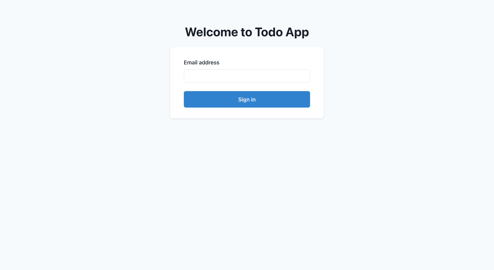

Todo SignIn Page

添加您的电子邮件，然后单击提交按钮。转到电子邮件并点击验证，您将被重定向到`/`页面。

## 如何显示所有待办事项，添加新的待办事项，以及更新和删除待办事项

如果您需要在将来引用此**提交**下的**代码**作为参考。

[GitHub - Sharvin26/TodoApp-supabase at c2d1361b461d301549a813fda350c69a3e23e579A todoapp built using Supabase, ReactJS, NextJS and Chakra UI - GitHub - Sharvin26/TodoApp-supabase at c2d1361b461d301549a813fda350c69a3e23e579Sharvin26GitHub](https://github.com/Sharvin26/TodoApp-supabase/tree/c2d1361b461d301549a813fda350c69a3e23e579)

在实现 Todo crud 操作之前，让我们实现注销功能。转到`index.js`，用以下代码替换现有代码:

```
import Head from "next/head";
import { useRouter } from "next/router";
import { useEffect } from "react";
import Navbar from "../components/Navbar";
import { supabaseClient } from "../lib/client";

const Home = () => {
  const router = useRouter();
  const user = supabaseClient.auth.user();

  useEffect(() => {
    if (!user) {
      router.push("/signin");
    }
  }, [user, router]);

  return (
    <div>
      <Head>
        <title>TodoApp</title>
        <meta
          name="description"
          content="Awesome todoapp to store your awesome todos"
        />
        <link rel="icon" href="/favicon.ico" />
      </Head>
      <main>
        <Navbar />
      </main>
    </div>
  );
};

export default Home; 
```

index.js

在根目录下创建一个**组件**目录，在**组件**目录下创建一个名为`Navbar.js`的文件。将以下内容复制粘贴到该文件下:

```
import { Box, Button, ButtonGroup, Flex, Heading } from "@chakra-ui/react";
import NavLink from "next/link";
import { useRouter } from "next/router";
import { useState } from "react";
import { supabaseClient } from "../lib/client";

const Navbar = () => {
  const router = useRouter();
  const [isLogoutLoading, setIsLogoutLoading] = useState(false);

  const logoutHandler = async () => {
    try {
      setIsLogoutLoading(true);
      await supabaseClient.auth.signOut();
      router.push("/signin");
    } catch (error) {
      router.push("/signin");
    } finally {
      setIsLogoutLoading(false);
    }
  };

  return (
    <Box height="100%" p="5" bg="gray.100">
      <Box maxW="6xl" mx="auto">
        <Flex
          as="nav"
          aria-label="Site navigation"
          align="center"
          justify="space-between"
        >
          <Heading mr="4">TodoApp</Heading>
          <Box>
            <NavLink href="/profile">Profile</NavLink>
            <ButtonGroup spacing="4" ml="6">
              <Button colorScheme="blue">Add Todo</Button>
              <Button
                colorScheme="red"
                onClick={logoutHandler}
                isLoading={isLogoutLoading}
              >
                Logout
              </Button>
            </ButtonGroup>
          </Box>
        </Flex>
      </Box>
    </Box>
  );
};

export default Navbar; 
```

Navbar.js

我们已经创建了一个 navbar 组件，带有一个配置文件链接、添加待办事项按钮和一个注销按钮。

`logoutHandler`使用一个名为`signOut`的 Supabase 方法来清除会话，并让我们退出应用程序。

转到 http://localhost:3000 并点击**注销**按钮。

cookie 将从浏览器中清除，用户将被重定向到**登录**页面。

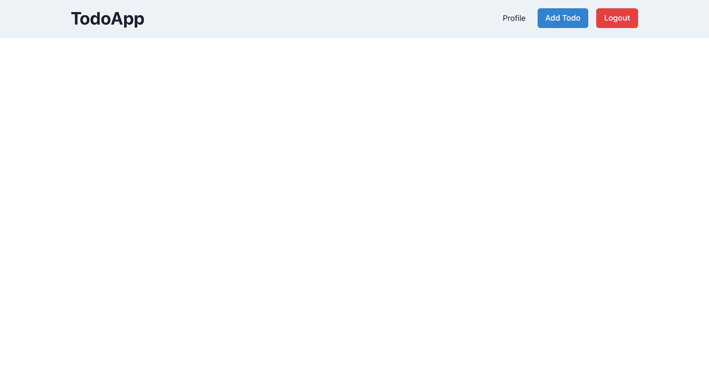

TodoApp Home Page

### 如何添加待办事项

转到`Navbar.js`并复制粘贴以下代码:

```
import { Box, Button, ButtonGroup, Flex, Heading } from "@chakra-ui/react";
import NavLink from "next/link";
import { useRouter } from "next/router";
import { useState } from "react";
import { supabaseClient } from "../lib/client";

const Navbar = ({ onOpen }) => {
  const router = useRouter();
  const [isLogoutLoading, setIsLogoutLoading] = useState(false);

  const logoutHandler = async () => {
    try {
      setIsLogoutLoading(true);
      await supabaseClient.auth.signOut();
      router.push("/signin");
    } catch (error) {
      router.push("/signin");
    } finally {
      setIsLogoutLoading(false);
    }
  };

  return (
    <Box height="100%" p="5" bg="gray.100">
      <Box maxW="6xl" mx="auto">
        <Flex
          as="nav"
          aria-label="Site navigation"
          align="center"
          justify="space-between"
        >
          <Heading mr="4">TodoApp</Heading>
          <Box>
            <NavLink href="/profile">Profile</NavLink>
            <ButtonGroup spacing="4" ml="6">
              <Button colorScheme="blue" onClick={onOpen}>
                Add Todo
              </Button>
              <Button
                colorScheme="red"
                onClick={logoutHandler}
                isLoading={isLogoutLoading}
              >
                Logout
              </Button>
            </ButtonGroup>
          </Box>
        </Flex>
      </Box>
    </Box>
  );
};

export default Navbar; 
```

Navbar.js

这里，我们刚刚为 Add Todo 按钮分配了一个 onClick 处理程序，它将打开一个模态来添加 Todo。

现在在**组件**目录下创建一个名为`ManageTodo.js`的文件，并复制粘贴以下代码:

```
import {
  Alert,
  AlertIcon,
  Button,
  ButtonGroup,
  FormControl,
  FormHelperText,
  FormLabel,
  Input,
  Modal,
  ModalBody,
  ModalCloseButton,
  ModalContent,
  ModalFooter,
  ModalHeader,
  ModalOverlay,
  Switch,
  Text,
  Textarea,
} from "@chakra-ui/react";
import { useState } from "react";
import { supabaseClient } from "../lib/client";

const ManageTodo = ({ isOpen, onClose, initialRef }) => {
  const [title, setTitle] = useState("");
  const [description, setDescription] = useState("");
  const [isComplete, setIsComplete] = useState(false);
  const [isLoading, setIsLoading] = useState("");
  const [errorMessage, setErrorMessage] = useState("");

  const submitHandler = async (event) => {
    event.preventDefault();
    setErrorMessage("");
    if (description.length <= 10) {
      setErrorMessage("Description must have more than 10 characters");
      return;
    }
    setIsLoading(true);
    const user = supabaseClient.auth.user();
    const { error } = await supabaseClient
      .from("todos")
      .insert([{ title, description, isComplete, user_id: user.id }]);
    setIsLoading(false);
    if (error) {
      setErrorMessage(error.message);
    } else {
      closeHandler();
    }
  };

  const closeHandler = () => {
    setTitle("");
    setDescription("");
    setIsComplete(false);
    onClose();
  };

  return (
    <Modal
      isOpen={isOpen}
      onClose={onClose}
      isCentered
      initialFocusRef={initialRef}
    >
      <ModalOverlay />
      <ModalContent>
        <form onSubmit={submitHandler}>
          <ModalHeader>Add Todo</ModalHeader>
          <ModalCloseButton />
          <ModalBody pb={6}>
            {errorMessage && (
              <Alert status="error" borderRadius="lg" mb="6">
                <AlertIcon />
                <Text textAlign="center">{errorMessage}</Text>
              </Alert>
            )}
            <FormControl isRequired={true}>
              <FormLabel>Title</FormLabel>
              <Input
                ref={initialRef}
                placeholder="Add your title here"
                onChange={(event) => setTitle(event.target.value)}
                value={title}
              />
            </FormControl>

            <FormControl mt={4} isRequired={true}>
              <FormLabel>Description</FormLabel>
              <Textarea
                placeholder="Add your description here"
                onChange={(event) => setDescription(event.target.value)}
                value={description}
              />
              <FormHelperText>
                Description must have more than 10 characters.
              </FormHelperText>
            </FormControl>

            <FormControl mt={4}>
              <FormLabel>Is Completed?</FormLabel>
              <Switch
                value={isComplete}
                id="is-completed"
                onChange={(event) => setIsComplete(!isComplete)}
              />
            </FormControl>
          </ModalBody>

          <ModalFooter>
            <ButtonGroup spacing="3">
              <Button
                onClick={closeHandler}
                colorScheme="red"
                type="reset"
                isDisabled={isLoading}
              >
                Cancel
              </Button>
              <Button colorScheme="blue" type="submit" isLoading={isLoading}>
                Save
              </Button>
            </ButtonGroup>
          </ModalFooter>
        </form>
      </ModalContent>
    </Modal>
  );
};

export default ManageTodo; 
```

ManageTodo.js

该部分将负责添加和更新 todos。在这里，我们创建了一个带有表单和 3 个表单控件元素的模型。

一旦提交了表单，我们就用下面的代码调用 supabase 服务器:

```
const { error } = await supabaseClient
      .from("todos")
      .insert([{ title, description, isComplete, user_id: user.id }]);
```

这只是在我们的 supabase 表中插入了一个新的 todo。

现在让我们转到**页的** > `index.js`文件，复制粘贴下面的代码:

```
import { useDisclosure } from "@chakra-ui/hooks";
import Head from "next/head";
import { useRouter } from "next/router";
import { useEffect, useRef } from "react";
import ManageTodo from "../components/ManageTodo";
import Navbar from "../components/Navbar";
import { supabaseClient } from "../lib/client";

const Home = () => {
  const initialRef = useRef();
  const { isOpen, onOpen, onClose } = useDisclosure();

  const router = useRouter();
  const user = supabaseClient.auth.user();

  useEffect(() => {
    if (!user) {
      router.push("/signin");
    }
  }, [user, router]);

  return (
    <div>
      <Head>
        <title>TodoApp</title>
        <meta
          name="description"
          content="Awesome todoapp to store your awesome todos"
        />
        <link rel="icon" href="/favicon.ico" />
      </Head>
      <main>
        <Navbar onOpen={onOpen} />
        <ManageTodo isOpen={isOpen} onClose={onClose} initialRef={initialRef} />
      </main>
    </div>
  );
};

export default Home;
```

index.js

这里我们使用`useDisclosure`脉轮钩来维持模态状态。除此之外，你会看到我们已经将`onOpen`传递给了导航栏，并添加了`ManageTodo`组件。

现在转到`http://localhost:3000`并点击**添加待办事项**按钮。您将看到以下屏幕:

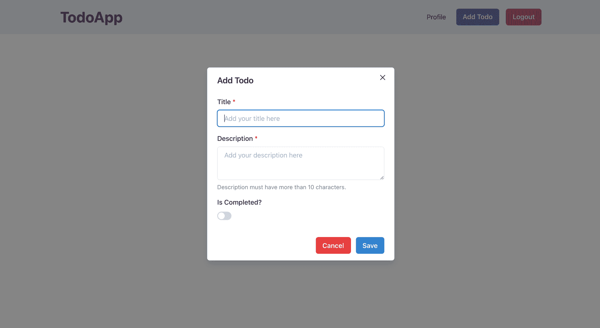

Add Todo Modal

填写表单，单击保存，然后转到 Supabase todos 表。您会发现我们的表格中添加了一个新的 todo。

> **注意:**添加新记录时，Supabase 有时需要手动刷新。

### 如何完成所有待办事项

因此，我们的待办事项已成功添加。现在让我们从 Supabase 表中获取所有 todos。

在**组件**目录下，创建一个名为`SingleTodo.js`的文件，复制粘贴以下代码:

```
import { Box, Divider, Heading, Text, Tag } from "@chakra-ui/react";

const SingleTodo = ({ todo }) => {
  const getDateInMonthDayYear = (date) => {
    const d = new Date(date);
    const options = {
      year: "numeric",
      month: "long",
      day: "numeric",
      hour: "numeric",
      minute: "numeric",
    };
    const n = d.toLocaleDateString("en-US", options);
    const replase = n.replace(new RegExp(",", "g"), " ");
    return replase;
  };

  return (
    <Box
      position="relative"
      maxW="sm"
      borderWidth="1px"
      borderRadius="lg"
      overflow="hidden"
      p="4"
    >
      <Heading size="md" mt="3">{todo.title}</Heading>
      <Tag
        position="absolute"
        top="3"
        right="2"
        bg={todo.isComplete ? "green.500" : "yellow.400"}
        borderRadius="3xl"
        size="sm"
      />
      <Text color="gray.400" mt="1" fontSize="sm">
        {getDateInMonthDayYear(todo.insertedat)}
      </Text>
      <Divider my="4" />
      <Text noOfLines={[1, 2, 3]} color="gray.800">
        {todo.description}
      </Text>
    </Box>
  );
};

export default SingleTodo; 
```

SingleTodo.js

这只是一个带有实用功能的 UI 代码，将日期转换为人类可读的格式。

转到`index.js`，用以下代码替换旧代码:

```
import { useDisclosure } from "@chakra-ui/hooks";
import { Box, SimpleGrid, Text, HStack, Tag } from "@chakra-ui/react";
import Head from "next/head";
import { useRouter } from "next/router";
import { useEffect, useRef, useState } from "react";
import ManageTodo from "../components/ManageTodo";
import Navbar from "../components/Navbar";
import SingleTodo from "../components/SingleTodo";
import { supabaseClient } from "../lib/client";

const Home = () => {
  const initialRef = useRef();
  const [todos, setTodos] = useState([]);

  const router = useRouter();
  const { isOpen, onOpen, onClose } = useDisclosure();
  const user = supabaseClient.auth.user();

  useEffect(() => {
    if (!user) {
      router.push("/signin");
    }
  }, [user, router]);

  useEffect(() => {
    if (user) {
      supabaseClient
        .from("todos")
        .select("*")
        .eq("user_id", user?.id)
        .order("id", { ascending: false })
        .then(({ data, error }) => {
          if (!error) {
            setTodos(data);
          }
        });
    }
  }, [user]);

  useEffect(() => {
    const todoListener = supabaseClient
      .from("todos")
      .on("*", (payload) => {
        const newTodo = payload.new;
        setTodos((oldTodos) => {
          const newTodos = [...oldTodos, newTodo];
          newTodos.sort((a, b) => b.id - a.id);
          return newTodos;
        });
      })
      .subscribe();

    return () => {
      todoListener.unsubscribe();
    };
  }, []);

  return (
    <div>
      <Head>
        <title>TodoApp</title>
        <meta
          name="description"
          content="Awesome todoapp to store your awesome todos"
        />
        <link rel="icon" href="/favicon.ico" />
      </Head>
      <main>
        <Navbar onOpen={onOpen} />
        <ManageTodo isOpen={isOpen} onClose={onClose} initialRef={initialRef} />
        <HStack m="10" spacing="4" justify="center">
          <Box>
            <Tag bg="green.500" borderRadius="3xl" size="sm" mt="1" /> Complete
          </Box>
          <Box>
            <Tag bg="yellow.400" borderRadius="3xl" size="sm" mt="1" />{" "}
            Incomplete
          </Box>
        </HStack>
        <SimpleGrid
          columns={{ base: 2, md: 3, lg: 4 }}
          gap={{ base: "4", md: "6", lg: "8" }}
          m="10"
        >
          {todos.map((todo) => (
            <SingleTodo todo={todo} key={todo.id} />
          ))}
        </SimpleGrid>
      </main>
    </div>
  );
};

export default Home; 
```

index.js

让我们来理解代码。这里我们添加了两个使用效果:

```
 useEffect(() => {
    if (user) {
      supabaseClient
        .from("todos")
        .select("*")
        .eq("user_id", user?.id)
        .order("id", { ascending: false })
        .then(({ data, error }) => {
          if (!error) {
            setTodos(data);
          }
        });
    }
  }, [user]);
```

第一次呈现页面时，此 useEffect 非常有用。我们从 Supabase 表中以降序方式查询该特定用户的数据。

```
 useEffect(() => {
    const todoListener = supabaseClient
      .from("todos")
      .on("*", (payload) => {
        const newTodo = payload.new;
        setTodos((oldTodos) => {
          const newTodos = [...oldTodos, newTodo];
          newTodos.sort((a, b) => b.id - a.id);
          return newTodos;
        });
      })
      .subscribe();

    return () => {
      todoListener.unsubscribe();
    };
  }, []);
```

这种使用效果是与 Supabase 实时服务器的实时订阅。每当添加一个新的 todo 时，我们都会得到一个有效负载事件，用来在本地状态中添加 todo。

> **注意:****Supabase 文档建议不要在服务器端应用上使用实时订阅。**

**现在转到`http://localhost:3000`并添加一个待办事项。您将看到以下视图:**

**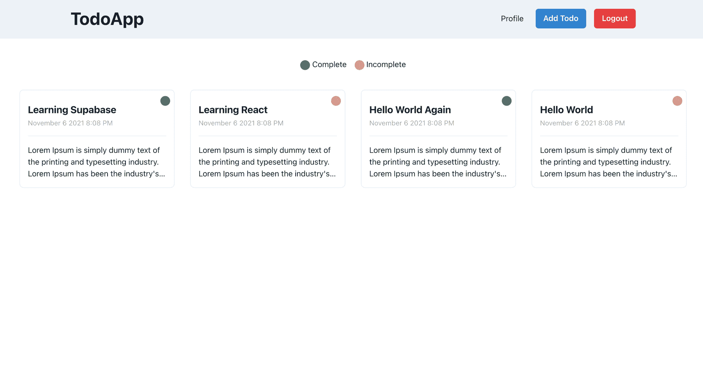

All Todos** 

### **如何更新待办事项**

**对于初学者来说，更新 todo 机制可能很复杂。所以我会尽可能简单地解释这个过程:**

1.  **我们在`index.js`的父组件中创建了一个`todo`状态。当用户单击 SingleTodo 时，此 todo 状态会更新。**
2.  **为此，我们传递了一个`openHandler`函数。该函数用单击的 todo 细节更新 todo 状态，并打开模式。**
3.  **在`ManageTodo.js`中，我们写了一个依赖于`todo`的`useEffect`，每当`todo`改变时，它就更新`title`、`description`和`isComplete`的值。**
4.  **最后我们在`todo id`的基础上使用 Supbase 更新方法更新我们的表中的 todo。**

**是时候实施代码了。在组件目录下，转到`SingleTodo.js`并用以下代码替换代码:**

```
`import { Box, Divider, Heading, Tag, Text } from "@chakra-ui/react";

const SingleTodo = ({ todo, openHandler }) => {
  const getDateInMonthDayYear = (date) => {
    const d = new Date(date);
    const options = {
      year: "numeric",
      month: "long",
      day: "numeric",
      hour: "numeric",
      minute: "numeric",
    };
    const n = d.toLocaleDateString("en-US", options);
    const replase = n.replace(new RegExp(",", "g"), " ");
    return replase;
  };

  return (
    <Box
      position="relative"
      maxW="sm"
      borderWidth="1px"
      borderRadius="lg"
      overflow="hidden"
      p="4"
      onClick={() => openHandler(todo)}
    >
      <Heading size="md" mt="3">
        {todo.title}
      </Heading>
      <Tag
        position="absolute"
        top="3"
        right="2"
        bg={todo.isComplete ? "green.500" : "yellow.400"}
        borderRadius="3xl"
        size="sm"
      />
      <Text color="gray.400" mt="1" fontSize="sm">
        {getDateInMonthDayYear(todo.insertedat)}
      </Text>
      <Divider my="4" />
      <Text noOfLines={[1, 2, 3]} color="gray.800">
        {todo.description}
      </Text>
    </Box>
  );
};

export default SingleTodo;` 
```

**SingleTodo.js**

**在**组件**目录下，转到`ManageTodo.js`，用以下代码替换代码:**

```
`import {
  Alert,
  AlertIcon,
  Button,
  ButtonGroup,
  FormControl,
  FormHelperText,
  FormLabel,
  Input,
  Modal,
  ModalBody,
  ModalCloseButton,
  ModalContent,
  ModalFooter,
  ModalHeader,
  ModalOverlay,
  Switch,
  Text,
  Textarea,
} from "@chakra-ui/react";
import { useEffect, useState } from "react";
import { supabaseClient } from "../lib/client";

const ManageTodo = ({ isOpen, onClose, initialRef, todo, setTodo }) => {
  const [title, setTitle] = useState("");
  const [description, setDescription] = useState("");
  const [isComplete, setIsComplete] = useState(false);
  const [isLoading, setIsLoading] = useState("");
  const [errorMessage, setErrorMessage] = useState("");

  useEffect(() => {
    if (todo) {
      setTitle(todo.title);
      setDescription(todo.description);
      setIsComplete(todo.isComplete);
    }
  }, [todo]);

  const submitHandler = async (event) => {
    event.preventDefault();
    setErrorMessage("");
    if (description.length <= 10) {
      setErrorMessage("Description must have more than 10 characters");
      return;
    }
    setIsLoading(true);
    const user = supabaseClient.auth.user();
    let supabaseError;
    if (todo) {
      const { error } = await supabaseClient
        .from("todos")
        .update({ title, description, isComplete, user_id: user.id })
        .eq("id", todo.id);
      supabaseError = error;
    } else {
      const { error } = await supabaseClient
        .from("todos")
        .insert([{ title, description, isComplete, user_id: user.id }]);
      supabaseError = error;
    }

    setIsLoading(false);
    if (supabaseError) {
      setErrorMessage(supabaseError.message);
    } else {
      closeHandler();
    }
  };

  const closeHandler = () => {
    setTitle("");
    setDescription("");
    setIsComplete(false);
    setTodo(null);
    onClose();
  };

  return (
    <Modal
      isOpen={isOpen}
      onClose={onClose}
      isCentered
      initialFocusRef={initialRef}
    >
      <ModalOverlay />
      <ModalContent>
        <form onSubmit={submitHandler}>
          <ModalHeader>{todo ? "Update Todo" : "Add Todo"}</ModalHeader>
          <ModalCloseButton onClick={closeHandler} />
          <ModalBody pb={6}>
            {errorMessage && (
              <Alert status="error" borderRadius="lg" mb="6">
                <AlertIcon />
                <Text textAlign="center">{errorMessage}</Text>
              </Alert>
            )}
            <FormControl isRequired={true}>
              <FormLabel>Title</FormLabel>
              <Input
                ref={initialRef}
                placeholder="Add your title here"
                onChange={(event) => setTitle(event.target.value)}
                value={title}
              />
            </FormControl>

            <FormControl mt={4} isRequired={true}>
              <FormLabel>Description</FormLabel>
              <Textarea
                placeholder="Add your description here"
                onChange={(event) => setDescription(event.target.value)}
                value={description}
              />
              <FormHelperText>
                Description must have more than 10 characters.
              </FormHelperText>
            </FormControl>

            <FormControl mt={4}>
              <FormLabel>Is Completed?</FormLabel>
              <Switch
                isChecked={isComplete}
                id="is-completed"
                onChange={(event) => setIsComplete(!isComplete)}
              />
            </FormControl>
          </ModalBody>

          <ModalFooter>
            <ButtonGroup spacing="3">
              <Button
                onClick={closeHandler}
                colorScheme="red"
                type="reset"
                isDisabled={isLoading}
              >
                Cancel
              </Button>
              <Button colorScheme="blue" type="submit" isLoading={isLoading}>
                {todo ? "Update" : "Save"}
              </Button>
            </ButtonGroup>
          </ModalFooter>
        </form>
      </ModalContent>
    </Modal>
  );
};

export default ManageTodo;` 
```

**ManageTodo.js**

**我们来理解一下上面的代码。这里我们检查用户是否点击了更新按钮(通过检查 todo 是否存在),然后在初始对象中显示数据。**

**根据条件，在按钮上显示更新文本而不是保存文本。同样，基于条件，如果 todo 存在，我们执行 supabase update，如果不存在，则插入。**

**转到**页面> index.js** ，用以下代码替换现有代码:**

```
`import { useDisclosure } from "@chakra-ui/hooks";
import { Box, HStack, SimpleGrid, Tag } from "@chakra-ui/react";
import Head from "next/head";
import { useRouter } from "next/router";
import { useEffect, useRef, useState } from "react";
import ManageTodo from "../components/ManageTodo";
import Navbar from "../components/Navbar";
import SingleTodo from "../components/SingleTodo";
import { supabaseClient } from "../lib/client";

const Home = () => {
  const initialRef = useRef();
  const [todos, setTodos] = useState([]);
  const [todo, setTodo] = useState(null);

  const router = useRouter();
  const { isOpen, onOpen, onClose } = useDisclosure();
  const user = supabaseClient.auth.user();

  useEffect(() => {
    if (!user) {
      router.push("/signin");
    }
  }, [user, router]);

  useEffect(() => {
    if (user) {
      supabaseClient
        .from("todos")
        .select("*")
        .eq("user_id", user?.id)
        .order("id", { ascending: false })
        .then(({ data, error }) => {
          if (!error) {
            setTodos(data);
          }
        });
    }
  }, [user]);

  useEffect(() => {
    const todoListener = supabaseClient
      .from("todos")
      .on("*", (payload) => {
        const newTodo = payload.new;
        setTodos((oldTodos) => {
          const exists = oldTodos.find((todo) => todo.id === newTodo.id);
          let newTodos;
          if (exists) {
            const oldTodoIndex = oldTodos.findIndex(
              (obj) => obj.id === newTodo.id
            );
            oldTodos[oldTodoIndex] = newTodo;
            newTodos = oldTodos;
          } else {
            newTodos = [...oldTodos, newTodo];
          }
          newTodos.sort((a, b) => b.id - a.id);
          return newTodos;
        });
      })
      .subscribe();

    return () => {
      todoListener.unsubscribe();
    };
  }, []);

  const openHandler = (clickedTodo) => {
    setTodo(clickedTodo);
    onOpen();
  };

  return (
    <div>
      <Head>
        <title>TodoApp</title>
        <meta
          name="description"
          content="Awesome todoapp to store your awesome todos"
        />
        <link rel="icon" href="/favicon.ico" />
      </Head>
      <main>
        <Navbar onOpen={onOpen} />
        <ManageTodo
          isOpen={isOpen}
          onClose={onClose}
          initialRef={initialRef}
          todo={todo}
          setTodo={setTodo}
        />
        <HStack m="10" spacing="4" justify="center">
          <Box>
            <Tag bg="green.500" borderRadius="3xl" size="sm" mt="1" /> Complete
          </Box>
          <Box>
            <Tag bg="yellow.400" borderRadius="3xl" size="sm" mt="1" />{" "}
            Incomplete
          </Box>
        </HStack>
        <SimpleGrid
          columns={{ base: 2, md: 3, lg: 4 }}
          gap={{ base: "4", md: "6", lg: "8" }}
          m="10"
        >
          {todos.map((todo) => (
            <SingleTodo todo={todo} key={todo.id} openHandler={openHandler} />
          ))}
        </SimpleGrid>
      </main>
    </div>
  );
};

export default Home;`
```

**index.js**

**在这里，我们添加我们创建的`ManageTodo`组件，并传递该组件使用的属性。**

**现在转到`http://localhost:3000`并点击任何待办事项来更新它，您将看到以下视图:**

**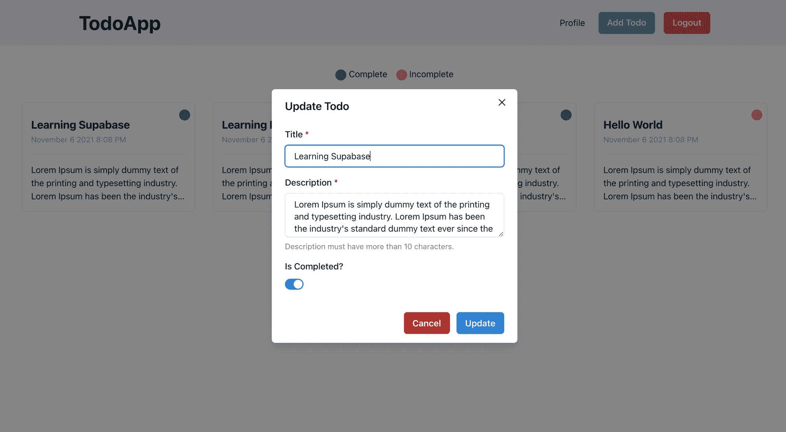

Update Todo** 

### **如何删除待办事项**

**这项功能将需要我们更新我们的一些现有的代码。首先我们会这样做，然后理解它是如何工作的，为什么需要改变。**

**转到**组件**目录中的`SingleTodo.js`，用以下代码替换现有代码:**

```
`import {
  Box,
  Divider,
  Heading,
  Tag,
  Text,
  Button,
  Center,
} from "@chakra-ui/react";

const SingleTodo = ({ todo, openHandler, deleteHandler, isDeleteLoading }) => {
  const getDateInMonthDayYear = (date) => {
    const d = new Date(date);
    const options = {
      year: "numeric",
      month: "long",
      day: "numeric",
      hour: "numeric",
      minute: "numeric",
    };
    const n = d.toLocaleDateString("en-US", options);
    const replase = n.replace(new RegExp(",", "g"), " ");
    return replase;
  };

  return (
    <Box
      position="relative"
      maxW="sm"
      borderWidth="1px"
      borderRadius="lg"
      overflow="hidden"
      p="4"
      onClick={() => openHandler(todo)}
    >
      <Heading size="md" mt="3">
        {todo.title}
      </Heading>
      <Tag
        position="absolute"
        top="3"
        right="2"
        bg={todo.isComplete ? "green.500" : "yellow.400"}
        borderRadius="3xl"
        size="sm"
      />
      <Text color="gray.400" mt="1" fontSize="sm">
        {getDateInMonthDayYear(todo.insertedat)}
      </Text>
      <Divider my="4" />
      <Text noOfLines={[1, 2, 3]} color="gray.800">
        {todo.description}
      </Text>
      <Center>
        <Button
          mt="4"
          size="sm"
          colorScheme="red"
          onClick={(event) => {
            event.stopPropagation();
            deleteHandler(todo.id);
          }}
          isDisabled={isDeleteLoading}
        >
          Delete
        </Button>
      </Center>
    </Box>
  );
};

export default SingleTodo;`
```

**SingleTodo.js**

**这里我们添加了一个带有 onClick 事件的删除按钮。现在这个删除事件在另一个打开模式的事件下。所以每当我们点击删除，它也会打开模式。**

**我们不希望出现这种情况，所以我们使用了来自`event`的一个名为`stopPropagation`的方法。此方法不允许将子级的事件传递给父级。**

**现在转到**页面**目录中的`index.js`，用下面的代码替换现有代码:**

```
`import { useDisclosure } from "@chakra-ui/hooks";
import { Box, HStack, SimpleGrid, Tag } from "@chakra-ui/react";
import Head from "next/head";
import { useRouter } from "next/router";
import { useEffect, useRef, useState } from "react";
import ManageTodo from "../components/ManageTodo";
import Navbar from "../components/Navbar";
import SingleTodo from "../components/SingleTodo";
import { supabaseClient } from "../lib/client";

const Home = () => {
  const initialRef = useRef();
  const [todos, setTodos] = useState([]);
  const [todo, setTodo] = useState(null);
  const [isDeleteLoading, setIsDeleteLoading] = useState(false);

  const router = useRouter();
  const { isOpen, onOpen, onClose } = useDisclosure();
  const user = supabaseClient.auth.user();

  useEffect(() => {
    if (!user) {
      router.push("/signin");
    }
  }, [user, router]);

  useEffect(() => {
    if (user) {
      supabaseClient
        .from("todos")
        .select("*")
        .eq("user_id", user?.id)
        .order("id", { ascending: false })
        .then(({ data, error }) => {
          if (!error) {
            setTodos(data);
          }
        });
    }
  }, [user]);

  useEffect(() => {
    const todoListener = supabaseClient
      .from("todos")
      .on("*", (payload) => {
        if (payload.eventType !== "DELETE") {
          const newTodo = payload.new;
          setTodos((oldTodos) => {
            const exists = oldTodos.find((todo) => todo.id === newTodo.id);
            let newTodos;
            if (exists) {
              const oldTodoIndex = oldTodos.findIndex(
                (obj) => obj.id === newTodo.id
              );
              oldTodos[oldTodoIndex] = newTodo;
              newTodos = oldTodos;
            } else {
              newTodos = [...oldTodos, newTodo];
            }
            newTodos.sort((a, b) => b.id - a.id);
            return newTodos;
          });
        }
      })
      .subscribe();

    return () => {
      todoListener.unsubscribe();
    };
  }, []);

  const openHandler = (clickedTodo) => {
    setTodo(clickedTodo);
    onOpen();
  };

  const deleteHandler = async (todoId) => {
    setIsDeleteLoading(true);
    const { error } = await supabaseClient
      .from("todos")
      .delete()
      .eq("id", todoId);
    if (!error) {
      setTodos(todos.filter((todo) => todo.id !== todoId));
    }
    setIsDeleteLoading(false);
  };

  return (
    <div>
      <Head>
        <title>TodoApp</title>
        <meta
          name="description"
          content="Awesome todoapp to store your awesome todos"
        />
        <link rel="icon" href="/favicon.ico" />
      </Head>
      <main>
        <Navbar onOpen={onOpen} />
        <ManageTodo
          isOpen={isOpen}
          onClose={onClose}
          initialRef={initialRef}
          todo={todo}
          setTodo={setTodo}
        />
        <HStack m="10" spacing="4" justify="center">
          <Box>
            <Tag bg="green.500" borderRadius="3xl" size="sm" mt="1" /> Complete
          </Box>
          <Box>
            <Tag bg="yellow.400" borderRadius="3xl" size="sm" mt="1" />{" "}
            Incomplete
          </Box>
        </HStack>
        <SimpleGrid
          columns={{ base: 2, md: 3, lg: 4 }}
          gap={{ base: "4", md: "6", lg: "8" }}
          m="10"
        >
          {todos.map((todo, index) => (
            <SingleTodo
              todo={todo}
              key={index}
              openHandler={openHandler}
              deleteHandler={deleteHandler}
              isDeleteLoading={isDeleteLoading}
            />
          ))}
        </SimpleGrid>
      </main>
    </div>
  );
};

export default Home;`
```

**index.js**

**我们先来了解一下`deleteHandler`的方法。在这个方法中，我们使用 Supabase 客户端从 **todos** 表中删除一条记录。一旦成功删除，我们使用`filter`方法从本地状态中删除 todo。**

**对于具有`todoListener`的 useEffect，我们基于一个`event`类型添加了一个`if`条件。我们不想对`DELETE`事件做任何事情，因为我们正在更新`deleteHandler`的本地状态。**

**转到`http://localhost:3000`，您将看到以下视图:**

**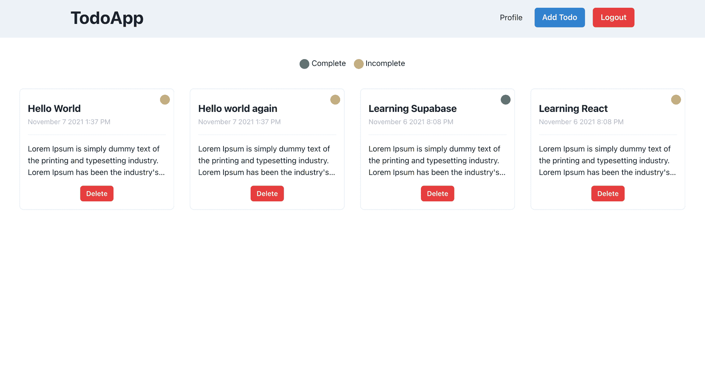**

**点击**删除**按钮，你会看到待办事项从我们的待办事项视图中消失了。**

**至此，我们已经完成了 **TODO CRUD** 操作流程。**

## **如何更新个人资料和头像**

**该提交下有**配置文件更新操作** **代码**，如果您以后需要参考的话。**

**[GitHub - Sharvin26/TodoApp-supabase at fb7055b83c847709cb6cc5c6aa26553ecee4026fA todoapp built using Supabase, ReactJS, NextJS and Chakra UI - GitHub - Sharvin26/TodoApp-supabase at fb7055b83c847709cb6cc5c6aa26553ecee4026fSharvin26GitHub](https://github.com/Sharvin26/TodoApp-supabase/tree/fb7055b83c847709cb6cc5c6aa26553ecee4026f)**

**在处理个人资料部分之前，我们必须将我们的 **TodoApp** 标题作为一条路线，这样我们就可以从个人资料页面返回到主页。**

**在组件目录下的`Navbar.js`中，用以下代码替换现有代码:**

```
`import { Box, Button, ButtonGroup, Flex, Heading } from "@chakra-ui/react";
import NavLink from "next/link";
import { useRouter } from "next/router";
import { useState } from "react";
import { supabaseClient } from "../lib/client";

const Navbar = ({ onOpen }) => {
  const router = useRouter();
  const [isLogoutLoading, setIsLogoutLoading] = useState(false);

  const logoutHandler = async () => {
    try {
      setIsLogoutLoading(true);
      await supabaseClient.auth.signOut();
      router.push("/signin");
    } catch (error) {
      router.push("/signin");
    } finally {
      setIsLogoutLoading(false);
    }
  };

  return (
    <Box height="100%" p="5" bg="gray.100">
      <Box maxW="6xl" mx="auto">
        <Flex
          as="nav"
          aria-label="Site navigation"
          align="center"
          justify="space-between"
        >
          <NavLink href="/">
            <Heading mr="4" as="button">
              TodoApp
            </Heading>
          </NavLink>
          <Box>
            <NavLink href="/profile">Profile</NavLink>
            <ButtonGroup spacing="4" ml="6">
              {router.pathname === "/" && (
                <Button colorScheme="blue" onClick={onOpen}>
                  Add Todo
                </Button>
              )}
              <Button
                colorScheme="red"
                onClick={logoutHandler}
                isLoading={isLogoutLoading}
              >
                Logout
              </Button>
            </ButtonGroup>
          </Box>
        </Flex>
      </Box>
    </Box>
  );
};

export default Navbar;`
```

**Navbar.js**

**让我们开始构建应用程序的最后一部分，即个人资料部分。这一部分将有一个表格，可以更新用户名，网站，简历和头像。**

**为了存储我们的照片，我们将使用 Supabase 存储。默认情况下，这些存储桶是私有的，可以使用令牌来访问。但是为了这篇文章，我们将公开这个桶。但是，如果您存储任何敏感信息，请确保该存储桶是私有的。**

**转到[https://app.supabase.io/](https://app.supabase.io/)并转到存储选项卡。在那里，您会看到所有存储桶下列出了`avatars`。**

**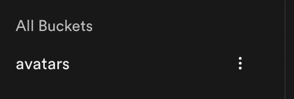**

**点击三个点，选择**公开**选项。**

**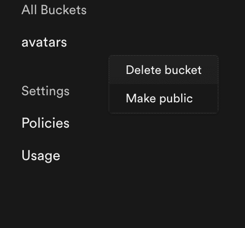**

**回到我们的代码:在**页面的**目录下创建一个名为`profile.js`的文件，并复制粘贴下面的代码:**

```
`import {
  Avatar,
  Box,
  Button,
  Flex,
  FormControl,
  FormLabel,
  Input,
  Stack,
  Textarea,
} from "@chakra-ui/react";
import { useEffect, useState } from "react";
import Navbar from "../components/Navbar";
import { supabaseClient } from "../lib/client";

const Profile = () => {
  const [email, setEmail] = useState("");
  const [username, setUsername] = useState("");
  const [website, setWebsite] = useState("");
  const [bio, setBio] = useState("");
  const [avatarurl, setAvatarurl] = useState("");

  const [isLoading, setIsLoading] = useState(false);
  const [isImageUploadLoading, setIsImageUploadLoading] = useState(false);

  const user = supabaseClient.auth.user();

  useEffect(() => {
    if (user) {
      setEmail(user.email);
      supabaseClient
        .from("profiles")
        .select("*")
        .eq("id", user.id)
        .then(({ data, error }) => {
          if (!error) {
            setUsername(data[0].username || "");
            setWebsite(data[0].website || "");
            setBio(data[0].bio || "");
            setAvatarurl(data[0].avatarurl || "");
          }
        });
    }
  }, [user]);

  const updateHandler = async (event) => {
    event.preventDefault();
    setIsLoading(true);
    const body = { username, website, bio };
    const userId = user.id;
    const { error } = await supabaseClient
      .from("profiles")
      .update(body)
      .eq("id", userId);
    if (!error) {
      setUsername(body.username);
      setWebsite(body.website);
      setBio(body.bio);
    }
    setIsLoading(false);
  };

  function makeid(length) {
    let result = "";
    const characters =
      "ABCDEFGHIJKLMNOPQRSTUVWXYZabcdefghijklmnopqrstuvwxyz0123456789";
    const charactersLength = characters.length;
    for (var i = 0; i < length; i++) {
      result += characters.charAt(Math.floor(Math.random() * charactersLength));
    }
    return result;
  }

  const uploadHandler = async (event) => {
    setIsImageUploadLoading(true);
    const avatarFile = event.target.files[0];
    const fileName = makeid(10);

    const { error } = await supabaseClient.storage
      .from("avatars")
      .upload(fileName, avatarFile, {
        cacheControl: "3600",
        upsert: false,
      });
    if (error) {
      setIsImageUploadLoading(false);
      console.log("error", error);
      return;
    }
    const { publicURL, error: publicURLError } = supabaseClient.storage
      .from("avatars")
      .getPublicUrl(fileName);
    if (publicURLError) {
      setIsImageUploadLoading(false);
      console.log("publicURLError", publicURLError);
      return;
    }
    const userId = user.id;
    await supabaseClient
      .from("profiles")
      .update({
        avatarurl: publicURL,
      })
      .eq("id", userId);
    setAvatarurl(publicURL);
    setIsImageUploadLoading(false);
  };

  return (
    <Box>
      <Navbar />
      <Box mt="8" maxW="xl" mx="auto">
        <Flex align="center" justify="center" direction="column">
          <Avatar
            size="2xl"
            src={avatarurl || ""}
            name={username || user?.email}
          />
          <FormLabel
            htmlFor="file-input"
            my="5"
            borderRadius="2xl"
            borderWidth="1px"
            textAlign="center"
            p="2"
            bg="blue.400"
            color="white"
          >
            {isImageUploadLoading ? "Uploading....." : "Upload Profile Picture"}
          </FormLabel>
          <Input
            type="file"
            hidden
            id="file-input"
            onChange={uploadHandler}
            multiple={false}
            disabled={isImageUploadLoading}
          />
        </Flex>
        <Stack
          borderWidth="1px"
          borderRadius="lg"
          overflow="hidden"
          p={5}
          mt="-2"
          spacing="4"
          as="form"
          onSubmit={updateHandler}
        >
          <FormControl id="email" isRequired>
            <FormLabel>Email</FormLabel>
            <Input type="email" isDisabled={true} value={email} />
          </FormControl>
          <FormControl id="username" isRequired>
            <FormLabel>Username</FormLabel>
            <Input
              placeholder="Add your username here"
              type="text"
              value={username}
              onChange={(event) => setUsername(event.target.value)}
            />
          </FormControl>
          <FormControl id="website" isRequired>
            <FormLabel>Website URL</FormLabel>
            <Input
              placeholder="Add your website here"
              type="url"
              value={website}
              onChange={(event) => setWebsite(event.target.value)}
            />
          </FormControl>
          <FormControl id="bio" isRequired>
            <FormLabel>Bio</FormLabel>
            <Textarea
              placeholder="Add your bio here"
              value={bio}
              onChange={(event) => setBio(event.target.value)}
            />
          </FormControl>
          <Button colorScheme="blue" type="submit" isLoading={isLoading}>
            Update
          </Button>
        </Stack>
      </Box>
    </Box>
  );
};

export default Profile;`
```

**profile.js**

**这里我们有 4 个`FormControl`元素，如果存在一个值，每个元素都会被预先填充。这是可能的，因为 on render `useEffect`运行时使用 Supabase 客户端从`auth`和`profiles`表中获取用户记录。**

****注意:**授权表由 Supabase 维护，可通过客户端使用以下命令进行访问:**

```
`supabase.auth.user()`
```

**除了图像，其他记录可以使用`updateHandler`功能更新。该功能使用`id`更新用户记录。**

**`uploadHandler`函数负责将图像上传到存储桶，并根据`id`为记录设置 profiles 表中的`avatarurl`。**

**Supabase 的`upload`方法上传图片，而`getPublicUrl`方法给我们一个图片的公共 URL。我们使用`from('profiles').update`方法来更新记录。**

**访问`http://localhost:3000`并点击个人资料链接。您将看到以下视图:**

**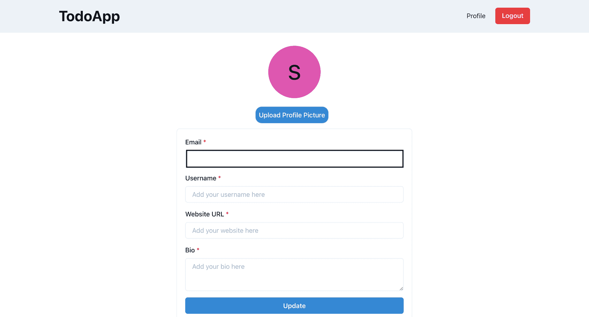**

**现在，您可以使用 update 方法来更新您的用户名、网站 URL 和个人资料。**

**这样，我们的 TodoApp 就完成了，可以投入生产了。**

## **如何将应用程序部署到 Vercel 并配置 Supabase 身份验证**

**在 Vercel 上部署应用程序之前，我们需要运行`npm run build`命令并检查终端输出，看看是否有错误。**

**在 Vercel 上配置应用程序有两种方式:**

1.  **使用 [Vercel npm 库](https://www.npmjs.com/package/vercel)并将代码本地推送到 Vercel 服务器**
2.  **将 Vercel bot 连接到 GitHub 存储库。**

**我将使用第二种方法。**

**你需要在 GitHub 上创建一个存储库，然后把代码推到那里。**

**如果你还没有在 Vercel 上创建账户，那么你可以去[https://vercel.com/](https://vercel.com/)点击注册按钮。**

**创建帐户后，您将被引导至如下所示的控制面板:**

**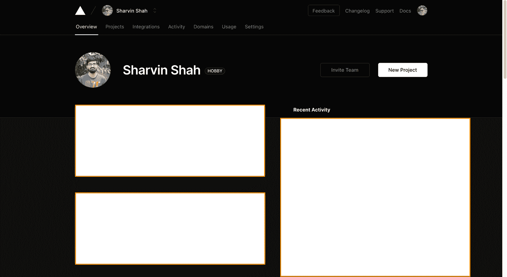

Vercel Dashboard** 

**点击 ****新建项目**** 按钮。它会要求你安装 Vercel 机器人和权限。**

******注意:**** 你可以允许 Vercel bot 从你的 GitHub 账号中读取所有的存储库，或者对当前创建的存储库给予权限。**

**在上面创建的 GitHub 存储库上点击 **Import** 按钮:**

**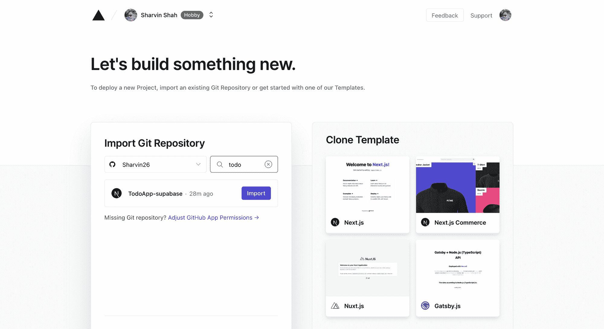

Vercel Import Project from Github** 

**现在它会问你是否想创建一个团队。团队是**职业计划**的一个特色。默认情况下，Vercel 在**爱好计划**下。现在我将跳过它。**

**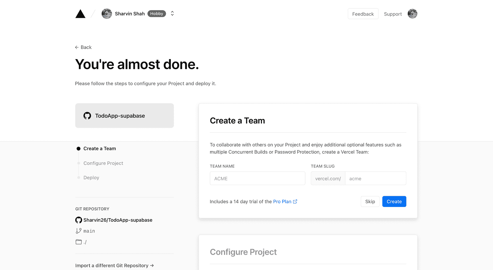

Vercel Create Team** 

**现在您需要添加环境变量。从`.env.local`开始添加。**

**单击环境变量前面的折叠面板，并在那里添加变量，如下所示:**

**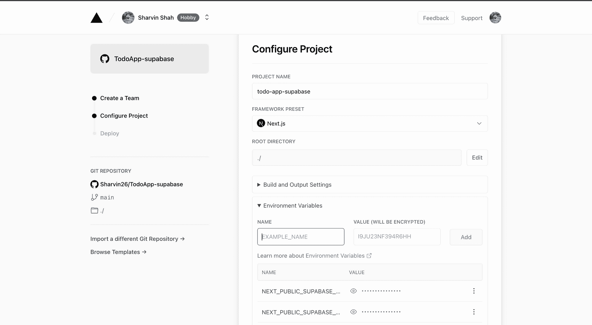

Vercel Configure Env and Build Settings** 

**添加后，单击 Deploy 按钮。部署成功后，您将看到以下屏幕:**

**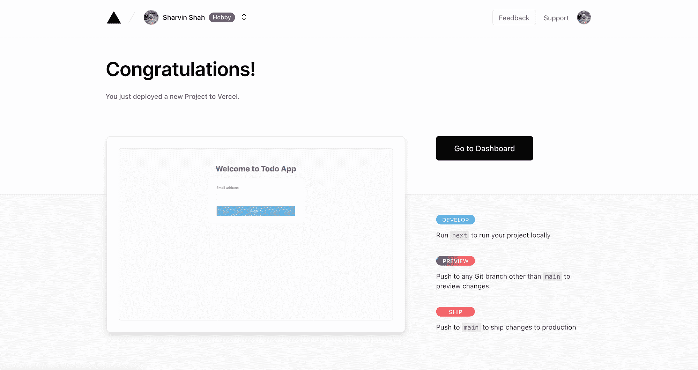

Vercel Deployment Success** 

**现在点击显示您的应用程序的灰色方框。它会将您重定向到一个页面，在那里您可以找到为您的应用程序预先配置的域。**

**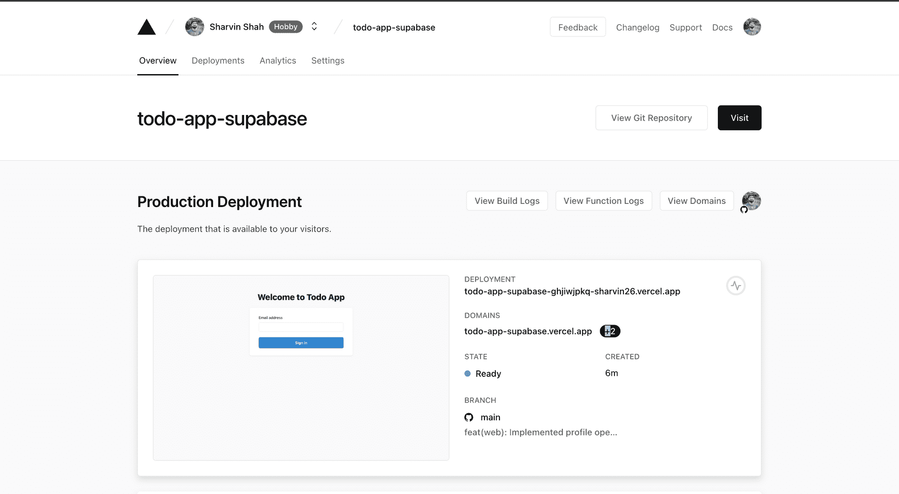

Vercel Project Overview** 

**是的，vercel 提供子域名，我们也可以为其设置自定义域名。现在我们将使用 Vercel 域。复制 Domains 部分下的第一个域，并转到您的 Supabase 项目。**

**进入**认证>设置**，将**站点 URL** 和**附加重定向 URL**更新到复制的 URL(确保在复制的 URL 前添加`https://`):**

**

Supabase Authentication Settings** 

**这样，我们就创建了生产就绪的 todo 应用程序。如果你已经按照教程开发了这个应用程序，那么恭喜你取得了这个成就。**

## **感谢您的阅读！**

**请随时在 [Twitter](https://twitter.com/sharvinshah26) 和 [Github](https://github.com/Sharvin26) 上联系我。**

**如果你想开发什么项目，或者想找我咨询，可以在我的 Twitter 上给我发 DM(@ sharvinshah 26)。**