# 如何使用 Flask 构建 web 应用程序并将其部署到云中

> 原文：<https://www.freecodecamp.org/news/how-to-build-a-web-application-using-flask-and-deploy-it-to-the-cloud-3551c985e492/>

萨尔瓦多·维拉隆

### **简介**

在每一部分中，我将展示一些代码供您遵循。教程中使用的所有代码都可以在这个 [GitHub 资源库](https://github.com/salvillalon45/SPGISummer2018-FlaskTutorial)中找到。

## HTTP 是什么，和 Flask 有什么关系？

HTTP 是网站的协议。互联网使用它与计算机和服务器进行交互和通信。让我给你一个日常使用的例子。

当您在浏览器的地址栏中键入网站名称并按回车键时。发生的情况是一个 HTTP 请求被发送到一个服务器。

例如，当我去我的地址栏输入 google.com，然后按回车键，一个 HTTP 请求被发送到谷歌服务器。Google 服务器接收请求，并需要知道如何解释该请求。Google 服务器发回一个 HTTP 响应，其中包含我的 web 浏览器收到的信息。然后，它会在浏览器的一个页面上显示您请求的内容。

### Flask 是怎么牵扯进来的？

我们将编写负责服务器端处理的代码。我们的代码将接收请求。它将弄清楚这些请求在处理什么，以及它们在问什么。它还会计算出向用户发送什么样的响应。

为了做到这一切，我们将使用烧瓶。

## 烧瓶是什么？

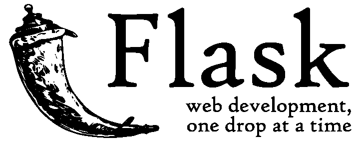

[Flask (A Python Microframework)](http://flask.pocoo.org/)

它使得设计 web 应用程序的过程更加简单。Flask 让我们关注****用户在请求什么，以及给出什么样的响应。****

**了解更多关于[微框架](https://en.wikipedia.org/wiki/Microframework)的信息。**

## **Flask App 是如何工作的？**

**这些代码让我们可以运行一个基本的 web 应用程序，就像它是一个网站一样。**

```
`from flask import Flask

app = Flask(__name__)

@app.route("/")
def home():
    return "Hello, World!"

if __name__ == "__main__":
    app.run(debug=True)`
```

**这段代码存储在我们的 main.py 中。**

****第 1 行:**这里我们导入 Flask 模块，并从 Flask 模块创建 Flask web 服务器。**

****第 3 行:__name__ 表示这个当前文件**。在这种情况下，它将是 main.py。这个当前文件将代表我的 web 应用程序。**

**我们正在创建 Flask 类的一个实例，并将其命名为 app。这里我们正在创建一个新的 web 应用程序。**

****第 5 行:**表示默认页面。举个例子，如果我去了一个网站，比如“google.com/”,在斜杠后面什么都没有。那么这将是谷歌的默认页面。**

**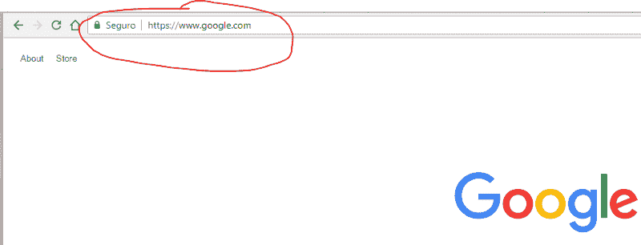

This is what the @app.route(“/”) will represent** 

****第 6–7 行**:当用户访问我的网站并进入默认页面(斜线后无内容)时，下面的功能将被激活。**

****第 9 行:**当您运行您的 Python 脚本时，Python 会在执行时给脚本分配名称“__main__”。**

**如果我们导入另一个脚本， **if 语句将阻止其他脚本运行。**当我们运行 main.py 时，它会将其名称改为 __main__，然后 if 语句才会激活。**

**第 10 行:这将运行应用程序。拥有`debug=True`允许可能的 Python 错误出现在网页上。这将有助于我们跟踪错误。**

### ****让我们试试运行 main.py****

**在你的终端或者命令提示符下进入包含你的主文件夹，然后做`**py main.py**`或者`**python main.py**` **。在您的终端或命令提示符下，您应该会看到以下输出。****

**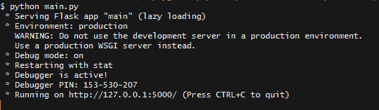**

**重要的部分是它说`Running on http://127.0.0.1:5000/`的地方。**

**127.0.0.1 表示这台本地计算机。如果你不知道这是什么意思(就像我开始时不知道一样— [这篇文章真的很有帮助](https://whatismyipaddress.com/localhost))，主要意思是 127.0.0.1 和 localhost 指的是这台本地计算机。**

**转到该地址，您应该会看到以下内容:**

**

Congrats! You made a website with Flask!** 

#### ****烧瓶带来更多乐趣****

**前面您看到了当我们用一个路由 app . route(“/”)运行 main.py 时会发生什么。**

**让我们添加更多的路线，这样您就可以看到不同之处。**

```
`from flask import Flask

app = Flask(__name__)

@app.route("/")
def home():
    return "Hello, World!"

@app.route("/salvador")
def salvador():
    return "Hello, Salvador"

if __name__ == "__main__":
    app.run(debug=True)`
```

**在**第 9–11 行**中。我们增加了一条新路线，这次是去**/萨尔瓦多。****

**现在再次运行 main.py，转到**[http://localhost:5000/Salvador](http://localhost:5000/salvador)。****

****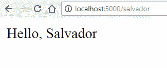****

****到目前为止，我们一直在回短信。让我们通过添加 HTML 和 CSS 使我们的网站看起来更好。****

## ****HTML、CSS 和虚拟环境****

### ****烧瓶中的 HTML 和模板****

****首先创建一个新的 HTML 文件。我把我的名字叫做 home.html。****

****下面是一些帮助您入门的代码。****

```
**`<!DOCTYPE html>
<html lang="en" dir="ltr">
  <head>
    <meta charset="utf-8">
    <title>Flask Tutorial</title>
  </head>
  <body>
    <h1> My First Try Using Flask </h1>
    <p> Flask is Fun </p>
  </body>
</html>`**
```

#### ******需要记住的要点******

****Flask 框架在名为 **templates 的文件夹中寻找 HTML 文件。**你**需要创建一个模板**文件夹，把你所有的 HTML 文件放在那里。****

****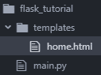

Remember to always keep the main.py outside of your templates folder**** 

****现在我们需要更改 main.py，这样我们就可以查看我们创建的 HTML 文件。****

```
**`from flask import Flask, render_template      

app = Flask(__name__)

@app.route("/")
def home():
    return render_template("home.html")

@app.route("/salvador")
def salvador():
    return "Hello, Salvador"

if __name__ == "__main__":
    app.run(debug=True)
  We made two new changes`**
```

******第 1 行:**我们从烧瓶框架中导入了`render_template()`方法。`render_template()`在模板文件夹中查找模板(HTML 文件)。然后，它将呈现您所要求的模板。了解更多关于 [render_templates()函数](http://flask.pocoo.org/docs/0.12/quickstart/#rendering-templates)。****

******第 7 行:**我们改变了返回结果，现在它返回`render_template(“home.html”)`。这将让我们查看我们的 HTML 文件。****

****现在访问您的本地主机并查看更改: [http://localhost:5000/](http://localhost:5000/) 。****

****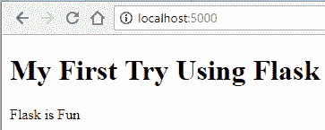****

### ******让我们添加更多的页面******

****让我们在**模板文件夹中创建一个**about.html**。******

```
`<!DOCTYPE html>
<html lang="en" dir="ltr">
  <head>
    <meta charset="utf-8">
    <title>About Flask</title>
  </head>
  <body>
    <h1> About Flask </h1>
    <p> Flask is a micro web framework written in Python.</p>
    <p> Applications that use the Flask framework include Pinterest,
      LinkedIn, and the community web page for Flask itself.</p>
  </body>
</html>`
```

**让我们对 main.py 做一个类似的修改。**

```
`from flask import Flask, render_template

app = Flask(__name__)

@app.route("/")
def home():
    return render_template("home.html")

@app.route("/about)
def about():
    return render_template("about.html")

if __name__ == "__main__":
    app.run(debug=True)`
```

**我们做了三项新的改变:**

****9 号线:**将线路改为`"/about**"**` **。****

****第 10 行:**改变功能所以现在是`def about():`**

****第 11 行:**修改返回，现在返回`render_template("about.html")`。**

**现在看到变化:[http://localhost:5000/about](http://localhost:5000/about)。**

**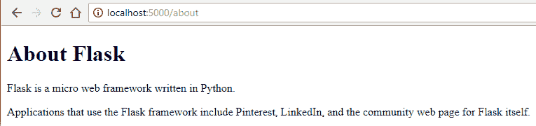**

### **让我们用导航连接两个页面**

**为了连接两个页面，我们可以在顶部有一个导航菜单。我们可以使用 Flask 来简化创建导航菜单的过程。**

**首先，让我们创建一个**template.html。这个 template.html 的 T2 将作为父模板。我们的两个子模板将继承它的代码。****

```
 `<!DOCTYPE html>
<html lang="en" dir="ltr">
 <head>
   <meta charset="utf-8">
   <title>Flask Parent Template</title>
   <link rel="stylesheet" href="{{ url_for('static',     filename='css/template.css') }}">
 </head>
 <body>
    <header>
      <div class="container">
        <h1 class="logo">First Web App</h1>
        <strong><nav>
          <ul class="menu">
            <li><a href="{{ url_for('home') }}">Home</a></li>
            <li><a href="{{ url_for('about') }}">About</a></li>
          </ul>
        </nav></strong>
      </div>
    </header>

    
    

 </body>
</html>`
```

****第 13–14 行:**我们使用的函数叫做`url_for()` **。它接受函数名作为参数。现在我们给它起了函数名。更多关于 [**url_for()函数**](http://flask.pocoo.org/docs/0.12/quickstart/#url-building) **的信息。******

**带花括号的两行将被 home.html 和 about.html 的内容所取代。这将取决于用户正在浏览的网址。**

**这些更改允许子页面(template.html 和 about.html)连接到父页面(template.html)。这使得我们不必在 about.html 和 home.html 复制导航菜单的代码。**

**about.html 的内容:**

```
`<!DOCTYPE html>
<html lang="en" dir="ltr">
  <head>
    <meta charset="utf-8">
    <title>About Flask</title>
  </head>
  <body>
    
    

    <h1> About Flask </h1>
    <p> Flask is a micro web framework written in Python.</p>
    <p> Applications that use the Flask framework include Pinterest,
      LinkedIn, and the community web page for Flask itself.</p>

    
  </body>
</html>`
```

**home.html 内容:**

```
`<!DOCTYPE html>
<html lang="en" dir="ltr">
  <head>
    <meta charset="utf-8">
    <title>Flask Tutorial</title>
  </head>
  <body>
    
    

    <h1> My First Try Using Flask </h1>
    <p> Flask is Fun </p>

    
  </body>
</html>`
```

**让我们尝试添加一些 CSS。**

## **向我们的网站添加 CSS**

### **需要记住的重要事项**

**同样，我们创建了一个名为 **templates** 的文件夹来存储我们所有的 HTML 模板，我们需要一个名为 **static** 的文件夹。**

**在**静态**中，我们将存储我们的 CSS、JavaScript、图片和其他必要的文件。这就是为什么创建一个 **CSS** **文件夹来存储你的样式表是很重要的。**这样做之后，你的项目文件夹应该是这样的:**

**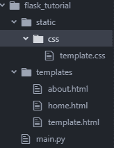**

### **链接我们的 CSS 和 HTML 文件**

**我们的 template.html 是链接所有页面的那个。我们可以在这里插入代码，它将适用于所有的子页面。**

```
`<!DOCTYPE html>
<html lang="en" dir="ltr">
  <head>
    <meta charset="utf-8">
    <title>Flask Parent Template</title>

    <link rel="stylesheet" href="{{ url_for('static',    filename='css/template.css') }}">

</head>
  <body>
    <header>
      <div class="container">
        <h1 class="logo">First Web App</h1>
        <strong><nav>
          <ul class="menu">
            <li><a href="{{ url_for('home') }}">Home</a></li>
            <li><a href="{{ url_for('about') }}">About</a></li>
          </ul>
        </nav></strong>
      </div>
    </header>




 </body>
</html>`
```

****第 7 行:**这里我们给出了 template.css 所在的路径。**

**现在看到变化:[http://localhost:5000/about](http://localhost:5000/about)。**

**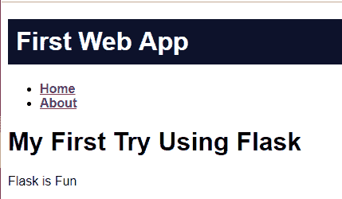**

## **与 Flask 和 virtualenv 一起前进**

**现在您已经熟悉了 Flask 的使用，您可以开始在未来的项目中使用它了。要做的一件事就是使用 virtualenv。**

### **为什么要用 virtualenv？**

**除了网络开发，你还可以在其他项目中使用 Python。**

**您的项目可能安装了不同版本的 Python、不同的依赖项和包。**

**我们使用 virtualenv 为您的 Python 项目创建一个隔离的环境。这意味着每个项目都可以有自己的依赖项，而不管其他项目有什么依赖项。**

### **virtualenv 入门**

**首先，在命令提示符或终端上运行以下命令:**

```
`pip install virtualenv`
```

**其次，执行以下操作:**

```
`virtualenv “name of virtual environment”`
```

**在这里，您可以为环境命名。我通常给它一个虚拟的名字。会是这样的:`virtualenv virtual` **。****

**设置虚拟环境后，检查您的项目文件夹。应该是这样的。虚拟环境需要在您的应用程序文件所在的**目录中创建。****

**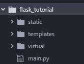

How the directory looks like** 

### **激活虚拟环境**

**现在转到您的终端或命令提示符。转到包含名为 **activate 的文件的目录。**名为 **activate** 的文件位于一个名为 **Scripts for Windows** 和 **bin for OS X 和 Linux 的文件夹中。****

**对于 OS X 和 Linux 环境:**

```
`$ name of virtual environmnet/bin/activate`
```

**对于 Windows 环境:**

```
`name of virtual environment\Scripts\activate`
```

**因为我使用的是 Windows 机器，所以当我激活环境时，它将如下所示:**

**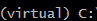

You should see this at beginning of your command prompt line** 

**下一步是在您的虚拟环境中安装 flask，这样我们就可以在我们的环境中运行应用程序。运行命令:**

```
`pip install flask`
```

**运行您的应用程序并转到 [http://localhost:5000/](http://localhost:5000/)**

**我们终于完成了我们的 web 应用程序。现在我们想向全世界展示我们的项目。**

**(关于 virtualenv 的更多信息可以在以下关于 virtualenv 和 [Flask 官方文档](http://flask.pocoo.org/docs/0.12/installation/#installation)的指南中找到)**

## **让我们把它送到云端**

**为了向其他人展示我们做的项目，我们需要学习如何使用云服务。**

### **将您的 Web 应用程序部署到云中**

**为了将我们的 web 应用程序部署到云中，我们将使用 [Google App Engine](https://cloud.google.com/appengine/) (标准环境)。这是一个**平台即服务(PaaS)的例子。****

****PaaS** 是指通过互联网交付操作系统和相关服务的**，无需下载或安装**。该方法允许客户创建和部署应用程序，而无需投资底层基础设施(更多关于 PaaS 的信息，请查看 [TechTarget](https://searchitchannel.techtarget.com/definition/cloud-services) )。**

> **Google App Engine 是一个平台即服务产品，允许开发人员和企业使用 Google 的高级基础设施— [TechOpedia](https://www.techopedia.com/definition/31267/google-app-engine-gae) 构建和运行应用程序。**

#### ****开始之前:****

**你需要一个谷歌账户**[。](https://accounts.google.com/signup/v2?hl=en&flowName=GlifWebSignIn&flowEntry=SignUp)**创建账户后，进入[谷歌云平台控制台](https://console.cloud.google.com)，创建一个新项目。还有，你需要安装[谷歌云 SDK](https://cloud.google.com/sdk/) 。**

**在本教程结束时，您的项目结构将如下所示。**

**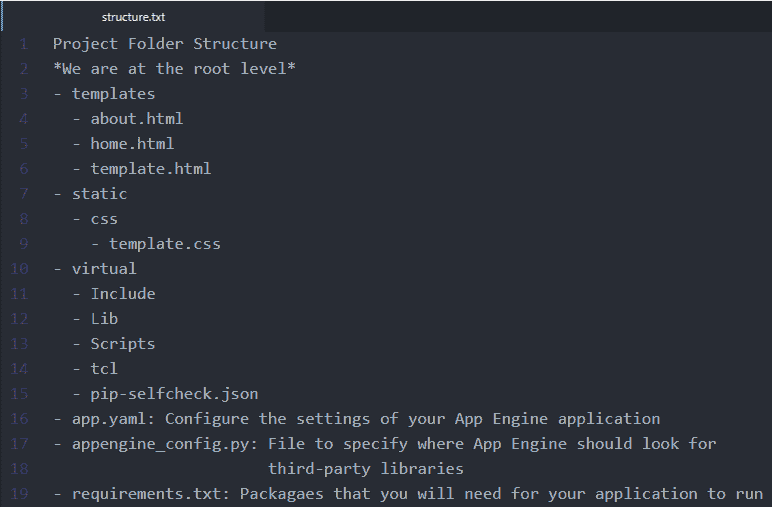

Project Folder Structure** 

**我们需要创建三个新文件:app.yaml、appengine_config.py 和 requirements.txt。**

**app.yaml 的内容:**

```
`runtime: python27
api_version: 1
threadsafe: true

handlers:
- url: /static
  static_dir: static
- url: /.*
  script: main.app

libraries:
  - name: ssl
    version: latest`
```

**如果你去查看谷歌的教程中**谈到 app.yaml** 内容的部分，它不包括我写的关于图书馆的部分。**

**当我第一次尝试部署我的简单 web 应用程序时，我的部署从未成功过。经过多次尝试，我了解到我们需要包含 SSL 库。**

**SSL 库允许我们[在客户端和服务器](https://wiki.python.org/moin/SSL)之间创建安全连接。每次用户去我们的网站，他们需要连接到由谷歌应用引擎运行的服务器。我们需要为此创建一个安全的连接。(我最近才知道这一点，所以如果你对此有什么建议，请告诉我！)**

**appengine_config.py 的内容:**

```
`from google.appengine.ext import vendor

# Add any libraries installed in the "lib" folder.
vendor.add('lib')`
```

**requirements.txt 内容:**

```
`Flask
Werkzeug`
```

**现在，在我们的虚拟环境**(确保您的 virtualenv 已激活)**，中，我们将安装 requirements.txt 中的新依赖项。运行以下命令:**

```
`pip install -t lib -r requirements.txt`
```

****-t lib:** 此标志将库复制到 lib 文件夹中，该文件夹在部署期间上传到 App Engine。**

****-r requirements.txt:** 告诉 pip 安装 requirements.txt 中的所有内容。**

### **部署应用程序**

**要将应用程序部署到 Google App Engine，请使用以下命令。**

```
`gcloud app deploy`
```

**我通常包括— **项目【项目 ID】****

**这指定了您正在部署的项目。该命令将如下所示:**

```
`gcloud app deploy --project [ID of Project]`
```

### **应用程序**

**现在检查您的应用程序的 URL。应用程序将以下列方式存储:**

```
`"your project id".appspot.com`
```

**我的申请在这里:[http://sal-flask-tutorial.appspot.com](http://sal-flask-tutorial.appspot.com)**

## **结论**

**从本教程中，您学习了如何:**

*   **使用名为 Flask 的框架，使用 Python 作为服务器端语言。**
*   **学会了如何使用 HTML、CSS 和 Flask 制作网站。**
*   **学习了如何使用 virtualenv 创建虚拟环境。**
*   **使用 Google App Engine 标准环境将应用程序部署到云中。**

#### ****我学到了什么****

**我从这个小项目中学到了三件重要的事情。**

****首先，我了解了静态网站和网络应用的区别****

****静态网站:****

*   **意味着服务器向客户机提供 HTML、CSS 和 JavaScript 文件。当用户与之交互时，站点的内容不会改变。**

****网络应用:****

*   **web 应用程序或动态网站基于检索到的数据(大多数情况下是数据库)生成内容，这些数据会根据用户与站点的交互而变化。在 web 应用程序中，服务器负责查询、检索和更新数据。这导致 web 应用比简单应用的静态网站( [Reddit](https://www.reddit.com/r/Python/comments/1iewqt/deploying_static_flask_sites_for_free_on_github/) )部署起来更慢更困难。**

****服务器端和客户端:****

*   **我了解到 web 应用程序有两个方面。客户端和服务器端。客户端是用户与之交互的地方，而服务器端是处理用户输入的所有信息的地方。**

****其次，我了解了云服务****

**我以前的大部分项目都是静态网站，为了部署它们，我使用了 [GitHub 页面](https://pages.github.com/)。GitHub Pages 是一个免费的静态站点托管服务，旨在托管来自 GitHub 库的项目。**

**当使用 web 应用程序时，我不能使用 GitHub 页面来托管它们。GitHub Pages 只适用于静态网站，而不适用于需要服务器和数据库的动态应用程序。我不得不使用云服务，比如亚马逊网络服务或者 T2 的 Heroku**

****第三，学会了如何使用 Python 作为服务器端语言****

**为了创建 web 应用程序的服务器端，我们必须使用服务器端语言。我了解到我可以使用名为 Flask 的框架来使用 Python 作为服务器端语言。**

#### ****下一步:****

**你可以用 Flask 做各种各样的东西。我意识到 Flask 有助于使网站背后的代码更容易阅读。我在 2018 年夏天提出了以下申请，并希望提出更多申请。**

**个人项目**

*   **[一款 Twilio 短信应用](http://twilio-pokedex.appspot.com/)**
*   **[我的个人网站](http://salvador-villalon.appspot.com/)**

**在我实习期间**

*   **[我了解 Docker 和容器的项目的一部分](http://spgi2018-container-project.appspot.com/)**

**以下是帮助我创建本教程的资源列表:**

*   **“应用引擎—以任何语言构建可扩展的 Web 和移动后端|应用引擎|谷歌云。”*谷歌*，谷歌，【cloud.google.com/appengine/】T2。**
*   **"用 Python Flask 建立一个网站."*皮顿霍*，【pythonhow.com/building-a-website-with-python-flask/】T2。**
*   **“Flask —第 2 讲— CS50 的使用 Python 和 JavaScript 的 Web 编程。" *YouTube* ，2018 年 2 月 6 日，【youtu.be/j5wysXqaIV8】T2。**
*   **“在应用引擎标准环境 Python 应用引擎标准环境|谷歌云上开始使用 Flask。”*谷歌*，谷歌，[cloud . Google . com/app engine/docs/standard/python/getting-started/python-standard-env](https://cloud.google.com/appengine/docs/standard/python/getting-started/python-standard-env)。**
*   **“安装。” *Welcome | Flask(一个 Python 微框架)*，【flask.pocoo.org/docs/0.12/installation/】，。**
*   **" Python——在 Github 页面上免费部署静态 Flask 站点." *Reddit* ，[www . Reddit . com/r/Python/comments/1 iew Qt/deploying _ static _ flask _ sites _ for _ free _ on _ github/。](http://www.reddit.com/r/Python/comments/1iewqt/deploying_static_flask_sites_for_free_on_github/.)**
*   **真正的 Python。" Python 虚拟环境:入门——真实的 Python . "*真蟒蛇*，真蟒蛇，2018 年 8 月 7 日，【realpython.com/python-virtual-environments-a-primer/】T2。**
*   **“什么是云服务？—定义来自 what is . com . "*search it channel*，【searchitchannel.techtarget.com/definition/cloud-services】T2。**
*   **“什么是谷歌应用引擎(GAE)？—来自 Techopedia 的定义。”*Techopedia.com*，[www.techopedia.com/definition/31267/google-app-engine-gae.](http://www.techopedia.com/definition/31267/google-app-engine-gae.)**

**如果您有任何建议或问题，请随时发表评论。**