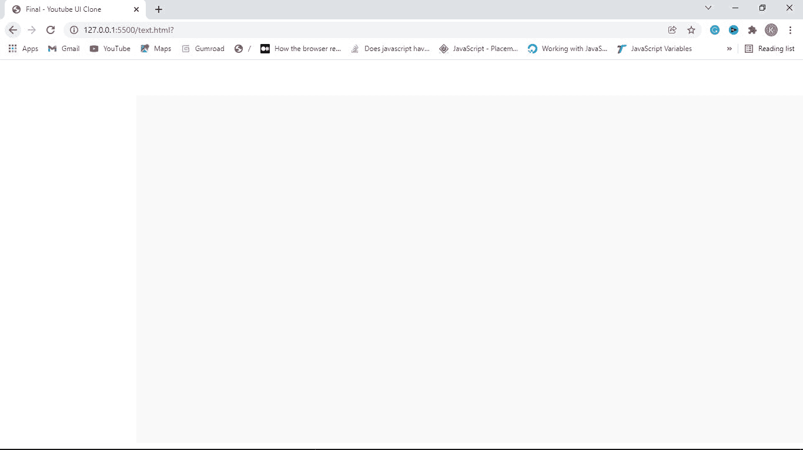
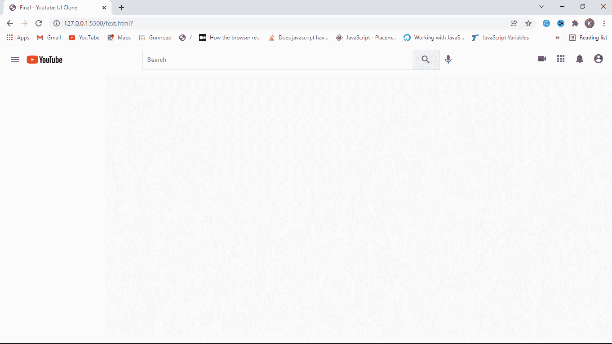
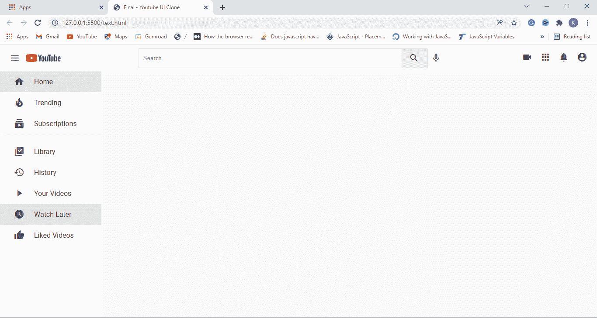
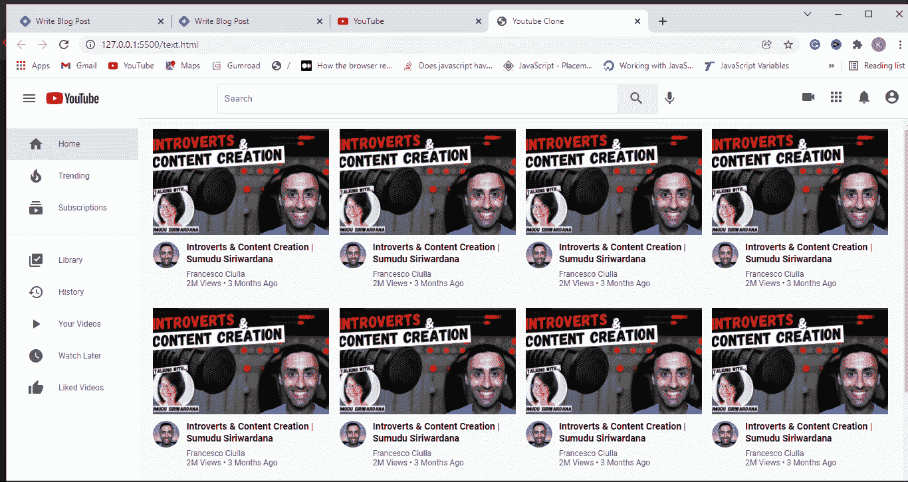

# HTML 和 CSS 项目——如何一步一步地构建 YouTube 克隆

> 原文：<https://www.freecodecamp.org/news/how-to-build-a-website-with-html-and-css-step-by-step/>

在本教程中，我们将逐步建立一个 YouTube 克隆。您将学习如何创建布局并向这些布局添加内容。

如果你一直在努力用 HTML & CSS 建立一个真正的网站，这是为你准备的文章。因为我马上就要教你一步一步来，减少你的挣扎。

我们将讨论如何用 HTML 和 CSS 制作 YouTube 克隆的布局，你将学习如何制作两列布局。

等等:如果你是一个完全的初学者，甚至不明白 HTML 和 CSS 之间的区别，你可以看看下面的视频来学习入门所需的一切...

[](https://www.youtube.com/watch?v=dXC4EEkO1vI)

重要的是将事情分成更小的部分，使我们的项目更容易构建。所以，我们必须把这个 YouTube 的复制品分成更小的单元，我们将一步一步地建立。

## YouTube 克隆故障

在我们将要构建的 YouTube 克隆中，该网站大约有 6 个单元:


**割台**包含三个部分(左、中、右)。左边部分包含徽标和菜单，中间部分包含搜索框和图标，右边部分包含导航图标。图标基于相似的元素，这意味着我们设计一个图标元素，然后复制、粘贴和编辑它来创建其他元素。

**主体**包含两个部分(侧栏和内容)。侧边栏的导航链接也是类似的，所以只是一个东西。同样的事情也发生在内容部分的视频上。

因此，我们的 YouTube 克隆有一个标题、主页面、侧边栏、内容、视频卡、导航链接和导航图标作为主要单元。这是我们想要创建的网页单元的分解。

## YouTube 克隆布局

我们要做的第一件事是用 HTML 创建 YouTube 克隆的布局结构。我们将使用下面的代码来实现:

```
<html lang="en">
  <head>
    <meta charset="UTF-8" />
    <meta http-equiv="X-UA-Compatible" content="IE=edge" />
    <meta name="viewport" content="width=device-width, initial-scale=1.0" />
    <!-- Material Icons -->
    <link href="https://fonts.googleapis.com/icon?family=Material+Icons" rel="stylesheet" />
    <!-- CSS File -->
    <link rel="stylesheet" href="styles/index.css" />
    <title>Youtube Clone with HTML & CSS</title>
  </head>
  <body>
      <header class="header">.</header>
      <main>
          <div class="side-bar">.</div>
          <div class="content">.</div>
      </main>
  <!-- Main Body Ends -->
</body>
</html> 
```

在本教程中，我假设你已经了解了如何使用 HTML 元标签以及如何链接一个 CSS 文件。如果你没有，你可以在我上面加的视频里了解更多关于他们的信息。但是你不需要理解它们，因为我们在这节课中学到了什么，所以继续读下去。

我们有一个 header 标签来创建 YouTube 克隆的 header 部分。稍后，我们将在标题中添加 YouTube 徽标、搜索框和其他导航图标。

还有包含侧栏和内容的主要部分。边栏将包含一些导航链接，而内容将包含视频。这就是只有 HTML 的结构。

等等！我们的代码运行后看起来并不太美。我们会用 CSS 解决这个问题。所以让我们添加 CSS 来真正创建一个 YouTube 布局。

### YouTube 克隆的 CSS

#### 步骤 1:在 CSS 中使用@import

```
@import url('https://fonts.googleapis.com/css2?family=Roboto:wght@300;400;700&display=swap'); 
```

让我们从“导入 url('路径')开始...它是做什么的？我们用它来链接谷歌的字体 Roboto，这样我们就可以用它作为我们网站的字体。

#### 步骤 2:重置 HTML 默认样式

```
* {
  margin: 0;
  padding: 0;
  box-sizing: border-box;
} 
```

星号*是一个 CSS 选择器，用于选择页面上的所有 HTML 标签。我们将它们的边距和填充设置为 0。然后，我们将它们的框大小设置为 border-box。我们为什么要这么做？

我们希望宽度或高度、边框、边距和填充加起来是总长度。这就是我的意思:在 CSS 中，如果一个盒子的宽度为 100 像素，填充为 100 像素，那么这个盒子的宽度现在将是 110 像素

但是我们不希望这样——我们希望所有内容都是 100 像素。宽度仍应为 100 像素，包括 10 像素的边距，而不是 110 像素。这就是`box-sizing: border-box`所做的。

注意:当你使用它的时候，你会开始更好地理解它是如何工作的——但是现在，我只是想给初学者一些可以快速理解的见解。

#### 第三步:设置字体系列

```
body {
  font-family: 'Roboto', sans-serif;
} 
```

我们选择 body 标签，将其字体系列设置为 Roboto，并使用 sans-serif 作为后备，以防 Roboto 不可用。

#### 第四步:设计标题样式

```
/* header section*/
.header {
    display: flex;
    justify-content: space-between;
    align-items: center;
    height: 60px;
    padding: 15px;
  } 
```

`.header`类名用于选择(或连接到)我们网站的标题部分，以便我们可以添加一些样式。

我们将它的 display 属性设置为 flex 来创建一个布局，然后我们可以很容易地将它分成几个部分。稍后我们将把它分成几个部分。

`Justify-content: space-between`意味着我们希望当标题中的内容不止一个时，在它们之间留有空格。

`Align-items: centre`用于将标题的所有内容移动到屏幕的左中部。这就是所谓的垂直对齐。我们最终将`header`的`height`设置为 60px，填充为 15px。

#### 第五步:设置主要部分的高度

```
main {
   height: calc(100vh - 70px);
   display: flex;
   background-color: #f9f9f9;
 } 
```

我们将主要部分的`height`设置为`calc( 100vh - 70px`...这是什么意思？v 代表一个`viewport`，它是一个没有滚动的窗口屏幕的可见部分。“高度”表示垂直长度，我们也可以用“w”表示宽度-水平长度。

简而言之，100vh 是指浏览器中不滚动时可见的总高度。我们使用 calc ( 100vh - 70px)进行计算，从 100vh 中减去 70px。

我们将它的 display 属性设置为 flex 来创建一个布局。最后，我们设置它的背景颜色为`#f9f99f`，这是一种银色或灰色。

#### 第六步:隐藏滚动条

```
/* Sidebar */ 
.side-bar {
    height: 100%;
    width: 17%;
    background-color: white;
    overflow-y: hidden;
  } 
```

的`height`。侧栏设置为其父级的 100%。这意味着它将与其父代具有相同的高度。它的宽度设置为其父的 17%,背景颜色设置为白色。

嘿！什么是`overflow-y: hidden`？当 Twitter 一次加载 10 条推文时，你不能一次看到所有内容，必须滚动，对吗？在这种情况下，我们隐藏滚动条。谢谢。

#### 步骤 7:添加媒体查询以获得响应

```
@media (max-width: 768px) {
    .side-bar {
      display: none;
    }
  } 
```

我们使用这种媒体查询来使网站在移动设备、平板电脑和桌面上做出响应。当 YouTube 克隆在屏幕小于或等于 768 像素的设备上时(如手机和平板电脑)，侧边栏将会消失。此外，最大宽度:768 像素意味着设备的屏幕可以小于或等于 768 像素。

好了，我们已经完成了 YouTube 克隆版的布局。下面是结果…



## 如何向标题部分添加内容

在这一部分中，我们将讨论如何将一个元素分成几个部分，并在头部分添加内容。

简而言之，我们将 YouTube 克隆的头部分为三个部分:左、中和右。每个部分都包含一些标签。我们开始吧！

### 步骤 1:将子代和孙代添加到标题中

这里，我们将简单地将 HTML 标签添加到 YouTube 克隆的标题部分。我们将用下面的代码做到这一点:

```
<header>
 <div class="logo left">
   <i id="menu" class="material-icons">menu</i>
   
 </div>

 <div class="search center">
   <form action="">
     <input type="text" placeholder="Search" />
     <button><i class="material-icons">search</i></button>
   </form>
   <i class="material-icons mic">mic</i>
 </div>

 <div class="icons right">
   <i class="material-icons">videocam</i>
   <i class="material-icons">apps</i>
   <i class="material-icons">notifications</i>
   <i class="material-icons display-this">account_circle</i>
 </div>
</header> 
```

在通过添加三个独立的代码块将页眉分成三个部分之后，是时候使用 CSS 来使其更加美观了。让我们开始吧。

### 第二步:设计左边部分的样式

```
.left {
 display: flex;
 align-items: center;
}

.left #menu {
 padding: 0 7px;
 cursor: pointer;
} 
```

别忘了，我们将标题的`justify-content`属性设置为 space-between，这意味着标题中的每个标签之间的间距相等。

现在，我们给出了一个类`left`，因为它应该在左边。我们将它的 display 属性设置为 flex，以创建没有布局的部分。它的子对象与标题的左中心对齐。我们还可以通过`id`访问左侧部分的菜单。

我们将其`padding top and bottom`设置为 0，将其`padding left and right`设置为 7px。它的`cursor`属性被设置为指针，这样当鼠标在指针上时，它会显示一个指向的手指。

### 步骤 3:设计中间部分和它的形状

```
.search {
 display: flex;
}

.search form {
 display: flex;
 border: 1px solid #ddd;
 height: 45px;
} 
```

嘿！你现在应该知道我们在搜索课上做什么了。:)

我们将它的 display 属性设置为 flex，这样我们就可以创建一个包含其子元素的布局。我们对 search/center 部分中的表单做了同样的操作。

它的边框粗细设置为 1px，类型设置为纯色，颜色设置为#ddd(银色或灰白色)。

### 步骤 4:在搜索表单中输入样式

```
.search input {
  width: 600px;
  padding:10px;
  border: 0;
  height: 100%;
  border-radius: 2px 0 0 2px
}

input:focus {
  outline: none;
  border: 1px solid #ddd;
} 
```

我们选择位于带有`.search input`的搜索部分内的`input`。我们将它的边框半径设置为顶部 2px，右侧 0，底部 0，左侧 2px。那么，什么是边界半径呢？它是一个有四个角的物体的弯曲边缘。

### 步骤 5:设计搜索和麦克风图标/按钮

```
.search button {
  height: 100%;
  width: 60px;
  border: none;
}

.mic {
  margin-top: 10px;
} 
```

搜索部分内的按钮也用`.search button`选择。它的高度被设置为其父级的 100%。我们不希望它有任何边界，所以我们将其边界设置为 0。

我们使用类名`.mic`访问麦克风图标，并将其 margin-top 设置为 10px，这样它会向下移动一点。

最后，让我们来设计网页上所有的材料图标:

```
 .material-icons {
    color: rgb(100, 100, 100);
    padding: 0 7px;
    cursor: pointer;
  } 
```

快点！我们在 YouTube 克隆的头部添加了子元素和部分。查看下面的最终结果:



## 如何向侧边栏添加内容

在这一部分，我们将讨论如何向 YouTube 克隆添加导航链接。简而言之，我们将在现有的侧边栏中添加一些链接。

### 步骤 1:向侧边栏添加子代和孙代

我们将在侧边栏中添加以下 HTML 代码:

```
<!-- <div class=”side-bar”> -->

   <div class="nav">
      <a class="nav-link active">
        <i class="material-icons">home</i>
        <span>Home</span>
      </a>
  </div>

<!-- </div> --> 
```

然后，我们需要首先设计 navbar 的样式，它是所有链接的包装器:

```
.nav {
    width: 100%;
    display: flex;
    flex-direction: column;
    margin-bottom: 15px;
    margin-top: 15px;
  } 
```

我在这里只解释弯曲方向。这决定了我们希望孩子出现在列(垂直)还是行(水平)中。在这种情况下，我们使用水平显示器。

然后，让我们用 CSS 样式上面的导航链接，如下所示:

```
.nav-link {
   display: flex;
   align-items: center;
   padding: 12px 25px;
 }

.nav-link span {
   margin-left: 15px;
 }

.nav-link:hover {
   background: #e5e5e5;
   cursor: pointer;
 }

.active {
   background: #e5e5e5;
} 
```

哎呀——这里没什么好解释的，因为我已经解释过很多类似的概念了！

好了，我们来说说`.home:hover`。只有当我们将光标移动到主页导航链接上时，其中的样式才会被应用。就是这样。

嘿…等等。我们在侧边栏中有很多链接，那么我们如何创建它呢？嗯，我们只是做每个开发人员都喜欢做的事情——复制粘贴，然后编辑它，如下所示:

```
<div class=”side-bar”>
<div class="nav">
  <a class="nav-link active">
     <i class="material-icons">home</i>
     <span>Home</span>
  </a>
  <a class="nav-link">
     <i class="material-icons">local_fire_department</i>
     <span>Trending</span>
  </a>
  <a class="nav-link">
     <i class="material-icons">subscriptions</i>
     <span>Subscriptions</span>
  </a>
</div>
<hr>
</div> 
```

粘贴三个链接后，我们想通过使用

* * *

tag to create a line that separates them from the next category. Now, let’s style the hr tag.

```
hr {
   height: 1px;
   background-color: #e5e5e5;
   border: none;
 } 
```

然后，我们将在 hr 标签后添加剩余的代码，如下所示:

```
<!-- <div class="nav">
     hr -->
    <a class="nav-link">
       <i class="material-icons">library_add_check</i>
       <span>Library</span>
    </a>
    <a class="nav-link">
       <i class="material-icons">history</i>
       <span>History</span>
    </a>
    <a class="nav-link">
       <i class="material-icons">play_arrow</i>
       <span>Your Videos</span>
    </a>
    <a class="nav-link">
       <i class="material-icons">watch_later</i>
       <span>Watch Later</span>
    </a>
    <a class="nav-link">
       <i class="material-icons">thumb_up</i>
       <span>Liked Videos</span>
    </a>
<!-- </div> --> 
```

哇，我们完成了 YouTube 克隆的侧边栏，下面是我们得到的结果:



## 如何将视频添加到内容部分

在 YouTube 克隆教程的这一部分，我们将向内容区域添加视频。你需要将视频(不是视频)复制到许多地方，使它看起来像 Youtube，如果可用，你可以用独特的 Youtube 视频信息编辑它们。

```
<div class="videos">
  <!-- a video starts -->
    <div class="video">
       <div class="thumbnail">
          
        </div>

          <div class="details">
             <div class="author">
                
             </div>
             <div class="title">
                <h3>
                    Introverts & Content Creation | Sumudu Siriwardana
                 </h3>
                 <a href="">
                        Francesco Ciulla
                  </a>
                  <span> 2M Views • 3 Months Ago </span>
             </div>
           </div>

         </div>
   <!-- a video Ends -->
 </div> 
```

现在，让我们对它应用 CSS。

```
.content {
  background-color: #f9f9f9;
  width: 100%;
  height: 100%;
  padding: 15px 15px;
  border-top: 1px solid #ddd;
  overflow-y: scroll;
}

.videos {
  display: flex;
  flex-direction: row;
  justify-content: space-around;
  flex-wrap: wrap;
}

.video {
  width: 270px;
  margin-bottom: 30px;
} 
```

如果你检查`.videos`的样式，你会看到`flex-wrap`。是我之前唯一没有解释过的属性，那就来解释一下吧。

例如，当屏幕只能容纳四个项目时，其他项目将被移到另一行。这就是“柔性包装”的作用。

```
.thumbnail {
  width: 100%;
  height: 170px;
}

.thumbnail img {
  object-fit: cover;
  height: 94%;
  width: 100%;
}
.author img {
  object-fit: cover;
  border-radius: 50%;
  height: 40px;
  width: 40px;
  margin-right: 10px;
} 
```

上面唯一你可能不明白的因为我们之前没解释过的是`object-fit: cover`。那我们怎么用呢？

`object-fit`在这种情况下，用于将图像裁剪到其容器中，以消除高度和宽度上的溢出(图像大于其容器的区域):

```
.details {
  display: flex;
}

.title {
  display: flex;
  flex-direction: column;
}

.title h3 {
  color: rgb(3, 3, 3);
  line-height: 18px;
  font-size: 14px;
  margin-bottom: 6px;
}

.title a,
span {
  text-decoration: none;
  color: rgb(96, 96, 96);
  font-size: 12px;
} 
```

在本例中，我们用`.details`做了一个布局，因为我们没有将它的 flex-direction 设置为 property，所以它将被设置为 row——这是它的默认值。您会看到一个布局也是由标题组成的，并通过将 flex-direction 设置为 column 来设置它的子元素以显示在一列中。

我们选择在`.title`里面的 h3 标签，我们把它的颜色设置成黑色…我将在后面解释如何理解颜色代码。

`line-height`用于设置一行文本的高度，在本例中，我们将其设置为 18px。

最后，我们使用`.title a, span`来选择`.title`中的锚标签。我们还选择页面上的所有 span 标记，并将其文本修饰设置为 none。

那么什么是文字装饰呢？它有一个设计，比如一个锚标记所具有的下划线，在这种情况下，我们通过将它设置为 none 来隐藏它。我们已经将视频添加到 YouTube 克隆中，最终结果如下:



## 如何让 YouTube 的克隆具有响应性

在教程的这一部分，我们将使我们已经建立的 YouTube 克隆有点反应。我们怎么做呢？我们将使用 CSS 媒体查询。现在，让我们开始吧！

因此，我们将把下面的 CSS 代码添加到 YouTube 克隆的 CSS 文件中。

```
 @media (max-width: 768px) {
    .side-bar {
      display: none;
    }
    .search {
      display: none;
    }
} 
```

`@media (max-width: 768px) { }`用于设置媒体查询中的代码将应用到的设备屏幕尺寸。

在本例中，`max-width: 768px`表示媒体查询中的样式将应用于任何等于或小于 768 像素的屏幕尺寸。

因此，只要使用的屏幕尺寸小于或等于 768px，我们就会通过将侧边栏和搜索输入的 display 属性设置为 none 来隐藏它们。

```
 @media (max-width: 900px) {
    .search input {
      width: 25rem;
    }
  } 
```

最后，每当使用中的设备的屏幕尺寸小于或等于 900 像素时，我们使搜索输入变小一点。

就是这样。

万岁...我们完成了 YouTube 的克隆。现在去做你自己的吧，别忘了玩玩它。

从教程中添加或删除一些东西，以确保你真正理解你在做什么。祝你好运！

## 还有一点

Ayobami Ogundiran 热爱用软件开发书写历史，目前正在通过 You Too Can Code 帮助那些努力理解和构建 HTML、CSS 和 JavaScript 项目的人。

通过[电报组](https://t.me/+HEUn1Y-ME6GW9ssD)或[不和谐组](https://discord.com/invite/WGtNSHUnDZ)加入我。