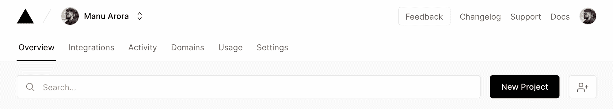
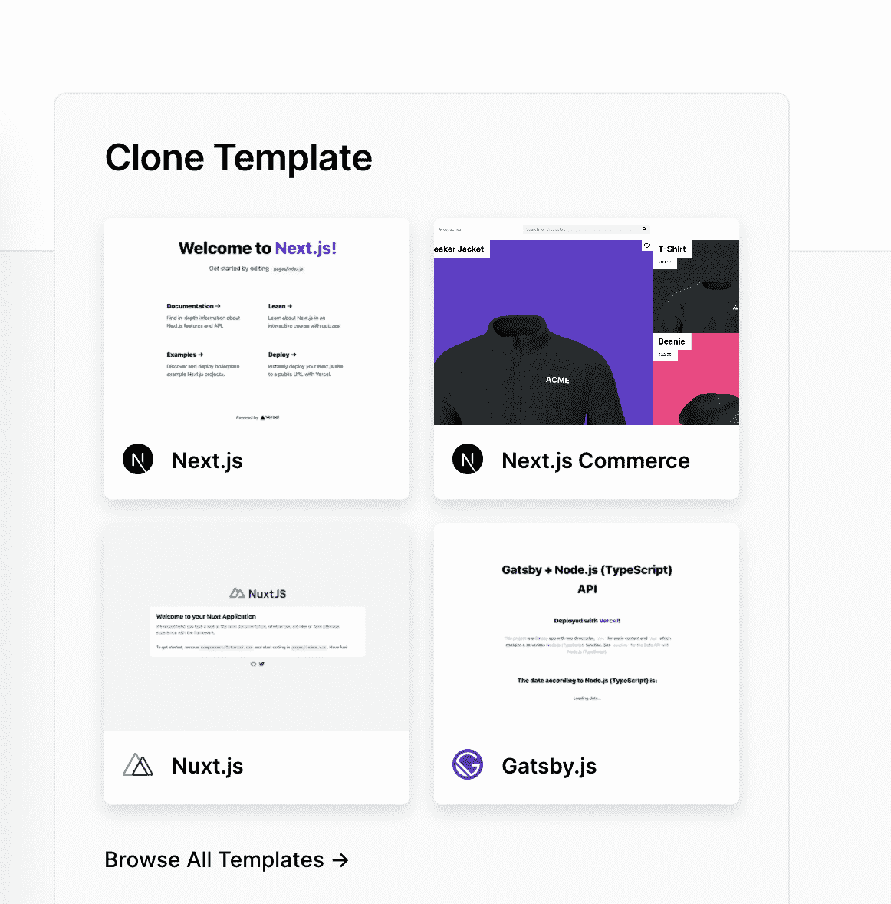
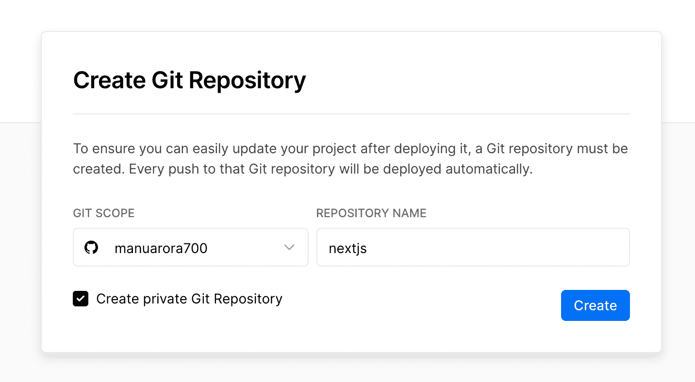
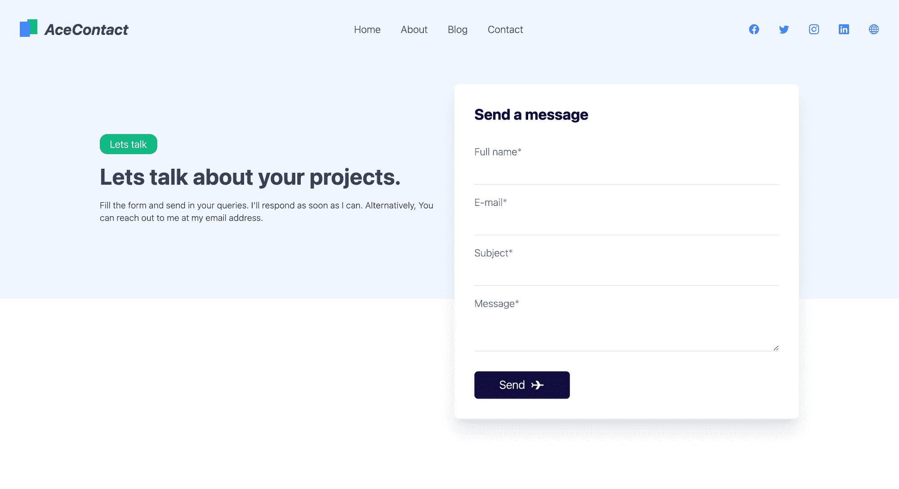
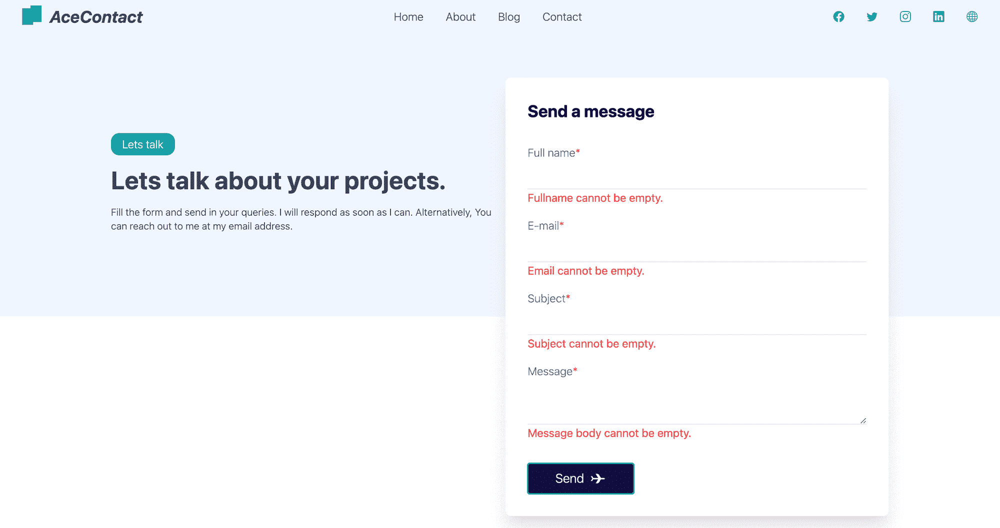
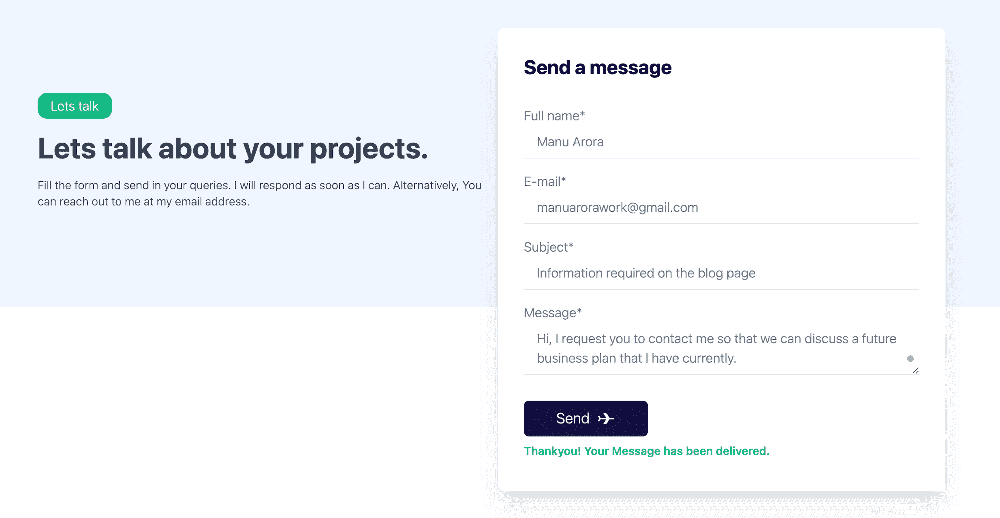
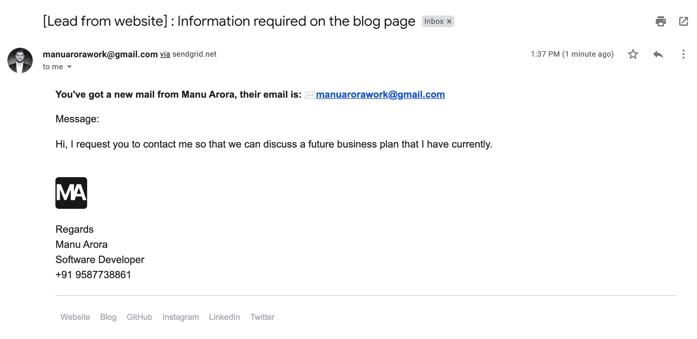

# 如何用 SendGrid 和 Next.js 构建联系人表单

> 原文：<https://www.freecodecamp.org/news/how-to-build-a-working-contact-form-with-sendgrid-and-next-js/>

如果你想让你的用户能够通过电子邮件与你交流，联系方式在网站上是很有用的。有很多方法可以建造它们。

传统上，你要么使用 PHP 通过服务器发送电子邮件，要么使用第三方服务来处理电子邮件逻辑。

但是在本文中，我们将讨论如何使用 SendGrid API 从您的 Next.js 应用程序发送电子邮件。

我们将创建一个简单的页面——一个用 React 构建的联系人表单——其中包含输入字段，我们将在发送之前验证这些字段。我们会将表单连接到 SendGrid API，它会负责向您发送电子邮件。然后，在一天结束时，你所要做的就是检查你的电子邮件来找到这些问题。

但是，如果您还没有 Next.js 项目，您可以通过下面提到的步骤轻松创建一个并将其与 Vercel 集成:

1.  在 [Vercel](https://vercel.com) 上创建一个账户，然后点击`New Project`



2.选择模板为`Next.js`:



3.给你的库起一个你喜欢的名字，然后点击 create project。(为您的远程代码版本选择 GitHub、GitLab 或 BitBucket)



遵循以上三点，您将在您的版本控制帐户上拥有一个存储库。

## 我们将使用的技术堆栈

*   [Next.js](https://nextjs.org) 用于创建联系人表单登录页面
*   [TailwindCSS](https://tailwindcss.com) 用于设计组件的样式
*   用于使用 API 发送电子邮件的 SendGrid
*   [Vercel](https://vercel.com) 托管我们的应用程序和 CI/CD

我们将使用 Nextjs 的 API 路由来处理表单事件。API 模块提供了一种灵活的方式来处理 Next.js 应用程序中的后端逻辑。

我们在 API 文件夹中写的任何代码都将作为一个无服务器函数部署到 Vercel 上进行托管。你可以在这里阅读更多关于 Next.js API 路由

如果您已经有了一个 Next.js 项目，并希望在其中设置一个工作联系表单，那就太好了。在这种情况下，你可以很容易地创建页面并立即开始。

但是如果您还没有建立项目，那也没关系——转到 Vercel 并创建一个 Next.js starter 项目，然后克隆存储库。

## 应用流程

让我们来看看申请流程——或者说发送电子邮件的实际工作方式:

*   最终用户填写 mandotary 4 字段并单击 submit。
*   在提交时，`handleSubmit`函数被触发。
*   `handleSubmit`验证表单的输入字段，并检查它们是否为空。
*   如果表单字段不为空，将对发送电子邮件的逻辑所在的`api/sendgrid`进行 API 调用。
*   在`api/sendgrid`中，`@sendgrid/mail`模块初始化一个`send`函数，该函数获取应用程序的 API 密钥，并发送包含必填字段的电子邮件。
*   如果电子邮件成功发送，则向客户端发送一个`200`响应，否则向客户端发送一个`400`响应。
*   响应在前端处理，并显示适当的消息。

## 如何设置 TailwindCSS

设置 TailwindCSS 相当容易，可以用两种简单的方法来完成。

1.  将 TailwindCSS 作为依赖项安装在项目中:

```
npm install -D tailwindcss@latest postcss@latest autoprefixer@latest 
```

2.为项目初始化一个 TailwindCSS 配置文件。这将在根目录下创建一个`tailwind.config.js`文件:

```
npx tailwindcss init 
```

然后您需要编辑配置文件，包括`purge`路径，并启用`jit`模式:

```
module.exports = {
   purge: [],
   mode: 'jit',
   purge: ['./pages/**/*.{js,ts,jsx,tsx}', './components/**/*.{js,ts,jsx,tsx}'],
    darkMode: false, // or 'media' or 'class'
    theme: {
      extend: {},
    },
    variants: {
      extend: {},
    },
    plugins: [],
  }
```

您可以在构建时使用`purge`从项目中移除不需要的样式。如果您想减小 CSS 包的大小，这是很有帮助的。

`jit`是新的 TailwindCSS 模式，您可以在代码本身中指定动态类名。

例如，如果您想让您的文本大小为`10px`(在 TailwindCSS 模块中还没有)，您可以在您的类名中写入`text-[10px]`，它会自动反映出来。不再需要编写自定义样式属性。💯

接下来，在根文件`_app.js`中导入顺风风格:

```
// pages/_app.js
 import '../styles/globals.css'
 import 'tailwindcss/tailwind.css'

  function MyApp({ Component, pageProps }) {
    return <Component {...pageProps} />
  }

  export default MyApp
```

然后将 Tailwind 的核心 CSS 包含在根级样式表中，如下所示:

```
/* ./styles/globals.css */
@tailwind base;
@tailwind components;
@tailwind utilities;
```

至此，您已经成功地为您的项目设置了 TailwindCSS。

## 联系人页面的标记和样式



我们将完全用顺风来构建网页。我直接从 [Tailwind Master Kit](https://tailwindmasterkit.com) 获得页面本身，这是一个用于 Tailwind web 项目的组件和模板库。

让我们浏览一下页面的 HTML(本质上是联系表单)以了解所有内容是如何实现的:

```
<form class="rounded-lg shadow-xl flex flex-col px-8 py-8 bg-white dark:bg-blue-500">
      <h1 class="text-2xl font-bold dark:text-gray-50">Send a message</h1>

      <label for="fullname" class="text-gray-500 font-light mt-8 dark:text-gray-50">Full name<span class="text-red-500 dark:text-gray-50">*</span></label>
      <input type="text" name="fullname" class="bg-transparent border-b py-2 pl-4 focus:outline-none focus:rounded-md focus:ring-1 ring-green-500 font-light text-gray-500" />

      <label for="email" class="text-gray-500 font-light mt-4 dark:text-gray-50">E-mail<span class="text-red-500">*</span></label>
      <input type="email" name="email" class="bg-transparent border-b py-2 pl-4 focus:outline-none focus:rounded-md focus:ring-1 ring-green-500 font-light text-gray-500" />

      <label for="subject" class="text-gray-500 font-light mt-4 dark:text-gray-50">Subject<span class="text-red-500">*</span></label>
      <input type="text" name="subject" class="bg-transparent border-b py-2 pl-4 focus:outline-none focus:rounded-md focus:ring-1 ring-green-500 font-light text-gray-500" />

      <label for="message" class="text-gray-500 font-light mt-4 dark:text-gray-50">Message<span class="text-red-500">*</span></label>
      <textarea name="message" class="bg-transparent border-b py-2 pl-4 focus:outline-none focus:rounded-md focus:ring-1 ring-green-500 font-light text-gray-500"></textarea>
      <div class="flex flex-row items-center justify-start">
        <button class="px-10 mt-8 py-2 bg-[#130F49] text-gray-50 font-light rounded-md text-lg flex flex-row items-center">
          Send
          <svg width="24" height="24" viewBox="0 0 24 24" class="text-cyan-500 ml-2" fill="currentColor" >
            <path d="M9.00967 5.12761H11.0097C12.1142 5.12761 13.468 5.89682 14.0335 6.8457L16.5089 11H21.0097C21.562 11 22.0097 11.4477 22.0097 12C22.0097 12.5523 21.562 13 21.0097 13H16.4138L13.9383 17.1543C13.3729 18.1032 12.0191 18.8724 10.9145 18.8724H8.91454L12.4138 13H5.42485L3.99036 15.4529H1.99036L4.00967 12L4.00967 11.967L2.00967 8.54712H4.00967L5.44417 11H12.5089L9.00967 5.12761Z" fill="currentColor" />
          </svg>
        </button>
      </div>
    </form>
```

该表单有 4 个字段:

*   全名
*   电子邮件
*   科目
*   消息

所有字段都是必填的，我们稍后也会验证它们。你会希望你的用户在发送邮件时向你提供他们所有的详细信息。

为了捕获字段，我们将使用 React 的 [useState()](https://reactjs.org/docs/hooks-state.html) 钩子来确保我们的数据在应用程序中持久化。

```
export default function ContactUs() {
  const [fullname, setFullname] = useState("");
  const [email, setEmail] = useState("");
  const [subject, setSubject] = useState("");
  const [message, setMessage] = useState("");

    return (
		<form
          onSubmit={handleSubmit}
          className="rounded-lg shadow-xl flex flex-col px-8 py-8 bg-white dark:bg-blue-500"
        >
          <h1 className="text-2xl font-bold dark:text-gray-50">
            Send a message
          </h1>

          <label
            htmlFor="fullname"
            className="text-gray-500 font-light mt-8 dark:text-gray-50"
          >
            Full name<span className="text-red-500 dark:text-gray-50">*</span>
          </label>
          <input
            type="text"
            value={fullname}
            onChange={(e) => {
              setFullname(e.target.value);
            }}
            name="fullname"
            className="bg-transparent border-b py-2 pl-4 focus:outline-none focus:rounded-md focus:ring-1 ring-green-500 font-light text-gray-500"
          />

          <label
            htmlFor="email"
            className="text-gray-500 font-light mt-4 dark:text-gray-50"
          >
            E-mail<span className="text-red-500">*</span>
          </label>
          <input
            type="email"
            name="email"
            value={email}
            onChange={(e) => {
              setEmail(e.target.value);
            }}
            className="bg-transparent border-b py-2 pl-4 focus:outline-none focus:rounded-md focus:ring-1 ring-green-500 font-light text-gray-500"
          />

          <label
            htmlFor="subject"
            className="text-gray-500 font-light mt-4 dark:text-gray-50"
          >
            Subject<span className="text-red-500">*</span>
          </label>
          <input
            type="text"
            name="subject"
            value={subject}
            onChange={(e) => {
              setSubject(e.target.value);
            }}
            className="bg-transparent border-b py-2 pl-4 focus:outline-none focus:rounded-md focus:ring-1 ring-green-500 font-light text-gray-500"
          />

          <label
            htmlFor="message"
            className="text-gray-500 font-light mt-4 dark:text-gray-50"
          >
            Message<span className="text-red-500">*</span>
          </label>
          <textarea
            name="message"
            value={message}
            onChange={(e) => {
              setMessage(e.target.value);
            }}
            className="bg-transparent border-b py-2 pl-4 focus:outline-none focus:rounded-md focus:ring-1 ring-green-500 font-light text-gray-500"
          ></textarea>

          <div className="flex flex-row items-center justify-start">
            <button
              type="submit"
              className="px-10 mt-8 py-2 bg-[#130F49] text-gray-50 font-light rounded-md text-lg flex flex-row items-center"
            >
              Submit
              <svg
                width="24"
                height="24"
                viewBox="0 0 24 24"
                className="text-cyan-500 ml-2"
                fill="currentColor"

              >
                <path
                  d="M9.00967 5.12761H11.0097C12.1142 5.12761 13.468 5.89682 14.0335 6.8457L16.5089 11H21.0097C21.562 11 22.0097 11.4477 22.0097 12C22.0097 12.5523 21.562 13 21.0097 13H16.4138L13.9383 17.1543C13.3729 18.1032 12.0191 18.8724 10.9145 18.8724H8.91454L12.4138 13H5.42485L3.99036 15.4529H1.99036L4.00967 12L4.00967 11.967L2.00967 8.54712H4.00967L5.44417 11H12.5089L9.00967 5.12761Z"
                  fill="currentColor"
                />
              </svg>
            </button>
          </div>
        </form>
	)
}
```

注意表单属性`onSubmit={handleSubmit}`。这是我们将通过 SendGrid 实际发送电子邮件的功能。但在此之前，让我们创建一个 SendGrid 项目并检索`API keys`。

## 如何设置 SendGrid 项目


首先，你只需要去 SendGrid 的[主页](https://signup.sendgrid.com/)注册一个账户(如果你还没有的话)。

成功创建帐户后，注册一个 API 密钥。这里可以做[。](https://app.sendgrid.com/guide/integrate/langs/nodejs)

Sendgrid 要求您创建一个发件人身份来抵御垃圾邮件和恶意邮件。为此，请转到[发送网格身份页面](https://app.sendgrid.com/settings/sender_auth)，并点击`Create New Sender`创建一个发送者身份。

你需要填写一张详细的表格。只需填写表格并点击提交。最后，只需验证您的电子邮件地址，就大功告成了。

一旦您获取了`API keys`，在您的本地环境中创建一个`.env.local`文件并粘贴以下代码:

```
SENDGRID_API_KEY= YOUR_API_KEY_HERE 
```

用您刚刚检索的 API 密钥替换`YOUR_API_KEY_HERE`。

## 如何创建无服务器 API 路由

使用 Next.js 创建一个无服务器的 API 路由非常容易。

转到`/pages/api`，在`api`文件夹中创建一个名为`sendgrid.js`的文件。

```
import sendgrid from "@sendgrid/mail";

sendgrid.setApiKey(process.env.SENDGRID_API_KEY);

async function sendEmail(req, res) {
  try {
    // console.log("REQ.BODY", req.body);
    await sendgrid.send({
      to: "mannuarora7000@gmail.com", // Your email where you'll receive emails
      from: "manuarorawork@gmail.com", // your website email address here
      subject: `${req.body.subject}`,
      html: `<div>You've got a mail</div>`,
    });
  } catch (error) {
    // console.log(error);
    return res.status(error.statusCode || 500).json({ error: error.message });
  }

  return res.status(200).json({ error: "" });
}

export default sendEmail; 
```

SendGrid 要求我们用 API 键和`setApiKey()`方法初始化一个`sendgrid`对象。用你的 API 密匙初始化这个对象，你就可以用`send()`方法发送电子邮件了。

在`send()`方法体中有四个必需的字段:

*   `to`–您希望发送电子邮件的电子邮件地址
*   `from`–您用于验证发件人身份的 SendGrid 电子邮件。您的电子邮件将从此邮箱发送。
*   `subject`–电子邮件的主题行
*   `message`–电子邮件的消息正文

我们将自己构建这四个参数，以便更好地理解我们的电子邮件。以下是来自上述代码片段的更新代码:

```
import sendgrid from "@sendgrid/mail";

sendgrid.setApiKey(process.env.SENDGRID_API_KEY);

async function sendEmail(req, res) {
  try {
    await sendgrid.send({
      to: "youremail@gmail.com", // Your email where you'll receive emails
      from: "youremail@gmail.com", // your website email address here
      subject: `[Lead from website] : ${req.body.subject}`,
      html: `<!DOCTYPE html PUBLIC "-//W3C//DTD XHTML 1.0 Transitional//EN" "http://www.w3.org/TR/xhtml1/DTD/xhtml1-transitional.dtd">
      <html lang="en">
      <head>
        <meta charset="utf-8">

        <title>The HTML5 Herald</title>
        <meta name="description" content="The HTML5 Herald">
        <meta name="author" content="SitePoint">
      <meta http-equiv="Content-Type" content="text/html charset=UTF-8" />

        <link rel="stylesheet" href="css/styles.css?v=1.0">

      </head>

      <body>
        <div class="img-container" style="display: flex;justify-content: center;align-items: center;border-radius: 5px;overflow: hidden; font-family: 'helvetica', 'ui-sans';">              
              </div>
              <div class="container" style="margin-left: 20px;margin-right: 20px;">
              <h3>You've got a new mail from ${req.body.fullname}, their email is: ✉️${req.body.email} </h3>
              <div style="font-size: 16px;">
              <p>Message:</p>
              <p>${req.body.message}</p>
              <br>
              </div>
              
              <p class="footer" style="font-size: 16px;padding-bottom: 20px;border-bottom: 1px solid #D1D5DB;">Regards<br>Manu Arora<br>Software Developer<br>+91 9587738861</p>
              <div class="footer-links" style="display: flex;justify-content: center;align-items: center;">
                <a href="https://manuarora.in/" style="text-decoration: none;margin: 8px;color: #9CA3AF;">Website</a>
                <a href="https://manuarora.in/blog/" style="text-decoration: none;margin: 8px;color: #9CA3AF;">Blog</a>
                <a href="https://github.com/manuarora700/" style="text-decoration: none;margin: 8px;color: #9CA3AF;">GitHub</a>
                <a href="https://instagram.com/maninthere/" style="text-decoration: none;margin: 8px;color: #9CA3AF;">Instagram</a>
                <a href="https://linkedin.com/in/manuarora28/" style="text-decoration: none;margin: 8px;color: #9CA3AF;">LinkedIn</a>
                <a href="https://twitter.com/mannupaaji/" style="text-decoration: none;margin: 8px;color: #9CA3AF;">Twitter</a>

              </div>
              </div>
      </body>
      </html>`,
    });
  } catch (error) {
    // console.log(error);
    return res.status(error.statusCode || 500).json({ error: error.message });
  }

  return res.status(200).json({ error: "" });
}

export default sendEmail; 
```

如果你想在邮件正文中发送`html`，你将不得不使用例子中的内嵌样式。

这里，我们本质上是使用 SendGrid API 提供的 SendGrid 的`send()`方法来发送电子邮件。我们对用 API 键初始化的`sendgrid`对象使用`send()`方法。这可以确保我们的电子邮件是安全的，并且只在我们允许的情况下发送。

此外，我们将代码包装在一个`try - catch`块中。这确保了我们的应用程序能够正确处理异常和错误。如果由于任何变化，电子邮件发送失败，那么代码立即落入`catch()`块，我们返回一个`error`对象。这表明后端出现了一些问题。

从后端看 API 响应，前端相应响应，UI 变化。

样式放在`send()`方法体内的`html`属性中。你想如何设计你的邮件完全取决于你自己。在这里，我包含了一个简单的模板，带有我的 Twitter、Instagram、GitHub 和网站的页脚，以及最终用户发送的原始消息正文。

现在我们的 API 路由已经设置好了，所以让我们继续前进到前端，学习如何正确地处理响应。

## 如何调用 API 和处理响应

既然我们的 API 路由已经设置好了，我们现在将调用我们的无服务器 API 并获取响应。

```
import React, { useState } from "react";

export default function ContactUs() {
  const [fullname, setFullname] = useState("");
  const [email, setEmail] = useState("");
  const [subject, setSubject] = useState("");
  const [message, setMessage] = useState("");

  const handleSubmit = async (e) => {
    e.preventDefault();

    let isValidForm = handleValidation();

      const res = await fetch("/api/sendgrid", {
        body: JSON.stringify({
          email: email,
          fullname: fullname,
          subject: subject,
          message: message,
        }),
        headers: {
          "Content-Type": "application/json",
        },
        method: "POST",
      });

      const { error } = await res.json();
      if (error) {
        console.log(error);
        return;
      }
    console.log(fullname, email, subject, message);
  };
  return (
    <main>
        <form class="rounded-lg shadow-xl flex flex-col px-8 py-8 bg-white dark:bg-blue-500">
      <h1 class="text-2xl font-bold dark:text-gray-50">Send a message</h1>

      <label for="fullname" class="text-gray-500 font-light mt-8 dark:text-gray-50">Full name<span class="text-red-500 dark:text-gray-50">*</span></label>
      <input type="text" name="fullname" class="bg-transparent border-b py-2 pl-4 focus:outline-none focus:rounded-md focus:ring-1 ring-green-500 font-light text-gray-500" />

      <label for="email" class="text-gray-500 font-light mt-4 dark:text-gray-50">E-mail<span class="text-red-500">*</span></label>
      <input type="email" name="email" class="bg-transparent border-b py-2 pl-4 focus:outline-none focus:rounded-md focus:ring-1 ring-green-500 font-light text-gray-500" />

      <label for="subject" class="text-gray-500 font-light mt-4 dark:text-gray-50">Subject<span class="text-red-500">*</span></label>
      <input type="text" name="subject" class="bg-transparent border-b py-2 pl-4 focus:outline-none focus:rounded-md focus:ring-1 ring-green-500 font-light text-gray-500" />

      <label for="message" class="text-gray-500 font-light mt-4 dark:text-gray-50">Message<span class="text-red-500">*</span></label>
      <textarea name="message" class="bg-transparent border-b py-2 pl-4 focus:outline-none focus:rounded-md focus:ring-1 ring-green-500 font-light text-gray-500"></textarea>
      <div class="flex flex-row items-center justify-start">
        <button class="px-10 mt-8 py-2 bg-[#130F49] text-gray-50 font-light rounded-md text-lg flex flex-row items-center">
          Send
          <svg width="24" height="24" viewBox="0 0 24 24" class="text-cyan-500 ml-2" fill="currentColor" >
            <path d="M9.00967 5.12761H11.0097C12.1142 5.12761 13.468 5.89682 14.0335 6.8457L16.5089 11H21.0097C21.562 11 22.0097 11.4477 22.0097 12C22.0097 12.5523 21.562 13 21.0097 13H16.4138L13.9383 17.1543C13.3729 18.1032 12.0191 18.8724 10.9145 18.8724H8.91454L12.4138 13H5.42485L3.99036 15.4529H1.99036L4.00967 12L4.00967 11.967L2.00967 8.54712H4.00967L5.44417 11H12.5089L9.00967 5.12761Z" fill="currentColor" />
          </svg>
        </button>
      </div>
    </form>
    </main>
  );
} 
```

这里我们调用刚刚用`fetch`创建的 API，它是 React 提供的。

Fetch 调用无服务器 API，其主体如下:

```
body: JSON.stringify({
          email: email,
          fullname: fullname,
          subject: subject,
          message: message,
        })
```

这些是我们已经填充了表单数据的表单字段(还记得`useState()`？)现在我们可以使用了。

API 以成功或失败作为响应。如果成功，电子邮件将被发送，否则，邮件不会被发送。

为了让最终用户知道表单状态，我们需要显示一些 UI 元素。但在此之前，我们需要处理如果有空字段会发生什么。

## 如何处理表单验证并使 UI 响应 API 响应



我们需要确保以下三点:

1.  所有字段都应该填写，也就是说，如果任何字段为空，我们就无法提交表单。此外，用户必须知道表单没有提交的原因。为此，我们将显示错误消息。
2.  当提交表单时，用户必须知道正在进行一些处理。为此，我们将在表单提交过程中更改按钮文本。
3.  当表单成功提交或失败时，我们将在表单底部显示最终状态。

让我们创建一个方法`handleValidation()`来检查有效性:

```
 const handleValidation = () => {
    let tempErrors = {};
    let isValid = true;

    if (fullname.length <= 0) {
      tempErrors["fullname"] = true;
      isValid = false;
    }
    if (email.length <= 0) {
      tempErrors["email"] = true;
      isValid = false;
    }
    if (subject.length <= 0) {
      tempErrors["subject"] = true;
      isValid = false;
    }
    if (message.length <= 0) {
      tempErrors["message"] = true;
      isValid = false;
    }

    setErrors({ ...tempErrors });
    console.log("errors", errors);
    return isValid;
  };
```

这个函数非常简单:它检查所有字段，如果表单有效，就返回一个布尔值`isValid`。

此外，我们维护所有字段的状态以在最后显示错误消息——本质上，我们保存包含错误的字段。

最终代码如下所示，包括按钮文本、错误消息和表单验证:

```
import React, { useState } from "react";

export default function ContactUs() {
   // States for contact form fields
  const [fullname, setFullname] = useState("");
  const [email, setEmail] = useState("");
  const [subject, setSubject] = useState("");
  const [message, setMessage] = useState("");

  //   Form validation state
  const [errors, setErrors] = useState({});

  //   Setting button text on form submission
  const [buttonText, setButtonText] = useState("Send");

  // Setting success or failure messages states
  const [showSuccessMessage, setShowSuccessMessage] = useState(false);
  const [showFailureMessage, setShowFailureMessage] = useState(false);

  // Validation check method
  const handleValidation = () => {
    let tempErrors = {};
    let isValid = true;

    if (fullname.length <= 0) {
      tempErrors["fullname"] = true;
      isValid = false;
    }
    if (email.length <= 0) {
      tempErrors["email"] = true;
      isValid = false;
    }
    if (subject.length <= 0) {
      tempErrors["subject"] = true;
      isValid = false;
    }
    if (message.length <= 0) {
      tempErrors["message"] = true;
      isValid = false;
    }

    setErrors({ ...tempErrors });
    console.log("errors", errors);
    return isValid;
  };

  //   Handling form submit

  const handleSubmit = async (e) => {
    e.preventDefault();

    let isValidForm = handleValidation();

    if (isValidForm) {
      setButtonText("Sending");
      const res = await fetch("/api/sendgrid", {
        body: JSON.stringify({
          email: email,
          fullname: fullname,
          subject: subject,
          message: message,
        }),
        headers: {
          "Content-Type": "application/json",
        },
        method: "POST",
      });

      const { error } = await res.json();
      if (error) {
        console.log(error);
        setShowSuccessMessage(false);
        setShowFailureMessage(true);
        setButtonText("Send");
        return;
      }
      setShowSuccessMessage(true);
      setShowFailureMessage(false);
      setButtonText("Send");
    }
    console.log(fullname, email, subject, message);
  };
  return (
    <main>
      // Rest of the JSX code goes here. (With form fields)
    </main>
  );
} 
```

当表单成功提交时，我们在 UI 上得到一个很好的响应。为了传递响应，我们有`showSuccessMessage`和`showFailureMessage`状态。如果后端 API route 的响应不包含属性`error`，这意味着表单提交成功，邮件已经发送。

在这种情况下，`showSuccessMessage`被设置为 True，这将在表单框下显示相应的标记。如果响应体包含`error`的属性，则`showFailureMessage`被设置为真，相应的消息显示在屏幕上。

在成功和失败的场景中，我们都必须将按钮文本重置为`send`而不是`sending...`。为此，我们使用状态`setButtonText('send')`来设置失败或成功时的按钮文本。当点击发送按钮时，我们将按钮文本设置为`sending...`。

## 如何接收电子邮件和用户界面响应

当电子邮件成功发送后，我们会在联系表单中收到一条成功消息。



您将成功收到一封电子邮件，其中包含我们刚刚创建的模板，由 SendGrid 安全发送💯



## 环境变量

请注意，我们使用的是 API 密钥，这些密钥是敏感的。这意味着我们应该总是在环境变量中存储秘密或 API 密钥。

因为我们已经有了本地环境的`.env.local`,主机提供商也需要知道 API 密钥。

Vercel 提供了一种在宿主面板上存储 API 键的简单方法。

要将 API 密钥安全地存储在您的 Vercel 帐户中，请执行以下操作:

*   转到您的项目页面
*   转到设置
*   转到环境变量
*   添加环境变量的名称，在我们的例子中是`SENDGRID_API_KEY`，并在 value 字段中添加相应的 API 键。
*   重新部署您的应用程序，您的项目将在生产环境中工作。

## 现场演示和源代码

以下是该应用程序的源代码和现场演示:

[现场演示](https://sendgrid-contact-form.vercel.app/)
[源代码](https://github.com/manuarora700/sendgrid-contact-form)

## 结论

SendGrid 是从网站发送电子邮件的绝佳选择。当你将它与 Next.js 和他们的无服务器 API 路线集成时，在你的网站的任何部分集成表单变得非常容易。

SendGrid 还为您提供了一个集成模板的选项，您可以为您的电子邮件定制主题。

还有其他发送电子邮件的方法，比如我过去用过的 Nodemailer，现在我还在我的一些项目中使用。

我花了大约一个小时从头开始构建这个应用程序——这都要感谢 Next.js、TailwindCSS 和 SendGrid 极其直观的工作流和 API 语义。也感谢 [Tailwind Master Kit](https://tailwindmasterkit.com) 漂亮的联系页面 UI。

如果你喜欢这个博客，试着在你自己的网站上实现它，这样你就可以接触到你的最终用户。

如果您想提供任何反馈，请通过我的 [Twitter 账号](https://twitter.com/mannupaaji)联系我，或者访问我的[网站](https://manuarora.in)

快乐编码。:)