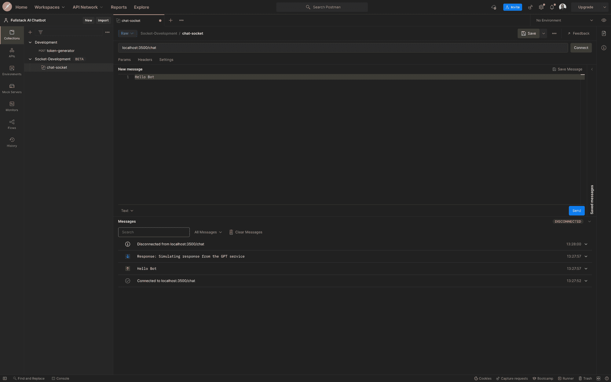
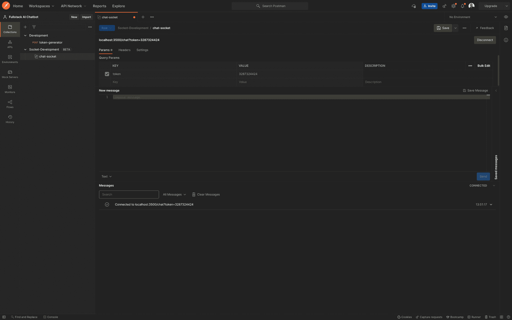
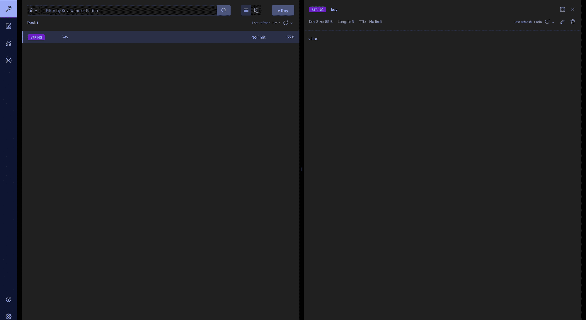
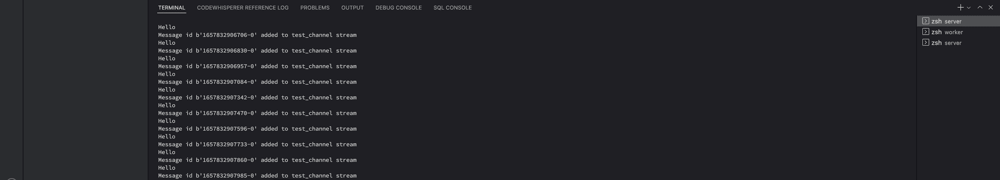
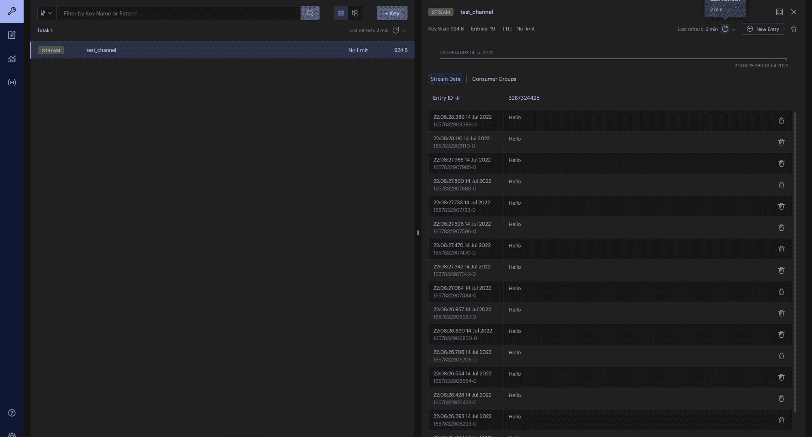
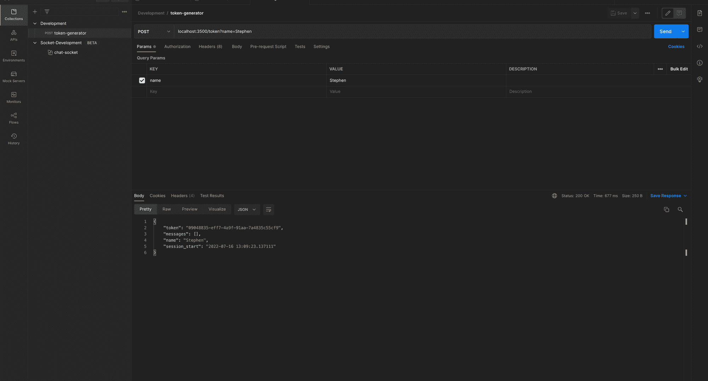
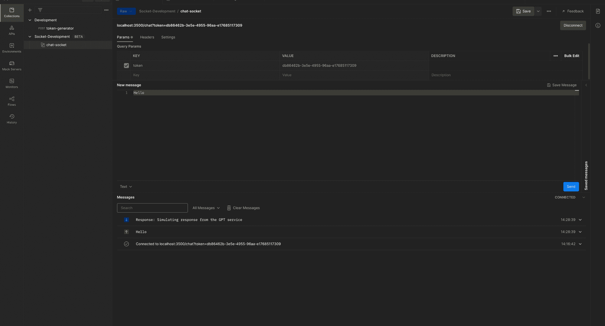
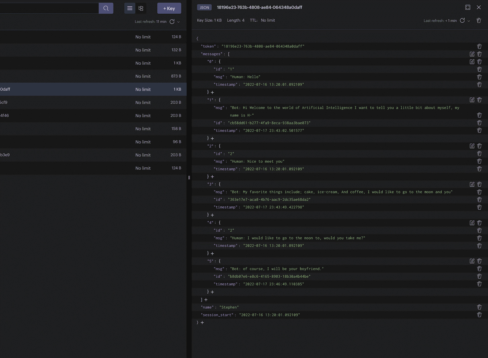

# 人工智能聊天机器人手册——如何用 Redis、Python 和 GPT 构建人工智能聊天机器人

> 原文：<https://www.freecodecamp.org/news/how-to-build-an-ai-chatbot-with-redis-python-and-gpt/>

为了构建一个正常工作的全栈应用，需要考虑很多活动的部分。你需要做出许多决定，这些决定对你的应用程序的成功至关重要。

比如你会用什么语言，部署在什么平台上？你打算在服务器上部署一个容器化的软件，还是利用无服务器的功能来处理后端？您是否计划使用第三方 API 来处理应用程序的复杂部分，如身份验证或支付？你把数据储存在哪里？

除此之外，你还需要考虑用户界面、应用程序的设计和可用性等等。

这就是为什么复杂的大型应用程序需要多功能开发团队协作来构建应用程序。

学习如何开发全栈应用的最好方法之一是构建覆盖端到端开发过程的项目。您将经历设计架构、开发 API 服务、开发用户界面，以及最终部署您的应用程序。

因此，本教程将带您了解构建人工智能聊天机器人的过程，以帮助您深入学习这些概念。

我们将涉及的一些主题包括:

*   如何用 Python、FastAPI 和 WebSockets 构建 API
*   如何用 Redis 构建实时系统
*   如何用 React 构建聊天用户界面

**重要提示:**
这是一个中级全栈软件开发项目，需要一些基本的 Python 和 JavaScript 知识。

我已经仔细地将项目分成几个部分，以确保您可以轻松地选择对您来说重要的阶段，以防您不希望编写完整的应用程序。

你可以在我的 Github 上下载完整的库。

## 目录

### 第一节

*   [应用架构](#application-architecture)
*   [如何设置开发环境](#how-to-set-up-the-development-environment)

### 第二节

*   [如何用 Python、FastAPI 和 WebSockets 构建聊天服务器](#how-to-build-a-chat-server-with-python-fastapi-and-websockets)
    *   [如何设置 Python 环境](#how-to-set-up-the-python-environment)
    *   [FastAPI Server Setup](#fastapi-server-setup)
    *   [如何向 API 添加路线](#how-to-add-routes-to-the-api)
    *   [如何生成与 UUID 的聊天会话令牌](#how-to-generate-a-chat-session-token-with-uuid)
    *   [如何用 Postman 测试 API](#how-to-test-the-api-with-postman)
    *   [Websockets 和连接管理器](#websockets-and-connection-manager)
    *   [FastAPI 中的依赖注入](#dependency-injection-in-fastapi)

### 第三节

*   如何用 Redis 构建实时系统
    *   [Redis 和分布式消息队列](#redis-and-distributed-messaging-queues)
    *   [如何使用 Redis 客户端连接到 Python 中的 Redis 集群](#how-to-connect-to-a-redis-cluster-in-python-with-a-redis-client)
    *   [如何使用 Redis 流](#how-to-work-with-redis-streams)
    *   [如何对聊天数据建模](#how-to-model-the-chat-data)
    *   [如何使用 Redis JSON](#how-to-work-with-redis-json)
    *   [如何更新令牌依赖关系](#how-to-update-the-token-dependency)

### 第四节

*   [如何用 AI 模型给聊天机器人添加智能](#how-to-add-intelligence-to-chatbots-with-ai-models)
    *   [如何开始使用 Huggingface](#how-to-get-started-with-huggingface)
    *   [如何与语言模型互动](#how-to-interact-with-the-language-model)
    *   [如何模拟人工智能模型的短期记忆](#how-to-simulate-short-term-memory-for-the-ai-model)
    *   [从消息队列中提取流消费者和实时数据](#stream-consumer-and-real-time-data-pull-from-the-message-queue)
    *   [如何用人工智能响应更新聊天客户端](#how-to-update-the-chat-client-with-the-ai-response)
    *   [刷新令牌](#refresh-token)
    *   [如何在 Postman 中测试与多个客户端的聊天](#how-to-test-the-chat-with-multiple-clients-in-postman)

## 应用架构

勾勒出一个解决方案架构可以让您对您的应用程序、您打算使用的工具以及组件之间如何通信有一个高层次的概述。

我用 [draw.io](http://draw.io) 画了一个简单的架构如下:


Fullstack chatbot architecture

让我们更详细地看一下架构的各个部分:

### 客户端/用户界面

我们将使用 React 版本 18 来构建用户界面。聊天 UI 将通过 WebSockets 与后端通信。

### GPT-J-6B 和拥抱脸推理 API

GPT-J-6B 是一个生成语言模型，用 60 亿个参数训练，在一些任务上与 OpenAI 的 GPT-3 表现接近。

我选择使用 GPT-J-6B，因为它是一个开源模型，简单的用例不需要付费令牌。

Huggingface 还为我们提供了一个几乎免费的按需 API 来连接这个模型。你可以阅读更多关于 [GPT-J-6B](https://huggingface.co/EleutherAI/gpt-j-6B?text=My+name+is+Teven+and+I+am) 和[拥抱面部推断 API](https://huggingface.co/inference-api) 的内容。

### 雷迪斯

当我们向 GPT 发送提示时，我们需要一种方法来存储提示并方便地检索响应。我们将使用 Redis JSON 来存储聊天数据，并使用 Redis 流来处理与 huggingface 推理 API 的实时通信。

Redis 是一个内存中的键值存储，支持超快速地读取和存储类似 JSON 的数据。对于本教程，我们将使用由 [Redis Enterprise](https://redis.info/3NBGJRT) 提供的托管免费 Redis 存储进行测试。

### Web 套接字和聊天 API

为了在客户机和服务器之间实时发送消息，我们需要打开一个套接字连接。这是因为 HTTP 连接不足以确保客户端和服务器之间的实时双向通信。

我们将使用 FastAPI 作为聊天服务器，因为它为我们提供了一个快速和现代的 Python 服务器。查看 FastAPI 文档，了解更多关于 WebSockets 的信息。

## 如何设置开发环境

你可以使用你想要的操作系统来构建这个应用程序——我目前使用的是 MacOS 和 Visual Studio 代码。只要确保你已经安装了 Python 和 NodeJs。

要设置项目结构，创建一个名为`fullstack-ai-chatbot`的文件夹。然后在项目中创建两个名为`client`和`server`的文件夹。服务器将保存后端的代码，而客户端将保存前端的代码。

接下来，在项目目录中，使用“git init”命令初始化项目文件夹根目录中的 Git 存储库。然后使用“touch”创建一个. gitignore 文件。gitignore”:

```
git init
touch .gitignore 
```

在下一节中，我们将使用 FastAPI 和 Python 构建我们的聊天 web 服务器。

## 如何用 Python、FastAPI 和 WebSockets 构建聊天服务器

在本节中，我们将使用 FastAPI 构建聊天服务器来与用户通信。我们将使用 WebSockets 来确保客户端和服务器之间的双向通信，这样我们就可以实时地向用户发送响应。

### 如何设置 Python 环境

要启动我们的服务器，我们需要设置 Python 环境。在 VS 代码中打开项目文件夹，并打开终端。

从项目根目录，将 cd 放入服务器目录并运行`python3.8 -m venv env`。这将为我们的 Python 项目创建一个 [**虚拟环境**](https://blog.stephensanwo.dev/virtual-environments-in-python) ，命名为`env`。要激活虚拟环境，运行`source env/bin/activate`

接下来，在 Python 环境中安装几个库。

```
pip install fastapi uuid uvicorn gunicorn WebSockets python-dotenv aioredis 
```

接下来，通过在终端中运行`touch .env`创建一个环境文件。我们将在`.env`文件中定义我们的应用程序变量和秘密变量。

添加您的 app 环境变量，并将其设置为“开发”，如下所示:`export APP_ENV=development`。接下来，我们将设置一个带有 FastAPI 服务器的开发服务器。

### FastAPI Server Setup

在服务器目录的根目录下，创建一个名为`main.py`的新文件，然后为开发服务器粘贴以下代码:

```
from fastapi import FastAPI, Request
import uvicorn
import os
from dotenv import load_dotenv

load_dotenv()

api = FastAPI()

@api.get("/test")
async def root():
    return {"msg": "API is Online"}

if __name__ == "__main__":
    if os.environ.get('APP_ENV') == "development":
        uvicorn.run("main:api", host="0.0.0.0", port=3500,
                    workers=4, reload=True)
    else:
      pass 
```

首先我们`import FastAPI`并将其初始化为`api`。然后我们从`python-dotenv`库中调用`import load_dotenv`，并初始化它以从`.env`文件中加载变量，

然后我们创建一个简单的测试路径来测试 API。测试路径将返回一个简单的 JSON 响应，告诉我们 API 在线。

最后，我们通过使用`uvicorn.run`并提供所需的参数来设置开发服务器。API 将在端口`3500`上运行。

最后用`python main.py`在终端运行服务器。在终端中看到`Application startup complete`后，在浏览器上导航到 URL[http://localhost:3500/test](http://localhost:3500/test)，您应该会看到这样一个网页:


API Test Page

### 如何向 API 添加路线

在本节中，我们将向 API 添加路由。创建一个名为`src`的新文件夹。这是我们所有 API 代码所在的目录。

创建一个名为`routes`的子文件夹，将 cd 放入该文件夹，创建一个名为`chat.py`的新文件，然后添加下面的代码:

```
import os
from fastapi import APIRouter, FastAPI, WebSocket,  Request

chat = APIRouter()

# @route   POST /token
# @desc    Route to generate chat token
# @access  Public

@chat.post("/token")
async def token_generator(request: Request):
    return None

# @route   POST /refresh_token
# @desc    Route to refresh token
# @access  Public

@chat.post("/refresh_token")
async def refresh_token(request: Request):
    return None

# @route   Websocket /chat
# @desc    Socket for chatbot
# @access  Public

@chat.websocket("/chat")
async def websocket_endpoint(websocket: WebSocket = WebSocket):
    return None 
```

我们创建了三个端点:

*   `/token`将向用户发放一个会话令牌，用于访问聊天会话。由于聊天应用程序将公开开放，我们不想担心身份验证，只是保持简单——但我们仍然需要一种方法来识别每个独特的用户会话。
*   如果连接丢失，只要令牌仍处于活动状态且未过期，`/refresh_token`将获取用户的会话历史记录。
*   `/chat`将打开一个 WebSocket 在客户端和服务器之间发送消息。

接下来，将聊天路由连接到我们的主 API。首先我们需要在我们的`main.py`文件中`import chat from src.chat`。然后，我们将通过在初始化的`FastAPI`类上调用一个`include_router`方法并传递 chat 作为参数来包含路由器。

更新您的`api.py`代码，如下所示:

```
from fastapi import FastAPI, Request
import uvicorn
import os
from dotenv import load_dotenv
from routes.chat import chat

load_dotenv()

api = FastAPI()
api.include_router(chat)

@api.get("/test")
async def root():
    return {"msg": "API is Online"}

if __name__ == "__main__":
    if os.environ.get('APP_ENV') == "development":
        uvicorn.run("main:api", host="0.0.0.0", port=3500,
                    workers=4, reload=True)
    else:
        pass 
```

### 如何生成与 UUID 的聊天会话令牌

为了生成用户令牌，我们将使用`uuid4`为我们的聊天端点创建动态路由。因为这是一个公开可用的端点，所以我们不需要详细讨论 jwt 和认证。

如果你最初没有安装`uuid`，运行`pip install uuid`。接下来在 chat.py 中，导入 UUID，并用下面的代码更新`/token`路线:

```
 from fastapi import APIRouter, FastAPI, WebSocket,  Request, BackgroundTasks, HTTPException
import uuid

# @route   POST /token
# @desc    Route generating chat token
# @access  Public

@chat.post("/token")
async def token_generator(name: str, request: Request):

    if name == "":
        raise HTTPException(status_code=400, detail={
            "loc": "name",  "msg": "Enter a valid name"})

    token = str(uuid.uuid4())

    data = {"name": name, "token": token}

    return data 
```

在上面的代码中，客户端提供了他们的名字，这是必需的。我们快速检查以确保 name 字段不为空，然后使用 uuid4 生成一个令牌。

会话数据是名称和令牌的简单字典。最终，我们将需要保存这个会话数据并设置一个超时，但是现在我们只是把它返回给客户端。

### 如何用 Postman 测试 API

因为我们将测试一个 WebSocket 端点，所以我们需要使用一个类似于 [Postman](https://www.postman.com) 的工具来实现这一点(因为 FastAPI 上的默认 swagger docs 不支持 WebSockets)。

在 Postman 中，为您的开发环境创建一个集合，并向`localhost:3500/token`发送一个 POST 请求，将名称指定为查询参数并向其传递一个值。您应该会得到如下所示的响应:


Token Generator Postman

### Websockets 和连接管理器

在 src 根目录下，创建一个名为`socket`的新文件夹，并添加一个名为`connection.py`的文件。在这个文件中，我们将定义控制 WebSockets 连接的类，以及连接和断开连接的所有 helper 方法。

在`connection.py`中添加以下代码:

```
 from fastapi import WebSocket

class ConnectionManager:
    def __init__(self):
        self.active_connections: List[WebSocket] = []

    async def connect(self, websocket: WebSocket):
        await websocket.accept()
        self.active_connections.append(websocket)

    def disconnect(self, websocket: WebSocket):
        self.active_connections.remove(websocket)

    async def send_personal_message(self, message: str, websocket: WebSocket):
        await websocket.send_text(message) 
```

用一个活动连接列表的属性`active_connections`初始化`ConnectionManager`类。

然后，异步`connect`方法将接受一个`WebSocket`并将其添加到活动连接列表中，而`disconnect`方法将从活动连接列表中删除`Websocket`。

最后，`send_personal_message`方法将接收一条消息，我们希望将消息发送给`Websocket`并异步发送消息。

WebSockets 是一个非常广泛的话题，我们在这里只触及了皮毛。然而，这应该足以创建多个连接并异步处理到这些连接的消息。

你可以阅读更多关于 [FastAPI Websockets](https://fastapi.tiangolo.com/advanced/websockets/?h=depends#using-depends-and-others) 和 [Sockets 编程](https://realpython.com/python-sockets/)的内容。

要使用`ConnectionManager`，在`src.routes.chat.py`中导入并初始化它，用下面的代码更新`/chat` WebSocket 路由:

```
from ..socket.connection import ConnectionManager

manager = ConnectionManager()

@chat.websocket("/chat")
async def websocket_endpoint(websocket: WebSocket):
    await manager.connect(websocket)
    try:
        while True:
            data = await websocket.receive_text()
            print(data)
            await manager.send_personal_message(f"Response: Simulating response from the GPT service", websocket)

    except WebSocketDisconnect:
        manager.disconnect(websocket) 
```

在接受 WebSocket 的`websocket_endpoint`函数中，我们将新的 websocket 添加到连接管理器中，并运行一个`while True`循环，以确保套接字保持打开。除非套接字断开连接。

当连接打开时，我们接收客户端用`websocket.receive_test()`发送的任何消息，并暂时将它们打印到终端。

现在，我们向客户端发送一个硬编码的响应。最终，从客户端收到的消息将被发送到 AI 模型，发送回客户端的响应将是来自 AI 模型的响应。

在 Postman 中，我们可以通过创建一个新的 WebSocket 请求并连接到 WebSocket 端点`localhost:3500/chat`来测试这个端点。

当您单击 connect 时，Messages 窗格将显示 API 客户端已连接到 URL，并且套接字已打开。

要对此进行测试，请向聊天服务器发送一条消息“Hello Bot ”,您应该会立即得到测试响应“Response:Simulating Response from the GPT 服务”,如下所示:



Postman Chat Test

### FastAPI 中的依赖注入

为了能够区分两个不同的客户端会话并限制聊天会话，我们将使用一个定时令牌，作为查询参数传递给 WebSocket 连接。

在 socket 文件夹中，创建一个名为`utils.py`的文件，然后添加以下代码:

```
from fastapi import WebSocket, status, Query
from typing import Optional

async def get_token(
    websocket: WebSocket,
    token: Optional[str] = Query(None),
):
    if token is None or token == "":
        await websocket.close(code=status.WS_1008_POLICY_VIOLATION)

    return token 
```

get_token 函数接收一个 WebSocket 和令牌，然后检查令牌是否为 None 或 null。

如果是这种情况，该函数返回策略违反状态，如果可用，该函数只返回令牌。我们最终将通过额外的令牌验证来扩展这个函数。

为了使用这个函数，我们将它注入到`/chat`路径中。FastAPI 提供了一个 Depends 类来轻松注入依赖项，所以我们不必修补 decorators。

将`/chat`路线更新为:

```
from ..socket.utils import get_token

@chat.websocket("/chat")
async def websocket_endpoint(websocket: WebSocket, token: str = Depends(get_token)):
    await manager.connect(websocket)
    try:
        while True:
            data = await websocket.receive_text()
            print(data)
            await manager.send_personal_message(f"Response: Simulating response from the GPT service", websocket)

    except WebSocketDisconnect:
        manager.disconnect(websocket) 
```

现在，当您尝试连接到 Postman 中的`/chat`端点时，将会得到一个 403 错误。现在，提供一个令牌作为查询参数，并为令牌提供任何值。然后，您应该能够像以前一样连接，只是现在连接需要一个令牌。



Postman Chat Test with Token

恭喜你走到这一步！您的`chat.py`文件现在应该是这样的:

```
import os
from fastapi import APIRouter, FastAPI, WebSocket, WebSocketDisconnect, Request, Depends, HTTPException
import uuid
from ..socket.connection import ConnectionManager
from ..socket.utils import get_token

chat = APIRouter()

manager = ConnectionManager()

# @route   POST /token
# @desc    Route to generate chat token
# @access  Public

@chat.post("/token")
async def token_generator(name: str, request: Request):
    token = str(uuid.uuid4())

    if name == "":
        raise HTTPException(status_code=400, detail={
            "loc": "name",  "msg": "Enter a valid name"})

    data = {"name": name, "token": token}

    return data

# @route   POST /refresh_token
# @desc    Route to refresh token
# @access  Public

@chat.post("/refresh_token")
async def refresh_token(request: Request):
    return None

# @route   Websocket /chat
# @desc    Socket for chatbot
# @access  Public

@chat.websocket("/chat")
async def websocket_endpoint(websocket: WebSocket, token: str = Depends(get_token)):
    await manager.connect(websocket)
    try:
        while True:
            data = await websocket.receive_text()
            print(data)
            await manager.send_personal_message(f"Response: Simulating response from the GPT service", websocket)

    except WebSocketDisconnect:
        manager.disconnect(websocket) 
```

在本教程的下一部分中，我们将关注于处理应用程序的状态以及在客户机和服务器之间传递数据。

## 如何用 Redis 构建实时系统

我们的应用程序目前不存储任何状态，也没有办法识别用户或存储和检索聊天数据。我们还在聊天会话期间向客户端返回硬编码的响应。

在本部分教程中，我们将介绍以下内容:

*   如何用 Python 连接一个 **Redis 集群**并设置一个 **Redis 客户端**
*   如何用 **Redis JSON** 存储和检索数据
*   如何将 **Redis 流**设置为 web 服务器和工作环境之间的消息队列

### Redis 和分布式消息队列

Redis 是一个开源的内存数据存储，可以用作数据库、缓存、消息代理和流引擎。它支持多种数据结构，是具有实时功能的分布式应用程序的完美解决方案。

**Redis 企业云**是 Redis 提供的完全托管的云服务，帮助我们无限规模地部署 Redis 集群，而无需担心基础设施。

在本教程中，我们将使用免费的 Redis 企业云实例。你可以[在这里免费开始使用 Redis Cloud】并按照](https://redis.com/try-free/?utm_campaign=write_for_redis)[这个教程建立一个 Redis 数据库和 Redis Insight，一个与 Redis 交互的 GUI](https://developer.redis.com/create/rediscloud/)。

一旦建立了 Redis 数据库，就在项目根目录下(在服务器文件夹之外)创建一个名为`worker`的新文件夹。

我们将把我们的 worker 环境与 web 服务器隔离开来，这样当客户机向我们的 WebSocket 发送消息时，web 服务器就不必处理对第三方服务的请求。此外，还可以为其他用户释放资源。

与推理 API 的后台通信由这个工作服务通过 Redis 处理。

来自所有连接的客户机的请求被附加到消息队列(生产者),而工人使用消息，将请求发送到推理 API，并将响应附加到响应队列。

一旦 API 收到响应，它就把它发送回客户机。

在生产者和消费者之间的旅程中，客户端可以发送多条消息，这些消息将被排队并按顺序响应。

理想情况下，我们可以让这个 worker 运行在一个完全不同的服务器上，在它自己的环境中，但是现在，我们将在本地机器上创建它自己的 Python 环境。

你可能想知道—**我们为什么需要工人？**想象一个场景，web 服务器也创建对第三方服务的请求。这意味着在套接字连接期间等待来自第三方服务的响应时，服务器被阻塞，资源被占用，直到从 API 获得响应。

您可以通过在发送硬编码响应之前创建一个随机睡眠`time.sleep(10)`并发送一个新消息来尝试这一点。然后在新的邮递员会话中尝试使用不同的令牌进行连接。

您会注意到，在随机睡眠超时之前，聊天会话不会连接。

虽然我们可以在更侧重于生产的服务器设置中使用异步技术和工作池，但随着并发用户数量的增长，这还不够。

最终，我们希望通过使用 Redis 来代理我们的聊天 API 和第三方 API 之间的通信，从而避免占用 web 服务器资源。

接下来打开一个新的终端，cd 到 worker 文件夹，创建并激活一个新的 Python 虚拟环境，类似于我们在第 1 部分中所做的。

接下来，安装以下依赖项:

```
pip install aiohttp aioredis python-dotenv 
```

### 如何使用 Redis 客户端连接到 Python 中的 Redis 集群

我们将使用 aioredis 客户机来连接 redis 数据库。我们还将使用请求库向 Huggingface 推理 API 发送请求。

创建两个文件`.env`和`main.py`。然后创建一个名为`src`的文件夹。另外，创建一个名为`redis`的文件夹，并添加一个名为`config.py`的新文件。

在`.env`文件中，添加以下代码——并确保使用 Redis 集群中提供的凭证更新字段。

```
export REDIS_URL=<REDIS URL PROVIDED IN REDIS CLOUD>
export REDIS_USER=<REDIS USER IN REDIS CLOUD>
export REDIS_PASSWORD=<DATABASE PASSWORD IN REDIS CLOUD>
export REDIS_HOST=<REDIS HOST IN REDIS CLOUD>
export REDIS_PORT=<REDIS PORT IN REDIS CLOUD> 
```

在 config.py 中，添加下面的 Redis 类:

```
import os
from dotenv import load_dotenv
import aioredis

load_dotenv()

class Redis():
    def __init__(self):
        """initialize  connection """
        self.REDIS_URL = os.environ['REDIS_URL']
        self.REDIS_PASSWORD = os.environ['REDIS_PASSWORD']
        self.REDIS_USER = os.environ['REDIS_USER']
        self.connection_url = f"redis://{self.REDIS_USER}:{self.REDIS_PASSWORD}@{self.REDIS_URL}"

    async def create_connection(self):
        self.connection = aioredis.from_url(
            self.connection_url, db=0)

        return self.connection 
```

我们创建一个 Redis 对象，并从环境变量中初始化所需的参数。然后我们创建一个异步方法`create_connection`来创建一个 Redis 连接，并返回从`aioredis`方法`from_url`获得的连接池。

接下来，我们通过运行下面的代码测试 main.py 中的 Redis 连接。这将创建一个新的 Redis 连接池，设置一个简单的键“key”，并为其分配一个字符串“value”。

```
 from src.redis.config import Redis
import asyncio

async def main():
    redis = Redis()
    redis = await redis.create_connection()
    print(redis)
    await redis.set("key", "value")

if __name__ == "__main__":
    asyncio.run(main()) 
```

现在打开 Redis Insight(如果您按照教程下载并安装了它),您应该会看到类似这样的内容:



Redis Insight Test

### 如何使用 Redis 流

现在我们已经设置了工作环境，我们可以在 web 服务器上创建一个生产者，在工作环境上创建一个消费者。

首先，让我们在服务器上再次创建 Redis 类。在`server.src`中创建一个名为`redis`的文件夹，并添加两个文件`config.py`和`producer.py`。

在`config.py`中，添加下面的代码，就像我们为工人环境所做的那样:

```
import os
from dotenv import load_dotenv
import aioredis

load_dotenv()

class Redis():
    def __init__(self):
        """initialize  connection """
        self.REDIS_URL = os.environ['REDIS_URL']
        self.REDIS_PASSWORD = os.environ['REDIS_PASSWORD']
        self.REDIS_USER = os.environ['REDIS_USER']
        self.connection_url = f"redis://{self.REDIS_USER}:{self.REDIS_PASSWORD}@{self.REDIS_URL}"

    async def create_connection(self):
        self.connection = aioredis.from_url(
            self.connection_url, db=0)

        return self.connection 
```

在。env 文件，还添加了 Redis 凭据:

```
export REDIS_URL=<REDIS URL PROVIDED IN REDIS CLOUD>
export REDIS_USER=<REDIS USER IN REDIS CLOUD>
export REDIS_PASSWORD=<DATABASE PASSWORD IN REDIS CLOUD>
export REDIS_HOST=<REDIS HOST IN REDIS CLOUD>
export REDIS_PORT=<REDIS PORT IN REDIS CLOUD> 
```

最后，在`server.src.redis.producer.py`中添加以下代码:

```
 from .config import Redis

class Producer:
    def __init__(self, redis_client):
        self.redis_client = redis_client

    async def add_to_stream(self,  data: dict, stream_channel):
        try:
            msg_id = await self.redis_client.xadd(name=stream_channel, id="*", fields=data)
            print(f"Message id {msg_id} added to {stream_channel} stream")
            return msg_id

        except Exception as e:
            print(f"Error sending msg to stream => {e}") 
```

我们创建了一个用 Redis 客户机初始化的生产者类。我们使用这个客户端通过`add_to_stream`方法将数据添加到流中，该方法接受数据和 Redis 通道名称。

用于向流通道添加数据的 Redis 命令是`xadd`，它在 aioredis 中具有高级和低级功能。

接下来，要运行我们新创建的生产者，更新`chat.py`和 WebSocket `/chat`端点，如下所示。注意更新后的频道名称`message_channel`。

```
 from ..redis.producer import Producer
from ..redis.config import Redis

chat = APIRouter()
manager = ConnectionManager()
redis = Redis()

@chat.websocket("/chat")
async def websocket_endpoint(websocket: WebSocket, token: str = Depends(get_token)):
    await manager.connect(websocket)
    redis_client = await redis.create_connection()
    producer = Producer(redis_client)

    try:
        while True:
            data = await websocket.receive_text()
            print(data)
            stream_data = {}
            stream_data[token] = data
            await producer.add_to_stream(stream_data, "message_channel")
            await manager.send_personal_message(f"Response: Simulating response from the GPT service", websocket)

    except WebSocketDisconnect:
        manager.disconnect(websocket) 
```

接下来，在 Postman 中，创建一个连接并发送任意数量的写有`Hello`的消息。您应该将流消息打印到终端，如下所示:



Terminal Channel Messages Test

在 Redis Insight 中，您将看到创建了一个新的`mesage_channel`,一个带有时间戳的队列填充了从客户端发送的消息。这个带时间戳的队列对于保持消息的顺序非常重要。



Redis Insight Channel

### 如何对聊天数据建模

接下来，我们将为我们的聊天消息创建一个模型。回想一下，我们通过 WebSockets 发送文本数据，但是我们的聊天数据需要包含比文本更多的信息。我们需要在发送聊天时打上时间戳，为每条消息创建一个 ID，收集关于聊天会话的数据，然后将这些数据存储为 JSON 格式。

我们可以将这个 JSON 数据存储在 Redis 中，这样一旦连接丢失，我们就不会丢失聊天历史，因为我们的 WebSocket 不存储状态。

在`server.src`中创建一个名为`schema`的新文件夹。然后创建一个名为`chat.py`的文件，在`server.src.schema`中添加以下代码:

```
from datetime import datetime
from pydantic import BaseModel
from typing import List, Optional
import uuid

class Message(BaseModel):
    id = uuid.uuid4()
    msg: str
    timestamp = str(datetime.now())

class Chat(BaseModel):
    token: str
    messages: List[Message]
    name: str
    session_start = str(datetime.now()) 
```

我们使用 Pydantic 的`BaseModel`类来建模聊天数据。`Chat`类将保存单个聊天会话的数据。它将存储令牌、用户名和使用`datetime.now()`自动生成的聊天会话开始时间的时间戳。

在这个聊天会话中发送和接收的消息存储在一个`Message`类中，该类使用`uuid4`动态创建一个聊天 id。初始化这个`Message`类时，我们需要提供的唯一数据是消息文本。

### 如何使用 Redis JSON

为了使用 Redis JSON 存储我们聊天记录的能力，我们需要安装 Redis labs 提供的 [rejson](https://github.com/RedisJSON/redisjson-py) 。

在终端中，将 cd 插入`server`并安装带有`pip install rejson`的 rejson。然后更新`server.src.redis.config.py`中的`Redis`类，以包含`create_rejson_connection`方法:

```
 import os
from dotenv import load_dotenv
import aioredis
from rejson import Client

load_dotenv()

class Redis():
    def __init__(self):
        """initialize  connection """
        self.REDIS_URL = os.environ['REDIS_URL']
        self.REDIS_PASSWORD = os.environ['REDIS_PASSWORD']
        self.REDIS_USER = os.environ['REDIS_USER']
        self.connection_url = f"redis://{self.REDIS_USER}:{self.REDIS_PASSWORD}@{self.REDIS_URL}"
        self.REDIS_HOST = os.environ['REDIS_HOST']
        self.REDIS_PORT = os.environ['REDIS_PORT']

    async def create_connection(self):
        self.connection = aioredis.from_url(
            self.connection_url, db=0)

        return self.connection

    def create_rejson_connection(self):
        self.redisJson = Client(host=self.REDIS_HOST,
                                port=self.REDIS_PORT, decode_responses=True, username=self.REDIS_USER, password=self.REDIS_PASSWORD)

        return self.redisJson 
```

我们添加了`create_rejson_connection`方法，用 rejson `Client`连接到 Redis。这为我们提供了在 Redis 中创建和操作 JSON 数据的方法，这在 aioredis 中是不可用的。

接下来，在`server.src.routes.chat.py`中，我们可以更新`/token`端点来创建一个新的`Chat`实例，并将会话数据存储在 Redis JSON 中，如下所示:

```
@chat.post("/token")
async def token_generator(name: str, request: Request):
    token = str(uuid.uuid4())

    if name == "":
        raise HTTPException(status_code=400, detail={
            "loc": "name",  "msg": "Enter a valid name"})

    # Create new chat session
    json_client = redis.create_rejson_connection()

    chat_session = Chat(
        token=token,
        messages=[],
        name=name
    )

    # Store chat session in redis JSON with the token as key
    json_client.jsonset(str(token), Path.rootPath(), chat_session.dict())

    # Set a timeout for redis data
    redis_client = await redis.create_connection()
    await redis_client.expire(str(token), 3600)

    return chat_session.dict() 
```

注意:因为这是一个演示应用程序，我不想在 Redis 中存储聊天数据太长时间。因此，我使用 aioredis 客户机在令牌上添加了 60 分钟的超时(rejson 不实现超时)。这意味着 60 分钟后，聊天会话数据将会丢失。

这是必要的，因为我们不对用户进行身份验证，并且我们希望在定义的时间段后转储聊天数据。这一步是可选的，你不必包括它。

接下来，在 Postman 中，当您发送创建新令牌的 POST 请求时，您将得到如下所示的结构化响应。您还可以检查 Redis Insight，查看您的聊天数据，将令牌存储为 JSON 键，将数据存储为值。



Token Generator Updated

### 如何更新令牌依赖关系

现在我们已经生成并存储了一个令牌，这是更新我们的`/chat` WebSocket 中的`get_token`依赖项的好时机。我们这样做是为了在开始聊天会话之前检查有效的令牌。

在`server.src.socket.utils.py`中，更新`get_token`函数以检查 Redis 实例中是否存在令牌。如果是，那么我们返回令牌，这意味着套接字连接是有效的。如果它不存在，我们就关闭连接。

由`/token`创建的令牌将在 60 分钟后消失。因此，我们可以在前端使用一些简单的逻辑来重定向用户，以便在尝试开始聊天时生成错误响应时生成新的令牌。

```
 from ..redis.config import Redis

async def get_token(
    websocket: WebSocket,
    token: Optional[str] = Query(None),
):

    if token is None or token == "":
        await websocket.close(code=status.WS_1008_POLICY_VIOLATION)

    redis_client = await redis.create_connection()
    isexists = await redis_client.exists(token)

    if isexists == 1:
        return token
    else:
        await websocket.close(code=status.WS_1008_POLICY_VIOLATION, reason="Session not authenticated or expired token") 
```

为了测试依赖性，使用我们一直使用的随机令牌连接到聊天会话，您应该会得到一个 403 错误。(请注意，您必须在 Redis Insight 中手动删除令牌。)

现在复制向`/token`端点发送 post 请求时生成的令牌(或者创建一个新请求),并将其作为值粘贴到`/chat` WebSocket 所需的令牌查询参数中。然后连接。您应该可以成功连接。



Chat Session with Token

综上所述，您的 chat.py 应该如下所示。

```
 import os
from fastapi import APIRouter, FastAPI, WebSocket, WebSocketDisconnect, Request, Depends
import uuid
from ..socket.connection import ConnectionManager
from ..socket.utils import get_token
import time
from ..redis.producer import Producer
from ..redis.config import Redis
from ..schema.chat import Chat
from rejson import Path

chat = APIRouter()
manager = ConnectionManager()
redis = Redis()

# @route   POST /token
# @desc    Route to generate chat token
# @access  Public

@chat.post("/token")
async def token_generator(name: str, request: Request):
    token = str(uuid.uuid4())

    if name == "":
        raise HTTPException(status_code=400, detail={
            "loc": "name",  "msg": "Enter a valid name"})

    # Create nee chat session
    json_client = redis.create_rejson_connection()
    chat_session = Chat(
        token=token,
        messages=[],
        name=name
    )

    print(chat_session.dict())

    # Store chat session in redis JSON with the token as key
    json_client.jsonset(str(token), Path.rootPath(), chat_session.dict())

    # Set a timeout for redis data
    redis_client = await redis.create_connection()
    await redis_client.expire(str(token), 3600)

    return chat_session.dict()

# @route   POST /refresh_token
# @desc    Route to refresh token
# @access  Public

@chat.post("/refresh_token")
async def refresh_token(request: Request):
    return None

# @route   Websocket /chat
# @desc    Socket for chat bot
# @access  Public

@chat.websocket("/chat")
async def websocket_endpoint(websocket: WebSocket, token: str = Depends(get_token)):
    await manager.connect(websocket)
    redis_client = await redis.create_connection()
    producer = Producer(redis_client)
    json_client = redis.create_rejson_connection()

    try:
        while True:
            data = await websocket.receive_text()
            stream_data = {}
            stream_data[token] = data
            await producer.add_to_stream(stream_data, "message_channel")
            await manager.send_personal_message(f"Response: Simulating response from the GPT service", websocket)

    except WebSocketDisconnect:
        manager.disconnect(websocket) 
```

干得好，走到了这一步！在下一节中，我们将重点关注与 AI 模型的通信，以及处理客户机、服务器、工作器和外部 API 之间的数据传输。

## 如何用 AI 模型给聊天机器人添加智能

在这一节中，我们将着重于构建一个包装器来与 transformer 模型进行通信，以对话格式将提示从用户发送到 API，并接收和转换我们的聊天应用程序的响应。

### 如何开始使用 Huggingface

我们不会在 Hugginface 上构建或部署任何语言模型。相反，我们将专注于使用 Huggingface 的加速推理 API 来连接预训练的模型。

我们将使用的模型是由 EleutherAI 提供的 [GPT-J-6B 模型。这是一个用 60 亿个参数训练出来的生成语言模型。](https://huggingface.co/EleutherAI/gpt-j-6B)

Huggingface 为我们提供了一个随需应变的有限 API 来连接这个模型，几乎是免费的。

要开始使用 Huggingface，[创建一个免费帐户](https://huggingface.co/pricing)。在您的设置中，[生成一个新的访问令牌](https://huggingface.co/settings/tokens)。对于高达 30k 的令牌，Huggingface 免费提供对推理 API 的访问。

您可以[在这里](https://api-inference.huggingface.co/dashboard/usage)监控您的 API 使用情况。请确保您保管好这个令牌，不要公开暴露它。

注意:我们将使用 HTTP 连接与 API 通信，因为我们使用的是免费帐户。但是 PRO Huggingface 帐户支持 WebSockets 流[见并行和批处理作业](https://huggingface.co/docs/api-inference/parallelism)。

这有助于显著提高模型和我们的聊天应用程序之间的响应时间，我希望在后续文章中介绍这种方法。

### 如何与语言模型交互

首先，我们将 Huggingface 连接凭据添加到。env 文件放在我们的 worker 目录中。

```
export HUGGINFACE_INFERENCE_TOKEN=<HUGGINGFACE ACCESS TOKEN>
export MODEL_URL=https://api-inference.huggingface.co/models/EleutherAI/gpt-j-6B 
```

接下来，在`worker.src`中创建一个名为`model`的文件夹，然后添加一个文件`gptj.py`。然后在下面添加 GPT 类:

```
import os
from dotenv import load_dotenv
import requests
import json

load_dotenv()

class GPT:
    def __init__(self):
        self.url = os.environ.get('MODEL_URL')
        self.headers = {
            "Authorization": f"Bearer {os.environ.get('HUGGINFACE_INFERENCE_TOKEN')}"}
        self.payload = {
            "inputs": "",
            "parameters": {
                "return_full_text": False,
                "use_cache": True,
                "max_new_tokens": 25
            }

        }

    def query(self, input: str) -> list:
        self.payload["inputs"] = input
        data = json.dumps(self.payload)
        response = requests.request(
            "POST", self.url, headers=self.headers, data=data)
        print(json.loads(response.content.decode("utf-8")))
        return json.loads(response.content.decode("utf-8"))

if __name__ == "__main__":
    GPT().query("Will artificial intelligence help humanity conquer the universe?") 
```

用拥抱脸模型`url`、认证`header`和预定义的`payload`初始化`GPT`类。但是有效载荷输入是一个动态字段，由`query`方法提供，在我们向 Huggingface 端点发送请求之前更新。

最后，我们通过直接在 GPT 类的实例上运行查询方法来测试这一点。在终端中，运行`python src/model/gptj.py`，您应该会得到这样的响应(只是要记住，您的响应肯定会与此不同):

```
[{'generated_text': ' (AI) could solve all the problems on this planet? I am of the opinion that in the short term artificial intelligence is much better than human beings, but in the long and distant future human beings will surpass artificial intelligence.\n\nIn the distant'}] 
```

接下来，我们对输入进行一些调整，通过改变输入的格式，使与模型的交互更具对话性。

像这样更新`GPT`类:

```
 class GPT:
    def __init__(self):
        self.url = os.environ.get('MODEL_URL')
        self.headers = {
            "Authorization": f"Bearer {os.environ.get('HUGGINFACE_INFERENCE_TOKEN')}"}
        self.payload = {
            "inputs": "",
            "parameters": {
                "return_full_text": False,
                "use_cache": False,
                "max_new_tokens": 25
            }

        }

    def query(self, input: str) -> list:
        self.payload["inputs"] = f"Human: {input} Bot:"
        data = json.dumps(self.payload)
        response = requests.request(
            "POST", self.url, headers=self.headers, data=data)
        data = json.loads(response.content.decode("utf-8"))
        text = data[0]['generated_text']
        res = str(text.split("Human:")[0]).strip("\n").strip()
        return res

if __name__ == "__main__":
    GPT().query("Will artificial intelligence help humanity conquer the universe?") 
```

我们用字符串文字`f"Human: {input} Bot:"`更新了输入。人类输入放在字符串中，机器人提供响应。这种输入格式将 GPT-J6B 变成了对话模型。您可能会注意到的其他变化包括

*   use_cache:如果您希望模型在输入相同的情况下创建新的响应，可以将此设置为 False。我建议在产品中保持这一点，以防止用户不断用相同的消息向机器人发送垃圾邮件时耗尽您的免费令牌。使用缓存实际上不会从模型中加载新的响应。
*   return_full_text:为 False，因为我们不需要返回输入——我们已经有了它。当我们得到响应时，我们从响应中去掉“Bot:”和前导/尾随空格，只返回响应文本。

### 如何模拟人工智能模型的短期记忆

对于我们发送给模型的每个新输入，模型都没有办法记住对话历史。如果我们想在对话中把握上下文，这一点很重要。

但是请记住，随着我们发送给模型的令牌数量的增加，处理变得更加昂贵，响应时间也更长。

因此，我们需要找到一种方法来检索短期历史并将其发送给模型。我们还需要找出一个最佳点——我们希望检索多少历史数据并发送给模型？

为了处理聊天记录，我们需要使用 JSON 数据库。我们将使用`token`来获取最后的聊天数据，然后当我们得到响应时，将响应追加到 JSON 数据库中。

更新`worker.src.redis.config.py`以包含`create_rejson_connection`方法。另外，更新。env 文件，并确保安装了 rejson。

您的`worker.src.redis.config.py`应该是这样的:

```
 import os
from dotenv import load_dotenv
import aioredis
from rejson import Client

load_dotenv()

class Redis():
    def __init__(self):
        """initialize  connection """
        self.REDIS_URL = os.environ['REDIS_URL']
        self.REDIS_PASSWORD = os.environ['REDIS_PASSWORD']
        self.REDIS_USER = os.environ['REDIS_USER']
        self.connection_url = f"redis://{self.REDIS_USER}:{self.REDIS_PASSWORD}@{self.REDIS_URL}"
        self.REDIS_HOST = os.environ['REDIS_HOST']
        self.REDIS_PORT = os.environ['REDIS_PORT']

    async def create_connection(self):
        self.connection = aioredis.from_url(
            self.connection_url, db=0)

        return self.connection

    def create_rejson_connection(self):
        self.redisJson = Client(host=self.REDIS_HOST,
                                port=self.REDIS_PORT, decode_responses=True, username=self.REDIS_USER, password=self.REDIS_PASSWORD)

        return self.redisJson 
```

而你的。env 文件应该如下所示:

```
export REDIS_URL=<REDIS URL PROVIDED IN REDIS CLOUD>
export REDIS_USER=<REDIS USER IN REDIS CLOUD>
export REDIS_PASSWORD=<DATABASE PASSWORD IN REDIS CLOUD>
export REDIS_HOST=<REDIS HOST IN REDIS CLOUD>
export REDIS_PORT=<REDIS PORT IN REDIS CLOUD>
export HUGGINFACE_INFERENCE_TOKEN=<HUGGINGFACE ACCESS TOKEN>
export MODEL_URL=https://api-inference.huggingface.co/models/EleutherAI/gpt-j-6B 
```

接下来，在`worker.src.redis`中创建一个名为`cache.py`的新文件，并添加以下代码:

```
from .config import Redis
from rejson import Path

class Cache:
    def __init__(self, json_client):
        self.json_client = json_client

    async def get_chat_history(self, token: str):
        data = self.json_client.jsonget(
            str(token), Path.rootPath())

        return data 
```

缓存用 rejson 客户机初始化，方法`get_chat_history`接收一个令牌，从 Redis 获取该令牌的聊天历史。确保从 rejson 导入 Path 对象。

接下来，用下面的代码更新`worker.main.py`:

```
from src.redis.config import Redis
import asyncio
from src.model.gptj import GPT
from src.redis.cache import Cache

redis = Redis()

async def main():
    json_client = redis.create_rejson_connection()
    data = await Cache(json_client).get_chat_history(token="18196e23-763b-4808-ae84-064348a0daff")
    print(data)

if __name__ == "__main__":
    asyncio.run(main()) 
```

我在 Postman 中硬编码了一个从以前的测试中创建的样本令牌。如果没有创建令牌，只需向`/token`发送一个新请求并复制令牌，然后在终端中运行`python main.py`。您应该会在终端中看到如下数据:

```
{'token': '18196e23-763b-4808-ae84-064348a0daff', 'messages': [], 'name': 'Stephen', 'session_start': '2022-07-16 13:20:01.092109'} 
```

接下来，我们需要向我们的`Cache`类添加一个`add_message_to_cache`方法，该方法向 Redis 添加特定令牌的消息。

```
 async def add_message_to_cache(self, token: str, message_data: dict):
      self.json_client.jsonarrappend(
          str(token), Path('.messages'), message_data) 
```

rejson 提供的`jsonarrappend`方法将新消息追加到消息数组中。

注意，要访问消息数组，我们需要提供`.messages`作为路径的参数。如果您的消息数据有不同的/嵌套的结构，只需提供您想要添加新数据的数组的路径。

要测试这个方法，请用下面的代码更新 main.py 文件中的 main 函数:

```
async def main():
    json_client = redis.create_rejson_connection()

    await Cache(json_client).add_message_to_cache(token="18196e23-763b-4808-ae84-064348a0daff", message_data={
        "id": "1",
        "msg": "Hello",
        "timestamp": "2022-07-16 13:20:01.092109"
    })

    data = await Cache(json_client).get_chat_history(token="18196e23-763b-4808-ae84-064348a0daff")
    print(data) 
```

我们向缓存发送硬编码的消息，并从缓存中获取聊天历史。当您在 worker 目录下的终端中运行`python main.py`时，您应该在终端中打印出类似这样的内容，并将消息添加到消息数组中。

```
{'token': '18196e23-763b-4808-ae84-064348a0daff', 'messages': [{'id': '1', 'msg': 'Hello', 'timestamp': '2022-07-16 13:20:01.092109'}], 'name': 'Stephen', 'session_start': '2022-07-16 13:20:01.092109'} 
```

最后，我们需要更新主函数，将消息数据发送到 GPT 模型，并用客户端和模型之间发送的最后 4 条消息更新输入。

首先，让我们用一个新的参数“source”更新我们的`add_message_to_cache`函数，它将告诉我们消息是人还是机器人。然后，在将数据存储到缓存中之前，我们可以使用这个参数将“Human:”或“Bot:”标记添加到数据中。

像这样更新缓存类中的`add_message_to_cache`方法:

```
 async def add_message_to_cache(self, token: str, source: str, message_data: dict):
      if source == "human":
          message_data['msg'] = "Human: " + (message_data['msg'])
      elif source == "bot":
          message_data['msg'] = "Bot: " + (message_data['msg'])

      self.json_client.jsonarrappend(
          str(token), Path('.messages'), message_data) 
```

然后更新 worker 目录下 main.py 中的 main 函数，运行`python main.py`在 Redis 数据库中查看新的结果。

```
async def main():
    json_client = redis.create_rejson_connection()

    await Cache(json_client).add_message_to_cache(token="18196e23-763b-4808-ae84-064348a0daff", source="human", message_data={
        "id": "1",
        "msg": "Hello",
        "timestamp": "2022-07-16 13:20:01.092109"
    })

    data = await Cache(json_client).get_chat_history(token="18196e23-763b-4808-ae84-064348a0daff")
    print(data) 
```

接下来，我们需要更新 main 函数，将新消息添加到缓存中，从缓存中读取前面的 4 条消息，然后使用 query 方法对模型进行 API 调用。它将有一个由最后 4 条消息的复合字符串组成的有效载荷。

您可以随时调整想要提取的历史消息的数量，但我认为 4 条消息对于演示来说是一个不错的数字。

在`worker.src`中，创建一个新的文件夹模式。然后创建一个名为`chat.py`的新文件，并将我们的消息模式粘贴到 chat.py 中，如下所示:

```
from datetime import datetime
from pydantic import BaseModel
from typing import List, Optional
import uuid

class Message(BaseModel):
    id = str(uuid.uuid4())
    msg: str
    timestamp = str(datetime.now()) 
```

接下来，更新 main.py 文件，如下所示:

```
async def main():

    json_client = redis.create_rejson_connection()

    await Cache(json_client).add_message_to_cache(token="18196e23-763b-4808-ae84-064348a0daff", source="human", message_data={
        "id": "3",
        "msg": "I would like to go to the moon to, would you take me?",
        "timestamp": "2022-07-16 13:20:01.092109"
    })

    data = await Cache(json_client).get_chat_history(token="18196e23-763b-4808-ae84-064348a0daff")

    print(data)

    message_data = data['messages'][-4:]

    input = ["" + i['msg'] for i in message_data]
    input = " ".join(input)

    res = GPT().query(input=input)

    msg = Message(
        msg=res
    )

    print(msg)
    await Cache(json_client).add_message_to_cache(token="18196e23-763b-4808-ae84-064348a0daff", source="bot", message_data=msg.dict()) 
```

在上面的代码中，我们将新的消息数据添加到缓存中。该消息最终将来自消息队列。接下来，我们从缓存中获取聊天历史，其中现在将包括我们添加的最新数据。

请注意，我们使用相同的硬编码令牌来添加到缓存和从缓存中获取，暂时只是为了测试这一点。

接下来，我们删除缓存数据，只提取最后 4 项。然后，我们通过提取列表中的 msg 并将其连接到一个空字符串来合并输入数据。

最后，我们为 bot 响应创建一个新的消息实例，并将响应添加到缓存中，将源指定为“bot”

接下来，运行`python main.py`几次，每次运行时根据需要更改人类消息和 id。您应该对模型有一个完整的对话输入和输出。

打开 Redis Insight，您应该看到类似下面的内容:



Conversational Chat

### 从消息队列中提取流消费者和实时数据

接下来，我们想要创建一个消费者，并更新我们的`worker.main.py`以连接到消息队列。我们希望它能够实时提取令牌数据，因为我们目前正在对令牌和消息输入进行硬编码。

在`worker.src.redis`中创建一个名为`stream.py`的新文件。用下面的代码添加一个`StreamConsumer`类:

```
class StreamConsumer:
    def __init__(self, redis_client):
        self.redis_client = redis_client

    async def consume_stream(self, count: int, block: int,  stream_channel):

        response = await self.redis_client.xread(
            streams={stream_channel:  '0-0'}, count=count, block=block)

        return response

    async def delete_message(self, stream_channel, message_id):
        await self.redis_client.xdel(stream_channel, message_id) 
```

`StreamConsumer`类是用 Redis 客户机初始化的。`consume_stream`方法使用 aioredis 提供的`xread`方法从消息通道的队列中提取新消息。

接下来，用 while 循环更新`worker.main.py`文件以保持与消息通道的连接，如下所示:

```
 from src.redis.config import Redis
import asyncio
from src.model.gptj import GPT
from src.redis.cache import Cache
from src.redis.config import Redis
from src.redis.stream import StreamConsumer
import os
from src.schema.chat import Message

redis = Redis()

async def main():
    json_client = redis.create_rejson_connection()
    redis_client = await redis.create_connection()
    consumer = StreamConsumer(redis_client)
    cache = Cache(json_client)

    print("Stream consumer started")
    print("Stream waiting for new messages")

    while True:
        response = await consumer.consume_stream(stream_channel="message_channel", count=1, block=0)

        if response:
            for stream, messages in response:
                # Get message from stream, and extract token, message data and message id
                for message in messages:
                    message_id = message[0]
                    token = [k.decode('utf-8')
                             for k, v in message[1].items()][0]
                    message = [v.decode('utf-8')
                               for k, v in message[1].items()][0]
                    print(token)

                    # Create a new message instance and add to cache, specifying the source as human
                    msg = Message(msg=message)

                    await cache.add_message_to_cache(token=token, source="human", message_data=msg.dict())

                    # Get chat history from cache
                    data = await cache.get_chat_history(token=token)

                    # Clean message input and send to query
                    message_data = data['messages'][-4:]

                    input = ["" + i['msg'] for i in message_data]
                    input = " ".join(input)

                    res = GPT().query(input=input)

                    msg = Message(
                        msg=res
                    )

                    print(msg)

                    await cache.add_message_to_cache(token=token, source="bot", message_data=msg.dict())

                # Delete messaage from queue after it has been processed

                await consumer.delete_message(stream_channel="message_channel", message_id=message_id)

if __name__ == "__main__":
    asyncio.run(main()) 
```

这是相当大的更新，所以让我们一步一步来:

我们使用一个`while True`循环，以便工人可以在线监听来自队列的消息。

接下来，我们通过调用我们的`consume_stream`方法等待来自 message_channel 的新消息。如果队列中有消息，我们提取 message_id、令牌和消息。然后，我们创建 Message 类的新实例，将消息添加到缓存中，然后获取最后 4 条消息。我们将其设置为 GPT 模型`query`方法的输入。

一旦得到响应，我们就使用`add_message_to_cache`方法将响应添加到缓存中，然后从队列中删除消息。

### 如何用人工智能响应更新聊天客户端

到目前为止，我们正在从客户端向 message_channel 发送聊天消息(由查询 AI 模型的工作人员接收)以获得响应。

接下来，我们需要将这个响应发送给客户机。只要套接字连接仍然打开，客户端就应该能够接收到响应。

如果连接关闭，客户端总是可以使用`refresh_token`端点从聊天历史中获得响应。

在`worker.src.redis`中，创建一个名为`producer.py`的新文件，并添加一个类似于我们在聊天 web 服务器上的`Producer`类:

```
 class Producer:
    def __init__(self, redis_client):
        self.redis_client = redis_client

    async def add_to_stream(self,  data: dict, stream_channel) -> bool:
        msg_id = await self.redis_client.xadd(name=stream_channel, id="*", fields=data)
        print(f"Message id {msg_id} added to {stream_channel} stream")
        return msg_id 
```

接下来，在`main.py`文件中，更新主函数以初始化生产者，创建流数据，并使用`add_to_stream`方法将响应发送给`response_channel`:

```
from src.redis.config import Redis
import asyncio
from src.model.gptj import GPT
from src.redis.cache import Cache
from src.redis.config import Redis
from src.redis.stream import StreamConsumer
import os
from src.schema.chat import Message
from src.redis.producer import Producer

redis = Redis()

async def main():
    json_client = redis.create_rejson_connection()
    redis_client = await redis.create_connection()
    consumer = StreamConsumer(redis_client)
    cache = Cache(json_client)
    producer = Producer(redis_client)

    print("Stream consumer started")
    print("Stream waiting for new messages")

    while True:
        response = await consumer.consume_stream(stream_channel="message_channel", count=1, block=0)

        if response:
            for stream, messages in response:
                # Get message from stream, and extract token, message data and message id
                for message in messages:
                    message_id = message[0]
                    token = [k.decode('utf-8')
                             for k, v in message[1].items()][0]
                    message = [v.decode('utf-8')
                               for k, v in message[1].items()][0]

                    # Create a new message instance and add to cache, specifying the source as human
                    msg = Message(msg=message)

                    await cache.add_message_to_cache(token=token, source="human", message_data=msg.dict())

                    # Get chat history from cache
                    data = await cache.get_chat_history(token=token)

                    # Clean message input and send to query
                    message_data = data['messages'][-4:]

                    input = ["" + i['msg'] for i in message_data]
                    input = " ".join(input)

                    res = GPT().query(input=input)

                    msg = Message(
                        msg=res
                    )

                    stream_data = {}
                    stream_data[str(token)] = str(msg.dict())

                    await producer.add_to_stream(stream_data, "response_channel")

                    await cache.add_message_to_cache(token=token, source="bot", message_data=msg.dict())

                # Delete messaage from queue after it has been processed
                await consumer.delete_message(stream_channel="message_channel", message_id=message_id)

if __name__ == "__main__":
    asyncio.run(main()) 
```

接下来，我们需要让客户机知道我们何时收到来自`/chat`套接字端点中的工作器的响应。我们通过监听响应流来做到这一点。我们不需要在这里包含 while 循环，因为只要连接是打开的，套接字就会监听。

注意，我们还需要通过添加逻辑来检查连接的令牌是否等于响应中的令牌，从而检查响应是针对哪个客户端的。然后，一旦消息被读取，我们就删除响应队列中的消息。

在`server.src.redis`中创建一个名为 stream.py 的新文件，并添加我们的`StreamConsumer`类，如下所示:

```
from .config import Redis

class StreamConsumer:
    def __init__(self, redis_client):
        self.redis_client = redis_client

    async def consume_stream(self, count: int, block: int,  stream_channel):
        response = await self.redis_client.xread(
            streams={stream_channel:  '0-0'}, count=count, block=block)

        return response

    async def delete_message(self, stream_channel, message_id):
        await self.redis_client.xdel(stream_channel, message_id) 
```

接下来，更新`/chat`套接字端点，如下所示:

```
from ..redis.stream import StreamConsumer

@chat.websocket("/chat")
async def websocket_endpoint(websocket: WebSocket, token: str = Depends(get_token)):
    await manager.connect(websocket)
    redis_client = await redis.create_connection()
    producer = Producer(redis_client)
    json_client = redis.create_rejson_connection()
    consumer = StreamConsumer(redis_client)

    try:
        while True:
            data = await websocket.receive_text()
            stream_data = {}
            stream_data[str(token)] = str(data)
            await producer.add_to_stream(stream_data, "message_channel")
            response = await consumer.consume_stream(stream_channel="response_channel", block=0)

            print(response)
            for stream, messages in response:
                for message in messages:
                    response_token = [k.decode('utf-8')
                                      for k, v in message[1].items()][0]

                    if token == response_token:
                        response_message = [v.decode('utf-8')
                                            for k, v in message[1].items()][0]

                        print(message[0].decode('utf-8'))
                        print(token)
                        print(response_token)

                        await manager.send_personal_message(response_message, websocket)

                    await consumer.delete_message(stream_channel="response_channel", message_id=message[0].decode('utf-8'))

    except WebSocketDisconnect:
        manager.disconnect(websocket) 
```

### 刷新令牌

最后，我们需要使用我们的`Cache`类更新`/refresh_token`端点以从 Redis 数据库获取聊天历史。

在`server.src.redis`中，添加一个`cache.py`文件，并添加下面的代码:

```
 from rejson import Path

class Cache:
    def __init__(self, json_client):
        self.json_client = json_client

    async def get_chat_history(self, token: str):
        data = self.json_client.jsonget(
            str(token), Path.rootPath())

        return data 
```

接下来，在`server.src.routes.chat.py`中导入`Cache`类，并将`/token`端点更新如下:

```
 from ..redis.cache import Cache

@chat.get("/refresh_token")
async def refresh_token(request: Request, token: str):
    json_client = redis.create_rejson_connection()
    cache = Cache(json_client)
    data = await cache.get_chat_history(token)

    if data == None:
        raise HTTPException(
            status_code=400, detail="Session expired or does not exist")
    else:
        return data 
```

现在，当我们用任何令牌向`/refresh_token`端点发送 GET 请求时，端点将从 Redis 数据库获取数据。

如果令牌没有超时，数据将发送给用户。或者，如果找不到令牌，它将发送 400 响应。

### 如何在 Postman 中测试与多个客户端的聊天

最后，我们将通过在 Postman 中创建多个聊天会话，在 Postman 中连接多个客户端，并在客户端上与机器人聊天来测试聊天系统。

最后，我们将尝试获取客户的聊天记录，并希望得到适当的回应。


## 重述

让我们快速回顾一下我们的聊天系统所取得的成就。聊天客户端为与客户端的每次聊天会话创建一个令牌。此令牌用于标识每个客户端，连接到或 web 服务器的客户端发送的每条消息都在 Redis 通道(message _ chanel)中排队，由令牌标识。

我们的工作环境从这个通道读取数据。它不知道客户端是谁(除了它是一个惟一的令牌)，并使用队列中的消息向 Huggingface 推理 API 发送请求。

当它得到响应时，该响应被添加到响应通道，聊天历史被更新。监听 response_channel 的客户机一旦收到带有其令牌的响应，就会立即将响应发送给客户机。

如果套接字仍然打开，则发送此响应。如果套接字被关闭，我们可以确定响应被保留，因为响应被添加到聊天历史中。即使发生页面刷新或连接丢失，客户端也可以获得历史记录。

恭喜你走到这一步！你已经能够建立一个工作的聊天系统。

在后续文章中，我将重点关注为客户端构建聊天用户界面，创建单元和功能测试，通过 WebSockets 和异步请求微调我们的工作环境以获得更快的响应时间，并最终在 AWS 上部署聊天应用程序。

本文是使用 Python、React、Huggingface、Redis 等工具构建全栈智能聊天机器人系列文章的一部分。可以在我的博客上关注完整系列: [blog.stephensanwo.dev - AI 聊天机器人系列](https://blog.stephensanwo.dev/series/build-ai-chatbot) **

**你可以在[我的 Github 资源库](https://github.com/stephensanwo/fullstack-ai-chatbot)下载完整的资源库**

我和 Redis 合作写了这篇教程。需要帮助开始使用 Redis 吗？尝试以下资源:

*   [免费试用 Redis 云](https://redis.info/3NBGJRT)
*   [观看此视频，了解 Redis 云相对于其他 Redis 提供商的优势](https://redis.info/3Ga9YII)
*   [Redis 开发者中心-关于 Redis 的工具、指南和教程](https://redis.info/3LC4GqB)
*   [RedisInsight Desktop GUI](https://redis.info/3wMR7PR)