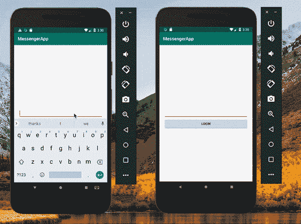

# 如何使用 Kotlin 构建一个在线的 Android messenger 应用程序

> 原文：<https://www.freecodecamp.org/news/how-to-build-an-android-messenger-app-with-online-presence-using-kotlin-fdcb3ea9e73b/>

作者:尼奥·伊戈达罗

当构建一个聊天应用程序时，拥有在线状态功能是非常重要的。这很重要，因为你的用户希望知道他们的朋友何时在线，并且更有可能实时回复他们的消息。

在本文中，我们将使用 Pusher Channels、Kotlin 和 Node.js 构建一个具有在线状态的 messenger 应用程序。

这是我们将构建的演示:



### 先决条件

要跟进，您需要满足以下要求:

*   一个推送频道 app。你可以在这里创建一个。
*   Android Studio 安装在您的机器上。你可以在这里查看[最新的稳定版本。建议最低版本为 3.0。](https://developer.android.com/studio/index.html)
*   Android 开发和 Android Studio IDE 的基础知识。
*   科特林的基础知识。以下是[官方文件](https://kotlinlang.org/docs/reference/)。
*   Node.js 和 NPM(节点包管理器)。在这里下载。
*   Mongo DB 安装在您的机器上。你可以按照这里的说明[安装它。](https://docs.mongodb.com/manual/installation/)

还需要对 Android 开发有所了解。

### 构建后端服务器

我们的服务器将使用 Node.js 构建。首先，创建一个新的项目目录:

```
$ mkdir backend-server
```

接下来，在项目目录中创建一个新的`index.js`文件，并粘贴以下代码:

```
// File: ./index.js    var express = require('express');    var bodyParser = require('body-parser');    const mongoose = require('mongoose');    var Pusher = require('pusher');
```

```
 var app = express();
```

```
 app.use(bodyParser.json());    app.use(bodyParser.urlencoded({ extended: false }));
```

```
 var pusher = new Pusher({      appId: 'PUSHER_APP_ID',      key: 'PUSHER_APP_KEY',      secret: 'PUSHER_APP_SECRET',      cluster: 'PUSHER_APP_CLUSTER'    });
```

```
 mongoose.connect('mongodb://127.0.0.1/db');
```

```
 const Schema = mongoose.Schema;    const userSchema = new Schema({        name: { type: String, required: true, },        count: {type: Number}    });
```

```
 var User = mongoose.model('User', userSchema);    userSchema.pre('save', function(next) {        if (this.isNew) {            User.count().then(res => {              this.count = res; // Increment count              next();            });          } else {            next();          }    });
```

```
 module.exports = User;
```

```
 var currentUser;
```

```
 /*     =================================    We will add our endpoints here!!!    =================================    */
```

```
 var port = process.env.PORT || 5000;
```

```
 app.listen(port);
```

在上面的代码片段中，我们初始化了 Pusher、Express 和 MongoDB。我们使用 [Moongose](http://mongoosejs.com/) 连接到我们的 MongoDB 实例。

> *将`PUSHER_APP_*`键替换为推杆仪表板上的键。*

现在让我们添加端点。我们将添加的第一个端点是让用户登录。将下面的代码粘贴到您的`index.js`文件中的`currentUser`声明下面:

```
// File: ./index.js
```

```
 // [...]
```

```
 app.post('/login', (req,res) => {        User.findOne({name: req.body.name}, (err, user) => {            if (err) {                res.send("Error connecting to database");            }
```

```
 // User exists            if (user) {                currentUser = user;                return res.status(200).send(user)            }
```

```
 let newuser = new User({name: req.body.name});
```

```
 newuser.save(function(err) {                if (err) throw err;            });
```

```
 currentUser = newuser;            res.status(200).send(newuser)        });    })
```

```
 // [...]
```

这个端点接收一个带有请求的`username`，创建一个新用户或者返回现有用户的数据。

让我们在上一个端点下面添加下一个端点:

```
// File: ./index.js
```

```
 // [...]
```

```
 app.get('/users', (req,res) => {        User.find({}, (err, users) => {            if (err) throw err;            res.send(users);        });    })
```

```
 // [...]
```

第二个端点从数据库中获取所有用户并返回。

因为我们将使用推送存在通道，所以我们需要一个端点来验证用户。在同一个文件中，将以下代码粘贴到上述端点的下方:

```
// File: ./index.js
```

```
 // [...]
```

```
 app.post('/pusher/auth/presence', (req, res) => {        let socketId = req.body.socket_id;        let channel = req.body.channel_name;
```

```
 let presenceData = {            user_id: currentUser._id,            user_info: {count: currentUser.count, name: currentUser.name}        };
```

```
 let auth = pusher.authenticate(socketId, channel, presenceData);
```

```
 res.send(auth);    });
```

```
 // [...]
```

因为我们将使用私有通道，所以我们需要一个端点来进行身份验证。在上面的端点下添加以下端点:

```
// File: ./index.js
```

```
 // [...]
```

```
 app.post('/pusher/auth/private', (req, res) => {        res.send(pusher.authenticate(req.body.socket_id, req.body.channel_name));    });
```

```
 // [...]
```

```
Finally, the last endpoint will be to trigger an event `new-message` to a channel. Add the endpoint below the last one:
```

```
 // File: ./index.js
```

```
 // [...]
```

```
 app.post('/send-message', (req, res) => {        let payload = {message: req.body.message, sender_id: req.body.sender_id}        pusher.trigger(req.body.channel_name, 'new-message', payload);        res.send(200);    });
```

```
 // [...]
```

添加所有端点后，通过运行以下命令安装必要的 npm 软件包:

```
$ npm install express body-parser mongoose pusher
```

在运行应用程序之前，使用以下命令确保 MongoDB 正在运行:

```
$ mongod --dbpath C:\MongoDB\data\db # Windows    $ mongod --dbpath=/path/to/db/directory # Mac or Linux
```

现在，您可以使用下面的命令运行您的应用程序:

```
$ node index.js
```

您的应用将在此处可用: [http://localhost:5000](http://localhost:5000/) 。

### 构建我们的 Android 应用程序

创建您的 Android 项目。在向导中，输入您的项目名称——比如说 **MessengerApp。**

接下来，输入您的包名。您可以使用最小为 19 的 SDK，然后选择一个**空活动**。

在下一页，将**活动名称**更改为`LoginActivity`。在此之后，Android Studio 将为您构建您的项目。

现在我们有了项目，让我们为我们的应用程序添加所需的依赖项。打开您的应用程序模块`build.gradle`文件，添加以下内容:

```
// File ../app/build.gradle    dependencies {      // [...]
```

```
 implementation 'com.android.support:design:28+'      implementation 'com.pusher:pusher-java-client:1.6.0'      implementation "com.squareup.retrofit2:retrofit:2.4.0"      implementation "com.squareup.retrofit2:converter-scalars:2.4.0"      implementation 'com.squareup.retrofit2:converter-gson:2.3.0'    }
```

值得注意的是，我们添加了对[改型](http://square.github.io/retrofit/)和推进器的依赖。翻新是一个用于网络调用的 HTTP 客户端库。我们也添加了设计库依赖，因为我们想使用其中的一些类。同步你的 gradle 文件以获取依赖关系。

接下来，让我们准备我们的应用程序进行网络通话。改造需要一个接口来知道要访问的端点。

创建一个名为`ApiService`的新界面，并粘贴如下内容:

```
// File: ./app/src/main/java/com/example/messengerapp/ApiService.kt    import okhttp3.RequestBody    import retrofit2.Call    import retrofit2.http.Body    import retrofit2.http.GET    import retrofit2.http.POST
```

```
 interface ApiService {
```

```
 @POST("/login")      fun login(@Body body:RequestBody): Call<UserModel>
```

```
 @POST("/send-message")      fun sendMessage(@Body body:RequestBody): Call<String>
```

```
 @GET("/users")      fun getUsers(): Call<List<UserModel&gt;>    }
```

这里，我们声明了三个端点。它们用于登录、发送消息和获取用户。

在我们的一些响应中，我们返回`Call<UserMod` el >。让我们创建`e the Use` rModel。创建一个新的 c 类`alled Use` rModel 并粘贴以下内容:

```
// File: ./app/src/main/java/com/example/messengerapp/UserModel.kt    import com.google.gson.annotations.Expose    import com.google.gson.annotations.SerializedName
```

```
 data class UserModel(@SerializedName("_id") @Expose var id: String,                         @SerializedName("name") @Expose var name: String,                         @SerializedName("count") @Expose var count: Int,                         var online:Boolean = false)
```

上面，我们使用了一个数据类，这样默认情况下，模型类所需的一些其他函数如`toString` 和`hashCode`被添加到该类中。

我们只期待来自服务器的`id`和`name`的值。我们添加了`online`属性，这样我们以后就可以更新了。

接下来，创建一个名为`RetrofitInstance`的新类，并粘贴以下代码:

```
// File: ./app/src/main/java/com/example/messengerapp/RetrofitInstance.kt    import okhttp3.OkHttpClient    import retrofit2.Retrofit    import retrofit2.converter.gson.GsonConverterFactory    import retrofit2.converter.scalars.ScalarsConverterFactory
```

```
 class RetrofitInstance {
```

```
 companion object {        val retrofit: ApiService by lazy {          val httpClient = OkHttpClient.Builder()          val builder = Retrofit.Builder()              .baseUrl("http://10.0.2.2:5000/")              .addConverterFactory(ScalarsConverterFactory.create())              .addConverterFactory(GsonConverterFactory.create())
```

```
 val retrofit = builder              .client(httpClient.build())              .build()          retrofit.create(ApiService::class.java)        }      }    }
```

`RetrofitInstance`包含一个名为`retrofit`的类变量。它为我们提供了一个改造的实例，我们将在多个类中引用它。

最后，要请求互联网访问权限，请更新`AndroidManifest.xml`文件，如下所示:

```
// File: ./app/src/main/ApiService.kt    <manifest xmlns:android="http://schemas.android.com/apk/res/android"      package="com.example.messengerapp">
```

```
 <uses-permission android:name="android.permission.INTERNET" />      [...]
```

```
 </manifest>
```

现在我们可以使用 reform 发出请求。

我们将实现的下一个特性是登录。打开已经创建的`LoginActivity`布局文件`activity_login.xml`文件并粘贴:

```
// File: ./app/src/main/res/layout/activity_login.xml    &lt;?xml version="1.0" encoding="utf-8"?>    <android.support.constraint.ConstraintLayout xmlns:android="http://schemas.android.com/apk/res/android"      xmlns:app="http://schemas.android.com/apk/res-auto"      xmlns:tools="http://schemas.android.com/tools"      android:layout_width="match_parent"      android:layout_height="match_parent"      android:layout_margin="20dp"      tools:context=".LoginActivity">
```

```
 <EditText        android:id="@+id/editTextUsername"        android:layout_width="match_parent"        android:layout_height="wrap_content"        app:layout_constraintBottom_toBottomOf="parent"        app:layout_constraintLeft_toLeftOf="parent"        app:layout_constraintRight_toRightOf="parent"        app:layout_constraintTop_toTopOf="parent" />
```

```
 <Button        android:id="@+id/loginButton"        android:layout_width="match_parent"        android:layout_height="wrap_content"        android:text="Login"        app:layout_constraintTop_toBottomOf="@+id/editTextUsername" />
```

```
 </android.support.constraint.ConstraintLayout>
```

该布局包含一个输入用户名的输入字段和一个发出登录请求的按钮。

接下来，打开`LoginActivity.Kt`文件并粘贴到:

```
// File: ./app/src/main/java/com/example/messengerapp/LoginActivity.kt    import android.content.Intent    import android.os.Bundle    import android.support.v7.app.AppCompatActivity    import android.util.Log    import kotlinx.android.synthetic.main.activity_login.*    import okhttp3.MediaType    import okhttp3.RequestBody    import org.json.JSONObject    import retrofit2.Call    import retrofit2.Callback    import retrofit2.Response
```

```
 class LoginActivity : AppCompatActivity() {
```

```
 override fun onCreate(savedInstanceState: Bundle?) {        super.onCreate(savedInstanceState)        setContentView(R.layout.activity_login)        loginButton.setOnClickListener {          if (editTextUsername.text.isNotEmpty()) {            loginFunction(editTextUsername.text.toString())          }        }      }
```

```
 private fun loginFunction(name:String) {        val jsonObject = JSONObject()        jsonObject.put("name", name)
```

```
 val jsonBody = RequestBody.create(            MediaType.parse("application/json; charset=utf-8"),             jsonObject.toString()        )
```

```
 RetrofitInstance.retrofit.login(jsonBody).enqueue(object:Callback<UserModel> {          override fun onFailure(call: Call<UserModel>?, t: Throwable?) {            Log.i("LoginActivity",t!!.localizedMessage)          }
```

```
 override fun onResponse(call: Call<UserModel>?, response: Response<UserModel>?) {            if (response!!.code() == 200) {              Singleton.getInstance().currentUser = response.body()!!              startActivity(Intent(this@LoginActivity,ContactListActivity::class.java))              finish()            }          }        })      }    }
```

在`LoginActivity.Kt`文件中，我们为登录按钮设置了一个监听器，这样，当它被点击时，我们可以将文本发送到服务器进行认证。我们还将登录的用户存储在一个 singleton 类中，以便我们可以在以后访问用户的详细信息。

创建一个名为`Singleton`的新类，并粘贴如下内容:

```
// File: ./app/src/main/java/com/example/messengerapp/RetrofitInstance.kt    class Singleton {      companion object {        private val ourInstance = Singleton()        fun getInstance(): Singleton {          return ourInstance        }      }      lateinit var currentUser: UserModel    }
```

`Singleton`允许我们访问`currentUser`，即登录的用户。

接下来，让我们创建一个名为`ContactListActivity`的新活动。现在，将该类留空，打开名为`activity_contact_list`的相应布局文件，并粘贴以下内容:

```
// File: ./app/src/main/res/layout/activity_contact_list.xml    &lt;?xml version="1.0" encoding="utf-8"?>    <android.support.constraint.ConstraintLayout xmlns:android="http://schemas.android.com/apk/res/android"      xmlns:app="http://schemas.android.com/apk/res-auto"      xmlns:tools="http://schemas.android.com/tools"      android:layout_width="match_parent"      android:layout_height="match_parent"      tools:context=".ContactListActivity">
```

```
 <android.support.v7.widget.RecyclerView        android:layout_width="match_parent"        android:id="@+id/recyclerViewUserList"        android:layout_height="match_parent"/>
```

```
 </android.support.constraint.ConstraintLayout>
```

该布局包含一个 recycler 视图，它将为我们提供从数据库中获取的所有联系人列表。因为我们在列表中显示项目，所以我们需要一个适配器类来管理项目如何膨胀到布局中。

创建一个名为`ContactRecyclerAdapter`的新类，并粘贴到:

```
// File: ./app/src/main/java/com/example/messengerapp/ContactRecyclerAdapter.kt    import android.support.v7.widget.RecyclerView    import android.view.LayoutInflater    import android.view.View    import android.view.ViewGroup    import android.widget.ImageView    import android.widget.TextView    import java.util.*
```

```
 class ContactRecyclerAdapter(private var list: ArrayList<UserModel>, private var listener: UserClickListener)      : RecyclerView.Adapter<ContactRecyclerAdapter.ViewHolder>() {
```

```
 override fun onCreateViewHolder(parent: ViewGroup, viewType: Int): ViewHolder {        return ViewHolder(LayoutInflater.from(parent.context)            .inflate(R.layout.user_list_row, parent, false))      }
```

```
 override fun onBindViewHolder(holder: ViewHolder, position: Int) = holder.bind(list[position])
```

```
 override fun getItemCount(): Int = list.size
```

```
 fun showUserOnline(updatedUser: UserModel) {        list.forEachIndexed { index, element ->          if (updatedUser.id == element.id) {            updatedUser.online = true            list[index] = updatedUser            notifyItemChanged(index)          }
```

```
 }      }
```

```
 fun showUserOffline(updatedUser: UserModel) {        list.forEachIndexed { index, element ->          if (updatedUser.id == element.id) {            updatedUser.online = false            list[index] = updatedUser            notifyItemChanged(index)          }        }      }
```

```
 fun add(user: UserModel) {        list.add(user)        notifyDataSetChanged()      }
```

```
 inner class ViewHolder(itemView: View) : RecyclerView.ViewHolder(itemView) {        private val nameTextView: TextView = itemView.findViewById(R.id.usernameTextView)        private val presenceImageView: ImageView = itemView.findViewById(R.id.presenceImageView)
```

```
 fun bind(currentValue: UserModel) = with(itemView) {          this.setOnClickListener {            listener.onUserClicked(currentValue)          }          nameTextView.text = currentValue.name          if (currentValue.online){            presenceImageView.setImageDrawable(this.context.resources.getDrawable(R.drawable.presence_icon_online))          } else {            presenceImageView.setImageDrawable(this.context.resources.getDrawable(R.drawable.presence_icon))
```

```
 }
```

```
 }      }
```

```
 interface UserClickListener {        fun onUserClicked(user: UserModel)      }    }
```

这个适配器有一些被覆盖的方法和一些自定义方法。

`onCreateViewHolder`显示每一行的外观。`onBindViewHolder`通过调用内部`ViewHolder`类中的`bind`方法将数据绑定到每一项。`getItemCount`给出了列表的大小。

对于我们的定制方法，`showUserOffline`更新用户并显示他们何时离线。而`showUserOnline`则相反。最后，我们有`add`方法，它向列表中添加一个新的联系人并刷新它。

在上面的适配器类中，我们使用了一个名为`user_list_row`的新布局。创建一个新布局`user_list_row`并粘贴:

```
// File: ./app/src/main/res/layout/user_list_row.xml    &lt;?xml version="1.0" encoding="utf-8"?>    <LinearLayout      android:orientation="horizontal"      xmlns:android="http://schemas.android.com/apk/res/android"      xmlns:app="http://schemas.android.com/apk/res-auto"      xmlns:tools="http://schemas.android.com/tools"      android:layout_width="match_parent"      android:layout_height="wrap_content"      android:layout_margin="20dp"      android:gravity="center"      tools:context=".LoginActivity">
```

```
 <ImageView        android:id="@+id/presenceImageView"        android:layout_width="15dp"        android:layout_height="15dp"        app:srcCompat="@drawable/presence_icon" />
```

```
 <TextView        android:layout_width="match_parent"        android:layout_height="wrap_content"        tools:text="Neo"        android:textSize="20sp"        android:layout_marginStart="10dp"        android:id="@+id/usernameTextView"        app:layout_constraintTop_toBottomOf="@+id/editTextUsername"        />
```

```
 </LinearLayout>
```

此布局是布局上每个项目外观的可视化表示。该布局有一个显示用户在线状态的图像视图。该布局还有一个文本视图，在图标旁边显示联系人的姓名。图标是矢量绘图。让我们创建文件。

创建一个名为`presence_icon_online`的新 drawable，并粘贴到:

```
// File: ./app/src/main/res/drawable/presence_icon_online.xml    <vector android:height="24dp" android:tint="#3FFC3C"        android:viewportHeight="24.0" android:viewportWidth="24.0"        android:width="24dp" xmlns:android="http://schemas.android.com/apk/res/android">        <path android:fillColor="#FF000000" android:pathData="M12,2C6.48,2 2,6.48 2,12s4.48,10 10,10 10,-4.48 10,-10S17.52,2 12,2z"/>    </vector>
```

创建另一个名为`presence_icon`的 drawable 并粘贴到:

```
// File: ./app/src/main/res/drawable/presence_icon.xml    <vector android:height="24dp" android:tint="#C0C0C6"        android:viewportHeight="24.0" android:viewportWidth="24.0"        android:width="24dp" xmlns:android="http://schemas.android.com/apk/res/android">        <path android:fillColor="#FF000000" android:pathData="M12,2C6.48,2 2,6.48 2,12s4.48,10 10,10 10,-4.48 10,-10S17.52,2 12,2z"/>    </vector>
```

接下来，打开`ContactListActivity`类并粘贴:

```
// File: ./app/src/main/java/com/example/messengerapp/ContactListActivity.kt    import android.content.Intent    import android.os.Bundle    import android.support.v7.app.AppCompatActivity    import android.support.v7.widget.LinearLayoutManager    import android.util.Log    import com.pusher.client.Pusher    import com.pusher.client.PusherOptions    import com.pusher.client.channel.PresenceChannelEventListener    import com.pusher.client.channel.User    import com.pusher.client.util.HttpAuthorizer    import kotlinx.android.synthetic.main.activity_contact_list.*    import retrofit2.Call    import retrofit2.Callback    import retrofit2.Response
```

```
 class ContactListActivity : AppCompatActivity(),        ContactRecyclerAdapter.UserClickListener {
```

```
 private val mAdapter = ContactRecyclerAdapter(ArrayList(), this)
```

```
 override fun onCreate(savedInstanceState: Bundle?) {        super.onCreate(savedInstanceState)        setContentView(R.layout.activity_contact_list)        setupRecyclerView()        fetchUsers()        subscribeToChannel()      }
```

```
 }
```

在`ContactListActivity`中，我们初始化了`ContactRecyclerAdapter`，然后在`onCreate`方法中调用了三个函数。让我们创建这些新函数。

在同一类中，添加以下方法:

```
private fun setupRecyclerView() {      with(recyclerViewUserList) {        layoutManager = LinearLayoutManager(this@ContactListActivity)        adapter = mAdapter      }    }
```

```
 private fun fetchUsers() {      RetrofitInstance.retrofit.getUsers().enqueue(object : Callback<List<UserModel>> {        override fun onFailure(call: Call<List<UserModel>>?, t: Throwable?) {}        override fun onResponse(call: Call<List<UserModel>>?, response: Response<List<UserModel>>?) {          for (user in response!!.body()!!) {            if (user.id != Singleton.getInstance().currentUser.id) {              mAdapter.add(user)            }          }        }      })    }
```

```
 private fun subscribeToChannel() {
```

```
 val authorizer = HttpAuthorizer("http://10.0.2.2:5000/pusher/auth/presence")      val options = PusherOptions().setAuthorizer(authorizer)      options.setCluster("PUSHER_APP_CLUSTER")
```

```
 val pusher = Pusher("PUSHER_APP_KEY", options)      pusher.connect()
```

```
 pusher.subscribePresence("presence-channel", object : PresenceChannelEventListener {        override fun onUsersInformationReceived(p0: String?, users: MutableSet<User>?) {          for (user in users!!) {            if (user.id!=Singleton.getInstance().currentUser.id){              runOnUiThread {                mAdapter.showUserOnline(user.toUserModel())              }            }          }        }
```

```
 override fun onEvent(p0: String?, p1: String?, p2: String?) {}        override fun onAuthenticationFailure(p0: String?, p1: Exception?) {}        override fun onSubscriptionSucceeded(p0: String?) {}
```

```
 override fun userSubscribed(channelName: String, user: User) {          runOnUiThread {            mAdapter.showUserOnline(user.toUserModel())          }        }
```

```
 override fun userUnsubscribed(channelName: String, user: User) {          runOnUiThread {            mAdapter.showUserOffline(user.toUserModel())          }        }      })    }
```

```
 override fun onUserClicked(user: UserModel) {      val intent = Intent(this, ChatRoom::class.java)      intent.putExtra(ChatRoom.EXTRA_ID,user.id)      intent.putExtra(ChatRoom.EXTRA_NAME,user.name)      intent.putExtra(ChatRoom.EXTRA_COUNT,user.count)      startActivity(intent)    }
```

**用仪表盘上的值替换`PUSHER_APP_*`键。**

*   `setupRecyclerView`将布局管理器和适配器分配给回收器视图。为了让回收器视图工作，您需要这两样东西。
*   从服务器获取所有用户并显示在列表上。它免除了当前登录的用户。
*   `subcribeToChannel`订阅在线频道。当您订阅一个频道时，`onUsersInformationReceived`会显示订阅该频道的所有用户，包括当前用户。因此，在那个回调中，我们调用了适配器类中的`showUserOnline`方法，这样用户旁边的图标就可以被更改，以表示用户在线。
*   选择联系人时会调用`onUserClicked`。我们将用户的详细信息传递给下一个名为`ChatRoom`的活动。

在前面的代码片段中，我们使用了一个扩展函数将从 Pusher 接收的`User`对象转换为我们自己的`UserModel`对象。让我们来定义这个扩展。

创建一个名为`Utils`的新类，并粘贴如下内容:

```
// File: ./app/src/main/java/com/example/messengerapp/Utils.kt    import com.pusher.client.channel.User    import org.json.JSONObject
```

```
 fun User.toUserModel():UserModel{      val jsonObject = JSONObject(this.info)      val name = jsonObject.getString("name")      val numb = jsonObject.getInt("count")      return UserModel(this.id, name, numb)    }
```

现在，因为我们在前面的`onUserClicked`方法中引用了一个`ChatRoom`活动，所以让我们创建它。

创建一个名为`ChatRoom`的新活动。该活动带有一个布局文件`activity_chat_room`。将此粘贴到布局文件中:

```
// File: ./app/src/main/res/layout/activity_chat_room.xml    &lt;?xml version="1.0" encoding="utf-8"?>    <android.support.constraint.ConstraintLayout xmlns:android="http://schemas.android.com/apk/res/android"      xmlns:app="http://schemas.android.com/apk/res-auto"      xmlns:tools="http://schemas.android.com/tools"      android:layout_width="match_parent"      android:layout_height="match_parent"      tools:context=".ChatRoom">
```

```
 <android.support.v7.widget.RecyclerView        android:id="@+id/recyclerViewChat"        android:layout_width="match_parent"        android:layout_height="match_parent" />
```

```
 <EditText        android:id="@+id/editText"        android:layout_width="0dp"        android:layout_height="wrap_content"        android:layout_margin="16dp"        android:hint="Enter a message"        app:layout_constraintBottom_toBottomOf="parent"        app:layout_constraintEnd_toStartOf="@+id/sendButton"        app:layout_constraintStart_toStartOf="parent" />
```

```
 <android.support.design.widget.FloatingActionButton        android:id="@+id/sendButton"        android:layout_width="wrap_content"        android:layout_height="wrap_content"        android:layout_gravity="end|bottom"        android:layout_margin="16dp"        android:src="@android:drawable/ic_menu_send"        app:layout_constraintEnd_toEndOf="parent"        app:layout_constraintBottom_toBottomOf="parent" />
```

```
 </android.support.constraint.ConstraintLayout>
```

上面的布局包含聊天消息的回收器视图、收集新消息的编辑文本和发送消息的浮动操作按钮。

接下来，创建一个名为`ChatRoomAdapter`的新类，并粘贴以下内容:

```
// File: ./app/src/main/java/com/example/messengerapp/ChatRoomAdapter.kt    import android.support.v7.widget.CardView    import android.support.v7.widget.RecyclerView    import android.view.LayoutInflater    import android.view.View    import android.view.ViewGroup    import android.widget.RelativeLayout    import android.widget.TextView    import java.util.*
```

```
 class ChatRoomAdapter (private var list: ArrayList<MessageModel>)      : RecyclerView.Adapter<ChatRoomAdapter.ViewHolder>() {
```

```
 override fun onCreateViewHolder(parent: ViewGroup, viewType: Int): ViewHolder {        return ViewHolder(LayoutInflater.from(parent.context)            .inflate(R.layout.chat_item, parent, false))      }
```

```
 override fun onBindViewHolder(holder: ViewHolder, position: Int) = holder.bind(list[position])
```

```
 override fun getItemCount(): Int = list.size
```

```
 fun add(message: MessageModel) {        list.add(message)        notifyDataSetChanged()      }
```

```
 inner class ViewHolder(itemView: View) : RecyclerView.ViewHolder(itemView) {        private val messageTextView: TextView = itemView.findViewById(R.id.text)        private val cardView: CardView = itemView.findViewById(R.id.cardView)
```

```
 fun bind(message: MessageModel) = with(itemView) {          messageTextView.text = message.message          val params = cardView.layoutParams as RelativeLayout.LayoutParams          if (message.senderId==Singleton.getInstance().currentUser.id) {            params.addRule(RelativeLayout.ALIGN_PARENT_RIGHT)          }        }      }    }
```

这个适配器的工作方式与我们之前创建的类似。不过，一个不同之处是，这里不需要显示 online 和 offline 方法。

接下来，创建另一个名为`MessageMode`的类，并粘贴如下内容:

```
// File: ./app/src/main/java/com/example/messengerapp/MessageModel.kt    data class MessageModel(val message: String, val senderId: String)
```

适配器类的`onCreateViewHolder`方法中使用的`chat_item`布局表示每个布局的外观。创建一个名为`chat_item`的新布局，粘贴如下:

```
// File: ./app/src/main/res/layout/chat_item.xml    &lt;?xml version="1.0" encoding="utf-8"?>    <RelativeLayout xmlns:android="http://schemas.android.com/apk/res/android"      xmlns:app="http://schemas.android.com/apk/res-auto"      android:layout_width="wrap_content"      android:layout_height="wrap_content"      android:layout_margin="16dp"      android:orientation="vertical">
```

```
 <android.support.v7.widget.CardView        android:id="@+id/cardView"        android:layout_width="wrap_content"        android:layout_height="wrap_content"        android:layout_gravity="start"        app:cardCornerRadius="8dp"        app:cardUseCompatPadding="true">
```

```
 <LinearLayout          android:layout_width="wrap_content"          android:layout_height="wrap_content"          android:gravity="start"          android:orientation="vertical"          android:padding="8dp">
```

```
 <TextView            android:id="@+id/text"            android:layout_width="wrap_content"            android:layout_height="wrap_content"            android:layout_gravity="center_vertical|start"            android:layout_marginBottom="4dp"            android:textStyle="bold" />
```

```
 </LinearLayout>
```

```
 </android.support.v7.widget.CardView>
```

```
 </RelativeLayout>
```

#### 更新聊天室类

最后，打开`ChatRoom` activity 类并粘贴:

```
// File: ./app/src/main/java/com/example/messengerapp/ChatRoom.kt    import android.app.Activity    import android.os.Bundle    import android.support.v7.app.AppCompatActivity    import android.support.v7.widget.LinearLayoutManager    import android.util.Log    import android.view.View    import android.view.inputmethod.InputMethodManager    import com.pusher.client.Pusher    import com.pusher.client.PusherOptions    import com.pusher.client.channel.PrivateChannelEventListener    import com.pusher.client.util.HttpAuthorizer    import kotlinx.android.synthetic.main.activity_chat_room.*    import okhttp3.MediaType    import okhttp3.RequestBody    import org.json.JSONObject    import retrofit2.Call    import retrofit2.Callback    import retrofit2.Response    import java.lang.Exception    import java.util.*
```

```
 class ChatRoom : AppCompatActivity() {
```

```
 companion object {        const val EXTRA_ID = "id"        const val EXTRA_NAME = "name"        const val EXTRA_COUNT = "numb"      }
```

```
 private lateinit var contactName: String      private lateinit var contactId: String      private var contactNumb: Int = -1      lateinit var nameOfChannel: String      val mAdapter = ChatRoomAdapter(ArrayList())
```

```
 override fun onCreate(savedInstanceState: Bundle?) {        super.onCreate(savedInstanceState)        setContentView(R.layout.activity_chat_room)        fetchExtras()        setupRecyclerView()        subscribeToChannel()        setupClickListener()      }    }
```

在这个文件中，我们声明了用于通过意图向活动发送数据的常量。我们还初始化了稍后将会用到的变量，比如适配器和联系信息。然后我们在`onCreate`方法中调用了一些额外的方法。让我们将它们添加到`ChatRoom`类中。

将下面定义的`fetchExtras`方法添加到该类中。该方法获取聊天室活动发送的额外内容。

```
private fun fetchExtras() {      contactName = intent.extras.getString(ChatRoom.EXTRA_NAME)      contactId = intent.extras.getString(ChatRoom.EXTRA_ID)      contactNumb = intent.extras.getInt(ChatRoom.EXTRA_COUNT)    }
```

接下来的方法是`setupRecyclerView`。这将使用适配器和布局管理器初始化回收器视图。将此函数粘贴到与前面相同的类中:

```
private fun setupRecyclerView() {      with(recyclerViewChat) {        layoutManager = LinearLayoutManager(this@ChatRoom)        adapter = mAdapter      }    }
```

接下来的方法是`subscribeToChannel`。此方法为用户订阅与所选联系人的私人频道。将以下代码粘贴到与前面相同的类中:

```
private fun subscribeToChannel() {      val authorizer = HttpAuthorizer("http://10.0.2.2:5000/pusher/auth/private")      val options = PusherOptions().setAuthorizer(authorizer)      options.setCluster("PUSHER_APP_CLUSTER")
```

```
 val pusher = Pusher("PUSHER_APP_KEY", options)      pusher.connect()
```

```
 nameOfChannel = if (Singleton.getInstance().currentUser.count > contactNumb) {        "private-" + Singleton.getInstance().currentUser.id + "-" + contactId      } else {        "private-" + contactId + "-" + Singleton.getInstance().currentUser.id      }
```

```
 Log.i("ChatRoom", nameOfChannel)
```

```
 pusher.subscribePrivate(nameOfChannel, object : PrivateChannelEventListener {        override fun onEvent(channelName: String?, eventName: String?, data: String?) {          val obj = JSONObject(data)          val messageModel = MessageModel(obj.getString("message"), obj.getString("sender_id"))
```

```
 runOnUiThread {            mAdapter.add(messageModel)          }        }
```

```
 override fun onAuthenticationFailure(p0: String?, p1: Exception?) {}        override fun onSubscriptionSucceeded(p0: String?) {}      }, "new-message")    }
```

**用仪表盘上的值替换`PUSHER_APP_*`键。**

上面的代码允许用户订阅私人频道。私有信道像存在信道一样需要授权。但是，它不公开在其他用户订阅时触发的回调。

下一个要添加的方法是`setupClickListener`。将该方法粘贴到与前面相同的类中:

```
private fun setupClickListener() {      sendButton.setOnClickListener{        if (editText.text.isNotEmpty()) {          val jsonObject = JSONObject()          jsonObject.put("message",editText.text.toString())          jsonObject.put("channel_name",nameOfChannel)          jsonObject.put("sender_id",Singleton.getInstance().currentUser.id)
```

```
 val jsonBody = RequestBody.create(              MediaType.parse("application/json; charset=utf-8"),               jsonObject.toString()          )
```

```
 RetrofitInstance.retrofit.sendMessage(jsonBody).enqueue(object: Callback<String>{            override fun onFailure(call: Call<String>?, t: Throwable?) {}            override fun onResponse(call: Call<String>?, response: Response<String>?) {}          })
```

```
 editText.text.clear()          hideKeyBoard()        }
```

```
 }    }
```

上面的方法为浮动动作按钮分配了一个 click 侦听器，以将消息发送到服务器。消息发出后，我们清除文本视图并隐藏键盘。

将隐藏键盘的方法添加到同一个类中，如下所示:

```
private fun hideKeyBoard() {      val imm = getSystemService(Activity.INPUT_METHOD_SERVICE) as InputMethodManager      var view = currentFocus
```

```
 if (view == null) {        view = View(this)      }
```

```
 imm.hideSoftInputFromWindow(view.windowToken, 0)    }
```

申请到此为止。现在，您可以在 Android Studio 中运行您的应用程序，您应该会看到应用程序在运行。

在运行 Android 应用程序之前，确保我们之前构建的 Node.js API 正在运行。


### 结论

在本文中，已经向您介绍了一些推送功能，比如私有和在线通道。

我们学习了如何对各种渠道的用户进行身份验证。

我们使用这些通道实现了两个人之间的私人聊天和一个联系人的在线通知。

本文中构建的应用程序的源代码可以在 [GitHub](https://github.com/neoighodaro/kotlin-messenger-app-with-online-presence-status) 上获得。

这篇文章最初出现在 [Pusher 博客](https://pusher.com/tutorials/android-messenger-presence-kotlin)上。