# 第 23 天:如何用 ARKit 和 Unity 构建一个以哈利波特波特为特色的应用

> 原文：<https://www.freecodecamp.org/news/how-to-build-an-app-with-arkit-and-unity-featuring-harry-potter-portkeys-7dd478b02735/>

作者:Harini Janakiraman

# 第 23 天:如何用 ARKit 和 Unity 构建一个以哈利波特波特为特色的应用

增强现实。它的未来在尖叫。现在到处都是:滤镜、游戏和 AR 应用每天都在涌现。想象一个世界，无论你看哪里，都有视觉数据辅助来增强你的理解能力。

现在，我宁愿在 VR 上全押，尤其是在看了 Ready Player One 之后。哦，我多么希望我现在就能被传送到绿洲！然而，AR 有更多真实世界的用例，从[购买家具](https://www.youtube.com/watch?v=UudV1VdFtuQ)到建造[工业工厂](https://www.boeing.com/features/2018/01/augmented-reality-01-18.page)——可能性是无限的。

> 增强现实将成为你日常生活中必不可少的一部分。它会改变一切。蒂姆·库克

现在，这些主张必须经得起时间的考验(强大的用例、逼真的视觉效果、硬件的处理速度等等)。在那之前，移动增强现实可能是开发者的测试平台，在耳机或类似的东西成为你日常技术的一部分之前，还有一个增强现实开发者社区和一系列应用程序。

今天，我们将使用苹果的 ARKit(它使 AR dev 更容易探索)来尝试 AR。我们将构建一个基本的叠加对象应用程序，在相机视图中添加 AR 样式。为了让事情变得有趣，我们将把哈利波特的门钥匙作为我们的 AR 对象，它将把你带到幻想世界(这部分暂时留给你的想象力。在这个 AR 系列的下一部分，我将构建一个更全面的应用程序版本，敬请关注！).

Image [source](https://www.hp-lexicon.org/thing/portkey/)

#### 什么是端口密钥？

*(对于麻瓜，这里是定义*wink wink*):*

在《哈利·波特》世界中，门钥匙是一个被施了魔法的物体，当它被触摸时，会立即将一个人从 A 点传送到 b 点。这个物体通常是一件毫无价值的垃圾，被随意放置，以免引起注意。

### 项目(约 3 小时)

在本教程中，您将学习使用 ARKit 构建一个 Unity 应用程序。我们将增加一个增强现实层，以哈利波特的门钥匙为特色。你花的大部分时间都在装置上，所以拿起你的咖啡，准备好吧！

### 步骤 1:安装

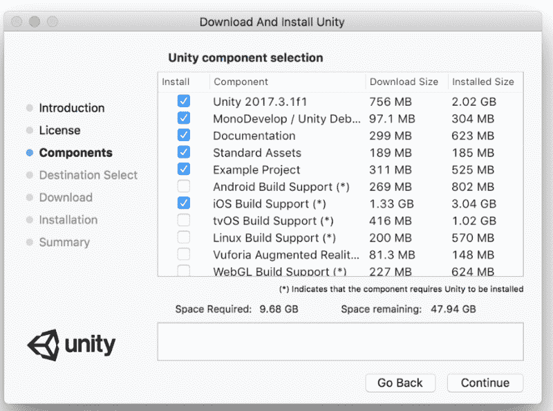

如果你还没有的话，下载并安装最新版本的苹果 Xcode 和 T2 Unity。

安装 Unity 的个人免费版，但要确保勾选了“iOS 构建支持”。

你还需要一个 iOS 开发者账户和一部 iPhone，最好是带着你开发的 AR 应用去兜风。

### 步骤 2:用 ARKit 插件建立一个 Unity 项目

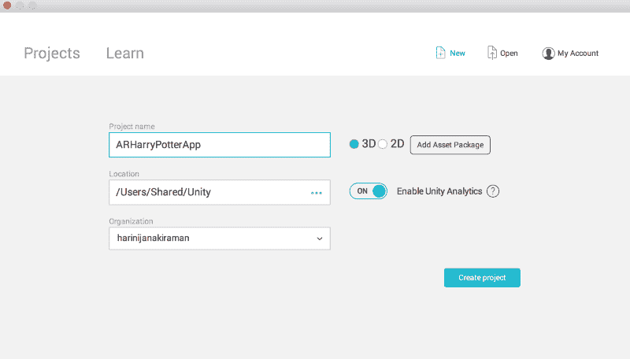

创建一个名为“ARHarryPotterApp”的新 3D 项目。

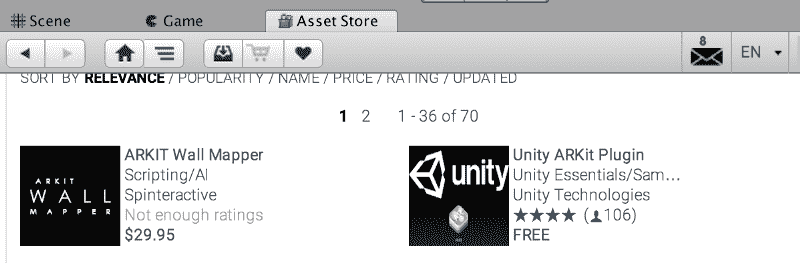

一旦项目被创建，从“资产存储”选项卡，下载 ARKit 到您的项目。

### 步骤 3:创建 AR 场景并添加资产

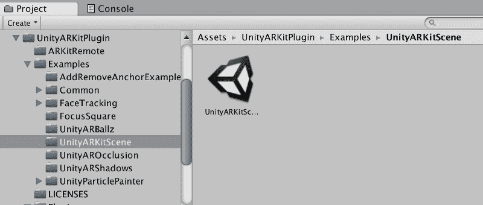

让我们从一个与下载的 ARKit 资产打包在一起的示例场景开始。导航到左侧面板上的示例场景，双击打开“UnityARKitScene”。

这将打开一个放置在“场景”标签中的基本立方体资产，这是你的视野。这里的“HitCube”资产可以很容易地替换为您选择的任何资产，以创建您自己独特的增强现实场景。

每个资源都有几个属性显示在右侧的检查器面板上，如阴影/照明/渲染等。我们不会在这里详细讨论这些属性(但是我会在接下来的文章中详细讨论它们)。

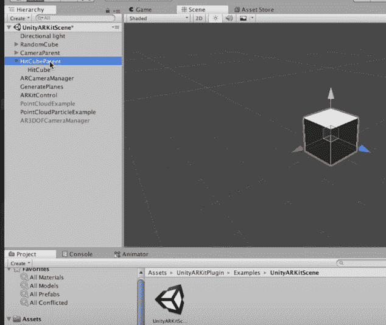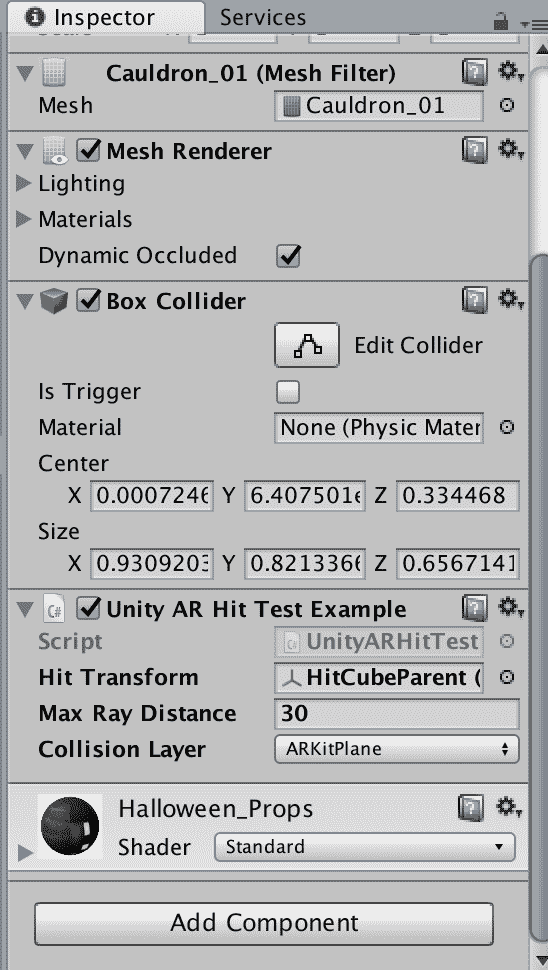

在这个例子中，您需要注意两件事情。对于添加到场景中的任何新资产，都需要重复这些步骤:

1.  在检查器窗格上，添加“Unity AR 点击测试示例”组件，并将其附加到脚本。
2.  将左侧面板中的“HitCubeParent”拖放到“Unity AR Hit Test Example”组件右侧检查器面板中的“Hit Transform”上。

确保为添加到场景中的任何新资源完成这两个步骤，因为这有助于将对象放置在水平面上。

对于我们的应用程序，我们将在场景中随机放置从资产商店下载的免费“万圣节包”中的哈利波特钥匙。

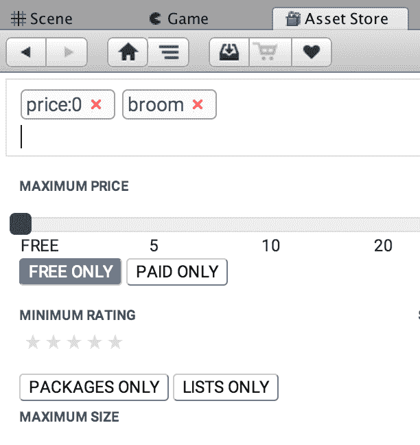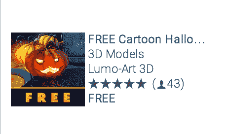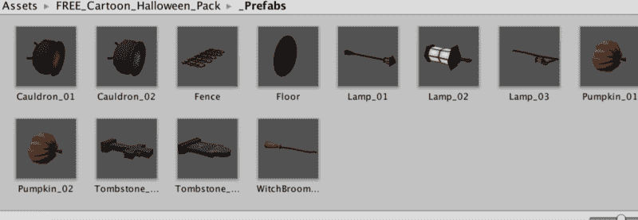

将您喜欢的资源放置在场景中，并确保将组件“Unity AR Hit Test Example”和“Hit Transform”添加到每个资源中，如下所示。

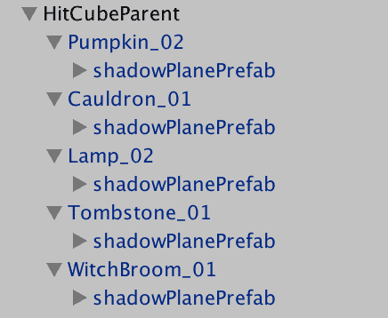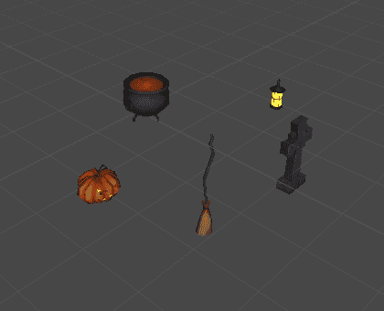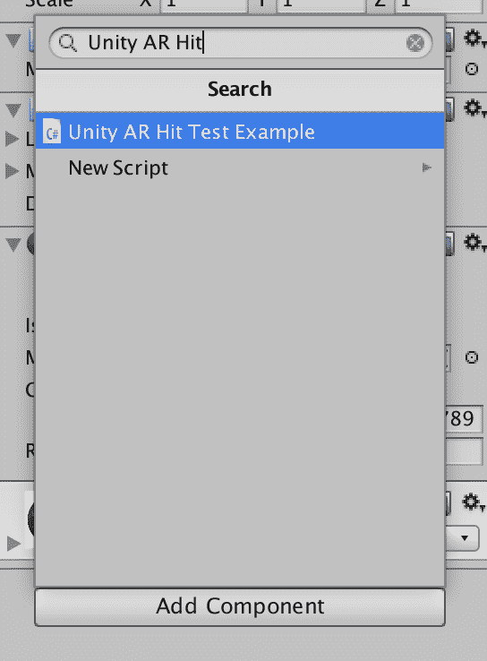

### 步骤 4:构建应用程序

最后，现在是时候构建应用程序了。选择文件->构建设置。勾选“Unity ARKitScene”并选择 iOS 平台，然后点击“切换平台”。这将导入资产并设置舞台。

然后，您可以点按“播放器设置”并检查检查器，以确保“目标设备”、“目标最低 iOS 版本”和“sdk”都已通过您的系统设置进行了您想要的设置。

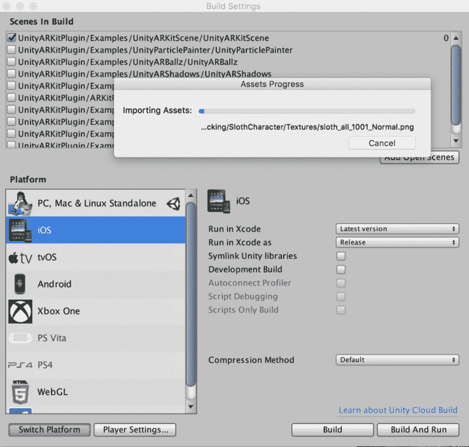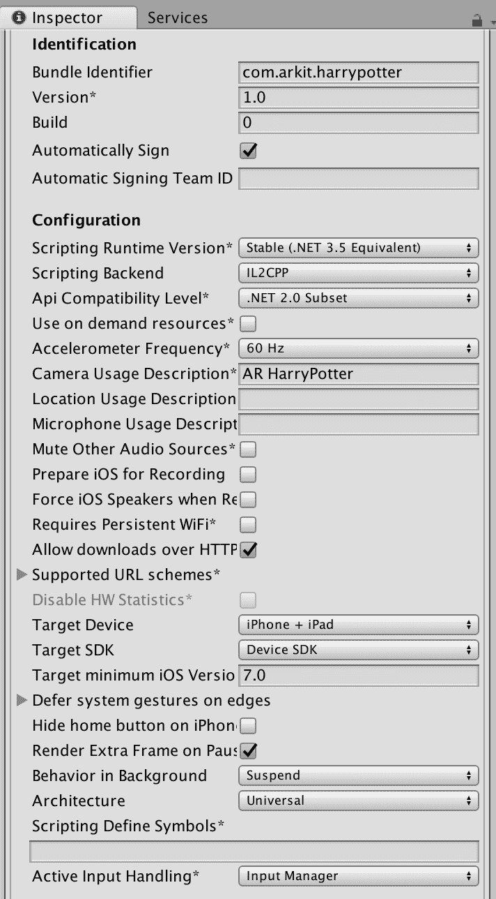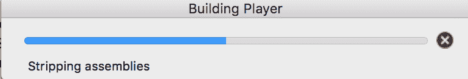

此时，您已经准备好“构建”应用程序并选择您的目标目录…这可能需要一段时间。

### 第五步:运行你的第一个增强现实应用

构建完成后，从构建的目标文件夹中打开 xcodeproj。连接您的 iPhone(兼容 iOS 和 xcode 版本)，向您的团队签署项目(您将需要一个 iOS 开发帐户)，并启动应用程序。

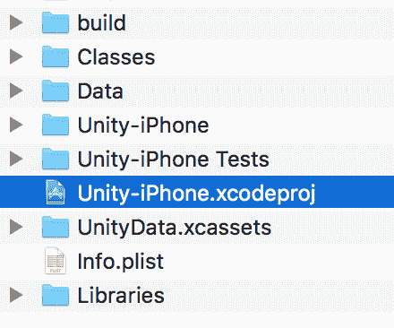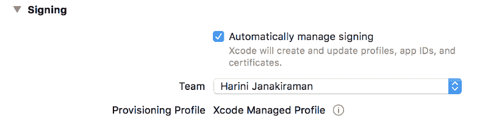

Violà，你的第一个 AR 应用已经准备好了！在视野中环顾四周，找到哈利波特的波特钥匙，然后被带到一个神奇的地方；)

如果你喜欢这个，请鼓掌？s o 其他人也能看到！在 Twitter 上关注我@ [H **ariniLabs**](https://twitter.com/harinilabs) 或 M [**edium**](https://medium.com/@harinilabs) 获取其他故事的最新消息或只是打个招呼:

*PS:注册我的简讯 [**这里**](http://harinilabs.com/womenintech.html) 成为第一个获得新鲜新内容的人，它充满了来自# [**WomenInTech**](http://harinilabs.com/womenintech.html) 的灵感，是的男人也可以注册！*