# 如何使用行为树构建端到端对话式人工智能系统

> 原文：<https://www.freecodecamp.org/news/how-to-build-an-end-to-end-conversational-ai-system-using-behavior-trees-658a7122e794/>

通过 lior messenger

# 如何使用行为树构建端到端对话式人工智能系统

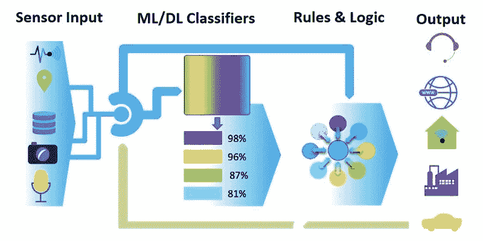

在其核心，人工智能项目可以被描述为一个简单的几个积木管道。上面的图表很好地解释了这一点:非结构化内容，通常是大量的数据，从左侧进入，并被输入到人工智能分类器中。这些预先训练的机器或深度学习模型将小麦从谷壳中分离出来，并将输入减少到几个数字或字符串输出值。

例如，图像中的兆像素和颜色被简化为一个标签:这是一只长颈鹿。或者斑马。在音频方面，数百万个波频率通过语音到文本模型产生一个句子。在对话式人工智能中，句子可以进一步简化为几个字符串，代表说话者的意图和句子中的实体。

一旦输入被**认可，我们就需要做事情，并生成一些有意义的输出。例如，在自动驾驶汽车中，识别出太近的汽车应该转动车轮。预订航班的请求应该产生一些 RESTFul 数据库查询和 POST 调用，并向用户发出确认或拒绝。**

**这最后一部分，在图中显示为基于规则的逻辑，是任何人工智能系统不可分割的一部分，并且没有改变。这通常是通过编码来完成的，如果它是一个严肃的系统，有成千上万行代码，如果它是一个玩具聊天机器人，有几个脚本。**

### **行为树**

**[行为树](https://en.wikipedia.org/wiki/Behavior_tree_(artificial_intelligence,_robotics_and_control))是视频游戏中出现的一种编程范式，用于在非玩家角色中创建类似人类的行为。它们形成了一种优秀的可视化语言，软件架构师、初级开发人员甚至非编码人员、技术设计人员都可以用它来创建复杂的脚本。事实上，由于行为树(BTs)允许像 AND 和 or、循环和条件这样的逻辑操作，任何可以由代码创建的程序都可以用 BTs 来创建。**

**[Servo](https://github.com/servo-ai/servo-platform) 是一个开源的人工智能对话框架，建立在一个名为 [Behavior3](https://github.com/behavior3/) 的 JavaScript 行为树框架之上。它被设计来为对话式人工智能系统做必要的输入和输出编排。就是所谓的“低代码”框架:你只需要编写一点代码，大部分任务都可以在可视化编辑器中完成。**

**这不是你通常的新手玩具:它被设计成使用现实生活中可调试的 JS 源文件和类进行扩展，并遵守任何团队项目管理方法。此外，它适合于规模增长的团队，允许通过抽象和解耦的子流程引入和重用新模块。**

**我是伺服的主要开发者。经过 30 多年的编码，感受到长期延迟项目的痛苦，看着遗留系统在自己的重压下崩溃，我想用最少的编码实现最大的灵活性。在这里，我将解释当一个人使用 Servo 和 [Wit.ai](https://www.wit.ai/) 将行为树与 NLU/NLP 引擎结合起来时可以实现的魔力。**

**任何开发人员都可以从本教程中受益，但如果你是一个在构建聊天或语音机器人方面有经验的开发人员，并且拥有像 LUIS，Wit 这样的 NLU/NLP 引擎的知识，那就更好了。AI，Lex(Alexa 引擎)，或者 Dialogflow。如果你不知道，也没关系，但是我会简单介绍一些主题。**

**如果你想了解 NLU 和 NLP 引擎，互联网上到处都有很好的资源——只需搜索“Wit tutorial”。如果你想学习如何建立一个重量级的助手，那么继续阅读。**

### **伺服入门**

**这里不赘述安装伺服的细节，只说伺服入门真的很容易。你可以在这里阅读[。本质上，您克隆了](https://medium.com/datadriveninvestor/building-context-aware-stateful-bots-using-servo-a2dc3f557469) [Github re](https://github.com/servo-ai/servo-platform) [po](https://github.com/servo-ai/servo-platform) ，NPM-根据自述文件安装它，并在本地运行它。然后，每一个新项目都会从一个现成的小机器人开始:**

**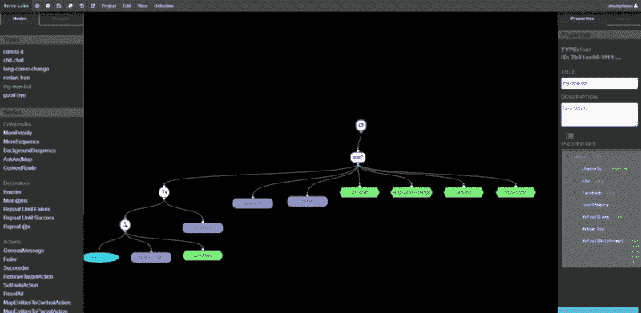

Every New Project has a starting tree** 

**你可以注意到这里的绿色六角形命名为“聊天”，“取消”和其他。到本文结束时，您将对它们是什么以及它们是如何工作的有一个清晰的概念。但首先，让我们应对第一个挑战。**

### **建立一个 NLU 模型**

**让我们来谈谈如何建立一个银行助理，具体来说，就是为资金转账部门工作的银行助理。如果是一个 web 应用程序，我们会有一个字段很少的表单，其中金额和受让人(也称为受益人)的帐户是最重要的。让我们在本教程中使用这些。实际上，当使用 NLU 引擎时，我们仍然可以将其视为表单，其中的字段现在称为*(在 Alexa 行话中也称为 **【槽】** )。NLU 引擎也产生一个意图，它可以被看作是将引导助手到用户意图的功能区域的表单的名称。***

*我们应该用几句话来训练 NLU 引擎，比如:*

*   **“我想寄点钱”**
*   ****【我要送 100 美元】****
*   ***“请将 490 美元转到账户# 01–10099988”***

*对于这些，我们需要告诉引擎输出以下内容:*

*   ***转移意图** 此类句子的意图*
*   *一个 **机智/数个** 为金额*
*   *收款账户的 **账号实体***

*让我们在 Wit.ai 上这样做吧。同样，我不会进入一个 Wit 教程——有很多指南。Servo 有一个通用的 Wit 模型，你可以从 Servo 的 Github [这里](https://github.com/servo-ai/servo-platform/tree/master/server/convocode/nlu-models/wit.ai)得到。然后，打开自己的 Wit app，导入。*

*我为账号创建了一个 [**自由文本**](https://wit.ai/docs/recipes#which-entity-should-i-use) 实体(因为账号可能包含其他符号)，为金额创建了一个 **wit/number** 实体。我发现[复合实体](https://medium.com/wit-ai/introducing-composite-entities-ba2639a26e0)也工作得很好，尽管它们需要一些训练。为了简单起见，对于账号，我将模型训练为 a #后跟 8 位数字。*

*一般来说，尝试不同的实体模型总是更好。在我们的例子中，我们可能在同一个句子中得到两个数字(账号和金额)，我们需要一种方法来区分它们，所以最好是两个不同的实体名称。但你可以尝试其他类型:AI 仍然是一门非常经验性的科学…*

*然后我们用几个句子训练它，让 Wit 建立银行转帐模型。为了方便起见，我在这里添加了，并且还设置了整个银行 bot 教程 bot 来附带预加载的示例。*

*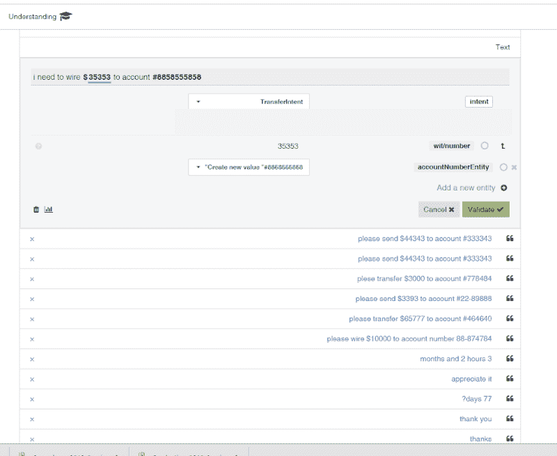

Training Wit with sample bank transfer sentences* 

*最后，我们需要将 NLU 连接到助手。在 Wit 中进入 **设置** ，复制 ******访问令牌****** 。我们需要将它粘贴到树根的属性中。我们通过打开 Servo 的编辑器，选择根，打开其属性，并将其粘贴到******nlu******下。如你所见，Servo 支持多语言助手和不同的 NLU 引擎:*

*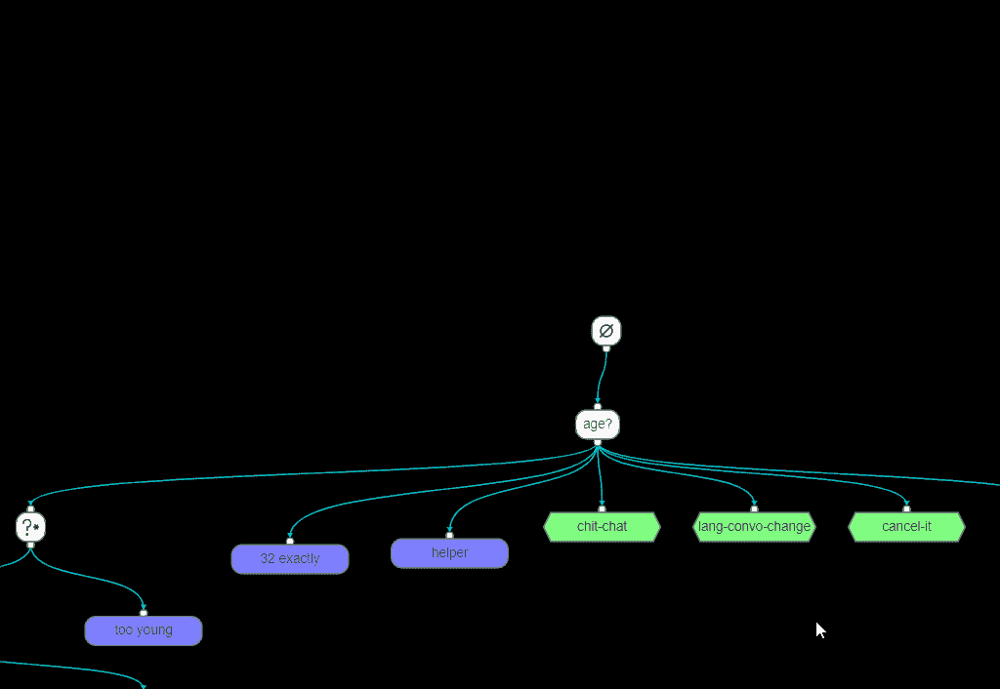*

### *启动银行助理*

*现在，我们可以转向伺服。我们应该为每个实体和意图构建一个小的问题树。*

*提醒一下，伺服行为树的基本规则如下*

1.  *树的主循环是连续执行根*
2.  *每个节点执行其子节点*
3.  *AskAndMap 节点(上图中的“年龄”节点)向用户输出一个问题，并等待答案*
4.  *一旦有了答案，流就会根据 NLU 引擎给出的意图和实体被路由到适当的子节点*

*先换个主，最上面的问题从 ******“年龄？”****** 成 ******“你想做什么？”****** 。此外，让我们删除第一个(即最左边的)子节点及其节点，因为我们不会再使用它们:*

*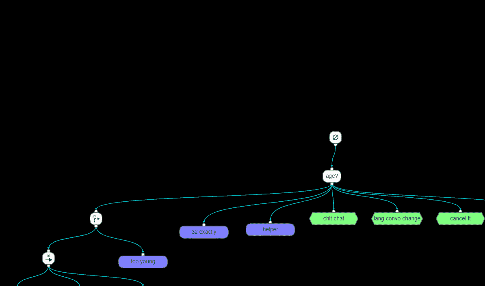

Type in the initial assistant question* 

*为什么我们会看到节点周围的红色虚线？将鼠标悬停在它上面，您会看到错误:*

***计数的上下文数应该等于** 的孩子数*

*我们马上就能解决这个问题。*

*现在，让我们构建传输流。我们假设，一旦用户说“我想汇款”，我们希望进入第一个，最左边的孩子。为此，我们将选择“我能为您做些什么”节点，并进入其属性。在这里，将第一个上下文更改为具有一个****【transfer intent】**:***

***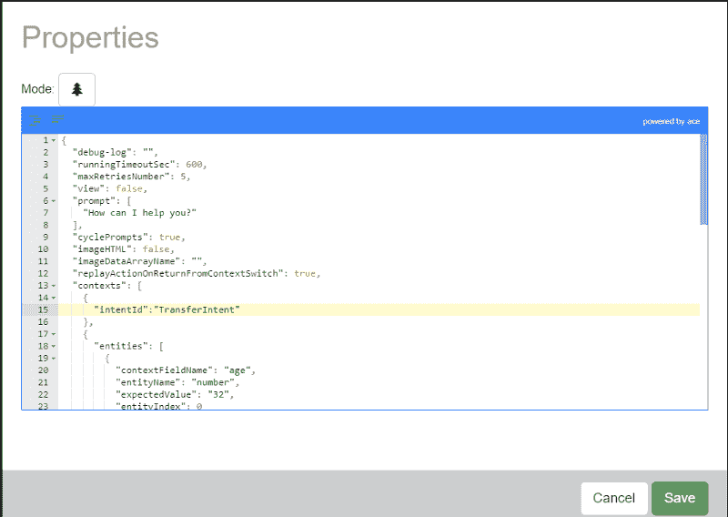***

***这将导致任何被 Wit 确定为具有转移意图的句子被发送到那里。***

### ***映射实体***

***现在，一旦 NLU 认识到我们转移资金的意图，我们应该得到所有不同的“领域”，或实体。让我们为 ***金额*** 添加一个节点:***

***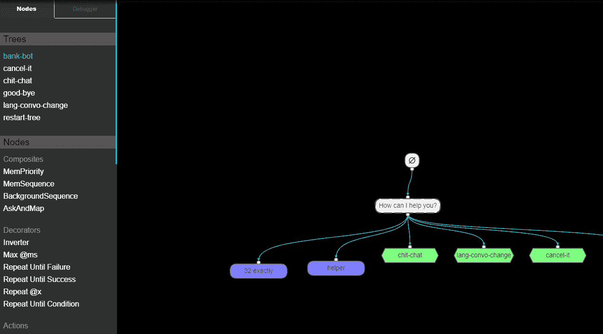***

***我们添加了一个 AskAndMap 节点，并将其提示设置为关于金额的问题。我们还改变了它的标题——这总是一个好的做法。最后，不要忘记使用 save 按钮或 Ctrl-S 保存您的工作。***

***您还可以注意到红色警告从*节点消失。****

****最后，我们给 Amount 节点的一个子上下文添加一个 ******数字****** **实体** ，并将值映射到一个名为 ******金额****** **的字段中。******

```
*`“contexts”: [
 {
   “entities”: [
    {
      “contextFieldName”: “amount”,
      “entityName”: “number”,
      “expectedValue”: “”,
      “entityIndex”: 0
    } 
   ]
 }`*
```

***这一切看起来非常简单，那就是:如果一个用户说了类似“我需要寄点钱”的话，他们会被问到“金额是多少？”。一旦他们输入了金额， ******的数字****** 将被 NLU 提取出来并映射到******context . amount******的伺服中。然后，我们可以在游戏中使用它。视觉上，流动从根部开始:***

***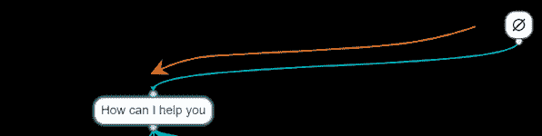***

***助理会问:***

*********“有什么可以帮你的吗？”*********

***如果用户回答:***

****NLU 引擎将输出一个******transfer intent******，并且流程将继续向下游到达它所识别的上下文——最左边的子节点——并询问下一个关于金额的问题:****

******

***但是如果用户不输入金额呢？***

### ***建筑助手***

***AskAndMap 节点支持另一种类型的上下文子节点，称为 ***助手*** 。当用户回答无法映射到*或任何其他上下文*的问题时，选择该上下文。让我们在我们的“金额是多少”AskAndMap 中添加一个:***

```
*`"contexts":[  
   {  
      "entities":[  
         {  
            "contextFieldName":"amount",
            "entityName":"number",
            "expectedValue":"",
            "entityIndex":0
         }
      ]
   },
   {  
      "helper":true
   }
]`*
```

***现在让我们添加一个带有消息帮助的最右边的孩子。类似于:***

***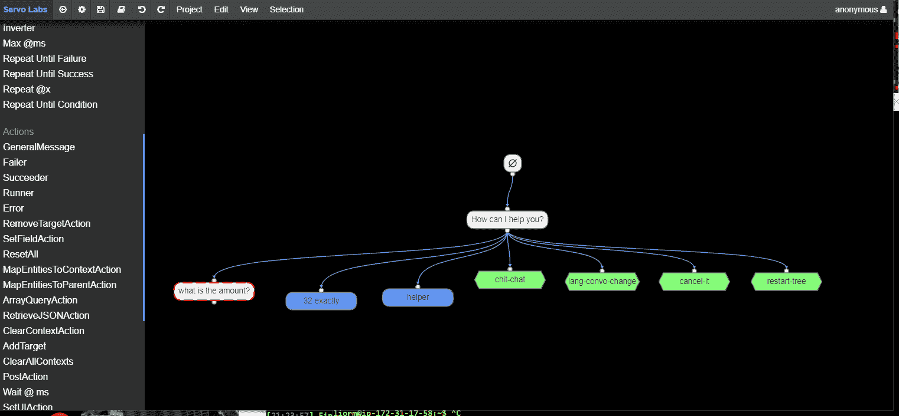***

***当然，AskAndMap 只能有一个 **助手** 上下文子对象。***

***人们可以想象一个流动的例子:***

***用户: ******【我想转点钱】*********

***助理:“ ******金额是多少？*********

***用户:“ ******你以为我会知道。但是我不确定*********

***助理:" ******请提供转账金额****** "***

***这看起来很简单:很明显，助手不明白你认为我会知道的“ ******”。但我不太确定“****** 又继续跟助手留言“ ******请提供金额以便转账****** ”。***

***但事实上，如果你运行这个机器人，你会在最后一行之后得到一个令人惊讶的句子:***

***用户:“ ******你以为我会知道。但是我不确定*********

***助理:" ******请提供转账金额****** "***

***助理: ******“有什么可以帮你的吗？”*********

***这里发生了什么？ *****哪里去了*“我能帮你什么吗？”****** 从何而来？***

***流程是这样的。辅助节点说出它的行，并把成功返回给它的父节点 AskAndMap。这反过来也返回成功，如此类推，直到到达根。此时，整个树被重新启动，我们得到了初始的 ******有什么需要帮忙的吗？****** 谓疑问。***

***所以，为了避免这种情况，我们需要在 AskAndMap 之前放一个循环，这样它就不会返回，直到 **真正** 成功。那是用一种叫做*T5 的装饰器完成的。****

### ***添加重复装饰器***

***行为树使用 **装饰器** 实现循环，装饰器是有一个父节点和一个子节点的节点。描绘成菱形⧫，我们将在这里使用 repeatuntillsuccess 装饰器来循环 AskAndMap，直到它成功完成。接收帮助消息不会完成它，所以我们需要在帮助消息后返回一个失败。我们通过在消息之后对故障节点进行排序来做到这一点。总而言之，这就是我们添加到 AskAndMap 结构中的装饰:***

***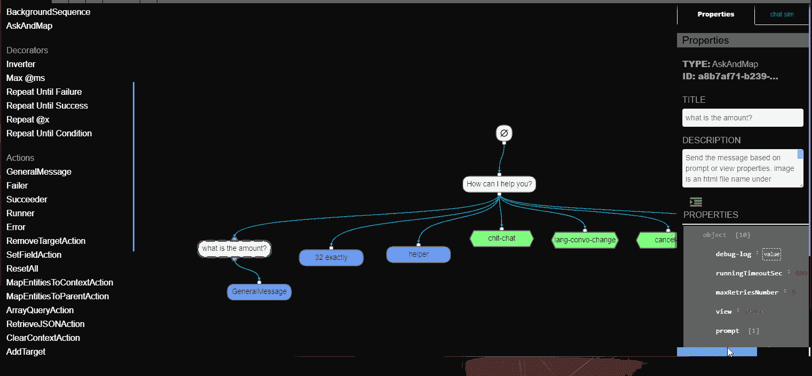***

***现在是时候添加下一个映射受益人帐号的节点了。同样，非常简单:和前面一样，我们添加了一个 AskAndMap，其中包含帐号的问题，以及从 accountNumberEntity 到上下文中的 account number 成员的映射。我们将其设置为 RepeatUntilSuccess 装饰器的子元素，以及解释该实体所需的帮助子元素。***

***然后，我们应该添加实际的业务逻辑来进行转换。这可能意味着对收集的实体进行多次 API 调用。我们将使用一条消息来模拟这种情况: ******我们将把$X 转到帐户#Y****** 。为此，您需要拖动一个 GeneralMessage 作为 accountNumberEntity 的第一个子元素，并使其属性如下:***

```
*`“debug-log”:””,
 “runningTimeoutSec”:600,
 “maxRetriesNumber”:5,
 “replayActionOnReturnFromContextSwitch”:true,
 “view”:false,
 “prompt”:[ 
 “About to transfer <%=context.amount%> to account <%=context.accountNumber%>”
],
…`*
```

***这是这棵树现在的样子:***

***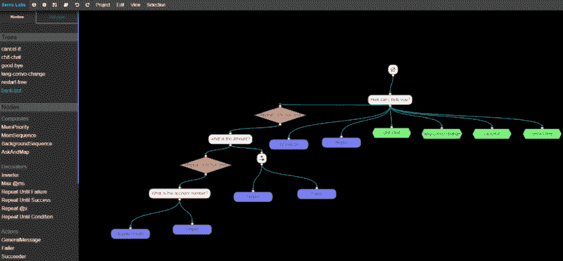***

***树自带伺服。它的文件在*服务器/密码/匿名/草稿/银行机器人下。****

### ***运行和测试***

***让我们测试一下这个机器人，看看不同的输入会发生什么。点击调试器标签，然后播放按钮▶️.在右边，模拟器将弹出:***

***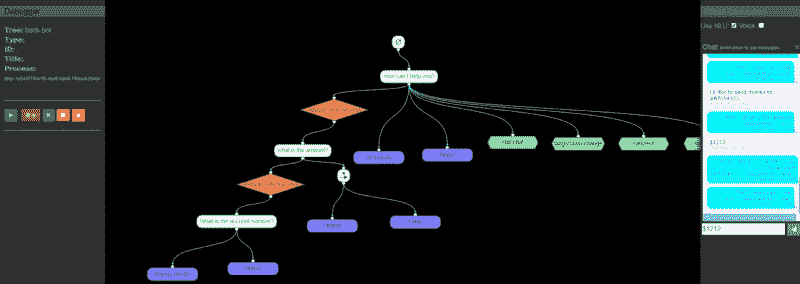***

***您可以输入这样的句子:***

*********我要寄钱。*********

***不出所料，答案是***

*********金额是多少？*********

***你可以输入金额，然后继续。***

***但是如果我们说***

*********我要发 14141 美元****** ？？***

***测试一下，您会看到助手如何巧妙地跳过金额问题，直接跳到账号:***

*********账号是多少？*********

***现在，让我们让它的生活更加艰难:***

*********我要汇款到账号#87654321*********

***很好，它只要求数量。假设你输入 3400 美元，它会跳过账号(因为它已经知道了)进入最后的确认语句:***

*********约转 3400 到账号#87654321。*********

***它是怎么知道要做那些魔法的？***

### ***上下文流***

***Servo 配备了一套强大的上下文识别算法，帮助它做到这一切。这里发生的事情显示了一点。让我们举最后一个例子。之后，助理问道:***

*********“有什么可以帮你的吗？”*********

***用户回答说:***

*********我要汇款到账号#87654321*********

***NLU 引擎输出一个******transfer intent******，流程继续向下游进行下一个问题，关于金额:***

***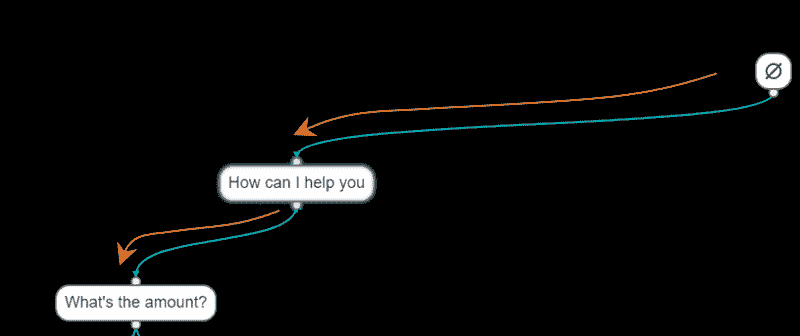***

***但是 NLU 也返回了一个 ****accountNumberEntity！**** 所以在下降之前，这个实体被保存在*上下文中。而且，每个 AskAndMap 都定义了自己的上下文。****

****这实际上是一个重要的评论，所以我将重复它: ******每个 AskAndMap 都定义了自己的上下文。**********

***在流程中的任何一点，当提到一个实体时，Servo 在对话中向后搜索(读:向上)来找到它。如果没有，它会主动要求。***

***所以在金额输入后，一旦我们继续到账号节点，伺服发现 ******账号实体****** 已经被提及，并使用它。***

***顺便说一下，当我们到达最后一个确认 GeneralMessage 节点时，也会发生类似特征的过程。它的提示是:***

*******即将转账< %=context.amount% >至账户<% = context . account number %>*******

***为了解决这个问题，Servo 向上搜索上下文树以找到所需的实体或上下文成员。***

***这让你想起什么了吗？熟悉 JavaScript 原型继承的人会发现它基本上使用了相同的设计。在伺服中，我们实现了这一点，因为我们需要对变量有更多的控制。但是看到面向对象的概念如何实际应用于现实生活，自然对话总是很有趣的。***

***但是如果用户问一些更不相关的问题，比如:***

*********“我的账户里有多少钱？”*********

***或者更多***

*********“看在老天的份上，你是谁？?"*********

***机器人的响应:***

*********“我是伺服实验室打造的人工智能助手。”*********

***什么？？这是哪里来的？***

### ***上下文和子树***

***几乎所有架构师用来构建可管理的大型系统的结构设计都可以分为两类:***

*   ***再用***
*   ***模块化***

***如果 Servo 要成为大型人工智能系统的基础设施，它必须提供一些允许开发者实现这些目标的机制。这就是子树发挥作用的地方。***

***我们在绿色六边形之前提到过:***

***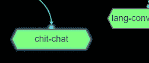***

***这是一棵子树。双击它，你将进入一个新的树，用那个名字。要创建新的子树，将鼠标悬停在左侧窗格的**树**上，并选择**新建:*****

******

***将出现一个具有唯一 GUID 名称的树。将其名称改为有意义的名称，并使用左窗格中的任何节点构建它。一旦构建完成，您可以在任何其他树中的任何点拖放和连接它(顺便说一下，包括它本身，但要非常小心)。由于子树可以有许多叶节点，所以您也只能将它们作为叶来连接。***

***当用户问助手“你是谁”时发生了什么？***

***首先，已经接受过此类问题训练的 NLU 返回了一个 ***WhoAreYouIntent*** 。然后上下文搜索被激活。如果对话是在转移对话中间的某个地方，搜索会向上进行，试图找到带有 WhoAreYouIntent 的上下文。找到这个上下文:它位于第 4 个上下文中，在*节点*中。然后流量被重定向到那里，这意味着该路由成为活动路由。这里的流程继续向下游进入 chit-chat 子树，回答问题，返回成功，路由返回到其先前的上下文，即传输上下文。***

***在这里，我们学到了一些非常重要的东西。 ***对话向下流动，但上下文向上搜索。*** 念念不忘:***

***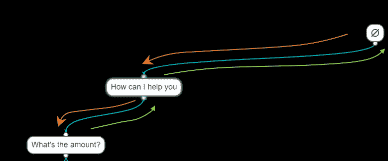

***The conversation flows down, but context is searched up****** 

### ***连接到 messenger 客户端***

***到目前为止，我们一直使用内部模拟器和调试器作为我们的消息客户端。让我们把我们的小助手和一个真正的脸书信使联系起来。我们的树的根属性有一个很大的重要变化，那就是将默认的频道名称**【chats im】**改为**【Facebook】**:***

***“频道”:“脸书”***

***在脸书方面，需要采取的主要高级步骤如下:***

1.  ***在您的脸书帐户下打开脸书页面***
2.  ***在[脸书开发者中心](https://developers.facebook.com/)创建一个新的脸书应用***
3.  ***向您的应用程序添加 messenger 功能***
4.  ***订阅应用程序以收听页面中的事件***
5.  ***将助手回调地址设置为要发布到的 webhook。Servo 总是以***

***<uri>/条目/ <channel id="">/</channel></uri>***

***因此，对于运行在[www.mydomain.com、](http://www.mydomain.com%2C/)的银行机器人助手来说，地址应该是:***

***www.mydomain.com>/entry/FB/bank-bot***

***您应该在开发者门户的脸书应用程序的页面订阅部分进行设置。您需要至少选择 **消息** 、 **消息传递 _ 回发** ，并将 **验证令牌** 与您在 bot 根属性中设置的验证令牌匹配:***

***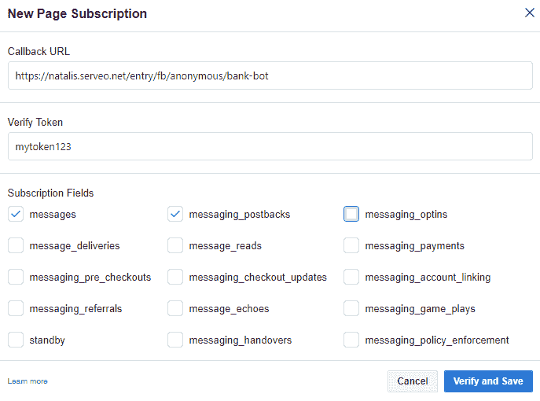***

***顺便说一下，[https://serveo.net](https://serveo.net/)是一个很棒的隧道系统(另一个选择是 ngrok)，如果你像我一样在 localhost 上开发你的助手。***

***在助手根属性上，设置相同的验证令牌并重新发布它:***

```
*`"facebook": {
    "validationToken": "mytoken123",
    "accessToken": "<token here>"
  },`*
```

***还应该设置访问令牌，从脸书的 messenger 区域获取:***

******

***最后，选择一个页面，为您的 webhook 订阅页面事件:***

******

***而且……一旦你连接了所有这些终端，你应该最终拥有一个完整的、协调的、端到端的对话式人工智能系统！***

### ***连接后端***

***现实生活中的连接各不相同，但幸运的是，目前大多数连接都是通过使用 RESTFul API 完成的。对于这些，可以查看[文档](https://servo-ai.github.io/servo-platform/)上的 ******检索动作****** 和 ******动作后****** 。一旦检索到数据，或接收到响应，它将被设置到[存储器域(上下文/全局/易失)](https://github.com/servo-ai/servo-platform/wiki/Building-context-aware,-stateful-chatbots-using-Servo#hierarchical-memory)。您可能会想要查询它。这是使用******ArrayQueryAction、** 实现的，它实现了一种内存中类似 Mongo 的查询语言 **。****** 对于直接的 MongoDB 查询，使用******MongoQuery******动作。***

### ***概括起来***

***Servo 是一个开源 IDE 和框架，它使用上下文识别搜索将用户置于正确的对话中，并输出正确的问题。我们学习了如何构造一个简单的对话，以及如何将这样的对话包装在子树中以便解耦和重用。Servo 还有许多其他值得探索的特性，您可以在其中找到***

*   ***脸书、Alexa、Twilio 和 Angular 的连接器***
*   ***MongoDB、Couchbase 和 LokiJS 数据库的连接器***
*   ***自动化对话测试工具***
*   ***对话调试器***
*   ***更多的动作、条件和装饰器***
*   ***流量控制机制***
*   ***字段分配和比较***
*   ***上下文操作***
*   ***确认***
*   ***内存中类似 mongo 的查询***
*   ***以及你想出的任何定制动作***

***请随意查看，并在 Github 论坛或我的@lmessinger Github 名称上提问。尽情享受吧！***