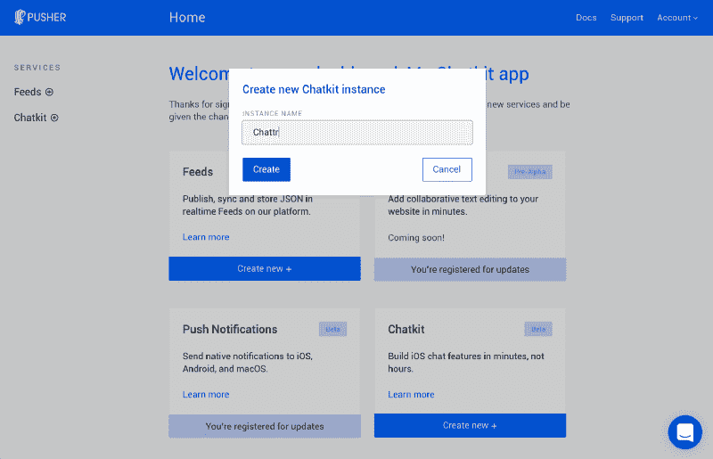
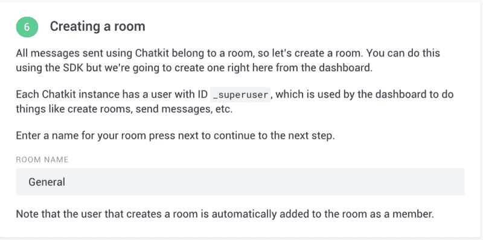
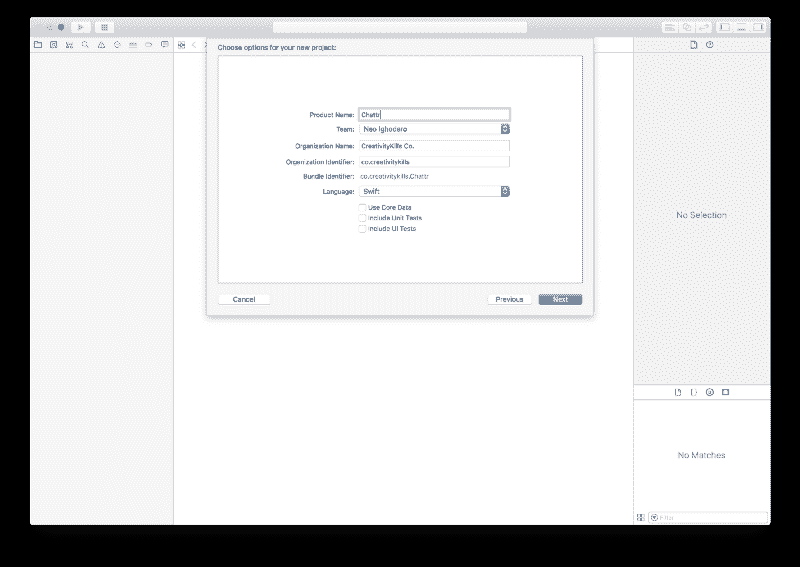
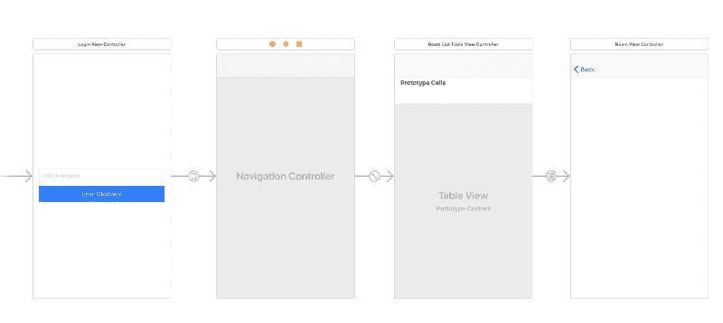
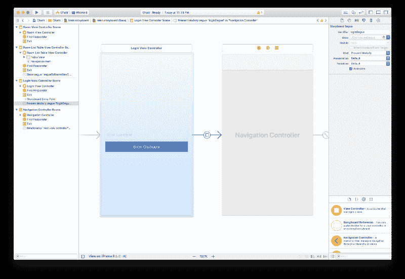
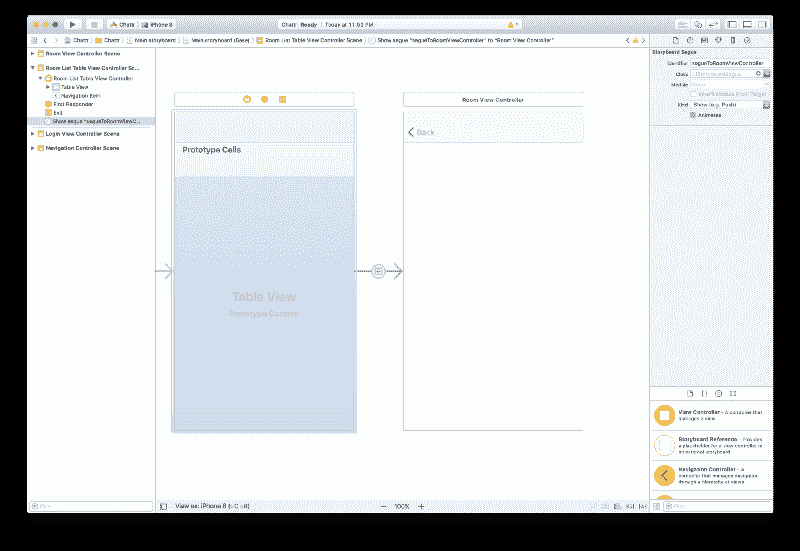
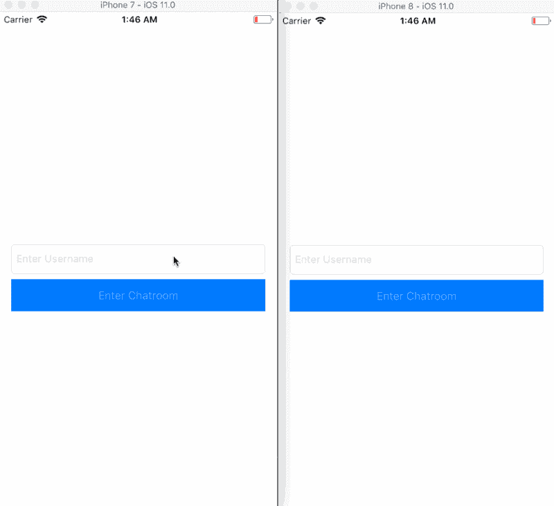

# 如何用 SlackTextViewController 构建一个 iOS 聊天应用

> 原文：<https://www.freecodecamp.org/news/how-to-build-an-ios-chat-app-with-slacktextviewcontroller-e3d3291a46a2/>

作者:尼奥·伊戈达罗

# 如何用 SlackTextViewController 构建一个 iOS 聊天应用


Photo by [Priscilla Du Preez](https://unsplash.com/photos/BjhUu6BpUZA?utm_source=unsplash&utm_medium=referral&utm_content=creditCopyText) on [Unsplash](https://unsplash.com/search/photos/chat?utm_source=unsplash&utm_medium=referral&utm_content=creditCopyText)

如今，许多应用程序都向用户提供应用内聊天和信使功能。应用内信使对于实时支持聊天或与其他应用程序用户的应用内消息传递非常有用。

在本文中，我们将探索如何使用 [Pusher Chatkit](https://pusher.com/chatkit) (在撰写本文时它还处于测试阶段)和`SlackTextViewController`来创建一个聊天应用程序。

？S `lackTextViewController` 是一个嵌入式 UIViewController 子类，具有不断增长的文本输入视图和其他有用的消息传递功能。它旨在替代 UITableViewController 和 UICollectionViewController。

遵循本教程需要对 Swift 和 Node.js 有基本的了解。

下面是我们的应用程序运行的屏幕记录:


### 要求

要按照教程进行操作，您需要满足下列要求:

*   [Xcode 7](https://developer.apple.com/xcode/) 或更高。
*   了解 Swift 和 Xcode 界面构建器。
*   安装在您机器上的 Cocoapods 。
*   [Node.js 和 NPM](https://docs.npmjs.com/getting-started/installing-node) 安装在你的机器上。
*   JavaScript 基础知识(Node.js 和 Express)。
*   Pusher 聊天工具应用程序。在这里创建一个。

假设你有所有的要求，让我们开始吧。

### 创建我们的 Chatkit 应用程序

转到 Chatkit 页面，创建一个帐户，然后从仪表板创建一个 Chatkit 应用程序。



遵循“入门”向导，直到结束，这样它可以帮助您创建一个新的用户帐户和一个新的聊天室。



在同一个屏幕上，完成“入门”向导后，点击“Keys”来获得应用程序的**实例定位器**和**键**。您将需要这些值来向 Chatkit API 发出请求。

仅此而已！现在让我们创建一个后端，它将帮助我们的应用程序与 Chatkit API 进行通信。

### 为 Pusher 聊天工具创建 Node.js 后端

在创建我们的 iOS 应用程序之前，让我们为应用程序创建一个 Node.js 后端。该应用程序将与后端进行对话，以执行检索请求所需的令牌等操作。

打开您的终端，在那里创建一个 web 应用程序将驻留的新目录。在这个 web 应用程序中，我们将定义一些路由，这些路由将包含向 Chatkit API 发出请求的逻辑。

运行下面的命令来创建包含我们的 web 应用程序的目录:

```
$ mkdir ChattrBackend
```

在根目录下创建一个新的`package.json`文件，并粘贴以下内容:

```
{  "main": "index.js",  "dependencies": {    "body-parser": "^1.17.2",    "express": "^4.15.3",    "pusher-chatkit-server": "^0.5.0"  }}
```

现在打开终端并运行下面的命令开始安装依赖项:

```
$ npm install
```

安装完成后，创建一个新的`index.js`文件并粘贴以下内容:

```
// Pull in the librariesconst express    = require('express');const bodyParser = require('body-parser');const app        = express();const Chatkit    = require('pusher-chatkit-server');const chatkit    = new Chatkit.default(require('./config.js'))
```

```
// Express Middlewaresapp.use(bodyParser.json());app.use(bodyParser.urlencoded({ extended: false }));
```

```
// --------------------------------------------------------// Creates a new user using the Chatkit API// --------------------------------------------------------app.post('/users', (req, res) => {  let username = req.body.username;  chatkit.createUser(username, username)    .then(r => res.json({username}))    .catch(e => res.json({error: e.error_description, type: e.error_type}))})
```

```
// --------------------------------------------------------// Generate a token and return it// --------------------------------------------------------app.post('/auth', (req, res) => {  let resp = chatkit.authenticate({grant_type: req.body.grant_type}, req.query.user_id)  res.json(resp)});
```

```
// --------------------------------------------------------// Index// --------------------------------------------------------app.get('/', (req, res) => {  res.json("It works!");});
```

```
// --------------------------------------------------------// Handle 404 errors// --------------------------------------------------------app.use((req, res, next) => {  let err = new Error('Not Found');  err.status = 404;  next(err);});
```

```
// --------------------------------------------------------// Serve application// --------------------------------------------------------app.listen(4000, function(){  console.log('App listening on port 4000!')});
```

在上面的代码中，我们有一个示例 Express 应用程序。该应用程序有两条主要路线。`/users`路由使用 Chatkit API 创建一个新用户。然后，创建的用户可以使用`/auth`路由请求令牌。令牌用于验证向 Chatkit API 发出请求的用户的身份。

最后，让我们在同一个根目录下创建一个`config.js`文件。我们将在这里定义聊天工具键。将以下内容粘贴到文件中:

```
module.exports = {  instanceLocator: "PUSHER_CHATKIT_INSTANCE_LOCATOR",  key: "PUSHER_CHATKIT_KEY",}
```

记得用您的聊天工具应用程序的实际值替换`*PUSHER_CHATKIT_*`` *实例 _ 定位器*`and`*PUSHER _ CHATKIT _ KEY*`。您可以在 Chatkit 仪表盘的“Keys”部分找到这些值。

现在我们已经完成了 Node.js 应用程序的创建。运行以下命令启动 Node.js 应用程序:

```
$ node index.js
```

> *？您可能希望保持终端窗口打开，并启动另一个终端窗口以保持 Node.js 服务器运行。*

### 创建我们的 iOS 应用

启动 Xcode，创建一个“单视图应用”项目。



### 安装我们的 Cocoapods 包

创建应用程序后，关闭 Xcode 并启动一个新的终端窗口。`cd`移动应用程序的根目录。运行下面的命令来初始化项目上的 Cocoapods:

```
$ pod init
```

这将创建一个新的`Podfile`。在这个文件中，我们可以定义我们的 Cocoapods 依赖项。打开文件并粘贴以下内容:

```
platform :ios, '10.0'
```

```
target 'Chattr' do  use_frameworks!
```

```
 pod 'PusherChatkit', '~> 0.4.0'  pod 'Alamofire', '~> 4.5.1'  pod 'SlackTextViewController', git: 'https://github.com/slackhq/SlackTextViewController.git', branch: 'master'end
```

现在运行`pod install`来安装依赖项。

> *⚠️ `SlackTextViewController`在 iOS 11 中有一个 bug，文本视图[不响应点击](https://github.com/slackhq/SlackTextViewController/issues/604)。虽然在版本`1.9.6`中已经修复了这个问题，但是在撰写本文时，这个版本还不能用于 Cocoapods，所以我们必须在 Podfile 中获取 master。*

安装完成后，在项目的根目录下打开由 Cocoapods 生成的新的`.xcworkspace`文件。这将启动 Xcode。

### 配置我们的 iOS 应用程序

在 Xcode 中，打开`AppDelegate.swift`文件，用以下代码替换文件内容:

```
import UIKit
```

```
struct AppConstants {    static let ENDPOINT    = "http://localhost:4000"    static let INSTANCE_LOCATOR = "PUSHER_CHATKIT_INSTANCE_LOCATOR"}
```

```
@UIApplicationMainclass AppDelegate: UIResponder, UIApplicationDelegate {
```

```
 var window: UIWindow?
```

```
 func application(_ application: UIApplication, didFinishLaunchingWithOptions launchOptions: [UIApplicationLaunchOptionsKey: Any]?) -> Bool {        window?.backgroundColor = UIColor.white        return true    }}
```

在`AppConstants`结构中，我们定义了`ENDPOINT`和`INSTANCE_LOCATOR`。`ENDPOINT`是 Node.js 应用程序所在的远程 web 服务器的 URL。`INSTANCE_LOCATOR`包含在 Pusher Chatkit 仪表板中为您的 Chatkit 应用程序提供的实例定位器。

现在让我们专注于创建故事板和其他部分。

### 创建我们的应用程序的故事板和控制器

打开`Main.storyboard`文件，在那里，我们将创建应用程序的界面。我们的故事板上将会有四个场景。这些将看起来像下面的截图:



在第一个视图控制器场景中，让我们创建一个`LoginViewController`并将其链接到故事板中的视图控制器场景。创建新的视图控制器，并粘贴以下代码:

```
import UIKitimport Alamofire
```

```
class LoginViewController: UIViewController {    var username: String!    @IBOutlet weak var loginButton: UIButton!    @IBOutlet weak var textField: UITextField!}
```

```
extension LoginViewController {    // MARK: Initialize    override func viewDidLoad() {        super.viewDidLoad()
```

```
 self.loginButton.isEnabled = false
```

```
 self.loginButton.addTarget(self, action: #selector(loginButtonPressed), for: .touchUpInside)        self.textField.addTarget(self, action: #selector(typingUsername), for: .editingChanged)    }
```

```
 // MARK: Navigation    override func prepare(for segue: UIStoryboardSegue, sender: Any?) -> Void {        if segue.identifier == "loginSegue" {            let ctrl = segue.destination as! UINavigationController            let actualCtrl = ctrl.viewControllers.first as! RoomListTableViewController            actualCtrl.username = self.username        }    }
```

```
 // MARK: Helpers    @objc func typingUsername(_ sender: UITextField) {        self.loginButton.isEnabled = sender.text!.characters.count >= 3    }
```

```
 @objc func loginButtonPressed(_ sender: Any) {        let payload: Parameters = ["username": self.textField.text!]
```

```
 self.loginButton.isEnabled = false
```

```
 Alamofire.request(AppConstants.ENDPOINT + "/users", method: .post, parameters: payload).validate().responseJSON { (response) in            switch response.result {            case .success(_):                self.username = self.textField.text!                self.performSegue(withIdentifier: "loginSegue", sender: self)            case .failure(let error):                print(error)            }        }    }}
```

在上面的代码中，我们定义了两个`@IBOutlet`,它们将连接到故事板中的视图控制器场景。在`prepare`方法中，我们通过在那个类中设置`username`属性来准备到`RoomListTableViewController`的导航。在`loginButtonPressed`处理程序中，我们向我们之前创建的 Node.js 应用程序发出一个请求来创建新用户。

打开故事板，将第一个场景链接到`LoginViewController`类。给视图控制器场景添加一个`UIButton`和一个`UITextField`。现在将`UITextField`连接到`textField`属性，作为引用插座。还将`UIButton`连接到`loginButton`属性作为参考插座。

接下来，向故事板添加一个导航控制器。在视图控制器和导航控制器之间创建一个手动片段，并将该片段的 ID 设置为`loginSegue`。



接下来，创建一个名为`RoomListTableViewController`的新控制器。在`Main.storyboard`文件中，将这个新类设置为附加到导航控制器的 TableViewController 的自定义类。现在在`RoomListTableViewController`类中，用下面的代码替换内容:

```
import UIKitimport PusherChatkit
```

```
class RoomListTableViewController: UITableViewController {    var username: String!    var selectedRoom: PCRoom?    var currentUser: PCCurrentUser!    var availableRooms = [PCRoom]()    var activityIndicator = UIActivityIndicatorView()}
```

```
// MARK: - Initialize -extension RoomListTableViewController: PCChatManagerDelegate {    override func viewDidLoad() -> Void {        super.viewDidLoad()        self.setNavigationItemTitle()        self.initActivityIndicator()        self.initPusherChatkit()    }
```

```
 private func setNavigationItemTitle() -> Void {        self.navigationItem.title = "Rooms"    }
```

```
 private func initActivityIndicator() -> Void {        self.activityIndicator = UIActivityIndicatorView(frame: CGRect(x: 0, y: 0, width: 40, height: 40))        self.activityIndicator.activityIndicatorViewStyle = UIActivityIndicatorViewStyle.gray        self.activityIndicator.center = self.view.center        self.view.addSubview(self.activityIndicator)        self.activityIndicator.startAnimating()    }
```

```
 private func initPusherChatkit() -> Void {        self.initPusherChatManager { [weak self] (currentUser) in            guard let strongSelf = self else { return }            strongSelf.currentUser = currentUser            strongSelf.activityIndicator.stopAnimating()            strongSelf.tableView.reloadData()        }    }
```

```
 private func initPusherChatManager(completion: @escaping (_ success: PCCurrentUser) -> Void) -> Void {                let chatManager = ChatManager(            instanceId: AppConstants.INSTANCE_LOCATOR,            tokenProvider: PCTokenProvider(url: AppConstants.ENDPOINT + "/auth", userId: username)        )
```

```
 chatManager.connect(delegate: self) { (user, error) in            guard error == nil else { return }            guard let user = user else { return }
```

```
 // Get a list of all rooms. Attempt to join the room.            user.getAllRooms { rooms, error in                guard error == nil else { return }
```

```
 self.availableRooms = rooms!
```

```
 rooms!.forEach { room in                    user.joinRoom(room) { room, error in                        guard error == nil else { return }                    }                }
```

```
 DispatchQueue.main.async {                    self.tableView.reloadData()                }            }
```

```
 DispatchQueue.main.async {                completion(user)            }        }    }}
```

```
// MARK: - UITableViewController Overrides -extension RoomListTableViewController {    override func tableView(_ tableView: UITableView, numberOfRowsInSection section: Int) -> Int {        return self.availableRooms.count    }
```

```
 override func tableView(_ tableView: UITableView, cellForRowAt indexPath: IndexPath) -> UITableViewCell {        let roomTitle = self.availableRooms[indexPath.row].name        let cell = tableView.dequeueReusableCell(withIdentifier: "RoomCell", for: indexPath)        cell.textLabel?.text = "\(roomTitle)"
```

```
 return cell    }
```

```
 override func tableView(_ tableView: UITableView, didSelectRowAt indexPath: IndexPath) {        self.selectedRoom = self.availableRooms[indexPath.row]        self.performSegue(withIdentifier: "segueToRoomViewController", sender: self)    }}
```

```
// MARK: - Navigation -extension RoomListTableViewController {    override func prepare(for segue: UIStoryboardSegue, sender: Any?) -> Void {        if segue.identifier == "segueToRoomViewController" {            let roomViewController = segue.destination as! RoomViewController            roomViewController.room = self.selectedRoom            roomViewController.currentUser = self.currentUser        }    }}
```

这个类的目的是显示用户可以连接和聊天的所有可用聊天室。让我们看看这个班的某些部分是怎么做的。

第一个扩展包含初始化器。在`viewDidLoad`方法中，我们设置了控制器标题、活动指示器和 Pusher 聊天工具。

在`initPusherChatManager`中，我们初始化一个`tokenProvider`，它从 Node.js 端点获取一个令牌。然后，我们用 Chatkit 应用程序的实例定位器和`tokenProvider,`创建一个`chatManager`，并连接到 Chatkit。

在第二个扩展中，我们覆盖了一些表格视图控制器方法。我们这样做是为了在行中显示频道名称。在第`100`行第二个扩展的最后一个方法中，我们调用方法`performSegue(withIdentifier: "segueToRoomViewController", sender: self)`，它将页面导航到一个新的视图控制器。

最后一个扩展有`prepare`方法。在我们到达之前，这为我们要导航到的视图控制器做了准备。现在，让我们创建视图控制器和访问它所需的序列。

对于我们最后的故事板场景，创建一个`RoomViewController`类。在`Main.storyboard`文件中，将最终视图控制器拖到板上。

将新视图控制器的自定义类设置为`RoomViewController`。另外，创建一个从表格视图控制器到它的手动片段，并将该片段命名为`segueToRoomViewController`:



打开`RoomViewController`类并用以下内容替换其内容:

```
import UIKitimport PusherChatkitimport SlackTextViewController
```

```
class RoomViewController: SLKTextViewController, PCRoomDelegate {    var room: PCRoom!    var messages = [Message]()    var currentUser: PCCurrentUser!    override var tableView: UITableView {        get { return super.tableView! }    }}
```

```
// MARK: - Initialize -extension RoomViewController {    override func viewDidLoad() {        super.viewDidLoad()        self.subscribeToRoom()        self.setNavigationItemTitle()        self.configureSlackTableViewController()    }
```

```
 private func subscribeToRoom() -> Void {        self.currentUser.subscribeToRoom(room: self.room, roomDelegate: self)    }
```

```
 private func setNavigationItemTitle() -> Void {        self.navigationItem.title = self.room.name    }
```

```
 private func configureSlackTableViewController() -> Void {        self.bounces = true        self.isInverted = true        self.shakeToClearEnabled = true        self.isKeyboardPanningEnabled = true        self.textInputbar.maxCharCount = 256        self.tableView.separatorStyle = .none        self.textInputbar.counterStyle = .split        self.textInputbar.counterPosition = .top        self.textInputbar.autoHideRightButton = true        self.textView.placeholder = "Enter Message...";        self.shouldScrollToBottomAfterKeyboardShows = false        self.textInputbar.editorTitle.textColor = UIColor.darkGray        self.textInputbar.editorRightButton.tintColor = UIColor(red: 0/255, green: 122/255, blue: 255/255, alpha: 1)
```

```
 self.tableView.register(MessageCell.classForCoder(), forCellReuseIdentifier: MessageCell.MessengerCellIdentifier)        self.autoCompletionView.register(MessageCell.classForCoder(), forCellReuseIdentifier: MessageCell.AutoCompletionCellIdentifier)    }}
```

```
// MARK: - UITableViewController Overrides -extension RoomViewController {    override class func tableViewStyle(for decoder: NSCoder) -> UITableViewStyle {        return .plain    }
```

```
 override func numberOfSections(in tableView: UITableView) -> Int {        return 1    }
```

```
 override func tableView(_ tableView: UITableView, numberOfRowsInSection section: Int) -> Int {        if tableView == self.tableView {            return self.messages.count        }
```

```
 return 0    }
```

```
 override func tableView(_ tableView: UITableView, cellForRowAt indexPath: IndexPath) -> UITableViewCell {        return self.messageCellForRowAtIndexPath(indexPath)    }
```

```
 override func tableView(_ tableView: UITableView, heightForRowAt indexPath: IndexPath) -> CGFloat {        if tableView == self.tableView {            let message = self.messages[(indexPath as NSIndexPath).row]
```

```
 if message.text.characters.count == 0 {                return 0            }
```

```
 let paragraphStyle = NSMutableParagraphStyle()            paragraphStyle.lineBreakMode = .byWordWrapping            paragraphStyle.alignment = .left
```

```
 let pointSize = MessageCell.defaultFontSize()
```

```
 let attributes = [                NSAttributedStringKey.font: UIFont.systemFont(ofSize: pointSize),                NSAttributedStringKey.paragraphStyle: paragraphStyle            ]
```

```
 var width = tableView.frame.width - MessageCell.kMessageTableViewCellAvatarHeight            width -= 25.0
```

```
 let titleBounds = (message.username as NSString!).boundingRect(                with: CGSize(width: width, height: CGFloat.greatestFiniteMagnitude),                options: .usesLineFragmentOrigin,                attributes: attributes,                context: nil            )
```

```
 let bodyBounds = (message.text as NSString!).boundingRect(                with: CGSize(width: width, height: CGFloat.greatestFiniteMagnitude),                options: .usesLineFragmentOrigin,                attributes: attributes,                context: nil            )
```

```
 var height = titleBounds.height            height += bodyBounds.height            height += 40
```

```
 if height < MessageCell.kMessageTableViewCellMinimumHeight {                height = MessageCell.kMessageTableViewCellMinimumHeight            }
```

```
 return height        }
```

```
 return MessageCell.kMessageTableViewCellMinimumHeight    }}
```

```
// MARK: - Overrides -extension RoomViewController {    override func keyForTextCaching() -> String? {        return Bundle.main.bundleIdentifier    }
```

```
 override func didPressRightButton(_ sender: Any!) {        self.textView.refreshFirstResponder()        self.sendMessage(textView.text)        super.didPressRightButton(sender)    }}
```

```
// MARK: - Delegate Methods -extension RoomViewController {    public func newMessage(message: PCMessage) {        let msg = self.PCMessageToMessage(message)        let indexPath = IndexPath(row: 0, section: 0)        let rowAnimation: UITableViewRowAnimation = self.isInverted ? .bottom : .top        let scrollPosition: UITableViewScrollPosition = self.isInverted ? .bottom : .top
```

```
 DispatchQueue.main.async {            self.tableView.beginUpdates()            self.messages.insert(msg, at: 0)            self.tableView.insertRows(at: [indexPath], with: rowAnimation)            self.tableView.endUpdates()
```

```
 self.tableView.scrollToRow(at: indexPath, at: scrollPosition, animated: true)            self.tableView.reloadRows(at: [indexPath], with: .automatic)            self.tableView.reloadData()        }    }}
```

```
// MARK: - Helpers -extension RoomViewController {    private func PCMessageToMessage(_ message: PCMessage) -> Message {        return Message(id: message.id, username: message.sender.displayName, text: message.text)    }
```

```
 private func sendMessage(_ message: String) -> Void {        guard let room = self.room else { return }        self.currentUser?.addMessage(text: message, to: room, completionHandler: { (messsage, error) in            guard error == nil else { return }        })    }
```

```
 private func messageCellForRowAtIndexPath(_ indexPath: IndexPath) -> MessageCell {        let cell = self.tableView.dequeueReusableCell(withIdentifier: MessageCell.MessengerCellIdentifier) as! MessageCell        let message = self.messages[(indexPath as NSIndexPath).row]
```

```
 cell.bodyLabel().text = message.text        cell.titleLabel().text = message.username
```

```
 cell.usedForMessage = true        cell.indexPath = indexPath        cell.transform = self.tableView.transform
```

```
 return cell    } }
```

上面的类扩展了`SlackTableViewController`,这自动地给了它访问控制器的一些很酷的特性。在上面的代码中，我们将类分成了 5 个扩展。让我们看看每个扩展，并解释一下其中发生了什么。

在第一个扩展中，我们订阅了房间，将房间名称设置为页面标题，并配置了`SlackTableViewController`。在`configureSlackTableViewController`方法中，我们简单地定制我们的`SlackTableViewController`的部分。

在第二个扩展中，我们覆盖了表格视图控制器方法。我们还设置了部分的数量、行数，并设置了要在每行上显示的`Message`。最后，我们还根据消息的字符计算每个单元格的动态高度。

在第三个扩展中，我们有`didPressRightButton`函数，每当用户按下 send 发送消息时都会调用这个函数。

在第四个扩展中，我们有来自`PCRoomDelegate`的可用函数。在`newMessage`函数中，我们将消息发送到 Chatkit，然后重新加载表格以显示新添加的数据。

在第五个也是最后一个扩展中，我们定义了作为助手的函数。`PCMessageToMessage`方法将一个`PCMessage`转换成我们自己的`Message`结构(我们将在后面定义)。`sendMessage`方法将消息发送给 Chatkit API。最后，我们有`messageCellForRowAtIndexPath`方法。这个方法使用`indexPath`简单地获取附加到特定行的消息。

现在创建一个名为`MessageCell`的新类。这将是一个视图类，我们将自定义单个聊天单元的外观。在文件中，将内容替换为以下内容:

```
import UIKitimport SlackTextViewController
```

```
struct Message {    var id: Int!    var username: String!    var text: String!}
```

```
class MessageCell: UITableViewCell {
```

```
 static let kMessageTableViewCellMinimumHeight: CGFloat = 50.0;    static let kMessageTableViewCellAvatarHeight: CGFloat = 30.0;
```

```
 static let MessengerCellIdentifier: String = "MessengerCell";    static let AutoCompletionCellIdentifier: String = "AutoCompletionCell";
```

```
 var _titleLabel: UILabel?    var _bodyLabel: UILabel?    var _thumbnailView: UIImageView?
```

```
 var indexPath: IndexPath?    var usedForMessage: Bool?
```

```
 required init?(coder aDecoder: NSCoder) {        fatalError("init(coder:) has not been implemented")    }
```

```
 override init(style: UITableViewCellStyle, reuseIdentifier: String?) {        super.init(style: style, reuseIdentifier: reuseIdentifier)
```

```
 self.selectionStyle = .none        self.backgroundColor = UIColor.white
```

```
 configureSubviews()    }
```

```
 func configureSubviews() {        contentView.addSubview(thumbnailView())        contentView.addSubview(titleLabel())        contentView.addSubview(bodyLabel())
```

```
 let views: [String:Any] = [            "thumbnailView": thumbnailView(),            "titleLabel": titleLabel(),            "bodyLabel": bodyLabel()        ]
```

```
 let metrics = [            "tumbSize": MessageCell.kMessageTableViewCellAvatarHeight,            "padding": 15,            "right": 10,            "left": 5        ]
```

```
 contentView.addConstraints(NSLayoutConstraint.constraints(            withVisualFormat: "H:|-left-[thumbnailView(tumbSize)]-right-[titleLabel(>=0)]-right-|",            options: [],            metrics: metrics,            views: views        ))
```

```
 contentView.addConstraints(NSLayoutConstraint.constraints(            withVisualFormat: "H:|-left-[thumbnailView(tumbSize)]-right-[bodyLabel(>=0)]-right-|",            options: [],            metrics: metrics,            views: views        ))
```

```
 contentView.addConstraints(NSLayoutConstraint.constraints(            withVisualFormat: "V:|-right-[thumbnailView(tumbSize)]-(>=0)-|",            options: [],            metrics: metrics,            views: views        ))
```

```
 if (reuseIdentifier == MessageCell.MessengerCellIdentifier) {            contentView.addConstraints(NSLayoutConstraint.constraints(                withVisualFormat: "V:|-right-[titleLabel(20)]-left-[bodyLabel(>=0@999)]-left-|",                options: [],                metrics: metrics,                views: views            ))        }        else {            contentView.addConstraints(NSLayoutConstraint.constraints(                withVisualFormat: "V:|[titleLabel]|",                options: [],                metrics: metrics,                views: views            ))        }    }
```

```
 // MARK: Getters
```

```
 override func prepareForReuse() {        super.prepareForReuse()
```

```
 selectionStyle = .none
```

```
 let pointSize: CGFloat = MessageCell.defaultFontSize()
```

```
 titleLabel().font = UIFont.boldSystemFont(ofSize: pointSize)        bodyLabel().font = UIFont.systemFont(ofSize: pointSize)        titleLabel().text = ""        bodyLabel().text = ""    }
```

```
 func titleLabel() -> UILabel {        if _titleLabel == nil {            _titleLabel = UILabel()            _titleLabel?.translatesAutoresizingMaskIntoConstraints = false            _titleLabel?.backgroundColor = UIColor.clear            _titleLabel?.isUserInteractionEnabled = false            _titleLabel?.numberOfLines = 0            _titleLabel?.textColor = UIColor.gray            _titleLabel?.font = UIFont.boldSystemFont(ofSize: MessageCell.defaultFontSize())        }
```

```
 return _titleLabel!    }
```

```
 func bodyLabel() -> UILabel {        if _bodyLabel == nil {            _bodyLabel = UILabel()            _bodyLabel?.translatesAutoresizingMaskIntoConstraints = false            _bodyLabel?.backgroundColor = UIColor.clear            _bodyLabel?.isUserInteractionEnabled = false            _bodyLabel?.numberOfLines = 0            _bodyLabel?.textColor = UIColor.darkGray            _bodyLabel?.font = UIFont.systemFont(ofSize: MessageCell.defaultFontSize())        }
```

```
 return _bodyLabel!    }
```

```
 func thumbnailView() -> UIImageView {        if _thumbnailView == nil {            _thumbnailView = UIImageView()            _thumbnailView?.translatesAutoresizingMaskIntoConstraints = false            _thumbnailView?.isUserInteractionEnabled = false            _thumbnailView?.backgroundColor = UIColor(white: 0.9, alpha: 1.0)            _thumbnailView?.layer.cornerRadius = MessageCell.kMessageTableViewCellAvatarHeight / 2.0            _thumbnailView?.layer.masksToBounds = true        }
```

```
 return _thumbnailView!    }
```

```
 class func defaultFontSize() -> CGFloat {        var pointSize: CGFloat = 16.0
```

```
 let contentSizeCategory: String = String(describing: UIApplication.shared.preferredContentSizeCategory)        pointSize += SLKPointSizeDifferenceForCategory(contentSizeCategory)
```

```
 return pointSize    }}
```

在上面的代码中，我们创建了一个扩展`UITableViewCell`的类。这个类将被`SlackTextViewController`用作每个消息行的类。配置`SlackTextViewController`时在`RoomsViewController`中注册。

### 测试我们的 Pusher 聊天工具应用程序

要指示您的 iOS 应用程序连接到您的本地 Node.js 服务器，您需要进行一些更改。在`info.plist`文件中，添加如下所示的密钥:


通过这一更改，您可以构建并运行您的应用程序，它将直接与您的本地 web 应用程序对话。现在您可以运行您的应用程序了。



### 结论

在本教程中，我们能够使用`SlackTextViewController`和 Pusher Chatkit SDK 的强大功能创建一个简单的聊天应用程序。希望您已经了解了如何将 Pusher Chatkit 集成到现有技术中，以及它如何在您的应用程序中支持消息传递。

这个帖子最早发布给[推手](https://pusher.com/tutorials/ios-chat-slacktextviewcontroller/)。