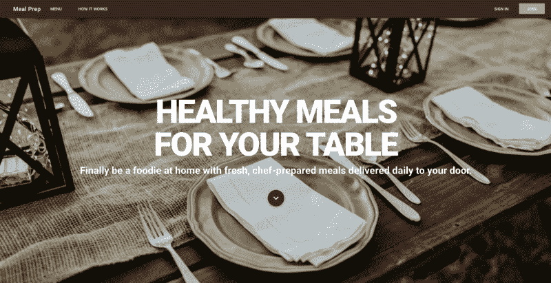
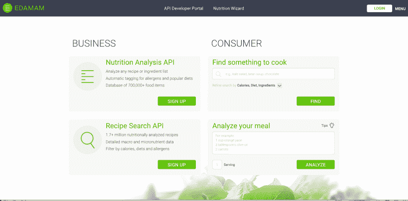
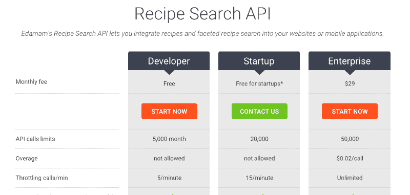
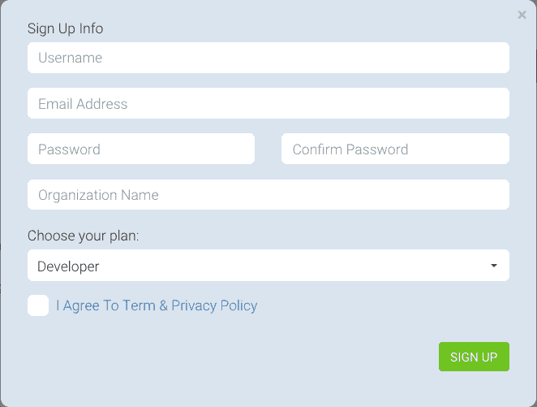
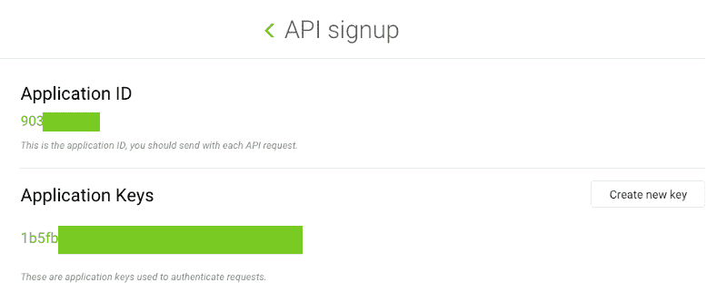
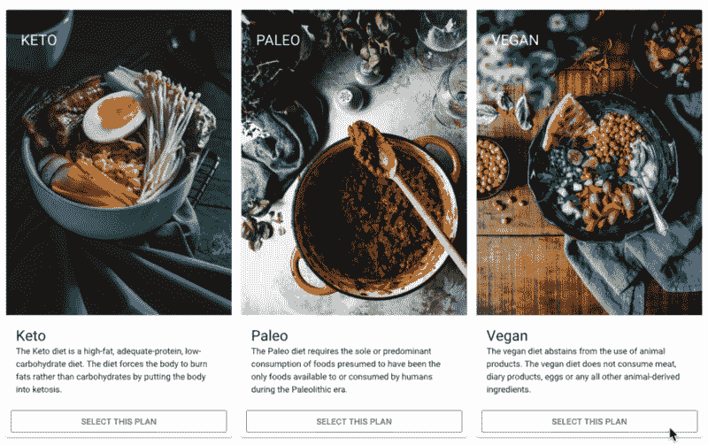

# 如何使用 Vue.js、Vuex、Vuetify 和 Firebase 构建 SPA:使用 Vuex 并访问 API

> 原文：<https://www.freecodecamp.org/news/how-to-build-an-spa-using-vue-js-vuex-vuetify-and-firebase-use-vuex-and-access-the-api-f8036aa464ad/>

詹妮弗·布兰德

# 如何使用 Vue.js、Vuex、Vuetify 和 Firebase 构建 SPA:使用 Vuex 并访问 API

#### 第 3 部分:学习如何使用 Vuex 并访问 API 来获取您的食谱



Meal Prep application

了解如何使用 Vue.js、Vuex、Vue Router 和 Firebase 创建送餐网站。

这是关于构建 Vue 应用程序的四篇系列文章的第三篇。以下是所有零件的清单:

[第 1 部分:安装 Vue 并使用 Vue 化和 Vue 路由器构建 SPA](https://medium.com/p/838b40721a07)

[第二部分:使用 Vue 路由器](https://medium.com/p/fc5bd065fe18)

[第三部分:使用 Vuex 和访问 API](https://medium.com/p/f8036aa464ad)

[第 4 部分:使用 Firebase 进行认证](https://medium.com/p/d9932d1e4365)

### 概述

在本系列的第一部分中，我们使用 Vue CLI 创建了 Vue 应用程序。此外，我们在应用程序中添加了 Vuetify。我们使用 Vuetify 来设计我们的主页。

在第二部分中，我们使用 Vue Router 在应用程序的不同页面之间添加导航。我们为应用程序中的所有页面添加了组件。

### 访问 API

我们正在建立一个销售送餐服务的 SPA 电子商务网站。为了让这个网站工作，我们需要食谱来制作我们的食物。为了生成我们的食谱，我们将使用来自毛豆的 [API。毛豆食谱 API 包含 170 多万份营养分析食谱。API 允许你通过饮食过滤食谱。这就是我们所需要的，因为我们希望根据用户选择的饮食来显示食谱。](https://www.edamam.com/)

#### 创建一个毛豆帐户

第一步是创建您的毛豆帐户。他们提供一个免费账户，这就是你想要注册的。点击此链接进入毛豆网站。点击配方搜索 API 的`sign up`按钮。



Edamam API Homepage

接下来，您将看到三个不同的级别，您可以报名参加。我们将使用免费的开发者层。点击开发者选项中的`start now`按钮。



Sign up for the free Developer account

您将会看到一个注册表单。完成表格。



Sign-up form

完成表格后，系统会提示您登录您的帐户。当您登录到您的帐户时，会要求您选择您需要的 API。不要点击任何选项，而是进入菜单并选择`Get an API key now!`

你应该看到你的食谱搜索 API 键。*(注意:如果您没有密钥，则点击`create a new application`按钮创建一个。)*点击查看按钮查看你的 API 密匙详情。您将拥有一个应用程序 ID 和应用程序密钥。您将需要这些来访问您的网站的 API。



API Keys needed to access Edamam

#### 创建菜单页面

在菜单页面上，我们将展示我们所支持的三种饮食中每一种的食谱。这些食谱将从毛豆 API 服务中检索。

我们要做的第一件事是让用户选择一种饮食。我们可以通过重用 HomePlans 组件来做到这一点。我们将修改组件，为每个饮食添加一个按钮，供用户选择。当访问者点击网站上的一个按钮时，他们会看到这种饮食的食谱。**但是**当组件显示在主页上时，我们不希望显示这些按钮。所以我们会处理好这件事。

打开 HomePlans 组件。在`v-card-text`部分下面，我们将添加一个 `v-card-actions`部分。此部分将包含供用户选择计划的按钮。这是我们在这个组件中添加到每个`v-card`的内容。

```
<v-card-actions v-if="['menu'].includes($route.name)">    &lt;v-btn outline block color="green" @click="showRecipes('vegan')">Select This Plan</v-btn></v-card-actions>
```

对于每个`v-card-actions`部分，我们将有一个按钮。按钮具有轮廓和块集的道具。当你点击按钮时，按钮将调用方法`showRecipes`。向该方法传递一个参数，该参数带有所选饮食的文本。请确保您将此更改为反映所选的饮食。下面是`HomePlans`组件的模板现在的样子:

```
<template>    <v-container grid-list-lg>        &lt;v-layout row>            &lt;v-flex xs12 class="text-xs-center display-1 font-weight-black my-5">Available Meal Plans</v-flex>        </v-layout>        <v-layout row wrap>            <v-flex xs12 sm12 md4>                <v-card>                    <v-responsive>                        <v-img src="http://source.unsplash.com/hjCA3ecCXAQ" height="500px">                            <v-container fill-height fluid>                                <v-layout fill-height>                                    <v-flex xs12 align-end flexbox>                                        <span class="headline white--text">KETO</span>                                    </v-flex>                                </v-layout>                            </v-container>                        </v-img>                    </v-responsive>
```

```
 <v-card-text>                        <div>                            <h3 class="headline mb-0">Keto</h3>                            <div>The Keto diet is a high-fat, adequate-protein, low-carbohydrate diet. The diet forces the body to burn fats rather than carbohydrates by putting the body into ketosis.                            </div>                        </div>                    </v-card-text>
```

```
 <v-card-actions>                        &lt;v-btn outline block color="green" @click="showRecipes('keto')">Select This Plan</v-btn>                    </v-card-actions>                </v-card>            </v-flex>
```

```
 <v-flex xs12 sm12 md4>                <v-card>                    <v-responsive>                        <v-img src="http://source.unsplash.com/6S27S6pZ6o0" height="500px">                            <v-container fill-height fluid>                                <v-layout fill-height>                                    <v-flex xs12 align-end flexbox>                                        <span class="headline white--text">PALEO</span>                                    </v-flex>                                </v-layout>                            </v-container>                        </v-img>                    </v-responsive>
```

```
 <v-card-text>                        <div>                            <h3 class="headline mb-0">Paleo</h3>                            <div>The Paleo diet requires the sole or predominant consumption of foods presumed to have been the only foods available to or consumed by humans during the Paleolithic era.                            </div>                        </div>                    </v-card-text>
```

```
 <v-card-actions>                        &lt;v-btn outline block color="green" @click="showRecipes('paleo')">Select This Plan</v-btn>                    </v-card-actions>                </v-card>            </v-flex>
```

```
 <v-flex xs12 sm12 md4>                <v-card>                    <v-responsive>                        <v-img src="http://source.unsplash.com/1SPu0KT-Ejg" height="500px">                            <v-container fill-height fluid>                                <v-layout fill-height>                                    <v-flex xs12 align-end flexbox>                                        <span class="headline white--text">VEGAN</span>                                    </v-flex>                                </v-layout>                            </v-container>                        </v-img>                    </v-responsive>
```

```
 <v-card-text>                        <div>                            <h3 class="headline mb-0">Vegan</h3>                            <div>The vegan diet abstains from the use of animal products. The vegan diet does not consume meat, diary products, eggs or any all other animal-derived ingredients.                            </div>                        </div>                    </v-card-text>
```

```
 <v-card-actions>                        &lt;v-btn outline block color="green" @click="showRecipes('vegan')">Select This Plan</v-btn>                    </v-card-actions>                </v-card>            </v-flex>
```

```
 </v-layout>    </v-container></template>
```



Select This Plan button added to HomePlans component

现在我们已经添加了按钮，我们想在主页上隐藏它，并在菜单页面上显示它。为此，我们将结合`v-if`指令和我们分配给每条路线的名称。

在`router.js`文件中，我们添加了我们的路线。Routes 是一个对象数组。每个对象都有一个`path`、`name`和`component`。我们可以用数组`includes`的方法来检查当前的路径是否是 home。以下是我们将添加到每个`v-card-actions`部分的内容:

```
<v-card-actions v-if="['menu'].includes($route.name)">    &lt;v-btn outline block color="green" @click="showRecipes('vegan')">Select This Plan</v-btn></v-card-actions>
```

下面是 HomePlans 组件的模板现在的样子:

```
<template>    <v-container grid-list-lg>        &lt;v-layout row>            &lt;v-flex xs12 class="text-xs-center display-1 font-weight-black my-5">Available Meal Plans</v-flex>        </v-layout>        <v-layout row wrap>            <v-flex xs12 sm12 md4>                <v-card>                    <v-responsive>                        <v-img src="http://source.unsplash.com/hjCA3ecCXAQ" height="500px">                            <v-container fill-height fluid>                                <v-layout fill-height>                                    <v-flex xs12 align-end flexbox>                                        <span class="headline white--text">KETO</span>                                    </v-flex>                                </v-layout>                            </v-container>                        </v-img>                    </v-responsive>
```

```
 <v-card-text>                        <div>                            <h3 class="headline mb-0">Keto</h3>                            <div>The Keto diet is a high-fat, adequate-protein, low-carbohydrate diet. The diet forces the body to burn fats rather than carbohydrates by putting the body into ketosis.                            </div>                        </div>                    </v-card-text>
```

```
 <v-card-actions v-if="['menu'].includes($route.name)">                        &lt;v-btn outline block color="green" @click="showRecipes('keto')">Select This Plan</v-btn>                    </v-card-actions>                </v-card>            </v-flex>
```

```
 <v-flex xs12 sm12 md4>                <v-card>                    <v-responsive>                        <v-img src="http://source.unsplash.com/6S27S6pZ6o0" height="500px">                            <v-container fill-height fluid>                                <v-layout fill-height>                                    <v-flex xs12 align-end flexbox>                                        <span class="headline white--text">PALEO</span>                                    </v-flex>                                </v-layout>                            </v-container>                        </v-img>                    </v-responsive>
```

```
 <v-card-text>                        <div>                            <h3 class="headline mb-0">Paleo</h3>                            <div>The Paleo diet requires the sole or predominant consumption of foods presumed to have been the only foods available to or consumed by humans during the Paleolithic era.                            </div>                        </div>                    </v-card-text>
```

```
 <v-card-actions v-if="['menu'].includes($route.name)">                        &lt;v-btn outline block color="green" @click="showRecipes('paleo')">Select This Plan</v-btn>                    </v-card-actions>                </v-card>            </v-flex>
```

```
 <v-flex xs12 sm12 md4>                <v-card>                    <v-responsive>                        <v-img src="http://source.unsplash.com/1SPu0KT-Ejg" height="500px">                            <v-container fill-height fluid>                                <v-layout fill-height>                                    <v-flex xs12 align-end flexbox>                                        <span class="headline white--text">VEGAN</span>                                    </v-flex>                                </v-layout>                            </v-container>                        </v-img>                    </v-responsive>
```

```
 <v-card-text>                        <div>                            <h3 class="headline mb-0">Vegan</h3>                            <div>The vegan diet abstains from the use of animal products. The vegan diet does not consume meat, diary products, eggs or any all other animal-derived ingredients.                            </div>                        </div>                    </v-card-text>
```

```
 <v-card-actions v-if="['menu'].includes($route.name)">                        &lt;v-btn outline block color="green" @click="showRecipes('vegan')">Select This Plan</v-btn>                    </v-card-actions>                </v-card>            </v-flex>
```

```
 </v-layout>    </v-container></template>
```

#### 获取食谱

当用户点击`Add This Plan`按钮时，它调用方法`showRecipes`。现在让我们创建这个方法。这个方法将从毛豆 API 中检索食谱。首先，我们需要通过在终端输入以下命令来安装 axios:

```
npm install axios
```

要使用 axios，我们需要导入它。在 HomePlans 组件的脚本部分，使用以下命令导入它:

```
import axios from 'axios';
```

接下来，在 HomePlans 组件的 export default 部分，我们将添加我们的方法。

注意:我将向你展示如何在一个组件中使用 axios 从一个 API 中获取数据。但是我们将放弃这段代码，使用 Vuex。因此，从这里到标题**使用 Vuex** 是代码，我们不会在我们的应用程序的最终版本中使用它——但我想展示它，以便您理解它。

该方法名为`showRecipes`，并带有一个名为`plan`的参数。在这个方法中，我将根据选择的饮食计划，使用 axios 从毛豆中获取 10 个食谱。axios 调用将到达 URL`[https://api.edamam.com/search](https://api.edamam.com/search.)`T3。

根据 Edamam API 文档，我们需要使用一个名为`q`的参数，它包含我们的查询字符串。我们将把这个值设置为传递给我们的方法的计划参数。文档还要求我们提供 app_id 和 app_key 的参数。您需要将这些值设置为注册 Edamam API 时分配给您的密钥。

我们将使用另外两个参数。他们是`to`和`from`。这些参数指定返回的配方数量的开始和结束。出于演示的目的，我们将限制它只返回前 10 个食谱。

我们的 axios 调用要么成功，要么失败。Axios 提供了一个承诺，因此我们可以使用`.then`和`.catch`来处理成功和失败。如果调用成功，我们希望将食谱数据值设置为等于从毛豆返回的`hits`数组。来自 axios 的所有响应都包含在`data`对象中。我们首先将 response 分配给 response.data，然后将 recipes 分配给`response.hits`。

axios 调用失败怎么办？嗯，我们用承诺的`.catch`来处理失败。在这种情况下，我们想要做的就是将食谱设置为一个空数组。

下面是该方法的样子:

```
export default {    name: 'HomePlans',    data() {        return {            recipes: []        };    },    methods: {        showRecipes(plan) {            axios                .get('https://api.edamam.com/search', {                    params: {                        q: plan,                        app_id: '5b6623d5',                        app_key: '46674aa2193dbb7b88ffd897331e661a',                        from: 0,                        to: 9                    }                })                .then(response => {                    response = response.data;                    this.recipes = response.hits;                })                .catch(() => {                    this.recipes = [];                });        }    }};
```

### 使用 Vuex

现在我们已经把自己的代码弄得一团糟了。我们最初有一个组件显示一个饮食的图片、标题和简短描述。我们添加了一个按钮来获取食谱。现在，如果我们继续下去，那么我们将需要添加功能来显示我们从毛豆 API 中检索到的食谱。

我真的不希望所有这些功能都放在这个组件中。我希望它只显示图像，标题，简短描述和按钮。但是通过在组件中设置按钮，我需要一种方法来处理用户点击按钮的情况。我还需要一种方法来显示食谱。为此，我将把处理按钮点击的功能转移到 Vuex。

Vuex 是 Vue.js 应用程序的状态管理库。它充当应用程序中所有组件的集中存储，规则确保状态只能以可预测的方式变化。Vuex 包括:

*   状态，这是驱动我们 app 的真理之源；
*   改变状态值的突变；
*   这些动作是状态响应视图中的用户输入而改变的可能方式。

当我们使用 Vue CLI 3 创建应用程序时，我们指定将使用 Vuex。因此，CLI 在 src 文件夹中为我们创建了文件`store.js`。

`State`将包含菜谱。我们将使用一个`actions`进行 API 调用来检索食谱。一个`mutations`将被用来用从`actions`调用返回的食谱更新`state`中的变量`recipe`。

打开`store.js`文件。首先，在 state 中添加一个新的 recipes 变量，并将其分配给一个空数组。还要添加一个名为 apiUrl 的变量。这个变量将包含我们的 API 调用的 url。它应该是这样的:

```
export default new Vuex.Store({    state: {        recipes: [],        apiUrl: 'https://api.edamam.com/search'    },    mutations: {},    actions: {}});
```

接下来，我们将创建一个名为`getRecipes`的动作。这个动作将使用 axios 从 API 获取食谱。要使用 axios，我们需要导入它。在文件的顶部，有两个导入命令。把这个放在他们后面:

```
import axios from 'axios';
```

之前，我向您展示了在 axios 调用中使用承诺。现在我将向您展示如何使用 async / await 进行同样的调用。getRecipes 方法必须以`async`为前缀。在方法内部，我们有一个 try catch 块。在 try 块中，我们将为从 axios 调用返回的数据设置一个变量`response`。我们将 await 放在 axios 调用的前面。如果调用成功，我们将把这个突变称为`setRecipes`。SetRecipes 将改变状态，将 Recipes 设置为 API 调用返回的 recipes 数组。

如果 API 调用失败，它将在 catch 块中结束。在这个场景中，我们调用同一个突变，但传递给它一个空数组。store.js 应该是这样的:

```
import Vue from 'vue';import Vuex from 'vuex';import axios from 'axios';Vue.use(Vuex);export default new Vuex.Store({    state: {        recipes: [],        apiUrl: 'https://api.edamam.com/search'    },    mutations: {        setRecipes(state, payload) {            state.recipes = payload;        }    },    actions: {        async getRecipes({ state, commit }, plan) {            try {                let response = await axios.get(`${state.apiUrl}`, {                    params: {                        q: plan,                        app_id: '<yourAppIdHere>',                        app_key: '<yourAppKeyHere>',                        from: 0,                        to: 9                    }                });                commit('setRecipes', response.data.hits);            } catch (error) {                commit('setRecipes', []);            }        }    }});
```

#### 更新家庭计划组件

让我们回到我们的 HomePlans 组件并清理它。我们可以删除导入 axios 代码行。我们可以移除`data()`对象。在`showRecipes`方法中，你可以删除所有的代码。我们现在只需要一行代码来调用我们在 Vuex 商店中的操作。要在 Vuex 中调用一个动作，你可以使用一个`dispatch`。这是我们的`showRecipes`方法的一行代码:

```
this.$store.dispatch('getRecipes', plan);
```

以下是我们的 HomePlans 组件的外观:

```
<template>    <v-container grid-list-lg>        &lt;v-layout row>            &lt;v-flex xs12 class="text-xs-center display-1 font-weight-black my-5">Available Meal Plans</v-flex>        </v-layout>        <v-layout row wrap>            <v-flex xs12 sm12 md4>                <v-card>                    <v-responsive>                        <v-img src="http://source.unsplash.com/hjCA3ecCXAQ" height="500px">                            <v-container fill-height fluid>                                <v-layout fill-height>                                    <v-flex xs12 align-end flexbox>                                        <span class="headline white--text">KETO</span>                                    </v-flex>                                </v-layout>                            </v-container>                        </v-img>                    </v-responsive>                    <v-card-text>                        <div>                            <h3 class="headline mb-0">Keto</h3>                            <div>The Keto diet is a high-fat, adequate-protein, low-carbohydrate diet. The diet forces the body to burn fats rather than carbohydrates by putting the body into ketosis.                            </div>                        </div>                    </v-card-text>                    <v-card-actions v-if="['menu'].includes($route.name)">                        <v-btn outline block color="green" @click="showRecipes('keto')">Select This Plan</v-btn>                    &lt;/v-card-actions>                </v-card&gt;            </v-flex>            <v-flex xs12 sm12 md4>                <v-card>                    <v-responsive>                        <v-img src="http://source.unsplash.com/6S27S6pZ6o0" height="500px">                            <v-container fill-height fluid>                                <v-layout fill-height>                                    <v-flex xs12 align-end flexbox>                                        <span class="headline white--text">PALEO</span>                                    </v-flex>                                </v-layout>                            </v-container>                        </v-img>                    </v-responsive>                    <v-card-text>                        <div>                            <h3 class="headline mb-0">Paleo</h3>                            <div>The Paleo diet requires the sole or predominant consumption of foods presumed to have been the only foods available to or consumed by humans during the Paleolithic era.                            </div>                        </div&gt;                    </v-card-text>                    <v-card-actions v-if="['menu'].includes($route.name)">                        <v-btn outline block color="green" @click="showRecipes('paleo')">Select This Plan</v-btn>                    </v-card-actions>                </v-card&gt;            </v-flex>            <v-flex xs12 sm12 md4&gt;                <v-card>                    <v-responsive>                        <v-img src="http://source.unsplash.com/1SPu0KT-Ejg" height="500px">                            <v-container fill-height fluid>                                <v-layout fill-height>                                    <v-flex xs12 align-end flexbox>                                        <span class="headline white--text">VEGAN</span>                                    </v-flex>                                </v-layout>                            </v-container>                        </v-img>                    </v-responsive>                    <v-card-text>                        <div>                            <h3 class="headline mb-0">Vegan</h3>                            <div>The vegan diet abstains from the use of animal products. The vegan diet does not consume meat, diary products, eggs or any all other animal-derived ingredients.                            </div>                        </div>                    </v-card-text>                    <v-card-actions v-if="['menu'].includes($route.name)">                        <v-btn outline block color="green" @click="showRecipes('vegan')">Select This Plan</v-btn>                    </v-card-actions>                </v-card>            </v-flex>        </v-layout>    </v-container></template><script>export default {    name: 'HomePlans',    methods: {        showRecipes(plan) {            this.$store.dispatch('getRecipes', plan);        }    }};</script><style scoped></style>
```

#### 显示食谱

我们已经使用 Vuex 从 API 中获取食谱。我们将一系列食谱存储在 Vuex 商店中。现在我们需要一个新的组件来显示食谱。在 components 文件夹中创建一个名为`MealRecipes.vue`的新文件。

在这个新组件中，我们将为配方添加一个计算值。该计算变量将从 Vuex 存储中获取其值。其值将被设置为`state`中`recipes`的值。看起来是这样的:

```
<script>export default {    name: 'MealRecipes',    computed: {        recipes() {            return this.$store.state.recipes;        }    }};</script>
```

我们需要更新这个组件中的模板来显示我们的食谱。Vuetify 提供了一个网格列表，可以在页面上显示的项目之间创建间距。我们将通过把它放在 v-container 上来使用这个功能，v-container 是我们模板中的根元素。像这样:

```
<v-container grid-list-lg>
```

```
</v-container>
```

在`v-container`里面我们会有一个`v-layout`。在`v-layout`里面我们会有一个`v-flex`。我们将 v 型布局上的布局设置为`row`。我们还会加上`wrap`。在`v-flex`上，我们将遍历数组中的所有食谱并显示它们。所以我们需要一个`v-for`。Vue 现在要求每个 v-for 循环都有一个索引。我们添加一个`idx`并将其设置为`key`。这是我们的 MealRecipes 组件到目前为止的样子。

```
<v-container grid-list-lg>    <v-layout row wrap>        <v-flex xs12 sm6 md6 lg4 v-for="(item, idx) in recipes" :key="idx">        </v-flex>    </v-layout><v-container>
```

我们将使用 Vuetify `v-card`来显示每个食谱。这与我们用于`HomePlans`组件的布局非常相似。我们将显示食谱的图像，标题和成分列表。

API 调用返回一组食谱。如果您查看数组中的一个条目，您会注意到它有一个 recipe 对象。在该对象中，我们将找到食谱图像、标题和配料列表的 URL。API 为配料返回两个不同的数组。我们将使用的是 ingredientLines 数组中的那个。

下面是`MealRecipes`组件的样子:

```
<template>    <v-container grid-list-lg>        <v-layout row wrap>            <v-flex xs12 sm6 md6 lg4 v-for="(item, idx) in recipes" :key="idx">                <v-card>                    <v-responsive>                        <v-img :src="item.recipe.image"></v-img>                    </v-responsive>                    <v-card-text>                        <div class="title"&gt;{{item.recipe.label}}</div>                        <div class="subheading">Ingredients</div>                        <ul&gt;                            <li v-for="(ingredient, i) in item.recipe.ingredientLines" :key="i">{{ingredient}}</li>                        </ul>                    </v-card-text>                </v-card>            </v-flex>        </v-layout>    </v-container></template><script>export default {    name: 'MealRecipes',    computed: {        recipes() {            return this.$store.state.recipes;        }    }};</script><style scoped></style>
```

现在我们已经完成了组件，我们需要在`Menu.vue`组件中使用它。打开`Menu.vue`组件。使用以下命令导入 MealRecipes 组件:

```
import MealRecipes from '@/components/MealRecipes';
```

像这样将它添加到组件中:

```
export default {    name: 'Menu',    components: {        HomePlans,        MealRecipes    }};
```

在模板中，将 mealRecipes 添加到 homePlans 下方。下面是`Menu.vue`应该是什么样子:

```
<template>    <div>        <home-plans></home-plans>        <meal-recipes></meal-recipes&gt;    </div&gt;&lt;/template><script>import HomePlans from '@/components/HomePlans';import MealRecipes from '@/components/MealRecipes';export default {    name: 'Menu',    components: {        HomePlans,        MealRecipes    }};</script><style scoped></style>
```

在终端中使用命令`npm run serve`启动应用程序。打开浏览器到 [http://localhost:8080](http://localhost:8080) ，你会看到应用程序正在运行。点击导航中的菜单。然后点击任何饮食计划。您应该会看到一个食谱列表，如下所示:


List of recipes

我想对食谱的风格做两个快速的改变。首先，我想在食谱标题和配料之间增加一些间距。其次，我想在每个食谱的底部添加一个按钮，供人们订购。

所以打开`MealRecipes`组件。对于标题，我已经有一个`title`的类了。我要给它加上一个值`my-3`。这相当于在标题中添加上边距和下边距。这让标题偏离了图像和成分。

我想做的最后一个改变是添加一个按钮。在`v-card`的内部和`v-card-text`的下方，我们将添加一个`v-card-actions`。在里面，我们将添加一个按钮。我们将使用绿色的默认按钮。默认情况下，Vuetify 使按钮中的文本为黑色。我们可以通过添加`dark`指令将其改为白色。这是我们的按钮:

```
<v-card-actions>    &lt;v-btn color="green" dark>Order</v-btn></v-card-actions>
```

这是我们的食谱:

```
<template>    <v-container grid-list-lg>        <v-layout row wrap>            <v-flex xs12 sm6 md6 lg4 v-for="(item, idx) in recipes" :key="idx">                <v-card>                    <v-responsive>                        <v-img :src="item.recipe.image"></v-img>                    </v-responsive>                    <v-card-text>                        <div class="title my-5"&gt;{{item.recipe.label}}</div>                        <div class="subheading">Ingredients</div>                        <ul&gt;                            <li v-for="(ingredient, i) in item.recipe.ingredientLines" :key="i">{{ingredient}}</li>                        </ul&gt;                    </v-card-text>                    <v-card-actions>                        <v-btn color="green" dark>Order</v-btn>                    </v-card-actions>                </v-card>            </v-flex>        </v-layout>    </v-container></template>&lt;script>export default {    name: 'MealRecipes',    computed: {        recipes() {            return this.$store.state.recipes;        }    }};</script><style scoped></style>
```

### 获取代码

尽管这是一个由 4 部分组成的系列，但你可以在我的 GitHub 帐户中获得[完成的代码。](https://github.com/ratracegrad/meal-prep)请帮帮我，**拿到代码后开始回购**。

### 摘要

在本系列的这一部分中，您已经学习了:

*   什么是 Vuex
*   如何从 API 获取食谱
*   如何使用带有承诺和异步/等待的 Axios
*   如何在 Vuex 商店中调用操作
*   如何在 Vuex 中改变状态

### 下一步是什么

在本系列的下一部分，我们将介绍用于身份验证的 Firebase。Firebase 允许您开发应用程序，而不必编写服务器端代码。

如果你喜欢这篇文章，请为它鼓掌。如果你认为其他人会从这篇文章中受益，请与他们分享。

如果您有任何问题或发现代码有任何错误，请留下评论。如果你有其他话题想让我写，请留下评论。

#### 其他文章

这里是我写的其他文章，你可能想看看。

[**这里有 5 种你可以用 FlexBox 做出的布局**](https://hackernoon.com/here-are-5-layouts-that-you-can-make-with-flexbox-6ca1e941f33d)
[*CSS 灵活的盒子布局——FlexBox——为设计者和…*hackernoon.com](https://hackernoon.com/here-are-5-layouts-that-you-can-make-with-flexbox-6ca1e941f33d)[**用 CSS 外形想盒子外面——盒子外面**](https://hackernoon.com/mastering-css-series-shape-outside-44d626270b25)
[*CSS 是基于盒子模型的。如果你有一个你想让文字环绕的圆圈，它就会环绕……*hackernoon.com](https://hackernoon.com/mastering-css-series-shape-outside-44d626270b25)[**为什么公司文化对你的软件工程师职业很重要**](https://medium.freecodecamp.org/why-company-culture-is-important-to-your-career-as-a-software-engineer-5a590bc44621)
[*公司文化的影响体现在公司实现目标的能力和生产力水平……*medium.freecodecamp.org](https://medium.freecodecamp.org/why-company-culture-is-important-to-your-career-as-a-software-engineer-5a590bc44621)

[**在 Twitter 上关注我！**](https://twitter.com/ratracegrad)