# 如何使用 Node.js 和 CloudFormation 在 AWS Lambda 中构建和部署 GraphQL 服务器

> 原文：<https://www.freecodecamp.org/news/how-to-build-and-deploy-graphql-server-in-aws-lambda-using-nodejs-and-cloudformation/>

# 介绍

我已经在无服务器环境中构建 GraphQL APIs 年多了。我甚至不能再想象使用 RESTful APIs 了。将 GraphQL 的强大功能与 AWS Lambda 的可伸缩性结合起来，您就拥有了一个可以处理无限流量的服务器。

在本教程中，我们将为 AWS Lambda 构建和部署一个 GraphQL 服务器，并通过 API 网关端点访问它。我们将使用 CloudFormation 和 AWS CLI 部署我们所有的 AWS 资源和应用程序代码。

## 我们将涵盖的内容

1.  使用 Apollo 构建一个 GraphQL 服务器
2.  将 GraphQL 服务器部署到 Lambda
3.  使用 API 网关代理对 Lambda 的请求
4.  使用 CloudFormation 将应用程序堆栈部署到 AWS
5.  为本地开发设置 Lambda。

TL；DR–你可以从 [Github](https://github.com/adikari/apollo-server-lambda-nodejs/tree/server-setup) 获得应用程序的完整源代码。

# GraphQL 是什么？

GraphQL 是一种使用强类型模式系统描述 API 的查询语言。GraphQL 服务器使用现有数据完成这些查询。以下是使用 GraphQL 的一些主要优势。

## 仅查询您的应用程序需要的内容

与 REST APIs 不同，GraphQL 使客户端能够精确地只查询他们需要的内容。服务器通过只返回客户机请求的内容来满足客户机的请求。

## GraphQL 使用强类型系统

GraphQL 的强类型系统允许用户自省整个模式。GraphQL API 作为关于服务器功能的清晰文档，并在开发过程中通知您错误。

## 您可以在单个请求中编写查询

使用 GraphQL，您可以查询多个资源，并通过单个请求获得组合响应。请求越少，使用 GraphQL 的应用程序执行速度就越快。

# 什么是 AWS Lambda？

AWS Lambda 是由 AWS 提供的一项计算服务，让您无需管理任何服务器就可以运行您的应用程序代码。AWS 管理所有开销，如基础设施、安全性、资源、操作系统和补丁，因此开发人员可以专注于构建应用程序。

让我们开始吧…

# 设置项目

让我们首先创建一个项目文件夹。然后，进入目录并初始化一个节点项目。我在例子中使用了`node 10.x`。您可以使用 [asdf](https://github.com/asdf-vm/asdf) 安装您选择的节点版本。

```
mkdir apollo-server-lambda-nodejs 
cd apollo-server-lambda-nodejs 
yarn init
```

接下来，创建一个存放所有源代码的文件夹。

```
mkdir src
```

最后，在`src`目录中创建一个索引文件，作为 lambda 处理程序。

```
cd src
touch index.js
```

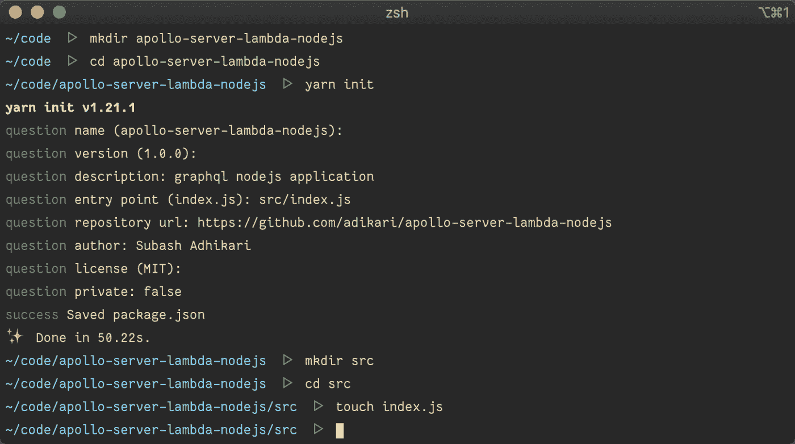

Initialize node project

用下面的代码填充索引文件。

```
exports.handler = async () => {  
    return { 
        body: 'Hello from Lambda' 
    };
};
```

上面的代码是一个非常简单的 Lambda 处理程序，它在被调用时将返回`Hello from Lambda`。让我们首先将代码部署到 AWS Lambda。

# 打包应用程序代码

在将代码部署到 Lambda 之前，我们需要创建一个应用程序的 zip 文件，并将其上传到一个 S3 存储桶。我们使用 AWS CLI 来创建这个存储桶。如果您尚未设置 AWS CLI，请按照本指南中的[进行设置。](https://docs.aws.amazon.com/cli/latest/userguide/install-cliv2.html)

创建一个 S3 桶，用于将我们的代码部署到 Lambda。为你的 S3 桶选择一个独特的名字。在所有 AWS 区域中，存储桶名称都是唯一的。

```
aws s3 mb s3://lambda-deploy-asln
```

使用 zip 命令创建应用程序的归档文件，并验证 zip 中的文件。

```
zip -rq dist-latest.zip src package.json 
zipinfo dist-latest.zip
```

使用 AWS CLI 命令将 zip 文件复制到 S3。

```
aws s3 cp dist-latest.zip s3://lambda-deploy-asln/dist-latest.zip
```

最后，使用以下命令验证该文件是否存在于 S3。

```
aws s3 ls s3://lambda-deploy-asln
```

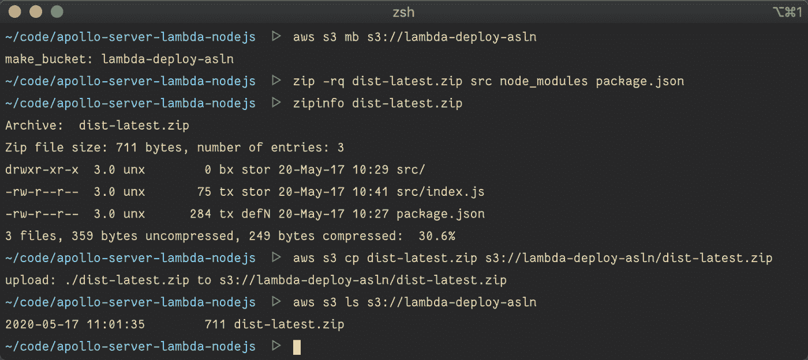

Copy application package to S3

既然我们已经将打包的应用程序部署到 S3，接下来我们需要在 AWS 中设置 Lambda 和 API 网关。在下一节中，我们将使用 CloudFormation 来设置所有必要的 AWS 资源。

# 使用 API 网关代理集成设置 AWS lambda

CloudFormation 是一个 AWS 服务，帮助我们将基础设施写成代码。CloudFormation 使得创建和管理我们的应用程序资源变得非常简单。让我们使用 CloudFormation 来定义我们的堆栈。

在项目的根目录下创建一个名为`cloudformation.yml`的文件。

```
touch cloudformation.yml
```

将以下代码添加到`cloudformation.yml`

```
---
Description: GraphQL server on AWS lambda

Parameters:
  Version:
    Description: Application version number
    Type: String

  BucketName:
    Description: S3 bucket name where the source code lives
    Type: String

Resources:
  LambdaFunction:
    Type: AWS::Lambda::Function
    Properties:
      Code:
        S3Bucket: !Ref BucketName
        S3Key: !Sub dist-${Version}.zip
      Handler: src/index.handler
      Description: GraphQL Apollo Server
      Role: !GetAtt LambdaExecutionRole.Arn
      Runtime: nodejs10.x
      Timeout: 10

  LambdaExecutionRole:
    Type: "AWS::IAM::Role"
    Properties:
      AssumeRolePolicyDocument:
        Version: "2012-10-17"
        Statement:
          - Effect: "Allow"
            Principal:
              Service:
                - "lambda.amazonaws.com"
            Action:
              - "sts:AssumeRole"
      Policies:
        - PolicyName: "LambdaFunctionPolicy"
          PolicyDocument:
            Version: '2012-10-17'
            Statement:
            - Effect: Allow
              Action:
              - logs:CreateLogGroup
              - logs:CreateLogStream
              - logs:PutLogEvents
              Resource: "*"

  GraphQLApi:
    Type: 'AWS::ApiGateway::RestApi'
    Properties:
      Name: apollo-graphql-api

  GraphQLApiResource:
    Type: 'AWS::ApiGateway::Resource'
    Properties:
      ParentId: !GetAtt GraphQLApi.RootResourceId
      RestApiId: !Ref GraphQLApi
      PathPart: 'graphql'

  GraphQLApiMethod:
    Type: 'AWS::ApiGateway::Method'
    Properties:
      RestApiId: !Ref GraphQLApi
      ResourceId: !Ref GraphQLApiResource
      AuthorizationType: None
      HttpMethod: POST
      Integration:
        Type: AWS_PROXY
        IntegrationHttpMethod: POST
        Uri: !Sub arn:aws:apigateway:${AWS::Region}:lambda:path/2015-03-31/functions/${LambdaFunction.Arn}/invocations

  GraphQLApiDeployment:
    Type: 'AWS::ApiGateway::Deployment'
    Properties:
      RestApiId: !Ref GraphQLApi
      StageName: v1
    DependsOn:
      - GraphQLApiResource
      - GraphQLApiMethod

  GraphQLApiPermission:
    Type: 'AWS::Lambda::Permission'
    Properties:
      Action: lambda:invokeFunction
      FunctionName: !GetAtt LambdaFunction.Arn
      Principal: apigateway.amazonaws.com
      SourceArn: !Sub arn:aws:execute-api:${AWS::Region}:${AWS::AccountId}:${GraphQLApi}/*

Outputs:
  ApiUrl:
    Description: Invoke url of API Gateway endpoint
    Value: !Sub https://${GraphQLApi}.execute-api.${AWS::Region}.amazonaws.com/v1/graphql
```

我知道这个模板发生了很多变化。让我们一步一步地检查代码。

## 模板参数

首先，我们定义一些在模板中使用的参数。在部署 CloudFormation 堆栈时，我们可以将这些变量作为参数覆盖进行传递。

```
Description: GraphQL server on AWS lambda

Parameters:
  Version:
    Description: Application version number
    Type: String

  BucketName:
    Description: S3 bucket name where the source code lives
    Type: String
```

## λ函数

我们定义我们的 lambda 函数，指定它应该从哪里提取应用程序代码的路径。这个桶与我们之前创建的桶相同。

```
LambdaFunction:
    Type: AWS::Lambda::Function
    Properties:
      Code:
        S3Bucket: !Ref BucketName
        S3Key: !Sub dist-${Version}.zip
      Handler: src/index.handler
      Description: GraphQL Apollo Server
      Role: !GetAtt LambdaExecutionRole.Arn
      Runtime: nodejs10.x
      Timeout: 10
```

我们希望我们的 Lambda 函数能够向 AWS CloudWatch 发送应用程序日志。Lambda 需要特殊权限才能将日志写入 CloudWatch。因此，我们创建了一个角色，允许写入 CloudWatch，并将其分配给 Lambda 函数。

```
LambdaExecutionRole:
    Type: "AWS::IAM::Role"
    Properties:
      AssumeRolePolicyDocument:
        Version: "2012-10-17"
        Statement:
          - Effect: "Allow"
            Principal:
              Service:
                - "lambda.amazonaws.com"
            Action:
              - "sts:AssumeRole"
      Policies:
        - PolicyName: "LambdaFunctionPolicy"
          PolicyDocument:
            Version: '2012-10-17'
            Statement:
            - Effect: Allow
              Action:
              - logs:CreateLogGroup
              - logs:CreateLogStream
              - logs:PutLogEvents
              Resource: "*"
```

## API 网关

我们还需要一个 HTTP 端点来调用 lambda 函数。API 网关可用于创建 HTTP 端点。然后，我们可以配置 API Gateway 来代理所有从客户端传入 Lambda 函数的请求，并将 Lambda 的响应发送回客户端。

首先，我们创建一个 API 网关 RestApi。

```
GraphQLApi:
    Type: 'AWS::ApiGateway::RestApi'
    Properties:
      Name: apollo-graphql-api
```

然后，我们创建一个 API 网关资源，它在`/graphql`接受请求。

```
GraphQLApiResource:
    Type: 'AWS::ApiGateway::Resource'
    Properties:
      ParentId: !GetAtt GraphQLApi.RootResourceId
      RestApiId: !Ref GraphQLApi
      PathPart: 'graphql'
```

接下来，我们通过创建 API 网关方法来配置资源以接受 POST 请求，然后我们将它与 Lambda 集成。

```
GraphQLApiMethod:
    Type: 'AWS::ApiGateway::Method'
    Properties:
      RestApiId: !Ref GraphQLApi
      ResourceId: !Ref GraphQLApiResource
      AuthorizationType: None
      HttpMethod: POST
      Integration:
        Type: AWS_PROXY
        IntegrationHttpMethod: POST
        Uri: !Sub arn:aws:apigateway:${AWS::Region}:lambda:path/2015-03-31/functions/${LambdaFunction.Arn}/invocations
```

最后，我们创建一个 API 网关部署，它将 API 部署到指定的阶段。

```
GraphQLApiDeployment:
    Type: 'AWS::ApiGateway::Deployment'
    Properties:
      RestApiId: !Ref GraphQLApi
      StageName: v1
    DependsOn:
      - GraphQLApiResource
      - GraphQLApiMethod
```

## Lambda / API 网关权限

至此，我们已经正确配置了 Lambda 函数和 API 网关。然而，API Gateway 需要特殊的权限来调用 Lambda 函数。我们允许 API Gateway 通过创建一个 Lambda 权限资源来调用 Lambda。

```
GraphQLApiPermission:
    Type: 'AWS::Lambda::Permission'
    Properties:
      Action: lambda:invokeFunction
      FunctionName: !GetAtt LambdaFunction.Arn
      Principal: apigateway.amazonaws.com
      SourceArn: !Sub arn:aws:execute-api:${AWS::Region}:${AWS::AccountId}:${GraphQLApi}/*
```

最后，我们在模板的末尾导出 API URL。我们可以使用这个 URL 来调用 Lambda。

```
Outputs:
  ApiUrl:
    Description: Invoke url of API Gateway endpoint
    Value: !Sub https://${GraphQLApi}.execute-api.${AWS::Region}.amazonaws.com/v1/graphql
```

# 将 CloudFormation 堆栈部署到 AWS

现在我们已经准备好了 CloudFormation 模板，让我们使用 AWS CLI 命令将其部署到 AWS。

在控制台中运行以下命令。确保将 BucketName 更新为您之前创建的 bucket 的名称。

```
aws cloudformation deploy \
  --template-file ./cloudformation.yml \
  --stack-name apollo-server-lambda-nodejs \
  --parameter-overrides BucketName=lambda-deploy-asln Version=latest \
  --capabilities CAPABILITY_IAM
```

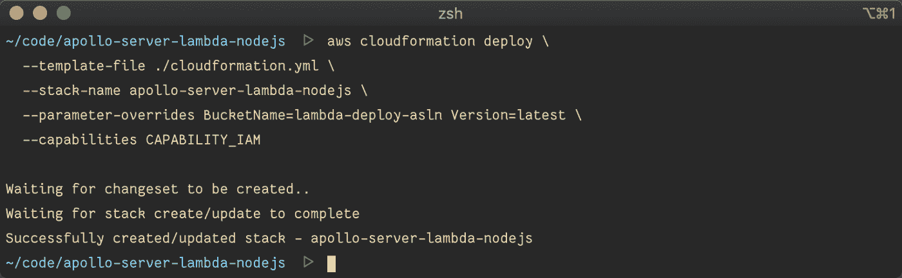

Deploy CloudFormation stack to AWS

部署堆栈可能需要一些时间。Lambda 函数应该准备好在部署完成时开始接受请求。

# 验证 API 网关和 Lambda 是否按预期工作

现在我们已经部署了我们的 CloudFormation 堆栈，让我们验证是否一切都按预期工作。我们需要 API 网关 URL 向我们的 Lambda 函数发送请求。我们在 CloudFormation 模板中导出的 API URL 在这里派上了用场。

运行以下命令，在命令行中打印 API URL。

```
aws cloudformation describe-stacks \
--stack-name=apollo-server-lambda-nodejs \
--query "Stacks[0].Outputs[?OutputKey=='ApiUrl'].OutputValue" \
--output text 
```

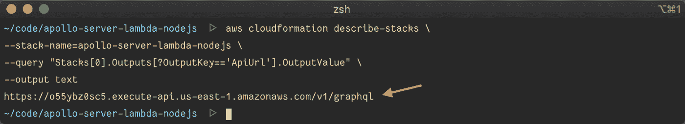

Describe CloudFormation Stack

现在，使用`curl`命令调用 API URL。你应该从服务器上得到“你好，来自 Lambda”的消息。

```
curl -d '{}' https://o55ybz0sc5.execute-api.us-east-1.amazonaws.com/v1/graphql
```

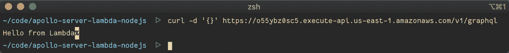

Invoke AWS Lambda

# 添加部署脚本以简化部署

您可能已经注意到，我们运行了一大堆命令来打包和部署我们的应用程序。每次我们部署应用程序时都必须运行这些命令，这将是非常乏味的。让我们添加一个 bash 脚本来简化这个工作流。

在应用程序的根目录创建一个名为`bin`的目录，并添加一个名为`deploy`的文件。

```
mkdir bin 
touch bin/deploy
```

在执行脚本之前，我们需要设置正确的文件权限。让我们通过运行以下命令来实现这一点。

```
chmod +x bin/deploy
```


Create deploy script

此时，我们的目录结构应该如下面的截图所示。

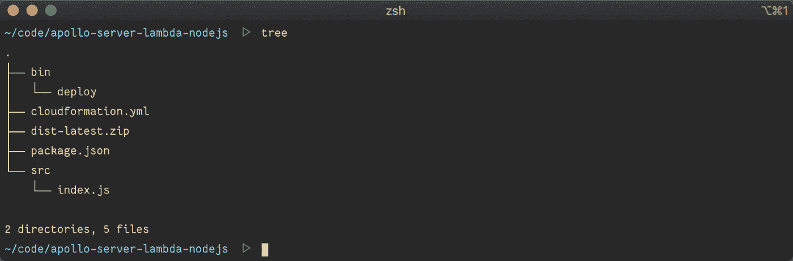

Current directory structure

将以下代码添加到文件中。

```
#!/bin/bash

set -euo pipefail

OUTPUT_DIR=dist
CURRENT_DIR=$(pwd)
ROOT_DIR="$( dirname "${BASH_SOURCE[0]}" )"/..
APP_VERSION=$(date +%s)
STACK_NAME=apollo-server-lambda-nodejs

cd $ROOT_DIR

echo "cleaning up old build.."
[ -d $OUTPUT_DIR ] && rm -rf $OUTPUT_DIR

mkdir dist

echo "zipping source code.."
zip -rq $OUTPUT_DIR/dist-$APP_VERSION.zip src node_modules package.json

echo "uploading source code to s3.."
aws s3 cp $OUTPUT_DIR/dist-$APP_VERSION.zip s3://$S3_BUCKET/dist-$APP_VERSION.zip

echo "deploying application.."
aws cloudformation deploy \
  --template-file $ROOT_DIR/cloudformation.yml \
  --stack-name $STACK_NAME \
  --parameter-overrides Version=$APP_VERSION BucketName=$S3_BUCKET \
  --capabilities CAPABILITY_IAM

# Get the api url from output of cloudformation stack
API_URL=$(
  aws cloudformation describe-stacks \
  --stack-name=$STACK_NAME \
  --query "Stacks[0].Outputs[?OutputKey=='ApiUrl'].OutputValue" \
  --output text
)

echo -e "\n$API_URL"

cd $CURRENT_DIR
```

好了，我们来分解一下这个脚本是怎么回事。

我们从定义一些变量开始。我们在`dist`目录中生成归档文件。我们将应用程序版本设置为脚本运行的当前时间戳。使用时间戳，我们可以确保版本号总是唯一的和递增的。

```
#!/bin/bash

set -euo pipefail

OUTPUT_DIR=dist
CURRENT_DIR=$(pwd)
ROOT_DIR="$( dirname "${BASH_SOURCE[0]}" )"/..
APP_VERSION=$(date +%s)
STACK_NAME=apollo-server-lambda-nodejs
```

然后我们清理所有旧的构建并创建一个新的`dist`目录。

```
echo "cleaning up old build.."
[ -d $OUTPUT_DIR ] && rm -rf $OUTPUT_DIR

mkdir dist
```

然后，我们运行 zip 命令来归档源代码及其依赖项。

```
echo "zipping source code.."
zip -rq $OUTPUT_DIR/dist-$APP_VERSION.zip src node_modules package.json
```

接下来，我们将 zip 文件复制到 S3 存储桶。

```
echo "uploading source code to s3.."
aws s3 cp $OUTPUT_DIR/dist-$APP_VERSION.zip s3://$S3_BUCKET/dist-$APP_VERSION.zip
```

然后我们部署 CloudFormation 堆栈。

```
echo "deploying application.."
aws cloudformation deploy \
  --template-file $ROOT_DIR/cloudformation.yml \
  --stack-name $STACK_NAME \
  --parameter-overrides Version=$APP_VERSION BucketName=$S3_BUCKET \
  --capabilities CAPABILITY_IAM
```

最后，我们查询 CloudFormation 堆栈，从 CloudFormation 输出中获取 API URL，并在控制台中打印出来。

```
# Get the api url from output of cloudformation stack
API_URL=$(
  aws cloudformation describe-stacks \
  --stack-name=$STACK_NAME \
  --query "Stacks[0].Outputs[?OutputKey=='ApiUrl'].OutputValue" \
  --output text
)

echo -e "\n$API_URL"
```

# 使用部署脚本部署到 AWS

让我们使用部署脚本来尝试部署。该脚本期望环境中存在 S3_Bucket 变量。运行以下命令来运行部署。当部署成功时，脚本将输出 API URL，我们可以用它来调用 lambda。

```
S3_BUCKET=lambda-deploy-asln ./bin/deploy
```

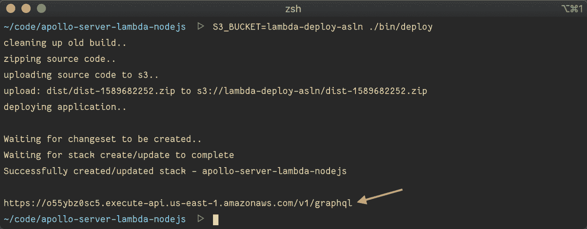

Run the deploy script

为了进一步简化，让我们使用 yarn 来调用它。在您的`package.json`中添加以下内容。

```
"scripts": {
  "deploy": "S3_BUCKET=lambda-deploy-asln ./bin/deploy"
}
```

此后，我们可以简单地运行`yarn deploy`来启动部署。

# 利用本地 Lambda 和 API 网关改进工作流程

在开发应用程序时，我们经常修改应用程序代码。现在，部署到 AWS us-east-1 区域大约需要 10 秒钟。我用的是 40Mb/s 上传速度的互联网连接。

随着应用程序规模的增长，部署时间变得更加重要。不得不等待 10 秒或更长时间才意识到我犯了一个语法错误，这一点效率都没有。

让我们通过在本地设置 lambda 函数并使用本地 API 端点调用它来解决这个问题。AWS SAM CLI 使我们能够做到这一点。按照本页上[的说明进行安装。](https://docs.aws.amazon.com/serverless-application-model/latest/developerguide/serverless-sam-cli-install.html)

完成后，从项目的根目录运行以下命令。

```
sam local start-api --template-file cloudformation.yml
```

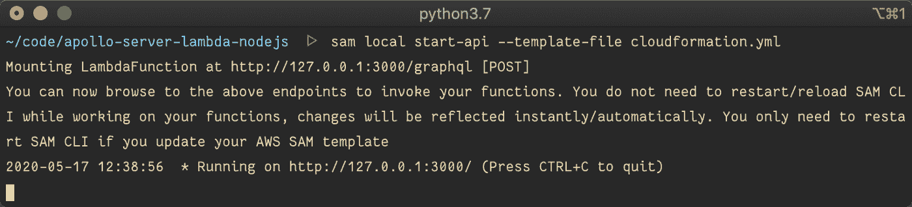

Start local development server

本地端点现在可以在 http://localhost:3000 上找到。我们可以使用这个端点向本地 Lambda 发送请求。

打开另一个终端，运行以下命令发送请求。您应该会看到本地 Lambda 函数的响应。

```
curl -d '{}' http://localhost:3000/graphql
```

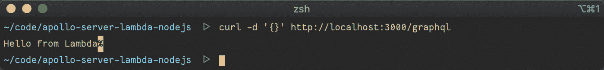

Invoke local lambda function

最后，在`package.json`的`scripts`部分添加以下几行。

```
"dev": "sam local start-api --template-file cloudformation.yml"
```

此后，我们可以运行`yarn dev`命令来启动开发服务器。

# 在 Lambda 中设置 GraphQL 服务器

不再多说，让我们直接进入代码并构建 GraphQL 服务器。

从安装依赖项开始。我们使用 [Apollo 服务器](https://www.apollographql.com/docs/apollo-server/)来构建我们的 GraphQL 服务器。Apollo Server 是 GraphQL Server 的开源实现。

```
yarn add apollo-server-lambda graphql
```

用下面的代码替换`src/index.js`的内容。

```
const { ApolloServer, gql } = require('apollo-server-lambda');

const typeDefs = gql`
  type Query {
    user: User
  }

  type User {
    id: ID
    name: String
  }
`;

const resolvers = {
  Query: {
    user: () => ({ id: 123, name: 'John Doe' })
  }
};

const server = new ApolloServer({ typeDefs, resolvers });

exports.handler = server.createHandler();
```

这里，我们定义了一个模式，它由一个用户类型和一个用户查询组成。然后，我们为用户查询定义一个解析器。为了简单起见，解析器返回一个硬编码的用户。最后，我们创建一个 GraphQL 处理程序并导出它。

为了对我们的 GraphQL 服务器执行查询，我们需要一个 GraphQL 客户机。失眠是我最喜欢的客户。然而，任何其他 GraphQL 客户端应该都可以。

现在，让我们运行一个查询来确保我们的服务器按预期工作。

在失眠症中创建一个新的 GraphQL 请求。

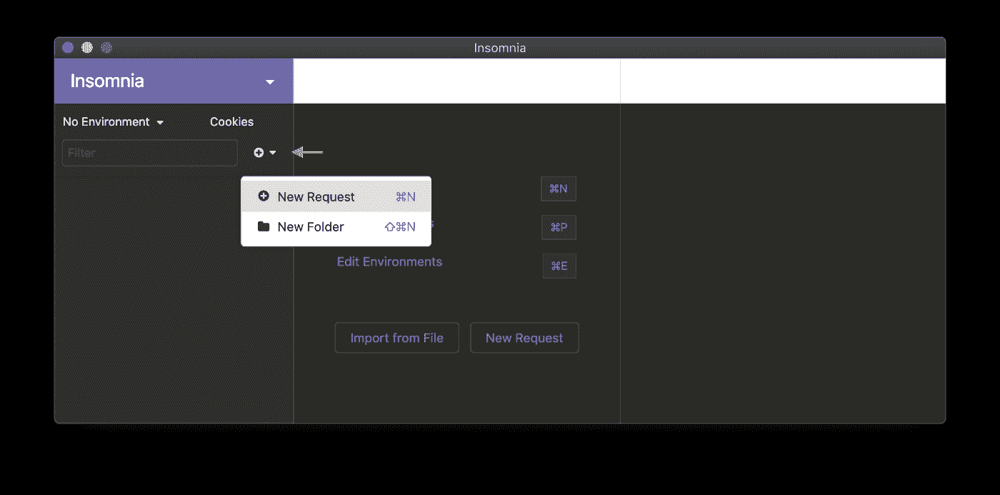

Create new GraphQL request

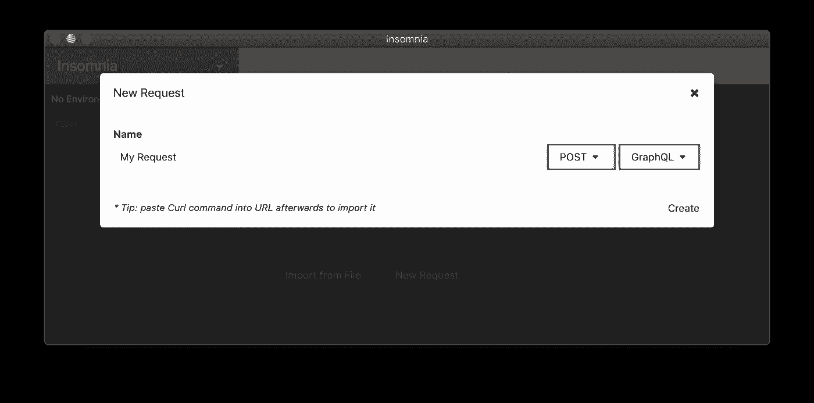

Configure GraphQL request

在正文中添加以下查询，并将该查询提交给`http://localhost:3000`。假设您的 dev 服务器仍在运行，您应该会看到来自 GraphQL 服务器的以下响应。

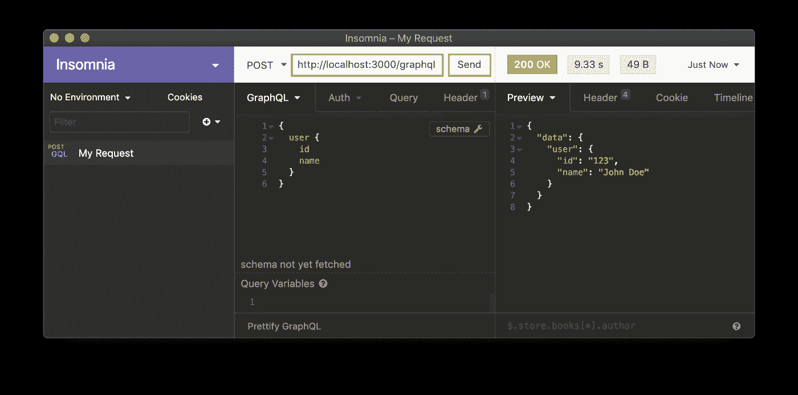

Perform GraphQL request to Local Server

既然我们已经验证了本地服务器一切正常，那么让我们运行以下命令将 GraphQL 服务器部署到 AWS。

```
yarn deploy
```

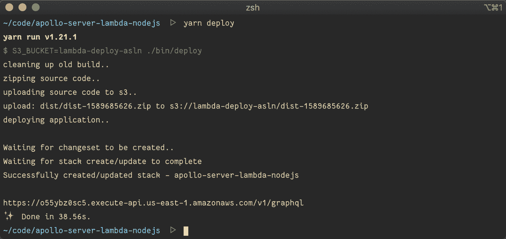

Deploy server to AWS

一旦部署完成，就会在控制台中输出 API URL。将失眠症中的 URL 替换为 API Gateway 中的 URL。重新运行该查询以查看其解决情况。

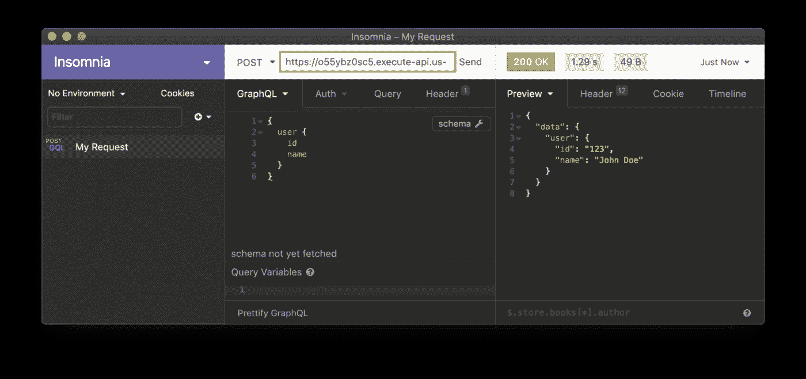

Perform GraphQL request to AWS Lambda

# 摘要

恭喜你，你已经完全使用 CloudFormation 在 AWS Lambda 中成功部署了一个 GraphQL 服务器。服务器可以接收来自客户端的 GraphQL 请求，并相应地返回响应。

我们还为本地开发设置了开发环境，而没有添加许多依赖项。

如果你喜欢这个教程，请分享给你的网络。