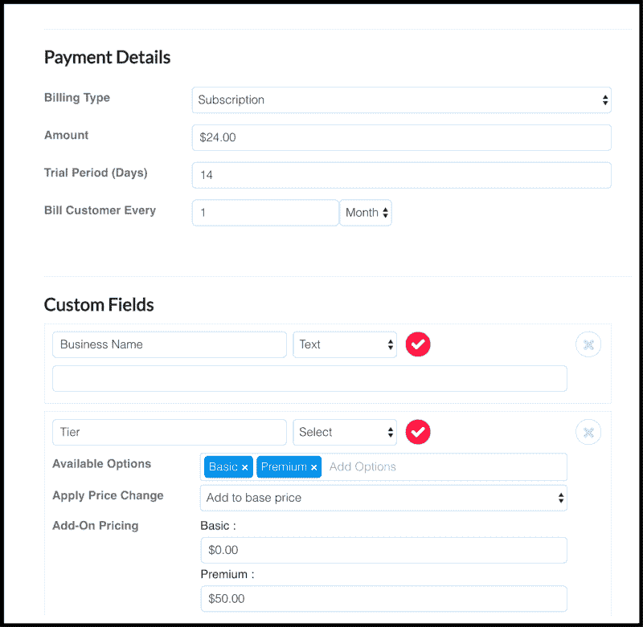

# 如何构建和扩展您的 SaaS 计费解决方案

> 原文：<https://www.freecodecamp.org/news/how-to-build-and-scale-your-saas-billing-solution-d6111b9ae253/>

### 你需要一个最简单可行的产品

当你在构建软件即服务(Saas)的最小可行产品(MVP)时，有很多工作需要完成。很难平衡这种工作量。

你常常太专注于开发产品，以至于忘记了你仍然需要把它卖给人们。本指南旨在帮助您让您的计费系统开始盈利，并展示当您准备扩大规模时应该做些什么。

Like the functionality of your product, your billing system should scale as you grow

#### 捐款

订阅是有效计费策略的关键。对您和客户来说，重复使用信用卡进行收费的能力可以提高支付效率。

要开始向客户销售套餐，您需要:

*   用户可以填写以输入信用卡的表单
*   支付成功后可以调用的后端流程

如果您没有这样做的开发周期，您将陷入手动发送发票、手动授予客户访问权限以及增加入职流程摩擦的痛苦过程中。

#### 免费试用

> 对于许多 SaaS 公司来说，他们 100%的客户都是通过免费试用系统进来的。— [林肯·墨菲](https://sixteenventures.com/saas-free-trial-benchmarks)

提供免费试用被许多人认为是找到 SaaS 早期用户的最佳方式之一。

当有人在承诺订阅之前有机会试用你的产品时，他们更有可能成为你的常客。

像对待付费用户一样对待试用用户是一种很好的做法。他们不仅体验了你的产品，还体验了你的服务质量。

#### 与什么整合

在一天结束时，您将最终与一个外部系统集成来处理这些用例。我强烈推荐看一下 [**Stripe**](https://stripe.com) ，因为他们有一个很好的 API 可以集成，而且功能广泛。

如果您不想自己开发与 Stripe 的集成，请查看一下 **[Servicebot](https://servicebot.io)** —它与 Stripe 完全集成，并具有强大的客户关系管理(CRM)功能，因此您可以从仪表板更好地管理您的客户和订阅。

Designing a service in [https://servicebot.io](https://servicebot.io)

### 自动化是扩展的关键

在你的早期阶段， [Y Combinator](http://www.ycombinator.com/) 的创始人保罗·格拉厄姆说，“[做不具规模的事情。](http://paulgraham.com/ds.html)“虽然这听起来可能有悖常理，但这是在您开始考虑扩展之前扩大客户群的最佳方式。

扩展归结起来就是自动化你已经发现在成长过程中有效的手动过程。

当您准备扩展您的计费解决方案时，需要考虑以下几点:

#### 计费流程自动化

自动化与计费相关的流程(例如当用户请求试用、添加资金来源或请求取消时发生的情况)是扩展您的计费解决方案的最重要部分之一。

你应该首先看看你目前是如何做你的帐单的。找出当前系统中的所有手动过程，比如在试用过期时限制访问，或者在帐户被取消后重新激活帐户。一旦你列出了清单，你就可以开始计算执行这些花费了多少时间，并开始迭代以减少最痛苦的部分。

流程自动化的另一个重要部分是根据客户在计费系统中的状态自动拓展客户。

#### 自动客户拓展

客户拓展是将客户从免费试用转为付费试用的关键。刚开始时，这个过程大部分是手动的。当人们注册时，给他们发邮件，提醒他们试用期即将结束，或者询问他们是否需要帮助。

这是不可扩展的——您最终需要自动化这一过程，而最好的关注点是计费端，因为很多步骤都是在那里处理的

*   **入职** —当新用户注册时，您的系统会自动发送一封电子邮件，解释如何开始。
    更先进的系统会跟踪客户的旅程，并为他们尚未完成的事情发送特定的帮助文章。
*   **试用转换** —当创建试用时，有一些东西应该发送给用户以说服他们转换。像“还剩 3 天”提醒或要求一对一通话的信息真的会有所不同。
    自动化这些消息对于确保可伸缩性非常重要。
*   **导联恢复** —当试验结束或用户取消时，一切并未丧失。在他们离开后的特定时间内发送电子邮件，解释新的功能，询问他们对你可以做得更好的反馈，关于你产品的文章可能足以让他们回来给你另一个机会。

为了确保您的系统和客户之间的无缝通信，您的系统与您的计费紧密集成非常重要。

### 与其他系统集成

用最少的开发工作实现业务自动化的最佳方式之一是与已经解决了您面临的问题的第三方进行集成。

以下是我在自己的 SaaS 创业公司中使用的最爱:

#### 条纹-支付处理

Stripe 已经成为 SaaS 支付提供商的主打产品。有了开发人员友好的 API 和不断的新特性，我(和无数其他人)觉得这是一个明显的集成点。

您可以与集成的一些功能来自动化您的更多帐单:

*   Webhooks 提醒你的系统支付失败
*   没有信用卡免费试用
*   向现有订阅添加费用

你可以用 Stripe 做更多的事情，应该由你和你的创业公司的需求来决定你需要多深的集成。

#### 内部通信—通信自动化

[对讲机](https://www.intercom.com/)的主要功能是实时聊天部件，您可以将它嵌入到您的网站中，以便与您的客户进行交流。很多人没有意识到的是，对讲也提供了一个自动化平台。如果您与 Intercom 集成，您可以根据客户对您的产品所做的事情向他们发送定制的消息。

这使您能够自动与客户沟通，因此您不必再手动发送电子邮件。

Example of intercom outreach automation

#### Servicebot —订阅管理

[Servicebot](https://servicebot.io/#1) 开箱即用，集成了条带和对讲机。当客户请求免费试用时，Servicebot 在 Stripe 中创建新的试用订阅和客户，在 Intercom 中创建新用户，并将他们定向到新创建的实例以供使用。

Intercom 将自动发送消息，目标是转换为付费用户，而 Stripe 将自动管理订阅。

开始扩展的第一步是自动化您的计费流程。当这一切汇集在一起时，您可以将业务的各个部分连接到一个集中的位置，并与第三方进行集成。所有这一切的结果将是生产力和效率的巨大提高，使努力非常值得。

如果您对自动化 SaaS 计费解决方案的某些部分感兴趣，比如自动化客户入职和将业务流程连接到您的计费系统。