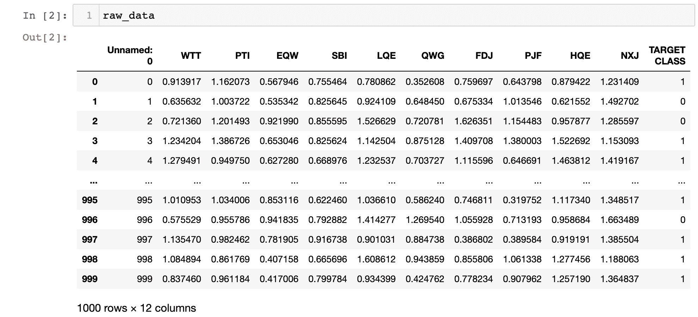
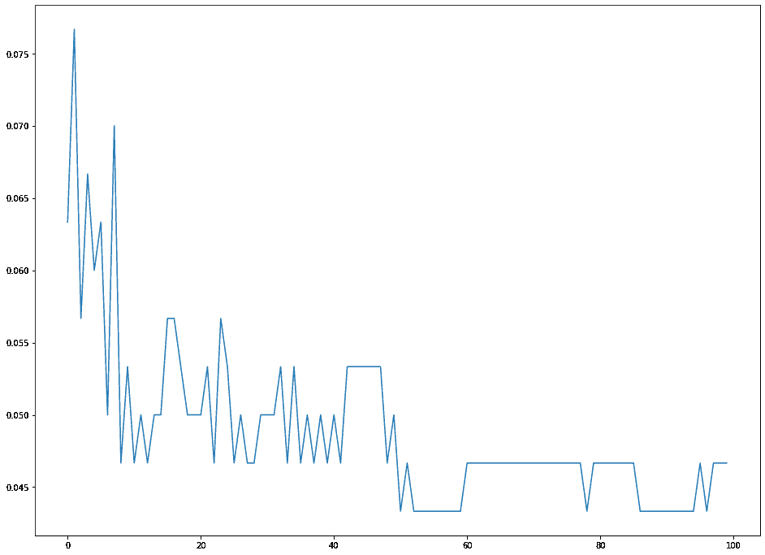
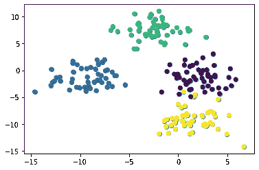
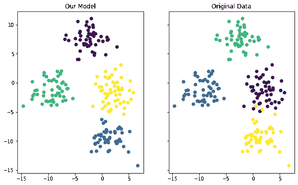

# 如何在 Python 中建立和训练 K-最近邻和 K-均值聚类 ML 模型

> 原文：<https://www.freecodecamp.org/news/how-to-build-and-train-k-nearest-neighbors-ml-models-in-python/>

机器学习最受欢迎的应用之一是解决分类问题。

分类问题是这样的情况:您有一个数据集，并且您想要将该数据集中的观察结果分类到一个特定的类别中。

一个著名的例子是电子邮件提供商的垃圾邮件过滤器。Gmail 使用受监督的机器学习技术，根据邮件的内容、主题和其他特征，自动将邮件放入垃圾邮件文件夹。

当涉及分类问题时，两个机器学习模型执行许多繁重的工作:

*   k-最近邻
*   k 均值聚类

本教程将教你如何用 Python 编写 K-最近邻和 K-均值聚类算法。

# k 近邻模型

[K-最近邻算法](https://nickmccullum.com/python-machine-learning/k-nearest-neighbors-python/)是世界上最流行的解决分类问题的机器学习模型之一。

探索机器学习的学生的一个常见练习是将 K 最近邻算法应用于类别未知的数据集。一个现实生活中的例子是，如果你需要使用机器学习对政府机密信息数据集进行预测。

在本教程中，您将学习用 Python 编写您的第一个 K 近邻机器学习算法。我们将使用类似于上述情况的匿名数据集。

## **您将在本教程中需要的数据集**

您需要做的第一件事是下载我们将在本教程中使用的数据集。我已经将文件上传到我的网站。你可以点击[这里](https://nickmccullum.com/files/k-nearest-neighbors/classified_data.csv)进入。

现在您已经下载了数据集，您会想要将文件移动到您将要工作的目录中。之后打开一个 [Jupyter 笔记本](https://nickmccullum.com/python-course/jupyter-notebook-basics/)我们就可以开始写 Python 代码了！

## **本教程中需要的库**

为了编写 K 最近邻算法，我们将利用许多开源 Python 库，包括 [NumPy](https://nickmccullum.com/advanced-python/numpy/) 、 [pandas](https://nickmccullum.com/advanced-python/pandas-dataframes/) 和 [scikit-learn](https://nickmccullum.com/python-machine-learning/introduction-scikit-learn/) 。

通过编写以下导入语句开始您的 Python 脚本:

```
 import numpy as np

import pandas as pd

import matplotlib.pyplot as plt

import seaborn as sns

%matplotlib inline 
```

## **将数据集导入我们的 Python 脚本**

我们的下一步是将`classified_data.csv`文件导入到 Python 脚本中。熊猫图书馆使得将数据导入熊猫数据框架变得很容易。

由于数据集存储在一个`csv`文件中，我们将使用`read_csv`方法来完成这项工作:

```
 raw_data = pd.read_csv('classified_data.csv') 
```

将这个数据框打印到 Jupyter 笔记本中，会让你对数据的样子有所了解:



您会注意到数据帧以一个未命名的列开始，该列的值等于数据帧的索引。我们可以通过稍微调整将数据集导入 Python 脚本的命令来解决这个问题:

```
 raw_data = pd.read_csv('classified_data.csv', index_col = 0) 
```

接下来，让我们看看这个数据集中包含的实际功能。您可以使用以下语句打印数据集的列名列表:

```
 print(raw_data.columns) 
```

这将返回:

```
 Index(['WTT', 'PTI', 'EQW', 'SBI', 'LQE', 'QWG', 'FDJ', 'PJF', 'HQE', 'NXJ',

       'TARGET CLASS'],

      dtype='object') 
```

由于这是一个分类数据集，我们不知道这些列是什么意思。现在，认识到每一列本质上都是数字，因此非常适合用机器学习技术建模就足够了。

## **标准化数据集**

由于 K 最近邻算法通过使用与数据点最接近的观测值来预测数据点，因此数据集中要素的比例非常重要。

正因为如此，机器学习实践者通常会对数据集进行`standardize`，这意味着调整每个`x`值，使它们大致处于相同的规模。

幸运的是，`scikit-learn`包含了一些优秀的功能，可以轻松地做到这一点。

首先，我们需要从`scikit-learn`导入`StandardScaler`类。为此，请将以下命令添加到 Python 脚本中:

```
 from sklearn.preprocessing import StandardScaler 
```

这个函数的行为很像我们在本课程前面使用的`LinearRegression`和`LogisticRegression`类。我们需要创建这个类的一个实例，然后将这个类的实例放到我们的数据集上。

首先，让我们用下面的语句创建一个名为`scaler`的`StandardScaler`类的实例:

```
 scaler = StandardScaler() 
```

我们现在可以使用`fit`方法在数据集上训练这个实例:

```
 scaler.fit(raw_data.drop('TARGET CLASS', axis=1)) 
```

现在，我们可以使用`transform`方法来标准化数据集中的所有要素，使它们的比例大致相同。我们将这些缩放后的特征分配给名为`scaled_features`的变量:

```
 scaled_features = scaler.transform(raw_data.drop('TARGET CLASS', axis=1)) 
```

这实际上为数据集中的所有特征创建了一个 [NumPy 数组](https://nickmccullum.com/advanced-python/numpy-arrays/)，我们希望它改为一个[熊猫数据帧](https://nickmccullum.com/advanced-python/pandas-dataframes/)。

幸运的是，这很容易解决。我们将简单地将`scaled_features`变量包装在一个`pd.DataFrame`方法中，并将这个数据帧分配给一个名为`scaled_data`的新变量，并使用适当的参数来指定列名:

```
 scaled_data = pd.DataFrame(scaled_features, columns = raw_data.drop('TARGET CLASS', axis=1).columns) 
```

既然我们已经导入了数据集并标准化了它的特性，我们就可以将数据集分成训练数据和测试数据了。

## **将数据集分成训练数据和测试数据**

我们将使用来自`scikit-learn`的`train_test_split`函数，结合列表解包，从我们的分类数据集中创建训练数据和测试数据。

首先，您需要用下面的语句从`scikit-learn`的`model_validation`模块导入`train_test_split`:

```
 from sklearn.model_selection import train_test_split 
```

接下来，我们需要指定将被传递到这个`train_test_split`函数中的`x`和`y`值。

`x`值将是我们之前创建的`scaled_data`数据帧。`y`值将是我们原始`raw_data`数据帧的`TARGET CLASS`列。

您可以使用以下语句创建这些变量:

```
 x = scaled_data

y = raw_data['TARGET CLASS'] 
```

接下来，您需要使用这两个参数和一个合理的`test_size`来运行`train_test_split`函数。我们将使用 30%的`test_size`,这将为该函数提供以下参数:

```
 x_training_data, x_test_data, y_training_data, y_test_data = train_test_split(x, y, test_size = 0.3) 
```

既然我们的数据集已经被分成了训练数据和测试数据，我们就可以开始训练我们的模型了！

## **训练一个 K 近邻模型**

让我们从从`scikit-learn`导入`KNeighborsClassifier`开始:

```
 from sklearn.neighbors import KNeighborsClassifier 
```

接下来，让我们创建一个`KNeighborsClassifier`类的实例，并将其赋给一个名为`model`的变量

这个类需要一个名为`n_neighbors`的参数，它等于您正在构建的 K 最近邻算法的`K`值。首先，让我们指定`n_neighbors = 1`:

```
 model = KNeighborsClassifier(n_neighbors = 1) 
```

现在，我们可以使用`fit`方法和我们的`x_training_data`和`y_training_data`变量来训练我们的 K 最近邻模型:

```
 model.fit(x_training_data, y_training_data) 
```

现在让我们用新训练的 K 最近邻算法做一些预测吧！

## **使用我们的 K 近邻算法进行预测**

我们可以使用我们的 K 最近邻算法进行预测，就像我们在本课程前面使用[线性回归](https://nickmccullum.com/python-machine-learning/linear-regression-python/)和[逻辑回归](https://nickmccullum.com/python-machine-learning/logistic-regression-python/)模型一样:使用`predict`方法并传入我们的`x_test_data`变量。

更具体地说，下面是如何进行预测并将它们分配给一个名为`predictions`的变量:

```
 predictions = model.predict(x_test_data) 
```

让我们在本教程的下一部分探索一下`predictions`有多精确。

## **测量我们模型的准确性**

我们在我们的逻辑回归教程中看到，`scikit-learn`带有内置函数，可以轻松测量机器学习分类模型的性能。

现在让我们将其中的两个函数(`classification_report`和`confuson_matrix`)导入到我们的报告中:

```
 from sklearn.metrics import classification_report

from sklearn.metrics import confusion_matrix 
```

让我们从`classfication_report`开始，一个接一个地解决这些问题。您可以使用以下语句生成报告:

```
 print(classification_report(y_test_data, predictions)) 
```

这会产生:

```
 precision    recall  f1-score   support

           0       0.94      0.85      0.89       150

           1       0.86      0.95      0.90       150

    accuracy                           0.90       300

   macro avg       0.90      0.90      0.90       300

weighted avg       0.90      0.90      0.90       300 
```

类似地，您可以使用以下语句生成混淆矩阵:

```
 print(confusion_matrix(y_test_data, predictions)) 
```

这会产生:

```
 [[141  12]

 [ 18 129]] 
```

查看这些性能指标，看起来我们的模型已经相当有性能了。还是可以改进的。

在下一节中，我们将看到如何通过为`K`选择一个更好的值来提高 K 近邻模型的性能。

## **使用肘法选择最佳`K`值**

在本节中，我们将使用肘方法为 K 最近邻算法选择一个最佳值`K`。

肘方法包括迭代不同的 K 值，并选择应用于我们的测试数据时错误率最低的值。

首先，让我们创建一个名为`error_rates`的空[列表](https://nickmccullum.com/python-course/lists/)。我们将遍历不同的`K`值，并将它们的错误率添加到这个列表中。

```
 error_rates = [] 
```

接下来，我们需要创建一个 Python 循环，它遍历我们想要测试的`K`的不同值，并在每次迭代中执行以下功能:

*   从`scikit-learn`创建一个`KNeighborsClassifier`类的新实例
*   使用我们的训练数据训练新模型
*   根据我们的测试数据进行预测
*   计算每个错误预测的平均差异(该值越低，我们的模型越准确)

下面是对`1`和`100`之间的`K`值执行此操作的代码:

```
 for i in np.arange(1, 101):

    new_model = KNeighborsClassifier(n_neighbors = i)

    new_model.fit(x_training_data, y_training_data)

    new_predictions = new_model.predict(x_test_data)

    error_rates.append(np.mean(new_predictions != y_test_data)) 
```

让我们用一个快速的 matplotlib 可视化程序来看看不同的`K`值如何改变我们的错误率:

```
 plt.plot(error_rates) 
```



如您所见，我们的错误率趋向于最小化，其`K`值约为 50。这意味着`50`是`K`的合适选择，它平衡了简单性和预测能力。

## **本教程的完整代码**

你可以在 GitHub 库中查看本教程的完整代码。它也粘贴在下面供您参考:

```
 #Common imports

import numpy as np

import pandas as pd

import matplotlib.pyplot as plt

import seaborn as sns

%matplotlib inline

#Import the data set

raw_data = pd.read_csv('classified_data.csv', index_col = 0)

#Import standardization functions from scikit-learn

from sklearn.preprocessing import StandardScaler

#Standardize the data set

scaler = StandardScaler()

scaler.fit(raw_data.drop('TARGET CLASS', axis=1))

scaled_features = scaler.transform(raw_data.drop('TARGET CLASS', axis=1))

scaled_data = pd.DataFrame(scaled_features, columns = raw_data.drop('TARGET CLASS', axis=1).columns)

#Split the data set into training data and test data

from sklearn.model_selection import train_test_split

x = scaled_data

y = raw_data['TARGET CLASS']

x_training_data, x_test_data, y_training_data, y_test_data = train_test_split(x, y, test_size = 0.3)

#Train the model and make predictions

from sklearn.neighbors import KNeighborsClassifier

model = KNeighborsClassifier(n_neighbors = 1)

model.fit(x_training_data, y_training_data)

predictions = model.predict(x_test_data)

#Performance measurement

from sklearn.metrics import classification_report

from sklearn.metrics import confusion_matrix

print(classification_report(y_test_data, predictions))

print(confusion_matrix(y_test_data, predictions))

#Selecting an optimal K value

error_rates = []

for i in np.arange(1, 101):

    new_model = KNeighborsClassifier(n_neighbors = i)

    new_model.fit(x_training_data, y_training_data)

    new_predictions = new_model.predict(x_test_data)

    error_rates.append(np.mean(new_predictions != y_test_data))

plt.figure(figsize=(16,12))

plt.plot(error_rates) 
```

# k-均值聚类模型

[K-means 聚类算法](https://nickmccullum.com/python-machine-learning/k-means-clustering-python/)通常是学生将要学习的第一个无监督机器学习模型。

它允许机器学习实践者在一个数据集中创建具有相似定量特征的数据点组。这对于解决创建客户群或识别高犯罪率城市中的地点等问题非常有用。

在本节中，您将学习如何用 Python 构建您的第一个 K 均值聚类算法。

## **我们将在本教程中使用的数据集**

在本教程中，我们将使用由`scikit-learn`生成的数据集。

让我们导入`scikit-learn`的`make_blobs`函数来创建这个人工数据。打开一个 [Jupyter 笔记本](https://nickmccullum.com/python-course/jupyter-notebook-basics/)，用下面的语句开始你的 Python 脚本:

```
 from sklearn.datasets import make_blobs 
```

现在让我们使用`make_blobs`函数来创建一些人工数据！

更具体地说，这里是你如何用具有`2`特征和`4`聚类中心的`200`样本创建一个数据集。每个簇内的标准偏差将被设置为`1.8`。

```
 raw_data = make_blobs(n_samples = 200, n_features = 2, centers = 4, cluster_std = 1.8) 
```

如果打印这个`raw_data`对象，您会注意到它实际上是一个 [Python 元组](https://nickmccullum.com/python-course/tuples/)。这个元组的第一个元素是一个有 200 个观察值的 [NumPy 数组](https://nickmccullum.com/advanced-python/numpy-arrays/)。每个观察包含 2 个特征(就像我们用`make_blobs`函数指定的一样！).

既然已经创建了数据，我们可以继续将其他重要的开源库导入到我们的 Python 脚本中。

## **我们将在本教程中使用的导入**

本教程将使用许多流行的开源 Python 库，包括 [pandas](https://nickmccullum.com/advanced-python/pandas/) 、 [NumPy](https://nickmccullum.com/advanced-python/numpy/) 和 [matplotlib](https://nickmccullum.com/python-visualization/how-to-import-matplotlib/) 。让我们通过添加以下导入来继续我们的 Python 脚本:

```
 import pandas as pd

import numpy as np

import seaborn

import matplotlib.pyplot as plt

%matplotlib inline 
```

该代码块中的第一组导入用于操作大型数据集。第二组导入用于创建数据可视化。

接下来让我们继续可视化我们的数据集。

## **可视化我们的数据集**

在我们的`make_blobs`函数中，我们为数据集指定了 4 个聚类中心。验证这一点得到正确处理的最好方法是创建一些快速的数据可视化。

首先，让我们使用下面的命令来绘制数据集第一列中的所有行和数据集第二列中的所有行:


**注意:由于这是随机生成的数据，您的数据集将与我的数据集有所不同。**

这个图像似乎表明我们的数据集只有三个集群。这是因为其中两个星团彼此非常接近。

为了解决这个问题，我们需要引用我们的`raw_data`元组的第二个元素，这是一个 NumPy 数组，包含每个观察值所属的集群。

如果我们使用每个观察值的聚类对数据集进行着色，独特的聚类将很快变得清晰。下面是执行此操作的代码:

```
 plt.scatter(raw_data[0][:,0], raw_data[0][:,1], c=raw_data[1]) 
```



我们现在可以看到我们的数据集有四个独特的集群。让我们继续用 Python 构建 K 均值聚类模型！

## **建立和训练我们的 K 均值聚类模型**

构建 K 均值聚类算法的第一步是从`scikit-learn`导入它。为此，将以下命令添加到 Python 脚本中:

```
 from sklearn.cluster import KMeans 
```

接下来，让我们用参数`n_clusters=4`创建这个`KMeans`类的一个实例，并把它赋给变量`model`:

```
 model = KMeans(n_clusters=4) 
```

现在让我们通过调用模型上的`fit`方法并传入我们的`raw_data`元组的第一个元素来训练我们的模型:

```
 model.fit(raw_data[0]) 
```

在下一节中，我们将探索如何使用 K 均值聚类模型进行预测。

在继续之前，我想指出您可能已经注意到的构建 K 均值聚类算法(这是一种非监督机器学习算法)的过程与我们在本课程中迄今为止使用的监督机器学习算法之间的一个差异。

也就是说，我们不必将数据集分成训练数据和测试数据。这是一个重要的区别——事实上，在建立无监督的机器学习模型时，您永远不需要对数据集进行训练/测试分割！

## **使用我们的 K 均值聚类模型进行预测**

机器学习实践者通常使用 K 均值聚类算法来进行两种类型的预测:

*   每个数据点属于哪个聚类
*   每个集群的中心在哪里

既然我们的模型已经训练好了，就很容易生成这些预测。

首先，让我们预测每个数据点属于哪个聚类。为此，使用点运算符从我们的`model`对象中访问`labels_`属性，如下所示:

```
 model.labels_ 
```

这会生成一个 NumPy 数组，其中包含对每个数据点的预测，如下所示:

```
 array([3, 2, 7, 0, 5, 1, 7, 7, 6, 1, 2, 4, 6, 7, 6, 4, 4, 3, 3, 6, 0, 0,

       6, 4, 5, 6, 0, 2, 6, 5, 4, 3, 4, 2, 6, 6, 6, 5, 6, 2, 1, 1, 3, 4,

       3, 5, 7, 1, 7, 5, 3, 6, 0, 3, 5, 5, 7, 1, 3, 1, 5, 7, 7, 0, 5, 7,

       3, 4, 0, 5, 6, 5, 1, 4, 6, 4, 5, 6, 7, 2, 2, 0, 4, 1, 1, 1, 6, 3,

       3, 7, 3, 6, 7, 7, 0, 3, 4, 3, 4, 0, 3, 5, 0, 3, 6, 4, 3, 3, 4, 6,

       1, 3, 0, 5, 4, 2, 7, 0, 2, 6, 4, 2, 1, 4, 7, 0, 3, 2, 6, 7, 5, 7,

       5, 4, 1, 7, 2, 4, 7, 7, 4, 6, 6, 3, 7, 6, 4, 5, 5, 5, 7, 0, 1, 1,

       0, 0, 2, 5, 0, 3, 2, 5, 1, 5, 6, 5, 1, 3, 5, 1, 2, 0, 4, 5, 6, 3,

       4, 4, 5, 6, 4, 4, 2, 1, 7, 4, 6, 6, 0, 6, 3, 5, 0, 5, 2, 4, 6, 0,

       1, 0], dtype=int32) 
```

要查看每个聚类的中心位置，请使用点运算符访问`cluster_centers_`属性，如下所示:

```
 model.cluster_centers_ 
```

这将生成一个二维 NumPy 数组，其中包含每个聚类中心的坐标。它看起来会像这样:

```
 array([[ -8.06473328,  -0.42044783],

       [  0.15944397,  -9.4873621 ],

       [  1.49194628,   0.21216413],

       [-10.97238157,  -2.49017206],

       [  3.54673215,  -9.7433692 ],

       [ -3.41262049,   7.80784834],

       [  2.53980034,  -2.96376999],

       [ -0.4195847 ,   6.92561289]]) 
```

我们将在下一节评估这些预测的准确性。

## **可视化我们模型的准确性**

在本教程中，我们要做的最后一件事是可视化我们模型的准确性。您可以使用以下代码来实现这一点:

```
 f, (ax1, ax2) = plt.subplots(1, 2, sharey=True,figsize=(10,6))

ax1.set_title('Our Model')

ax1.scatter(raw_data[0][:,0], raw_data[0][:,1],c=model.labels_)

ax2.set_title('Original Data')

ax2.scatter(raw_data[0][:,0], raw_data[0][:,1],c=raw_data[1]) 
```

这将并排生成两个不同的图，其中一个图根据真实数据集显示聚类，另一个图根据我们的模型显示聚类。下面是输出的样子:



虽然两个图之间的颜色不同，但您可以看到我们的模型在预测数据集内的分类方面做得相当好。你也可以看到这个模型并不完美——如果你观察沿着一个集群边缘的数据点，你可以看到它偶尔会对我们数据集中的观察结果进行错误分类。

关于衡量我们模型的预测，还有最后一件事需要提及。在这个例子中，我们知道每个观察值属于哪个集群，因为这个数据集实际上是我们自己生成的。

这是极不寻常的。k 表示聚类更多地应用于事先不知道聚类的情况。相反，机器学习实践者使用 K 均值聚类来寻找他们在数据集中还不知道的模式。

## **本教程的完整代码**

你可以在 GitHub 库中查看本教程的完整代码。它也粘贴在下面供您参考:

```
 #Create artificial data set

from sklearn.datasets import make_blobs

raw_data = make_blobs(n_samples = 200, n_features = 2, centers = 4, cluster_std = 1.8)

#Data imports

import pandas as pd

import numpy as np

#Visualization imports

import seaborn

import matplotlib.pyplot as plt

%matplotlib inline

#Visualize the data

plt.scatter(raw_data[0][:,0], raw_data[0][:,1])

plt.scatter(raw_data[0][:,0], raw_data[0][:,1], c=raw_data[1])

#Build and train the model

from sklearn.cluster import KMeans

model = KMeans(n_clusters=4)

model.fit(raw_data[0])

#See the predictions

model.labels_

model.cluster_centers_

#PLot the predictions against the original data set

f, (ax1, ax2) = plt.subplots(1, 2, sharey=True,figsize=(10,6))

ax1.set_title('Our Model')

ax1.scatter(raw_data[0][:,0], raw_data[0][:,1],c=model.labels_)

ax2.set_title('Original Data')

ax2.scatter(raw_data[0][:,0], raw_data[0][:,1],c=raw_data[1]) 
```

## 最后的想法

本教程教你如何用 Python 构建 K-最近邻和 K-均值聚类机器学习模型。

如果你有兴趣了解更多关于机器学习的知识，我的书[实用机器学习](https://gumroad.com/l/pGjwd)将通过构建 9 个真实项目来教你实用的机器学习技术。这本书将于 8 月 3 日发行。您可以使用下面的链接预订，享受五折优惠:

[Pragmatic Machine LearningMachine learning is changing the world. But it’s always been hard to learn machine learning... until now. Pragmatic Machine Learning is a step-by-step guide that will teach you machine learning fundamentals through building 9 real-world projects. You’ll learn: Linear regression, Logistic regression,…Nick McCullumGumroad](https://gumroad.com/l/pGjwd)

以下是您对 Python 中 K 近邻模型的简要总结:

*   如何分类数据是一个常用的工具，用来教学生如何解决他们的前 K 个最近邻问题
*   为什么在构建 K 近邻模型时标准化数据集很重要
*   如何使用`train_test_split`函数将数据集分成训练数据和测试数据
*   如何训练第一个 K 近邻模型并使用它进行预测
*   如何衡量 K 近邻模型的性能
*   在 K 近邻模型中如何用肘法选择 K 的最佳值

同样，下面是对您在 Python 中学习的 K-means 聚类模型的简要总结:

*   如何使用`make_blobs`功能在`scikit-learn`中创建人工数据
*   如何建立和训练 K 均值聚类模型
*   无监督的机器学习技术不需要你把数据分成训练数据和测试数据
*   如何使用`scikit-learn`建立和训练 K 均值聚类模型
*   当您预先知道聚类时，如何可视化 K 均值聚类算法的性能