# 如何在 Python 中构建和训练线性和逻辑回归 ML 模型

> 原文：<https://www.freecodecamp.org/news/how-to-build-and-train-linear-and-logistic-regression-ml-models-in-python/>

线性回归和逻辑回归是当今最流行的机器学习模型中的两种。

在[上一篇文章](https://www.freecodecamp.org/news/deep-learning-neural-networks-explained-in-plain-english/)中，您了解了线性回归机器学习算法背后的历史和理论。

本教程将教你如何使用`scikit-learn`库在 Python 中创建和测试你的第一个线性回归机器学习模型。

## 第一部分:线性回归

### 我们将在本教程中使用的数据集

由于我们刚刚开始学习机器学习中的线性回归，因此在本教程中，我们将使用人工创建的数据集。这将使您专注于学习机器学习概念，避免在清理或操纵数据上花费不必要的时间。

更具体地说，我们将使用一组住房数据，并试图预测住房价格。在构建模型之前，我们首先需要导入所需的库。

### 我们将在本教程中使用的库

我们需要导入的第一个库是 [pandas](https://nickmccullum.com/advanced-python/pandas-dataframes/) ，它是“面板数据”的组合，也是最流行的处理表格数据的 Python 库。

习惯上以别名`pd`导入`pandas`。你可以用下面的语句导入`pandas`:

```
 import pandas as pd 
```

接下来，我们需要导入 [NumPy](https://nickmccullum.com/advanced-python/numpy/) ，这是一个流行的数值计算库。Numpy 以其 [NumPy 数组](https://nickmccullum.com/advanced-python/numpy-arrays/)数据结构以及有用的方法[整形](https://nickmccullum.com/numpy-np-reshape/)、[排列](https://nickmccullum.com/how-to-use-numpy-arange/)和[追加](https://nickmccullum.com/numpy-np-append/)而闻名。

按照惯例，以别名`np`导入 NumPy。您可以使用以下语句导入`numpy`:

```
 import numpy as np 
```

接下来，我们需要导入 [matplotlib](https://nickmccullum.com/python-visualization/how-to-import-matplotlib/) ，这是 Python 最流行的用于[数据可视化](https://nickmccullum.com/python-visualization/)的库。

`matplotlib`通常以别名`plt`导入。你可以用下面的语句导入`matplotlib`:

```
 import matplotlib.pyplot as plt

%matplotlib inline 
```

`%matplotlib inline`语句将导致我们的`matplotlib`可视化直接嵌入到我们的 Jupyter 笔记本中，这使得它们更容易访问和解释。

最后，您将希望导入`seaborn`，这是另一个 Python 数据可视化库，它使得使用 matplotlib 创建漂亮的可视化更加容易。

您可以使用以下语句导入`seaborn`:

```
 import seaborn as sns 
```

总而言之，这里是本教程中需要的所有导入:

```
 import pandas as pd

import numpy as np

import matplotlib.pyplot as plt

%matplotlib inline

import seaborn as sns 
```

在以后的文章中，我将详细说明哪些导入是必要的，但我不会像在这里一样详细解释每个导入。

### 导入数据集

如前所述，我们将使用住房信息的数据集。我们将使用

该数据集已作为一个`.csv`文件上传到我的网站，网址如下:

```
https://nickmccullum.com/files/Housing_Data.csv 
```

要将数据集导入到您的 [Jupyter 笔记本](https://nickmccullum.com/python-course/jupyter-notebook-basics/)中，您应该做的第一件事是通过将该 URL 复制并粘贴到您的浏览器中来下载文件。然后，将该文件移动到 Jupyter 笔记本所在的目录中。

一旦完成，下面的 [Python](https://courses.nickmccullum.com/courses/enroll/python-for-finance/) 语句将把住房数据集导入到您的 Jupyter 笔记本中:

```
 raw_data = pd.read_csv('Housing_Data.csv') 
```

该数据集具有许多特性，包括:

*   房子所在区域的平均收入
*   该地区房间总数的平均数
*   这所房子的售价
*   房子的地址

该数据是随机生成的，因此您会看到一些通常没有意义的细微差别(例如在应该是整数的数字后面有大量的小数位)。

### 了解数据集

既然数据集已经被导入到了`raw_data`变量下，那么您可以使用`info`方法来获得关于数据集的一些高级信息。具体来说，运行`raw_data.info()`给出:

```
<class 'pandas.core.frame.DataFrame'>

RangeIndex: 5000 entries, 0 to 4999

Data columns (total 7 columns):

Avg. Area Income                5000 non-null float64

Avg. Area House Age             5000 non-null float64

Avg. Area Number of Rooms       5000 non-null float64

Avg. Area Number of Bedrooms    5000 non-null float64

Area Population                 5000 non-null float64

Price                           5000 non-null float64

Address                         5000 non-null object

dtypes: float64(6), object(1)

memory usage: 273.6+ KB 
```

了解这个数据集的另一个有用的方法是生成一个 pairplot。为此，您可以使用`seaborn`方法`pairplot`，并将整个`DataFrame`作为参数传入。以下是这方面的完整陈述:

```
 sns.pairplot(raw_data) 
```

该语句的输出如下:

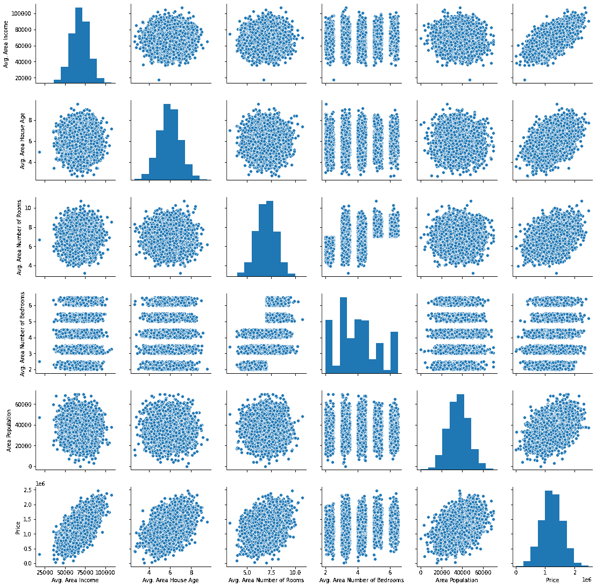

接下来，让我们开始构建线性回归模型。

### 建立机器学习线性回归模型

我们需要做的第一件事是将我们的数据分成一个`x-array`(包含我们将用来进行预测的数据)和一个`y-array`(包含我们试图预测的数据。

首先，我们应该决定包括哪些列。您可以使用`raw_data.columns`生成 DataFrame 的列列表，输出如下:

```
Index(['Avg. Area Income', 'Avg. Area House Age', 'Avg. Area Number of Rooms',

       'Avg. Area Number of Bedrooms', 'Area Population', 'Price', 'Address'],

      dtype='object') 
```

我们将在`x-array`中使用所有这些变量，除了`Price`(因为这是我们试图预测的变量)和`Address`(因为它只包含文本)。

让我们创建我们的`x-array`，并将其赋给一个名为`x`的变量。

```
 x = raw_data[['Avg. Area Income', 'Avg. Area House Age', 'Avg. Area Number of Rooms',

       'Avg. Area Number of Bedrooms', 'Area Population']] 
```

接下来，让我们创建我们的`y-array`，并将其赋给一个名为`y`的变量。

```
 y = raw_data['Price'] 
```

我们已经成功地将数据集分成了一个`x-array`(我们模型的输入值)和一个`y-array`(我们模型的输出值)。在下一节中，我们将学习如何将数据集进一步分成训练数据和测试数据。

### 将我们的数据集分为训练数据和测试数据

`scikit-learn`非常容易将我们的数据集划分为训练数据和测试数据。为此，我们需要从`scikit-learn`的`model_selection`模块中导入函数`train_test_split`。

下面是完成此操作的完整代码:

```
 from sklearn.model_selection import train_test_split 
```

`train_test_split`数据接受三个参数:

*   我们的`x-array`
*   我们的`y-array`
*   我们的测试数据的期望大小

有了这些参数，`train_test_split`函数将为我们拆分数据！如果我们希望我们的测试数据占整个数据集的 30%,下面是实现这一点的代码:

```
 x_train, x_test, y_train, y_test = train_test_split(x, y, test_size = 0.3) 
```

让我们解开这里发生的事情。

`train_test_split`函数返回一个长度为 4 的 [Python 列表](https://nickmccullum.com/python-course/lists/)，其中列表中的每一项分别是`x_train`、`x_test`、`y_train`和`y_test`。然后，我们使用列表解包将正确的值分配给正确的变量名。

既然我们已经适当地划分了我们的数据集，那么是时候建立和训练我们的线性回归机器学习模型了。

### 构建和训练模型

我们需要做的第一件事是从`scikit-learn`导入`LinearRegression`估计器。以下是 Python 对此的陈述:

```
 from sklearn.linear_model import LinearRegression 
```

接下来，我们需要创建一个`Linear Regression` Python 对象的实例。我们将把它赋给一个名为`model`的变量。以下是代码:

```
 model = LinearRegression() 
```

我们可以用`scikit-learn`的`fit`方法在我们的训练数据上训练这个模型。

```
 model.fit(x_train, y_train) 
```

我们的模型现在已经训练好了。您可以使用以下语句检查模型的每个系数:

```
 print(model.coef_) 
```

这将打印:

```
[2.16176350e+01 1.65221120e+05 1.21405377e+05 1.31871878e+03

 1.52251955e+01] 
```

同样，下面是回归方程的截距:

```
 print(model.intercept_) 
```

这将打印:

```
-2641372.6673013503 
```

查看系数的更好方法是将它们放在数据帧中。这可以通过下面的语句来实现:

```
 pd.DataFrame(model.coef_, x.columns, columns = ['Coeff']) 
```

这种情况下的输出更容易理解:

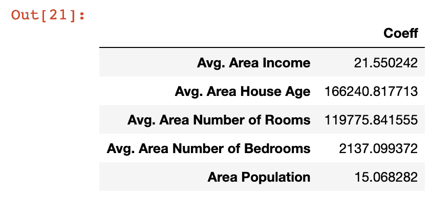

让我们花点时间来理解这些系数的含义。我们具体看一下`Area Population`变量，它的系数近似为`15`。

这意味着，如果你保持所有其他变量不变，那么`Area Population`增加一个单位将导致预测变量`15`增加一个单位——在这种情况下，是`Price`。

换句话说，特定变量的大系数意味着该变量对你试图预测的变量的值有很大的影响。同样，小值的影响也很小。

现在，我们已经生成了第一个机器学习线性回归模型，是时候使用该模型从我们的测试数据集进行预测了。

### 根据我们的模型进行预测

从机器学习模型中做出预测变得非常容易。你只需要在我们之前创建的`model`变量上调用`predict`方法。

由于`predict`变量被设计用来进行预测，它只接受一个`x-array`参数。它会为你生成`y`值！

下面是使用`predict`方法从我们的模型生成预测所需的代码:

```
 predictions = model.predict(x_test) 
```

`predictions`变量保存存储在`x_test`中的特征的 **预测值** 。由于我们使用了`train_test_split`方法将 **真实值** 存储在`y_test`中，接下来我们要做的是将`predictions`数组的值与`y_test`的值进行比较。

一个简单的方法是使用散点图绘制两个阵列。使用`plt.scatter`方法很容易构建 [matplotlib 散点图](https://nickmccullum.com/python-visualization/scatterplot/)。这是它的代码:

```
 plt.scatter(y_test, predictions) 
```

下面是这段代码生成的散点图:

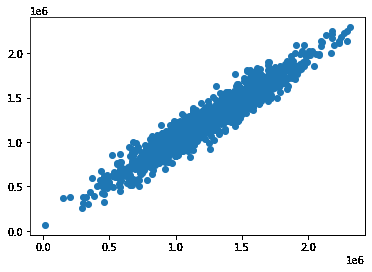

正如您所看到的，我们的预测值非常接近数据集中观察值的实际值。该散点图中完美的直对角线表示我们的模型完美地预测了`y-array`值。

另一种直观评估我们模型性能的方法是绘制它的`residuals`，它是实际`y-array`值和预测`y-array`值之间的差值。

一种简单的方法是使用下面的语句:

```
 plt.hist(y_test - predictions) 
```

下面是这段代码生成的可视化效果:

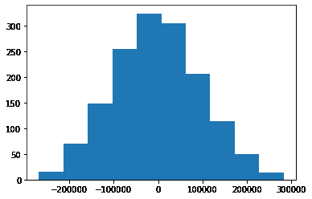

这是我们机器学习模型的残差直方图。

您可能会注意到，我们的机器学习模型的残差似乎是正态分布的。这是一个非常好的迹象！

这表明我们已经选择了合适的模型类型(在本例中是线性回归)来从我们的数据集进行预测。在本课程的后面部分，我们将进一步了解如何确保您使用正确的模型。

### 测试我们模型的性能

我们在本课程开始时了解到，回归机器学习模型有三个主要的性能指标:

*   绝对平均误差
*   均方误差
*   均方根误差

现在，我们将了解如何为我们在本教程中构建的模型计算这些指标。继续之前，在 Jupyter 笔记本中运行以下导入语句:

```
 from sklearn import metrics 
```

平均绝对误差

您可以使用以下语句在 Python 中计算平均绝对误差:

```
 metrics.mean_absolute_error(y_test, predictions) 
```

### 均方误差

同样，您可以使用以下语句在 Python 中计算均方误差:

```
 metrics.mean_squared_error(y_test, predictions) 
```

### **均方根误差(RMSE)**

与平均绝对误差和均方误差不同，`scikit-learn`实际上并没有内置的计算均方根误差的方法。

幸运的是，真的不需要。由于均方根误差只是均方误差的平方根，所以可以使用 NumPy 的`sqrt`方法轻松计算:

```
 np.sqrt(metrics.mean_squared_error(y_test, predictions)) 
```

### 本教程的完整代码

这是 Python 线性回归机器学习教程的全部代码。也可以在[这个 GitHub 库](https://github.com/nicholasmccullum/python-machine-learning/tree/master)里查看。

```
 import pandas as pd

import numpy as np

import matplotlib.pyplot as plt

import seaborn as sns

%matplotlib inline

raw_data = pd.read_csv('Housing_Data.csv')

x = raw_data[['Avg. Area Income', 'Avg. Area House Age', 'Avg. Area Number of Rooms',

       'Avg. Area Number of Bedrooms', 'Area Population']]

y = raw_data['Price']

from sklearn.model_selection import train_test_split

x_train, x_test, y_train, y_test = train_test_split(x, y, test_size = 0.3)

from sklearn.linear_model import LinearRegression

model = LinearRegression()

model.fit(x_train, y_train)

print(model.coef_)

print(model.intercept_)

pd.DataFrame(model.coef_, x.columns, columns = ['Coeff'])

predictions = model.predict(x_test)

# plt.scatter(y_test, predictions)

plt.hist(y_test - predictions)

from sklearn import metrics

metrics.mean_absolute_error(y_test, predictions)

metrics.mean_squared_error(y_test, predictions)

np.sqrt(metrics.mean_squared_error(y_test, predictions)) 
```

## 第二部分:逻辑回归

注意——如果到目前为止你已经按照本教程编写了代码，并且已经构建了线性回归模型，那么在继续之前，你需要打开一个新的 Jupyter 笔记本(其中没有代码)。

### 我们将在本教程中使用的数据集

泰坦尼克号数据集是一个非常著名的数据集，它包含了泰坦尼克号上乘客的特征。它经常被用作逻辑回归问题的介绍性数据集。

在本教程中，我们将使用泰坦尼克号数据集结合 Python 逻辑回归模型来预测乘客是否在泰坦尼克号失事中幸存。

[原始泰坦尼克号数据集](https://www.kaggle.com/c/titanic)在 Kaggle.com上公开，这是一个主办数据集和数据科学竞赛的网站。

为了让这门课的学生更容易，我们将使用半清理版的泰坦尼克号数据集，这将节省你清理和处理数据的时间。

清理过的泰坦尼克号数据集实际上已经提供给你了。您可以通过单击下面的链接下载数据文件:

*   [泰坦尼克号数据](https://nickmccullum.com/files/logistic-regression/titanic_train.csv)

一旦下载了这个文件，在同一个工作目录中打开一个 [Jupyter 笔记本](https://nickmccullum.com/python-course/jupyter-notebook-basics/)，我们就可以开始构建我们的[逻辑回归模型了。](https://nickmccullum.com/python-machine-learning/introduction-logistic-regression/)

### 我们将在本教程中使用的导入

像以前一样，我们将在本教程中使用多个开源软件库。下面是我在 Python 逻辑回归模型中编写代码时需要运行的导入:

```
 import pandas as pd

import numpy as np

import matplotlib.pyplot as plt

%matplotlib inline

import seaborn as sns 
```

接下来，我们需要将 Titanic 数据集导入到 Python 脚本中。

### 将数据集导入我们的 Python 脚本

我们将使用 pandas 的`read_csv`方法将我们的`csv`文件导入到名为`titanic_data`的 [pandas 数据帧](https://nickmccullum.com/advanced-python/pandas-dataframes/)中。

下面是执行此操作的代码:

```
 titanic_data = pd.read_csv('titanic_train.csv') 
```

接下来，我们来调查一下泰坦尼克号的数据集中到底包含了哪些数据。有两种主要方法可以做到这一点(具体使用`titanic_data`数据帧):

*   `titanic_data.head(5)`方法将打印数据帧的前 5 行。你可以用任何你喜欢的数字代替`5`。
*   您也可以打印`titanic_data.columns`，它将显示指定的列。

运行第二个命令(`titanic_data.columns`)会生成以下输出:

```
 Index(['PassengerId', 'Survived', 'Pclass', 'Name', 'Sex', 'Age', 'SibSp',

       'Parch', 'Ticket', 'Fare', 'Cabin', 'Embarked'],

      dtype='object' 
```

这些是数据框架中列的名称。以下是每个数据点的简要说明:

*   泰坦尼克号上每个乘客的数字标识符。
*   `Survived`:表示乘客是否在泰坦尼克号失事中幸存的二进制标识符。如果他们幸存下来，这个变量将保存一个值`1`，如果他们没有，这个变量将保存一个值`0`。
*   `Pclass`:所述乘客的乘客等级。根据乘客在船上的位置，它可以保存一个值`1`、`2`或`3`。
*   `Name`:乘客姓名
*   `Sex`:男性或女性。
*   乘客的年龄(以岁为单位)。
*   船上兄弟姐妹和配偶的数量。
*   船上父母和孩子的数量。
*   `Ticket`:旅客的票号。
*   泰坦尼克号上的乘客花了多少钱买票。
*   `Cabin`:乘客的客舱号。
*   `Embarked`:乘客上船的港口(C =瑟堡，Q =皇后镇，S =南安普顿)

接下来，我们将通过使用一些基本的探索性数据分析技术来更多地了解我们的数据集。

### 通过探索性数据分析了解我们的数据集

### **各分类类别的流行程度**

**当使用机器学习技术对分类问题进行建模时，了解类别之间的比例总是一个好主意。对于这个特定的问题，查看我们的训练数据中有多少幸存者与非幸存者是有用的。**

**一种简单的可视化方法是使用`seaborn`图`countplot`。在本例中，您可以使用以下 Python 代码创建适当的`seasborn`图:**

```
 `sns.countplot(x='Survived', data=titanic_data)` 
```

**这会生成以下图:**

**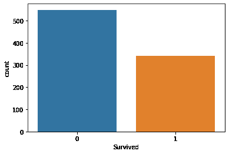**

**如你所见，我们的非幸存者比幸存者多得多。**

### ******两性间的存活率******

**相对于一些其他数据特征来比较存活率也是有用的。例如，我们可以使用以下 Python 代码比较`Sex`的`Male`和`Female`值之间的存活率:**

```
 `sns.countplot(x='Survived', hue='Sex', data=titanic_data)` 
```

**这会生成以下图:**

**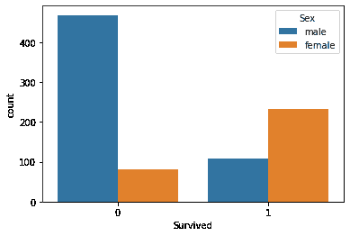**

**正如你所看到的，拥有`Male`的`Sex`的乘客比拥有`Female`的`Sex`的乘客更有可能成为幸存者。**

### ******客运班间存活率******

**我们可以使用`Pclass`变量进行类似的分析，看看哪个乘客等级最有可能(和最不可能)有幸存者。**

**下面是执行此操作的代码:**

```
 `sns.countplot(x='Survived', hue='Pclass', data=titanic_data)` 
```

**这会生成以下图:**

**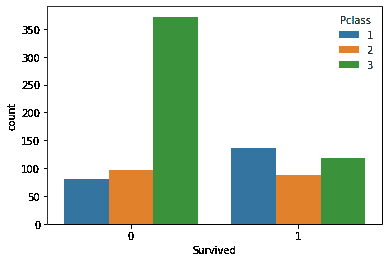**

**从这个图中最值得注意的观察是，具有`3`的`Pclass`值的乘客——这表示三等舱，这是最便宜和最不豪华的——更有可能在泰坦尼克号坠毁时死亡。**

### ******泰坦尼克号乘客的年龄分布******

**我们可以进行的另一个有用的分析是调查泰坦尼克号乘客的年龄分布。直方图是一个很好的工具。**

**您可以使用以下代码生成`Age`变量的直方图:**

```
 `plt.hist(titanic_data['Age'].dropna())` 
```

**注意，`dropna()`方法是必要的，因为数据集包含几个空值。**

**下面是这段代码生成的直方图:**

**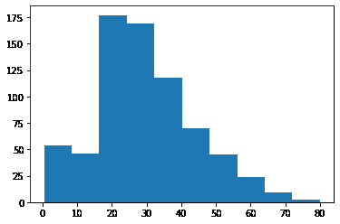**

**如你所见，泰坦尼克号的乘客集中在`20`和`40`之间的`Age`值。**

### ******泰坦尼克号乘客的票价分布******

**我们将使用的最后一种探索性数据分析技术是调查泰坦尼克号数据集中票价的分布。**

**您可以使用以下代码来实现这一点:**

```
 `plt.hist(titanic_data['Fare'])` 
```

**这会生成以下图:**

**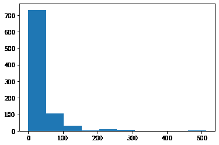**

**如你所见，在泰坦尼克号的数据集中有三组不同的价格。这是有意义的，因为`Pclass`变量也有三个唯一的值。不同的`Fare`组对应不同的`Pclass`类别。**

**由于 Titanic 数据集是真实世界的数据集，它包含一些缺失的数据。我们将在下一节学习如何处理丢失的数据。**

### **从我们的数据集中删除空数据**

**首先，让我们检查我们的数据集在哪里包含丢失的数据。为此，请运行以下命令:**

```
 `titanic_data.isnull()` 
```

**这将生成一个布尔值的数据帧，其中如果单元格为空值，则包含`True`，否则包含`False`。这是一个看起来像这样的图像:**

**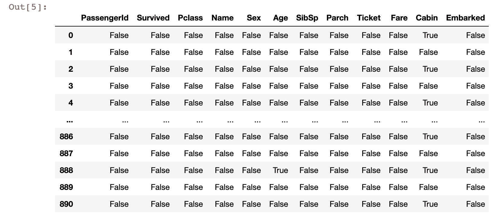**

**评估这个数据集中缺失数据的一个更有用的方法是创建一个快速可视化。为此，我们可以使用`seaborn`可视化库。下面是一个快捷命令，您可以用它来使用`seaborn`库创建一个`heatmap`:**

```
 `sns.heatmap(titanic_data.isnull(), cbar=False)` 
```

**这是它产生的视觉效果:**

**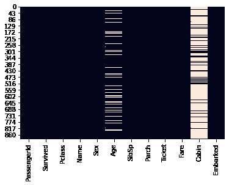**

**在该可视化中，白线表示数据集中缺失的值。您可以看到`Age`和`Cabin`列包含了 Titanic 数据集中大多数缺失的数据。**

**特别是,`Age`列包含足够少的缺失数据，我们可以使用某种形式的数学来填充缺失的数据。另一方面，`Cabin`数据缺少足够多的数据，我们可能会将其从模型中完全删除。**

**用其余数据集中的平均数据填充缺失数据的过程称为`imputation`。我们现在将使用`imputation`来填充`Age`列中缺失的数据。**

**`imputation`最基本的形式是用整个数据集的平均`Age`值来填充缺失的`Age`数据。但是，有更好的方法。**

**我们将用乘客所属的特定`Pclass`乘客等级的平均`Age`值来填充缺失的`Age`值。为了理解为什么这是有用的，考虑下面的箱线图:**

```
 `sns.boxplot(titanic_data['Pclass'], titanic_data['Age'])` 
```

**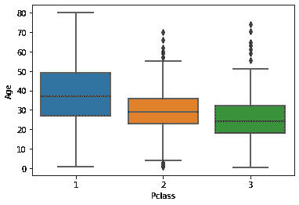**

**如您所见，具有`Pclass`值`1`(最贵的乘客等级)的乘客往往是最年长的，而具有`Pclass`值`3`(最便宜)的乘客往往是最年轻的。这是非常合理的，所以我们将使用不同`Pclass`数据中的平均`Age`值来`imputate`我们的`Age`列中缺失的数据。**

**对像 Titanic 数据集这样的数据集执行`imputation`的最简单方法是构建一个定制函数。首先，我们需要确定每个`Pclass`值的平均`Age`值。**

```
 `#Pclass value 1

titanic_data[titanic_data['Pclass'] == 1]['Age'].mean()

#Pclass value 2

titanic_data[titanic_data['Pclass'] == 2]['Age'].mean()

#Pclass 3

titanic_data[titanic_data['Pclass'] == 2]['Age'].mean()` 
```

**这里是我们将用来`imputate`我们丢失的`Age`变量的最后一个函数:**

```
 `def impute_missing_age(columns):

    age = columns[0]

    passenger_class = columns[1]

    if pd.isnull(age):

        if(passenger_class == 1):

            return titanic_data[titanic_data['Pclass'] == 1]['Age'].mean()

        elif(passenger_class == 2):

            return titanic_data[titanic_data['Pclass'] == 2]['Age'].mean()

        elif(passenger_class == 3):

            return titanic_data[titanic_data['Pclass'] == 3]['Age'].mean()

    else:

        return age` 
```

**既然这个插补函数已经完成，我们需要将它应用到`titanic_data`数据帧中的每一行。Python 的`apply`方法是一个很好的工具:**

```
 `titanic_data['Age'] = titanic_data[['Age', 'Pclass']].apply(impute_missing_age, axis = 1)` 
```

**既然我们已经在每一行上执行了`imputation`来处理我们丢失的`Age`数据，那么让我们研究一下我们最初的箱线图:**

```
 `sns.heatmap(titanic_data.isnull(), cbar=False)` 
```

**你会注意到在我们的熊猫数据框的`Age`栏中不再有任何丢失的数据！**

**您可能想知道为什么我们花这么多时间专门处理`Age`列中的缺失数据。这是因为考虑到`Age`对大多数灾难和疾病存活率的影响，它是一个在我们的数据集中可能具有高预测价值的变量。**

**现在我们已经了解了这个数据集的结构，并删除了它的缺失数据，让我们开始构建我们的逻辑回归机器学习模型。**

### **建立逻辑回归模型**

**现在是时候移除我们的逻辑回归模型了。**

### ******删除缺失数据过多的列******

**首先，让我们删除`Cabin`列。正如我们提到的，该列中缺失数据的高发生率意味着`impute`缺失数据是不明智的，因此我们将使用以下代码将其完全删除:**

```
 `titanic_data.drop('Cabin', axis=1, inplace = True)` 
```

**接下来，让我们用 pandas `dropna()`方法删除包含缺失数据的任何附加列:**

```
 `titanic_data.dropna(inplace = True)` 
```

### ******用虚拟变量处理分类数据******

**我们需要处理的下一个任务是处理分类特征。也就是说，我们需要找到一种方法，用数值来处理不是自然数值的观察结果。**

**一个很好的例子是`Sex`列，它有两个值:`Male`和`Female`。类似地，`Embarked`列包含一个字母，表示乘客从哪个城市出发。**

**为了解决这个问题，我们将创建`dummy variables`。这些为非数字特征的每个类别分配一个数值。**

**幸运的是，`pandas`有一个名为`get_dummies()`的内置方法，可以很容易地创建虚拟变量。`get_dummies`方法有一个问题——它将为 DataFrame 列中的每个值创建一个新列。**

**让我们考虑一个例子来帮助更好地理解这一点。如果我们在`Age`列上调用`get_dummies()`方法，我们会得到以下输出:**

```
 `pd.get_dummies(titanic_data['Sex'])` 
```

**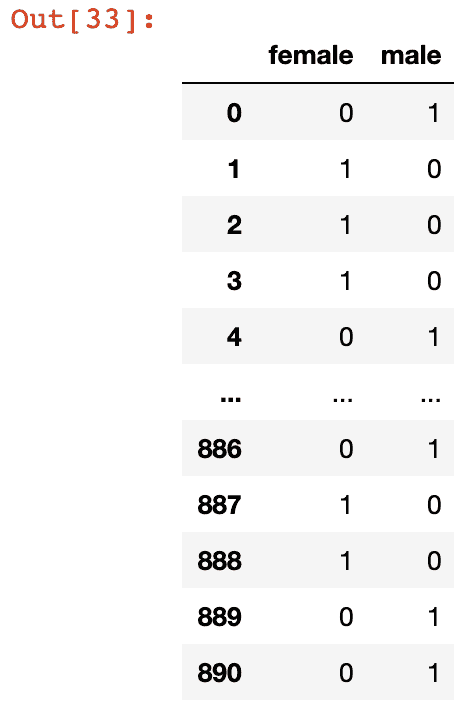**

**如您所见，这创建了两个新列:`female`和`male`。这两列都是彼此的最佳预测值，因为`female`列中的值`0`表示`male`列中的值`1`，反之亦然。**

**这被称为`multicollinearity`，它会显著降低算法的预测能力。为了消除这一点，我们可以将参数`drop_first = True`添加到`get_dummies`方法中，如下所示:**

```
 `pd.get_dummies(titanic_data['Sex'], drop_first = True)` 
```

**现在，让我们为我们的`Sex`和`Embarked`列创建虚拟变量列，并将它们分配给名为`sex`和`embarked`的变量。**

```
 `sex_data = pd.get_dummies(titanic_data['Sex'], drop_first = True)

embarked_data = pd.get_dummies(titanic_data['Embarked'], drop_first = True)` 
```

**关于下面定义的`embarked`变量，有一点需要注意。它有两列:`Q`和`S`，但是因为我们已经删除了另一列(`C`列)，剩下的两列都不是彼此的完美预测，所以`multicollinearity`不存在于新的、修改过的数据集中。**

### ******向`pandas`数据帧添加虚拟变量******

**接下来，我们需要将我们的`sex`和`embarked`列添加到 DataFrame 中。**

**您可以使用以下代码将这些数据列[连接](https://nickmccullum.com/advanced-python/how-to-concatenate-pandas-dataframes/)到现有的`pandas`数据帧中:**

```
 `titanic_data = pd.concat([titanic_data, sex_data, embarked_data], axis = 1)` 
```

**现在，如果您运行命令`print(titanic_data.columns)`，您的 Jupyter 笔记本将生成以下输出:**

```
 `Index(['PassengerId', 'Survived', 'Pclass', 'Name', 'Sex', 'Age', 'SibSp',

       'Parch', 'Ticket', 'Fare', 'Embarked', 'male', 'Q', 'S'],

      dtype='object')` 
```

**`male`、`Q`和`S`列的存在表明我们的数据被成功连接。**

### **从数据集中删除不必要的列**

**这意味着我们现在可以从 DataFrame 中删除原始的`Sex`和`Embarked`列。还有其他列(如`Name`、`PassengerId`、`Ticket`)不能预测泰坦尼克号失事的存活率，所以我们也将删除它们。下面的代码为我们处理了这个问题:**

```
 `titanic_data.drop(['Name', 'Ticket', 'Sex', 'Embarked'], axis = 1, inplace = True)` 
```

**如果您现在打印`titanic_data.columns`，您的 Jupyter 笔记本将生成以下输出:**

```
 `Index(['Survived', 'Pclass', 'Age', 'SibSp', 'Parch', 'Fare',

       'male', 'Q', 'S'],

      dtype='object'` 
```

**数据帧现在具有以下外观:**

**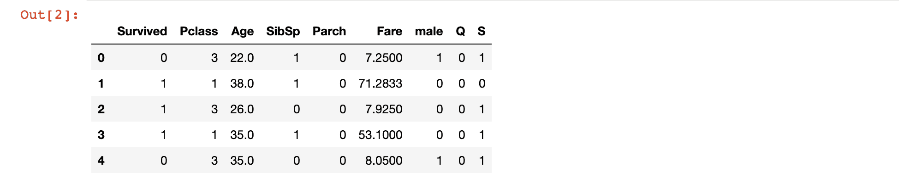**

**如您所见，该数据集中的每个字段现在都是数字，这使其成为逻辑回归机器学习算法的绝佳候选。**

### **创建培训数据和测试数据**

**接下来，是时候把我们的`titanic_data`拆分成训练数据和测试数据了。和以前一样，我们将使用`scikit-learn`的内置功能来完成这项工作。**

**首先，我们需要将数据分成`x`值(我们将用来进行预测的数据)和`y`值(我们试图预测的数据)。下面的代码处理这个问题:**

```
 `y_data = titanic_data['Survived']

x_data = titanic_data.drop('Survived', axis = 1)` 
```

**接下来，我们需要从`scikit-learn`导入`train_test_split`函数。以下代码执行此导入:**

```
 `from sklearn.model_selection import train_test_split` 
```

**最后，我们可以使用`train_test_split`函数结合列表解包来生成我们的训练数据和测试数据:**

```
 `x_training_data, x_test_data, y_training_data, y_test_data = train_test_split(x_data, y_data, test_size = 0.3)` 
```

**注意，在这种情况下，测试数据是由参数`test_size = 0.3`指定的原始数据集的 30%。**

**现在，我们已经为逻辑回归模型创建了训练数据和测试数据。我们将在本教程的下一部分训练我们的模型。**

### **训练逻辑回归模型**

**为了训练我们的模型，我们首先需要使用以下命令从`scikit-learn`导入适当的模型:**

```
 `from sklearn.linear_model import LogisticRegression` 
```

**接下来，我们需要通过实例化`LogisticRegression`对象的实例来创建我们的模型:**

```
 `model = LogisticRegression()` 
```

**为了训练模型，我们需要在我们刚刚创建的`LogisticRegression`对象上调用`fit`方法，并传入我们的`x_training_data`和`y_training_data`变量，如下所示:**

```
 `model.fit(x_training_data, y_training_data)` 
```

**我们的模型现在已经训练好了。在本教程的下一节，我们将开始使用这个模型进行预测。**

### **用我们的逻辑回归模型做预测**

**让我们使用刚刚创建的`model`逻辑回归模型对我们的测试数据进行一组预测。我们将这些预测存储在一个名为`predictions`的变量中:**

```
 `predictions = model.predict(x_test_data)` 
```

**我们的预言已经实现了。接下来让我们检查我们的模型的准确性。**

### **衡量逻辑回归机器学习模型的性能**

**`scikit-learn`有一个优秀的内置模块，名为`classification_report`，可以很容易地测量分类机器学习模型的性能。我们将使用此模块来衡量我们刚刚创建的模型的性能。**

**首先，让我们导入模块:**

```
 `from sklearn.metrics import classification_report` 
```

**接下来，让我们使用该模块来计算逻辑回归机器学习模块的性能指标:**

```
 `classification_report(y_test_data, predictions)` 
```

**以下是该命令的输出:**

```
 `precision    recall  f1-score   support

           0       0.83      0.87      0.85       169

           1       0.75      0.68      0.72        98

    accuracy                           0.80       267

   macro avg       0.79      0.78      0.78       267

weighted avg       0.80      0.80      0.80       267` 
```

**如果您有兴趣查看原始混淆矩阵并手动计算性能指标，您可以使用以下代码来完成:**

```
 `from sklearn.metrics import confusion_matrix

print(confusion_matrix(y_test_data, predictions))` 
```

**这将生成以下输出:**

```
 `[[145  22]

 [ 30  70]]` 
```

### **本教程的完整代码**

**你可以在 GitHub 库中查看本教程的完整代码。它也粘贴在下面供您参考:**

```
 `import pandas as pd

import numpy as np

import matplotlib.pyplot as plt

%matplotlib inline

import seaborn as sns

#Import the data set

titanic_data = pd.read_csv('titanic_train.csv')

#Exploratory data analysis

sns.heatmap(titanic_data.isnull(), cbar=False)

sns.countplot(x='Survived', data=titanic_data)

sns.countplot(x='Survived', hue='Sex', data=titanic_data)

sns.countplot(x='Survived', hue='Pclass', data=titanic_data)

plt.hist(titanic_data['Age'].dropna())

plt.hist(titanic_data['Fare'])

sns.boxplot(titanic_data['Pclass'], titanic_data['Age'])

#Imputation function

def impute_missing_age(columns):

    age = columns[0]

    passenger_class = columns[1]

    if pd.isnull(age):

        if(passenger_class == 1):

            return titanic_data[titanic_data['Pclass'] == 1]['Age'].mean()

        elif(passenger_class == 2):

            return titanic_data[titanic_data['Pclass'] == 2]['Age'].mean()

        elif(passenger_class == 3):

            return titanic_data[titanic_data['Pclass'] == 3]['Age'].mean()

    else:

        return age

#Impute the missing Age data

titanic_data['Age'] = titanic_data[['Age', 'Pclass']].apply(impute_missing_age, axis = 1)

#Reinvestigate missing data

sns.heatmap(titanic_data.isnull(), cbar=False)

#Drop null data

titanic_data.drop('Cabin', axis=1, inplace = True)

titanic_data.dropna(inplace = True)

#Create dummy variables for Sex and Embarked columns

sex_data = pd.get_dummies(titanic_data['Sex'], drop_first = True)

embarked_data = pd.get_dummies(titanic_data['Embarked'], drop_first = True)

#Add dummy variables to the DataFrame and drop non-numeric data

titanic_data = pd.concat([titanic_data, sex_data, embarked_data], axis = 1)

titanic_data.drop(['Name', 'PassengerId', 'Ticket', 'Sex', 'Embarked'], axis = 1, inplace = True)

#Print the finalized data set

titanic_data.head()

#Split the data set into x and y data

y_data = titanic_data['Survived']

x_data = titanic_data.drop('Survived', axis = 1)

#Split the data set into training data and test data

from sklearn.model_selection import train_test_split

x_training_data, x_test_data, y_training_data, y_test_data = train_test_split(x_data, y_data, test_size = 0.3)

#Create the model

from sklearn.linear_model import LogisticRegression

model = LogisticRegression()

#Train the model and create predictions

model.fit(x_training_data, y_training_data)

predictions = model.predict(x_test_data)

#Calculate performance metrics

from sklearn.metrics import classification_report

print(classification_report(y_test_data, predictions))

#Generate a confusion matrix

from sklearn.metrics import confusion_matrix

print(confusion_matrix(y_test_data, predictions))` 
```

### **最后的想法**

**在本教程中，您学习了如何用 Python 构建线性回归和逻辑回归机器学习模型。**

**如果你有兴趣了解更多关于构建、培训和部署前沿机器学习模型的信息，我的电子书[实用机器学习](https://gumroad.com/l/pGjwd)将教你如何使用真实世界的项目构建 9 种不同的机器学习模型。**

**您可以将电子书中的代码部署到您的 GitHub 或个人文件夹中，以展示给未来的雇主。这本书将于 8 月 3 日发布—[现在预订可享受五折优惠](https://gumroad.com/l/pGjwd)！**

**以下是您在本文中学到的内容的简要总结:**

*   **如何导入构建线性回归机器学习算法所需的库**
*   **如何使用`scikit-learn`将数据集分割成训练数据和测试数据**
*   **如何使用`scikit-learn`训练线性回归模型并使用该模型进行预测**
*   **如何使用`scikit-learn`计算线性回归性能指标**
*   **为什么泰坦尼克号数据集经常被用于学习机器学习分类技术**
*   **如何在处理分类机器学习问题的数据集时执行探索性数据分析**
*   **如何处理熊猫数据框架中的缺失数据**
*   **`imputation`的含义以及如何使用它来填充缺失的数据**
*   **如何为机器学习数据集中的分类数据创建虚拟变量**
*   **如何用 Python 训练逻辑回归机器学习模型**
*   **如何在 Python 中使用逻辑回归模型进行预测**
*   **如何向`scikit-learn`的`classification_report`快速计算机器学习分类问题的性能指标**