# 没有编程经验如何为 Google Assistant 构建应用

> 原文：<https://www.freecodecamp.org/news/how-to-build-apps-for-google-assistant-with-no-programming-experience-42a490d63822/>

最近，谷歌推出了谷歌助手的开发者计划。该计划旨在鼓励用户使用谷歌助手。谷歌邀请了来自世界各地的大量开发者加入他们的开发者社区，为谷歌助手开发一些很酷的应用。

这个社区项目有两个非常酷的地方。首先，你不需要成为构建应用的开发者。所以，请继续关注，因为我将告诉你如何构建一些很酷的应用程序，并让它们发布，即使你不知道如何编写代码。

第二，如果你的应用发布了，那么谷歌会给你发一件专属的谷歌助手 t 恤——你与该应用相关的账户将在下一年每月获得高达 200 美元的云服务。此外，当你的应用程序跨越某些里程碑时，你将获得更多的奖励和额外津贴。

那么，我们开始吧。首先去[谷歌助理开发者社区计划](https://developers.google.com/actions/community/overview?utm_source=devsite&utm_medium=hpp&utm_campaign=googleassistantdevcommunity_feb18)。然后你就会登陆这个页面。

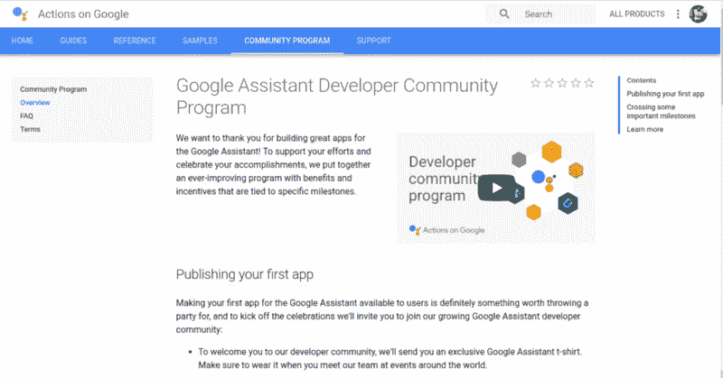

单击导航栏中的“主页”按钮。这将带你到一个类似这样的页面。

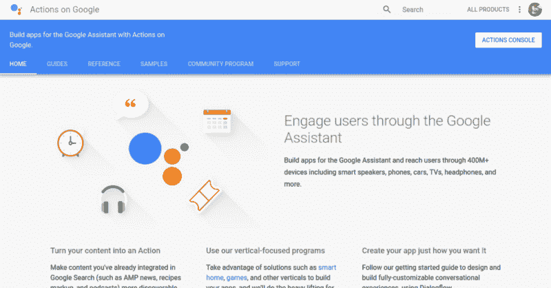

现在，在这一点上，我建议你通过这一页上给出的细节。在页面的右上角，您会发现一个名为“操作控制台”的按钮。点击它，现在它会带你到这个页面。

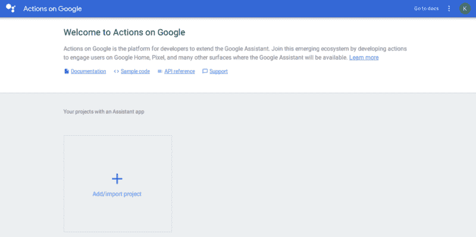

现在前进并点击“+”号来添加或导入您项目。在你点击之后，你将到达这个阶段。

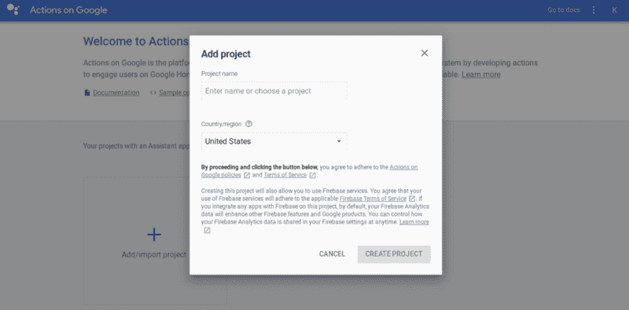

现在写下你的项目名称并选择你的国家/地区。如果您有时间，请务必阅读服务条款和政策。完成后，点击“创建项目”,它会带你到下一页。

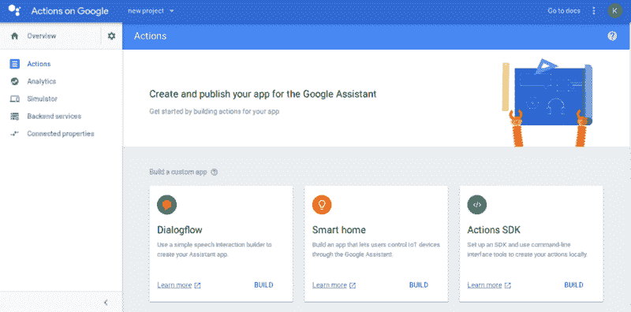

在这里你会发现很多事情可以做。如果你是一名开发人员，那么你可以查看 Dialogflow、Smart home 和 Actions SDK 等选项，但如果你是一名新手，不知道如何使用这些东西，也不用担心。现在向下滚动到底部，你会在那里找到一些选项。

在这里，你可以选择谷歌已经建立的这些模板之一。你必须用自己独特的方式重新创造它们。现在我要选择琐事。因此，单击“构建”并继续。

现在你会发现自己在这一页。

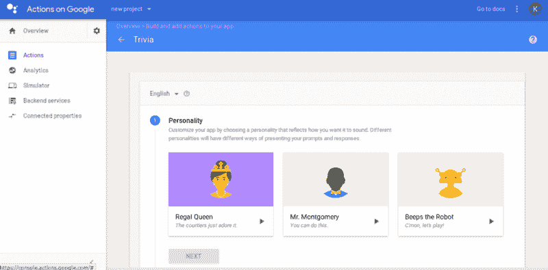

在这里，你必须为你的谷歌助理应用程序选择一个个性。你可以根据自己的选择选择其中任何一个。“我会选择右边的那个，”机器人发出嘟嘟声。为你的应用程序选择个性后，点击“下一步”按钮。

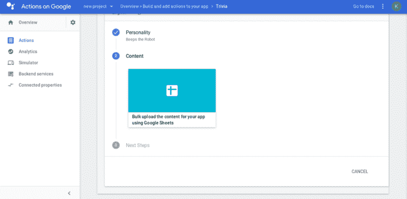

你现在就在这里，你所要做的就是点击“使用谷歌表单为你的应用批量上传内容”

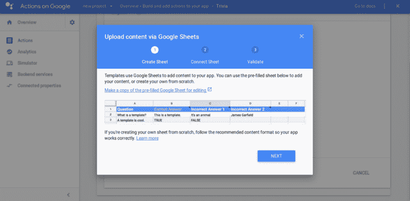

现在，你可以做一件让你生活更轻松的事。只需点击链接，上面写着“复制一份预先填写好的谷歌表单以供编辑。”这并不意味着你要复制别人的想法，但谷歌对他们提供给我们的应用程序模板有一个定义的格式。所以不要认为你会卷入任何剽窃的事情。当你点击那个链接时，你会看到一个已经填好的谷歌表单，看起来有点像这样。

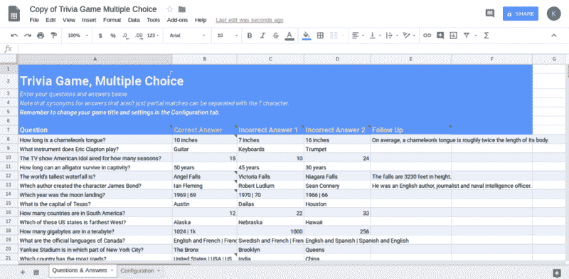

你所要做的就是用你自己的方式编辑这张表格，当你完成后，只需转到上一页并点击“下一页”。

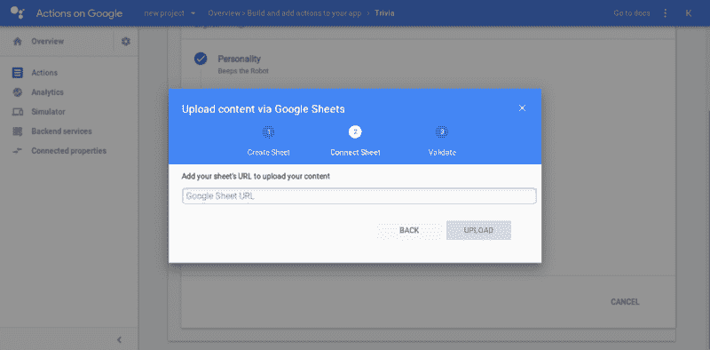

在这里，您必须将链接粘贴到您之前编辑的工作表，然后单击 upload。然后它将开始验证。如果您的内容经过验证，您将会看到类似这样的内容。

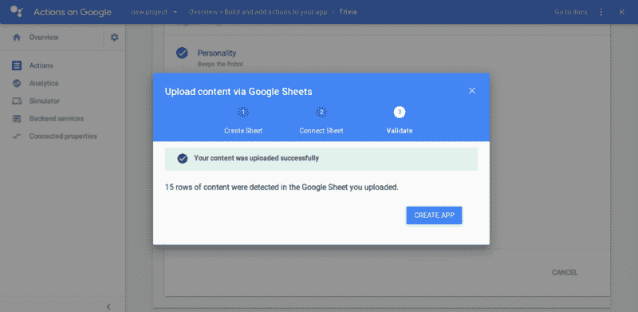

点击“创建应用程序”并继续，你会看到这一点。

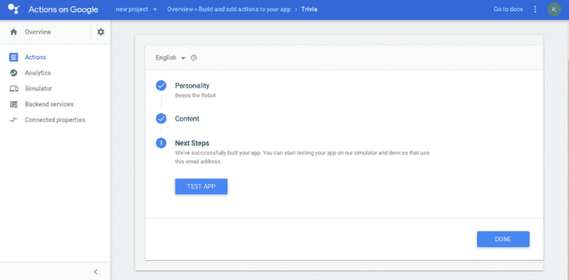

你可以通过点击“测试应用”来测试你的应用，当你测试完你的应用后，返回并点击“完成”。

然后你会看到这样的东西。

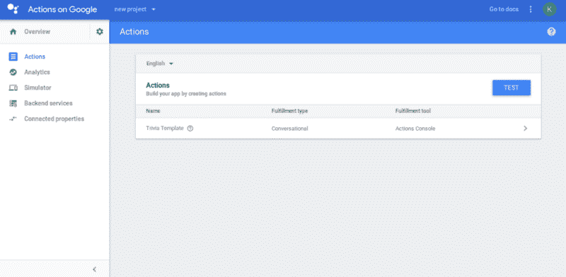

在页面的左上角，你会发现“概述”，然后点击它继续前进。

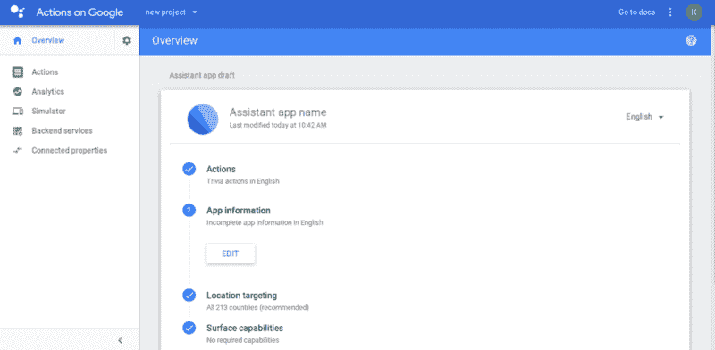

点击概览后，您将进入上图所示的页面。现在，您可以编辑应用程序的信息。在填写应用程序的详细信息时，您将需要填写隐私政策的链接。

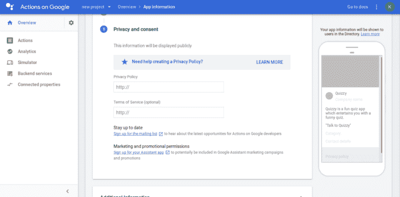

在这一点上要小心——你不希望弄乱用户的隐私，因为这是最重要的问题。如果此时您需要隐私政策方面的帮助，请单击蓝色栏中的“了解更多”。

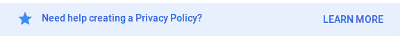

当你点击它的时候，你会看到一个谷歌表单，所有关于隐私政策的信息都会在这个表单中提供给你。你必须仔细按照那张单子上的步骤去做。

当你完成应用程序的所有细节后，点击页面右下角的“保存”。

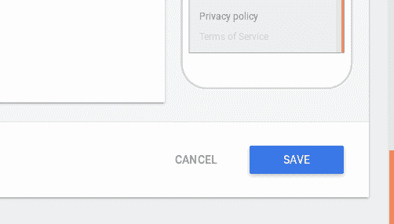

现在返回并点击“测试草稿”来测试你的应用程序。当您完成最终测试后，点击“提交草稿以供审查”

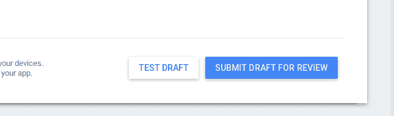

你完了。哇哦。您已经为谷歌助手创建了一个应用程序。你真棒！

所以这一切都是为了谷歌助手应用。如果您仍然面临任何问题，请务必联系我。这是我第一篇关于媒介的文章！请随意告诉我你对这篇文章的看法，如果你认为它对你有帮助，那么请一定要鼓掌！此外，请务必查看我的谷歌助理应用程序:1。[傻逼小测验](https://assistant.google.com/services/a/uid/0000004882ce65f5?hl=en&source=web) 2。[元素名称](https://assistant.google.com/services/a/uid/0000007906e49354?hl=en&source=web) 3。[先生名](https://assistant.google.com/services/a/uid/0000004afb06ddfc?hl=en&source=web)。

谢谢:)