# 如何只用一个 JSON 标记构建跨平台的移动应用程序

> 原文：<https://www.freecodecamp.org/news/how-to-build-cross-platform-mobile-apps-using-nothing-more-than-a-json-markup-f493abec1873/>

伊森

# 如何只用一个 JSON 标记构建跨平台的移动应用程序

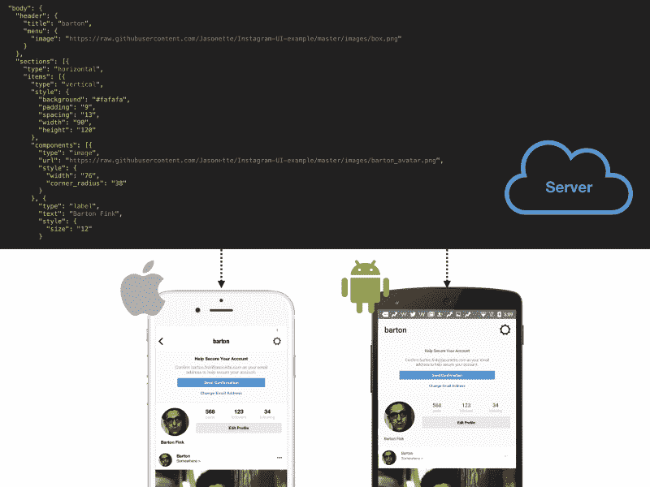

在过去的几个月里，我一直在研究一种新的方式来构建跨平台、原生的 iOS 和 Android 应用，这三种应用分别叫做 Jasonette 和 T7。

它让你只用一个 JSON 标记就能描述整个应用程序。

如果您的应用程序完全由 JSON 组成，它可以像任何其他数据一样对待。并且可以按需从云中远程提供服务。

应用程序逻辑不再需要在设备上硬编码，您可以通过在服务器端更新 JSON 来更新它。每次打开应用程序时，都会从服务器上重新加载。

请观看下面的视频，了解快速介绍:

Jasonette 有许多不同的部分。您可以使用 JSON 标记来表达函数、模板、样式等等。因此，你可以完全按照[模型——视图——控制器](https://en.wikipedia.org/wiki/Model%E2%80%93view%E2%80%93controller)的方式编写一个超级复杂的本地移动应用。

在这篇文章中，我将特别向你展示“视图”部分:

1.  Jasonette 如何在 JSON 中表达各种跨平台 UI 模式。
2.  它如何在内部实现这些 JSON-to-Native 映射。

### 基本结构

在引擎盖下，Jasonette 的工作方式类似于网络浏览器。但是 Jasonette 不是解释 HTML 标记和绘制 web 视图，而是动态地获取 JSON 标记并构建原生视图。

标记只是一个 JSON 文件，遵循一些[预定义的约定](http://docs.jasonette.com/)。首先，它以一个`$jason`键开始，这个键有两个子键:`head`和`body`，看起来是这样的:

```
{  "$jason": {    "head": {      .. metadata about the document ...    },    "body": {      .. actual content to be displayed on the view ..    }  }}
```

### 设计原理

当我第一次开始设计用于描述本机视图的 JSON 语法时，我考虑了几个约束:

1.  **原生**——iOS 和 Android 想出自己的原生布局系统是有原因的。为桌面时代设计的布局系统并不总是适用于小型设备世界。语法应该以尽可能移动的本地方式表达底层布局。
2.  **跨平台** —然而它需要跨平台。例如，iOS 有一些叫做[autolayout](https://developer.apple.com/library/content/documentation/UserExperience/Conceptual/AutolayoutPG)**和[可视格式语言](https://developer.apple.com/library/content/documentation/UserExperience/Conceptual/AutolayoutPG/VisualFormatLanguage.html) 的东西，但这些都不是在 Android 上原生实现的，所以不是正确的解决方案。**
3.  简单而富于表现力 —它应该很容易用简单的 JSON 格式表达，并且很容易组成复杂的结构。

当你看一看大多数移动应用程序是如何构建的，它们都可以归结为少量的通用界面模式:

1.  垂直滚动列表
2.  水平滚动列表
3.  绝对定位
4.  格子

让我们来看看前三种，因为它们应用最广泛。

### 1.章节—描述滚动列表

最常用的 UI 模式是**滚动列表**。在 Jasonette 上我们称之为`sections`。

剖面有两种类型:**垂直**和**水平**。垂直部分垂直滚动，水平部分水平滚动。

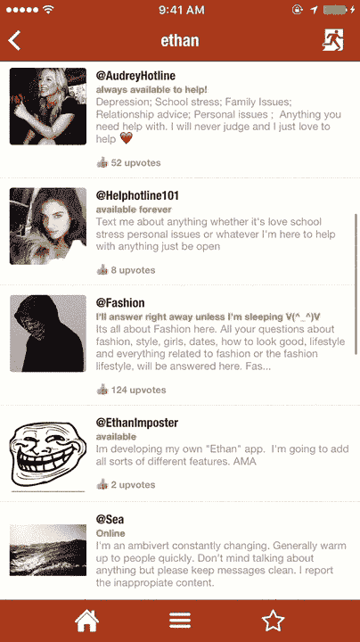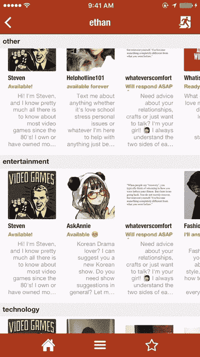

A single vertical section with multiple items (Left) — Multiple horizontal sections (Right)

#### 实施—垂直部分

这可能是在移动设备上显示数据最常用的 UI。在 iOS 上，Jasonette 用 [UITableView](https://developer.apple.com/reference/uikit/uitableview) 实现了这一点。在 Android 上，它是通过[回收查看](https://developer.android.com/reference/android/support/v7/widget/RecyclerView.html)实现的。

```
{  "body": {    "sections": [{      "items": [        {"type": "label", "text": "Item 1"},        {"type": "label", "text": "Item 2"},        {"type": "label", "text": "Item 3"}      ]    }]  }}
```

在 iOS 上，上面的 JSON 标记用三个 [UITableViewCells](https://developer.apple.com/reference/uikit/uitableviewcell) 创建了一个 UITableView，其中每个包含一个 [UILabel](https://developer.apple.com/reference/uikit/uilabel) ，以及相应的`text`属性。

在 Android 上，它创建了一个包含三个项目的 RecyclerView，每个项目都是一个显示相应的`text`属性的 [TextView](https://developer.android.com/reference/android/widget/TextView.html) 。

所有这些都是以编程方式构建的，没有使用任何[故事板](https://developer.apple.com/library/content/documentation/General/Conceptual/Devpedia-CocoaApp/Storyboard.html) (iOS)或 [XML 布局文件](https://developer.android.com/guide/topics/resources/layout-resource.html) (Android)，以确保每个细节都是可动态编程的。

#### 实施—水平部分

语法上，水平部分没有太大的不同，你需要做的就是将**类型**设置为**“水平”**，项目水平流动。

```
{  "body": {    "sections": [{      "type": "horizontal",      "items": [        {"type": "label", "text": "Item 1"},        {"type": "label", "text": "Item 2"},        {"type": "label", "text": "Item 3"}      ]    }]  }}
```

*   注意:水平部分的语法很简单，但是在内部它实际上很复杂。iOS 上的水平部分是用 [UICollectionView](https://developer.apple.com/reference/uikit/uicollectionview) 实现的。这是一种众所周知的技术，但基本上水平滚动的 UICollectionView 嵌入到其父 UITableView(垂直滚动)中。在 Android 上，它以类似的方式实现，但是使用嵌套的 RecyclerViews。

### 2.项目—描述每个滚动单元中的布局

既然我们已经理解了顶层视图是如何构建的，让我们来看看`items`。每个部分由多个可滚动的`items`单元组成。请注意，每个项目都有一个固定的维度，并且项目本身不会滚动。

项目可以是:

*   只是一个单独的组件，如`label`、`image`、`button`、`textarea`等。
*   所有这些组件的组合

实现这一部分不像`sections`实现那样简单，因为我必须选择一种**跨平台、本机、简单且富于表现力的**方式来形成一个超级复杂的布局。

谢天谢地，iOS 和 Android 有非常相似的原生布局系统，分别叫做 [**UIStackView**](https://developer.apple.com/reference/uikit/uistackview) 和 [**LinearLayout**](https://developer.android.com/reference/android/widget/LinearLayout.html) 。而这些布局方案反过来又类似于 [**CSS Flexbox**](https://developer.mozilla.org/en-US/docs/Web/CSS/CSS_Flexible_Box_Layout/Using_CSS_flexible_boxes) ，所以我会说是能得到的最跨平台了。

最后，这些布局系统是无限可组合的。如下所示，您可以递归地创建垂直布局、水平布局或在水平布局中嵌套垂直布局等。

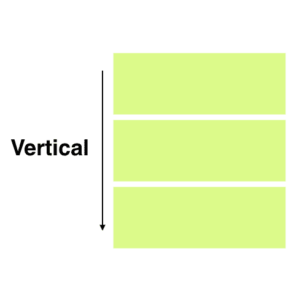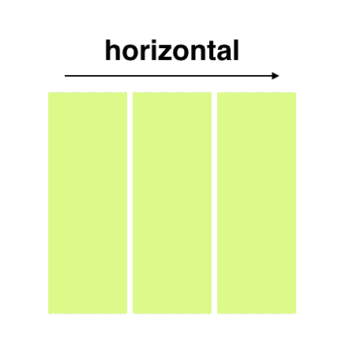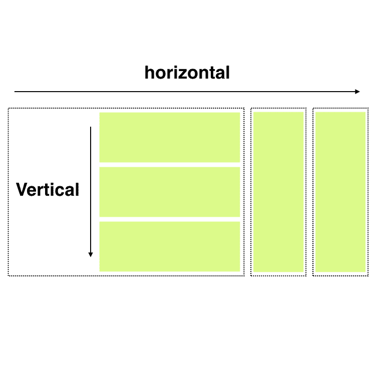

要创建一个垂直布局，您可以将类型设置为**垂直**，然后设置它的**组件**:

```
{  "items": [{    "type": "vertical",    "components": [      {        "type": "label",        "text": "First"      },       {        "type": "label",        "text": "Second"      },       {        "type": "label",        "text": "Third"      }    ]  }]}
```

水平布局也一样。只需将类型设置为**水平**即可:

```
{  "items": [{    "type": "horizontal",    "components": [      {        "type": "image",        "url": "http://i.giphy.com/LXONhtCmN32YU.gif"      },       {        "type": "label",        "text": "Rick"      }    ]  }]}
```

嵌套布局就像将一个布局指定为另一个布局的组件一样简单。

```
{  "items": [{    "type": "horizontal",    "components": [      {        "type": "image",        "url": "http://i.giphy.com/LXONhtCmN32YU.gif"      },       {        "type": "vertical",        "components": [{          "type": "label",          "text": "User"        }, {          "type": "label",          "text": "Rick"        }]      }    ]  }]}
```

为了简洁起见，我没有在这里讨论样式特性，但是您可以对每个单独的组件以及布局本身进行样式化，以确保布局看起来完全符合您的需要。你需要做的就是添加描述`font`、`size`、`width`、`height`、`color`、`background`、`corner_radius`、`opacity`等的`style`对象。

### 3.图层—又名 ***【绝对定位】***

有时，您可能希望在不滚动的情况下将项目精确地定位在屏幕的特定部分。在 CSS 术语中，我们称之为**“绝对定位”**。Jasonette 通过所谓的`layers`来支持这一点。

目前 layer 支持两种类型的子组件:`image`和`label`。你可以这样把这些组件放在屏幕上你想要的任何地方。这里有一个例子:


A Jasonette app with layer items

在这个例子中，我们在屏幕上有两个标签(温度和天气消息)和一个图像(相机图标)，它们的坐标已经被明确设置，以确保它们不会滚动。标记看起来会像这样:

```
{  "$jason": {    "body": {      "style": {        "background": "camera"      },      "layers": [        {          "type": "label",          "text": "22°C",          "style": {            "font": "HelveticaNeue-Light",            "size": "20",            "top": "50",            "left": "50%-100",            "width": "200",            "align": "center"          }        },        {          "type": "label",          "text": "few clouds",          "style": {            "font": "HelveticaNeue",            "size": "15"          }        },        {          "type": "image",          "url": "https://s3.amazonaws.com/.../camera%402x.png",          "style": {            "bottom": "100",            "width": "30",            "color": "#ffffff",            "right": "30"          }        }      ]    }  }}
```

令人惊讶的是，为了在移动设备上构建任何一种您可以想象的复杂视图，这就是您需要知道的全部。

就像您可以用简单的乐高积木搭建任何东西一样，您可以用不同的方式组合这些基本组件和布局，以创建任何复杂的视图。

下面是一些例子，100%由前面提到的 UI 元素组成:

*   [Instagram UI](https://github.com/Jasonette/Instagram-UI-example)
*   [推特用户界面](https://github.com/Jasonette/Twitter-UI-example)

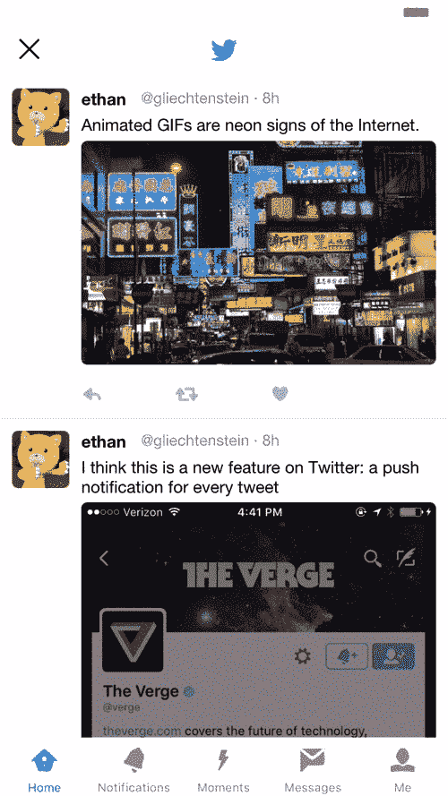

### 超越视野

如果你读到这里，你可能会想:

1.  “哇酷！我想试试这个！”，或者
2.  “是的，你或许可以构建一个玩具应用程序，但你不可能用这种方式构建一个生产应用程序！”

就像我上面简单提到的，这只是 Jasonette 的**【View】**部分，是最简单的部分。但是 Jasonette 真正强大的地方在于，你可以更进一步，用 JSON 编写一个完整的声明式程序[。](http://docs.jasonette.com/actions/)

您可以将动作附加到 UI 元素上，当用户触摸它们时就会触发这些动作。您还可以通过成功/错误回调一个接一个地触发这些操作。您还可以监听某些事件并自动触发这些操作。

就像这样，当你不仅可以描述一个**【视图】**，还可以描述**【模型】**和**【控制器】**逻辑(都在 JSON 里)**你就可以做任何事情**。

### 什么是可能的？

因为您需要的只是一个发送 JSON 的服务器，所以 Jasonette 是完全平台无关的。您不需要依赖任何专有的服务器技术。你需要的只是 JSON。

而 JSON 可以来自任何地方，从本地设备，到远程服务器，甚至到一个 [**树莓**](https://www.raspberrypi.org/documentation/remote-access/web-server/nginx.md) ！

1.  **有 web app？**:如果你已经有了一个 web app，你可以通过向你的 API 端点发出请求，立即为你的 **Node.js app，Rails app，Django app，PHP app，或者真正的任何 web app 建立一个移动原生 app，**只需。
2.  **您甚至不需要服务器:**因为您可以将整个模型-视图-控制器放在一个单独的、自包含的 JSON 文件中，所以您几乎可以从任何地方存储和提供它。您甚至可以从 Pastebin 或 Github 提供的静态 JSON 文件创建应用程序！
3.  **将任何 HTML 网站转换成应用:** Jasonette 有一个强大的 HTML-to-JSON 解析器，由 [cheerio 库](https://github.com/cheeriojs/cheerio)提供支持，可以将任何 HTML 转换成 JSON 对象。您已经知道我们有了 JSON 后可以做什么——您可以从转换后的 JSON 构建一个原生视图！这样你就可以从一个连 API 都没有的网站构建一个原生 app。当然，推荐的方式是尽可能使用 JSON，但不管怎样，这真的很酷。

我可以一直说下去，但这里有一些例子:

一个**照片分享应用**，它可以让你用手机摄像头拍一张照片并上传到 S3，然后将照片上传到你自己的服务器，创建一个订阅源:

[**Jasonette/S3-upload-example**](https://github.com/Jasonette/s3-upload-example)
[*S3-upload-example-一个 Jasonette 应用程序，使用＄network . upload*github.com](https://github.com/Jasonette/s3-upload-example)


一个 Node.js 驱动的 **Eliza 聊天机器人应用**用于 iOS 和 Android:

[**Jasonette/Eliza-example**](https://github.com/Jasonette/eliza-example)
[*Eliza-example-Eliza iPhone 上的 app*github.com](https://github.com/Jasonette/eliza-example)

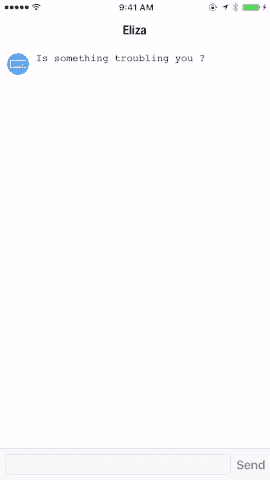

**一款微博应用**，配有会话管理:

[**Jasonette/token-authentic ation-example**](https://github.com/Jasonette/token-authentication-example)
[*token-authentic ation-example-一个 Jasonette 微博 app，用 rails(服务器端)构建，使用 design 实现…*github.com](https://github.com/Jasonette/token-authentication-example)

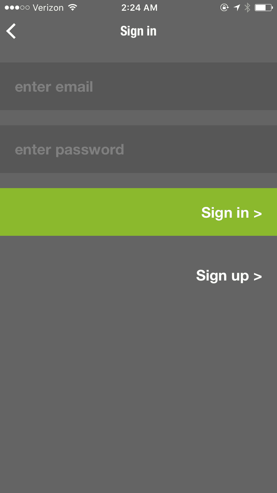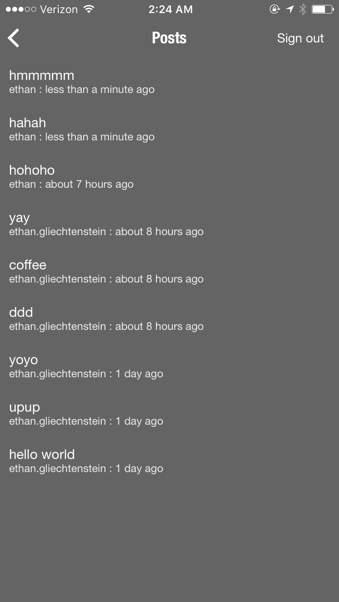

Slack 机器人的远程控制应用程序:

前几天，@shaunymca 在我们的 Slack 频道上分享了一个非常酷的项目。如果你仔细想想，这是一个…blog.jasonette.com

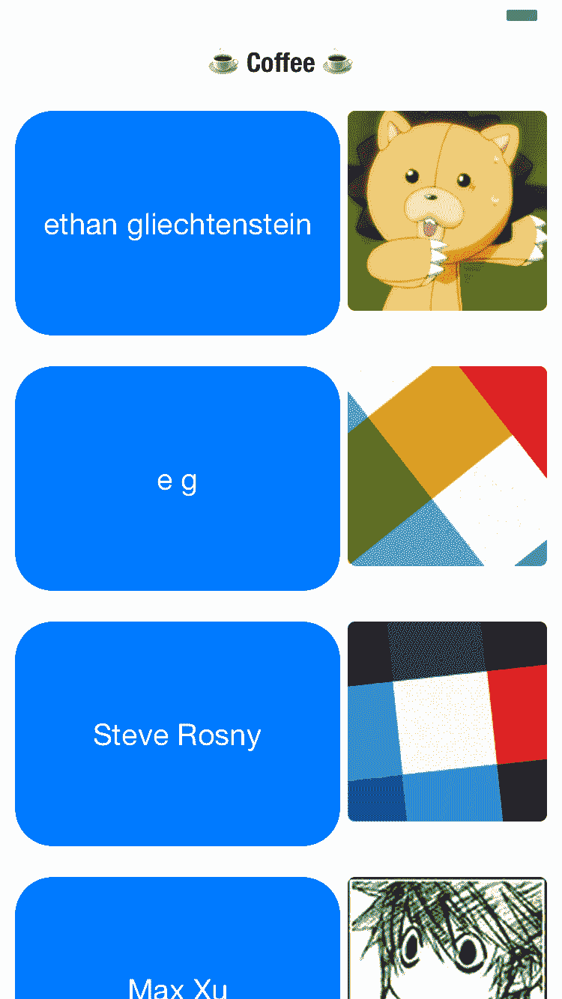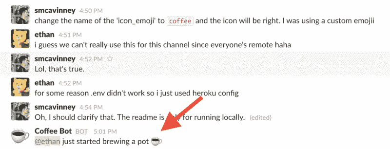

一个将 HTML 网页转换成 JSON，然后再转换成原生应用的示例应用:

[**gliechtenstein/iosdevweekly . json**](https://github.com/gliechtenstein/iosdevweekly.json)
[*iosdevweekly . JSON-iOS Dev Weekly 的原生 app，纯 JSON 中的 wrrten。*github.com](https://github.com/gliechtenstein/iosdevweekly.json)

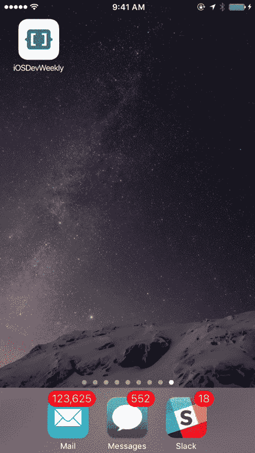

### 结论

Jasonette 是一个年轻的项目。我在 2016 年末开源了 iOS 版本[，一个月后开源了安卓版本](https://github.com/Jasonette/JASONETTE-iOS)[。](https://github.com/Jasonette/JASONETTE-Android)

但是它已经成长为一个充满活力的贡献者和创造者社区，并且正在积极发展中。我希望这项技术能够让任何人(不仅仅是开发者)毫不费力地构建应用。

听起来不错？点击查看网站[。](https://www.jasonette.com)

最后，你可以在这里找到 Github 库: [iOS](https://github.com/Jasonette/JASONETTE-iOS) 和 [Android](https://github.com/Jasonette/JASONETTE-Android) ( **投稿超欢迎！**)