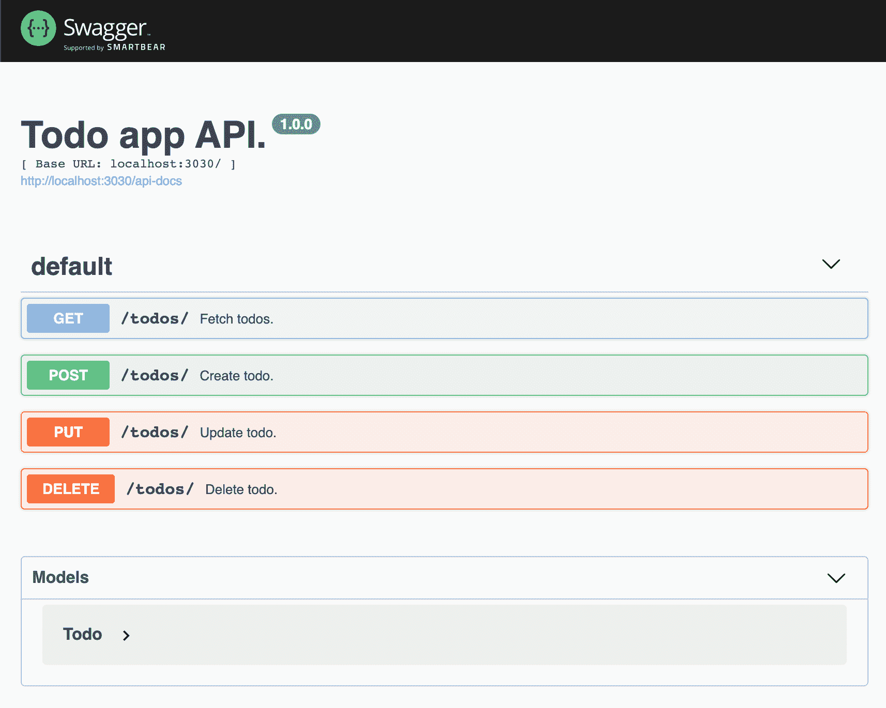

# 如何用 OpenAPI 在 Express 中构建更好的 API

> 原文：<https://www.freecodecamp.org/news/how-to-build-explicit-apis-with-openapi/>

在本文中，我将分享如何在 Express 中构建健壮的 REST APIs。首先，我将介绍构建 REST APIs 的一些挑战，然后提出一个使用开放标准的解决方案。

这篇文章不会是对 [Node.js](https://nodejs.org/en/) 、 [Express.js](https://expressjs.com/) 或 [REST API](https://www.freecodecamp.org/news/rest-apis/) s 的介绍。如果你需要复习，请确保在深入之前查看这些链接。🤿

我喜欢 Node.js 生态系统，因为它灵活易用。这个社区非常活跃，在几分钟之内，您就可以使用您已经知道的语言建立一个 REST API。

在应用程序的后端和前端之间共享相同的编程语言有很大的价值。这使得使用更少的[上下文切换](https://blog.rescuetime.com/context-switching/)来导航应用程序的代码库变得更加容易。全栈开发人员可以快速跨栈移动，共享代码[变得轻而易举。](https://betterprogramming.pub/sharing-logic-components-between-frontend-and-backend-repositories-6fdc1f9cb850)

也就是说，随着 MVP 成长为成熟的生产应用程序和开发团队，这种灵活性也带来了挑战。

## 使用 REST APIs 的挑战

无论您使用哪种技术，当代码库和团队成长时，都会面临许多挑战。

我将把这些挑战缩小到包含通过 REST API 公开的业务逻辑的 Express.js 应用程序。

无论 API 消费者的性质如何(网页、移动应用、第三方后端)，随着他们的成长，他们都可能面临以下一个(或多个)挑战:

### 1.⚠️:做出改变更难

当契约不明确时，对 REST API 的任何一方进行修改都会变得更加困难。

例如，您可能有一个返回特定用户名的 REST 端点。在接下来的特性中，您可能需要修改它来返回年龄。这可能会无声无息地打破 web 应用和移动应用。

您可以设置集成测试来缓解这个问题，但是您仍然严重依赖开发人员手动覆盖所有的边缘情况。这需要花费大量的时间和精力，而且你不能 100%确定这些改变不会破坏应用程序。

### 2.📜缺少(更新的)文件

在构建 REST APIs 时，文档是另一个敏感话题。我坚信，在大多数情况下，代码应该作为足够的文档。

也就是说，REST APIs 会变得越来越复杂，检查代码中每个端点的安全性、参数和可能的响应会变得冗长而耗时。这降低了开发的速度，并且 bug 会悄悄进入系统。

即使团队致力于在独立于代码的文档中手工保持文档的更新，也很难 100%确定它反映了代码。

### 3.📢公共 API

这并不适用于所有应用程序，但在某些情况下，应用程序可能需要向第三方公开一组功能。这样做时，第三方可能会在我们公开的 API 之上构建核心功能。

这意味着我们不能以更新私有 API 的速度来修改这些 API。第三方应用程序可能会崩溃，这是我们应该不惜一切代价避免的。

公共 API 公开的内容应该是显式的，并且开发起来简单，以限制内部和外部开发团队之间需要的来回通信量。

### 4.✍️手动集成测试

当应用程序在没有全面计划的情况下有机增长时，API 提供的东西和 API 消费者期望的东西很有可能被深埋在代码中。

当您有少量供内部使用的端点时，这不是一个大问题。但是随着 API 面的增长，修改现有的端点需要跟踪整个系统的面包屑，以确保消费者期望得到的与提供的相等。

这可以通过在与 REST API 对话的系统部分之间进行集成测试来缓解。但是手动操作是一项巨大的工作，如果做得不好，会提供系统将正常工作的虚假安全性。

## 拟议解决方案

我们已经看到了构建 REST APIs 所带来的一些固有挑战。在下一节中，我们将构建一个使用开放标准解决这些挑战的示例 Express 项目。

### API 标准规范

前一节中描述的挑战已经存在很长时间了，因此研究现有的解决方案是值得的，而不是重新发明轮子。

已经有很多标准化 REST API 定义的尝试( [RAML](https://raml.org/) ， [JsonAPI](https://jsonapi.org/) ， [OpenAPI](https://www.openapis.org/) ...).这些项目有一个共同的目标，那就是让开发人员更容易定义他们的 API 的行为方式，这样跨多种语言的服务器和客户机就可以“说同一种语言”。

拥有某种形式的 API 规范解决了许多挑战，因为在许多情况下，客户端 SDK、测试、模拟服务器和文档可以根据这些规范自动生成。

我最喜欢的一个是 OpenAPI(以前叫 Swagger)。它有一个很大的社区，以及大量的 Express 工具。这可能不是所有 REST API 项目的最佳工具，所以请记住做一些额外的研究，以确保围绕上述规范的工具和支持对您的情况有意义。

### 我们示例的上下文

为了这个例子，让我们假设我们正在构建一个待办事项列表管理应用程序。用户可以访问一个 web 应用程序，在那里他们可以获取，创建，编辑和删除待办事项，这些事项都保存在后端。

在这种情况下，后端将是一个 Express.js 应用程序，它将通过 REST API 公开以下功能:

*   获取 todos: **[GET] /todos**
*   创建待办事项:**【发布】/待办事项**
*   全部编辑:【放】/全部/:id
*   删除待办事项:**[删除]/待办事项/:id**

这是一个待办事项管理应用程序所需功能的过度简化，但将有助于展示我们如何在真实环境中克服上述挑战。

### 履行

很好，现在我们已经介绍了 API 定义和上下文的开放标准，让我们实现一个 Express todos 应用程序来解决前面的挑战。

我们将通过 Express 库 [**express-openapi**](https://github.com/kogosoftwarellc/open-api/tree/master/packages/express-openapi) 使用 OpenAPI。请注意，这个库提供了高级功能(响应验证、身份验证、中间件设置...)超出了本帖的范围。

完整的代码可以在 **[这个资源库](https://github.com/aperkaz/express-open-api)** 中找到。

1.  初始化 Express 框架并初始化 Git repo:

`npx express-generator --no-view --git todo-app`
`cd ./todo-app`
`git init`

2.添加 OpenAPI Express 库， **[express-openapi](https://github.com/kogosoftwarellc/open-api/tree/master/packages/express-openapi)** :

`npm i express-openapi -s`

```
// ./app.js

...

app.listen(3030);

...

// OpenAPI routes
initialize({
  app,
  apiDoc: require("./api/api-doc"),
  paths: "./api/paths",
});

module.exports = app; 
```

3.添加 OpenAPI 基础架构。

注意，模式定义了一个 **Todo** 的类型，它将在路由处理程序中被引用。

```
// ./api/api-doc.js

const apiDoc = {
  swagger: "2.0",
  basePath: "/",
  info: {
    title: "Todo app API.",
    version: "1.0.0",
  },
  definitions: {
    Todo: {
      type: "object",
      properties: {
        id: {
          type: "number",
        },
        message: {
          type: "string",
        },
      },
      required: ["id", "message"],
    },
  },
  paths: {},
};

module.exports = apiDoc; 
```

4.添加路线[处理程序](https://github.com/kogosoftwarellc/open-api/tree/master/packages/express-openapi#getting-started)。

每个处理程序声明它支持哪些操作(GET，POST...)、每个操作的回调以及该处理程序的 **apiDoc** OpenAPI 模式。

```
// ./api/paths/todos/index.js
module.exports = function () {
  let operations = {
    GET,
    POST,
    PUT,
    DELETE,
  };

  function GET(req, res, next) {
    res.status(200).json([
      { id: 0, message: "First todo" },
      { id: 1, message: "Second todo" },
    ]);
  }

  function POST(req, res, next) {
    console.log(`About to create todo: ${JSON.stringify(req.body)}`);
    res.status(201).send();
  }

  function PUT(req, res, next) {
    console.log(`About to update todo id: ${req.query.id}`);
    res.status(200).send();
  }

  function DELETE(req, res, next) {
    console.log(`About to delete todo id: ${req.query.id}`);
    res.status(200).send();
  }

  GET.apiDoc = {
    summary: "Fetch todos.",
    operationId: "getTodos",
    responses: {
      200: {
        description: "List of todos.",
        schema: {
          type: "array",
          items: {
            $ref: "#/definitions/Todo",
          },
        },
      },
    },
  };

  POST.apiDoc = {
    summary: "Create todo.",
    operationId: "createTodo",
    consumes: ["application/json"],
    parameters: [
      {
        in: "body",
        name: "todo",
        schema: {
          $ref: "#/definitions/Todo",
        },
      },
    ],
    responses: {
      201: {
        description: "Created",
      },
    },
  };

  PUT.apiDoc = {
    summary: "Update todo.",
    operationId: "updateTodo",
    parameters: [
      {
        in: "query",
        name: "id",
        required: true,
        type: "string",
      },
      {
        in: "body",
        name: "todo",
        schema: {
          $ref: "#/definitions/Todo",
        },
      },
    ],
    responses: {
      200: {
        description: "Updated ok",
      },
    },
  };

  DELETE.apiDoc = {
    summary: "Delete todo.",
    operationId: "deleteTodo",
    consumes: ["application/json"],
    parameters: [
      {
        in: "query",
        name: "id",
        required: true,
        type: "string",
      },
    ],
    responses: {
      200: {
        description: "Delete",
      },
    },
  };

  return operations;
}; 
```

5.添加自动生成的文档，**[swagger-ui-express](https://github.com/scottie1984/swagger-ui-express)**:

```
npm i swagger-ui-express -s 
```

```
// ./app.js

...

// OpenAPI UI
app.use(
  "/api-documentation",
  swaggerUi.serve,
  swaggerUi.setup(null, {
    swaggerOptions: {
      url: "http://localhost:3030/api-docs",
    },
  })
);

module.exports = app; 
```

这是我们将得到的:



Auto-generated SwaggerUi, at http://localhost:3030/api-documentation

🎉**恭喜你！**

如果您已经做到了这一步，那么您应该已经拥有了一个功能完整的 Express 应用程序，它完全集成了 OpenAPI。

使用*[http://localhost:3030/API-docs](http://localhost:3030/api-docs)*中可用的模式，我们现在可以轻松地生成[测试](https://nordicapis.com/generating-web-api-tests-from-an-openapi-specification/)、模拟服务器、[类型](https://github.com/drwpow/openapi-typescript)甚至是客户端！

## 结论

我们仅仅触及了 OpenAPI 的皮毛。但是我希望这篇文章能够揭示标准 API 定义模式如何在构建 REST APIs 时帮助提高可见性、测试、文档和整体信心。

谢谢你坚持到最后！

我目前正在构建[****taggr****](https://taggr.ai/)*，*一个跨平台的桌面应用程序，使用户能够 ****重新发现**** 他们的数字 ****记忆**** 同时保持他们的 ****隐私**** 。

open-alpha 即将在 Linux、Windows 和 Mac OS 上发布。请务必查看[网页](https://taggr.ai/)和[注册](https://taggr.us18.list-manage.com/subscribe/post?u=482d473aa1e4dedadc89fb3e2&id=aa6a10c164)，以免错过！