# 如何使用 React 和本地存储构建 freeCodeCamp 的菜谱框

> 原文：<https://www.freecodecamp.org/news/how-to-build-freecodecamps-recipe-box-using-react-and-local-storage-3f285a96fe44/>

作者:爱德华·恩乔洛格

# **如何使用 React 和本地存储构建 freeCodeCamp 的菜谱框**


The view of a recipe when its name is clicked on.

我在 2018 年 5 月 3 日完成了我的第一版自由代码营食谱盒项目。我把它放在[这里](https://forum.freecodecamp.org/t/check-out-my-recipe-box/177769/2)进行回顾。然后几个星期没查评论。当我回来时，我震惊地发现我忽略了表单中的一个重要特性。

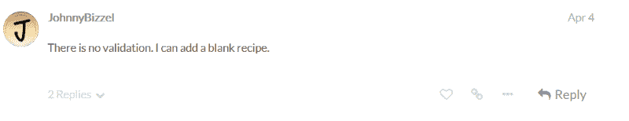

我知道。可怕的错误。我的表单允许创建一个空的食谱。这个疏忽显示了允许其他人审查你的代码的重要性。

原来我不是唯一一个错过这个重要功能的人。我检查了 freeCodeCamp 的食谱框示例项目([这里是](https://codepen.io/FreeCodeCamp/full/xVXWag/))，它缺少相同的特性。用户故事中也没有提到验证(这里是)。

我想，如果我在我的项目中包括验证，我可以尝试说服 freeCodeCamp 将我的食谱框作为这次挑战的示例项目。于是我重启了这个项目，在这个过程中我受到了启发，写下了这篇中型帖子。

### 制作配方盒

对于这个项目，我们将使用 create-react-app、React bootstrap 和 bootstrap CSS。

#### 步骤 1:设置 React 环境并添加 React 引导。

```
npx create-react-app recipe-box
npm install react-bootstrap --save
```

我们将创建一个类似于下图的文件目录:

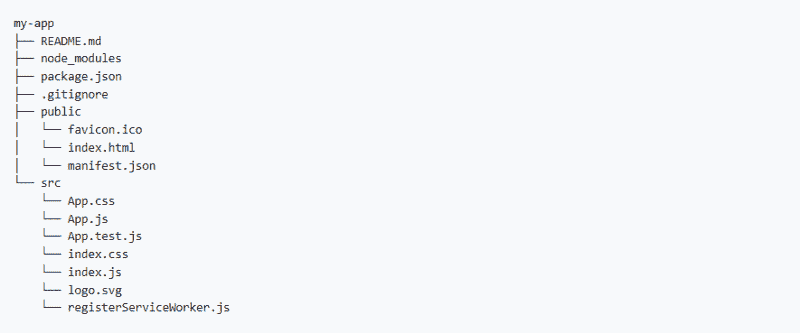

我们从 public 文件夹中删除 favicon.ico 和 manifest.json，从 src 文件夹中删除除 index.js 和 index.css 之外的所有内容。在 SRC 文件夹中，创建一个 components 文件夹和一个 CSS 文件夹。将 index.css 移动到 css 文件夹中。

#### 第二步:在 index.html 设置 html。

index.html 中:

```
<!DOCTYPE html>
<html lang="en">
  <head>
    <title>Recipe Box</title>
    <meta charset="utf-8">
    <meta name="viewport" content="width=device-width, initial-scale=1.0">
    <meta name="description" content="This is a Free Code Camp Project called Recipe Box">
    <meta name="keywords" content="HTML, CSS, JAVASCRIPT, REACTJS">
    <meta name="author" content="Your Name">
    <link rel="stylesheet" href="https://maxcdn.bootstrapcdn.com/bootstrap/3.3.7/css/bootstrap.min.css" integrity="sha384-BVYiiSIFeK1dGmJRAkycuHAHRg32OmUcww7on3RYdg4Va+PmSTsz/K68vbdEjh4u" crossorigin="anonymous">
    <link href="https://fonts.googleapis.com/css?family=Mina" rel="stylesheet">
  </head>
  <body>
    <!--set up a div where all the code will be rendered-->
    <div class="container" id="app"></div>
  </body>
</html>
```

#### 第三步:设置配方框的第一个视图。

在 index.js 中，我们在 state 中创建一个初始的食谱列表并显示它们。

在 index.js 中:

```
//import the necessary files
import React from 'react';
import ReactDOM from 'react-dom';
import {PanelGroup,Panel,Button,ButtonToolbar,ListGroup,ListGroupItem} from 'react-bootstrap';
import './css/index.css';
//create the main class for displaying the recipes
class Recipe extends React.Component {
  constructor(props) {
    super(props);
    this.state = {
      recipes: [
        {name: "Banana Smoothie", ingredients: ["2 bananas", "1/2 cup vanilla yogurt", "1/2 cup skim milk", "2 teaspoons honey", "pinch of cinnamon"]},
        {name: "Spaghetti", ingredients: ["Noodles", "Tomato Sauce", "Meatballs"]},
        {name: "Split Pea Soup", ingredients: ["1 pound split peas", "1 onion", "6 carrots", "4 ounces of ham"]}
      ]
    };
  }
  render() {
    const recipes = this.state.recipes;
    return(
      <div className="jumbotron">
        <h1>RECIPE BOX</h1>
        <PanelGroup accordion id="recipes">
          {recipes.map((recipe, index) => (
            <Panel eventKey={index} key={index}>
              <Panel.Heading>
                <Panel.Title className="title" toggle>{recipe.name}</Panel.Title>
              </Panel.Heading>
              <Panel.Body collapsible>
                <ListGroup>
                  {recipe.ingredients.map((ingredient, index) => (
                    <ListGroupItem key={index}>{ingredient}</ListGroupItem>
                  ))}
                </ListGroup>
                <ButtonToolbar>
                  <Button bsStyle="warning">Edit</Button>
                  <Button bsStyle="danger">Delete</Button>
                </ButtonToolbar>
              </Panel.Body>
            </Panel>
          ))}
        </PanelGroup>
        <Button bsStyle="primary">Add Recipe</Button>
      </div>
    );
  }
};

ReactDOM.render(<Recipe />, document.getElementById('app'));
```

在 index.css 中:

```
h1, li, .title {
  font-family: 'Mina';
}
h1, li {
  text-align: center;
}
.title {
  background-color: #D8BFD8;
  font-size: 20px;
}
li {
  list-style-type: none;
  font-size: 18px;
}
```

结果:


The recipe box.

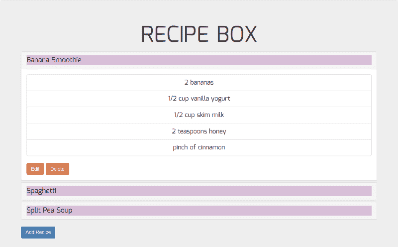

The view of a recipe when its name is clicked on.

#### 第四步:创建添加配方功能。

我们现在准备添加食谱。我们在 components 文件夹中创建一个名为 addrecipe.js 的文件。

食谱将通过模态形式添加。我们必须首先能够激活和停用模态。我们创建一个名为 showAdd 的状态，并将其设置为 false。然后，我们创建一个名为 showAddModal()的函数，如果 showAdd 当前为 false，它会将 showAdd 更改为 true，反之亦然。

单击“添加配方”按钮时，showAdd 将变为 true，并显示模式。因此，必须将 showAdd 和 showAddModal()作为 props 传递给 addrecipe.js。

要添加配方，将创建一个采用参数“配方”的 addRecipe()函数。它获取新配方的详细信息，并将它们推到配方状态数组的末尾。这个函数也将作为一个 prop 传递给 addrecipe.js。

在 index.js 中:

```
//import the necessary files
import React from 'react';
import ReactDOM from 'react-dom';
import {PanelGroup,Panel,Button,ButtonToolbar,ListGroup,ListGroupItem} from 'react-bootstrap';
import {AddRecipe} from './components/addrecipe';
import './css/index.css';
//create the main class for displaying the recipes
class Recipe extends React.Component {
  constructor(props) {
    super(props);
    this.state = {
      recipes: [
        {name: "Banana Smoothie", ingredients: ["2 bananas", "1/2 cup vanilla yogurt", "1/2 cup skim milk", "2 teaspoons honey", "pinch of cinnamon"]},
        {name: "Spaghetti", ingredients: ["Noodles", "Tomato Sauce", "Meatballs"]},
        {name: "Split Pea Soup", ingredients: ["1 pound split peas", "1 onion", "6 carrots", "4 ounces of ham"]}
      ],
      showAdd: false
    };
    this.showAddModal = this.showAddModal.bind(this);
    this.addRecipe = this.addRecipe.bind(this);
  }
  showAddModal() {//show the new recipe modal
    this.setState({showAdd: !this.state.showAdd});
  }
  addRecipe(recipe) {//create a new recipe
    let recipes = this.state.recipes;
    recipes.push(recipe);
    this.setState({recipes: recipes});
    this.showAddModal();
  }
  render() {
    const recipes = this.state.recipes;
    return(
      <div className="jumbotron">
        <h1>RECIPE BOX</h1>
        <PanelGroup accordion id="recipes">
          {recipes.map((recipe, index) => (
            <Panel eventKey={index} key={index}>
              <Panel.Heading>
                <Panel.Title className="title" toggle>{recipe.name}</Panel.Title>
              </Panel.Heading>
              <Panel.Body collapsible>
                <ListGroup>
                  {recipe.ingredients.map((ingredient, index) => (
                    <ListGroupItem key={index}>{ingredient}</ListGroupItem>
                  ))}
                </ListGroup>
                <ButtonToolbar>
                  <Button bsStyle="warning">Edit</Button>
                  <Button bsStyle="danger">Delete</Button>
                </ButtonToolbar>
              </Panel.Body>
            </Panel>
          ))}
        </PanelGroup>
        <Button bsStyle="primary" onClick={this.showAddModal}>Add Recipe</Button>
        <AddRecipe onShow={this.state.showAdd} onAdd={this.addRecipe} onAddModal={this.showAddModal} />
      </div>
    );
  }
};

ReactDOM.render(<Recipe />, document.getElementById('app'));
```

```
ReactDOM.render(<Recipe />, document.getElementById('app'));
```

在 addrecipe.js 中，我们创建了一个保存新配方名称和配方成分的状态，初始值是空字符串。然后，我们将在每次更改表单内容时更改状态，就像在减价时一样。这将使表单验证更容易。

我们没有显示表单错误进行验证，而是使用正则表达式来确保只在满足某些条件的情况下保存配方。这些条件是:

(a)“配方名称”和“配料”部分都不能为空，也就是说，两者都必须至少有一个字符。

(b)表单配方名称不能以空格开头。这确保了配方名称以至少一个字母数字字符或符号开头。

(c)表单配方配料不能以空格或逗号开头或结尾。这是因为配料将被逗号分割成一个数组，然后像我们当前的配料一样显示为一个列表。

该模式将有一个保存配方按钮，该按钮将被禁用，直到满足所有条件。当点击保存配方时，配方将被添加到我们的配方框中。

在 addrecipe.js 中:

```
//import the necessary files
import React from 'react';
import {Modal,ControlLabel,FormGroup,FormControl,Button} from 'react-bootstrap';

//create a class for displaying the modal for adding a new recipe and export it
export class AddRecipe extends React.Component {
  constructor(props) {//create a state to handle the new recipe
    super(props);
    this.state = {name: "", ingredients: ""};
    this.handleRecipeNameChange = this.handleRecipeNameChange.bind(this);
    this.handleRecipeIngredientsChange = this.handleRecipeIngredientsChange.bind(this);
    this.handleSubmit = this.handleSubmit.bind(this);
    this.handleCancel = this.handleCancel.bind(this);
  }
  handleRecipeNameChange(e) {//change the name to reflect user input
    this.setState({name: e.target.value});
  }
  handleRecipeIngredientsChange(e) {//change the ingredients to reflect user input
    this.setState({ingredients: e.target.value});
  }
  handleSubmit(e) {//get the recipe data, manipulate it and call the function for creating a new recipe
    e.preventDefault();
    const onAdd = this.props.onAdd;
    const regExp = /\s*,\s*/;
    var newName = this.state.name;
    var newIngredients = this.state.ingredients.split(regExp);
    var newRecipe = {name: newName, ingredients: newIngredients};
    onAdd(newRecipe);
    this.setState({name: "", ingredients: ""});
  }
  handleCancel() {
    const onAddModal = this.props.onAddModal;
    this.setState({name: "", ingredients: ""});
    onAddModal();
  }
  render() {
    const onShow = this.props.onShow;
    var regex1 = /^\S/;
    var regex2 = /^[^,\s]/;
   var regex3 = /[^,\s]$/;
    const validRecipe = regex1.test(this.state.name) && regex2.test(this.state.ingredients) && regex3.test(this.state.ingredients);
    return(
      <Modal show={onShow} onHide={this.handleCancel}>
        <Modal.Header closeButton>
          <Modal.Title>New Recipe</Modal.Title>
        </Modal.Header>
        <Modal.Body>
          <FormGroup controlId="formControlsName">
            <ControlLabel>Recipe Name</ControlLabel>
            <FormControl type="text" required onChange={this.handleRecipeNameChange} value={this.state.name} placeholder="Enter Name" />
          </FormGroup>
          <FormGroup controlId="formControlsIngredients">
            <ControlLabel>Recipe Ingredients</ControlLabel>
            <FormControl componentClass="textarea" type="text" required onChange={this.handleRecipeIngredientsChange} value={this.state.ingredients} placeholder="Enter Ingredients(separate by commas)" />
          </FormGroup>
        </Modal.Body>
        <Modal.Footer>
          <Button disabled={!validRecipe} bsStyle="success" onClick={this.handleSubmit}>Save Recipe</Button>
        </Modal.Footer>
      </Modal>
    );
  }
};
```

结果:

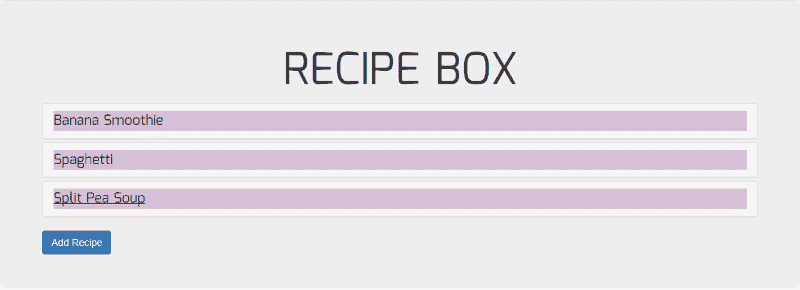

The recipe box.

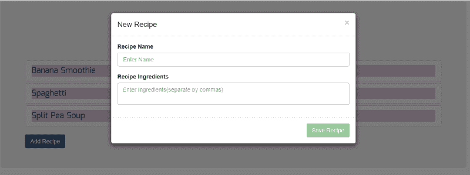

The blank modal that appears once the “Add Recipe” button is clicked.

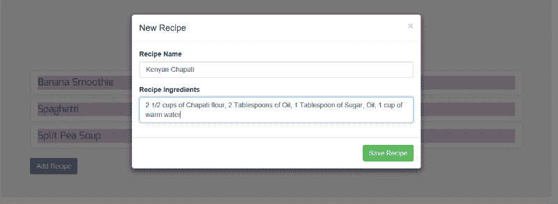

Filling in the form and submitting it.

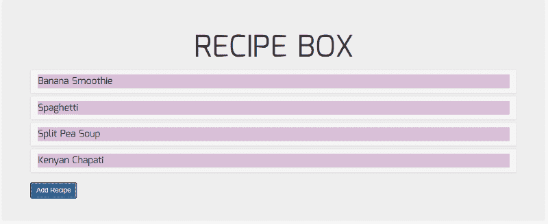

The updated recipe box.


The view of the new recipe when its name is clicked on.

#### 第五步:创建编辑配方功能。

我们现在准备编辑食谱。我们在 components 文件夹中创建一个名为 editrecipe.js 的文件。

配方将通过模态形式进行编辑。我们必须首先能够激活和停用模态。我们创建一个名为 showEdit 的状态，并将其设置为 false。然后我们创建一个名为 showEditModal()的函数，如果 showEdit 当前为 false，它会将 showEdit 更改为 true，反之亦然。当点击“编辑”按钮时，showEditModal()将运行，showEdit 将变为 true，并显示模态。

我们还需要一种方法来确保正确的食谱显示在表单字段上进行编辑。我们创建一个名为 currentlyEditing 的状态，并将其设置为 0。然后，我们确保表单上显示了 this . state . recipes[currently editing]的详细信息。

因为默认值为 0，所以每当单击编辑配方时，表单将只显示第一个配方的详细信息。我们需要一种方法来将 currentlyEditing 更新为我们想要显示的菜谱的索引。

在 showEditModal()中，我们将 index 作为参数传递，该参数将等于当前配方的索引。现在，当单击“编辑配方”按钮时，showEditModal()将运行，showEdit 将变为 true，currentlyEditing 将成为配方的索引，并且将显示带有正确配方信息的模式。因此，必须将 showEdit 和 showEditModal(index)作为 props 传递给 editrecipe.js。

要编辑一个配方，需要创建一个 editRecipe()函数，它接受参数 newName、newIngredients 和 currentlyEditing。在这个函数中，我们使用 currentlyEditing(现在是我们正在编辑的配方的索引)来标识该配方，并将其名称设置为新名称，将其配料设置为新配料。因此，editRecipe、我们需要编辑的配方和 currentlyEditing 必须作为道具传递给 editrecipe.js。

在 index.js 中:

```
//import the necessary files
import React from 'react';
import ReactDOM from 'react-dom';
import {PanelGroup,Panel,Button,ButtonToolbar,ListGroup,ListGroupItem} from 'react-bootstrap';
import {AddRecipe} from './components/addrecipe';
import {EditRecipe} from './components/editrecipe';
import './css/index.css';
//create the main class for displaying the recipes
class Recipe extends React.Component {
  constructor(props) {
    super(props);
    this.state = {
      recipes: [
        {name: "Banana Smoothie", ingredients: ["2 bananas", "1/2 cup vanilla yogurt", "1/2 cup skim milk", "2 teaspoons honey", "pinch of cinnamon"]},
        {name: "Spaghetti", ingredients: ["Noodles", "Tomato Sauce", "Meatballs"]},
        {name: "Split Pea Soup", ingredients: ["1 pound split peas", "1 onion", "6 carrots", "4 ounces of ham"]}
      ],
      showAdd: false,
      showEdit: false,
      currentlyEditing: 0
    };
    this.showAddModal = this.showAddModal.bind(this);
    this.showEditModal = this.showEditModal.bind(this);
    this.addRecipe = this.addRecipe.bind(this);
    this.editRecipe = this.editRecipe.bind(this);
  }
  showAddModal() {//show the new recipe modal
    this.setState({showAdd: !this.state.showAdd});
  }
  showEditModal(index) {//show the edit recipe modal
    this.setState({showEdit: !this.state.showEdit, currentlyEditing: index});
  }
  addRecipe(recipe) {//create a new recipe
    let recipes = this.state.recipes;
    recipes.push(recipe);
    this.setState({recipes: recipes});
    this.showAddModal();
  }
  editRecipe(newName, newIngredients, currentlyEditing) {//edit an existing recipe
    let recipes = this.state.recipes;
    recipes[currentlyEditing] = {name: newName, ingredients: newIngredients};
    this.setState({recipes: recipes});
    this.showEditModal(currentlyEditing);
  }
  render() {
    const recipes = this.state.recipes;
    return(
      <div className="jumbotron">
        <h1>RECIPE BOX</h1>
        <PanelGroup accordion id="recipes">
          {recipes.map((recipe, index) => (
            <Panel eventKey={index} key={index}>
              <Panel.Heading>
                <Panel.Title className="title" toggle>{recipe.name}</Panel.Title>
              </Panel.Heading>
              <Panel.Body collapsible>
                <ListGroup>
                  {recipe.ingredients.map((ingredient, index) => (
                    <ListGroupItem key={index}>{ingredient}</ListGroupItem>
                  ))}
                </ListGroup>
                <ButtonToolbar>
                  <Button bsStyle="warning" onClick={() => {this.showEditModal(index)}}>Edit</Button>
                  <Button bsStyle="danger">Delete</Button>
                </ButtonToolbar>
              </Panel.Body>
              <EditRecipe onShow={this.state.showEdit} onEdit={this.editRecipe} onEditModal={() => {this.showEditModal(this.state.currentlyEditing)}} currentlyEditing={this.state.currentlyEditing} recipe={recipes[this.state.currentlyEditing]} />
            </Panel>
          ))}
        </PanelGroup>
        <Button bsStyle="primary" onClick={this.showAddModal}>Add Recipe</Button>
        <AddRecipe onShow={this.state.showAdd} onAdd={this.addRecipe} onAddModal={this.showAddModal} />
      </div>
    );
  }
};

ReactDOM.render(<Recipe />, document.getElementById('app'));
ReactDOM.render(<Recipe />, document.getElementById('app'));
```

在 editrecipe.js 中:

```
//import the necessary files
import React from 'react';
import {Modal,ControlLabel,FormGroup,FormControl,Button} from 'react-bootstrap';

//create a class for displaying the modal for editing an existing recipe and export it
export class EditRecipe extends React.Component {
  constructor(props) {//create a state to handle the recipe to be edited
    super(props);
    this.state = {name: "", ingredients: ""};
    this.handleRecipeNameChange = this.handleRecipeNameChange.bind(this);
    this.handleRecipeIngredientsChange = this.handleRecipeIngredientsChange.bind(this);
    this.handleEdit = this.handleEdit.bind(this);
    this.handleCancel = this.handleCancel.bind(this);
  }
  static getDerivedStateFromProps(props, state) {//make the recipe prop a state
    const prevName = state.prevName;
    const prevIngredients = state.prevIngredients;
    const name = prevName !== props.recipe.name ? props.recipe.name : state.name;
    const ingredients = prevIngredients !== props.recipe.ingredients.join(",") ? props.recipe.ingredients.join(",") : state.ingredients;
    return {
      prevName: props.recipe.name, name,
      prevIngredients: props.recipe.ingredients.join(","), ingredients,
    }
  }
  handleRecipeNameChange(e) {//change the name to reflect user input
    this.setState({name: e.target.value});
  }
  handleRecipeIngredientsChange(e) {//change the ingredients to reflect user input
    this.setState({ingredients: e.target.value});
  }
  handleEdit(e) {//get the recipe data, manipulate it and call the function for editing an existing recipe
    e.preventDefault();
    const onEdit = this.props.onEdit;
    const currentlyEditing = this.props.currentlyEditing;
    const regExp = /\s*,\s*/;
    var name = this.state.name;
    var ingredients = this.state.ingredients.split(regExp);
    onEdit(name, ingredients, currentlyEditing);
  }
  handleCancel() {
    const onEditModal = this.props.onEditModal;
    this.setState({name: this.props.recipe.name, ingredients: this.props.recipe.ingredients.join(",")});
    onEditModal();
  }
  render() {
    const onShow = this.props.onShow;
    var regex1 = /^\S/;
    var regex2 = /^[^,\s]/;
    var regex3 = /[^,\s]$/;
    const validRecipe = regex1.test(this.state.name) && regex2.test(this.state.ingredients) && regex3.test(this.state.ingredients);
    return(
      <Modal show={onShow} onHide={this.handleCancel}>
        <Modal.Header closeButton>
          <Modal.Title>Edit Recipe</Modal.Title>
        </Modal.Header>
        <Modal.Body>
          <FormGroup controlId="formControlsName">
            <ControlLabel>Recipe Name</ControlLabel>
            <FormControl type="text" required onChange={this.handleRecipeNameChange} value={this.state.name} placeholder="Enter Name" />
          </FormGroup>
          <FormGroup controlId="formControlsIngredients">
            <ControlLabel>Recipe Ingredients</ControlLabel>
            <FormControl componentClass="textarea" type="text" required onChange={this.handleRecipeIngredientsChange} value={this.state.ingredients} placeholder="Enter Ingredients(separate by commas)" />
          </FormGroup>
        </Modal.Body>
        <Modal.Footer>
          <Button disabled={!validRecipe} bsStyle="success" onClick={this.handleEdit}>Save Recipe</Button>
        </Modal.Footer>
      </Modal>
    );
  }
};
```

结果:


The recipe box.

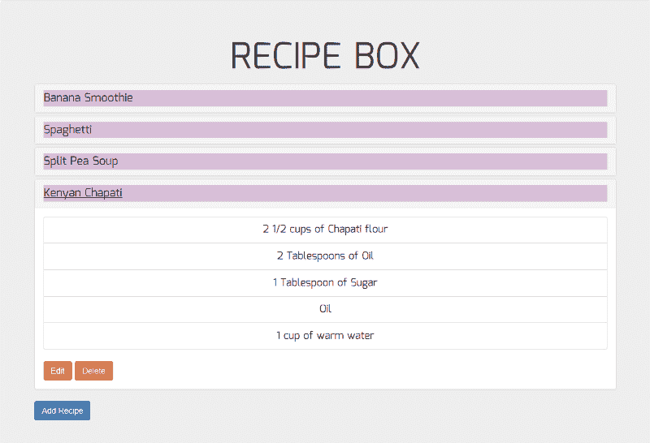

The view of a recipe when its name is clicked on.

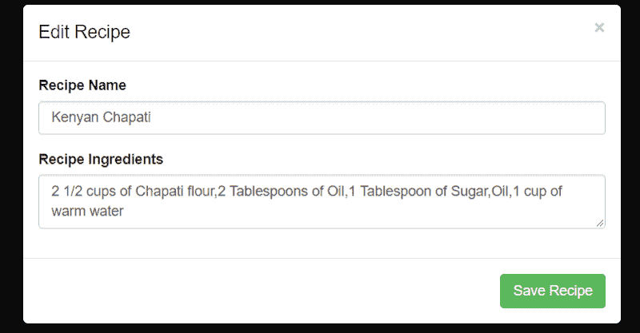

The view of the recipe’s edit modal.

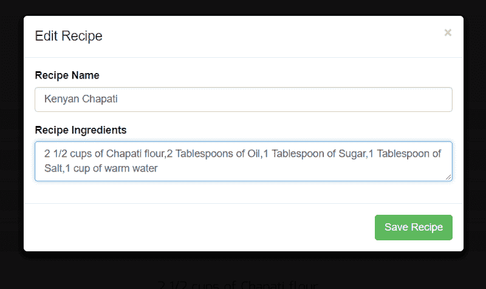

The ingredients have been edited. “Oil” has been replaced with “1 Tablespoon of Salt”.


The edited version of the recipe.

在 editRecipe.js 中，我们创建了一个保存要编辑的配方的名称和成分的状态，并将初始值设置为空字符串。然后，我们使用 React 的新生命周期方法 getDerivedStateFromProps，使我们的 recipe prop 的名称和成分成为我们州的新名称和成分。这样做的方法在这里的[中解释得很清楚。](https://reactjs.org/blog/2018/05/23/react-v-16-4.html#bugfix-for-getderivedstatefromprops)

然后，我们将在每次更改表单内容时更改状态，并像添加新配方时一样验证表单。

#### *步骤 6:创建删除配方功能。*

我们现在准备删除配方。此步骤不需要创建新文件。

要删除一个配方，将创建一个采用参数索引的 deleteRecipe()函数。在此功能中，我们使用配方的索引来标识要删除的配方。我们将使用 JavaScript 的 splice 方法来删除菜谱。然后我们将 currentlyEditing 设置为 0，只是为了重置 recipe 框，也就是说，我们不希望 currentlyEditing 仍然是一个不再存在的 recipe 的索引。

在 index.js 中:

```
//import the necessary files
import React from 'react';
import ReactDOM from 'react-dom';
import {PanelGroup,Panel,Button,ButtonToolbar,ListGroup,ListGroupItem} from 'react-bootstrap';
import {AddRecipe} from './components/addrecipe';
import {EditRecipe} from './components/editrecipe';
import './css/index.css';
//create the main class for displaying the recipes
class Recipe extends React.Component {
  constructor(props) {
    super(props);
    this.state = {
      recipes: [
        {name: "Banana Smoothie", ingredients: ["2 bananas", "1/2 cup vanilla yogurt", "1/2 cup skim milk", "2 teaspoons honey", "pinch of cinnamon"]},
        {name: "Spaghetti", ingredients: ["Noodles", "Tomato Sauce", "Meatballs"]},
        {name: "Split Pea Soup", ingredients: ["1 pound split peas", "1 onion", "6 carrots", "4 ounces of ham"]}
      ],
      showAdd: false,
      showEdit: false,
      currentlyEditing: 0
    };
    this.showAddModal = this.showAddModal.bind(this);
    this.showEditModal = this.showEditModal.bind(this);
    this.addRecipe = this.addRecipe.bind(this);
    this.editRecipe = this.editRecipe.bind(this);
    this.deleteRecipe = this.deleteRecipe.bind(this);
  }
  showAddModal() {//show the new recipe modal
    this.setState({showAdd: !this.state.showAdd});
  }
  showEditModal(index) {//show the edit recipe modal
    this.setState({showEdit: !this.state.showEdit, currentlyEditing: index});
  }
  addRecipe(recipe) {//create a new recipe
    let recipes = this.state.recipes;
    recipes.push(recipe);
    this.setState({recipes: recipes});
    this.showAddModal();
  }
  editRecipe(newName, newIngredients, currentlyEditing) {//edit an existing recipe
    let recipes = this.state.recipes;
    recipes[currentlyEditing] = {name: newName, ingredients: newIngredients};
    this.setState({recipes: recipes});
    this.showEditModal(currentlyEditing);
  }
  deleteRecipe(index) {//delete an existing recipe
    let recipes = this.state.recipes.slice();
    recipes.splice(index, 1);
    this.setState({recipes: recipes, currentlyEditing: 0});
  }
  render() {
    const recipes = this.state.recipes;
    return(
      <div className="jumbotron">
        <h1>RECIPE BOX</h1>
        <PanelGroup accordion id="recipes">
          {recipes.map((recipe, index) => (
            <Panel eventKey={index} key={index}>
              <Panel.Heading>
                <Panel.Title className="title" toggle>{recipe.name}</Panel.Title>
              </Panel.Heading>
              <Panel.Body collapsible>
                <ListGroup>
                  {recipe.ingredients.map((ingredient, index) => (
                    <ListGroupItem key={index}>{ingredient}</ListGroupItem>
                  ))}
                </ListGroup>
                <ButtonToolbar>
                  <Button bsStyle="warning" onClick={() => {this.showEditModal(index)}}>Edit</Button>
                  <Button bsStyle="danger" onClick={() => {this.deleteRecipe(index)}}>Delete</Button>
                </ButtonToolbar>
              </Panel.Body>
              <EditRecipe onShow={this.state.showEdit} onEdit={this.editRecipe} onEditModal={() => {this.showEditModal(this.state.currentlyEditing)}} currentlyEditing={this.state.currentlyEditing} recipe={recipes[this.state.currentlyEditing]} />
            </Panel>
          ))}
        </PanelGroup>
        <Button bsStyle="primary" onClick={this.showAddModal}>Add Recipe</Button>
        <AddRecipe onShow={this.state.showAdd} onAdd={this.addRecipe} onAddModal={this.showAddModal} />
      </div>
    );
  }
};

ReactDOM.render(<Recipe />, document.getElementById('app'));
```

结果:

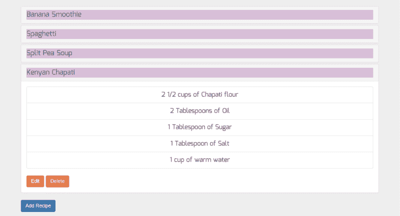

The recipe box.

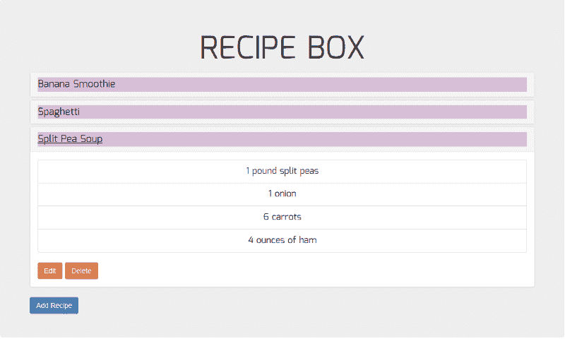

The recipe box after the “Kenyan Chapati” recipe is deleted.


The updated recipe box.

#### *步骤 7:添加本地存储。*

HTML 5 Web 存储允许 Web 应用程序在用户的浏览器中本地存储数据。有两种 web 存储对象:

(a)会话存储:会话存储存储一个会话的数据，当浏览器标签关闭时数据丢失。

(b)本地存储:本地存储无限期存储数据。当浏览器关闭时，数据不会被删除，并且由于没有截止日期，数据将一直可用。

为了添加本地存储，我们将把配方状态更改为空数组。我们将首先从本地存储中获取食谱，然后将我们的食谱状态设置为这些食谱。我们将使用生命周期方法 componentDidMount，因为我们希望在组件呈现后加载本地存储。每当我们添加、编辑或删除食谱时，我们也将更新本地存储。

因此，例如，如果我们删除了我们最初的 3 个食谱中的一个并重新加载页面，我们将看不到我们删除的食谱。当我们清空本地存储并重新加载页面时，我们将再次看到我们删除的原始食谱。

在 index.js 中:

```
//import the necessary files
import React from 'react';
import ReactDOM from 'react-dom';
import {PanelGroup,Panel,Button,ButtonToolbar,ListGroup,ListGroupItem} from 'react-bootstrap';
import './css/index.css';
import {AddRecipe} from './components/addrecipe';
import {EditRecipe} from './components/editrecipe';
//create the main class for displaying the recipes
class Recipe extends React.Component {
  constructor(props) {
    super(props);
    this.state = {
      recipes: [],
      showAdd: false,
      showEdit: false,
      currentlyEditing: 0
    };
    this.showAddModal = this.showAddModal.bind(this);
    this.showEditModal = this.showEditModal.bind(this);
    this.addRecipe = this.addRecipe.bind(this);
    this.editRecipe = this.editRecipe.bind(this);
    this.deleteRecipe = this.deleteRecipe.bind(this);
  }
  componentDidMount() {//load the local storage data after the component renders
    var recipes = (typeof localStorage["recipes"] !== "undefined") ? JSON.parse(localStorage.getItem("recipes")) : [
      {name: "Banana Smoothie", ingredients: ["2 bananas", "1/2 cup vanilla yogurt", "1/2 cup skim milk", "2 teaspoons honey", "pinch of cinnamon"]},
      {name: "Spaghetti", ingredients: ["Noodles", "Tomato Sauce", "Meatballs"]},
      {name: "Split Pea Soup", ingredients: ["1 pound split peas", "1 onion", "6 carrots", "4 ounces of ham"]}
    ];
    this.setState({recipes: recipes});
  }
  showAddModal() {//show the new recipe modal
    this.setState({showAdd: !this.state.showAdd});
  }
  showEditModal(index) {//show the edit recipe modal
    this.setState({currentlyEditing: index, showEdit: !this.state.showEdit});
  }
  addRecipe(recipe) {//create a new recipe
    let recipes = this.state.recipes;
    recipes.push(recipe);
    localStorage.setItem('recipes', JSON.stringify(recipes));
    this.setState({recipes: recipes});
    this.showAddModal();
  }
  editRecipe(newName, newIngredients, currentlyEditing) {//edit an existing recipe
    let recipes = this.state.recipes;
    recipes[currentlyEditing] = {name: newName, ingredients: newIngredients};
    localStorage.setItem('recipes', JSON.stringify(recipes));
    this.setState({recipes: recipes});
    this.showEditModal(currentlyEditing);
  }
  deleteRecipe(index) {//delete an existing recipe
    let recipes = this.state.recipes.slice();
    recipes.splice(index, 1);
    localStorage.setItem('recipes', JSON.stringify(recipes));
    this.setState({recipes: recipes, currentlyEditing: 0});
  }
  render() {
    const recipes = this.state.recipes;
    var currentlyEditing = this.state.currentlyEditing;
    return(
      <div className="jumbotron">
        <h1>RECIPE BOX</h1>
        <PanelGroup accordion id="recipes">
          {recipes.map((recipe, index) => (
            <Panel eventKey={index} key={index}>
              <Panel.Heading>
                <Panel.Title className="title" toggle>{recipe.name}</Panel.Title>
              </Panel.Heading>
              <Panel.Body collapsible>
                <ListGroup>
                  {recipe.ingredients.map((ingredient, index) => (
                    <ListGroupItem key={index}>{ingredient}</ListGroupItem>
                  ))}
                </ListGroup>
                <ButtonToolbar>
                  <Button bsStyle="warning" onClick={() => {this.showEditModal(index)}}>Edit</Button>
                  <Button bsStyle="danger" onClick={() => {this.deleteRecipe(index)}}>Delete</Button>
                </ButtonToolbar>
              </Panel.Body>
              <EditRecipe onShow={this.state.showEdit} onEdit={this.editRecipe} onEditModal={() => {this.showEditModal(currentlyEditing)}} currentlyEditing={currentlyEditing} recipe={recipes[currentlyEditing]} />
            </Panel>
          ))}
        </PanelGroup>
        <Button bsStyle="primary" onClick={this.showAddModal}>Add Recipe</Button>
        <AddRecipe onShow={this.state.showAdd} onAdd={this.addRecipe} onAddModal={this.showAddModal} />
      </div>
    );
  }
};

ReactDOM.render(<Recipe />, document.getElementById('app'));
```

结果:


The recipe box.


The view of a recipe when its name is clicked on.


The recipe box after “Split Pea Soup” has been deleted.

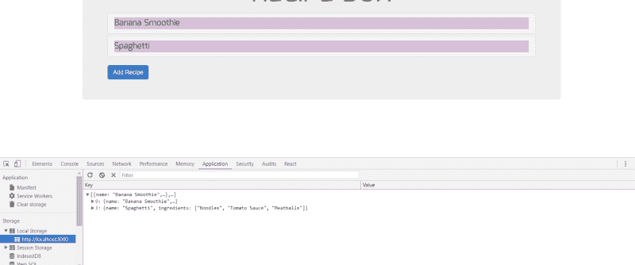

The updated recipe box and the local storage.

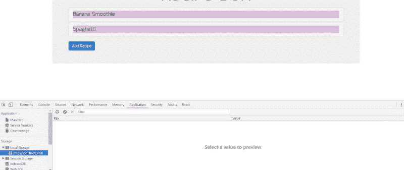

Local storage has been cleared.

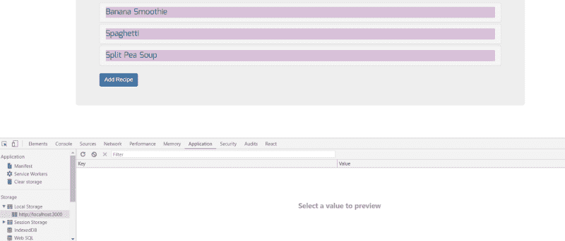

The view of the recipe box after local storage has been cleared and the web page reloaded.

### 在 GitHub 上发布

我们完成了制作食谱盒。是时候把它发布到 GitHub 上，并为它创建一个 GitHub 页面了。

在 GitHub 上，创建一个名为 recipe-box 的新存储库。

转到命令行上的文件目录，键入以下内容:

```
git init
git add README.md
git commit -m "initial commit"
git remote add origin https://github.com/yourusername/recipe-box.git
git push -u origin master
```

你的代码现在在 GitHub 上。现在是时候为存储库创建 GitHub 页面了。这应该是 package.json 文件的当前状态:

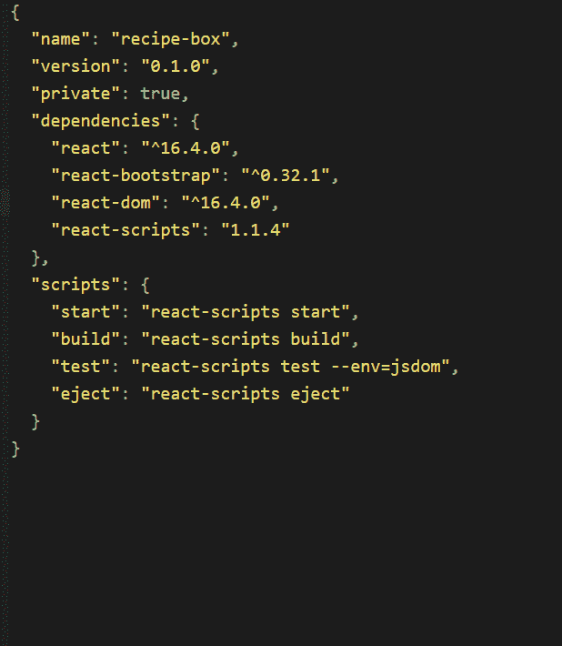

package.json file

在命令行上，我们运行:

```
npm install gh-pages --save-dev
```

将安装 GitHub 页面。然后，我们必须指定我们的“主页”URL，并在 package.json 的“脚本”中预先部署和部署代码。

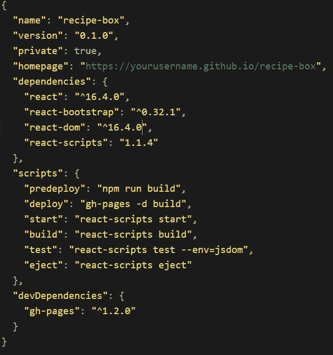

updated package.json file

在命令行上，我们运行:

```
npm run deploy
git add .
git commit -m "created a github page for the repository"
git push origin master
```

我们现在有了食谱框的 GitHub 页面，它的 URL 是 package.json 的“homepage”中指定的。

项目已经完成。作为参考，你可以查看我的 GitHub 库[这里](https://github.com/edkahara/recipe-box)。

### **结论**

这无疑是一个令人激动的挑战。我喜欢和你分享这个。我希望你从中学到了一些东西。

感谢您的阅读。