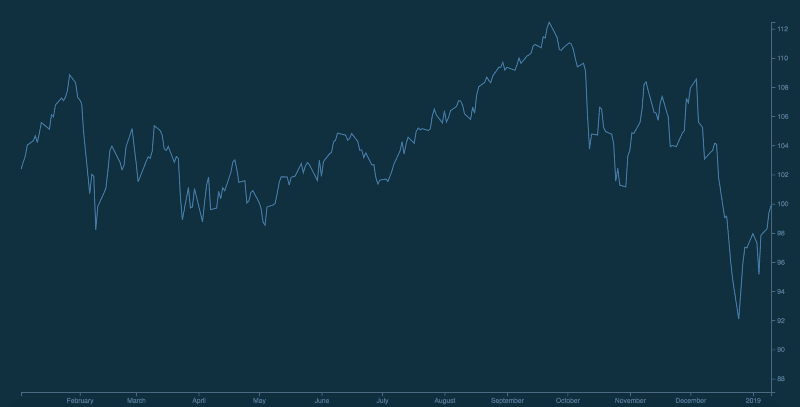
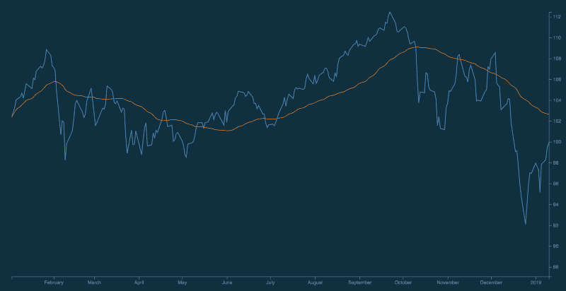
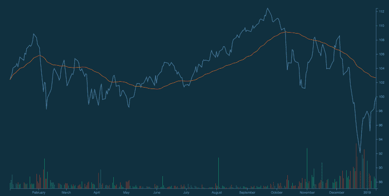
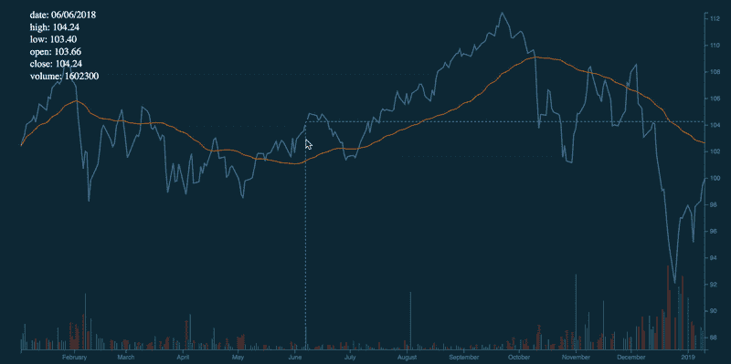

# 如何用 D3.js 构建历史价格图表

> 原文：<https://www.freecodecamp.org/news/how-to-build-historical-price-charts-with-d3-js-72214aaf6ba3/>

#### 一步一步实现财务数据集可视化的方法

在多种设备和平台上交流数据和显示这些可视化效果是一个挑战。

> “数据就像原油一样。它很有价值，但如果未经提炼，就不能真正使用。”——[麦可尔·柏默](https://ana.blogs.com/maestros/2006/11/data_is_the_new.html)

D3(数据驱动文档)解决了这个由来已久的难题。它为开发人员和分析人员提供了完全自由地为 Web 构建定制可视化的能力。D3.js 允许我们将数据绑定到 DOM(文档对象模型)。然后应用数据驱动的转换来创建数据的精确可视化。

在本教程中，我们将了解如何让 D3.js 库为我们服务。

#### 入门指南

我们将构建一个图表，展示一种金融工具在一段时间内的变化。这种可视化类似于雅虎财经提供的价格图表。我们将分解呈现跟踪特定[股票](https://sg.finance.yahoo.com/quote/VIG/chart?p=VIG)的交互式价格图表所需的各种组件。

所需组件:

1.  数据的加载和解析
2.  SVG element
3.  x 和 Y 轴
4.  收盘价格折线图
5.  带一些计算的简单移动平均曲线图
6.  卷系列条形图
7.  将鼠标悬停在十字准线和图例上

#### 数据的加载和解析

```
const loadData = d3.json('sample-data.json').then(data => {
  const chartResultsData = data['chart']['result'][0];
  const quoteData = chartResultsData['indicators']['quote'][0];
  return chartResultsData['timestamp'].map((time, index) => ({
    date: new Date(time * 1000),
    high: quoteData['high'][index],
    low: quoteData['low'][index],
    open: quoteData['open'][index],
    close: quoteData['close'][index],
    volume: quoteData['volume'][index]
  }));
});
```

首先，我们将使用 [fetch](https://github.com/d3/d3-fetch) 模块加载我们的样本数据。D3-fetch 还支持其他格式，如 TSV 和 CSV 文件。然后，数据将被进一步处理以返回一个对象数组。每个对象都包含交易时间戳、最高价、最低价、开盘价、收盘价和交易量。

```
body {
  background: #00151c;
}
#chart {
  background: #0e3040;
  color: #67809f;
}
```

添加上述基本 CSS 属性来个性化您的图表样式，以获得最大的视觉吸引力。

#### 追加 SVG 元素

```
const initialiseChart = data => {
  const margin = { top: 50, right: 50, bottom: 50, left: 50 };
  const width = window.innerWidth - margin.left - margin.right;
  const height = window.innerHeight - margin.top - margin.bottom; 
  // add SVG to the page
  const svg = d3
    .select('#chart')
    .append('svg')
    .attr('width', width + margin['left'] + margin['right'])
    .attr('height', height + margin['top'] + margin['bottom'])
    .call(responsivefy)
    .append('g')
    .attr('transform', `translate(${margin['left']},  ${margin['top']})`);
```

随后，我们可以使用`append()`方法将 SVG 元素添加到带有`e id,`图表的`<d` iv >元素中。接下来，我们使用`e the` attr()方法来指定 SVG 元素的宽度和高度。然后我们称之为`l the responsi` vefy()方法(最初由 Brendan Sudol 编写 [en)。这允许 SVG 元素通过监听窗口调整事件来获得响应能力。](https://brendansudol.com/writing/responsive-d3)

记得在使用来自`margin`常量的值翻译 SVG 元素之前，将 SVG 组元素附加到上面的 SVG 元素。

#### 渲染 X 和 Y 轴

在渲染轴组件之前，我们需要定义我们的域和范围，这将用于创建轴的比例

```
// find data range
const xMin = d3.min(data, d => {
  return d['date'];
});
const xMax = d3.max(data, d => {
  return d['date'];
});
const yMin = d3.min(data, d => {
  return d['close'];
});
const yMax = d3.max(data, d => {
  return d['close'];
});
// scales for the charts
const xScale = d3
  .scaleTime()
  .domain([xMin, xMax])
  .range([0, width]);
const yScale = d3
  .scaleLinear()
  .domain([yMin - 5, yMax])
  .range([height, 0]);
```

收盘价折线图的 x 轴和 y 轴分别由交易日和收盘价组成。因此，我们必须使用`d3.max()`和`d3.min()`来定义最小和最大 x 和 y 值。然后我们可以利用 [D3 刻度](https://github.com/d3/d3-scale)的`scaleTime()`和`scaleLinear()`分别创建 x 轴上的时间刻度和 y 轴上的线性刻度。刻度的范围由我们的 SVG 元素的宽度和高度定义。

```
// create the axes component
svg
  .append('g')
  .attr('id', 'xAxis')
  .attr('transform', `translate(0, ${height})`)
  .call(d3.axisBottom(xScale));
svg
  .append('g')
  .attr('id', 'yAxis')
  .attr('transform', `translate(${width}, 0)`)
  .call(d3.axisRight(yScale));
```

在这一步之后，我们需要将第一个`g`元素添加到 SVG 元素中，SVG 元素调用`d3.axisBottom()`方法，将`xScale`作为参数来生成 x 轴。然后，x 轴被平移到图表区的底部。类似地，在将 y 轴平移到图表区域的右侧之前，通过追加`g`元素，调用 d3.axisRight()并以`yScale`作为参数来生成 y 轴。

#### 呈现收盘价折线图

```
// generates close price line chart when called
const line = d3
  .line()
  .x(d => {
    return xScale(d['date']);
  })
  .y(d => {
    return yScale(d['close']);
  });
// Append the path and bind data
svg
 .append('path')
 .data([data])
 .style('fill', 'none')
 .attr('id', 'priceChart')
 .attr('stroke', 'steelblue')
 .attr('stroke-width', '1.5')
 .attr('d', line);
```

现在，我们可以在主 SVG 元素中添加`[path](https://developer.mozilla.org/en-US/docs/Web/SVG/Tutorial/Paths)`元素，然后传递我们解析的数据集`data`。我们用助手函数`line`设置属性`d`。其中调用了`d3.line()`方法。该行的`x`和`y`属性接受匿名函数并分别返回日期和收盘价。

现在，您的图表应该是这样的:



Checkpoint #1: Close price line chart, with the X and Y Axes.

#### 呈现简单的移动平均曲线

我们不再单纯依赖收盘价作为唯一的技术指标，而是使用简单移动平均线。该平均值确定了特定证券的上涨趋势和下跌趋势。

```
const movingAverage = (data, numberOfPricePoints) => {
  return data.map((row, index, total) => {
    const start = Math.max(0, index - numberOfPricePoints);
    const end = index;
    const subset = total.slice(start, end + 1);
    const sum = subset.reduce((a, b) => {
      return a + b['close'];
    }, 0);
    return {
      date: row['date'],
      average: sum / subset.length
    };
  });
};
```

我们定义我们的辅助函数`movingAverage`来计算简单移动平均线。该函数接受两个参数，即数据集和价格点或周期的数量。然后，它返回一个对象数组，每个对象包含每个数据点的日期和平均值。

```
// calculates simple moving average over 50 days
const movingAverageData = movingAverage(data, 49);
// generates moving average curve when called
const movingAverageLine = d3
 .line()
 .x(d => {
  return xScale(d['date']);
 })
 .y(d => {
  return yScale(d['average']);
 })
  .curve(d3.curveBasis);
svg
  .append('path')
  .data([movingAverageData])
  .style('fill', 'none')
  .attr('id', 'movingAverageLine')
  .attr('stroke', '#FF8900')
  .attr('d', movingAverageLine);
```

对于我们当前的上下文，`movingAverage()`计算 50 天内的简单移动平均线。与收盘价线图类似，我们在主 SVG 元素中追加了`path`元素，然后传递我们的移动平均数据集，并用我们的辅助函数`movingAverageLine`设置属性`d`。与上面唯一不同的是，我们通过`d3.curveBasis`到`d3.line().curve()`是为了实现一个弯道。

这导致简单的移动平均线覆盖在我们当前图表的顶部:



Checkpoint #2: Orange curve, which depicts the simple moving average. This gives us a better idea of the price movement.

#### 呈现卷系列条形图

对于这个组件，我们将以占据相同 SVG 元素的彩色编码条形图的形式呈现 trade [volume](https://commodity.com/technical-analysis/volume/) 。当股票收盘价高于前一天的收盘价时，条形是绿色的。当股票收盘低于前一天的收盘价时，它们是红色的。这说明了每个交易日的交易量。这可以和上面的图表一起用来分析价格变动。

```
/* Volume series bars */
const volData = data.filter(d => d['volume'] !== null && d['volume']   !== 0);
const yMinVolume = d3.min(volData, d => {
  return Math.min(d['volume']);
});
const yMaxVolume = d3.max(volData, d => {
  return Math.max(d['volume']);
});
const yVolumeScale = d3
  .scaleLinear()
  .domain([yMinVolume, yMaxVolume])
  .range([height, 0]);
```

交易量系列条形图的 x 轴和 y 轴分别由交易日期和交易量组成。因此，我们需要重新定义最小和最大 y 值，并利用 y 轴上的`scaleLinear()`。这些刻度的范围由我们的 SVG 元素的宽度和高度定义。我们将重用`xScale`,因为条形图的 x 轴类似地对应于交易日。

```
svg
  .selectAll()
  .data(volData)
  .enter()
  .append('rect')
  .attr('x', d => {
    return xScale(d['date']);
  })
  .attr('y', d => {
    return yVolumeScale(d['volume']);
  })
  .attr('fill', (d, i) => {
    if (i === 0) {
      return '#03a678';
    } else {  
      return volData[i - 1].close > d.close ? '#c0392b' : '#03a678'; 
    }
  })
  .attr('width', 1)
  .attr('height', d => {
    return height - yVolumeScale(d['volume']);
  });
```

本节依赖于您对`selectAll()`方法如何与`enter()`和`append()`方法一起工作的理解。如果你不熟悉这些方法，你可能希望读一下[这本](https://bost.ocks.org/mike/join/)(由[迈克·博斯托克](https://bost.ocks.org/mike/)亲自撰写)。这可能很重要，因为这些方法被用作[进入-更新-退出](https://bost.ocks.org/mike/join/)模式的一部分，我可能会在后续教程中介绍这一点。

为了呈现条形，我们将首先使用`.selectAll()`返回一个空选择，或者一个空数组。接下来，我们通过`volData`来定义每个条的高度。`enter()`方法将`volData`数据集与当前为空的`selectAll()`中的选择进行比较。目前，DOM 不包含任何`<re` ct >元素。因此`, the ap` pend()方法接受一个 arg `ument` 'rect ',它为 volData 中的每个 singl `e objec` t 在 DOM 中创建`a new` < rect >元素。

下面是条形属性的分类。我们将使用以下属性:`x`、`y`、`fill`、`width`和`height`。

```
.attr('x', d => {
  return xScale(d['date']);
})
.attr('y', d => {
  return yVolumeScale(d['volume']);
})
```

第一个`attr()`方法定义了 x 坐标。它接受一个返回日期的匿名函数。类似地，第二个`attr()`方法定义了 y 坐标。它接受一个返回卷的匿名函数。这些将定义每个条的位置。

```
.attr('width', 1)
.attr('height', d => {
  return height - yVolumeScale(d['volume']);
});
```

我们给每个条分配 1 个像素的宽度。要使条从顶部(由`y`定义)延伸到 x 轴，只需用`y`值减去高度。

```
.attr('fill', (d, i) => {
  if (i === 0) {
    return '#03a678';
  } else {  
    return volData[i - 1].close > d.close ? '#c0392b' : '#03a678'; 
  }
})
```

还记得条形的颜色编码方式吗？我们将使用`fill`属性来定义每个条形的颜色。对于收盘价高于前一天收盘价的股票，条形图将显示为绿色。否则，该条将为红色。

您当前的图表应该是这样的:



Checkpoint #3: Volume series chart, represented by red and green bars.

#### 渲染十字线和图例以实现交互性

我们已经到了本教程的最后一步，我们将生成一个显示垂直线的鼠标悬停十字准线。将鼠标悬停在图表中的各个点上将导致图例更新。这为我们提供了每个交易日的完整信息(开盘价、收盘价、最高价、最低价和成交量)。

以下部分引用自 [Micah Stubb 的优秀范例](https://bl.ocks.org/micahstubbs/e4f5c830c264d26621b80b754219ae1b)。

```
// renders x and y crosshair
const focus = svg
  .append('g')
  .attr('class', 'focus')
  .style('display', 'none');
focus.append('circle').attr('r', 4.5);
focus.append('line').classed('x', true);
focus.append('line').classed('y', true);
svg
  .append('rect')
  .attr('class', 'overlay')
  .attr('width', width)
  .attr('height', height)
  .on('mouseover', () => focus.style('display', null))
  .on('mouseout', () => focus.style('display', 'none'))
  .on('mousemove', generateCrosshair);
d3.select('.overlay').style('fill', 'none');
d3.select('.overlay').style('pointer-events', 'all');
d3.selectAll('.focus line').style('fill', 'none');
d3.selectAll('.focus line').style('stroke', '#67809f');
d3.selectAll('.focus line').style('stroke-width', '1.5px');
d3.selectAll('.focus line').style('stroke-dasharray', '3 3');
```

十字准线由一个半透明的圆圈组成，圆圈的垂直线由虚线组成。上面的代码块提供了单个元素的样式。鼠标悬停时，它将根据下面的函数生成十字准线。

```
const bisectDate = d3.bisector(d => d.date).left;
function generateCrosshair() {
  //returns corresponding value from the domain
  const correspondingDate = xScale.invert(d3.mouse(this)[0]);
  //gets insertion point
  const i = bisectDate(data, correspondingDate, 1);
  const d0 = data[i - 1];
  const d1 = data[i];
  const currentPoint = correspondingDate - d0['date'] > d1['date'] - correspondingDate ? d1 : d0;

  focus.attr('transform',`translate(${xScale(currentPoint['date'])},     ${yScale(currentPoint['close'])})`);
focus
  .select('line.x')
  .attr('x1', 0)
  .attr('x2', width - xScale(currentPoint['date']))
  .attr('y1', 0)
  .attr('y2', 0);
focus
  .select('line.y')
  .attr('x1', 0)
  .attr('x2', 0)
  .attr('y1', 0)
  .attr('y2', height - yScale(currentPoint['close']));
 updateLegends(currentPoint);
}
```

然后，我们可以利用 [d3.bisector()](https://github.com/d3/d3-array#bisect) 方法来定位插入点，这将在收盘价线图上突出显示最近的数据点。确定`currentPoint`后，下线将被更新。`updateLegends()`方法使用`currentPoint`作为参数。

```
const updateLegends = currentData => {  d3.selectAll('.lineLegend').remove();
```

```
const updateLegends = currentData => {
  d3.selectAll('.lineLegend').remove();
  const legendKeys = Object.keys(data[0]);
  const lineLegend = svg
    .selectAll('.lineLegend')
    .data(legendKeys)
    .enter()
    .append('g')
    .attr('class', 'lineLegend')
    .attr('transform', (d, i) => {
      return `translate(0, ${i * 20})`;
    });
  lineLegend
    .append('text')
    .text(d => {
      if (d === 'date') {
        return `${d}: ${currentData[d].toLocaleDateString()}`;
      } else if ( d === 'high' || d === 'low' || d === 'open' || d === 'close') {
        return `${d}: ${currentData[d].toFixed(2)}`;
      } else {
        return `${d}: ${currentData[d]}`;
      }
    })
    .style('fill', 'white')
    .attr('transform', 'translate(15,9)');
  };
```

`updateLegends()`方法通过在收盘线图上显示所选鼠标悬停点的日期、开盘价、收盘价、最高价、最低价和成交量来更新图例。类似于量条形图，我们将利用`selectAll()`方法和`enter()`和`append()`方法。

为了呈现图例，我们将使用`.selectAll('.lineLegend')`来选择图例，然后调用`remove()`方法来移除它们。接下来，我们传递图例的键，`legendKeys`，它将用于定义每个条的高度。调用`enter()`方法，比较`volData`数据集和当前为空的`selectAll()`中的选择。目前，DOM 不包含任何`<re` ct >元素。因此`, the ap` pend()方法接受一个 arg`ument` ‘rect ’,它为 volData 中的每个 singl `e objec` t 在 DOM 中创建`a new` < rect >元素。

接下来，为图例添加各自的属性。我们通过将价格转换为两位小数来进一步处理这些值。为了可读性，我们还将 date 对象设置为默认区域设置。

这将是最终结果:



Checkpoint #4: Mouseover any part of the chart!

#### 结束语

恭喜你！您已经到达本教程的结尾。如上所述，D3.js 简单而动态。它允许您为所有数据集创建自定义可视化。在接下来的几周，我将发布本系列的第二部分，深入探讨 D3.js 的进入-更新-退出模式。同时，你可能希望查看一下 [API 文档](https://github.com/d3/d3/wiki)、[更多教程](https://github.com/d3/d3/wiki/Tutorials)、[其他用 D3.js](https://github.com/d3/d3/wiki/Gallery) 构建的有趣可视化。

随意查看本教程的[源代码](https://github.com/wentjun/d3-historical-price-chart-basic)以及[完整演示](https://wentjun.com/d3-historical-price-chart-basic/)。谢谢你，我希望你今天学到了新的东西！

特别感谢 Debbie Leong 审阅本文。