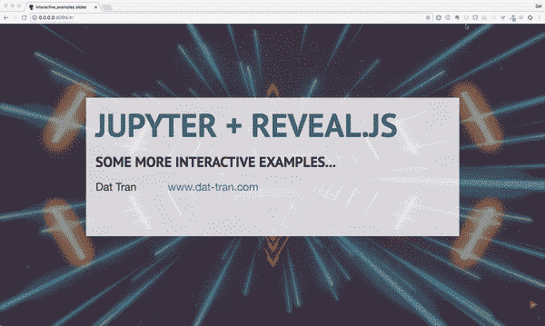
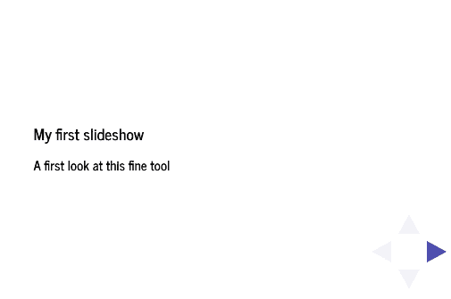
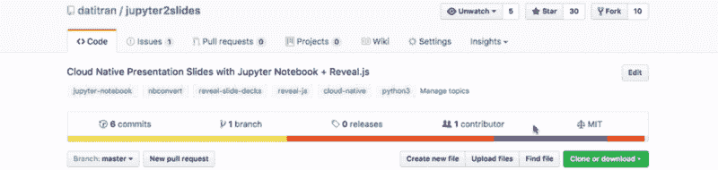

# 如何抛弃 PowerPoint，用 Jupyter 和 Reveal.js 制作更好的幻灯片

> 原文：<https://www.freecodecamp.org/news/how-to-build-interactive-presentations-with-jupyter-notebook-and-reveal-js-c7e24f4bd9c5/>

由 Dat Tran 提供

# 如何抛弃 PowerPoint，用 Jupyter 和 Reveal.js 制作更好的幻灯片

Image Credit: [Rafael Araujo on Pinterest](https://www.pinterest.de/pin/498562621241369901/)

在这篇文章中，我将介绍[Jupyter 2 slides](https://github.com/datitran/jupyter2slides)——我的一个小项目，让你使用 [Jupyter](http://jupyter.org/) 笔记本和 [reveal.js](http://lab.hakim.se/reveal-js/#/) 轻松创建漂亮的交互式演示幻灯片。

它看起来是这样的:

[http://interactive-slides.cfapps.io/](http://interactive-slides.cfapps.io/#/)

这是相应的 PDF，用 [DeckTape](https://github.com/astefanutti/decktape) 生成:

### 我建造这个的动机

微软 PowerPoint 很酷。它就像顾问的瑞士军刀，你可以用它做出漂亮的幻灯片。

不过，说到代码，PowerPoint 糟透了。解决方法是使用 reveal.js，你可以使用 markdown 突出显示代码，它是有响应的。但是和[乳胶](https://www.latex-project.org/)一样，可以很繁琐。

使用 reveal.js 的另一种方式是通过 Jupyter，它提供了许多优势:

*   通过自动语法突出显示、缩进和制表符补全对代码进行浏览器内编辑
*   能够运行代码，并将计算结果附加到生成代码的代码上(识字编程)
*   支持 [Markdown](https://en.wikipedia.org/wiki/Markdown) 和许多媒体格式，如 HTML、LaTex、音频和图像
*   支持交互式小部件来操作和可视化数据
*   使用来自 [PyData 堆栈](https://www.numfocus.org/)的工具，如 Matplotlib、Numpy 和 Bokeh，以及其他工具，如 [Plotly](https://plot.ly/) 和[叶子](https://folium.readthedocs.io/en/latest/)

要在 Jupyter 中使用 reveal.js，您需要创建一个笔记本，并使用 [nbconvert](http://nbconvert.readthedocs.io/en/stable/) 来获取 reveal.js 幻灯片。但是标准设计很无聊:

Check out [IPython Slides Viewer](http://slideviewer.herokuapp.com/) for some other “default” examples.

### 我的解决方案

我做过一个项目，可以让你生成漂亮的演示幻灯片。完整的代码在我的 GitHub repo 上。在引擎盖下，它仍然将`nbconvert`与 reveal.js 一起使用，但我对其进行了扩展:

*   添加设计更简洁的自定义主题
*   默认启用[标题页脚插件](https://github.com/e-gor/Reveal.js-Title-Footer)
*   默认情况下启用幻灯片编号
*   添加 Jupyter 笔记本模板，包括封面和分隔幻灯片、降价语法等示例
*   通过使用 [Flask](http://flask.pocoo.org/) 和 Python buildpack，更容易将演示推送到 [Cloud Foundry](https://www.cloudfoundry.org/)
*   包括使用 [DeckTape](https://github.com/astefanutti/decktape) 将幻灯片导出为 PDF 的选项

### 如何开始

要创建您自己的演示文稿，请在 GitHub 上克隆 [repo 并阅读它的自述文件。](https://github.com/datitran/jupyter2slides)

Clone the [repo](https://github.com/datitran/jupyter2slides) to get started.

我希望这个项目将来对你有用。我期待看到其他人在像 [PyData](https://pydata.org/) 这样的会议上使用这个模板。我欢迎任何改进幻灯片设计的反馈以及其他人对代码库的贡献。

如果你觉得这篇文章有用，给我击掌吧？？这样其他人也可以找到它，并分享给你的朋友。在 Medium (Da [t Tran)](https://medium.com/@datitran) 或 Twitter (@d [atitran)](https://twitter.com/datitran) 上关注我，了解我的最新作品。感谢阅读！