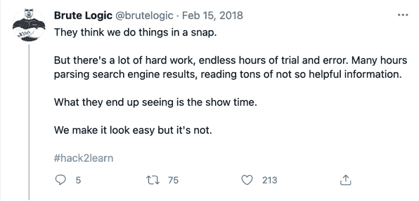

# 如何一步一步构建编程项目

> 原文：<https://www.freecodecamp.org/news/how-to-build-programming-projects/>

这条关于建设项目的推文真的引起了我的共鸣:

它说了很多关于程序员如何构建我们都钦佩的项目。它指出了我们活动中不太吸引人的部分，这些部分初学者可能因为缺乏经验而不经常注意。

这让我想起了我最近构建 VSCode 扩展的经历。这次延期是为了让我看起来像视频教程中的天才，并减少我的录制挑战。(但是，嘿，我真的不是天才😜).

每当按下任意键时，扩展显示每个字符的文件内容。它模拟了真实的编码体验，而我只关注语音记录。哇！我是怎么做到的？好吧，让我们看看进展如何。

这可能是不言而喻的，但是在实际构建之前，您不知道如何构建一个新项目。在我开始之前，我不知道该做什么，该带什么。但是我确信一件事——我知道如何找到我需要的东西。嘣！研究开始了。

所以让我告诉你我是怎么做的，这样你也可以更好地构建你自己的项目。

## 将项目分解成更小的单元

Photo by [Markus Spiske](https://unsplash.com/@markusspiske?utm_source=ghost&utm_medium=referral&utm_campaign=api-credit) / [Unsplash](https://unsplash.com/?utm_source=ghost&utm_medium=referral&utm_campaign=api-credit)

我知道很难找到一个完整的关于我想要构建的教程。但是相对容易找到与项目每个单元相关的教程。所以，我把这个项目分成几个部分:

1.  安装 VSCode 扩展。
2.  获取活动文件的内容。
3.  将文件内容分解成字符。(Word => w，o，r，d)。
4.  听按键声。
5.  每当按下任意键时，逐个显示字符。

这些是我期望扩展能够处理的基本事情。

但是等等！如果我正在建立一个完整的网站呢？不要担心，这仍然是同样的过程。如果我也想建一个网站，我也会这么做。

### 第一步:把所有东西分成几部分

对于一个网站，可管理的部分可能如下所示:

1.  页眉
2.  主要的
3.  边栏
4.  页脚

### 步骤 2:将这些部分分解成组件

为了做到这一点，我会问自己在每一部分我想要什么。然后我会逐一列出这些元素。

✅标题:我想在标题中的标志，搜索框，注册/登录按钮(或其他导航按钮)和设置。

✅·梅恩:我需要几个专栏？它必须包括左侧或右侧边栏或列表吗？

✅页脚:我想在页脚版权信息和导航吗？还有别的吗？

然后我会问自己还想要什么，并在想到的时候记下来。

简而言之，你必须在每个部分和组件中列出你想要的一切。但是不要在计划上浪费太多时间，因为执行力是关键。尽可能快地做，因为一旦你有了工作，你可能几乎没有多余的时间来计划你的项目。

但是你可能会想，哦，不！我很困惑。作为初学者，我如何知道我需要的所有章节和组件？

这是一个很好的观察，因为我不是初学者，我有所有这些组件的经验。这就是为什么我可以很容易地列出它们。

但是没关系。你会学到所有这些东西。你只需要关注我的 VSCode 扩展故事。:)

## 写下你的第一行代码，获取 Stuck‌

Photo by [Fernando Jorge](https://unsplash.com/@fx24?utm_source=ghost&utm_medium=referral&utm_campaign=api-credit) / [Unsplash](https://unsplash.com/?utm_source=ghost&utm_medium=referral&utm_campaign=api-credit)

在对要构建什么有了清晰的认识之后，我认为启动一个项目最重要的事情是编写第一行代码，然后陷入困境。这是悲观的，但它帮助你成为解决方案驱动。

不要因为不知道如何开始而不必要地担心，打开你选择的代码编辑器，写下你的第一行代码——即使你在那之后卡住了。

你的第一行代码可能会被删除或改进几次，这没关系。这是为了帮助你克服拖延症。

现实中，你总会对如何开始，做什么感到迷茫。不要因为这样的感觉而拖延，尤其是在你脑子里或者纸上明白了项目应该如何运作之后。

在写第一行代码之前，不要试图理解所有的东西。你永远不会明白一切。至少，还没有人了解过一切。

## 没有一个项目是完美的——包括 Google‌

Photo by [Brett Jordan](https://unsplash.com/@brett_jordan?utm_source=ghost&utm_medium=referral&utm_campaign=api-credit) / [Unsplash](https://unsplash.com/?utm_source=ghost&utm_medium=referral&utm_campaign=api-credit)

想要你的项目成为有史以来最好的是很容易的，尤其是当你是一个初学者的时候。我去过那里，所以我知道那是什么感觉。

我只是一个艺术生，试图用网络技术解决一个问题。在我因为付不起他们所报的价格而未能雇佣一个网站开发者来为我构建这个项目后，我决定学习如何自己构建它。

愚蠢的我试图在互联网上构建几乎所有的功能，以确保我的项目拥有其他人没有的所有功能。总之，我最终扼杀了这个项目。

我想说的是，不要试图建立一个不能被批评的项目——没有那样的东西。您需要关注核心特性，而不是可能导致项目不可用的额外特性。

不要试图做一个完美的项目或功能，而是要做一些有用的、可爱的项目和功能。

## 每个项目都建立在其他项目的基础上

Photo by [Lidya Nada](https://unsplash.com/@lidyanada?utm_source=ghost&utm_medium=referral&utm_campaign=api-credit) / [Unsplash](https://unsplash.com/?utm_source=ghost&utm_medium=referral&utm_campaign=api-credit)

在我对构建 VSCode 扩展所需的东西有了清晰的了解之后，我必须研究相关的项目。我打开了 vscode-hacker-typer 的源代码，研究这个项目是如何处理我想实现的一些东西的。通过这样做，我了解了一些关于 VSCode 扩展 API 的知识。

由于我在制作 VSCode 扩展方面完全没有经验，所以研究 vscode-hacker-typer 帮助我从完全不知所措转变到知道要研究什么。

知道你想处理的东西的名字是解决任何编程问题的最重要的第一步。

例如，假设在相关网站上有一个你喜欢的功能，但你不知道它叫什么。你将如何研究这个特性？这不是火箭科学。

你可以拍下这个特性的照片，在编程组里询问它的名字，或者问别人。或者你可以像我一样，通过钻研相关项目的源代码来发现它的名称或 API。因此，检查与你的项目相似的项目，向他们学习，并复制他们的特点。

## 不要害怕谷歌

Photo by [Mitchell Luo](https://unsplash.com/@mitchel3uo?utm_source=ghost&utm_medium=referral&utm_campaign=api-credit) / [Unsplash](https://unsplash.com/?utm_source=ghost&utm_medium=referral&utm_campaign=api-credit)

在我开始创建 VSCode 扩展之前，我甚至不知道从哪里开始——但是我确信我能够找到合理的方法。我开始搜索不同的问题:

✅如何获得一个 VSCode 活动编辑器的内容？

✅如何使用 VSCode activeTextEditor？

如何使用 vscode ondidtextdocumentchange？

诸如此类。

理解你想要构建什么是获得相关搜索结果的第一步，尤其是在构建一个你从未构建过的项目时。你需要将你想要实现的想法或特性概念化，这样你才能找到你需要的解决方案。

### 可以帮助你获得更好结果的基本谷歌搜索技巧

#### 知道自己关心的关键词。

例如，如果我想建立一个只有 HTML 和 CSS 的登陆页面，我不会搜索“如何建立一个登陆页面”。那会带来很多我不想要的东西。它必须包括我关心的关键词。

以下是可供研究的例子:

*   如何用 HTML 和 CSS 搭建登陆页面？
*   如何用 Typescript 做一个 VSCode 扩展(如果我要 Typescript 的话)？
*   如何用 JavaScript 做一个 VSCode 扩展？

确保你期望的关键词被包括在内——要具体。

Googling(如何用 HTML 和 CSS 搭建登陆页面？)可能会产生一般结果。这是一个问题。但是可以通过精确匹配来修复。

#### 使用引号在谷歌中获得精确匹配

例如，“如何用 HTML 和 CSS 建立一个登陆页面”会给你一个搜索结果。

如果你想探索建立一个登录页面的一般想法，删除引号。

#### 排除带有(-)的搜索词

有时候，你只想要 HTML 和 CSS 的结果，但是你得到的是 HTML、CSS 和 JavaScript 的结果。

您可以使用“- JavaScript”来排除 JavaScript。例如，你可以搜索“如何用 HTML 和 CSS - JavaScript 构建登陆页面”。

当您想要排除某些关键字时，这很有用。

#### 改变你的条件

当您想从一种语言、库或框架迁移到另一种语言、库或框架时，您需要使用您从第一种语言或框架中了解的所有知识。

例如，您想从 JavaScript 迁移到 Python，并且您知道 JavaScript 如何工作。在使用 Python 时，您之前所有的 JavaScript 搜索术语或方法仍然非常有用。

你只需要切换出你的特定术语——在你所有的搜索中用 Python 替换 JavaScript。然后，你可以谷歌“Python 中的数组”而不是“JavaScript 中的数组”。

## 你总是会被卡住——没关系

Photo by [Ian Stauffer](https://unsplash.com/@ianstauffer?utm_source=ghost&utm_medium=referral&utm_campaign=api-credit) / [Unsplash](https://unsplash.com/?utm_source=ghost&utm_medium=referral&utm_campaign=api-credit)

“如何做”教程的‌The 问题是，他们并不总是告诉你陷入困境是过程的一部分。我一直在做的 VSCode 扩展仍然没有工作，因为我卡住了。在考虑了每一部分之后，我在实现这些特性时陷入了困境。

我使用的 VSCode 扩展 API 无法迭代，因此我必须找到一种方法来实现这一点。此外，vscode-hacker-typer 不使用我正在使用的方法。它记录击键并重放它们。我想避免记录击键。我只想在按下任何键时一个字符一个字符地显示 activeTextEditor 的内容。

你总是会被卡住，这就是为什么你必须学习如何提高你的调试技能。陷入困境是这一过程的重要组成部分。你克服困难的能力将决定你在做项目时能走多远。

## 结论

因为你觉得自己不如其他人而想要放弃是很有诱惑力的。现实是我们都在幕后挣扎。我们都通过反复试验解决了很多问题。我们都感到愚蠢和虚伪，因为我们总是建立在别人的项目之上。

但不要忘记，每个令人惊叹的项目背后都有一个你一无所知的不那么光鲜的故事。最重要的是，确保你最终完成了项目。

不要忘记:

> “我们做的天才的事情是，我们没有放弃”——Jay z。

[****Ayobami****](https://twitter.com/codingnninja) 热爱用软件开发书写历史，目前正在帮助那些努力理解和构建 HTML、CSS 和 JavaScript 项目的人[这里](https://aw194b5a.aweb.page/p/5c07dec9-f1bd-4a8f-a788-87e4f0a6a6a1)。